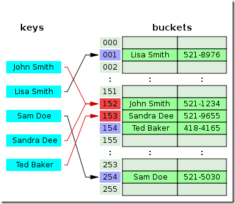
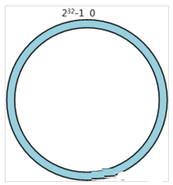
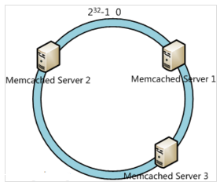

# Algorithm

## Bitmap

Bit-map 的基本思想就是用一个 bit 位来标记某个元素对应的 Value，而 Key 即是该元素。由于采用了 Bit 为单位来存储数据，因此在存储空间方面，可以大大节省。

假设有这样一个需求：在 20 亿个随机整数中找出某个数 m 是否存在其中，并假设 32 位操作系统，4G 内存。在 Java 中，int 占 4 字节，1 字节 =8 位（1 byte = 8 bit）。如果每个数字用 int 存储，那就是 20 亿个 int，因而占用的空间约为  (2000000000*4/1024/1024/1024)≈7.45G；如果按位存储就不一样了，20 亿个数就是 20 亿位，占用空间约为  (2000000000/8/1024/1024/1024)≈0.233G。

1 个 int 占 32 位，那么我们只需要申请一个 int 数组长度为 int tmp[1+N/32] 即可存储，其中 N 表示要存储的这些数中的最大值，于是乎：tmp[0]：可以表示 0~31；tmp[1]：可以表示 32~63；tmp[2]：可以表示 64~95..... 如此一来，给定任意整数 M，那么 M/32 就得到下标，M%32 就知道它在此下标的哪个位置。

```txt
32 个 bit 位可以表示 32 个数字。

|31|30|29|28|27|26|25|24|23|22|21|20|19|18|17|16|15|14|13|12|11|10|09|08|07|06|05|04|03|02|01|00|
```

### 插入、删除和查找

插入一个数，将 1 左移带代表该数字的那一位，然后与原数进行按位或操作。假设所有数据在 0~31 之间，插入数字 5，则插入后得到：原数值 | 1 << 5；删除一个数，则将 1 左移代表该数字的那一位，然后按位取反与原数按位与即可。同样的例子：原数值 & (~(1 << 5))；判断是否存在则只需判断 原数值 & (1 << 5)，如果是 0，则表示 5 不存在，反之则存在。

### 用途

大量数据的快速排序、查找、去重。--> 布隆过滤器！

优点：

>- 运算效率高，不需要进行比较和移位；
>- 占用内存少，比如 N=10000000；只需占用内存为 N/8=1250000Byte=1.25M

缺点：

>- 所有的数据不能重复。即不可对重复的数据进行排序和查找;
>- 只有当数据比较密集时才有优势

## 哈希算法

哈希表是一种以 " 键-值 (key-value)" 存储数据的结构，只要输入待查找的值即 key，即可查找到其对应的值 value。哈希的思路很简单，如果所有的键都是整数，那么就可以使用一个简单的无序数组来实现：将键作为索引，值即为其对应的值，这样就可以快速访问任意键的值。

使用哈希查找有两个步骤：使用哈希函数将被查找的键转换为数组的索引。在理想的情况下，不同的键会被转换为不同的索引值，但是在有些情况下需要处理多个键被哈希到同一个索引值的情况。因此，哈希查找的第二个步骤就是处理冲突。

哈希表是一个在时间和空间上做出权衡的经典例子。如果没有内存限制，那么可以直接将键作为数组的索引。那么所有的查找时间复杂度为 O(1)；如果没有时间限制，那么可以使用无序数组并进行顺序查找，这样只需要很少的内存。哈希表使用了适度的时间和空间来在这两个极端之间找到了平衡。只需要调整哈希函数算法即可在时间和空间上做出取舍。

### 哈希函数

哈希查找第一步就是使用哈希函数将键映射成索引。这种映射函数就是哈希函数。如果有一个保存 0-M 数组，那么就需要一个能够将任意键转换为该数组范围内的索引（0~M-1）的哈希函数。哈希函数需要易于计算并且均匀分布所有键。

键为正整数。获取正整数哈希值最常用的方法是使用除留余数法。即对于大小为素数 M 的数组，对于任意正整数 k，计算 k 除以 M 的余数。M 一般取素数。

键为字符串。将字符串作为键的时候，也可以将其作为一个大的整数，采用保留除余法。可以将组成字符串的每一个字符取值然后进行哈希。如果对每个字符去哈希值可能会比较耗时，所以可以通过间隔取 N 个字符来获取哈西值来节省时间。

### 哈希冲突

通过哈希函数，可以将键转换为数组的索引 (0-M-1)，对于两个或者多个键具有相同索引值的情况，需要有一种方法来处理这种冲突。

#### 拉链法 (Separate chaining with linked lists)

将大小为 M 的数组的每一个元素指向一个条链表，链表中的每一个节点都存储散列值为该索引的键值对，这就是拉链法。


图中，"John Smith" 和 "Sandra Dee" 通过哈希函数都指向了 152 这个索引，该索引又指向了一个链表， 在链表中依次存储了这两个字符串。

该方法的基本思想就是选择足够大的 M，使得所有的链表都尽可能的短小，以保证查找的效率。对采用拉链法的哈希实现的查找分为两步，首先是根据散列值找到等一应的链表，然后沿着链表顺序找到相应的键。

实现基于拉链表的散列表，目标是选择适当的数组大小 M，使得既不会因为空链表而浪费内存空间，也不会因为链表太而在查找上浪费太多时间。拉链表的优点在于数组大小 M 的选择不是关键性的，如果存入的键多于预期，那么查找的时间只会比选择更大的数组稍长，另外也可以使用更高效的结构来代替链表存储，比如二叉搜索树。

#### 线性探测法（Linear Probing）

线性探测法是开放寻址法解决哈希冲突的一种方法，基本原理为使用大小为 M 的数组来保存 N 个键值对，其中 M>N，需要使用数组中的空位解决碰撞冲突。



在该图中，"Ted Baker" 是有唯一的哈希值 153 的，但是由于 153 被 "Sandra Dee" 占用了。而原先 "Snadra Dee" 和 "John Smith" 的哈希值都是 152 的，但是在对 "Sandra Dee" 进行哈希的时候发现 152 已经被占用了，所以往下找发现 153 没有被占用，所以存放在 153 上，然后 "Ted Baker" 哈希到 153 上，发现已经被占用了，所以往下找，发现 154 没有被占用，所以值存到了 154 上。

开放寻址法中最简单的是线性探测法：当碰撞发生时即一个键的散列值被另外一个键占用时，直接检查散列表中的下一个位置即将索引值加 1，这样的线性探测会出现三种结果：

>- 命中，该位置的键和被查找的键相同
>- 未命中，键为空
>- 继续查找，该位置和键被查找的键不同。

实现线性探测法也很简单，需要两个大小相同的数组分别记录 key 和 value。线性探测（Linear Probing）虽然简单，但是有一些问题，它会导致同类哈希的聚集。在存入的时候存在冲突，在查找的时候冲突依然存在。

#### 性能分析

对于拉链法，查找的效率在于链表的长度，一般应该保证长度在 M/8~M/2 之间，如果链表的长度大于 M/2，可以扩充链表长度。如果长度在 0~M/8 时，可以缩小链表。对于线性探测法，也是如此，但是动态调整数组的大小需要对所有的值从新进行重新散列并插入新的表中。动态调整链表或者数组的大小以提高查询效率的同时，还应该考虑动态改变链表或者数组大小的成本。散列表长度加倍的插入需要进行大量的探测， 这种均摊成本在很多时候需要考虑。

### 一致性哈希算法

原帖见 [URL](https://www.cnblogs.com/moonandstar08/p/5405991.html)。

在做服务器负载均衡时候可供选择的负载均衡的算法有很多，包括：轮循算法 (RoundRobin)、哈希算法 (HASH)、最少连接算法 (LeastConnection)、响应速度算法 (ResponseTime)、加权法 (Weighted) 等。其中哈希算法是最为常用的算法 .

典型的应用场景是：有 N 台服务器提供缓存服务，需要对服务器进行负载均衡，将请求平均分发到每台服务器上，每台机器负责 1/N 的服务。

常用的算法是对 hash 结果取余数 (hash()modN)：对机器编号从 0 到 N-1，按照自定义的 hash() 算法，对每个请求的 hash() 值按 N 取模，得到余数 i，然后将请求分发到编号为 i 的机器。但这样的算法方法存在致命问题，如果某一台机器宕机，那么应该落在该机器的请求就无法得到正确的处理，这时需要将当掉的服务器从算法从去除，此时候会有 (N-1)/N 的服务器的缓存数据需要重新进行计算；如果新增一台机器，会有 N/(N+1) 的服务器的缓存数据需要进行重新计算。对于系统而言，这通常是不可接受的颠簸 (因为这意味着大量缓存的失效或者数据需要转移)。那么，如何设计一个负载均衡策略，使得受到影响的请求尽可能的少呢 ?

在 Memcached、Key-ValueStore、BittorrentDHT、LVS 中都采用了 ConsistentHashing 算法，可以说 ConsistentHashing 是分布式系统负载均衡的首选算法。

在大型 web 应用中，缓存可算是当今的一个标准开发配置了。在大规模的缓存应用中，应运而生了分布式缓存系统。分布式缓存系统的基本原理，大家也有所耳闻。key-value 如何均匀的分散到集群中？说到此，最常规的方式莫过于 hash 取模的方式。比如集群中可用机器适量为 N，那么 key 值为 K 的的数据请求很简单的应该路由到 hash(K)modN 对应的机器。的确，这种结构是简单的，也是实用的。但是在一些高速发展的 web 系统中，这样的解决方案仍有些缺陷。随着系统访问压力的增长，缓存系统不得不通过增加机器节点的方式提高集群的相应速度和数据承载量。增加机器意味着按照 hash 取模的方式，在增加机器节点的这一时刻，大量的缓存命不中，缓存数据需要重新建立，甚至是进行整体的缓存数据迁移，瞬间会给 DB 带来极高的系统负载，设置导致 DB 服务器宕机。那么就没有办法解决 hash 取模的方式带来的诟病吗？

假设我们有一个网站，最近发现随着流量增加，服务器压力越来越大，之前直接读写数据库的方式不太给力了，于是我们想引入 Memcached 作为缓存机制。现在我们一共有三台机器可以作为 Memcached 服务器，如下图所示：


很显然，最简单的策略是将每一次 Memcached 请求随机发送到一台 Memcached 服务器，但是这种策略可能会带来两个问题：一是同一份数据可能被存在不同的机器上而造成数据冗余，二是有可能某数据已经被缓存但是访问却没有命中，因为无法保证对相同 key 的所有访问都被发送到相同的服务器。因此，随机策略无论是时间效率还是空间效率都非常不好。

要解决上述问题只需做到如下一点：保证对相同 key 的访问会被发送到相同的服务器。很多方法可以实现这一点，最常用的方法是计算哈希。例如对于每次访问，可以按如下算法计算其哈希值：h=Hash(key)%3。其中 Hash 是一个从字符串到正整数的哈希映射函数。这样，如果我们将 MemcachedServer 分别编号为 0、1、2，那么就可以根据上式和 key 计算出服务器编号 h，然后去访问。

这个方法虽然解决了上面提到的两个问题，但是存在一些其它的问题。如果将上述方法抽象，可以认为通过：h=Hash(key)%N。这个算式计算每个 key 的请求应该被发送到哪台服务器，其中 N 为服务器的台数，并且服务器按照 0–(N-1) 编号。

这个算法的问题在于容错性和扩展性不好。所谓容错性是指当系统中某一个或几个服务器变得不可用时，整个系统是否可以正确高效运行；而扩展性是指当加入新的服务器后，整个系统是否可以正确高效运行。

现假设有一台服务器宕机了，那么为了填补空缺，要将宕机的服务器从编号列表中移除，后面的服务器按顺序前移一位并将其编号值减一，此时每个 key 就要按 h=Hash(key)%(N-1) 重新计算；同样，如果新增了一台服务器，虽然原有服务器编号不用改变，但是要按 h=Hash(key)%(N+1) 重新计算哈希值。因此系统中一旦有服务器变更，大量的 key 会被重定位到不同的服务器从而造成大量的缓存不命中。而这种情况在分布式系统中是非常糟糕的。

一个设计良好的分布式哈希方案应该具有良好的单调性，即服务节点的增减不会造成大量哈希重定位。一致性哈希算法就是这样一种哈希方案。

Hash 算法的一个衡量指标是单调性（Monotonicity），定义如下：单调性是指如果已经有一些内容通过哈希分派到了相应的缓冲中，又有新的缓冲加入到系统中。哈希的结果应能够保证原有已分配的内容可以被映射到新的缓冲中去，而不会被映射到旧的缓冲集合中的其他缓冲区。

容易看到，上面的简单 hash 算法 hash(object)%N 难以满足单调性要求。

一致性哈希算法 (Consistent Hashing Algorithm) 是一种分布式算法，常用于负载均衡。Memcachedclient 也选择这种算法，解决将 key-value 均匀分配到众多 Memcachedserver 上的问题。它可以取代传统的取模操作，解决了取模操作无法应对增删 MemcachedServer 的问题 (增删 server 会导致同一个 key, 在 get 操作时分配不到数据真正存储的 server，命中率会急剧下降)。

简单来说，一致性哈希将整个哈希值空间组织成一个虚拟的圆环，如假设某哈希函数 H 的值空间为 0-(2^32)-1（即哈希值是一个 32 位无符号整形），整个哈希空间环如下：



整个空间按顺时针方向组织。0 和 (2^32)-1 在零点中方向重合。

下一步将各个服务器使用 H 进行一个哈希，具体可以选择服务器的 ip 或主机名作为关键字进行哈希，这样每台机器就能确定其在哈希环上的位置，这里假设将上文中三台服务器使用 ip 地址哈希后在环空间的位置如下：



接下来使用如下算法定位数据访问到相应服务器：将数据 key 使用相同的函数 H 计算出哈希值 h，通根据 h 确定此数据在环上的位置，从此位置沿环顺时针 “行走”，第一台遇到的服务器就是其应该定位到的服务器。

例如我们有 A、B、C、D 四个数据对象，经过哈希计算后，在环空间上的位置如下：


根据一致性哈希算法，数据 A 会被定为到 Server1 上，D 被定为到 Server3 上，而 B、C 分别被定为到 Server2 上。

#### 容错性与可扩展性分析

下面分析一致性哈希算法的容错性和可扩展性。现假设 Server3 宕机了：


可以看到此时 A、C、B 不会受到影响，只有 D 节点被重定位到 Server2。一般的，在一致性哈希算法中，如果一台服务器不可用，则受影响的数据仅仅是此服务器到其环空间中前一台服务器（即顺着逆时针方向行走遇到的第一台服务器）之间数据，其它不会受到影响。

下面考虑另外一种情况，如果我们在系统中增加一台服务器 MemcachedServer4：


此时 A、D、C 不受影响，只有 B 需要重定位到新的 Server4。一般的，在一致性哈希算法中，如果增加一台服务器，则受影响的数据仅仅是新服务器到其环空间中前一台服务器（即顺着逆时针方向行走遇到的第一台服务器）之间数据，其它不会受到影响。

综上所述，一致性哈希算法对于节点的增减都只需重定位环空间中的一小部分数据，具有较好的容错性和可扩展性。

#### 虚拟节点

一致性哈希算法在服务节点太少时，容易因为节点分部不均匀而造成数据倾斜问题。例如我们的系统中有两台服务器，其环分布如下：


此时必然造成大量数据集中到 Server1 上，而只有极少量会定位到 Server2 上。为了解决这种数据倾斜问题，一致性哈希算法引入了虚拟节点机制，即对每一个服务节点计算多个哈希，每个计算结果位置都放置一个此服务节点，称为虚拟节点。具体做法可以在服务器 ip 或主机名的后面增加编号来实现。例如上面的情况，我们决定为每台服务器计算三个虚拟节点，于是可以分别计算 “MemcachedServer1#1”、“MemcachedServer1#2”、“MemcachedServer1#3”、“MemcachedServer2#1”、“MemcachedServer2#2”、“MemcachedServer2#3” 的哈希值，于是形成六个虚拟节点：


ConsistentHashing 最大限度地抑制了 hash 键的重新分布。另外要取得比较好的负载均衡的效果，往往在服务器数量比较少的时候需要增加虚拟节点来保证服务器能均匀的分布在圆环上。因为使用一般的 hash 方法，服务器的映射地点的分布非常不均匀。使用虚拟节点的思想，为每个物理节点（服务器）在圆上分配 100～200 个点。这样就能抑制分布不均匀，最大限度地减小服务器增减时的缓存重新分布。用户数据映射在虚拟节点上，就表示用户数据真正存储位置是在该虚拟节点代表的实际物理服务器上。

### 有界负载一致性哈希算法

当有部分资源是热点资源或者部分用户请求量比较大的时候，会出现部分节点需要处理大量请求（这些请求根据一致性哈希策略都选中了固定的部分节点），出现负载非常不均的情况，因为是一致性哈希所以这些请求没法分摊到其他节点上，导致出现持续的负载不均和热点问题。有限负载一致性哈希（Consistent Hashing with Bounded Loads） 出自论文 Consistent Hashing with Bounded Loads ，主要思路是，根据当前负载情况对所有节点限制一个最大负载，在一致性哈希中对 hash 环进行查找时将跳过达到最大负载限制的节点，通过把过载的请求转移到其他节点上来解决热点和不均衡问题。

>- R: 当前所有节点的总负载（正在处理的总请求数）
>- T: 节点总个数
>- L: 当前所有节点的平均负载
>- L = R / T
>- ε: 一个参数用于表示在平均负载的基础上能够承受的额外负载上限，可以按照实际需求进行设置（根据 vimeo 分享的经验这个值推荐设置为 0.25~1）
>- M: 节点的最大负载上限
>- M = L x ( 1 + ε ) = R x ( 1 + ε ) / T

一致性哈希中进行节点查找时，增加检查匹配的节点的负载（正在处理的请求数）是否达到负载上限 M 的操作，如果达到了上限则跳过当前节点继续往后查找。可以发现 ConsistentHashing with Bounded Loads 结合了最少连接策略和一致性哈希策略各自的优点，即平衡了负载又兼顾了一致性哈希，并且还可以通过调整转化为最少请求策略或一致性哈希策略。当ε的值是 0 的时候，就实现了最少连接策略的效果；当ε的值是无穷大的时候，就是传统的一致性哈希策略。

上面的方法是没有区分节点权重的，如果要支持节点权重的话，需要做一点改动:

>- R: 当前所有节点的总负载（正在处理的总请求数）
>- T: 所有节点的权重总和
>- L: 当前所有节点的平均负载（基于权重的平均负载）
>- L = R / T
>- W: 当前节点的权重值
>- ε: 一个参数用于表示在平均负载的基础上能够承受的额外负载上限。
>- M: 节点的最大负载上限
>- M = W x L x (1 + ε) = W x R x ( 1 + ε ) / T

一致性哈希中进行节点查找时，增加检查匹配的节点的负载（正在处理的请求数）是否达到负载上限 M 的操作，如果达到了上限则跳过当前节点继续往后查找。
可以看到主要区别是算平均负载的时候是基于节点的权重和来计算的，算负载上限的时候是按权重比来计算的。

在实现上，需要添加负载统计，每一次请求都要对总负载 +1，完成之后还要对总负载-1。每次选择节点时，要检查负载是否超出了上限。当虚拟节点数量较多时，一致性哈希的均匀度基本能够保证负载不会超过上限，只有在突发情况下有界负载算法才会生效，拦截异常的突发流量。

## 限流算法

限流的常用处理手段有：计数器、滑动窗口、漏桶、令牌。

计数器是一种比较简单的限流算法，用途比较广泛，在接口层面，很多地方使用这种方式限流。在一段时间内，进行计数，与阀值进行比较，到了时间临界点，将计数器清 0。这种方式限制了单位时间平均流量，但是无法消除突发流量。由于计数器存在临界点缺陷，后来出现了滑动窗口算法来解决。滑动窗口的意思是说把固定时间片，进行划分，并且随着时间的流逝，进行移动，这样就巧妙的避开了计数器的临界点问题。也就是说这些固定数量的可以移动的格子，将会进行计数判断阀值，因此格子的数量影响着滑动窗口算法的精度。

滑动窗口有效避免了时间临界点的问题，但是依然有时间片的概念，而漏桶算法在这方面比滑动窗口而言，更加先进。一个固定的桶，进水的速率是不确定的，但是出水的速率是恒定的，当水满的时候是会溢出的。⽽在实现时，我们⼀般会使⽤消息队列作为漏桶的实现，流量⾸先被放⼊到消息队列中排队，由固定的⼏个队列处理程序来消费流量，如果消息队列中的流量溢出，那么后续的流量就会被拒绝。这个算法的思想与消息队列削峰填⾕的作⽤相似。

```cpp
class leaky_bucket {
public:
    bool grant() {
        // 这段时间流失的水
        auto now = time(nullptr);
        int out = (int)(now - m_ts) * m_rate; // 出水的速率恒定 （可能无故流失掉一些
        // 此刻桶内剩余的水
        m_water = std::max(0, m_water - out);
        m_ts = now;
        // 限制流量
        if (m_water + 1 < m_size) {
            ++m_water;
            return true; // passed
        } else {
            return false; // denied
        }
    }

private:
    time_t m_ts; // last ts
    int m_water; // 漏桶里现有的水
    int m_size;  // 漏桶大小
    int m_rate;  // 出水的速度
};

class token_bucket {
public:
    bool grant() {
        // 这段时间产生的令牌
        auto now = time(nullptr);
        int in = (int)(now - m_ts) * m_token_rate;
        // 此刻桶内可以取得的令牌总数
        m_token_num = std::min(m_size, m_token_num + in);
        m_ts = now;
        // 限制流量
        if (m_token_num > 0) {
            --m_token_num;
            return true; // passed
        } else {
            return false; // denied
        }
    }

private:
    time_t m_ts;
    int m_size;
    int m_token_rate;
    int m_token_num;
};
```

注意到，漏桶的出水速度是恒定的，那么意味着如果瞬时大流量的话，将有大部分请求被丢弃掉（也就是所谓的溢出）。为了解决这个问题，令牌桶进行了算法改进。生成令牌的速度是恒定的，而请求去拿令牌是没有速度限制的。这意味，面对瞬时大流量，该算法可以在短时间内请求拿到大量令牌，而且拿令牌的过程并不是消耗很大的事情。（有一点生产令牌，消费令牌的意味）。不论是对于令牌桶拿不到令牌被拒绝，还是漏桶的水满了溢出，都是为了保证大部分流量的正常使用，而牺牲掉了少部分流量，这是合理的，如果因为极少部分流量需要保证的话，那么就可能导致系统达到极限而挂掉，得不偿失。

使⽤令牌桶算法就需要存储令牌的数量，如果是单机上实现限流的话，可以在进程中使⽤⼀个变量来存储；但是如果在分布式环境下，不同的机器之间⽆法共享进程中的变量，我们就⼀般会使⽤ Redis 来存储这个令牌的数量。这样的话，每次请求的时候都需要请求⼀次 Redis 来获取⼀个令牌，会增加⼏毫秒的延迟，性能上会有⼀些损耗。因此，⼀个折中的思路是： 我们可以在每次取令牌的时候，不再只获取⼀个令牌，⽽是获取⼀批令牌，这样可以尽量减少请求 Redis 的次数。

两者主要区别在于漏桶算法能够强行限制数据的传输速率，而令牌桶算法在能够限制数据的平均传输速率外，还允许某种程度的突发传输（存疑，leak_buket 若是为了实现整流，则 grant() 调用成功应当是加入执行队列？然后再由工作线程匀速消费掉，这样才是所谓的强制限制流速，token_bucket 的 grant() 调用成功后则是能直接执行的，这样便是所谓的应对较小的突发流量）。在令牌桶算法中，只要令牌桶中存在令牌，那么就允许突发地传输数据直到达到用户配置的门限，所以它适合于具有突发特性的流量。
