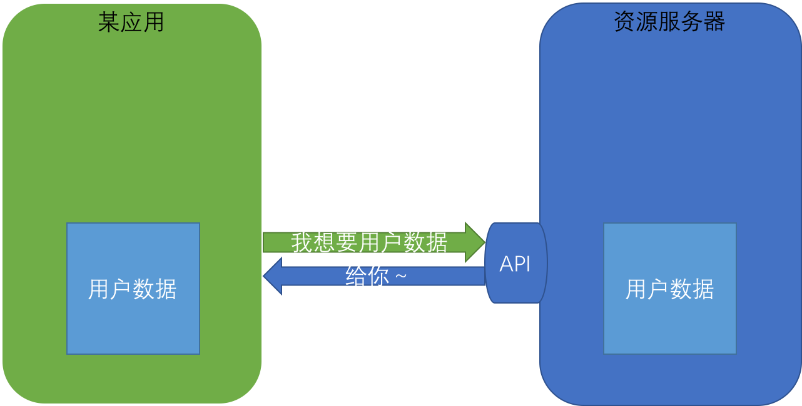

# Technology

## 延迟队列

原文[你真的知道怎么实现一个延迟队列吗 ？](https://zhuanlan.zhihu.com/p/266156267)

### Redis的ZSet

使用ZSet的有序特性，将延迟处理时间作为Score把任务Key加入ZSet（Ologn）；使用定时进程通过ZREANGEBYSCORE（Ologn+m）方法查询ZSet中Score最小的元素，检查是否需要执行任务。Score即为延迟执行的时长。

>- 避免了当一个KEY在存储了较多的延时消息后，入队操作以及查询操作速度变的问题（两个操作的时间复杂度均为O(logN)）。b.系统具有了更好的横向可扩展性，当数据量激增时，我们可以通过增加RedisKey的数量来快速的扩展整个系统，来抗住数据量的增长。
>- 每个RedisKey都对应建立一个处理进程，称为Event进程，通过上述步骤2所述的ZRANGEBYSCORE方法轮询Key，查询是否有待处理的延迟消息。所有的Event进程只负责分发消息，具体的业务逻辑通过一个额外的消息队列异步理，这么做的好处也是显而易见的：a.一方面，Event进程只负责分发消息，那么其处理消息的速度就会非常快，就不会出现因为业务逻辑复杂而导致消息堆积的情况。b.另一方面，采用一个额外的消息队列后，消息处理的可扩展性也会更好，我们可通过增加消费者进程数量来扩展整个系统的消息处理能力。
>- Event进程采用Zookeeper选主单进程部署的方式，避免Event进程宕机后RedisKey中消息堆积的情况。一旦Zookeeper的leader主机宕机，Zookeeper会自动选择新的leader主机来处理RedisKey中的消息。

从上述的讨论中我们可以看到，通过RedisZset实现延迟队列是一种理解起来较为直观，可以快速落地的方案。并且我们可以依赖Redis自身的持久化来实现持久化，使用Redis集群来支持高并发和高可用，是一种不错的延迟队列的实现方案。

### TimeWheel

时间轮时间轮算法，是一种实现延迟队列的巧妙且高效的算法，被应用在Netty，Zookeeper，Kafka等各种框架中。。

根据场景需求取舍优化，使用简易时间轮或者多层时间轮，亦可实现延迟队列。如果任务数量少且执行速度快，可以使用简易时间轮，按序轮询执行。如果任务数量多或者耗时较大，可能需要多层时间轮 + 线程池（或者用前一方案中的消息队列，当然这样视野就拔的很高了），保证时间轮运转精度和任务执行效率。

## 过载保护

### Overload Control for Scaling WeChat Microservices

概述：大规模微服务系统的过载控制必须应对后台系统的高复杂性和高动态性。所有的微服务都要纳入监控。虽然后台系统按照服务分类，但是一个业务的调用链一般要调用多项服务，每个服务又有可能调用其他的服务。一个服务过载还将会影响到上游业务，进而影响全局。然后使用集中式的全局控制又十分困难。其次，所有的服务不能完全独立，必须有一致的准入策略。否则，通过上游服务准入策略的调用被下游的准入策略拒绝导致失败，导致资源浪费和成功率降低。调用链越深，这种问题就越严重。第三，过载控制需要适应服务的变化，比如增加/减少部署等等。

DAGOR的工作流程大致如下。当客户端请求到达entry serive时，分配\<B,U\>(业务优先级/用户优先级)，在此后所有的下游调用中将一直起作用。每个微服务维护自己的准入优先级门限，并通过监控系统层的资源（如平均等待时间，BlockingQueue）来监控过载情况。如果监测到过载，则调整准入优先级门限，减少请求流量；同时通知上游服务自身准入优先级的变化，以便在上游服务尽早拒绝部分请求。（note：*此时上游可以制定流量分配策略，将部分请求分流到其他未过载的机器上，而不是直接拒绝，避免成功率降低太多，但又要注意不要使其他机器发生过载。即，机间过载控制协作*。）

DAGOR在Entry Service分配全局有效的BU优先级保证了一致性；依靠自身调控和向直属上游服务通报，将联动控制在两层而不是全局，从而降低复杂度。DAGOR不依赖任何特定于服务的信息来执行过载控制。过载控制机制具有高度的可扩展性，能够支持系统中的大量服务，同时适应服务部署的动态性。过载控制的语义可以与服务的业务逻辑解耦。

微信后台架构可以划分为Entry Leap Services/Shared Leap Services/Basic Leap Services。根据调用关系可以建模为有向图（DAG），Entry（入度为0）指向Shared/Basic，Shared指向Basic（出度为0），Shared之间也可以调用。

#### Overload Detection

DAGOR采用分布式过载控制，因此每台服务器都要监控其负载状态，以及时检测潜在的过载。对于单服务器过载检测的负载监控，可用的性能指标包括吞吐量、延迟、CPU利用率、包速率、挂起请求数、请求处理时间等。DAGOR使用挂起队列中请求的平均等待时间（或简称为排队时间）来分析服务器的负载状态。请求的排队时间由请求到达与其在服务器上启动的处理之间的时差来度量。排队时间能够反映当前机器的工作负载，而响应时间则受到本机/下游处理耗时等影响，容易出现过载误报。另外高CPU也不能够准确表述过载，只要请求能够及时处理，CPU占用率高也是正常的。

DAGOR使用窗口的方式来收集queuing time：每秒或者每2000个请求是一个窗口，计算一次当前负载。论文中给了一个微信5年来根据经验设定的、判定服务是否过载的值：请求平均queuing time超过20毫秒即为过载（默认的请求超时时间是500毫秒）。检测到过载后，就是如何应对过载了。

#### Service Admission Control

基于业务的Admission Control。微信的业务有重要程度高低，比如支付比即时通信重要，而即时通信又比朋友圈重要。微信预先定义好所有业务的优先级，保存在一个Hash Table里。没有定义的业务，默认是最低优先级。业务优先级在各个业务的入口服务（EntryServices）中打到请求元信息里。由于一个请求成功与否依赖其下游服务所有的后续请求，所以下游服务的所有后续请求也会带上相同的业务优先级。当服务过载时，会处理优先级更高的请求，丢弃优先级低的请求。

只用业务优先级决定是否丢弃请求，容易造成系统颠簸。比如支付请求突然上涨导致过载，消息请求被丢弃；丢弃消息请求后，系统负载降低了，又开始处理消息请求；然而处理消息请求又导致服务过载，又会在下一个窗口抛弃消息请求。

基于用户的Admission Control。用户优先级是由条目服务通过一个哈希函数动态生成的，该函数接受用户ID作为参数。每个条目服务每小时都更改其哈希函数。因此，来自同一个用户的请求可能在一小时内被分配给同一个用户优先级，但在不同的时间内分配给不同的用户优先级。上述用户优先级生成策略的合理性是双重的。

这样不仅保证了公平性，同时还在相对长的时间段内为个人用户提供一致的体验。它还有助于解决后续过载问题，因为具有高优先级的用户请求更有可能在整个调用图中得到处理。通过组合业务优先级和用户优先级，可以为每个业务优先级提供128个用户优先级准入级别。由于每个业务优先级的准入级别具有128个用户优先级，因此复合准入级别数量可以达到数万。复合准入级别的调整是按照用户优先级的颗粒进行的。

这里有个有趣的问题，为什么使用会话ID代替用户ID就不起作用：在遇到糟糕的服务时，这样会导致用户登录登出，那么在过载问题之上又会多出来一个用户登录问题！

自适应Admission Control。记基于业务计算的优先级是B，基于用户ID计算的优先级是U，那么请求的优先级就是(B, U)。每个服务根据自己的负载状况也会计算一个优先级(B*, U*)，并且丢弃所有(B, U) > (B*, U*)的请求（B和U都是越小越高，比较方式是，(B1, U1) < (B2, U2) <= (B1 < B2 || B1 == B2 && U1 < U2)，即先比较业务优先级，再比较用户优先级）。

算法的核心思想就是找到下一个窗口期，服务能处理过来的请求数对应的B和U。由于B和U的组合是固定的，我们直接用定长的数组记录所有的请求数（类似“桶”的想法）。在每个窗口期开始时，重置统计值。在每次处理请求时，对请求优先级对应的计数器+1。在窗口期结束时，判断服务是否过载（平均queuing time超过20毫秒）：过载，设置下个窗口能处理的请求数为当前的95%（α=5%），没有过载则为101%（β=1%），并计算对应的优先级。有了(B*, U*)，服务也可以做些优化，不需要简单粗暴的丢弃请求。

协同Admission Control。每个服务都会把自己的(B*, U*)放在请求返回值当中发送给上游服务。上游服务根据每个下游服务的过载状况决定是否实际发送请求。最终整个DAGOR过载控制流程如图。

即使没有完全按描述的那样使用DAGOR，论文作者还是列出了三个值得考虑的宝贵经验：大规模微服务架构下的过载控制必须是去中心化，每个服务必须是自动化；过载控制应该考虑各种反馈机制（例如DAGOR的协同控制），不要依赖于单一的开环启发；过载控制设计应当根据实际负载的处理行为进行。

改进：同一服务必然是由多个节点共同提供的，无论是真实的物理主机还是虚机。上文提及的过载控制感觉是按照服务为单位进行划分，而实际上同一服务内的节点负载能力和实际负载都是有差异的。在多个节点之间分配合理的请求流量，就回到了负载均衡的问题上。当其中若干节点出现过载时，是否能够将部分流量转移到其他节点，或者直接启用过载控制？或者同时启用？亦或者在监测到过载前就开始对请求流量进行调配？ [过载控制 - 负载均衡 - 主动容灾]

## 身份认证

### 基于session的认证模式

为了解决每次请求敏感资源都要带有用户名密码凭证的问题，web开发者们形成了一套基本的实践模式，就是将用户认证后的身份存储于服务端管理的会话（session）之中，以此来减少使用过程中对凭据的传输。

用户想要请求受保护资源，先要登录，想服务端发送用户名密码。服务端验证用户名密码成功之后将用户的身份验证标识存储在session 中，然后将sessionId存储在cookie 中。之后当客户再去请求受保护资源的时候，只要携带好cookie中的sessionId就可以验证其身份返回敏感数据了。

这种基于session的认证模式简单、方便、好用，所以被广泛使用。但是随着web应用的发展，其也出现了诸多不足：当服务器应用重启时，用户会被强制登出；当站点用负载均衡部署多份时，每个站点实例的session无法共享。当然，可以使用单独的session存储服务来解决这些问题，但这样会增加系统不小的复杂性与维护成本。

### 基于cookie的认证模式

使用session会产生诸多的问题，那我们是不是可以有一种类似的方案来解决这种问题呢？答案肯定是有的，那就是将认证信息直接存储在客户端的cookie中。

但是存在客户端就会面临着一系列的安全问题，例如，我直接在cookie中以用户id存储标识，那是不是用户自己篡改cookie改称别的用户id就可以切换自己的身份了呢？因此这就要涉及到cookie信息加密和解密。

除了加密与解密以外还有现在常用的一种解决方案：就是存储票据（ticket）。在用户登录成功之后，站点生成一个ticket，一方面将用户身份信息存储在服务端缓存中，以ticket为key；另一方面，将ticket存储到用户的cookie中。这样，用户再要访问敏感信息时，只需要每次都带上自己cookie中的ticket就可以了。这种方法其实和使用session很像，但是因为现在基本上缓存服务已经属于必备的基础组建了，所以并不会增加过多额外的成本，而且缓存服务相比session也比较好做长时间的数据存储。

### 多WEB应用的单点登录

基于cookie的认证模式，可以很容易实现一个单点登录系统。一般我们同一个系统的多个站点会在同一个顶级域名下（如，.baidu.com.cn），这样我们就可以让这些站点共享同一个顶级域名的cookie。这样只要一个站点登录了，所有的站点就都可以拿到登录认证信息。但是这种做法有两个缺点：1、不一定能够保障我们所有的子系统都在同一个顶级域名下；2、各个站点要分别实现一套登录认证功能。

在讨论如何解决仅仅基于cookie实现的单点登录系统的缺点之前，我们要先讨论另一个话题，就是鉴权与授权的分离。

我们一般说的登录系统指的是：识别用户身份，然后允许用户访问符合其身份权限的资源。这里边其实有两件事，识别用户身份这一步我们称之为鉴权，允许用户访问符合其身份权限的资源这一步我们称之为授权。在传统的单站点应用中，我们很少会将鉴权与授权分开来讨论，因为当时的登录功能简单。可是当代web站点的鉴权与授权都趋于多样化。比如在鉴权的时候我们可以使用账号密码、手机短信验证码、OAuth、人脸识别等等；同样不同站点对于授权的需求和权限的体系都是各不相同的。由于两者的多样化与不同，为了降低耦合，提高内聚，我们就有必要将鉴权与授权过程分开看待。

一般来讲当各站点需要同一套认证体系的时候，其实他们的鉴权体系是统一的，而授权过程则可能各不相同。

当用户访问我们的一个站点的受保护资源的时候，我们先将用户重定向到统一认证站点；如果用户未登录，则跳到统一认证站点的登录界面进行登录，登录成功之后生成一个用户的身份票据（就像工作证一样），然后将票据信息返回给用户访问的站点；如果用户已登录，则跳过登录步骤，直接将用户的身份票据返回给用户访问的站点；然后不同的站点再根据自己的授权体系，决定用户是否能够访问响应的资源。

这样我们既解决了域名可能不统一的问题，又只需要实现统一分登录认证功能。

### OAuth2

OAuth2.0本质上就是将这里的客户应用向授权服务器请求令牌与授权服务器颁发令牌的过程标准化了，根据这样一套标准与解决方案，我们就可以安全的让第三方应用访问存储在我们服务器上的用户数据。

我们有一个资源服务器，资源服务器中有一系列的用户数据。现在有一个应用想想要获取我们的用户数据。那么最简单的方法就是我们开发一个 API。

可是某天来了个恶意应用，或者是我们不想给它数据的应用，我们就会造成数据的泄漏。所以我们就需要对第三方的应用进行校验。一般业界的解决方案是给予客户应用一个 “出入证”——专业称为访问令牌（Access Token）。如果来访问的客户应用带有合法的访问令牌，则可以给他数据，否则便拒绝。

那么 Access Token 哪里来的呢？我们一般是由一个授权服务器颁发的。每个允许其访问资源的客户应用都现在我们的系统中注册一个 appkey，然后每次用这个 appkey 向我们的授权服务器申请 Access Token。

当我们获取用户数据的时候，虽然我们允许第三方的客户应用获取用户数据，用户本人却不一定允许。比如，用户在我们系统里存储了图片、文档、视频等数据，用户只允许第三方应用获取他的文档，而不允许第三方应用获取他的图片和视频。所以在我们颁发给客户应用相关权限的 Access Token 的时候，需要经过用户的同意。

令牌（token）与密码（password）的作用是一样的，都可以进入系统，但是有三点差异。

>- 令牌是短期的，到期会自动失效，用户自己无法修改。密码一般长期有效，用户不修改，就不会发生变化。
>- 令牌可以被数据所有者撤销，会立即失效。以上例而言，屋主可以随时取消快递员的令牌。密码一般不允许被他人撤销。
>- 令牌有权限范围（scope），比如只能进小区的二号门。对于网络服务来说，只读令牌就比读写令牌更安全。密码一般是完整权限。

上面这些设计，保证了令牌既可以让第三方应用获得权限，同时又随时可控，不会危及系统安全。这就是 OAuth 2.0 的优点。注意，只要知道了令牌，就能进入系统。系统一般不会再次确认身份，所以令牌必须保密，泄漏令牌与泄漏密码的后果是一样的。 这也是为什么令牌的有效期，一般都设置得很短的原因。

OAuth 2.0 的标准是 RFC 6749 文件。该文件先解释了 OAuth 是什么。OAuth 引入了一个授权层，用来分离两种不同的角色：客户端和资源所有者。资源所有者同意以后，资源服务器可以向客户端颁发令牌。客户端通过令牌，去请求数据。

这段话的意思就是，OAuth 的核心就是向第三方应用颁发令牌。然后，RFC 6749 接着写道：（由于互联网有多种场景，）本标准定义了获得令牌的四种授权方式（authorization grant ）。

也就是说，OAuth 2.0 规定了四种获得令牌的流程。你可以选择最适合自己的那一种，向第三方应用颁发令牌。下面就是这四种授权方式。

>- 授权码（authorization-code）
>- 隐藏式（implicit）
>- 密码式（password）：
>- 客户端凭证（client credentials）

注意，不管哪一种授权方式，第三方应用申请令牌之前，都必须先到系统备案，说明自己的身份，然后会拿到两个身份识别码：客户端 ID（client ID）和客户端密钥（client secret）。这是为了防止令牌被滥用，没有备案过的第三方应用，是不会拿到令牌的。

## 缓存数据库双写Cache Aside

>- 失效：应用程序先从cache取数据，没有得到，则从数据库中取数据，成功后，放到缓存中。
>- 命中：应用程序从cache中取数据，取到后返回。
>- 更新：先把数据存到数据库中，成功后，再让缓存失效。

极端情况下可能出现的问题：缓存刚好失效，A查询得到旧值，B写入数据库新值后删除缓存，A将旧值写入缓存。不过B有写数据操作耗时远大于读，这种情况很少。

其他的写入方式存在各种问题：

>- 先更新数据库，再更新缓存：若AB两个线程更新请求，执行顺序为A更新缓存-B更新缓存-B写数据库-A写数据库，导致缓存了脏数据。因此，这种方法有问题。
>- 先删除缓存，再写数据库: 若A删除缓存-B查缓存没有查数据库得到旧值并写入缓存-A写数据库写入新值，导致缓存了脏数据。因此，这种方法也有问题。而且，如果不采用给缓存设置过期时间策略，该数据永远都是脏数据。采用*延时双删策略*呢？删除缓存-写入数据-休眠一段时间-再删除缓存（二次删除可以异步方式减少性能损失），确保读请求结束，写请求可以删除读请求造成的缓存脏数据。可以，但是这个休眠时间不好掌控。
>- 先更新缓存，在更新数据库：数据库写入失败则可能给业务侧带来大麻烦。因此，这种方式有问题。
