# 分布式算法

## Paxos

[原文](https://mp.weixin.qq.com/s?__biz=MzI4NDMyNTU2Mw==&mid=2247483695&idx=1&sn=91ea422913fc62579e020e941d1d059e#rd)

### 什么是 paxos

一致性协议

Paxos 是一个一致性协议。什么叫一致性？一致性有很多种，也从强到弱分了很多等级，如线性一致性，因果一致性，最终一致性等等。什么是一致？这里举个例子，三台机器，每台机器的磁盘存储为 128 个字节，如果三台机器这 128 个字节数据都完全相同，那么可以说这三台机器是磁盘数据是一致的，更为抽象的说，就是多个副本确定同一个值，大家记录下来同一个值，那么就达到了一致性。

Paxos 能达到什么样的一致性级别？这是一个较为复杂的问题。一致性往往不取决与客观存在的事实，如 3 台机器虽然拥有相同的数据，但是数据的写入是一个过程，有时间的先后，而更多的一致性取决于观察者，观察者看到的并未是最终的数据。

为何说是一个协议而不是一个算法，可以这么理解，算法是设计出来服务于这个协议的，如同法律是协议，那么算法就是各种机构的执行者，使得法律的约束能得到保证。Paxos 的协议其实很简单，就三条规定，我认为这三条规定也是 paxos 最精髓的内容，各个执行者奋力的去保护这个协议，使得这个协议的约束生效，自然就得到了一致性。

分布式环境

为何要设计出这么一套协议，其他协议不行么。如最容易想到的，一个值 A，往 3 台机器都写一次，这样一套简单的协议，能不能达到一致性的效果？这里就涉及到另外一个概念，Paxos 一致性协议是在特定的环境下才需要的，这个特定的环境称为异步通信环境。而恰恰，几乎所有的分布式环境都是异步通信环境，在计算机领域面对的问题，非常需要 Paxos 来解决。

异步通信环境指的是消息在网络传输过程中，可能发生丢失、延迟、乱序现象。在这种环境下，上面提到的三写协议就变得很鸡肋了。消息乱序是一个非常恶劣的问题，这个问题导致大部分协议在分布式环境下都无法保证一致性，而导致这个问题的根本原因是网络包无法控制超时，一个网络包可以在网络的各种设备交换机等停留数天，甚至数周之久，而在这段时间内任意发出的一个包，都会跟之前发出的包产生乱序现象。无法控制超时的原因更多是因为时钟的关系，各种设备以及交换机时钟都有可能错乱，无法判断一个包的真正到达时间。

异步通信环境并非只有 paxos 能解决一致性问题，经典的两阶段提交也能达到同样的效果，但是分布式环境里面，除了消息网络传输的恶劣环境，还有另外一个让人痛心疾首的，就是机器的宕机，甚至永久失联。在这种情况下，两阶段提交将无法完成一个一致性的写入，而 paxos，只要多数派机器存活就能完成写入，并保证一致性。

至此，总结一下 paxos 就是一个在异步通信环境，并容忍在只有多数派机器存活的情况下，仍然能完成一个一致性写入的协议。

提议者

前面讲了这么多都是协议协议，在分布式环境当中，协议作用就是每台机器都要扮演一个角色，这个角色严格遵守这个协议去处理消息。在 paxos 论文里面这个角色称之为 Acceptor，这个很好理解。大家其实更关心另外一个问题，到底谁去发起写入请求，论文里面介绍发起写入请求的角色为提议者，称之为 Proposer，Proposer 也是严格遵守 paxos 协议，通过与各个 Acceptor 的协同工作，去完成一个值的写入。在 paxos 里面，Proposer 和 Acceptor 是最重要的两个角色。

### Paxos 是用来干什么的

确定一个值

既然说到写入数据，到底怎么去写？写一次还是写多次，还是其他？这也是我一开始苦恼的问题，相信很多人都会很苦恼。

这里先要明确一个问题，paxos 到底在为谁服务？更确定来说是到底在为什么数据服务？还是引上面的例子，paxos 就是为这 128 个字节的数据服务，paxos 并不关心外面有多少个提议者，写入了多少数据，写入的数据是不是一样的，paxos 只会跟你说，我确定了一个值，当这个值被确定之后，也就是这 128 个字节被确定了之后，无论外面写入什么，这个值都不会改变再改变了，而且三台机确定的值肯定是一样的。

说到这估计肯定会有人蒙逼了，说实话我当时也蒙逼了，我要实现一个存储服务啊，我要写入各种各样的数据啊，你给我确定这么一个值，能有啥用？但先抛开这些疑问，大家先要明确这么一个概念，paxos 就是用来确定一个值用的，而且大家这里就先知道这么个事情就可以了，具体 paxos 协议是怎样的，怎么通过协议里面三条规定来获得这样的效果的，怎么证明的等等理论上的东西，都推荐去大家去看看论文，但是先看完本文再看，会得到另外的效果。

如下图，有三台机器（后面为了简化问题，不做特别说明都是以三台机器作为讲解例子），每台机器上运行这 Acceptor 来遵守 paxos 协议，每台机器的 Acceptor 为自己的一份 Data 数据服务，可以有任意多个 Proposer。当 paxos 协议宣称一个值被确定（Chosen）后，那么 Data 数据就会被确定，并且永远不会被改变。

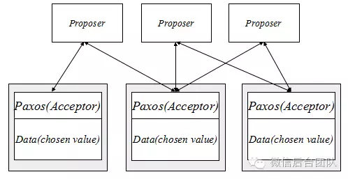

Proposer 只需要与多数派的 Acceptor 交互，即可完成一个值的确定，但一旦这个值被确定下来后，无论 Proposer 再发起任何值的写入，Data 数据都不会再被修改。Chosen value 即是被确定的值，永远不会被修改。

确定多个值

对我们来说，确定一个值，并且当一个值确定后是永远不能被修改的，很明显这个应用价值是很低的。虽然我都甚至还不知道确定一个值能用来干嘛，但如果我们能有办法能确定很多个值，那肯定会比一个值有用得多。我们先来看下怎么去确定多个值。

上文提到一个三个 Acceptor 和 Proposer 各自遵守 paxos 协议，协同工作最终完成一个值的确定。这里先定义一个概念，Proposer，各个 Acceptor，所服务的 Data 共同构成了一个大的集合，这个集合所运行的 paxos 算法最终目标是确定一个值，我们这里称这个集合为一个 paxos instance，即一个 paxos 实例。

一个实例可以确定一个值，那么多个实例自然可以确定多个值，很简单的模型就可以构建出来，只要我们同时运行着多个实例，那么我们就能完成确定多个值的目标。

这里强调一点，每个实例必须是完全独立，互不干涉的。意思就是说 Acceptor 不能去修改其他实例的 Data 数据，Proposer 同样也不能跨越实例去与其他实例的 Acceptor 交互。

如下图，三台机器每台机器运行两个实例，每个实例独立运作，最终会产生两个确定的值。这里两个实际可以扩展成任意多个。

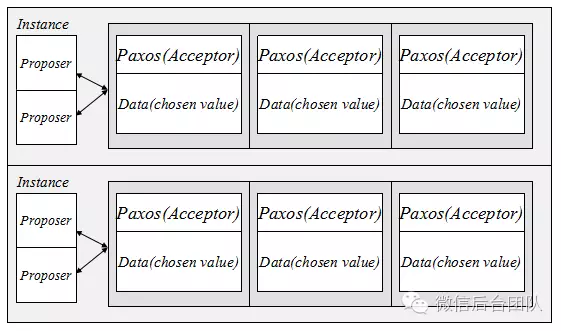

至此，实例 (Instance) 以成为了我现在介绍 paxos 的一个基本单元，一个实例确定一个值，多个实例确定多个值，但各个实例独立，互不干涉。

然而比较遗憾的一点，确定多个值，仍然对我们没有太大的帮助，因为里面最可恨的一点是，当一个值被确定后，就永远无法被修改了，这是我们不能接受的。大部分的存储服务可能都需要有一个修改的功能。

有序的确定多个值

我们需要转换一下切入点，也许我们需要 paxos 确定的值，并不一定是我们真正看到的数据。我们观察大部分存储系统，如 LevelDB，都是以 AppendLog 的形式，确定一个操作系列，而后需要恢复存储的时候都可以通过这个操作系列来恢复，而这个操作系列，正是确定之后就永远不会被修改的。到这已经很豁然开朗了，只要我们通过 paxos 完成一个多机一致的有序的操作系列，那么通过这个操作系列的演进，可实现的东西就很有想象空间了，存储服务必然不是问题。

如何利用 paxos 有序的确定多个值？上文我们知道可以通过运行多个实例来完成确定多个值，但为了达到顺序的效果，需要加强一下约束。

首先给实例一个编号，定义为 i，i 从 0 开始，只增不减，由本机器生成，不依赖网络。其次，我们保证一台机器任一时刻只能有一个实例在工作，这时候 Proposer 往该机器的写请求都会被当前工作的实例受理。最后，当编号为 i 的实例获知已经确定好一个值之后，这个实例将会被销毁，进而产生一个编号为 i+1 的实例。

基于这三个约束，每台机器的多个实例都是一个连续递增编号的有序系列，而基于 paxos 的保证，同一个编号的实例，确定的值都是一致的，那么三台机都获得了一个有序的多个值。

下面结合一个图示来详细说明一下这个运作过程以及存在什么异常情况以及异常情况下的处理方式。

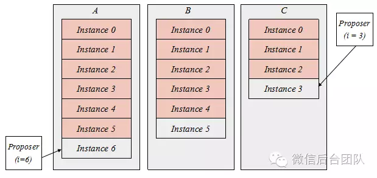

图中 A,B,C 代表三个机器，红色代表已经被销毁的实例，根据上文约束，最大的实例就是当前正在工作的实例。A 机器当前工作的实例编号是 6，B 机是 5，而 C 机是 3。为何会出现这种工作实例不一样的情况？首先解释一下 C 机的情况，由于 paxos 只要求多数派存活即可完成一个值的确定，所以假设 C 出现当机或者消息丢失延迟等，都会使得自己不知道 3-5 编号的实例已经被确定好值了。而 B 机比 A 机落后一个实例，是因为 B 机刚刚参与完成实例 5 的值的确定，但是他并不知道这个值被确定了。上面的情况与其说是异常情况，也可以说是正常的情况，因为在分布式环境，发生这种事情是很正常的。

下面分析一下基于图示状态的对于 C 机的写入是如何工作的。C 机实例 3 处理一个新的写入，根据 paxos 协议的保证，由于实例 3 已经确定好一个值了，所以无论写入什么值，都不会改变原来的值，所以这时候 C 机实例 3 发起一轮 paxos 算法的时候就可以获知实例 3 真正确定的值，从而跳到实例 4。但在工程实现上这个事情可以更为简化，上文提到，各个实例是独立，互不干涉的，也就是 A 机的实例 6，B 机的实例 5 都不会去理会 C 机实例 3 发出的消息，那么 C 机实例 3 这个写入是无法得到多数派响应的，自然无法写入成功。

再分析一下 A 机的写入，同样实例 6 无法获得多数派的响应，同样无法写入成功。同样假如 B 机实例 5 有写入，也是写入失败的结果，那如何使得能继续写入，实例编号能继续增长呢？这里引出下一个章节。

实例的对齐 (Learn)

上文说到每个实例里面都有一个 Acceptor 的角色，这里再增加一个角色称之为 Learner，顾名思义就是找别人学习，她回去询问别的机器的相同编号的实例，如果这个实例已经被销毁了，那说明值已经确定好了，直接把这个值拉回来写到当前实例里面，然后编号增长跳到下一个实例再继续询问，如此反复，直到当前实例编号增长到与其他机器一致。

由于约束里面保证仅当一个实例获知到一个确定的值之后，才能编号增长开始新的实例，那么换句话说，只要编号比当前工作实例小的实例（已销毁的），他的值都是已经确定好的。所以这些值并不需要再通过 paxos 来确定了，而是直接由 Learner 直接学习得到即可。

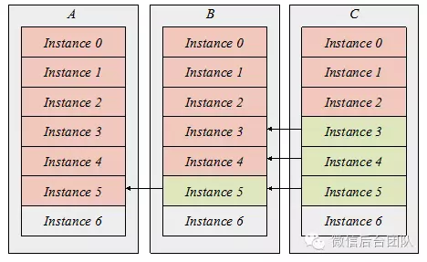

### 如何应用 paxos

状态机

一个有序的确定的值，也就是日志，可以通过定义日志的语义进行重放的操作，那么这个日志是怎么跟 paxos 结合起来的呢？我们利用 paxos 确定有序的多个值这个特点，再加上这里引入的一个状态机的概念，结合起来实现一个真正有工程意义的系统。

状态机这个名词大家都不陌生，一个状态机必然涉及到一个状态转移，而 paxos 的每个实例，就是状态转移的输入，由于每台机器的实例编号都是连续有序增长的，而每个实例确定的值是一样的，那么可以保证的是，各台机器的状态机输入是完全一致的。根据状态机的理论，只要初始状态一致，输入一致，那么引出的最终状态也是一致的。而这个状态，是有无限的想象空间，你可以用来实现非常多的东西。

如下图这个例子是一个状态机结合 paxos 实现了一个具有多机一致的 KV 系统。

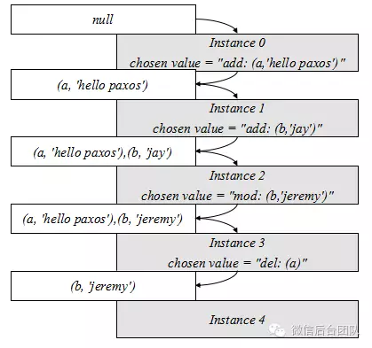

实例 0-3 的值都已经被确定，通过这 4 个值最终引出 (b, ‘jeremy’) 这个状态，而各台机器实例系列都是一致的，所以大家的状态都一样，虽然引出状态的时间有先后，但确定的实例系列确定的值引出确定的状态。

下图例子告诉大家 Proposer，Acceptor，Learner，State machine 是如何协同工作的。

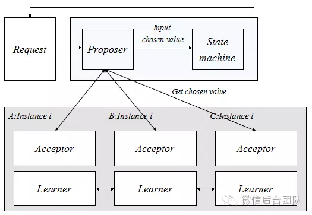

一个请求发给 Proposer，Proposer 与相同实例编号为 x 的 Acceptor 协同工作，共同完成一值的确定，之后将这个值作为状态机的输入，产生状态转移，最终返回状态转移结果给发起请求者。

### 工程化

我们需要多个角色尽量在一起

上文提到一个实例，需要有 Proposer 和 Acceptor 两个角色协同工作，另外还要加以 Learner 进行辅助，到了应用方面又加入了 State machine，这里面势必会有很多状态需要共享。如一个 Proposer 必须于 Acceptor 处于相同的实例才能工作，那么 Proposer 也就必须知道当前工作的实例是什么，又如 State machine 必须知道实例的 chosen value 是啥，而 chosen value 是存储于 Acceptor 管理的 Data 数据中的。在概念上，这些角色可以通过任意的通信方式进行状态共享，但真正去实现，我们都会尽量基于简单，高性能出发，一般我们都会将这些角色同时融合在一个机器，一个进程里面。

下图例子是一个工程上比较常规的实现方式。

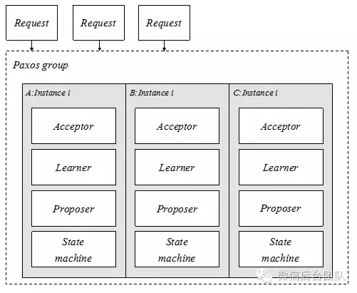

这里提出一个新的概念，这里三台机器，每台机器运行着相同的实例 i，实例里整合了 Acceptor，Proposer，Learner，State machine 四个角色，三台机器的相同编号实例共同构成了一个 paxos group 的概念，一个请求只需要灌进 paxos group 里面就可以了，跟根据 paxos 的特点，paxos group 可以将这个请求可以随意写往任意一个 Proposer，由 Proposer 来进行提交。Paxos group 是一个虚设的概念，只是为了方便解释，事实上是请求随意丢到三台机任意一个 Proposer 就可以了。

那么具体这四个角色是如何工作的呢。首先，由于 Acceptor 和 Proposer 在同一个进程里面，那么保证他们处于同一个实例是很简单的事情，其次，当一个值被确认之后，也可以很方便的传送给 State machine 去进行状态的转移，最后当出现异常状态，实例落后或者收不到其他机器的回应，剩下的事情就交给 Learner 去解决，就这样一整合，一下事情就变得简单了。

需要严格的落盘

Paxos 协议的运作工程需要做出很多保证 (Promise)，这个意思是我保证了在相同的条件下我一定会做出相同的处理，如何能完成这些保证？众所周知，在计算机里面，一个线程，进程，甚至机器都可能随时挂掉，而当他再次启动的时候，磁盘是他恢复记忆的方法，在 paxos 协议运作里面也一样，磁盘是记录下这些保证条目的介质。

而一般的磁盘写入是有缓冲区的，当机器当机，这些缓冲区仍然未刷到磁盘，那么就会丢失部分数据，导致保证失效，所以在 paxos 做出这些保证的时候，落盘一定要非常严格，严格的意思是当操作系统告诉我写盘成功，那么无论任何情况都不会丢失。这个我们一般使用 fsync 来解决问题，也就是每次进行写盘都要附加一个 fsync 进行保证。

Fsync 是一个非常重的操作，也因为这个，paxos 最大的瓶颈也是在写盘上，在工程上，我们需要尽量通过各种手段，去减少 paxos 算法所需要的写盘次数。

万一磁盘 fsync 之后，仍然丢失或者数据错乱怎么办？这个称之为拜占庭问题，工程上需要一系列的措施检测出这些拜占庭错误，然后选择性的进行数据回滚或者直接丢弃。

需要一个 Leader

由于看这篇文章的读者未必知道 paxos 理论上是如何去确定一个值的，这里简单说明一下，paxos 一个实例，支持任意多个 Proposer 同时进行写入，但是最终确定出来一个相同的值，里面是运用了一些类似锁的方法来解决冲突的，而越多的 Proposer 进行同时写入，冲突的剧烈程度会更高，虽然完全不妨碍最终会确定一个值，但是性能上是比较差的。所以这里需要引入一个 Leader 的概念。

Leader 就是领导者的意思，顾名思义我们希望有一个 Proposer 的领导者，优先由他来进行写入，那么当在只有一个 Proposer 在进行写入的情况下，冲突的概率是极小的，这样性能会得到一个飞跃。这里再次重申一下，Leader 的引入，不是为了解决一致性问题，而是为了解决性能问题。

由于 Leader 解决的是性能问题而非一致性问题，即使 Leader 出错也不会妨碍正确性，所以我们只需要保证大部分情况下只有一个 Proposer 在工作就行了，而不用去保证绝对的不允许出现两个 Proposer 或以上同时工作，那么这个通过一些简单的心跳以及租约就可以做到，实现也是非常简单，这里就不展开解释。

我们需要状态机记录下来输入过的最大实例编号

状态机可以是任何东西，可以是 kv，可以是 mysql 的 binlog，在 paxos 实例运行时，我们可以保证时刻与状态机同步，这里同步的意思是指状态机输入到的实例的最大编号和 paxos 运行当中认为已经确认好值的实例最大编号是一样的，因为当一个实例已经完成值的确认之后，我们必须确保已经输入到状态机并且进行了状态转移，之后我们才能开启新的实例。但当机器重启或者进程重启之后，状态机的数据可能会由于自身实现问题，或者磁盘数据丢失而导致回滚，这个我们没办法像上文提到的 fsync 一样进行这么强的约束，所以提出了一种方法，状态机必须严格的记得自己输入过的最大实例编号。

这个记录有什么用？在每次启动的时候，状态机告诉 paxos 最大的实例编号 x，而 paxos 发现自己最大的已确定值的实例编号是 y，而 x < y. 那这时候怎么办，只要我们有 (x, y] 的 chosen value，我们重新把这些 value 一个一个输入到状态机，那么状态机的状态就会更新到 y 了，这个我们称之为启动重放。

这样对状态机的要求将尽量简单，只需要严格的记录好这么一个编号就可以了。当然不记录，每次从 0 开始也可以，但这样 paxos 需要从 0 开始重放，是一个蠢方法。

异步消息处理模型

上文说到分布式环境是一个异步通信环境，而 paxos 解决了基于这种环境下的一致性问题，那么一个显而易见的特点就是我们不知道也不确定消息何时到达，是否有序到达，是否到达，我们只需要去遵守 paxos 协议，严格的处理每一条到达的消息即可，这跟 RPC 模型比较不一样，paxos 的特点是有去无回。

这里先定义一个名词叫 paxos 消息，这里指的是 paxos 为了去确定一个值，算法运行过程中需要的通信产生的消息。下图通过一个异步消息处理模型去构建一个响应 paxos 消息系统，从而完成 paxos 系统的搭建。

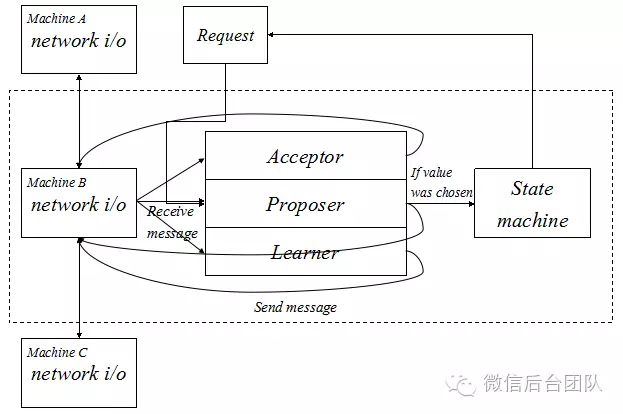

这里分为四个部分：

>- Request，即外部请求，这个请求直接输入到 Proposer 里面，由 Proposer 尝试完成一个值的确定。
>- Network i/o，网络 i/o 处理，负责 paxos 内部产生的消息的发送与接收，并且只处理 paxos 消息，采用私有端口，纯异步，各台机器之前的 network i/o 模块互相通信。
>- Acceptor，Proposer，Learner。用于响应并处理 paxos 消息。
>- State machine，状态机，实例确定的值 (chosen value) 的应用者。

工作流程：

>- 收到 Request，由 Proposer 处理，如需要发送 paxos 消息，则通过 network i/o 发送。
>- Net work i/o 收到 paxos 消息，根据消息类型选择 Acceptor，Proposer，或 Leaner 处理，如处理后需要发送 paxos 消息，则通过 network i/o 发送。
>- Proposer 通过 paxos 消息获知 chosen value，则输入 value 到 State machine 完成状态转移，最终通知 Request 转移结果，完成一个请求的处理。
>- 当 paxos 完成一个值的确认之后，所有当前实例相关角色状态进行清空并初始化进行下一个编号的实例。

### 生产级的 paxos 库

RTT 与写盘次数的优化

虽然经过我们在工程化上做的诸多要求，我们可以实现出一个基于 paxos 搭建的，可挂载任意状态机，并且能稳定运行的系统，但性能远远不够。在性能方面需要进行优化，方能上岗。由于上文并未对 paxos 理论做介绍，这里大概说明一下朴素的 paxos 算法，确定一个值，在无冲突的情况下，需要两个 RTT，以及每台机器的三次写盘。这个性能想象一下在我们在线服务是非常惨烈的。为了达到生产级，最终我们将这个优化成了一个 RTT 以及每台机器的一次写盘。(2,3) 优化到 (1,1)，使得我们能真正在线上站稳脚跟。但由于本文的重点仍然不在理论，这里具体优化手段就暂不多做解释。

同时运行多个 paxos group

由于我们实例运行的方式是确保 i 实例的销毁才能运行 i+1 实例，那么这个请求的执行明显是一个串行的过程，这样对 cpu 的利用是比较低的，我们得想办法将 cpu 利用率提升上来。

一个 paxos group 可以完成一个状态机的输入，但如果我们一台机器同时有多个状态机呢？比如我们可以同时利用 paxos 实现两种业务，每个业务对应一个状态机，互不关联。那么一个 paxos group 分配一个端口，我们即可在一台机器上运行多个 paxos group，各自端口不同，互相独立。那么 cpu 利用率将能大幅提升。

比如我们想实现一个分布式的 kv，那么对于一台机器服务的 key 段，我们可以再在里面分割成多个 key 段，那每个小 key 段就是一个独立的状态机，每个状态机搭配一个独立 paxos group 即可完成同时运行。

但一台机器搞几十个，几百个端口也是比较龌龊的手法，所以我们在生产级的 paxos 库上，实现了基于一个 network i/o 搭配多组 paxos group 的结构。

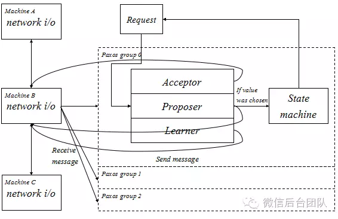

如上图，每个 group 里面都有完整的 paxos 逻辑，只需要给 paxos 消息增加一个 group 的标识，通过 network i/o 的处理，将不同 group 的消息输送到对应的 group 里面处理。这样我们一台机器只需要一个私有端口，即可完成多个状态机的并行处理。

至此我们可以获得一个多个 paxos group 的系统，完整结构如下：

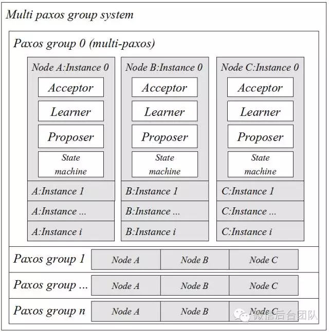

更快的对齐数据

上文说到当各台机器的当前运行实例编号不一致的时候，就需要 Learner 介入工作来对齐数据了。Learner 通过其他机器拉取到当前实例的 chosen value，从而跳转到下一编号的实例，如此反复最终将自己的实例编号更新到与其他机器一致。那么这里学习一个实例的网络延时代价是一个 RTT。可能这个延迟看起来还不错，但是当新的数据仍然通过一个 RTT 的代价不断写入的时候，而落后的机器仍然以一个 RTT 来进行学习，这样会出现很难追上的情况。

这里需要改进，我们可以提前获取差距，批量打包进行学习，比如 A 机器 Learner 记录当前实例编号是 x，B 机器是 y，而 x < y，那么 B 机器通过通信获取这个差距，将 (x,y] 的 chosen value 一起打包发送给 A 机器，A 机器进行批量的学习。这是一个很不错的方法。

但仍然不够快，当落后的数据极大，B 机器发送数据需要的网络耗时也将变大，那么发送数据的过程中，A 机器处于一种空闲状态，由于 paxos 另外一个瓶颈在于写盘，如果不能利用这段时间来进行写盘，那性能仍然堪忧。我们参考流式传输，采用类似的方法实现 Learner 的边发边学，B 机器源源不断的往 A 机器输送数据，而 A 机器只需要收到一个实例最小单元的包体，即可立即解开进行学习并完成写盘。

具体的实现大概是先进行一对一的协商，建立一个 Session 通道，在 Session 通道里直接采用直塞的方式无脑发送数据。当然也不是完全的无脑，Session 通过心跳机制进行维护，一旦 Session 断开即停止发送。

如何删除 Paxos 数据

Paxos 数据，即通过 paxos 确认下来的有序的多个值，后面我们称之这个为 paxos log，这些 log 作为状态机的输入，是一个源源不断的。状态机的状态是有限的，但输入是无限的，但磁盘的空间又是有限的，所以输入必然不能长期保留，我们必须找到方法来把它删除掉。

上文说到我们要求状态机记录下来输入过的最大实例编号，这里定义为 Imax，那么每次启动的时候是从这个编号后开始重放 paxos log，也就是说小于等于这个编号 Imax 数据是没用的了，它不会再次使用，可以直接删除掉。但这个想法不够周全，因为 paxos 是允许少于多数派的机器挂掉的，这个挂掉可能是机器永远离线。而这种情况我们一般是用一台新的机器代替。这台新的机器要干什么？他要从 0 开始重放 paxos log，而这些 paxos log 从哪里来？肯定是 Learner 找别的机器拷贝过来的。那别的机器删了怎么办？凉拌。

但也并不是没办法了，我可以把这台机状态机相关的数据全部拷贝到新机，然后就可以从 Imax 来启动了，那么自然就不需要 [0,Imax] 的 paxos log 了。但是状态机的数据是无时无刻不在写入的，一个正在写入的数据去拷贝出来，出现什么情况都是不可预期的，所以这个方法并不能简单的实现，什么？停机拷数据？别逗了。但这个思路给了我们一个启示。

我们需要的是一个状态机的镜像数据，这个数据在我们需要去拷贝的时候是可以随时停止写入的，那么只要我们有了这个镜像数据，我们就可以删除 paxos log 了。

Checkpoint

这个状态机的镜像数据我们就称之为 Checkpoint。如何去生成 Checkpoint，一个状态机能在不停写的情况下生成一个镜像数据么？答案是不确定的，看你要实现的状态机是什么，有的或许可以并很容易，有的可以但很难，有得可能根本无法实现。那这个问题又抛回给 paxos 库了，我要想办法去给他生成一个镜像数据，并且由我控制。

一个状态机能构建出一份状态数据，那么搞一个镜像状态机就可以同样构建出一份镜像状态数据了。

如上图，用两个状态转移完全一致的状态机，分别管理不同的状态数据，通过灌入相同的 paxos log，最终出来的状态数据是完全一致的。

在真正生产级的 paxos 库里面，这个特性太为重要了。我们实际实现通过一个异步线程来构建这个镜像数据，而当发现其他机器需要获取这份数据的时候，可以很轻易的停止线程的工作，使得这份数据不再写入。最后发送给别的机器使用。

在目前的实现版本，我们真正做到了删 paxos log，新机启动获取 checkpoint，数据对齐的完全自动化。也就是说，首先程序会根据磁盘使用情况自动删除 paxos log，其次，程序自动的通过镜像状态机生成 checkpoint，最后，当一个新机器启动的时候，可以自动的获取到 checkpoint，然后通过 Learner 自动的对齐剩下的数据，从而自动的完成无人工介入的机器更换。

### 所以什么时 Paxos 呢

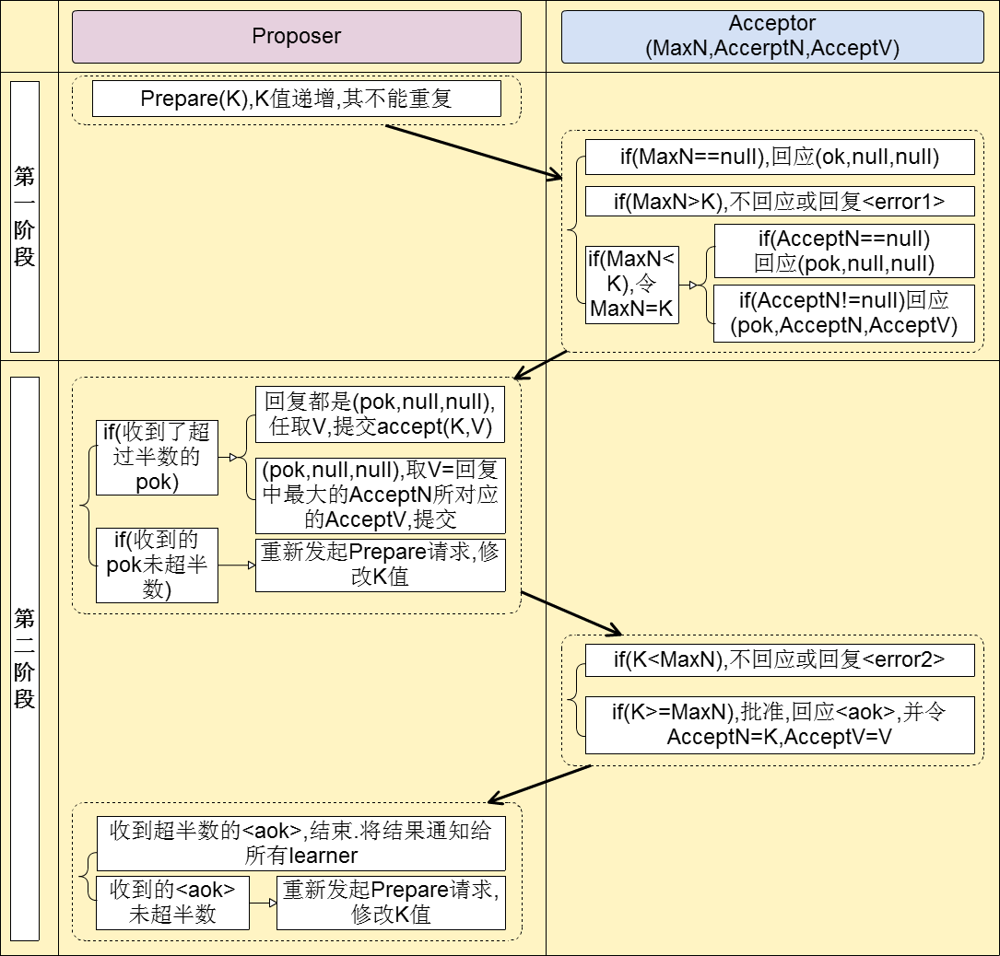

工程实践上根据具体的业务场景，或保证强一致 (safety)，或在节点宕机、网络分化的时候保证可用 (liveness)。2PC、3PC 是相对简单的解决一致性问题的协议。

2PC(tow phase commit) 两阶段提交，顾名思义它分成两个阶段，先由一方进行提议 (propose) 并收集其他节点的反馈 (vote)，再根据反馈决定提交 (commit) 或中止 (abort) 事务。我们将提议的节点称为协调者 (coordinator)，其他参与决议节点称为参与者 (participants, 或 cohorts)。

在阶段 1 中，coordinator 发起一个提议，分别问询各 participant 是否接受。在阶段 2 中，coordinator 根据 participant 的反馈，提交或中止事务，如果 participant 全部同意则提交，只要有一个 participant 不同意就中止。

在异步环境 (asynchronous) 并且没有节点宕机 (fail-stop) 的模型下，2PC 可以满足全认同、值合法、可结束，是解决一致性问题的一种协议。但如果再加上节点宕机 (fail-recover) 的考虑，2PC 是否还能解决一致性问题呢？coordinator 如果在发起提议后宕机，那么 participant 将进入阻塞 (block) 状态、一直等待 coordinator 回应以完成该次决议。这时需要另一角色把系统从不可结束的状态中带出来，我们把新增的这一角色叫协调者备份 (coordinator watchdog)。coordinator 宕机一定时间后，watchdog 接替原 coordinator 工作，通过问询 (query) 各 participant 的状态，决定阶段 2 是提交还是中止。这也要求 coordinator/participant 记录 (logging) 历史状态，以备 coordinator 宕机后 watchdog 对 participant 查询、coordinator 宕机恢复后重新找回状态。

从 coordinator 接收到一次事务请求、发起提议到事务完成，经过 2PC 协议后增加了 2 次 RTT(propose+commit)，带来的时延 (latency) 增加相对较少。

3PC(three phase commit) 即三阶段提交，既然 2PC 可以在异步网络 + 节点宕机恢复的模型下实现一致性，那还需要 3PC 做什么，3PC 是什么鬼？

在 2PC 中一个 participant 的状态只有它自己和 coordinator 知晓，假如 coordinator 提议后自身宕机，在 watchdog 启用前一个 participant 又宕机，其他 participant 就会进入既不能回滚、又不能强制 commit 的阻塞状态，直到 participant 宕机恢复。这引出两个疑问：

>- 能不能去掉阻塞，使系统可以在 commit/abort 前回滚 (rollback) 到决议发起前的初始状态。
>- 当次决议中，participant 间能不能相互知道对方的状态，又或者 participant 间根本不依赖对方的状态。

相比 2PC，3PC 增加了一个准备提交 (prepare to commit) 阶段来解决以上问题。coordinator 接收完 participant 的反馈 (vote) 之后，进入阶段 2，给各个 participant 发送准备提交 (prepare to commit) 指令。participant 接到准备提交指令后可以锁资源，但要求相关操作必须可回滚。coordinator 接收完确认 (ACK) 后进入阶段 3、进行 commit/abort，3PC 的阶段 3 与 2PC 的阶段 2 无异。协调者备份 (coordinator watchdog)、状态记录 (logging) 同样应用在 3PC。

participant 如果在不同阶段宕机，我们来看看 3PC 如何应对：

>- 阶段 1: coordinator 或 watchdog 未收到宕机 participant 的 vote，直接中止事务；宕机的 participant 恢复后，读取 logging 发现未发出赞成 vote，自行中止该次事务；
>- 阶段 2: coordinator 未收到宕机 participant 的 precommit ACK，但因为之前已经收到了宕机 participant 的赞成反馈 (不然也不会进入到阶段 2)，coordinator 进行 commit；watchdog 可以通过问询其他 participant 获得这些信息，过程同理；宕机的 participant 恢复后发现收到 precommit 或已经发出赞成 vote，则自行 commit 该次事务;
>- 阶段 3: 即便 coordinator 或 watchdog 未收到宕机 participant 的 commit ACK，也结束该次事务；宕机的 participant 恢复后发现收到 commit 或者 precommit，也将自行 commit 该次事务。

因为有了准备提交 (prepare to commit) 阶段，3PC 的事务处理延时也增加了 1 个 RTT，变为 3 个 RTT(propose+precommit+commit)，但是它防止 participant 宕机后整个系统进入阻塞态，增强了系统的可用性，对一些现实业务场景是非常值得的。

### 再看 Paxos 证明过程

场景描述: prposer 发出一些议案，可能被 acceptor Accept，只要被足够多的 acceptor Accept 则意味着该议案被 chosen，同时该议案的 alue 被 chosen。

达成目标：只能有一个 value 被 chosen。

足够多：或者说大多数 Q，集合概念。Q 是全体成员的子集，任意两个不同的 Q 的交集不为空。

acceptor 的初始 Accept

P1. An acceptor must accept the first proposal that it receives. 一个 acceptor 必须 Accept 它接收的第一个议案。P1 就面临了一个抉择问题，一个 acceptor 还能不能 accept 其他议案？即 acceptor 是否允许 accept 多个议案？如果不能 accept 多个议案，则很可能无法形成过半，目前弃用。如果可以 accept 多个议案，又要保证我们的目标：只能有一个 value 被 chosen。这就引出了如下 P2 要求来做到我们的目标。

P2-对结果要求

P2：If a proposal with value v is chosen, then every higher-numbered proposal that is chosen has value v. 如果一个 value 为 v 的议案被 chosen 了，则更高的议案必须含有 value v 才能被 chosen。

有了这个约束，我们就能保证在多个议案被 chosen 的情况下，只有一个 value 被 chosen。P2 更像是对 chosen 一个议案的要求，如果要想实现它，必须把它落实在 acceptor 的 Accept 上，那就引出了下面的 P2a 的要求。

P2a-对 acceptor 的 accept 要求

P2a： If a proposal with value v is chosen, then every higher-numbered proposal accepted by any acceptor has value v. 如果一个 value 为 v 的议案被 chosen，那么每一个 acceptor Accept 的更高议案是必须含有 value v 的。acceptor Accept 的高议案都是含有 value v 的，则这些高议案被 chosen 的时候自然满足 P2。（如果更高的议案都是含 value v 的，那么 acceptor 自然可以在不知情的情况下任意 Accept 其接收的第一个议案）

一个议案可能在一个 acceptor 没有收到任何议案之前就被大多数 Accept，value v 被选中。此时一个 proposer 提出的更高的议案，value 不是 v，送达这个 acceptor 之后被 Accept，不满足 P2a 的要求。

P2b-对 proposer 提出议案的要求（结果上要求）

P2b：If a proposal with value v is chosen, then every higher-numbered proposal issued by any proposer has value v. 如果一个 value 为 v 的议案被 chosen，那么如果一个 proposer 要提出一个更高的议案，则该议案必须含有 value v。

这样的话就杜绝了上述情况，在 value v 被 chosen 的情况下，proposer 要想提出一个议案，必须采用之前已提交的 value v，而不是使用其他的 value。同时又保证了 P2a。

P2b 对 proposer 提出的议案做出了要求，但是这个议案怎么来（如怎么得到已经被 chosen 的 value v）并没有说明，下面就引出了 P2c，来详细描述 proposer 通过怎样的过程提出的议案满足上面的要求。

P2c-对 proposer 提出议案的要求（做法上要求）

P2c：For any v and n, if a proposal with value v and number n is issued, then there is a set S consisting of a majority of acceptors such that either

(a) no acceptor in S has accepted any proposal numbered less than n, or (b) v is the value of the highest-numbered proposal among all proposals numbered less than n accepted by the acceptors in S.

要想提出一个议案号为 n，value 为 v 的议案，必须满足下面 2 个条件中的一个

S 是一个过半的 acceptor 集合，满足如下 2 个条件中的一个。

>- a：S 中的 acceptor 都没有 accept 任何小于 n 的议案（n=1，相当于初始时即 acceptor 还没开始 accept 议案，此时可以随意提议案）
>- b：S 中的 acceptor 有 Accept 的小于 n 的议案，则 v 是上述议案中编号最大的议案的 value（n>1，proposer 应当收集 acceptor Accept 的议案，来保证任意的 accpeter 没有 Accept 编号大于 n 的议案，否则这个议案编号为 n，value 为 v 的议案无效）

比较难以理解的就是 P2c 给出的提出议案的方案如何能保证 P2b。再来看看 P2b 要证明的是：在一个 value 为 v 的议案被 chosen 的情况下，保证新提出的议案必须含有 value v，结合 P2c 对提出议案的要求，a 条件被排除了（因为在 P2b 的条件下已经有议案被 accept 了），那就是说目前要在 b 条件下证明 P2b。

即目前的证明题是：

如果一个议案号为 m，value 为 v 的议案被 chosen 了，在满足 b 的条件下，提出一个议案（n，v1），证明 v1=v

这个证明可以用归纳法来证明。

第一步：证明初值成立，如果 n=m+1，则至少过半集合 C 中的 acceptor 中小于 n 的最大 accept 议案是 m，m 的 value 是 v，根据 b 条件，S 中必然有一个 acceptor 属于 C，即 S 中必然有一个 acceptor accept 的最大议案就是 m，m 已经是最大议案，即 S 集合中最大 accept 议案必然是 m，所以此时新议案选用的 value 就是 m 的 value v。第二步：假设 m 到 n-1 的议案的 value 都是 v（m 之后的议案是否被 chosen 处于未知状态，至少 m 议案是被过半 accept 的），此时过半的集合 C 中的 acceptor accept 的最大议案必然落在 [m，n-1] 中，他们的 value 全部是 v，根据 b 条件，S 中必然有一个或者一些 acceptor 是属于 C 集合的，S 和 C 之间公共的 acceptor 集合为 C1，则 C1 集合具有上述 C 集合的特点，S 中的 acceptor accept 的最大议案必然落在 C1 中，由于 C1 中 m 之后的议案的 value 全是 v，则此时提出的新议案的 value 必然采用 value v。

总上 2 步，P2c 给出的这个提出议案的要求，必然能够满足 P2b。

接下来的问题就是：一个 proposer 如何知道 acceptor accept 的最大议案的 value 呢？这就需要 proposer 先提前去探测下这个最大议案的 value，即这时候才引出运作过程中的 prepare 过程。前面一直在说的是运作过程的 accept 过程。

引出 prepare 过程和 P1a

一个 proposer 向所有的 acceptor 发送请求，包含要发送的议案号 n，来得知他们当前 accept 的最大议案的 value。该请求就被称为 prepare 请求。

这些 acceptor 的议案可以分成 2 大部分

a. 小于议案号 n 的议案，又可以分为：目前已经被 accept 的议案，从中可以挑选出最大 accept 的议案的 value，作为该 proposer 要提出的议案的 value；还未被 accept 的议案，这部分议案是还未到达 acceptor，proposer 要做的就是不再这些议案全部到达被 accept 了之后再去选择其中最大议案的 value，而是直接让 acceptor 保证：抛弃这一部分的议案，即承诺此后不再 accept 小于 n 的议案了。从而简化对这部分议案的处理。

这一部分约束就是对 acceptor 的 accept 约束的补充，即

P1a.An acceptor can accept a proposal numbered n if it has not responded to a prepare request having a number greater than n

如果一个 acceptor 没有对大于 n 的议案的 prepare 请求进行响应的前提下，该 acceptor 才能 accept 议案 n，否则就要拒绝议案 n。

b. 大于议案号 n 的议案，如果 acceptor accept 了大于 n 的议案，从中选举最大议案的 value，作为该 proposer 要提出的议案的 value。

优化 prepare

对于上述情况，即 proposer 一旦发出了一个 prepare 请求，议案编号为 n，如果此时 acceptor 已经 accept 了更大的议案，如 n+1。

acceptor 在收到 n+1 的议案的 prepare 的时候，已经做出了承诺，不再 accept 小于 n+1 的议案了。即使该 proposer 提出的编号为 n 的议案即使在 prepare 过程中得到了 value，该议案在发给 acceptor accept 的时候，acceptor 也会拒绝。因此，acceptor 应该在 prepare 阶段就可以把它拒绝了，即直接拒绝 proposer 发送的议案号为 n 的 prepare 请求。

我们一直在说 acceptor 对于 prepare 有 2 个承诺一个应答，其实就是上述 ab 的分支：a 分支是应答 / 承诺不再 accept 小于 n 的议案，b 承诺不再响应小于 n 的 prepare 请求。

### Paxos 过程

Phase 1

一个 proposer 选择一个编号为 n 的议案，向所有的 acceptor 发送 prepare 请求。如果 acceptor 已经响应的 prepare 请求中议案编号都比 n 小，则它承诺不再响应 prepare 请求或者 accept 请求中议案编号小于 n 的，并且找出已经 accept 的最大议案的 value 返回给该 proposer。如果已响应的编号比 n 大，则直接忽略该 prepare 请求。

Phase 2

如果 proposer 收到了过半的 acceptors 响应，那么将提出一个议案（n，v）,v 就是上述所有 acceptor 响应中最大 accept 议案的 value，或者是 proposer 自己的 value。然后将该议案发送给所有的 acceptor。这个请求叫做 accept 请求，这一步才是所谓发送议案请求，而前面的 prepare 请求更多的是一个构建出最终议案 (n,v) 的过程。如果没有收到过半响应，则增大议案编号，重新回到 Phase 1 阶段。

acceptor 接收到编号为 n 的议案，如果 acceptor 还没有对大于 n 的议案的 prepare 请求响应过，则 acceptor 就 accept 该议案，否则拒绝。

## Raft

Raft 是一个一致性算法，旨在易于理解。它提供了 Paxos 的容错和性能。不同之处在于它被分解为相对独立的子问题，它清楚地解决了实际系统所需的所有主要部分。我们希望 Raft 能够为更广泛的受众提供共识，并且这个更广泛的受众将能够开发出比现在更多的高质量共识系统。

Raft 是一个通过管理一个副本日志的一致性算法。它提供了跟 (multi-)Paxos 一样有效的功能，但是它的架构和 Paxos 不一样；它比 Paxos 更加容易理解，并且能用于生产环境中。为了加强理解，raft 把一致性的问题分成了三个子问题，leader election, log replication, and safety。

Leader，Follower，candidate

在 Raft 集群中，有且仅有一个 Leader，在 Leader 运行正常的情况下，一个节点服务器要么就是 Leader，要么就是 Follower。Follower 直到 Leader 故障了，才有可能变成 candidate。Leader 负责把 client 的写请求 log 复制到 follower。它会和 follower 保持心跳。每个 follower 都有一个 timeout 时间（一般为 150ms~300ms），在接受到心跳的时候，这个 timeout 时间会被重置。如果 follower 没有接收到心跳，这些 follower 会把他们的状态变为 candidate，并且开启新的一轮 leader election。

term 逻辑时钟

Term 相当于 paxos 中的 proposerID，相当于一个国家的朝代。term 是一段任意的时间序号。每一任 Leader 都有一个与之前不同的 term。当 Leader 选举成功之后，一个节点成为了 Leader，就会产生一个新的 term，并且直到 Leader 故障，整个集群都会一直在这个 term 下执行操作。如果 leader 选举失败了，则会再生成出一个 term，再开启一轮 leader 选举。

Quorums

多数派，意思是超过一半的机器存活，则这个机器可用，这个 Quorums 指的就是集群可用的指标。例如：集群中的节点数为 2N，如果有 N+1 的机器存活，则代表集群可用，可接受请求，写入 log，应用到 state machine 中去，执行操作。如果少于 N+1 个机器存活，则代表集群可用，可接受请求，可写入 log，但不应用到 state machine 中去，不执行操作。

Leader Election

只有在下列两种情况下才会进行 leader election：在第一次启动 raft 集群的时候；在一个已存在的 Leader 故障的时候。选举流程：如果以上两种任何一种发生了，所有的 Follower 无法再和 Leader 保持心跳，则它们都会等待一个（选举）timeout，如果其中一个 Follower 的 timeout 最先到时，则这个 Follower 变成 candidate 开始选举。

candidate 先增加 term 计数器，然后，给自己投票并向所有其他的节点服务器请求投自己一票。如果一个 Follower 在接受到投票请求时，接受到两个 term 相同的投票请求时（也就是说，产生了两个 candidate），则在多个相同 term 的投票请求中，这个 Follower 只能给投给其中一个请求，只能投一票，并且按照先来先服务的原则投票。如果这个 candidate 收到另外一个节点服务器的消息，并且这个节点服务器的 term 序号和当前的 term 序号一样大，甚至更大的话，则这个 candidate 选举失败，从而它的状态变成 Follower，并且接受新的 Leader。如果一个 candidate 获得了 Quorums 选票 N+1(2N 为集群中节点的数目)，则它变成新的 leader。

如果多个 candidate 和多个 Follower 投完票之后，有多个 candidate 获得了相同的票数，则会产生 split vote，则新的 term 产生，重新选举。Raft 用随机选举 timeout 迅速地解决 split vote 问题，这个方法就是对于产生 spit vote 的 candidates 各自随机生成一个选举 timeout，谁先到时，谁当 leader，其他 candidate 都变为 Follower。当一个 leader 被选举出来之后，就在 Follower timeout 到时变为 candidate 之前，发心跳信息给所有 Followers。

Log Replication

Leader 负责把 client 的请求日志复制给其他 Followers。Client 发送请求给 Leader，其中每个请求都是一条操作指令。Leader 接受到 client 请求之后，把操作指令 (Entry) 追加到 Leader 的操作日志中。紧接着对 Follower 发起 AppendEntries 请求、尝试让操作指令 (Entry) 追加到 Followers 的操作日志中，即落地。如果有 Follower 不可用，则一直尝试。一旦 Leader 接受到多数（Quorums）Follower 的回应，Leader 就会进行 commit 操作，每一台节点服务器会把操作指令交给状态机处理。这样就保证了各节点的状态的一致性。各服务器状态机处理完成之后，Leader 将结果返回给 Client。

Saftety

Raft 的安全性，体现在如下几个方面：

>- Election safety: 在一个 term 下，最多只有一个 Leader。
>- Leader Append-Only: 一个 Leader 只能追加新的 entries，不能重写和删除 entries
>- Log Matching: 集群中各个节点的 log 都是相同一致的
>- Leader Completeness: 如果一个 log entry 被 committed 了，则这个 entry 一定会出现在 Leader 的 log 里。
>- State Machine Safety: 如果一个节点服务器的 state machine 执行了一个某个 log entry 命令，则其他节点服务器，也会执行这个 log entry 命令，不会再执行其他命令

之前四条，在前面都有所提及，而 State Machine Safety 是在 Leader election 过程中用到过。

State Machine Safety

一个 candidate 在选举的时候，它会向其他节点服务器发送包含他的 log 的消息获取票数，如果它的 log 是最新的，则会获取选票，如果它的 log 不是最新的，其他节点服务器还有更加新的 log，则会拒绝给这个 candidate 投票。这就保证了 State Machine Safety。所以 State Machine Safety 保证的就是一个 candidate 必须拥有最新的 log，才能获取票数，才有机会赢得 Leader 选举，才有机会成为 Leader。

Follower crashes

如果一个 follower 故障了，则不会再接受 AppendEntriesandvoterequests，并且 Leader 会不断尝试与这个节点保持心跳。如果这个节点恢复了，则会接受 Leader 的最新的 log，并且将 log 应用到 state machine 中去，执行 log 中的操作。

Leader crashes

则会进行 Leader election。如果碰到 Leader 故障的情况，集群中所有节点的日志可能不一致。old leader 的一些操作日志没有通过集群完全复制。new leader 将通过强制 Followers 复制自己的 log 来处理不一致的情况，步骤如下：对于每个 Follower，new leader 将其日志与 Followers 的日志进行比较，找到他们的达成一致的最后一个 log entry。然后删除掉 Followers 中这个关键 entry 后面的所有 entry，并将其替换为自己的 log entry。该机制将恢复日志的一致性。

Raft 要求具备唯一 Leader，并把一致性问题具体化为保持日志副本的一致性，以此实现相较 Paxos 而言更容易理解、更容易实现的目标。Raft 是 state machine system，Zab 是 primary-backup system。

## ZAB

Zab 也是一个强一致性算法，也是 (multi-)Paxos 的一种，全称是 Zookeeper atomic broadcast protocol，是 Zookeeper 内部用到的一致性协议。相比 Paxos，也易于理解。其保证了消息的全局有序和因果有序，拥有强一致性。Zab 和 Raft 也是非常相似的，只是其中有些概念名词不一样。

Role(or Status)

节点状态：

>- Leading：说明当前节点为 Leader
>- Following：说明当前节点为 Follower
>- Election：说明节点处于选举状态。整个集群都处于选举状态中。

Epoch 逻辑时钟

Epoch 相当于 paxos 中的 proposerID，Raft 中的 term，相当于一个国家，朝代纪元。

Quorums

多数派，集群中超过半数的节点集合。

节点中的持久化信息

>- history: a log of transaction proposals accepted; 历史提议日志文件
>- acceptedEpoch:the epoch number of the last NEWEPOCH message accepted; 集群中的最近最新 Epoch
>- currentEpoch:the epoch number of the last NEWLEADER message accepted; 集群中的最近最新 Leader 的 Epoch
>- lastZxid:zxid of the last proposal in the history log; 历史提议日志文件的最后一个提议的 zxid

在 ZAB 协议的事务编号 Zxid 设计中，Zxid 是一个 64 位的数字，低 32 位是一个简单的单调递增的计数器，针对客户端每一个事务请求，计数器加 1；高 32 位则代表 Leader 周期 epoch 的编号，每个当选产生一个新的 Leader 服务器，就会从这个 Leader 服务器上取出其本地日志中最大事务的 ZXID，并从中读取 epoch 值，然后加 1，以此作为新的 epoch，并将低 32 位从 0 开始计数。epoch：可以理解为当前集群所处的年代或者周期，每个 leader 就像皇帝，都有自己的年号，所以每次改朝换代，leader 变更之后，都会在前一个年代的基础上加 1。这样就算旧的 leader 崩溃恢复之后，也没有人听他的了，因为 follower 只听从当前年代的 leader 的命令。

Zab 协议四个阶段

Phase 0: Leader election（选举阶段，Leader 不存在）

节点在一开始都处于选举阶段，只要有一个节点得到超半数 Quorums 节点的票数的支持，它就可以当选 prospective leader。只有到达 Phase 3 prospective leader 才会成为 established leader(EL)。这一阶段的目的是就是为了选出一个 prospective leader（PL），然后进入下一个阶段。协议并没有规定详细的选举算法，后面我们会提到实现中使用的 Fast Leader Election。

Phase 1: Discovery（发现阶段，Leader 不存在）

在这个阶段，PL 收集 Follower 发来的 acceptedEpoch(或者)，并确定了 PL 的 Epoch 和 Zxid 最大，则会生成一个 NEWEPOCH 分发给 Follower，Follower 确认无误后返回 ACK 给 PL。这个一阶段的主要目的是 PL 生成 NEWEPOCH，同时更新 Followers 的 acceptedEpoch，并寻找最新的 historylog，赋值给 PL 的 history。这个阶段的本质：发现最新的 history log，发现最新的 history log，发现最新的 history log。

一个 follower 只会连接一个 leader，如果有一个节点 f 认为另一个 follower 是 leader，f 在尝试连接 p 时会被拒绝，f 被拒绝之后，就会进入 Phase 0。

Phase 2: Synchronization（同步阶段，Leader 不存在）

同步阶段主要是利用 leader 前一阶段获得的最新提议历史，同步集群中所有的副本。只有当 quorum 都同步完成，PL 才会成为 EL。follower 只会接收 zxid 比自己的 lastZxid 大的提议。这个一阶段的主要目的是同步 PL 的 historylog 副本。

Phase 3: Broadcast（广播阶段，Leader 存在）

到了这个阶段，Zookeeper 集群才能正式对外提供事务服务，并且 leader 可以进行消息广播。同时如果有新的节点加入，还需要对新节点进行同步。这个一阶段的主要目的是接受请求，进行消息广播。值得注意的是，ZAB 提交事务并不像 2PC 一样需要全部 follower 都 ACK，只需要得到 quorum （超过半数的节点）的 ACK 就可以了。

zookeeper 中 zab 协议的实现

协议的 Java 版本实现跟上面的定义有些不同，选举阶段使用的是 Fast Leader Election（FLE），它包含了 Phase 1 的发现职责。因为 FLE 会选举拥有最新提议历史的节点作为 leader，这样就省去了发现最新提议的步骤。实际的实现将 Phase 1 和 Phase 2 合并为 Recovery Phase（恢复阶段）。

所以，ZAB 的实现只有三个阶段：

Phase 1:Fast Leader Election(快速选举阶段，Leader 不存在)

前面提到 FLE 会选举拥有最新提议历史（lastZixd 最大）的节点作为 leader，这样就省去了发现最新提议的步骤。这是基于拥有最新提议的节点也有最新提交记录的前提。每个节点会同时向自己和其他节点发出投票请求，互相投票。

选举流程：选 epoch 最大的；epoch 相等，选 zxid 最大的；epoch 和 zxid 都相等，选择 serverID 最大的（就是我们配置 zoo.cfg 中的 myid）。节点在选举开始都默认投票给自己，当接收其他节点的选票时，会根据上面的条件更改自己的选票并重新发送选票给其他节点，当有一个节点的得票超过半数，该节点会设置自己的状态为 leading，其他节点会设置自己的状态为 following。

Phase 2:Recovery Phase（恢复阶段，Leader 不存在）

这一阶段 follower 发送它们的 lastZixd 给 leader，leader 根据 lastZixd 决定如何同步数据。这里的实现跟前面 Phase 2 有所不同：Follower 收到 TRUNC 指令会中止 L.lastCommittedZxid 之后的提议，收到 DIFF 指令会接收新的提议。

Phase 3:Broadcast Election(广播阶段，Leader 存在)

同上

Leader 故障

如果是 Leader 故障，首先进行 Phase 1: Fast Leader Election，然后 Phase 2: Recovery Phase，恢复阶段保证了如下两个问题，这两个问题同时也和 Raft 中的 Leader 故障解决的问题是一样的，总之就是要保证 Leader 操作日志是最新的：已经被处理的消息不能丢；被丢弃的消息不能再次出现。

Zab 和 Raft 都是强一致性协议，但是 Zab 和 Raft 的实质是一样的，都是 mutli-paxos 衍生出来的强一致性算法。简单而言，他们的算法都都是先通过 Leader 选举，选出一个 Leader，然后 Leader 接受到客户端的提议时，都是先写入操作日志，然后再与其他 Followers 同步日志，Leader 再 commit 提议，再与其他 Followers 同步提议。如果 Leader 故障，重新走一遍选举流程，选取最新的操作日志，然后同步日志，接着继续接受客户端请求等等。过程都是一样，只不过两个的实现方式不同，描述方式不同。实现 Raft 的核心是 Term，Zab 的核心是 Zxid，反正 Term 和 Zxid 都是逻辑时钟。

## 服务发现

服务发现是大多数分布式系统以及面向服务架构（SOA）的一个核心组成部分。这个难题，简单来说，可以认为是：当一项服务存在于多个主机节点上时，client 端如何决策获取相应正确的 IP 和 port。在传统情况下，当出现服务存在于多个主机节点上时，都会使用静态配置的方法来实现服务信息的注册。但是当大型系统中，需要部署更多服务的时候，事情就显得复杂得多。在一个实时的系统中，由于自动或者人工的服务扩展，或者服务的新添加部署，还有主机的宕机或者被替换，服务的 location 信息可能会很频繁的变化。在这样的场景下，为了避免不必要的服务中断，动态的服务注册和发现就显得尤为重要。

### 问题陈述

在定位服务的时候，其实会有两个方面的问题：服务注册（Service Registration）和服务发现（Service Discovery）。

>- 服务注册: 一个服务将其位置信息在中心注册节点注册的过程。该服务一般会将它的主机 IP 地址以及端口号进行注册，有时也会有服务访问的认证信息，使用协议，版本号，以及关于环境的一些细节信息。
>- 服务发现: client 端的应用实例查询中心注册节点以获知服务位置的过程。

每一个服务的服务注册以及服务发现，都需要考虑一些关于开发以及运营方面的问题：

>- 监控: 当一个已注册完毕的服务失效的时候如何处理。一些情况下，在一个设定的超时定时 (timeout) 后，该服务立即被一个其他的进程在中心注册节点处注销。这种情况下，服务通常需要执行一个心跳机制，来确保自身的存活状态；而客户端必然需要能够可靠处理失效的服务。
>- 负载均衡: 如果多个相同地位的服务都注册完毕，如何在这些服务之间均衡所有 client 的请求负载？如果有一个 master 节点的话，是否可以正确处理 client 访问的服务的位置。
>- 集成方式: 信息注册节点是否需要提供一些语言绑定的支持，比如说，只支持 Java？集成的过程是否需要将注册过程以及发现过程的代码嵌入到你的应用程序中，或者使用一个类似于集成助手的进程？
>- 运行时依赖: 是否需要 JVM，ruby 或者其他在你的环境中并不兼容的运行时？
>- 可用性考虑: 如果系统失去一个节点的话，是否还能正常工作？系统是否可以实时更新或升级，而不造成任何系统的瘫痪？既然集群的信息注册节点是架构中的中心部分，那该模块是否会存在单点故障问题？

为达到通用的效果，Zookeeper/Doozer/ETCD 使用了一致性的数据存储。尽管我们把它们看作服务的注册系统，其实它们还可以用于协调服务来协助 leader 选举，以及在一个分布式 clients 的集合中做 centralized locking。

Zookeeper 是一个集中式的服务，该服务可以维护服务配置信息，命名空间，提供分布式的同步，以及提供组化服务。Zookeeper 是由 Java 语言实现，实现了强一致性（CP），并且是使用 Zab 协议在 ensemble 集群之间协调服务信息的变化。Zookeeper 在 ensemble 集群中运行 3 个，5 个或者 7 个成员。众多 client 端为了可以访问 ensemble，需要使用绑定特定的语言。这种访问形式被显性的嵌入到了 client 的应用实例以及服务中。

服务注册的实现主要是通过命令空间（namespace）下的 ephemeral nodes。ephemeral nodes 只有在 client 建立连接后才存在。当 client 所在节点启动之后，该 client 端会使用一个后台进程获取 client 的位置信息，并完成自身的注册。如果该 client 失效或者失去连接的时候，该 ephemeral node 就从树中消息。

服务发现是通过列举以及查看具体服务的命名空间来完成的。Client 端收到目前所有注册服务的信息，无论一个服务是否不可用或者系统新添加了一个同类的服务。Client 端同时也需要自行处理所有的负载均衡工作，以及服务的失效工作。

ZooKeeper 并不只是作为服务发现框架使用的，它非常庞大。如果只是打算将 ZooKeeper 作为服务发现工具，就需要用到其配置存储和分布式同步的功能。前者可以理解成具有一致性的 KV 存储，后者提供了 ZooKeeper 特有的 watcher 注册于异步通知机制，ZooKeeper 能将节点的状态实时异步通知给 ZooKeeper 客户端。

由于 Zookeeper 是一个 CP 强一致性的系统，因此当网络分区（Partition）出故障的时候，部分系统可能将出现不能注册的情况，也可能出现不能找到已存在的注册信息，即使它们可能在 Partition 出现期间仍然正常工作。特殊的是，在任何一个 non-quorum 端，任何读写都会返回一个错误信息。

Doozer 是一个一致的分布式数据存储系统，Go 语言实现，通过 Paxos 算法来实现共识的强一致性系统。Doozer 在集群中运行 3，5 或者 7 个节点。和 Zookeeper 类似，Client 端为了访问集群，需要在自身的应用或者服务中使用特殊的语言绑定。

Doozer 的服务注册就没有 Zookeeper 这么直接，因为 Doozer 没有那些 ephemeral node 的概念。一个服务可以在一条路径下注册自己，如果该服务不可用的话，它也不会自动地被移除。现有很多种方式来解决这样的问题。一个选择是给注册进程添加一个时间戳和心跳机制，随后在服务发现进程中处理那些超时的路径，也就是注册的服务信息，当然也可以通过另外一个清理进程来实现。

服务发现和 Zookeeper 很类似，Doozer 可以罗列出指定路径下的所有入口，随后可以等待该路径下的任意改动。如果你在注册期间使用一个时间戳和心跳，你就可以在服务发现期间忽略或者删除任何过期的入口，也就是服务信息。和 Zookeeper 一样，Doozer 是一个 CP 强一致性系统，当发生网络分区故障时，会导致同样的后果。

Etcd 是一个高可用的 K-V 存储系统，主要应用于共享配置、服务发现等场景。Etcd 可以说是被 Zookeeper 和 Doozer 催生而出。因其易用，简单。很多系统都采用或支持 etcd 作为服务发现的一部分，比如 kubernetes。但正事因为其只是一个存储系统，如果想要提供完整的服务发现功能，必须搭配一些第三方的工具。整个系统使用 Go 语言实现，使用 Raft 算法来实现选举一致，同时又具有一个基于 HTTP+JSON 的 API。Etcd，和 Doozer 和 Zookeeper 相似，通常在集群中运行 3，5 或者 7 个节点。client 端可以使用一种特定的语言进行绑定，同时也可以通过使用 HTTP 客户端自行实现一种。

服务注册环节主要依赖于使用一个 key TTL 来确保 key 的可用性，该 key TTL 会和服务端的心跳捆绑在一起。如果一个服务在更新 key 的 TTL 时失败了，那么 Etcd 会对它进行超时处理。如果一个服务变为不可用状态，client 会需要处理这样的连接失效，然后尝试另连接一个服务实例。

服务发现环节设计到罗列在一个目录下的所有 key 值，随后等待在该目录上的所有变动信息。由于 API 接口是基于 HTTP 的，所以 client 应用会的 Etcd 集群保持一个 long-polling 的连接。

Etcd 使用 Raft 一致性协议，是一个强一致性系统。Raft 需要一个 leader 被选举，然后所有的 client 请求会被该 leader 所处理。然而，Etcd 似乎也支持从 non-leaders 中进行读取信息，使用的方式是在读情况下提高可用性的未公开的一致性参数。在网络分区故障期间，写操作还是会被 leader 处理，而且同样会出现失效的情况。

consul 相较于 etcd、zookeeper 的最大特点就是：它整合了用户服务发现普遍的需求，开箱即用，降低了使用的门槛，并不需要任何第三方的工具。代码实现上也足够简单。consul 的使用不依赖任何 sdk，依靠简单的 http 请求就能满足服务发现的所有逻辑。不过，服务每次都从 consul agent 获取其他服务的存活状态，相比于 zookeeper 的 watcher 机制，实时性稍差一点，需考虑如何尽可能提高实时性，问题不会很大。
