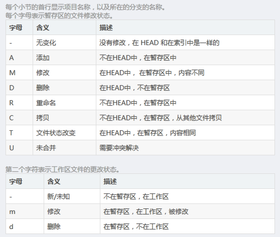

# 简易 Repo 使用指南

repo 是 google 用 python 脚本来调用 git 的一个工具，主要用于管理 Android 项目的软件仓库。

## repo install

```shell
mkdir ~/bin
PATH=~/bin:$PATH
curl https://storage.googleapis.com/git-repo-downloads/repo > ~/bin/repo
# 添加可执行权限
chmod a+x ~/bin/repo
```

## repo init

```shell
mkdir workspace
cd workspace
repo init -u URL [options]
# repo init -u manifest_git_path -m manifest_file_name -b branch_name --repo-url=repo_url --no-repo-verify
```

-u：指定一个 URL，其连接到一个 manifest 仓库。
-m：在 manifest 仓库中选择一个 NAME.xml 文件。
-b：选择一个 manifest 仓库中一个特殊的分支。
注：如果不提供 -b REVISION 或者–manifest-branch=REVISION 参数，则使用 manifest Git 库的 master 分支。如果不提供`-m NAME.xml`或者`–manifest-name=NAME.xml`参数，则使用缺省值 default.xml。

初始化完成后在 .repo 文件夹下可以看到 manifests/ manifests.git/ manifest.xml repo/

>- .repo：Repo 目录，可用于提取相应项目工作目录到外面的 repo 工作目录。
>- .repo/manifests.git：Repo 配置信息的 Git 库，不同版本包含不同配置信息。
>- .repo/manifests：Repo 配置信息的工作目录（将配置信息的工作目录和相应的实际 Git 目录分离管理，并且配置信息中的 .git 目录实际只是指向实际 Git 库的软连接），其中可能包含一个或多个 xml 文件描述的配置。每个 xml 文件是独立的一套配置，配置内容包括当前 Repo 工作目录包含哪些 Git 项目、所有 Git 项目所处的默认公共分支、以及远端地址等。
>- .repo/manifest.xml：Repo 工作目录中的内容同一时刻只能采用 manifests 中的一个 xml 文件做为其配置，该文件就是其软连接，通过 init 的-m 选项指定采用哪个文件；另外，同一 xml 文件也可能处于 manifests 库的不同版本或者不同分支，通过 init 的-b 选项指定使用 manifests 中的哪个分支，每次 init 命令都会从服务器更新最新的配置。
>- .repo/repo：Repo 脚本集的 Git 库，这里包含 Repo 命令所需的所有子命令脚本实现，由 Python 完成，这个目录本身又由 Git 来管理。

## repo sync

下载当前 repo 配置的所有项目，并生成对应的 repo 工作目录：

```shell
repo sync
```

如果想生成特定项目的代码，则使用下列语句：

```shell
repo sync [<project>...]
```

实现参照清单 .repo/manifests.xml 克隆并同步版本库，如果版本库不存在，则相当于执行`git clone`。如果版本库已经存在，则相当于执行

```shell
# 对每个 remote 源进行 fetch 操作
git remote update
# 针对当前分支的跟踪分支进行 rebase 操作
git rebase/origin/branch
```

涉及到的可选参数有：

>- -j：开启多线程同步操作，会加快 sync 命令的执行速度。默认情况下，使用 4 个线程并发进行 sync。
>- -c, –current-branch：只同步指定的远程分支。默认情况下，sync 会同步所有的远程分支，当远程分支比较多的时候，下载的代码量就大。使用该参数，可以缩减下载时间，节省本地磁盘空间。
>- -d, –detach：脱离当前的本地分支，切换到 manifest.xml 中设定的分支。在实际操作中这个参数很有用，当我们第一次 sync 完代码后，往往会切换到 dev 分支进行开发。如果不带该参数使用 sync， 则会触发本地的 dev 分支与 manifest 设定的远程分支进行合并，这会很可能会导致 sync 失败。
>- -f, –force-broken：当有 git 库 sync 失败了，不中断整个同步操作，继续同步其他的 git 库。
>- –no-clone-bundle：在向服务器发起请求时，为了做到尽快的响应速度，会用到内容分发网络 (CDN, Content Delivery Network)。同步操作也会通过 CDN 与就近的服务器建立连接， 使用 HTTP/HTTPS 的 $URL/clone.bundle 来初始化本地的 git 库，clone.bundle 实际上是远程 git 库的镜像，通过 HTTP 直接下载，这会更好的利用网络带宽，加快下载速度。

同步完成后，.repo 下多了 projects 目录，，原工作目录下也多了目录：

>- .repo/projects：Repo 所管理的所有 Git 项目集，包含 Repo 当前配置所指定的所有 Git 项目对应的 Git 目录。
>- .repo/../ :Repo 的工作区。在 Repo 目录（即 .repo）之外，根据 Repo 配置（即 .repo/manifest.xml 文件），从 .repo/projects 下提取出指定分支的各个 Git 项目（即 .repo/projects 中 Git 项目的子集）的工作目录，形成 Repo 工作目录，可供开发使用。

## repo start

```shell
repo start <new_branch_name> [--all|<project>...]
```

创建并切换分支。刚克隆下来的代码是没有分支的，`repo start`实际是对`git checkout -b`命令的封装。为指定的项目或所有的项目（若使用-all），以清单文件中为设定的分支，创建特定的分支。这条指令与`git checkout -b`还是有很大区别的。`· git checkout -b` 是在当前所在的分支的基础上创建特性分支。而`repo start`是在清单文件设定的分支的基础上创建特性分支。

```shell
repo start stable --all
```

假设清单文件中设定的分支是 gingerbread-exdroid-stable，那么执行以上指令就是对所有项目，在 gingerbread-exdroid-stable 的基础上创建特性分支 stable。

```shell
repo start stable platform/build platform/bionic
```

假设清单文件中设定的分支是 gingerbread-exdroid-stable，那么执行以上指令就是对 platform/build、platform/bionic 项目，在 gingerbread-exdroid-stable 的基础上创建特性分支 stable。

## repo checkout

```shell
repo checkout <branch_name> [<project>...]
```

切换分支，实际上是对`git checkout`命令的封装，但是不能带-b 参数，因此无法创建分支。

```shell
repo checkout liuq-dev
repo checkout liuq-dev skipper/build platform/bionic
```

## repo branches

```shell
repo branches [<project>...]
```

查看分支。

```shell
repo branches
repo branches skipper/build skipper/release
#查看可切换的分支
cd .repo/manifests
git branch -a | cut -d / -f 3
```

## repo diff

```shell
repo diff [<project>...]
```

查看工作区文件差异，实际是对`git diff`命令的封装，用于分别显示各个项目工作区下的文件差异。在 commit 和工作目录之间使用 git diff 显示明显差异的更改。

```shell
#查看所有项目
repo diff
#只查看其中的两个项目
repo diff skipper/build skipper/release
```

## repo stage

```shell
repo stage -i [<project>...]
```

把文件添加到 index 表中。实际上是对`git add –interactive`命令的封装，用于挑选各个项目中的改动以加入暂存区。`-i`表示`git add –interactive`命令中的`–interactive`，给出一个界面供用户选择。

## repo prune

```shell
repo prune [<project>...]
```

删除已经合并分支。实际上是对`git branch -d`命令的封装，该命令用于扫描项目的各个分支，并删除已经合并的分支。

## repo abandon

```shell
repo abandon <branchname> [<rpoject>...]
```

删除指定分支。实际是对`git brance -D`命令的封装。

## repo status

```shell
repo status [<project>...]
```

查看文件状态。

```shell
#输出 skipper/build 项目分支的修改状态
repo status skipper/build
```



## repo remote

```shell
repo remote add <remote_name> <url> [<project>...]
repo remote rm <remote_name> [<project>...]
```

设置远程仓库。

```shell
repo remote add org ssh://10.11.10.11/git_repo
```

这个指令根据 xml 文件添加的远程分支，方便于向服务器提交代码，执行之后的 build 目录下看到新的远程分支 org。

删除远程仓库。

```shell
repo remote rm org
```

## repo push

```shell
repo push <remotename> [--all|<project>...]
```

向服务器提交代码。repo 会自己查询需要向服务器提交的项目并提示用户。

```shell
repo push org
```

## repo forall

```shell
repo forall [<project>...] -c <command>
```

迭代器，可以在所有指定的项目中执行同一个 shell 指令。

>- -c 后面所带的参数是 shell 指令，即执行命令和参数。
>- -p 在 shell 指令输出之前列出项目名称，即在指定命令的输出前显示项目标题。这是通过绑定管道到命令的 stdin，stdout，和 sterr 流，并且用管道输送所有输出量到一个连续的流，显示在一个单一的页面调度会话中。
>- -v 列出执行 shell 指令输出的错误信息，即显示命令写到 sterr 的信息。

附加环境变量。

>- REPO_PROJECT 指定项目的名称
>- REPO_PATH 指定项目在工作区的相对路径
>- REPO_REMOTE 指定项目远程仓库的名称
>- REPO_LREV 指定项目最后一次提交服务器仓库对应的哈希值
>- REPO_RREV 指定项目在克隆时的指定分支，manifest 里的 revision 属性

如果-c 后面所带的 shell 指令中有上述环境变量，则需要用单引号把 shell 指令括起来。

```shell
# 添加环境变量
repo forall -c 'echo $REPO_PROJECT'
repo forall -c 'echo $REPO_PATH'

# 合并多个分支。
# 把所有项目都切换到 master 分支，执行上述指令将 topic 分支合并到 master 分支。
repo forall -p -c git merge topic

#打标签，在所有项目下打标签。
repo forall -c git tag crane-stable-1.6

# 设置远程仓库。
# 引用环境变量 REPO_PROJECT 添加远程仓库。
repo forall -c 'git remote add korg ssh://xiong@172.16.31/$REPO_PROJECT.git'

# 删除远程仓库。
repo forall -c git remote rm korg

# 创建特性分支
repo forall -c git branch crane-dev
repo forall -c git checkout -b crane-dev
```

## repo grep

```shell
repo grep {pattern | -e pattern} [<project>...]
```

打印出符合某个模式的行。相当于对`git grep`的封装，用于在项目文件中进行内容查找。

```shell
# 查找一行 , 里面有#define, 并且有 'MAX_PATH' 或者 'PATH_MAX':
repo grep -e '#define' --and -\( -e MAX_PATH -e PATH_MAX \)
# 查找一行 , 里面有 'NODE' 或 'Unexpected', 并且在一个文件中这两个都有的 .
repo grep --all-match -e NODE -e Unexpected
```

## repo manifest

```shell
repo manifest [-o {-|NAME.xml} [-r]]
```

manifest 检验工具，用于显示 manifest 文件内容。

>- -h, –help 显示这个帮助信息后退出
>- -r, –revision-as-HEAD 把某版次存为当前的 HEAD
>- -o -|NAME.xml, –output-file=-|NAME.xml 把 manifest 存为 NAME.xml

## repo version

```shell
repo version
```

显示 repo 的版本号。

>- -h, –help 显示这个帮助信息后退出 .

## repo upload

```shell
repo upload [--re --cc] {[<project>]...|--replace <project>}
```

repo upload 相当于`git push`，但是又有很大的不同。它是将版本库改动推送到代码审核服务器（Gerrit 软件架设）的特殊引用上，使用 SSH 协议。代码审核服务器会对推送的提交进行特殊处理，将新的提交显示为一个待审核的修改集，并进入代码审核流程，只有当审核通过后，才会合并到官方正式的版本库中。

>- -h, –help 显示帮助信息
>- -t 发送本地分支名称到 Gerrit 代码审核服务器
>- –replace 发送此分支的更新补丁集
>- –re=REVIEWERS 要求指定的人员进行审核
>- –cc=CC 同时发送通知到如下邮件地址

## repo download

```shell
repo download {project change[/patchset]}...
```

`repo download`命令主要用于代码审核者下载和评估贡献者提交的修订。贡献者的修订在 Git 版本库中 refs/changes// 引用方式命名（缺省的 patchset 为 1），和其他 Git 引用一样，用`git fetch`获取，该引用所指向的最新的提交就是贡献者待审核的修订。 使用`repo download`命令实际上就是用`git fetch`获取到对应项目的 refs/changes//patchset> 引用，并自动切换到对应的引用上。

## repo selfupdate

```shell
repo selfupdate
```

用于 repo 自身的更新。如果有新版本的 repo 存在 , 这个命令会升级 repo 到最新版本。通常这个动作在 repo sync 时会自动去做 , 所以不需要最终用户手动去执行。

>- -h, –help 显示这个帮助信息后退出 .
>- –no-repo-verify 不要验证 repo 源码 .

## repo help

```shell
repo help [--all|command]
```

显示命令的详细帮助。

>- -h, –help 显示这个帮助信息后退出
>- -a, –all 显示完整的命令列表
