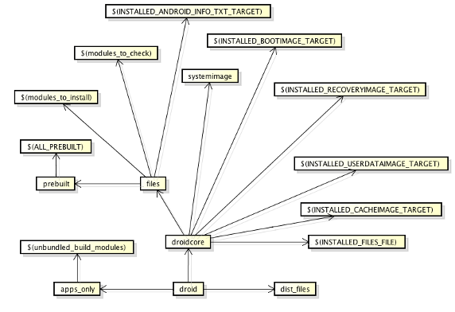

# AOSP 源码编译指南

## 初始化仓库

```shell
# 安装 repo
# repo 是管理 AOSP 各个 repository 的脚本工具
mkdir ~/bin
PATH = ~/bin:$PATH
curl https://storage.googleapis.com/git-repo-downloads/repo > ~/bin/repo
chmod a+x ~/bin/repo

#下载源码
mkdir source
cd source
# 使用清华大学镜像站
repo init -u https://aosp.tuna.tsinghua.edu.cn/platform/manifest //or repo init -u git://aosp.tuna.tsinghua.edu.cn/aosp/platform/manifest

# 如果提示无法连接到 gerrit.googlesource.com，需要编辑 ~/bin/repo 文件，找到 REPO_URL 这一行 , 将其内容修改为：REPO_URL = 'https://gerrit-google.tuna.tsinghua.edu.cn/git-repo'，然后重新执行上述命令
# 不带参数的 manifest 命令用于获取 master 上最新的代码，但是可以通过 -b 参数指定获取某个特定的 android 版本
# 比如想要获取 android-4.0.1_r1 分支，那么命令为 repo init -u https://aosp.tuna.tsinghua.edu.cn/platform/manifest -b android-4.0.1_r1

#同步代码到本地
repo sync // 为了保证代码完整性，多 sync 几次
```

## 编译工具

```shell
# make 版本要求 3.81 至 3.82（3.82 我沒有编译通过 ...），ubuntu 16.04 默认版本是 4.1。
# 卸载掉 make
sudo apt-get remove make
# 下载安装对应版本
tar -zxvf make3.8.1.tar.gz
./configure
sh build.sh
sudo ./make install

# JDK
sudo apt-get update
sudo apt-get install openjdk-8-jdk

# 如果编译的是 Android 5.x 到 android 6.0 之间的系统版本，需要采用 openjdk-7
sudo add-apt-repository ppa:openjdk-r/ppa
sudo apt-get update
sudo apt-get install openjdk-7-jdk

# jdk 版本切换
sudo update-alternative --config java
sudo update-alternative --config javac
```

## 安装依赖

```shell
sudo apt-get install git-core gnupg flex bison gperf build-essential zip curl zlib1g-dev gcc-multilib g++-multilib libc6-dev-i386 lib32ncurses5-dev x11proto-core-dev libx11-dev lib32z-dev libgl1-mesa-dev libxml2-utils xsltproc unzip
```

## 编译镜像

```shell
source build/envsetup.sh
# lunch 命令会列出一些编译目标
lunch
# 编译目标的格式：BUILD-BUILDTYPE，aosp_arm-eng BUILD 是 aosp_arm， BUILDTYPE 是 eng

# BUILD
# aosp(Android Open Source Project) 代表 Android 开源项目
# arm 表示系统是运行在 arm 架构的处理器上，arm64 则是指 64 位 arm 架构处理器，x86 则表示 x86 架构的处理器
# 此外还有一些单词代表了特定的 Nexus 设备

# BUILD TYPE
# -user 代表编译出的系统镜像是可以用来正式发布到市场的版本 , 其权限是被限制的
# -userdebug 在 user 版本的基础上开放了 root 权限和 debug 权限
# -eng 代表 engineer, 开发工程师的版本 , 拥有最大的权限 (root 等), 此外还附带了许多 debug 工具

lunch aosp_arm64-eng
# -j 后面的数字代表开启的线程数量，一般为 cpu 核心数 x2
make -j8
```

## 运行模拟器

```shell
emulator
```

### 模拟器运行所需要四个文件

>- Linux Kernel
>- system.img
>- userdate.img
>- ramdisk.img

如果使用 lunch 命令时选择的是 aosp_arm-eng，在执行不带参数的 emualtor 命令时，Linux Kernel 默认使用的是 /source/prebuilds/qemu-kernel/arm/kernel-qemu 目录下的 kernel-qemu 文件；而 android 镜像文件则是默认使用 source/out/target/product/generic 目录下的 system.img，userdata.img 和 ramdisk.img，也就是刚刚编译出来的镜像文件。

如果使用 lunch 命令时选择的是 aosp_arm64-eng，则 Linux 默认使用的 /source/prebuilds/qemu-kernel/arm64/kernel-qemu 下的 kernel-qemu，其他文件则是使用的 source/out/target/product/generic64 目录下的 system.img，userdata.img 和 ramdisk.img。emulator 指令允许你通过参数制定使用不同的文件，具体用法可以通过`emulator --help`查看。

## 模块编译

除了通过`make`命令编译可以整个 android 源码外，Google 也提供了相应的命令来支持单独模块的编译。

编译环境初始化`source build/envsetup.sh`之后，可能需要用到如下指令

>- croot: 切换到源码树的根目录
>- m: 在源码树的根目录执行 make
>- mm: Build 当前目录下的模块
>- mmm: Build 指定目录下的模块
>- cgrep: 在所有 C/C++ 文件上执行 grep
>- jgrep: 在所有 Java 文件上执行 grep
>- resgrep: 在所有 res/*.xml 文件上执行 grep
>- godir: 转到包含某个文件的目录路径
>- printconfig: 显示当前 Build 的配置信息
>- add_lunch_combo: 在 lunch 函数的菜单中添加一个条目

如果未完整编译过整个 android 工程，那么在使用 mm 或者 mmm 的时候可能会遇到无法找到某些依赖库的情况，这时可以用 mma 进行编译，它会同时编译所需要的依赖库，只要进行一次 mma 编译就可以了，后续可直接使用 mm 或者 mmm 来编译。由此，如果只是要验证某个应用 (so 或者可执行程序) 的话，可以不必编译整个工程。

其中 mmm 指令就是用来编译指定目录。通常来说每个目录只包含一个模块，比如要编译 Launcher2 模块，执行指令 :

```shell
mmm packages/apps/Launcher2/
# 稍等一会之后 , 提示
make completed success fully
# 表示编译完成
```

此时在 out/target/product/gereric/system/app 就可以看到编译的 Launcher2.apk 文件。

### 重新打包系统镜像

编译好指定模块后，如果想要将该模块对应的 apk 集成到系统镜像中，需要借助`make snod`指令重新打包系统镜像。这样新生成的 system.img 中就包含了刚才编译的 Launcher2 模块。重启模拟器之后生效。

### 单独安装模块

在不断的修改某些模块，总不能每次编译完成后都要重新打包 system.img。在编译完后，借助`adb install`命令直接将生成的 apk 文件安装到设备上即可。

## 输出目录说明

Android 系统自带的 apk 文件都在 out/target/product/generic/system/apk 目录下。
一些可执行文件 (比如 C 编译的执行)，放在 out/target/product/generic/system/bin 目录下。
动态链接库放在 out/target/product/generic/system/lib 目录下。
硬件抽象层文件都放在 out/targer/product/generic/system/lib/hw 目录下。

## SDK 编译

如果需要自己编译 SDK 使用，需要执行命令`make sdk`。

## AOSP Build Architecture

### 编译 Android 系统

Build 系统中最主要的处理逻辑都在 Make 文件中，而其他的脚本文件只是起到一些辅助作用，由于篇幅所限，本文只探讨 Make 文件中的内容。整个 Build 系统中的 Make 文件可以分为三类：

第一类是 Build 系统核心文件，此类文件定义了整个 Build 系统的框架，而其他所有 Make 文件都是在这个框架的基础上编写出来的。Build 系统核心文件全部位于 /build/core 目录下。

第二类是针对某个产品（一个产品可能是某个型号的手机或者平板电脑）的 Make 文件，这些文件通常位于 device 目录下，该目录下又以公司名以及产品名分为两级目录。对于一个产品的定义通常需要一组文件，这些文件共同构成了对于这个产品的定义。

第三类是针对某个模块（关于模块后文会详细讨论）的 Make 文件。整个系统中，包含了大量的模块，每个模块都有一个专门的 Make 文件，这类文件的名称统一为 “Android.mk”，该文件中定义了如何编译当前模块。Build 系统会在整个源码树中扫描名称为 “Android.mk” 的文件并根据其中的内容执行模块的编译。

```shell
# 引入了 build/envsetup.sh 脚本。该脚本的作用是初始化编译环境，并引入一些辅助的 Shell 函数，这其中就包括第二步使用 lunch 函数。除此之外，该文件中还定义了其他一些常用的函数
source build/envsetup.sh
# 第二行命令 “lunch full-eng” 是调用 lunch 函数，并指定参数为 “full-eng”。lunch 函数的参数用来指定此次编译的目标设备以及编译类型。在这里，这两个值分别是 “full” 和 “eng”。“full” 是 Android 源码中已经定义好的一种产品，是为模拟器而设置的。而编译类型会影响最终系统中包含的模块。
# 如果调用 lunch 函数的时候没有指定参数，那么该函数将输出列表以供选择，此时可以通过输入编号或者名称进行选择。
lunch full-eng
# 第三行命令 “make -j8” 才真正开始执行编译。make 的参数 “-j” 指定了同时编译的 Job 数量，这是个整数，该值通常是编译主机 CPU 支持的并发线程总数的 1 倍或 2 倍。在调用 make 命令时，如果没有指定任何目标，则将使用默认的名称为 “droid” 目标，该目标会编译出完整的 Android 系统镜像。
make -j8
```

所有的编译产物都将位于 /out 目录下，该目录下主要有以下几个子目录：

>- /out/host/：该目录下包含了针对主机的 Android 开发工具的产物。即 SDK 中的各种工具，例如：emulator，adb，aapt 等。
>- /out/target/common/：该目录下包含了针对设备的共通的编译产物，主要是 Java 应用代码和 Java 库。
>- /out/target/product/<product_name>/：包含了针对特定设备的编译结果以及平台相关的 C/C++ 库和二进制文件。其中，<product_name> 是具体目标设备的名称。
>- /out/dist/：包含了为多种分发而准备的包，通过 “make disttarget” 将文件拷贝到该目录，默认的编译目标不会产生该目录。

Build 的产物中最重要的是三个镜像文件，它们都位于 /out/target/product/<product_name>/ 目录下。

>- system.img：包含了 Android OS 的系统文件，库，可执行文件以及预置的应用程序，将被挂载为根分区。
>- ramdisk.img：在启动时将被 Linux 内核挂载为只读分区，它包含了 /init 文件和一些配置文件。它用来挂载其他系统镜像并启动 init 进程。
>- userdata.img：将被挂载为 /data，包含了应用程序相关的数据以及和用户相关的数据。

### Make 文件说明

整个 Build 系统的入口文件是源码树根目录下名称为 “Makefile” 的文件，当在源代码根目录上调用 make 命令时，make 命令首先将读取该文件。Makefile 文件的内容只有一行：“include build/core/main.mk”。该行代码的作用很明显：包含 build/core/main.mk 文件。在 main.mk 文件中又会包含其他的文件，其他文件中又会包含更多的文件，这样就引入了整个 Build 系统。这些 Make 文件间的包含关系是相当复杂的，下图描述了这种关系，该图中黄色标记的文件（且除了 $ 开头的文件）都位于 build/core/ 目录下。


>- main.mk: 最主要的 Make 文件，该文件中首先将对编译环境进行检查，同时引入其他的 Make 文件。另外，该文件中还定义了几个最主要的 Make 目标，例如 droid，sdk，等。
>- help.mk: 包含了名称为 help 的 Make 目标的定义，该目标将列出主要的 Make 目标及其说明。
>- pathmap.mk: 将许多头文件的路径通过名值对的方式定义为映射表，并提供 include-path-for 函数来获取。例如，通过 $(call include-path-for, frameworks-native) 便可以获取到 framework 本地代码需要的头文件路径。
>- envsetup.mk: 配置 Build 系统需要的环境变量，例如：TARGET_PRODUCT，TARGET_BUILD_VARIANT，HOST_OS，HOST_ARCH 等。当前编译的主机平台信息（例如操作系统，CPU 类型等信息）就是在这个文件中确定的。另外，该文件中还指定了各种编译结果的输出路径。
>- combo/select.mk: 根据当前编译器的平台选择平台相关的 Make 文件。
>- dumpvar.mk: 在 Build 开始之前，显示此次 Build 的配置信息。
>- config.mk: 整个 Build 系统的配置文件，最重要的 Make 文件之一。该文件中主要包含以下内容：定义了许多的常量来负责不同类型模块的编译; 定义编译器参数以及常见文件后缀，例如 .zip,.jar.apk; 根据 BoardConfig.mk 文件，配置产品相关的参数; 设置一些常用工具的路径，例如 flex，e2fsck，dx。
>- definitions.mk: 最重要的 Make 文件之一，在其中定义了大量的函数。这些函数都是 Build 系统的其他文件将用到的。例如：my-dir，all-subdir-makefiles，find-subdir-files，sign-package 等，关于这些函数的说明请参见每个函数的代码注释。
>- distdir.mk: 针对 dist 目标的定义。dist 目标用来拷贝文件到指定路径。
>- dex_preopt.mk: 针对启动 jar 包的预先优化。
>- pdk_config.mk: 顾名思义，针对 pdk（Platform Developement Kit）的配置文件。
>- ${ONE_SHOT_MAKEFILE}: ONE_SHOT_MAKEFILE 是一个变量，当使用 “mm” 编译某个目录下的模块时，此变量的值即为当前指定路径下的 Make 文件的路径。
>- ${subdir_makefiles}: 各个模块的 Android.mk 文件的集合，这个集合是通过 Python 脚本扫描得到的。
>- post_clean.mk: 在前一次 Build 的基础上检查当前 Build 的配置，并执行必要清理工作。
>- legacy_prebuilts.mk: 该文件中只定义了 GRANDFATHERED_ALL_PREBUILT 变量。
>- Makefile: 被 main.mk 包含，该文件中的内容是辅助 main.mk 的一些额外内容。

Android 源码中包含了许多的模块，模块的类型有很多种，例如：Java 库，C/C++ 库，APK 应用，以及可执行文件等 。并且，Java 或者 C/C++ 库还可以分为静态的或者动态的，库或可执行文件既可能是针对设备（本文的 “设备” 指的是 Android 系统将被安装的设备，例如某个型号的手机或平板）的也可能是针对主机（本文的 “主机” 指的是开发 Android 系统的机器，例如装有 Ubuntu 操作系统的 PC 机或装有 MacOS 的 iMac 或 Macbook）的。不同类型的模块的编译步骤和方法是不一样，为了能够一致且方便的执行各种类型模块的编译，在 config.mk 中定义了许多的常量，这其中的每个常量描述了一种类型模块的编译方式。这些常量的值都是另外一个 Make 文件的路径，详细的编译方式都是在对应的 Make 文件中定义的。这些常量和 Make 文件的是一一对应的，对应规则也很简单：常量的名称是 Make 文件的文件名除去后缀全部改为大写然后加上 “BUILD_” 作为前缀。例如常量 BUILD_HOST_PREBUILT 的值对应的文件就是 host_prebuilt.mk。

>- host_static_library.mk 定义了如何编译主机上的静态库。
>- host_shared_library.mk 定义了如何编译主机上的共享库。
>- static_library.mk 定义了如何编译设备上的静态库。
>- shared_library.mk 定义了如何编译设备上的共享库。
>- executable.mk 定义了如何编译设备上的可执行文件。
>- host_executable.mk 定义了如何编译主机上的可执行文件。
>- package.mk 定义了如何编译 APK 文件。
>- prebuilt.mk 定义了如何处理一个已经编译好的文件 ( 例如 Jar 包 )。
>- multi_prebuilt.mk 定义了如何处理一个或多个已编译文件，该文件的实现依赖 prebuilt.mk。
>- host_prebuilt.mk 处理一个或多个主机上使用的已编译文件，该文件的实现依赖 multi_prebuilt.mk。
>- java_library.mk 定义了如何编译设备上的共享 Java 库。
>- static_java_library.mk 定义了如何编译设备上的静态 Java 库。
>- host_java_library.mk 定义了如何编译主机上的共享 Java 库。

不同类型的模块的编译过程会有一些相同的步骤，例如：编译一个 Java 库和编译一个 APK 文件都需要定义如何编译 Java 文件。因此这些 Make 文件的定义中会包含一些共同的代码逻辑。为了减少代码冗余，需要将共同的代码复用起来，复用的方式是将共同代码放到专门的文件中，然后在其他文件中包含这些文件的方式来实现的。

### Make 目标说明

如果在源码树的根目录直接调用 “make” 命令而不指定任何目标，则会选择默认目标：“droid”（在 main.mk 中定义）。因此这和执行 “make droid” 效果是一样的。droid 目标将编译出整个系统的镜像。从源代码到编译出系统镜像，整个编译过程非常复杂。这个过程并不是在 droid 一个目标中定义的，而是 droid 目标会依赖许多其他的目标，这些目标的互相配合导致了整个系统的编译。



Build 系统中包含的其他一些 Make 目标说明:

>- make clean: 执行清理，等同于：rm -rf out/。
>- make sdk: 编译出 Android 的 SDK。
>- make clean-sdk: 清理 SDK 的编译产物。
>- make update-api: 更新 API。在 framework API 改动之后，需要首先执行该命令来更新 API，公开的 API 记录在 frameworks/base/api 目录下。
>- make dist: 执行 Build，并将 MAKECMDGOALS 变量定义的输出文件拷贝到 /out/dist 目录。
>- make all: 编译所有内容，不管当前产品的定义中是否会包含。
>- make help: 帮助信息，显示主要的 make 目标。
>- make snod: 从已经编译出的包快速重建系统镜像。
>- make libandroid_runtime: 编译所有 JNI framework 内容。
>- make framework: 编译所有 Java framework 内容。
>- make services: 编译系统服务和相关内容。
>- make <local_target>: 编译一个指定的模块，local_target 为模块的名称。
>- make clean-<local_target>: 清理一个指定模块的编译结果。
>- makedump-products: 显示所有产品的编译配置信息，例如：产品名，产品支持的地区语言，产品中会包含的模块等信息。
>- make PRODUCT-xxx-yyy: 编译某个指定的产品。
>- make bootimage: 生成 boot.img
>- make recoveryimage: 生成 recovery.img
>- make userdataimage: 生成 userdata.img
>- make cacheimage: 生成 cache.img

### 在 Build 系统中添加新的内容

当要开发一款新的 Android 产品的时候，我们首先就需要在 Build 系统中添加对于该产品的定义。在 Android Build 系统中对产品定义的文件通常位于 device 目录下（另外还有一个可以定义产品的目录是 vender 目录，这是个历史遗留目录，Google 已经建议不要在该目录中进行定义，而应当选择 device 目录）。device 目录下根据公司名以及产品名分为二级目录。

通常对于一个产品的定义通常至少会包括四个文件：AndroidProducts.mk，产品版本定义文件，BoardConfig.mk 以及 verndorsetup.sh。

AndroidProducts.mk：该文文件中的内容很简单，其中只需要定义一个变量，名称为 “PRODUCT_MAKEFILES”，该变量的值为产品版本定义文件名的列表，例如：

```shell
 PRODUCT_MAKEFILES := \
 $(LOCAL_DIR)/full_stingray.mk \
 $(LOCAL_DIR)/stingray_emu.mk \
 $(LOCAL_DIR)/generic_stingray.mk
```

产品版本定义文件：顾名思义，该文件中包含了对于特定产品版本的定义。该文件可能不只一个，因为同一个产品可能会有多种版本（例如，面向中国地区一个版本，面向美国地区一个版本）。产品版本定义文件中的变量及其说明:

>- PRODUCT_NAME 最终用户将看到的完整产品名，会出现在 “关于手机” 信息中。
>- PRODUCT_MODEL 产品的型号，这也是最终用户将看到的。
>- PRODUCT_LOCALES 该产品支持的地区，以空格分格，例如：en_GB de_DE es_ES fr_CA。
>- PRODUCT_PACKAGES 该产品版本中包含 APK 应用程序，以空格分格，例如：Calendar Contacts。
>- PRODUCT_DEVICE 该产品的工业设计的名称。
>- PRODUCT_MANUFACTURER 制造商的名称。
>- PRODUCT_BRAND 该产品专门定义的商标（如果有的话）。
>- PRODUCT_PROPERTY_OVERRIDES 对于商品属性的定义。
>- PRODUCT_COPY_FILES 编译该产品时需要拷贝的文件，以 “源路径:目标路径” 的形式。
>- PRODUCT_OTA_PUBLIC_KEYS 对于该产品的 OTA 公开 key 的列表。
>- PRODUCT_POLICY 产品使用的策略。
>- PRODUCT_PACKAGE_OVERLAYS 指出是否要使用默认的资源或添加产品特定定义来覆盖。
>- PRODUCT_CONTRIBUTORS_FILE HTML 文件，其中包含项目的贡献者。
>- PRODUCT_TAGS 该产品的标签，以空格分格。

通常情况下，并不需要定义所有这些变量。Build 系统的已经预先定义好了一些组合，它们都位于 /build/target/product 下，每个文件定义了一个组合，只要继承这些预置的定义，然后再覆盖自己想要的变量定义即可。例如：

```shell
 # 继承 full_base.mk 文件中的定义
 $(call inherit-product, $(SRC_TARGET_DIR)/product/full_base.mk)
 # 覆盖其中已经定义的一些变量
 PRODUCT_NAME := full_lt26
 PRODUCT_DEVICE := lt26
 PRODUCT_BRAND := Android
 PRODUCT_MODEL := Full Android on LT26
 ```

BoardConfig.mk：该文件用来配置硬件主板，它其中定义的都是设备底层的硬件特性。例如：该设备的主板相关信息，Wifi 相关信息，还有 bootloader，内核，radioimage 等信息。对于该文件的示例，请参看 Android 源码树已经有的文件。

vendorsetup.sh：该文件中作用是通过 add_lunch_combo 函数在 lunch 函数中添加一个菜单选项。该函数的参数是产品名称加上编译类型，中间以 “-” 连接，例如：add_lunch_combo full_lt26-userdebug。/build/envsetup.sh 会扫描所有 device 和 vender 二级目录下的名称为 "vendorsetup.sh" 文件，并根据其中的内容来确定 lunch 函数的菜单选项。

在配置了以上的文件之后，便可以编译出新添加的设备的系统镜像了。首先，调用 “source build/envsetup.sh” 该命令的输出中会看到 Build 系统已经引入了刚刚添加的 vendorsetup.sh 文件。然后再调用 “lunch” 函数，该函数输出的列表中将包含新添加的 vendorsetup.sh 中添加的条目。然后通过编号或名称选择即可。最后，调用 “make -j8” 来执行编译即可。

### 添加新的模块

在源码树中，一个模块的所有文件通常都位于同一个文件夹中。为了将当前模块添加到整个 Build 系统中，每个模块都需要一个专门的 Make 文件，该文件的名称为 “Android.mk”。Build 系统会扫描名称为 “Android.mk” 的文件，并根据该文件中内容编译出相应的产物。

需要注意的是：在 Android Build 系统中，编译是以模块（而不是文件）作为单位的，每个模块都有一个唯一的名称，一个模块的依赖对象只能是另外一个模块，而不能是其他类型的对象。对于已经编译好的二进制库，如果要用来被当作是依赖对象，那么应当将这些已经编译好的库作为单独的模块。对于这些已经编译好的库使用 BUILD_PREBUILT 或 BUILD_MULTI_PREBUILT。例如：当编译某个 Java 库需要依赖一些 Jar 包时，并不能直接指定 Jar 包的路径作为依赖，而必须首先将这些 Jar 包定义为一个模块，然后在编译 Java 库的时候通过模块的名称来依赖这些 Jar 包。

Android.mk 文件通常以以下两行代码作为开头：

```shell
# 设置当前模块的编译路径为当前文件夹路径。
# 清理（可能由其他模块设置过的）编译环境中用到的变量。
LOCAL_PATH := $(call my-dir)
include $(CLEAR_VARS)
```

为了方便模块的编译，Build 系统设置了很多的编译环境变量。要编译一个模块，只要在编译之前根据需要设置这些变量然后执行编译即可。它们包括：

>- LOCAL_SRC_FILES：当前模块包含的所有源代码文件。
>- LOCAL_MODULE：当前模块的名称，这个名称应当是唯一的，模块间的依赖关系就是通过这个名称来引用的。
>- LOCAL_C_INCLUDES：C 或 C++ 语言需要的头文件的路径。
>- LOCAL_STATIC_LIBRARIES：当前模块在静态链接时需要的库的名称。
>- LOCAL_SHARED_LIBRARIES：当前模块在运行时依赖的动态库的名称。
>- LOCAL_CFLAGS：提供给 C/C++ 编译器的额外编译参数。
>- LOCAL_JAVA_LIBRARIES：当前模块依赖的 Java 共享库。
>- LOCAL_STATIC_JAVA_LIBRARIES：当前模块依赖的 Java 静态库。
>- LOCAL_PACKAGE_NAME：当前 APK 应用的名称。
>- LOCAL_CERTIFICATE：签署当前应用的证书名称。
>- LOCAL_MODULE_TAGS：当前模块所包含的标签，一个模块可以包含多个标签。标签的值可能是 debug, eng, user，development 或者 optional。其中 optional 是默认标签。标签是提供给编译类型使用的。不同的编译类型会安装包含不同标签的模块，关于编译类型的说明: eng: 默认类型，该编译类型适用于开发阶段。当选择这种类型时，编译结果将：安装包含 eng, debug, user，evelopment 标签的模块 / 安装所有没有标签的非 APK 模块 / 安装所有产品定义文件中指定的 APK 模块。user: 该编译类型适合用于最终发布阶段。当选择这种类型时，编译结果将：安装所有带有 user 标签的模块 / 安装所有没有标签的非 APK 模块 / 安装所有产品定义文件中指定的 APK 模块，APK 模块的标签将被忽略。userdebug: 该编译类型适合用于 debug 阶段。该类型和 user 一样，除了：会安装包含 debug 标签的模块 / 编译出的系统具有 root 访问权限。

config.mk 中定义的每个常量描述了一种类型模块的编译方式。所以要执行编译，只需要引入对应的 Make 文件即可（通过常量的方式）。例如，要编译一个 APK 文件，只需要在 Android.mk 文件中，加入 “include $(BUILD_PACKAGE)。除此以外，Build 系统中还定义了一些便捷的函数以便在 Android.mk 中使用，包括：

>- (call my-dir)：获取当前文件夹路径。
>- (call all-java-files-under, \<src\>)：获取指定目录下的所有 Java 文件。
>- (call all-c-files-under, \<src\>)：获取指定目录下的所有 C 语言文件。
>- (call all-Iaidl-files-under, \<src\>) ：获取指定目录下的所有 AIDL 文件。
>- (call all-makefiles-under, \<folder\>)：获取指定目录下的所有 Make 文件。
>- (call intermediates-dir-for, \<class\>, \<app_name\>, \<host or target\>, \<common?\> )：获取 Build 输出的目标文件夹路径。

```shell
# 编译一个 APK 文件
LOCAL_PATH := $(call my-dir)
include $(CLEAR_VARS)
# 获取所有子目录中的 Java 文件
LOCAL_SRC_FILES := $(call all-subdir-java-files)
# 当前模块依赖的静态 Java 库，如果有多个以空格分隔
LOCAL_STATIC_JAVA_LIBRARIES := static-library
# 当前模块的名称
LOCAL_PACKAGE_NAME := LocalPackage
# 编译 APK 文件
include $(BUILD_PACKAGE)

# 编译一个 Java 的静态库
LOCAL_PATH := $(call my-dir)
include $(CLEAR_VARS)
# 获取所有子目录中的 Java 文件
LOCAL_SRC_FILES := $(call all-subdir-java-files)
# 当前模块依赖的动态 Java 库名称
LOCAL_JAVA_LIBRARIES := android.test.runner
# 当前模块的名称
LOCAL_MODULE := sample
# 将当前模块编译成一个静态的 Java 库
include $(BUILD_STATIC_JAVA_LIBRARY)
```

## What does 'm' for

m：makes from the top of the tree 编译整个安卓系统
mm：builds all of the moudles in the current directory 编译当前目录下的模块，当前目录下需要有 Android.mk 这个 makefile 文件，否则就往上找最近的 android.mk 文件。
mma：当前目录新增或删除文件后，可以用 mma 重新编译。
mmm：builds all of the moudles in the supplies directory 编译指定路径下的模块，指定的路径下面需要有 Android.mk 这个 makefile 文件。
mmma：指定目录下新增或删除文件后，可以用 mmma 重新编译。

m 命令的编译过程：

>- build/core/main.mk（是 Android 编译系统的入口文件）
>- build/core/config.mk（会定好编译类型和目标文件）
>- build/core/definitions.mk（定义在编译过程中用到的宏）
>- ONE_SHOT_MAKEFILE -> build/core/package.mk（编译 Apk 库文件）
>- build/core/java_library.mk（编译 Java 库文件）
>- build/core/static_java_library.mk（编译 Java 静态库文件）
>- uild/core/shared_library.mk -> build/core/dynamic_library.mk -> build/core/binary.mk -> build/core/base_rules.mk（ 计算一些基本变量的值，并创建一些基本的依赖规则）
>- build/core/static_library.mk（编译 .a 静态库文件）
>- build/core/executable.mk（编译可执行文件）
>- build/core/prebuilt.mk（编译已经预编译好的第三方库文件）
>- build/core/Makfile（有 system.img、boot.img、recovery.img 等镜像文件生成规则）

环境变量 ONE_SHOT_MAKEFILE 中存放要编译模块的 Android.mk 的文件路径，如果环境变量值为空，表示执行的是 m 或者 make 命令，会对 Android 源代码中的所有模块进行编译。

mm、mmm 是类似的，都是用来编译某些模块。
