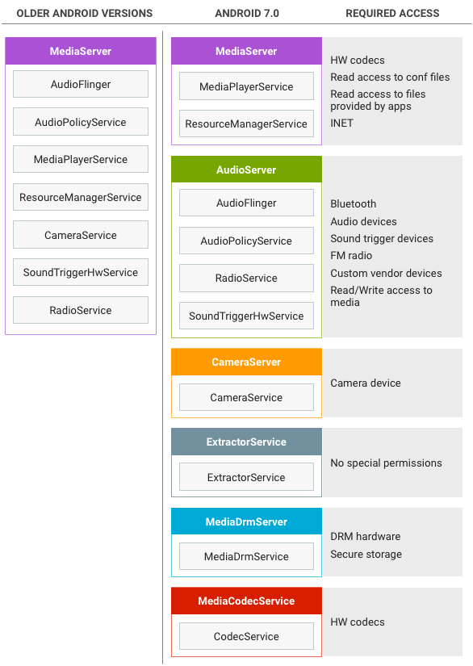
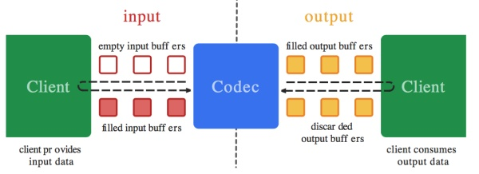
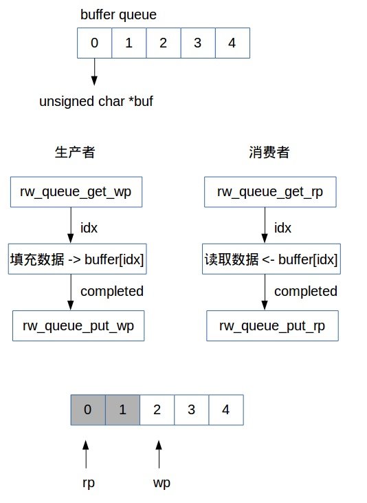
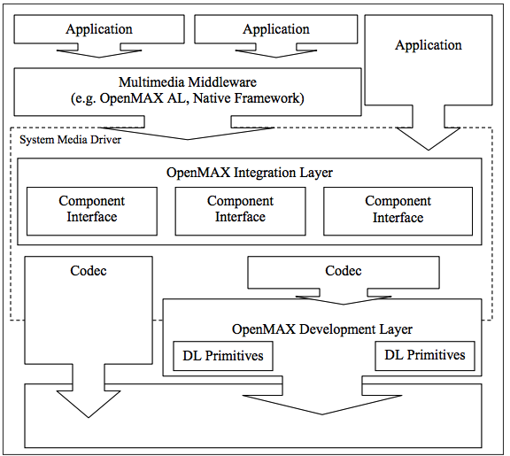
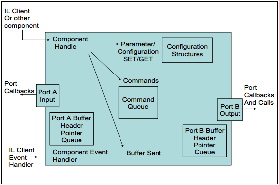
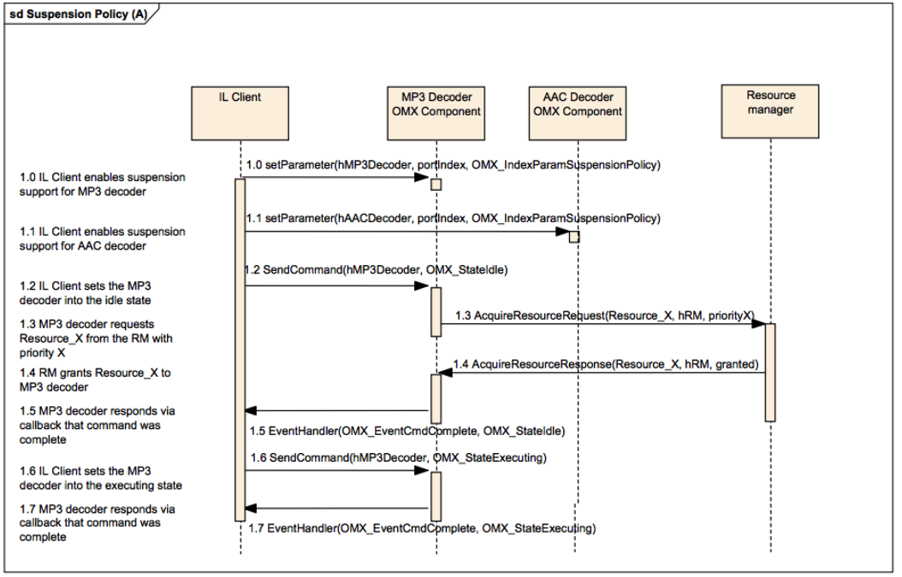

# AOSP 源码学习笔记

## sp、wp

Android 设计了基类 RefBase，用以管理引用数，所有类必须从 RefBase 派生，RefBase 是所有对象的始祖。

设计模板类 sp、wp，用以引用实际对象，sp 强引用和 wp 弱引用。sp、wp 声明为栈对象，作用域结束时，自动释放，自动调用析构函数。因此，可以在 sp、wp 的构造函数中，增引用数；在析构函数中，减少引用计数。

RefBase 内部有一个指针指向实际对象，有一个 weakref_impl 类型的指针保存对象的强／弱引用计数、对象生命周期控制。sp 只有一个成员变量，用来保存实际对象，但这个实际对象内部已包含了 weakref_impl 对象用于保存实际对象的引用计数。sp 管理一个对象指针时，对象的强、弱引用数同时加 1，sp 销毁时，对象的强、弱引用数同时减 1。wp 中有两个成员变量，一个保存实际对象，另一个是 weakref_impl 对象。wp 管理一个对象指针时，对象的弱引用计数加 1，wp 销毁时，对象的弱引用计数减 1。

weakref_impl 中包含一个 flag 用于决定对象的生命周期是由强引用数控制还是由弱引用数控制：

>- 当 flag 为 0 时，实际对象的生命周期由强引用数控制，weakref_impl* 对象由弱引用数控制。
>- 当 flag 为 OBJECT_LIFETIME_WEAK 时，实际对象的生命周期受弱引用数控制。
>- 当 flag 为 OBJECT_LIFETIME_FOREVER 时，实际对象的生命周期由用户控制。
>- 可以用 extendObjectLifetime 改变 flag 的值。

## Handler、Looper、Message

Handler、Looper、Message 这三者都与 Android 异步消息处理线程相关的概念。异步消息处理线程启动后会进入一个无限的循环体之中，每循环一次，从其内部的消息队列中取出一个消息，然后回调相应的消息处理函数，执行完成一个消息后则继续循环。若消息队列为空，线程则会阻塞等待。Looper 负责的就是创建一个 MessageQueue，然后进入一个无限循环体不断从该 MessageQueue 中读取消息，而消息的创建者就是一个或多个 Handler。

## Android Meida

Android 包含 Stagefright。Stagefright 是位于 Native 层的媒体播放引擎，内置了基于软件的编解码器，且适用于热门媒体格式。Stagefright 音频和视频播放功能包括集成 OpenMAX 编解码器、会话管理、基于时间的同步渲染、传输控制和 DRM。Stagefright 还支持集成您提供的自定义硬件编解码器。要设置编码和解码媒体的硬件路径，您必须将基于硬件的编解码器作为 OpenMax IL（集成层）组件进行实现。

媒体应用根据以下架构与 Android Native 多媒体框架进行交互。

应用代码位于应用框架层，可利用 android.media API 与多媒体硬件进行交互。

Binder IPC 代理用于促进跨越进程边界的通信。它们位于 frameworks/av/media/libmedia 目录中，并以字母 “I” 开头。

在 Native 层，Android 提供了一个利用 Stagefright 引擎进行音频和视频录制及播放的多媒体框架。Stagefright 随附支持的软件编解码器的默认列表，并且您可以使用 OpenMax 集成层标准实现自己的硬件编解码器。有关实现的更多详细信息，请参阅位于 frameworks/av/media 中的 MediaPlayer 和 Stagefright 组件。

OpenMAX IL 为 Stagefright 提供了一种标准化的方式来识别和使用基于硬件的自定义多媒体编解码器（称为组件）。必须以名为 libstagefrighthw.so 的共享库的形式提供 OpenMAX 插件。此插件将 Stagefright 与您的自定义编解码器组件相连接，并且该组件必须根据 OpenMAX IL 组件标准来实现。

为了提高设备安全性，Android 7.0 将整体的 mediaserver 进程分解为多个进程，同时仅向各个进程提供所需的权限和功能。旧版 Android 使用单个整体的 mediaserver 进程，该进程具有众多权限（相机访问权、音频访问权、视频驱动程序访问权、文件访问权、网络访问权等）。Android 7.0 将 mediaserver 进程拆分为几个新进程，这些进程要求的权限要少得多。



### Media Codec

Android 官方提供的音频编解码的 API，即 MediaCodec 类，该 API 是在 Andorid 4.1（API 16）版本引入的，因此只能工作于 Android 4.1 及以上的版本。

#### 基本介绍

>- 提供了一套访问 Android 底层多媒体模块的接口，主要是音视频的编解码接口。
>- Android 底层多媒体模块采用的是 OpenMax 框架，任何 Android 底层编解码模块的实现，都必须遵循 OpenMax 标准。Google 官方默认提供了一系列的软件编解码器：包括：OMX.google.h264.encoder，OMX.google.h264.encoder，OMX.google.aac.encoder，OMX.google.aac.decoder 等等，而硬件编解码功能，则需要由芯片厂商依照 OpenMax 框架标准来完成，所以，一般采用不同芯片型号的手机，硬件编解码的实现和性能是不同的。
>- Android 应用层统一由 MediaCodec API 来提供各种音视频编解码功能，由参数配置来决定采用何种编解码算法、是否采用硬件编解码加速等等。

#### 核心原理

MediaCodec 使用的基本流程

```shell
createEncoderByType/createDecoderByType
configure
start
while(1) {
    dequeueInputBuffer
    queueInputBuffer
    dequeueOutputBuffer
    releaseOutputBuffer
}
stop
release
```

由此可以看到，Buffer 队列的操作是其最核心的部分之一，关于 MediaCodec 的 Buffer 队列，示意图如下：



MediaCodec 架构上采用了 2 个缓冲区队列，异步处理数据，下面描述的 Client 和 MediaCodec 模块是并行工作的。

>-1. Client 从 input 缓冲区队列申请 empty buffer[dequeueInputBuffer]。
>-2. Client 把需要编解码的数据拷贝到 empty buffer，然后放入 input 缓冲区队列 [queueInputBuffer]。
>-3. MediaCodec 模块从 input 缓冲区队列取一帧数据进行编解码处理。
>-4. 编解码处理结束后，MediaCodec 将原始数据 buffer 置为 empty 后放回 input 缓冲区队列，将编解码后的数据放入到 output 缓冲区队列。
>-5. Client 从 output 缓冲区队列申请编解码后的 buffer[dequeueOutputBuffer]。
>-6. Client 对编解码后的 buffer 进行渲染 / 播放。
>-7. 渲染 / 播放完成后，Client 再将该 buffer 放回 output 缓冲区队列 [releaseOutputBuffer]。

MediaCodec 在架构上，其实是采用了一种基于 “环形缓冲区” 的 “生产者-消费者” 模式，它设计了 2 个基于 idx 序号的 “环形缓冲区”，注意，是 2 个，一个在 input 端，一个在 output 端。基于 idx 的环形缓冲区的总体示意图如下，图中，wp 代表 “写指针”，指向的是 “emptybuffer”，rp 代表 “读指针”，指向的是 “filled buffer”。



“生产者” 和 “消费者” 其实是共用这一个缓冲区队列，“生产者” 负责从队列中取出未使用的 Buffer，填入数据，然后放回队列，“消费者” 则负责取出填入数据后的 Buffer，进行处理，处理结束后，再把 Buffer 标记为 “空”，退回到队列中去以供 “生产者” 继续填充数据。在 input 端，“Client” 是这个环形缓冲区 “生产者”，“MediaoCodec 模块” 是 “消费者”。在 output 端，“MediaoCodec 模块” 是这个环形缓冲区 “生产者”，而 “Client” 则变成了 “消费者”。

### OpenMax



虚线中的内容是 OpenMax IL 层的内容，其主要实现了 OpenMax IL 中的各个组件（Component）。对下层，OpenMax IL 可以调用 OpenMax DL 层的接口，也可以直接调用各种 Codec 实现。对上层，OpenMax IL 可以给 OpenMax AL 层等框架层（Middleware）调用，也可以给应用程序直接调用。
OpenMax IL 主要内容如下所示。

客户端（Client）：OpenMax IL 的调用者；
组件（Component）：OpenMax IL 的单元，每一个组件实现一种功能；
端口（Port）：组件的输入输出接口；
隧道化（Tunneled）：让两个组件直接连接的方式；
组件、端口、隧道化思想和 GStreamer (一种多媒体框架) 中的 pipeline 十分类似。
Component 实现单一功能、或是 Source、Host、Accelerator 和 Sink。Port 是 Component 对外的输入输出口。通过 Tunneled 将单一 Component 串联起来形成一个完整功能。OpenMax Core 是辅助各个组件运行的部分。

OpenMax IL 的基本运作过程如图。


openMAX IL 的客户端，通过调用四个 OpenMAX IL 组件，实现了一个功能。四个组件分别是 Source 组件、Host 组件、Accelerator 组件和 Sink 组件。Source 组件只有一个输出端口；而 Host 组件有一个输入端口和一个输出端口；Accelerator 组件具有一个输入端口，调用了硬件的编解码器，加速主要体现在这个环节上。Accelerator 组件和 Sink 组件通过私有通讯方式在内部进行连接，没有经过明确的组件端口。

OpenMAL IL 在使用的时候，其数据流也有不同的处理方式：既可以经由客户端，也可以不经由客户端。图中，Source 组件到 Host 组件的数据流就是经过客户端的；而 Host 组件到 Accelerator 组件的数据流就没有经过客户端，使用了隧道化的方式；Accelerator 组件和 Sink 组件甚至可以使用私有的通讯方式。

OpenMax Core 是辅助各个组件运行的部分，它通常需要完成各个组件的初始化等工作，在真正运行过程中，重点是各个 OpenMax IL 的组件，OpenMax Core 不是重点，也不是标准。

OpenMAL IL 的组件是 OpenMax IL 实现的核心内容，一个组件以输入、输出端口为接口，端口可以被连接到另一个组件上。外部对组件可以发送命令，还进行设置 / 获取参数、配置等内容。组件的端口可以包含缓冲区（Buffer）的队列。

组件的处理的核心内容是：通过输入端口消耗 Buffer，通过输出端口填充 Buffer，由此多组件相联接可以构成流式的处理。



组件的功能和其定义的端口类型密切相关，通常情况下：只有一个输出端口的，为 Source 组件；只有一个输入端口的，为 Sink 组件；有多个输入端口，一个输出端口的为 Mux 组件；有一个输入端口，多个输出端口的为 DeMux 组件；输入输出端口各一个组件的为中间处理环节，这是最常见的组件。
端口具体支持的数据也有不同的类型。例如，对于一个输入、输出端口各一个组件，其输入端口使用 MP3 格式的数据，输出端口使用 PCM 格式的数据，那么这个组件就是一个 MP3 解码组件。
隧道化（Tunneled）是一个关于组件连接方式的概念。通过隧道化可以将不同的组件的一个输入端口和一个输出端口连接到一起，在这种情况下，两个组件的处理过程合并，共同处理。尤其对于单输入和单输出的组件，两个组件将作为类似一个使用。

### Android 中 OMX 的使用情况

Android 系统的一些部分对 OpenMax IL 层进行使用，基本使用的是标准 OpenMax IL 层的接口，只是进行了简单的封装。标准的 OpenMax IL 实现很容易以插件的形式加入到 Android 系统中。Android 的多媒体引擎 OpenCore 和 StageFright 都可以使用 OpenMax 作为多媒体编解码的插件，只是没有直接使用 OpenMax IL 层提供的纯 C 接口，而是对其进行了一定的封装 (C++ 封装)。在 Android2.x 版本之后，Android 的框架层也对 OpenMax IL 层的接口进行了封装定义，甚至使用 Android 中的 Binder IPC 机制。Stagefright 使用了这个层次的接口，OpenCore 没有使用。OpenCore 使用 OpenMax IL 层作为编解码插件在前，Android 框架层封装 OpenMax 接口在后面的版本中才引入。

### Android 中 OMX 的实现内容

Android 中使用的主要是 OpenMax 的编解码功能。虽然 OpenMax 也可以生成输入、输出、文件解析-构建等组件，但是在各个系统（不仅是 Android）中使用的最多的还是编解码组件。媒体的输入、输出环节和系统的关系很大，引入 OpenMax 标准比较麻烦；文件解析-构建环节一般不需要使用硬件加速。编解码组件也是最能体现硬件加速的环节，因此最常使用。在 Android 中实现 OpenMax IL 层和标准的 OpenMax IL 层的方式基本，一般需要实现以下两个环节。

>- 编解码驱动程序：位于 Linux 内核空间，需要通过 Linux 内核调用驱动程序，通常使用非标准的驱动程序。
>- OpenMax IL 层：根据 OpenMax IL 层的标准头文件实现不同功能的组件。

Android 中还提供了 OpenMax 的适配层接口（对 OpenMax IL 的标准组件进行封装适配），它作为 Android 本地层的接口，可以被 Android 的多媒体引擎调用。

### OpenMax 的接口与实现

OpenMax IL 层的接口定义由若干个头文件组成。OpenMax 标准只有头文件，没有标准的库，设置没有定义函数接口。对于实现者，需要实现的主要是包含函数指针的结构体。

其中，OMX_Component.h 中定义的 OMX_COMPONENTTYPE 结构体是 OpenMax IL 层的核心内容，表示一个组件。OMX_COMPONENTTYPE 结构体实现后，其中的各个函数指针就是调用者可以使用的内容。各个函数指针和 OMX_core.h 中定义的内容相对应。EmptyThisBuffer 和 FillThisBuffer 是驱动组件运行的基本的机制，前者表示让组件消耗缓冲区，表示对应组件输入的内容；后者表示让组件填充缓冲区，表示对应组件输出的内容。UseBuffer，AllocateBuffer，FreeBuffer 为和端口相关的缓冲区管理函数，对于组件的端口有些可以自己分配缓冲区，有些可以使用外部的缓冲区，因此有不同的接口对其进行操作。SendCommand 表示向组件发送控制类的命令。GetParameter，SetParameter，GetConfig，SetConfig 几个接口用于辅助的参数和配置的设置和获取。 ComponentTunnelRequest 用于组件之间的隧道化连接，其中需要制定两个组件及其相连的端口。ComponentDeInit 用于组件的反初始化。OpenMax 函数的参数中，经常包含 OMX_IN 和 OMX_OUT 等宏，它们的实际内容为空，只是为了标记参数的方向是输入还是输出。OMX_Component.h 中端口类型的定义为 OMX_PORTDOMAINTYPE 枚举类型。音频类型，视频类型，图像类型，其他类型是 OpenMax IL 层此所定义的四种端口的类型。端口具体内容的定义使用 OMX_PARAM_PORTDEFINITIONTYPE 类（也在 OMX_Component.h 中定义）来表示。对于一个端口，其重点的内容有：端口的方向（OMX_DIRTYPE），包含 OMX_DirInput（输入）和 OMX_DirOutput（输出）两种；端口分配的缓冲区数目和最小缓冲区数目；端口的类型（OMX_PORTDOMAINTYPE），可以是四种类型；端口格式的数据结构，使用 format 联合体来表示，具体由四种不同类型来表示，与端口的类型相对应 OMX_AUDIO_PORTDEFINITIONTYPE，OMX_VIDEO_PORTDEFINITIONTYPE，OMX_IMAGE_PORTDEFINITIONTYPE 和 OMX_OTHER_PORTDEFINITIONTYPE 等几个具体的格式类型，分别在 OMX_Audio.h，OMX_Video.h，OMX_Image.h 和 OMX_Other.h 这四个头文件中定义。OMX_BUFFERHEADERTYPE 是在 OMX_Core.h 中定义的，表示一个缓冲区的头部结构。OMX_Core.h 中定义的枚举类型 OMX_STATETYPE 命令表示 OpenMax 的状态机。

对于 OpenMax IL 层的实现，一般的方式并不调用 OpenMax DL 层。具体实现的内容就是各个不同的组件。OpenMax IL 组件的实现包含以下两个步骤。

>- 组件的初始化函数：硬件和 OpenMax 数据结构的初始化，一般分成函数指针初始化、私有数据结构的初始化、端口的初始化等几个步骤，使用其中的 pComponentPrivate 成员保留本组件的私有数据为上下文，最后获得填充完成 OMX_COMPONENTTYPE 类型的结构体。
>- OMX_COMPONENTTYPE 类型结构体的各个指针实现：实现其中的各个函数指针，需要使用私有数据的时候，从其中的 pComponentPrivate 得到指针，转化成实际的数据结构使用。端口的定义是 OpenMax IL 组件对外部的接口。OpenMax IL 常用的组件大都是输入和输出端口各一个。对于最常用的编解码（Codec）组件，通常需要在每个组件的实现过程中，调用硬件的编解码接口来实现。在组件的内部处理中，可以建立线程来处理。OpenMax 的组件的端口有默认参数，但也可以在运行时设置，因此一个端口也可以支持不同的编码格式。音频编码组件的输出和音频编码组件的输入通常是原始数据格式（PCM 格式），视频编码组件的输出和视频编码组件的输入通常是原始数据格式（YUV 格式）。

在一种特定的硬件实现中，编解码部分具有相似性，因此通常可以构建一个 OpenMax 组件的” 基类” 或者公共函数，来完成公共性的操作。
Android 中 OpenMax 的适配层

Android 中的 OpenMax 适配层的接口在 frameworks/base/include/media/ 目录中的 IOMX.h 文件定义。IOMX 表示的是 OpenMax 的一个组件，根据 Android 的 Binder IPC 机制，BnOMX 继承 IOMX，实现者需要继承实现 BnOMX。IOMX 类中，除了和标准的 OpenMax 的 GetParameter，SetParameter，GetConfig，SetConfig，SendCommand，UseBuffer，AllocateBuffer，FreeBuffer，FillThisBuffer 和 EmptyThisBuffer 等接口之外，还包含了创造渲染器的接口 createRenderer()，创建的接口为 IOMXRenderer 类型。IOMX 中只有第一个 createRenderer() 函数是纯虚函数，第二个的 createRenderer() 函数和 createRendererFromJavaSurface() 通过调用第一个 createRenderer() 函数实现。IOMXRenderer 类表示一个 OpenMax 的渲染器。IOMXRenderer 只包含了一个 render 接口，其参数类型 IOMX::buffer_id 实际上是 void*，根据不同渲染器使用不同的类型。在 IOMX.h 文件中，另有表示观察器类的 IOMXObserver，这个类表示 OpenMax 的观察者，其中只包含一个 onMessage() 函数，其参数为 omx_message 接口体，其中包含 Event 事件类型、FillThisBuffer 完成和 EmptyThisBuffer 完成几种类型。Android 中 OpenMax 的适配层是 OpenMAX IL 层至上的封装层，在 Android 系统中被 StageFright 调用，也可以被其他部分调用。


