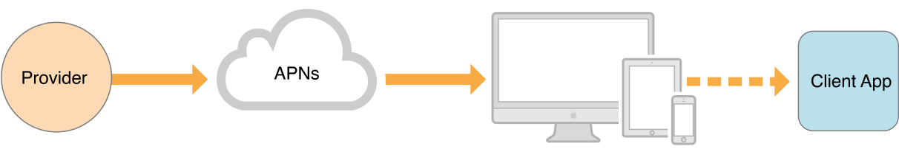

# Apple Remote Notification

原文见 [URL](https://developer.apple.com/library/archive/documentation/NetworkingInternet/Conceptual/RemoteNotificationsPG/index.html#//apple_ref/doc/uid/TP40008194-CH3-SW1)

To be able to receive and handle remote notifications, your app must:（从 APP 的角度看）

>- Enable remote notifications. // APP 启用推送服务
>- Register with Apple Push Notification service (APNs) and receive an app-specific device token. // APP 经过 APNs 获取 device token
>- Send the device token to your notification provider server. // APP 将 device token 上报后台服务
>- Implement support for handling incoming remote notifications. // APP 正确处理后台服务发来的推送消息

The ability of APNs to deliver remote notifications to a nonrunning app requires the app to have been launched at least once. // 至少打开过一次，安装没打开过的应用无法收到推送（压根没有连接过 APNs）

On an iOS device, if a user force-quits your app using the app multitasking UI, the app does not receive remote notifications until the user relaunches it. // 被杀后台则无法接收通知，直到重新启动（和 APNs 连接断了，相当于设备离线了？）

Each time your app launches, it must register with APNs. The methods to use differ according to the platform, but in all cases it works as follows:（每次启动 APP 都必须和 APNs 注册，这是 APP 开发时候做的）

>- Your app asks to be registered with APNs. // 向 APNs 注册
>- On successful registration, APNs sends an app-specific device token to the device. // APNs 分配 device token
>- The system delivers the device to your app by calling a method in your app delegate. // APP 处理
>- Your app sends the device token to the app’s associated provider. // APP 上报 device token

An app-specific device token is globally unique and identifies one app-device combination. Upon receiving a device token from APNs in your app, it is your responsibility to open a network connection to your provider. It is also your responsibility, in your app, to then forward the device token along with any other relevant data you want to send to the provider. // Device Token 是全局唯一的，APP 要做的就是从 APNs 拿到 device token 上报到自己的后台服务

Never cache device tokens in your app; instead, get them from the system when you need them. APNs issues a new device token to your app when certain events happen. The device token is guaranteed to be different, for example, when a user restores a device from a backup, when the user installs your app on a new device, and when the user reinstalls the operating system. Fetching the token, rather than relying on a cache, ensures that you have the current device token needed for your provider to communicate with APNs. When you attempt to fetch a device token but it has not changed, the fetch method returns quickly. // 应当假定token是易变的，不要缓存它；并且写好token变化时系统的回调函数。

APNs can issue a new device token for a variety of reasons:

>- User installs your app on a new device // 新设备安装
>- User restores device from a backup // 从备份恢复系统
>- User reinstalls the operating system // 重装系统
>- Other system-defined events // 其他系统级别的事件

As a result, apps must request the device token at launch time. // APP启动时请求DeviceToken！

When a device token has changed, the user must launch your app once before APNs can once again deliver remote notifications to the device.

APNs device tokens are of variable length. Do not hard-code their size. // device token 是变长的

Here are some examples of tasks you can perform with this framework:

>- If your app is in the foreground, you can receive the notification directly and silence it. // APP 在前台跑，可以直接处理 APNs 下发的通知
>- If your app is in the background or not running: 1. You can respond when the user selects a custom action associated with a notification. 2. You can respond when the user dismisses the notification or launches your app. // APP 在后台跑，也可以处理，就看 APP 怎么开发的，后台服务开发者其实不用太关心

You can modify the content or presentation of arriving notifications using app extensions. To modify the content of a remote notification before it is delivered, use a notification service app extension. To change how the notification’s content is presented onscreen, use a notification content app extension.

On initial launch of your app on a user’s device, the system automatically establishes an accredited, encrypted, and persistent IP connection between your app and APNs. This connection allows your app to perform setup to enable it to receive notifications. // APP 能收到推送，靠的是于 APNs 建立的长链接

The other half of the connection for sending notifications—the persistent, secure channel between a provider server and APNs—requires configuration in your online developer account and the use of Apple-supplied cryptographic certificates. A provider is a server, that you deploy and manage, that you configure to work with APNs.

If a notification for your app arrives with the device powered on but with the app not running, the system can still display the notification. If the device is powered off when APNs sends a notification, APNs holds on to the notification and tries again later.

Apple Push Notification service includes a Quality of Service (QoS) component that performs a store-and-forward function. If APNs attempts to deliver a notification and the destination device is offline, APNs stores the notification for a limited period of time and delivers it when the device becomes available again. This component stores only the most recent notification per device and per app. If a device is offline, sending a notification request targeting that device causes the previous request to be discarded. If a device remains offline for a long time, all its stored notifications in APNs are discarded. // APNS 下发通知时设备离线，则会暂存这个通知；多个下发失败的通知累积时只保留最后一个通知（好坑啊哈哈哈哈）；暂存也有一定时间限制

To allow the coalescing of similar notifications, you can include a collapse identifier within a notification request. Normally, when a device is online, each notification request that you send to APNs results in a notification delivered to the device. However, when the apns-collapse-id key is present in your HTTP/2 request header, APNs coalesces requests whose value for that key is the same. For example, a news service that sends the same headline twice could use the same collapse identifier value for both requests. APNs would then coalesce the two requests into a single notification for delivery to the device. // 为了避免上述情况，使用apns-collapse-id，apns-collapse-id 需求难做，一般推送通道是无状态的

Your provider servers have the following responsibilities for participating with APNs:

>- Receiving, via APNs, globally-unique, app-specific device tokens and other relevant data from instances of your app on user devices. This allows a provider to know about each running instance your app. // 后台服务接收 APP 上报的 device token 和其他信息
>- Determining, according to the design of your notification system, when remote notifications need to be sent to each device. // 下发通知的时候筛选 device token
>- Building and sending notification requests to APNs, each request containing a notification payload and delivery information; APNs then delivers corresponding notifications to the intended devices on your behalf. // 按照 APNs 的要求组织好通知消息，发给 APNs，然后就听天由命了

APNs enforces end-to-end, cryptographic validation and authentication using two levels of trust: connection trust and device token trust.

Connection trust works between providers and APNs, and between APNs and devices.

>- Provider-to-APNs connection trust establishes certainty that connection between a provider and APNs is possible only for an authorized provider, owned by a company that has an agreement with Apple for push notification delivery. You must take steps to ensure connection trust exists between your provider servers and APNs, as described in this section.
>- APNs-to-device connection trust ensures that only authorized devices can connect to APNs to receive notifications. APNs automatically enforces connection trust with each device to ensure the legitimacy of the device.

For a provider to communicate with APNs, it must employ a valid authentication key certificate (for token-based connection trust) or SSL certificate (for certificate-based connection trust). You obtain either of these certificates from your online developer account, as explained in “Configure push notifications” in Xcode Help. To choose between the two certificate types, read Provider-to-APNs Connection Trust. Whichever certificate type you choose, provider connection trust is prerequisite to a provider sending push notification requests to APNs.

Device token trust works end-to-end for each remote notification. It ensures that notifications are routed only between the correct start (provider) and end (device) points.

Each notification your provider server sends to the Apple Push Notification service (APNs) includes a payload. The payload contains any custom data that you want to send to your app and includes information about how the system should notify the user. You construct this payload as a JSON dictionary and send it as the body content of your HTTP/2 message（用 HTTP/2 协议，荷载用 JSON 格式，下面是大小限制）. The maximum size of the payload depends on the notification you are sending:

>- For regular remote notifications, the maximum size is 4KB (4096 bytes)
>- For Voice over Internet Protocol (VoIP) notifications, the maximum size is 5KB (5120 bytes)

If you are using the legacy APNs binary interface to send notifications instead of an HTTP/2 request, the maximum payload size is 2KB (2048 bytes)

provider 与 APNs 的加密方式可以是 JSON Web Token，每小时需要更新一次。也可以是其他方式，详见官网。
