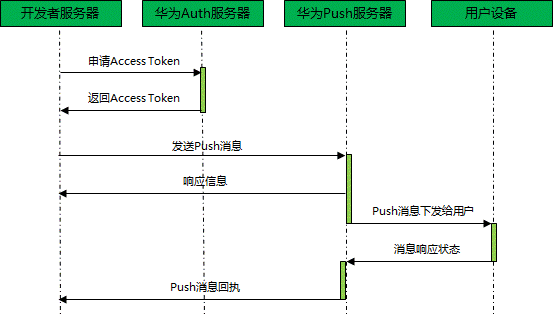
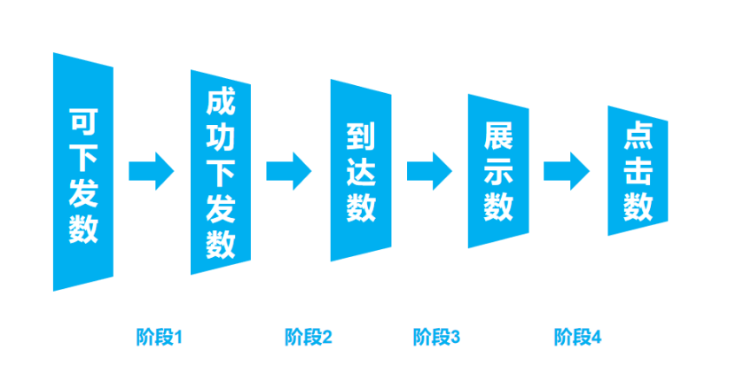

# Android Push

原文见 [URL](https://zhuanlan.zhihu.com/p/162944558)

## 背景

国内 Android 缺少 Google 的生态，如 Google 的 Paly Store，Google Mobile Services（GSM）等，导致衍生出很多畸形的产业，比如五花八门的 APP 市场，光怪陆离的推送平台。Google 本身的 GSM 服务是包含一套推送在里面的，跟 iOS 系统的推送类似，它保证每台手机维护一个推送通道就能收到各方推送。

国内的手机厂商基本都有自家的推送服务，来替代 GSM 的缺失，性能、用法参差不齐。在离线场景下（APP 死亡），如果想要收到推送，就必须接入对应厂家的推送服务，否则压根收不到。所以 Android APP 在诞生之初基本就要集成华为 push、小米 push、魅族 push、oppo push、Vivo push 等。

不过国内各种厂商倒是乐此不疲，他们多了一个触达用户及统计的渠道，并且还能不受 Google 挟制，对于开发者而言，就要麻烦很多，工作量平白翻了很多倍；有的聊天 APP 为了走自家的推送 SDK，还要琢磨各种黑科技：包活，APP 相互唤起等，恶之花，开的漫山遍野。更有意思的是，为了解决这种问题，制定出规范，还促生个各种机构，像推送联盟，绿色联盟等，但并没什么卵用，成立 3 年，乱象依旧，很多说 Android 很垃圾，那推送的这个问题要负一大半责任。

## 离线推送

对于手机端 APP 来说，推送分 APP 在线推送还是离线推送，其实就是 APP 是否存活，APP 存活情况下，有多种选择，如果 APP 通过 Socket 跟自家服务器建立了链接，则可以由自家服务器直接推送到 APP 端，也可以通过后端推送到第三方推送服务，借由第三方推送给 APP 端，也就是在线情况下，可以不用接入第三方 SDK。但是在 APP 死亡的情况，只有一种方式：借由第三方推送服务，推送给手机端，这种场景，APP 必须接入第三方厂商 SDK，拿华为平台为例，其推送模型如下：

与两者对应也有两种消息的概念：透传消息与通知栏消息：

透传消息：APP 存活情况下，由推送服务直接把消息发送给 APP 应用，由 APP 自己选择如何处理，注意透传的前提是 APP 存活 ，透传消息可以不用接入第三方 SDK。

通知栏消息：在设备接收到消息之后，由系统弹出标准安卓通知，用户点击通知栏才激活应用，这种场景，APP 无需存活（活着也不受影响），离线场景下，只有通知栏消息这一条路。

透传消息每个 APP 自己维护一条通道，离线消息只要一条系统通道。透传消息是自己的服务器和自家应用直连，离线消息则是借用手机厂商的服务器和用户设备连接下发的。

对于在线透传消息，由于是在 APP 存活的情况下收到的，APP 端可以统计到所有必要信息，无论是推送达时间、推送内容还是通知的点击都能统计到；但是离线推送就没那么幸运，很多信息 APP 自己是拿不到的，但是业务方通常非常关心到达率、点击率这些数据，必须有一个有效的解决方案。

这里不考虑在线推送，只考虑离线（APP 死亡），那么离线推送 APP 能统计到达吗？答案是不能，原因其实很简单，APP 进程都死了，怎么统计。这种情况下，通知的展示属于系统行为，APP 压根无法感知，更无从统计。不过各三方推送服务平台扔提供了推送到达统计的能力，即采用三方推送平台的回执。

### 个推流程

一条推送消息分为5个流程：可下发—成功下发—到达—展示—点击。

而这几个推送环节的数据个推是这么定义的：

>- 可下发数：与个推服务器在90天内有过请求的客户端，即被判定为可下发客户端数量 // APP 继承了个推 SDK，设备安装 APP 并打开，就会走像 APNs 的流程（对接设备厂商的细节屏蔽了）
>- 成功下发数：消息实际下发到用户设备的数量 // 可以理解成下发到设备厂商服务器上了？
>- 到达数：实际送达到设备的数量 // 厂商反馈的送达数量汇总
>- 展示数：在通知栏展示的设备数量 // 厂商/个推反馈的展示数量汇总
>- 点击数：点击消息的设备数量 // 厂商/个推反馈的点击数量汇总

可下发 -> 成功下发损失：最有可能就是 device token 无效了（卸载了，重装了等等）。

成功下发 -> 到达损失：最有可能就是 APP 挂了或者用户断网了导致设备离线了；还有可能是厂商限制（厂商推送限额或者内容过滤）；亦或者任务有效时间太短，用户连上厂商服务器时/厂商服务器要推消息时，推送过期了，

到达 -> 展示/点击：最有可能就是关闭通知权限了（除了 IM/TO-DO APP 全关）
