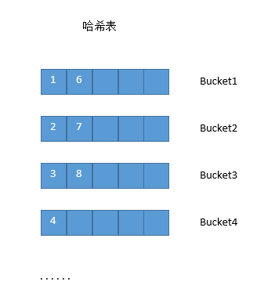

# 后台开发读书笔记

## 第三章 常用STL的使用

C++ 标准模板库的核心包括以下三个组件：

>- 容器（Containers）：容器是用来管理某一类对象的集合。C++ 提供了各种不同类型的容器。容器分为顺序性容器（vector、list、deque）、关联容器（map、set）和容器适配器（queue、stack）。
>- 算法（Algorithms）：算法作用于容器。它们提供了执行各种操作的方式，包括对容器内容执行初始化、排序、搜索和转换等操作。
>- 迭代器（iterators）：迭代器用于遍历对象集合的元素。这些集合可能是容器，也可能是容器的子集。

### string

#### C++字符串

C++标准库中定义了string类来处理可变长字符序列。使用string类要包含头文件，string定义在命名空间std中。

```cpp
/* 定义和初始化 */
// 生成空字符串s
string s;

// 拷贝构造函数，生成str的复制品
string s(string str);

// 将字符串str内始于位置stridx的部分当作字符串的初值
string s(string s, index stridx);

// 将字符串str内始于位置stridx且长度不超过strlen的部分作为字符串的初值
string s(char* str, int stridx, int strlen);

// 将C字符串作为初值
string s(char* cstr);

// 将C字符串前chars_len个字符作为字符串的处置
string s(char* chars, int chars_len);

// 生成一个包含num个字符c的字符串s
string s(int num, char c);

// 以区间[beg, end)内的字符作为字符串的初值
string s(char* beg, char* end);

/* 常用操作 */
// 字符串是否为空
str.empty();

// string类型转char*
str.c_str();

// 获取字符串长度
str.size();

// 获取字符串长度，length和size一样
str.length();

// 获取当前容量
str.capacity();

// 获取当前string对象中可存放的最大字符串长度
str.max_size();

// 操作符
s[n]      获取字符串第n个字符，类似于数组
+, +=     字符串相加：str1 + str2 ; str1 += str2
==, !=, < >, <=, => 字符串比较符，按照顺序比较每一个字符的ascii码值的大小

// 把当前字符串的大小设置为len，并用字符c填充不足的部分
void resize(int len, char c);

// 同operator+=()，在字符串末尾追加字符串s
string &append(const string &s);

// 在当前字符串结尾添加n个字符c
string &append(int n,char c);

// 把字符串s中从pos开始的n个字符连接到当前字符串的结尾
string &append(const string &s,int pos,int n);  

// 把c类型字符串s连接到当前字符串结尾
string &append(const char *s);  

// 把c类型字符串s的前n个字符连接到当前字符串结尾
string &append(const char *s, int n);

// 返回pos开始的n个字符组成的字符串，没有指明第二个参数时默认到字符串结尾
string substr(int pos = 0,int n = npos) const;

// 从pos开始查找字符c在当前字符串的位置
int find(char c, int pos = 0) const;

// 从pos开始查找字符串s在当前串中的位置
int find(const string &s, int pos = 0) const;

// 从pos开始查找字符串s在当前串中的位置
int find(const char *s, int pos = 0) const;

// 从pos开始从前向后查找字符串s中前n个字符在当前串中的位置，失败返回string::npos的值
int find(const char *s, int pos, int n) const;  

// 从pos开始从后向前查找字符c在当前串中的位置，失败返回string::npos的值
int rfind(char c, int pos = npos) const;

// 查找成功时返回所在位置，失败返回string::npos的值
int rfind(const string &s, int pos = npos) const;

// 交换当前字符串与字符串s2的值
void swap(string &s2);

// 删除当前字符串从位置p开始的n个字符，然后在p处插入串s
string &replace(int p, int n, const string &s);

// 删除当前字符串从位置p开始的n个字符，然后在p处插入串s中从pos开始的k个字符
string &replace(int p, int n, const string &s, int pos, int k);

// 删除当前字符串从位置p开始的n个字符，然后在p处插入k个字符c
string &replace(int p, int n, int k, char c);

// 在当前字符串p位置插入字符串s
string &insert(int p, const string &s);

// 在当前字符串p位置插入字符串s中pos开始的前n个字符
string &insert(int p,const string &s, int pos, int n);

// 在当前字符串p处插入n个字符c
string &insert(int p, int n, char c);  

// 删除当前字符串pos开始的n个字符，返回修改后的字符串
string &erase(int pos = 0, int n = npos);
```

string的遍历和数组类似str[i]，这里得到的是一个char类型字符，当用地址&str[i]获取时获取的不是一个字符，而是第i个字符及之后的字符，是char*类型。　　

#### C风格字符串

C语言中没有字符串类的封装，使用的是char*指针或char[]数组来表示字符串。两者有相同也有不同之处，char*定义的是一个指针，是需要分配空间的，或者直接使用常量字符串赋值，char[]定义的是一个数组，数组名实际就是一个char*指针。

```c
const char* str1 = "abcdefg";
char str2[] = "abcde";
char* str3 = str2 + 1;
char* str4 = (char*)malloc(10);
str4 = str3;
```

第一个使用字符串常量进行赋值给一个指针，"abcdefg"是一个常量，保存在静态存储区，因此要使用const修饰，不然会有warning，这个str1可以指向其它的字符串，指向其它字符串时可以改变指向位置的字符值，但是指向"abcdefg"时不能改变其值，因为其在常量区；

数组str2实际是一个指针，是可以赋值给char* 的，还可以进行加移位，上面的str3就指向："bcde"；不可用char* 来初始化char[], 因为char[]为数组，是需要分配空间大小的，char* 只是一个指针；

sizeof(str1) = 8; sizeof(str2) = 6; strlen(str1) = 7; strlen(str2) = 5; sizeof计算的是内存空间大小，str1为指针，64位下位8字节，str2有5个字符，加上一个字符串结束符'\0'共6个，strlen计算的是实际字符串中字符的个数，不包含字符串结束符'\0';

```cpp
// 按位置获取字符，char* 不支持==, !=, <, >等字符
str[]

// 返回字符串长度，不包括字符串结束符
size_t strlen(const char * str)

// 字符串src附加到dest后，返回的是dest
char* strcat(char* dest, const char* src)

// 字符串src拷贝到dest，返回的是dest
char* strcpy(char* dest, const char* src)

// 比较字符串str1，str2，相等为0，小于返回负值，大于返回正值
int strcmp(const char* str1, const char* str2)

// 将dest前面count个字符置为字符c。返回dest的值
void* memset(void* dest, int c, size_t count);

// 从src复制count字节的字符到dest
// 可以自动处理src和dest出现重叠的问题，返回dest的值
void* memmove(void* dest, const void* src, size_t count);

// 从src复制count字节的字符到dest
// 不能处理src和dest出现重叠
void* memcpy(void* dest, const void* src, size_t count);

// 比较buf1和buf2前面count个字节大小，相等为0，小于返回负值，大于返回正值
int memcmp(const void* buf1, const void* buf2, size_t count);

// 查找字符c在字符串str中第一次出现的位置
// 返回一个指针, 指向字符c在字符串str中首次出现的位置, 如果没有找到则返回NULL
char* strchr(const char* str, int c);

// 查找字符c在字符串str中最后一次出现的位置
// 返回一个指针，指向字符c在字符串str中最后一次出现的位置, 如果没有找到则返回NULL
char* strrchr(const char* str, int c);

// 在字符串str中查找strSearch子串
// 返回子串strSearch在str中首次出现位置的指针
// 如果没有找到子串strSearch, 则返回NULL
// 如果子串strSearch为空串, 函数返回str值
char* strstr(const char* str, const char* strSearch);

// 将源串src开始的count个字符添加到目标串dest后
// 源串src的字符会覆盖目标串dest后面的结束符NULL
// count大于源串长度, 则会用源串的长度值替换count值
// 得到的新串后面会自动加上字符串结束符
// 不能处理源串与目标串重叠的情况
// 函数返回dest
char* strncat(char* dest, const char* src, size_t count);

// 将源串src开始的count个字符复制到目标串dest所指定的位置
// count值小于或等于src串的长度, 不会自动添加字符串结束符目标串中
// count大于src串的长度时, 则将src用字符串结束符填充补齐count个字符复制到目标串中
// 不能处理源串与目标串重叠的情况
// 函数返回dest
char* strncpy(char* dest, const char* src, size_t count);
```

C++提供由C++字符串转换成对应的C字符串的方法有`data()`，`c_str()`。

>- const char* data();以字符数组的形式返回字符串的内容，但不添加'\0'。
>- const char* c_str();以字符数组的形式返回字符串的内容，且添加'\0'。这个数组是临时的，如果改变原始string的数据，该函数返回的指针所指向的内容也发生变化，所以一般调用c_str()后要考虑将数据复制出来。

#### 基本类型转换为string

将可变参数按照format格式化成字符串，然后将其复制到str中。如果格式化后的字符串长度小于size，则将此字符串全部复制到str中，并添加一个字符结束符'\0'。如果格式化后的长度不小于size，则指将其中（size-1）个字符复制到str中，并添加字符结束符。函数出错返回负值，否则打算写入的字符串长度。

```cpp
char a[20];
int i = snprintf(a, 9, "%012d", 12345);
// 按照12位的固定宽度输出int型数值，不足12位补0，超过12位按照实际位数输出

printf("i = %d, a = %s", i, a);
// i = 12, a = 00000001
```

转换后得到000000012345，截断（9-1）位，向a中写入00000001。

string转int需要用到strtol，strtoll，strtoul，strtoull函数。分别将nptr中的字符串根据参数base转换成相应的类型。base表示进制，取值范围位0，2～36。base为0时会根据字符串来选择进制，将字符串按照相应的进制来处理。0x开头用16进制，0开头用8进制，其他用10进制。然后输出结果使用10进制表示。函数会跳过空格直到遇到数字或者正负符号才会开始转换，再遇到非数字或者字符串结束时结束转换。endptr为首个未转换字符的索引值。

```cpp
long int strtol(const char* nptr, char **endptr, int base);
long long int strtoll(const char* nptr, char **endptr, int base);
unsigned long int strtoul(const char* nptr, char **endptr, int base);
unsigned long long int strtoull(const char* nptr, char **endptr, int base);
```

C++11新增了string和数值类型的转换函数。

```cpp
// int，long，unsigned long，long long，unsigned long long，float，double，long double
stoi() stol() stoul() stoll() stoull() stof() stod() stold()
// 基本重载了常见的数值类型
to_string()
```

```cpp
int snprintf(char* str, size_t size, const char* format, ...)
```

### vector

向量是一个封装了动态大小数组的顺序容器。跟任意其它类型容器一样，它能够存放各种类型的对象。可以简单的认为，向量是一个能够存放任意类型的动态数组。顺序容器中的元素按照严格的线性顺序排序。可以通过元素在序列中的位置访问对应的元素。支持对序列中的任意元素进行快速直接访问，甚至可以通过指针算述进行该操作。操供了在序列末尾相对快速地添加/删除元素的操作。容器使用一个内存分配器对象来动态地处理它的存储需求。

```cpp
/* 构造函数 */
// 假设vector存储的元素类型为int
vector<int> vec {1, 2, 3}; // {}初始化vec
int nSize = 3;
int val = 1;

// 创建一个空vector，不含任何元素
vector<int> v1();

// 创建一个vector，元素个数为nSize，元素被初始化为默认值
vector<int> v2(nSize);

// 创建一个vector，元素个数为nSize，值均为val
vector<int> v3(nSize, val);

// 复制构造函数
vector<int> v4(vec);

// 复制[begin,end)区间内另一个数组的元素到vector中
vector<int> v5(vec.begin(), vec.end());

/* 常用函数 */
// 判断vector是否为空，若为空，则向量中无元素
bool empty() const;

// 返回vector中元素的个数
int size() const;

// 返回vector不扩容的情况下所能容纳的元素个数的最大值
int capacity() const;

//返回vector最大可允许的元素数量
int max_size() const;

// 交换两个同类型vector的数据
void swap(vector& vec);

// 设置vector中第n个元素的值为x
void assign(int n, const T& x);

// 将当前vector中的元素替换为[first,last)中的元素
void assign(const_iterator first, const_iterator last);

/* 插入函数 */
// 在vector尾部增加一个元素X
void push_back(const T& x);

// 在vector迭代器指向元素前增加一个元素x，返回指向新插入元素的迭代器
iterator insert(iterator it, const T& x);

// 在vector迭代器指向元素前增加n个相同的元素x，返回指向第一个新插入元素的迭代器
void insert(iterator it, int n, const T& x);

// 在vector迭代器指向元素前插入另一个相同类型向量的[first,last)间的数据
// 返回指向第一个新插入元素的迭代器
void insert(iterator it, const_iterator first, const_iterator last);

/* 删除函数 */
// 删除vector中最后一个元素
void pop_back();

// 清空vector中所有元素
void clear();

// 删除vector迭代器指向元素，返回指向删除元素的下一个元素的迭代器
iterator erase(iterator it);

// 删除vector中[first,last)中元素，返回指向最后一个删除元素的下一个元素的迭代器
iterator erase(iterator first, iterator last);
```

调用erase()函数后，vector后面的元素会向前移位，形成新的容器，这样原来指向删除元素的迭代器就失效了。因此删除vector中某个元素要这样做：

```cpp
for (auto it = vec.begin(); it != vec.end();) {
    if (*it == 0) {              // 待删除元素的值为0
        it = vec.erase(it);      // 返回删除元素的下一个元素的迭代器
    } else {
        ++it;
    }
}
```

```cpp
/* 遍历函数 */
// 返回pos位置元素的引用
reference at(int pos);

// 返回首元素的引用
reference front();

// 返回尾元素的引用
reference back();

// 返回vector迭代器，指向第一个元素
iterator begin();

// 返回vector迭代器，指向最后一个元素的下一个位置
iterator end();

// 返回vector反向迭代器，指向最后一个元素
reverse_iterator rbegin();

// 返回vector反向迭代器，指向第一个元素之前的位置
reverse_iterator rend();
```

### map

map是一种有序无重复的关联容器。关联容器与顺序容器不同，其元素是按照关键字来保存和访问的，而顺序元素是按照元素在容器中的位置保存和访问的。map保存的是一种key-value的pair对象，其中key是关键字，value是关键字对应的值，其中key是const的，即不可以改变map中的key，通过key可以找到对应的value。map中按照key的大小升序排列pair对象。map在底层通常用红黑树实现。在map中定位特定的元素比unordered_map要慢，因为在 map中需要根据key的大小进行顺序查找。但是在map中允许直接选取一定范围的元素。

```cpp
typedef pair<const Key, T> value_type

template < class Key,                                     // map::关键字类
           class T,                                       // map::值类型
           class Compare = less<Key>,                     // map::关键字比较函数
           class Alloc = allocator<pair<const Key,T> >    // map::allocator类
           > class map;
```

模板参数的第三个

```cpp
class Compare = less<Key>
```

是一种比较函数。这也是一个class类型对象，而且提供了默认值

```cpp
less<Key>
```

less时STL里面一个函数对象。函数对象，即调用操作符的类，其对象通常称为函数对象，它们是行为类似函数的对象。表现出函数的特征是通过"对象名+(参数列表)"的方式使用一个类，其实质是对operater()操作符的重载。

```cpp
template <class T>
struct less : binary_function <T, T, bool> {
    bool operator() (const T& x, const T& y) const {
        return x < y;
    }
}
```

通过这个比较函数，map能比较两个不同的key值的大小关系以及是否相等。默认采用less<>，即Key类型的"<"操作符。如果Key类型没有"<"操作符的定义，则需要提供一个自定义比较函数的函数指针，来作为Compare函数。

```cpp
/* 构造函数 */
// 默认构造，构造一个空的map
// 必要时要给出模板参数中的Compare
map<Key, value> m;

// 范围构造，将迭代器[frist, last)范围内的元素填入map中
map<key, value> m(iterator first, iterator last);　　

// 拷贝构造，用m2构造m
map<key, value> m(const map& m2);　　

// 初始化列表构造
map<key, value> m(initializer_list<value_type> il)

// 通过{}构造pair来构造map
map<key, value> m{{key k1, value v1},{k2, v2}, ...}

// 通过make_pair()构造pair来构造map
map<key, value> m{make_pair(key k1, value v1), make_pair(k2, v2), ...}

// 通过类型转换构造pair来构造map
map<key, value> m{pair<key, value>(k1, v1), pair<key, value>(k2, v2), ...}

// 赋值操作符=
map& operator= (const map& x)　  // 拷贝赋值
map& operator= (map&& x)　　　　 // 移动复制
map& operator= (initializer_list<value_type> il)　　// 参数列表赋值
```

map的迭代器有begin, end, rbegin, rend，cbegin, cend, crbegin, crend。迭代器支持++, --操作，但是不支持+i操作。

map中是根据key的值来排列元素的位置的，所以通过迭代器遍历出来的结果顺序，可能和插入值的顺序不同。

对map的迭代器解引用的结果是得到一个pair类型的对象。它有两个共有成员first, second。first保存key的值，second保存value的值。由于map的key是const的，所以得到的pair的first也是const的。

```cpp
/* 常用函数 */
// 判断map是否为空
bool empty() const;

// 获取map中pair的数量
size_type size() const;

// 获取map可容纳的pair最大数量
size_type max_size() const;

// 判断k是否存在，如果存在则返回1，否则返回0
size_type count(const key_type＆k) const;

// 查找k，如果存在返回pair的迭代器，否则返回end()
iterator find(const key_type＆k);

// 交换两个map的内容
void swap(map &x);

// 清空一个map的所有元素
void clear();

// []操作符，返回map中Key为k的元素的value的引用
// 如果k不存在，则插入一个key为k的元素，并返回其默认value
mapped_type＆operator[] (const key_type＆k);

// at()，返回map中Key为k的元素的value的引用
// 如果k不存在，则抛一个out_of_range异常
// 使用at不会添加元素，不会增加map的大小
mapped_type＆at（const key_type＆k）;
const mapped_type＆at（const key_type＆k）const;

/* 插入操作 */
// 单个值插入
// 参数为pair类型，first为key, second为value
// 返回值为pair类型，first为插入后的iterator，second为bool类型
// 插入失败是因为map中已经有一个key与输入相同，这次插入操作对map不会有任何影响
// 失败时返回值的first为已有的key-value的迭代器
pair<iterator, bool> insert(const pair<key, value> &val);

// 提示值插入
// 从pos指定的位置开始查找val应该插入的位置
// 如果设定值合适，可以减少插入时做查找的时间
iterator insert(const_iterator pos, const pair<key, value> &val);

// 范围插入，插入[first, second)范围内的内容
void insert(iterator first, iterator second);

// 初始化列表插入
void insert(initializer_list<value_type> il);

// insert首先构造临时value_type对象，再copy到map中
// emplace直接在map里根据参数构造value_type对象
// 返回值与 insert情况相同
pair<iterator, bool> emplace(key k, value v);

// 提示位置的插入
// 从pos开始查找应该插入的位置，其余和 emplace相同
iterator emplace(const iterator pos, key k, value v);

/* 删除操作 */
// 删除迭代器指向的内容
iterator erase(const_iterator position);
　　
// 删除迭代器范围内的内容
iterator erase(const_iterator first, const_iterator last);

// 删除key为k的元素，返回删除的数目
size_type erase(const key_type &k);
```

### set

set是关联容器，set作为一个容器是用来存储同一种数据类型的数据结构，基本功能与数组相似。不同的是，在set中每个元素的值都是唯一的。而且系统能够根据元素的值自动进行排序。但是set中数元素的值并不能直接被改变。C++ STL中标准关联容器set, multiset, map, multimap内部采用的是红黑树。红黑树的统计性能要好于一般平衡二叉树，所以被STL选择作为了关联容器的内部结构。

```cpp
/* 常用函数 */
// 返回set容器的第一个元素的迭代器
begin();

// 返回set容器的最后一个元素的下一个位置的迭代器
end();

// 返回set容器的最后一个元素的反向迭代器
rbegin();

// 返回set容器的第一个元素的下一个位置的反向迭代器
rend();

// 删除set容器中的所有的元素
clear();

// 判断set容器是否为空
empty();

// 返回set容器可能包含的元素最大个数
max_size();

// 返回set容器中的元素个数
size();

// 找set容器中某个某个键值出现的次数
count();

// 删除迭代器it指向的值
erase(it);

// 删除迭代器first和second之间的值
erase(first, second);

// 删除键值k的值
erase(k);

// 返回给定值值得定位器，如果没找到则返回end()。
find();

// 将key插入到set中
// 返回值是pair<set<int>::iterator,bool>
// bool表示插入是否成功
// iterator是key在set中的迭代器
insert(key);

// 将迭代器first到second之间的元素插入到set中
inset(first,second);

// 返回第一个大于或等于key的元素
lower_bound(key);

// 返回第一个大于key的元素
upper_bound(key);

// 返回一对迭代器，分别指向第一个大于或等于key的元素和第一个大于key的元素
// 返回值是一个pair类型，如果这一对定位器中哪个返回失败，就会等于s.end()
equal_range(key)
```

### unordered_map/set

unorder说明了其底层实现是Hash而非红黑树。因为可以在声明unordered模版类的时候，传入一个自定义的哈希函数对象。unordered_map/set在提供映射、集合功能的情况下，侧重于元素的快速获取。用树结构实现的map、set，在查找、获取、修改元素的时候，通常需要从根结点自上而下一次遍历树结构，因此时间复杂度O(logn)；而通过哈希表实现，只要哈希函数以及桶的大小选取得当，时间复杂度会是O(1)。



具有相同相同哈希值的元素被放在同一个桶中。

unordered_map/set只提供前向迭代器，也不再提供lower_bound()和upper_bound()函数。map/set是有序容器，对每一个元素都能都能判断它应该在哪个之前、在哪个之后；而该版本的容器是乱序的，不能确定每个元素的先后顺序。容器没有足够的信息来计算这两个边界。

出于实现的概念，该版本的类模版必不可少的多了些特殊的概念和函数。

Buckets

>- bucket_count // 桶数量
>- max_bucket_count // 最大桶数量
>- bucket_size // 桶大小，即容量
>- bucket // 定位给定元素的桶位置

Hash policy

>- load_factor // 返回load factor，即容器当前元素数量与桶数量之比
>- max_load_factor // 返回或设置最大load factor
>- rehash // 设置桶的数量，并重新对元素进行哈希映射
>- reserve // 请求保留桶的数量至给定值

Observers

>- hash_function // 返回哈希函数
>- key_eq // 返回key的相等性谓词，情况与hash_function相似

### priority_queue的Compare函数对象

```cpp
template<typename _Tp,
         typename _Sequence = vector<_Tp>,
         typename _Compare  = less<typename _Sequence::value_type> >
```

第一个参数 _Tp： 指定存储的类型名称；

第二个参数 _Sequence： 指定存储的数据结构，该结果必须支持随机存取迭代器；

第三个参数 _Compare ： 比较函数，对于自定义类型有两种方法实现大小顶堆，第一个是重载操作符，第二个是写一个结构实现比较。

```cpp
// 大根堆
priority_queue<int, vector<int>> pqueue_int; // 省略了比较泛型函数less<int>

// 小根堆
priority_queue<int,vector<int>, greater<int>> pqueue_int; // greater<int>的int可省略

// 自定义数据类型的堆的实现
struct node {
    int x;
    int y;
    node(int a, int b) : x(), y(b) {}

    /* 第一种方式：成员重载<或者>操作符 */
    bool operator<(const node &n) const {
        if (x == n.x) return y < n.y;
        return x < n.x;
    }

    bool operator>(const node &n) const {
        if (x == n.x) return y > n.y;
        return x > n.x;
    }

    /* 第二种方式：友元函数重载<或者>操作符 */
    friend bool operator<(node a, node b);

    friend bool operator>(node a, node b);
};

bool operator<(node a, node b) {
    if (a.x == b.x) return a.y < b.y;
    return a.x < b.x;
}

bool operator>(node a, node b) {
    if (a.x == b.x) return a.y > b.y;
    return a.x > b.x;
}

/* 第三种方式：compare函数对象 */
struct cmpless {
    bool operator()(node a, node b) {
        if (a.x == b.x) return a.y < b.y;
        return a.x > b.x;
    }
};

struct cmpgreater {
    bool operator()(node a, node b) {
        if (a.x == b.x) return a.y < b.y;
        return a.x > b.x;
    }
};

// 第一种和第二种
priority_queue<node, vector<node>, less<>> pqueue_node;
priority_queue<node, vector<node>, greater<>> pqueue_node;

// 第三种
priority_queue<node, vector<node>, cmpless> pqueue_node;
priority_queue<node, vector<node>, cmpgreater> pqueue_node;

//第四种
auto cmp = [](node a, node b) -> bool {
    if (a.x == b.x) return a.y < b.y;
    return a.x < b.y;
};
priority_queue<node, vector<node>, decltype(cmp)> pqueue_node(cmp);
```

### STL Algo

```cpp
lower_bound(beg, end, const T& value);

lower_bound(beg, end, const T& vlaue, op);

upper_bound(beg, end, const T& value);

upper_bound(beg, end, const T& value, op);

equal_range(beg, end, const T& value);

distance(from, end);

advance(start, n);
```

lower_bound()返回第一个“大于等于value”的元素位置，这里可插入“元素值为value”且“不破坏区间[beg, end)已序性”的第一个位置；upper_bound()返回第一个“大于value”的元素位置，这是可插入“元素值为value”且“不破坏区间[beg, end)已序性”的最后一个位置；如果不存在“其值为value”的元素，上述所有算法都返回end；op是个可有可无的二元判断式，被当作排序准则：op(elem1,elem2)。equal_range()同时返回这两个结果。

举个例子，对于vector\<int\> num{1, 3, 5}, lower_bound(0/1/2/3/4/5/6) -> iterator 0,0,1,1,2,2,end; upper_bound(0/1/2/3/4/5/6) -> 0,1,1,2,2,end,end。

distance()返回从from走到end所需的自增数。迭代器必须满足遗留输入迭代器 (LegacyInputIterator) 的要求。若迭代器额外满足遗留随机访问迭代器 (LegacyRandomAccessIterator) 的要求则操作更高效。若使用随机访问迭代器且from可从last抵达，则值可能为负。 (C++11 起)

advance()增加给定的迭代器start以n个元素的步长。若n为负，则迭代器自减。该情况下，start必须满足遗留双向迭代器 (LegacyBidirectionalIterator) 的要求，否则行为未定义。

调用者必须确保进入算法之际，所有区间都已经按照排序准则排好序了；关联式容器(set，multiset，map，multimap)分别提供等效成员函数，性能更佳复杂度：如果搭配随机存取迭代器，则为对数复杂度，否则为线性复杂度；
