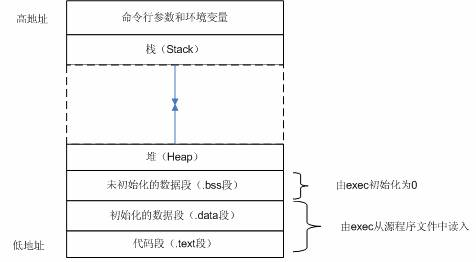

# 后台开发读书笔记

## 第五章 调试

### GNU debugger：gdb

gdb 是 gcc 的调试工具。可以启动程序，按照用户需求运行。可以在指定断点停住，然后可以检查程序中运行的状态。可以动态的改变程序执行的环境。要调试 C/C++ 程序必须在编译时把调试信息加到可执行文件中。使用编译器 gcc/g++ 的-g 参数可以实现。

```shell
gcc -g main.c -o main
g++ -g main.cpp -o main
```

```shell
# 启动程序
gdb program

# 从第一行列出源码
list
# 按下 ENTER 表示重复上一次的命令
# 然后继续列出源码

# 在源代码的第 6 行设置断点
break 6
# 在函数 func 的入口处设置断点
break func
# 以条件表达式设置断点
break 6 if i==5
# 查看断点信息，断点有编号 b_id
info break
# 运行程序
run
# 单条语句执行
next
# 打印变量 i 的信息
print i
# 打印变量 arr[i] 的信息
print arr[i]

# 使断点失效，b_id 为断点编号
disable breakpoint b_id
# 使断点有效，b_id 为断点编号
enable breakpoint b_id
# 删除断点，b_id 为断点编号
delete breakpoint b_id

# 删除程序中所有的断点
clear
# 删除第 6 行的所有断点
clear 6
# 删除该函数 func 的断点
clear func

# 继续运行程序
continue
# 查看函数堆栈
bt
# 退出函数
finish
# 结束调试
quit
```

### core

在 Linux 下程序不寻常退出时，内核会在当前工作目录下生成一个 core 文件（是一个内存映像，同时加上调试信息，编译时要加上-g 选项）。使用 gdb 来查看 core 文件，可以指示出导致程序出错的代码所在文件和行数。

```shell
# 查看生成 core 文件的选项是否打开。0 表示关闭。
ulimit -c
# 设置生成 core 文件大小上限（单位 kbyte）如果生成的信息超过此大小，将会被裁剪，最终生成一个不完整的 core 文件或者根本就不生成。
ulimit -c filesize
# 设置生成 core 文件大小不受限
ulimit -c unlimited
# 显示所有的用户定制，其中选项-a 代表 all。
ulimit -a
```

*ulimit 限制的是当前 shell 进程以及其派生的子进程。ulimit 命令设置后只对一个终端有效，所以另起终端后需要重新设置。* 针对单个用户可以修改~/.bash_profile 添加修改命令，针对所有用户可以修改 /etc/profile。

core 文件生成路径为输入可执行文件运行命令的当前路径。若系统生成的 core 文件不带其它任何扩展名称，则全部命名为 core。新的 core 文件生成将覆盖原来的 core 文件。

/proc/sys/kernel/core_uses_pid 可以控制 core 文件的文件名中是否添加 pid 作为扩展。文件内容为 1，表示添加 pid 作为扩展名，生成的 core 文件格式为 core.xxxx；为 0 则表示生成的 core 文件同一命名为 core。

/proc/sys/kernel/core_pattern 可以控制 core 文件的命名规则。echo "/corefile/core-%e-%p-%t" > core_pattern，可以将 core 文件统一生成到 /corefile 目录下，产生的文件名为 core-命令名-pid-时间戳。

>- %p - insert pid into filename 添加 pid
>- %u - insert current uid into filename 添加当前 uid
>- %g - insert current gid into filename 添加当前 gid
>- %s - insert signal that caused the coredump into the filename 添加导致产生 core 的信号
>- %t - insert UNIX time that the coredump occurred into filename 添加加 core 文件生成时的 unix 时间
>- %h - insert hostname where the coredump happened into filename 添加加主机名
>- %e - insert coredumping executable name into filename 添加命令名

/proc 文件系统是一个伪文件系统，以文件系统的方式为访问系统内核数据的操作提供接口。

在 /etc/sysctl.conf 文件中，对 sysctl 变量 kernel.core_pattern 的设置。

```shell
vi /etc/sysctl.conf
# 在 sysctl.conf 文件中添加
kernel.core_pattern = /tmp/corefile/core.%e.%t.%p
kernel.core_uses_pid = 0
```

如果 /tmp/corefile 目录原先不存在，那么生成的 core 文件就无处存放，所以要先确定设置的目录是事先存在的。该路径必须应用有写的权限，不然 core 文件是不会生成的。再执行命令`sysctl -p`即可生效。

```shell
# 调试 core 文件
gdb 程序 -c core 文件

# show stacktrack
# bt 

# show stacktrack of all threads
# thread apply all bt
```

### Linux 命令：top

top 命令实时显示进程的状态。默认状态显示的是 cpu 密集型的进程，并且每 5 秒钟更新一次。可以通过 PID 的数字大小，age (newest first), time (cumulative time), resident memory usage（常驻内存使用）以及进程从启动后占用 cpu 的时间。

```shell
# mac os
Processes: 265 total, 2 running, 263 sleeping, 955 threads                       02:33:24
Load Avg: 1.38, 1.07, 0.51  CPU usage: 3.28% user, 2.79% sys, 93.92% idle
SharedLibs: 784M resident, 120M data, 210M linkedit.
MemRegions: 24252 total, 1307M resident, 160M private, 560M shared.
PhysMem: 5495M used (1838M wired), 11G unused.
VM: 1185G vsize, 1116M framework vsize, 0(0) swapins, 0(0) swapouts.
Networks: packets: 3748/1036K in, 5449/1540K out.
Disks: 47130/2032M read, 10825/1343M written.

PID  COMMAND      %CPU TIME     #TH   #WQ  #PORT MEM    PURG   CMPR PGRP PPID STATE
565  top          2.3  00:00.83 1/1   0    23    3008K  0B     0B   565  522  running
562  TMHelperAgen 0.0  00:00.11 3     1    157   5044K  0B     0B   562  1    sleeping
551  com.apple.Di 0.0  00:00.05 2     2    32    1796K  0B     0B   551  1    sleeping
522  zsh          0.0  00:00.17 1     0    19    2184K  0B     0B   522  521  sleeping
```

```shell
# linux
top - 21:31:26 up 15:16,  5 users,  load average: 0.61, 0.82, 0.75
Tasks: 240 total,   2 running, 238 sleeping,   0 stopped,   0 zombie
%Cpu(s): 13.7 us,  1.5 sy,  0.0 ni, 84.2 id,  0.6 wa,  0.0 hi,  0.0 si,  0.0 st
KiB Mem :  3775264 total,   250100 free,  2495300 used,  1029864 buff/cache
KiB Swap:  4064252 total,  2789544 free,  1274708 used.   527664 avail Mem

  PID USER      PR  NI    VIRT    RES    SHR S  %CPU %MEM     TIME+ COMMAND
16507 kiosk     20   0 1935284 201988  10816 R  46.8  5.4  68:11.92 plugin-con+
15773 kiosk     20   0 1784208 497692  40776 S   4.7 13.2  37:05.32 firefox
  408 root      20   0   36940   4116   3920 S   3.0  0.1   4:51.67 systemd-jo+
 3789 kiosk     20   0  747664  14124   4696 S   2.0  0.4   2:49.76 gnome-term+
 2404 root      20   0  439488 106688  84580 S   1.7  2.8  16:08.35 Xorg
 2662 kiosk      9 -11  700096   5232   3032 S   1.7  0.1   5:17.25 pulseaudio
 ```

top 命令的第一行：

```shell
top - 21:31:26 up 15:16,  5 users,  load average: 0.61, 0.82, 0.75
```

依次对应：系统当前时间 up 系统到目前为止运行的时间，当前登陆系统的用户数量，load average 后面的三个数字分别表示距离现在一分钟，五分钟，十五分钟的负载情，其数值不应超过处理器核心数。load average 数据是每隔 5 秒钟检查一次活跃的进程数，然后按特定算法计算出的数值。如果这个数除以逻辑 CPU 的数量，结果高于 5 的时候就表明系统在超负荷运转了。

top 命令的第二行：

```shell
Tasks: 240 total, 2 running, 238 sleeping,   0 stopped,   0 zombie
```

依次对应：tasks 表示任务（进程），240 total 则表示现在有 240 个进程，其中处于运行中的有 2 个，238 个在休眠（挂起），stopped 状态即停止的进程数为 0，zombie 状态即僵尸的进程数为 0 个。

top 命令的第三行，cpu 状态：

```shell
%Cpu(s): 13.7 us,  1.5 sy,  0.0 ni, 84.2 id,  0.6 wa,  0.0 hi,  0.0 si,  0.0 st
```

依次对应：

>- us:用户空间占用 cpu 的百分比
>- sy:内核空间占用 cpu 的百分比
>- ni:改变过优先级的进程占用 cpu 的百分比
>- id:空闲 cpu 百分比
>- wa:IO 等待占用 cpu 的百分比
>- hi:硬中断占用 cpu 的百分比
>- si:软中断占用 cpu 的百分比
>- st:被 hypervisor 偷去的时间

top 命令第四行，内存状态：

```shell
KiB Mem :  3775264 total,   250100 free,  2495300 used,  1029864 buff/cache
```

依次对应：物理内存总量（3.7G)，空闲内存总量（2.5G)，使用中的内存总量（2.4G)，缓冲内存量。

第四行中使用中的内存总量（used）指的是现在系统内核控制的内存数，空闲内存总量（free）是内核还未纳入其管控范围的数量。纳入内核管理的内存不见得都在使用中，还包括过去使用过的现在可以被重复利用的内存，内核并不把这些可被重新使用的内存交还到 free 中去，因此在 linux 上 free 内存会越来越少，但不用为此担心。

top 命令第五行，swap 交换分区：

```shell
KiB Swap:  4064252 total,  2789544 free,  1274708 used.   527664 avail Mem
```

依次对应：交换区总量（4G），空闲交换区总量（2.7G)，使用的交换区总量（1.2G），可用交换取总量。

对于内存监控，在 top 里我们要时刻监控第五行 swap 交换分区的 used，如果这个数值在不断的变化，说明内核在不断进行内存和 swap 的数据交换，这是真正的内存不够用了。

top 命令第六行是空行。

top 命令第七行，各进程的监控：

```shell
PID USER      PR  NI    VIRT    RES    SHR S  %CPU %MEM     TIME+ COMMAND
```

依次对应：

>- PID — 进程 id
>- USER — 进程所有者
>- PR — 进程优先级
>- NI — nice 值。负值表示高优先级，正值表示低优先级
>- VIRT — 进程使用的虚拟内存总量，单位 kb。VIRT=SWAP+RES
>- RES — 进程使用的、未被换出的物理内存大小，单位 kb。RES=CODE+DATA
>- SHR — 共享内存大小，单位 kb
>- S — 进程状态。D= 不可中断的睡眠状态 R= 运行 S= 睡眠 T= 跟踪 / 停止 Z= 僵尸进程
>- %CPU — 上次更新到现在的 CPU 时间占用百分比
>- %MEM — 进程使用的物理内存百分比
>- TIME+ — 进程使用的 CPU 时间总计，单位 1/100 秒
>- COMMAND — 进程名称（命令名 / 命令行）

### Linux 命令：ps

Linux 中的 ps 命令是 Process Status 的缩写。ps 命令用来列出系统中当前运行的那些进程。ps 命令列出的是当前那些进程的快照，就是执行 ps 命令的那个时刻的那些进程，如果想要动态的显示进程信息，就可以使用 top 命令。

linux 上进程有 5 种状态 .

>- 运行 (正在运行或在运行队列中等待)
>- 中断 (休眠中 , 受阻 , 在等待某个条件的形成或接受到信号)
>- 不可中断 (收到信号不唤醒和不可运行 , 进程必须等待直到有中断发生)
>- 僵死 (进程已终止 , 但进程描述符存在 , 直到父进程调用 wait4() 系统调用后释放)
>- 停止 (进程收到 SIGSTOP, SIGSTP, SIGTIN, SIGTOU 信号后停止运行运行)

ps 工具标识进程的 5 种状态码。

>- D 不可中断 uninterruptible sleep (usually IO)
>- R 运行 runnable (on run queue)
>- S 中断 sleeping
>- T 停止 traced or stopped
>- Z 僵死 a defunct (”zombie”) process

命令参数。

>- a 显示所有进程
>- -a 显示同一终端下的所有程序
>- -A 显示所有进程
>- c 显示进程的真实名称
>- -N 反向选择
>- -e 等于 “-A”
>- e 显示环境变量
>- f 显示程序间的关系
>- -H 显示树状结构
>- r 显示当前终端的进程
>- T 显示当前终端的所有程序
>- u 指定用户的所有进程
>- -au 显示较详细的资讯
>- -aux 显示所有包含其他使用者的行程
>- -C<命令> 列出指定命令的状况
>- –lines<行数> 每页显示的行数
>- –width<字符数> 每页显示的字符数
>- –help 显示帮助信息
>- –version 显示版本显示

ps 与 grep 常用组合用法，查找特定进程。

```shell
ps -ef | grep ssh
```

```shell
ps -ef | grep ssh

root      2720     1  0 Nov02 ?        00:00:00 /usr/sbin/sshd
root     17394  2720  0 14:58 ?        00:00:00 sshd: root@pts/0
root     17465 17398  0 15:57 pts/0    00:00:00 grep ssh
```

将目前属于自己这次登入的 PID 与相关信息列示出来

```shell
ps -l

F S   UID   PID  PPID  C PRI  NI ADDR SZ WCHAN  TTY          TIME CMD
4 S     0 17398 17394  0  75   0 - 16543 wait   pts/0    00:00:00 bash
4 R     0 17469 17398  0  77   0 - 15877 -      pts/0    00:00:00 ps
```

>- F 代表这个程序的旗标 (flag)，4 代表使用者为 super user
>- S 代表这个程序的状态 (STAT)
>- UID 程序被该 UID 所拥有
>- PID 就是这个程序的 ID
>- PPID 则是其上级父程序的 ID
>- C CPU 使用的资源百分比
>- PRI Priority
>- NI Nice 值
>- ADDR 这个是 kernel function，指出该程序在内存的那个部分。如果是个 running 的程序，一般就是 “-”
>- SZ 使用掉的内存大小
>- WCHAN 目前这个程序是否正在运作当中，若为 - 表示正在运作
>- TTY 登入者的终端机位置
>- TIME 使用掉的 CPU 时间
>- CMD 所下达的指令为何

在预设的情况下， ps 仅会列出与目前所在的 bash shell 有关的 PID 而已，所以， 当我使用 ps -l 的时候，只有三个 PID。

```shell
# 列出目前所有的正在内存当中的程序
ps aux

USER       PID %CPU %MEM    VSZ   RSS TTY      STAT START   TIME COMMAND
root         1  0.0  0.0  10368   676 ?        Ss   Nov02   0:00 init [3]
root         2  0.0  0.0      0     0 ?        S<   Nov02   0:01 [migration/0]
root         3  0.0  0.0      0     0 ?        SN   Nov02   0:00 [ksoftirqd/0]
root         4  0.0  0.0      0     0 ?        S<   Nov02   0:01 [migration/1]
root         5  0.0  0.0      0     0 ?        SN   Nov02   0:00 [ksoftirqd/1]
root         6  0.0  0.0      0     0 ?        S<   Nov02  29:57 [events/0]
root         7  0.0  0.0      0     0 ?        S<   Nov02   0:00 [events/1]
root         8  0.0  0.0      0     0 ?        S<   Nov02   0:00 [khelper]
root        49  0.0  0.0      0     0 ?        S<   Nov02   0:00 [kthread]
root        54  0.0  0.0      0     0 ?        S<   Nov02   0:00 [kblockd/0]
root        55  0.0  0.0      0     0 ?        S<   Nov02   0:00 [kblockd/1]
root        56  0.0  0.0      0     0 ?        S<   Nov02   0:00 [kacpid]
```

>- USER：该 process 属于那个使用者账号的
>- PID ：该 process 的号码
>- %CPU：该 process 使用掉的 CPU 资源百分比
>- %MEM：该 process 所占用的物理内存百分比
>- VSZ ：该 process 使用掉的虚拟内存量 (Kbytes)
>- RSS ：该 process 占用的固定的内存量 (Kbytes)
>- TTY ：该 process 是在那个终端机上面运作，若与终端机无关，则显示 ?，另外，tty1-tty6 是本机上面的登入者程序，若为 pts/0 等等的，则表示为由网络连接进主机的程序。
>- STAT：该程序目前的状态，主要的状态有：R ：该程序目前正在运作，或者是可被运作；S ：该程序目前正在睡眠当中 (可说是 idle 状态)，但可被某些讯号 signal) 唤醒；T ：该程序目前正在侦测或者是停止了；Z ：该程序应该已经终止，但是其父程序却无法正常的终止他，造成 zombie (疆尸) 程序的状态
>- START：该 process 被触发启动的时间
>- TIME ：该 process 实际使用 CPU 运作的时间
>- COMMAND：该程序的实际指令

### Linux 程序内存空间布局



一个典型的 Linux C 程序内存空间由如下几部分组成：

>- 代码段（.text）：这里存放的是 CPU 要执行的指令。代码段是可共享的，相同的代码在内存中只会有一个拷贝，同时这个段是只读的，防止程序由于错误而修改自身的指令。
>- 初始化数据段（.data）：这里存放的是程序中需要明确赋初始值的变量，例如位于所有函数之外的全局变量：int val=100。需要强调的是，以上两段都是位于程序的可执行文件中，内核在调用 exec 函数启动该程序时从源程序文件中读入。
>- 未初始化数据段（.bss）：位于这一段中的数据，内核在执行该程序前，将其初始化为 0 或者 null。例如出现在任何函数之外的全局变量：int sum;
>- 堆（Heap）：这个段用于在程序中进行动态内存申请，例如经常用到的 malloc，new 系列函数就是从这个段中申请内存。
>- 栈（Stack）：函数中的局部变量以及在函数调用过程中产生的临时变量都保存在此段中。

### 堆和栈的区别

>- 申请方式不同：栈由系统自动分配；堆需要程序员自行申请，并指明大小。
>- 申请后系统响应不同：只要栈的剩余空间大于所申请空间，系统将为程序提供内存，否则报异常，提示栈溢出；堆空间分配后，会在这块内存空间中的首地址记录本次分配的大小，这样代码中的 delete 才能正确释放内存空间。系统遍历记录空闲内存地址的链表找到第一个大于所申请空间的堆节点，然后将该结点将空闲结点链表中删除，并将该结点的空间分配给程序。找到的堆结点大小不一定正好等于申请的大小，系统会自动将多余的部分重新放入链表。
>- 申请大小限制不同：栈是向低地址扩展的数据结构，是一块连续的内存区域。也就是说栈顶地址和最大容量是系统预先设定好的。而且能从栈获得的空间较小。堆是向高地址扩展的数据结构，是不连续的内存区域。系统用链表来存储空间的内存地址，自然是不连续的，链表遍历方向是由低地址到高地址。堆的大小受限于计算机系统的有效虚拟内存。因此堆空间比较灵活也比较大。
>- 申请效率不同：栈由系统自动分配，速度较快，但是不可控制。堆是由 new 分配的内存空间，一般速度较慢，容易产生内存碎片，不过用起来方便。
>- 堆栈中存储的内容不同：在函数调用时，第一个进栈的是主函数的下一条指令的地址，然后是函数的各个参数，大多数 C 编译器中参数是从右向左入栈的，然后是函数中的局部变量。静态变量不入栈。调用结束后再依次出栈。堆的头部一般用一个字节存放堆的大小。具体内容有程序员决定。

### 调试工具：valgrind

valgrind 支持的工具：memcheck addrcheck cachegrind massid helgrind callgrind。运行时必须指明想用的工具，如果省略工具名，默认运行 memcheck。

valgrind 的参数如下：

```shell
--tool=<name>
-h --help
--version
-q --quiet // 安静的运行，只打印错误信息
--verbose  // 更详细的信息
--trace-children=<yes|no> // 跟踪子进程，默认 no
--trace-fds=<yes|no>      // 跟踪打开的文件描述符，默认 no
--time-stamp=<yes|no>     // 增加时间戳到 LOG 信息，默认 no
--log-fd=<number>         // 输出 log 信息到文件描述符
--log-file-exactly=<file>   // 输出 log 信息到 file
--xml=yes                 // 将信息以 xml 格式输出，只有 memcheck 可用
--num-callers=<number>
--error-exitcode=<number> // 如果发现错误则返回错误码
--db-attach=<yes|no>      // 当出现错误，valgrind 会自动启动调试器，默认 no
--db-command=<command>    // 启动调试器的命令行选项
```

#### memcheck

memcheck 可以检查以下的程序错误:

>- 使用未初始化的内存 (Use of uninitialised memory)
>- 使用已经释放了的内存 (Reading/writing memory after it has been free’d)
>- 使用超过 malloc 分配的内存空间 (Reading/writing off the end of malloc’d blocks)
>- 对堆栈的非法访问 (Reading/writing inappropriate areas on the stack)
>- 申请的空间是否有释放 (Memory leaks – where pointers to malloc’d blocks are lost forever)
>- malloc/free/new/delete 申请和释放内存的匹配 (Mismatched use of malloc/new/new [] vs free/delete/delete [])
>- src 和 dst 的重叠 (Overlapping src and dst pointers in memcpy() and related functions)
>- 重复 free

LEAK SUMMARY:

（1）still reachable 内存指针还在还有机会使用或释放，指针指向的动态内存还没有被释放就退出；
（2）definitely lost 确定的内存泄露，已经不能访问这块内存；
（3）indirectly lost 指向该内存的指针都位于内存泄露处；
（4）possibly lost 可能的内存泄露，仍然存在某个指针能够快速访问某块内存，但该指针指向的已经不是内存首位置。

常用选项：--leak-check=<no|summary|yes|full> [default:summary]

#### cachegrind

cache 剖析器，模拟执行 CPU 中的 L1，D1 和 L2 cache，可以很精准的支出戴拿中的 cache 未命中。可以打印 cache 未命中的次数、内存引用和发生 cache 未命中的每一行代码，每一个函数，每一个模块。可以打印每一行机器码的未命中次数。

#### helgrind

查找多线程中的竞争数据。寻找内存中被多个线程访问，而又没有一贯加锁的区域，这些区域往往是线程之间失去同步的地方，而且会导致难以发掘的错误。

#### callgrind

收集程序运行时的一些数据，函数调用关系等信息，可以有选择的进行 cache 模拟，在运行结束后，它会把分析数据写入一个文件，callgrind_annotate 可以吧这个文件的内容转化成可读的形式。

```shell
valgrind --tool = callgrind ./test   // 会在当前目录下生成 callgrind.out.[pid]
killall callgrind   // 结束程序
callgrind_annotate --auto=yes callgrind.out.[pid] > log
vi  log
```

#### massif

堆栈分析器，能测量程序在堆栈中使用了多少内存。

#### lackey

lackey 是一个实例程序，以其为模板可以创建自己的工具，在程序结束后，它打印一些基本的关于程序执行统计数据。
