# 后台开发读书笔记

## 第六章 TCP 协议

TCP/IP 分层模型：应用层，传输层，网间层，网络接口层。

应用层对应于 OSI 七层参考模型中的应用层、会话层和表示层。常见的应用层协议有 Finger、Whois，FTP，Gopher，HTTP，Telent，SMTP，IRC，NNTP 等。传输层对应于 OSI 七层参考模型的传输层，它提供两种端到端的通信服务。其中 TCP 协议提供可靠的数据流运输服务，UDP 协议提供不可靠的用户数据报服务。网间层对应于 OSI 七层参考模型的网络层。本层包含 IP 协议，RIP 协议，负责数据的包装、寻址和路由。同时还包含 ICMP 用来提供网络诊断信息。网络接口层包括用于协作 IP 数据在已有网路介质上传输的协议。

### TCP 头部的格式

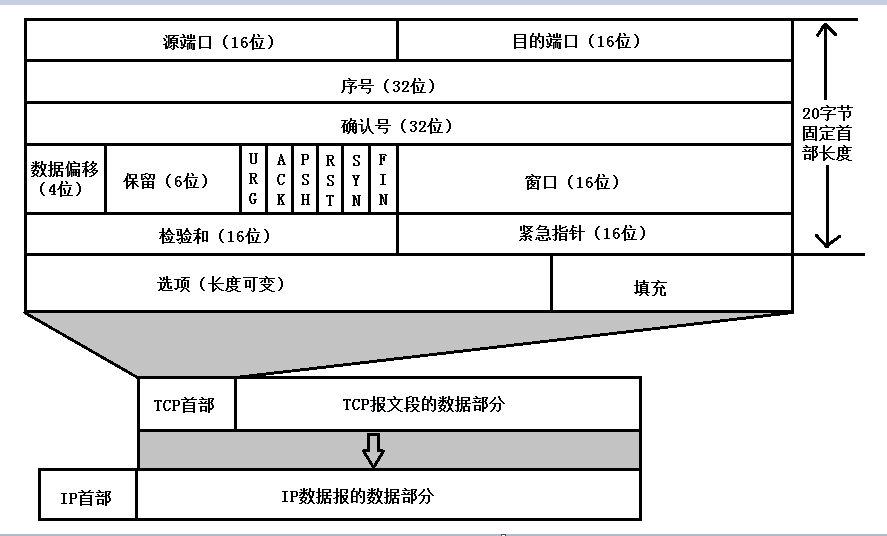

>- 源端口 source port 16bit 用来告知主机该报文段是来自哪里。进行 TCP 通讯时，客户端通常使用系统自动选择的临时端口号，而服务器则使用知名服务端口号；
>- 目的端口 destination port 16bit 用来告诉远程主机报文段交付给谁；
>- 序号 sequence number TCP 是面向字节流的，在一个 TCP 连接中传输的字节流中的每个字节都按照顺序编号，用来解决乱序问题。4 个字节可以表示的数值范围：[0, 2^32]，一共 2^32 (4294967296) 个序号。序号增加到最大值的时候，下一个序号又回到了 0。也就是说 TCP 协议可对 4GB 的数据进行编号，在一般情况下可保证当序号重复使用时，旧序号的数据早已经通过网络到达终点或者丢失。主机 A 和主机 B 进行通信，A 发送给 B 的第一个 TCP 报文段中，序号值会被初始化为某个随机的 ISN（Initial Sequence Number）。在该传输方向上后续的 TCP 报文中的序号值将被系统设置成 ISN+ 该报文段所携带的第一个字节在整个字节流中的偏移；
>- 确认号 acknowledgment number 用作对另一方发来的 TCP 报文段的响应，用来解决丢包问题。其值是收到的 TCP报文段序号值 +1；
>- 数据偏移 offset 占 4 比特，表示数据开始的地方离 TCP 段的起始处有多远。实际上就是 TCP 段首部的长度。由于首部长度不固定，因此数据偏移字段是必要的。数据偏移以 32 位为长度单位，也就是 4 个字节，因此 TCP 首部的最大长度是 60 个字节。即偏移最大为 15 个长度单位 =15x32 位 = 15x4 字节；
>- 保留 reserved；
>- 标志位 tcp flags，包括 URG（紧急指针是否有效，告诉系统此报文段中有紧急数据，应尽快传送，而不要按原来的排队顺序来传送。 URG 要与首部中的 紧急指针 字段配合使用），ACK（确认号是否有。TCP 规定，在连接建立后所有传送的报文段都必须把 ACK 设置为 1。），PSH（提示接收端应该尽快推送给接收应用程序，而不用等到整个 TCP 缓存都填满了后再交付），RST（表示对方要求重新建立连接，复位报文段），SYN（表示建立一个连接，同步报文段），FIN（表示通知对方本段要关闭连接，结束报文段）；
>- 窗口大小 window size 用于流量控制，告诉对方本段的 TCP 接收缓冲区还能容纳多少字节，让对方控制发送数据的速率；
>- 检验和 checksum，接收端对 TCP 报文执行 CRC 校验，不仅包括头部，还包括数据部分；
>- 紧急指针 urgent pointer 仅在 URG = 1 时才有意义，它指出本报文段中的紧急数据的字节数。 当 URG=1 时，发送方 TCP 就把紧急数据插入到本报文段数据的最前面，而在紧急数据后面的数据仍是普通数据。 因此，紧急指针指出了紧急数据的末尾在报文段中的位置；
>- 选项 tcp option。

### TCP 报文大小

TCP 提供的是一种面向连接的，可靠的字节流服务，TCP 提供可靠性的一种重要的方式就是 MSS。通过 MSS，应用数据被分割成 TCP 认为最适合发送的数据块，由 TCP 传递给 IP 的信息单位称为报文段或段 (segment)。代表一个 TCP socket 的结构体 struct tcp_sock 中有多个成员用于确定应用数据被分割成最大为多大的数据块较为合适 (最大报文段长度 MSS)。与最大报文段长度最为相关的一个参数是网络设备接口的 MTU，以太网的 MTU 是 1500Byte，基本 IP 首部长度为 20Byte，TCP 首部最小是 20Byte，所以 MSS 的值可达 1460Byte(MSS 不包括协议首部，只包含应用数据)。UDP 首部是 8Byte，所以 UDP 的负载最大为 1472Byte。

在建立连接的时候，通信双方会相互确认对方的最大报文段。对于一个以太网一般可以到 1460Byte，对于非本地的 IP，MSS 可能只有 536Byte。而且中间传输网络的 MSS 更小的话，这个值会更小。

### 保护消息边界和流

保护消息边界，就是指传输协议把数据当作一条独立的消息在网上传输，接收端只能接收独立的消息。也就是说存在保护消息边界，接收端一次只能接收发送端发出的一个数据包。而面向流则是指无保护消息保护边界的，如果发送端连续发送数据，接收端有可能在一次接收动作中，会接收两个或者更多的数据包。

例如连续发送三个数据包，大小分别是 2k，4k ，8k, 这三个数据包，都已经到达了接收端的网络堆栈中，如果使用 UDP 协议，不管使用多大的接收缓冲区去接收数据，必须有三次接收动作，才能够把所有的数据包接收完；而使用 TCP 协议，只要把接收的缓冲区大小设置在 14k 以上，就能够一次把所有的数据包接收下来，只需要有一次接收动作。

这就是因为 UDP 协议的保护消息边界使得每一个消息都是独立的。而流传输却把数据当作一串数据流，它不认为数据是一个一个的消息。所以有很多人在使用 tcp 协议通讯的时候，并不清楚 tcp 是基于流的传输，当连续发送数据且使用的缓冲区足够大时，有可能会一次接收到两个甚至更多的数据包，而很多人往往会忽视这一点，只解析检查了第一个数据包，而已经接收的其他数据包却被忽略了。

### TCP 与 UDP 的比较

TCP 为了保证可靠传输，尽量减少额外开销（每次发包都要验证），因此采用了流式传输，面向流的传输，相对于面向消息的传输，可以减少发送包的数量，从而减少了额外开销。但对于数据传输频繁的程序来讲，使用 TCP 可能会容易粘包。当然，对接收端的程序来讲，如果机器负荷很重，也会在接收缓冲里粘包。这样就需要接收端额外拆包，增加了工作量。因此 TCP 特别适合的是数据要求可靠传输，但是不需要太频繁传输的场合（两次操作间隔 100ms，具体是由 TCP 等待发送间隔决定的，取决于内核中的 socket 的写法）。

UDP，由于面向的是消息传输，它把所有接收到的消息都挂接到缓冲区的接受队列中，因此它对于数据的提取分离就更加方便，但它没有粘包机制。因此，当发送数据量较小的时候，就会发生数据包有效载荷较小的情况，也会增加多次发送的系统发送开销（系统调用，写硬件等）和接收开销。因此，应该最好设置一个比较合适的数据包的包长，来进行 UDP 数据的发送。（UDP 最大载荷为 1472，因此最好能每次传输接近这个数的数据量，这特别适合于视频，音频等大块数据的发送，同时通过减少握手来保证流媒体的实时性）

### 拆包与粘包问题

在 socket 网络程序中，TCP 和 UDP 分别是面向连接和非面向连接的。因此 TCP 的 socket 编程，收发两端（客户端和服务器端）都要有成对的 socket。发送端为了将多个发往接收端的包，更有效的发到对方，使用了优化方法（Nagle 算法），将多次间隔较小、数据量小的数据合并成一个大的数据块，然后进行封包。这样接收端就难以分辨出来了，必须提供科学的拆包机制。

UDP 不会出现粘包问题，因为它有消息边界。UDP 不会使用块的合并优化算法，接收端的 skbuff(套接字缓冲区）采用了链式结构来记录每一个到达的 UDP 包，在每个 UDP 包中就有了消息头（消息来源地址，端口等信息）。这样对于接收端来说就容易进行区分处理。

发生 TCP 粘包或拆包有很多原因，现列出常见的几点。

>- 要发送的数据大于 TCP 发送缓冲区剩余空间大小，将会发生拆包。
>- 待发送数据大于 MSS（最大报文长度），TCP 在传输前将进行拆包。
>- 要发送的数据小于 TCP 发送缓冲区的大小，TCP 将多次写入缓冲区的数据一次发送出去，将会发生粘包。
>- 接收数据端的应用层没有及时读取接收缓冲区中的数据，将发生粘包。

粘包情况有两种，一种是粘在一起的包都是完整的数据包，另一种情况是粘在一起的包有不完整的包。不是所有的粘包现象都需要处理，若传输的数据为不带结构的连续流数据（如文件传输），则不必把粘连的包分开（简称分包）。但在实际工程应用中，传输的数据一般为带结构的数据，这时就需要做分包处理。在处理定长结构数据的粘包问题时，分包算法比较简单；在处理不定长结构数据的粘包问题时，分包算法就比较复杂。特别是粘在一起的包有不完整的包的粘包情况，由于一包数据内容被分在了两个连续的接收包中，处理起来难度较大。实际工程应用中应尽量避免出现粘包现象。

>- 发送端给每个数据包添加包首部，首部中应该至少包含数据包的长度，接收端在接收到数据后，通过读取包首部的长度字段，便知道每一个数据包的实际长度。
>- 发送端将每个数据包封装为固定长度（不够的可以通过补 0 填充），这样接收端每次从接收缓冲区中读取固定长度的数据就自然而然的把每个数据包拆分开来。
>- 可以在数据包之间设置边界，如添加特殊符号，接收端通过这个边界就可以将不同的数据包拆分开。

### TCP 状态流转

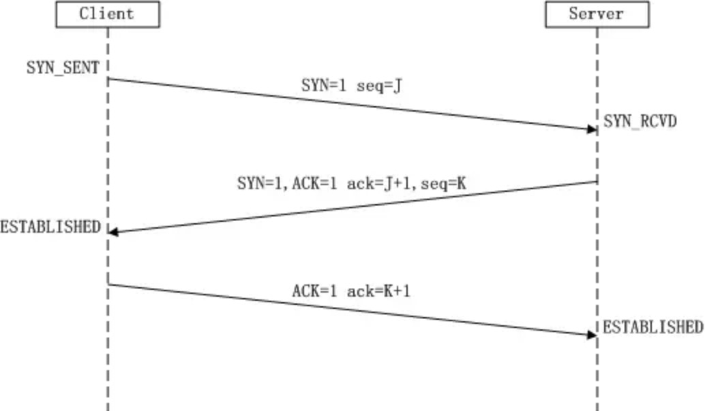

三次握手的原因：两个 SYN 报文段是必须的，通信的双方要互相确认信息，比如 MSS 的长度。最后一次 Client 发送给 Server 的确认是为了防止已失效的连接请求报文突然又传送到了 Server，而产生错误。已失效的连接请求报文段是这样产生的：Client 发送了一个请求建立连接报文段，然后 Client 不再需要建立连接。而这个失效的连接请求报文段到达 Server 后，Server 以为建立了连接而消耗了资源等待 Client 发送数据。而采用三次握手，Server 要发送SYN+ACK 的报文段，并得到 Client 的确认后才会进入连接建立的状态。在刚才的情况下，Client 不会向 Server 的确认发出确认。Server 由于收不到确认，就知道 Client 并没有要求建立连接。

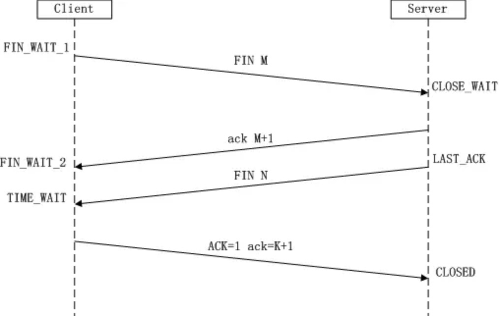

四次挥手的原因：TCP 是全双工的，所以双方都要 FIN 和 ACK。只不过一方是被动的，所以看起来称为所谓的四次挥手。如果两边同时断开连接，那就会进入到 CLOSING 状态，然后就会到达 TIME_WAIT 状态。

下面来看看这个看似有点多余的 TIME_WAIT 状态。主动方最后回应一个 ACK，主要作用是保证 TCP 协议的全双工连接能够可靠关闭和保证这次连接的重复数据段从网络中消失。

先说第一点，如果 Client 直接 CLOSED 了，那么由于 IP 协议的不可靠性或者是其它网络原因，导致 Server 没有收到 Client 最后回复的 ACK。那么 Server 就会在超时之后继续发送 FIN，此时由于 Client 已经 CLOSED 了，就找不到与重发的 FIN 对应的连接，最后 Server 就会收到 RST 而不是 ACK，Server 就会以为是连接错误把问题报告给高层。这样的情况虽然不会造成数据丢失，但是却导致 TCP 协议不符合可靠连接的要求。所以，Client 不是直接进入 CLOSED，而是要保持 TIME_WAIT，当再次收到 FIN 的时候，能够保证对方收到 ACK，最后正确的关闭连接。

再说第二点，如果 Client 直接 CLOSED，然后又再向 Server 发起一个新连接，我们不能保证这个新连接与刚关闭的连接的端口号是不同的。也就是说有可能新连接和老连接的端口号是相同的。一般来说不会发生什么问题，但是还是有特殊情况出现：假设新连接和已经关闭的老连接端口号是一样的，如果前一次连接的某些数据仍然滞留在网络中，这些延迟数据在建立新连接之后才到达 Server，由于新连接和老连接的端口号是一样的，又因为 TCP 协议判断不同连接的依据是 socket pair，于是，TCP 协议就认为那个延迟的数据是属于新连接的，这样就和真正的新连接的数据包发生混淆了。所以 TCP 连接还要在 TIME_WAIT 状态等待 2 倍 MSL，这样可以保证本次连接的所有数据都从网络中消失。

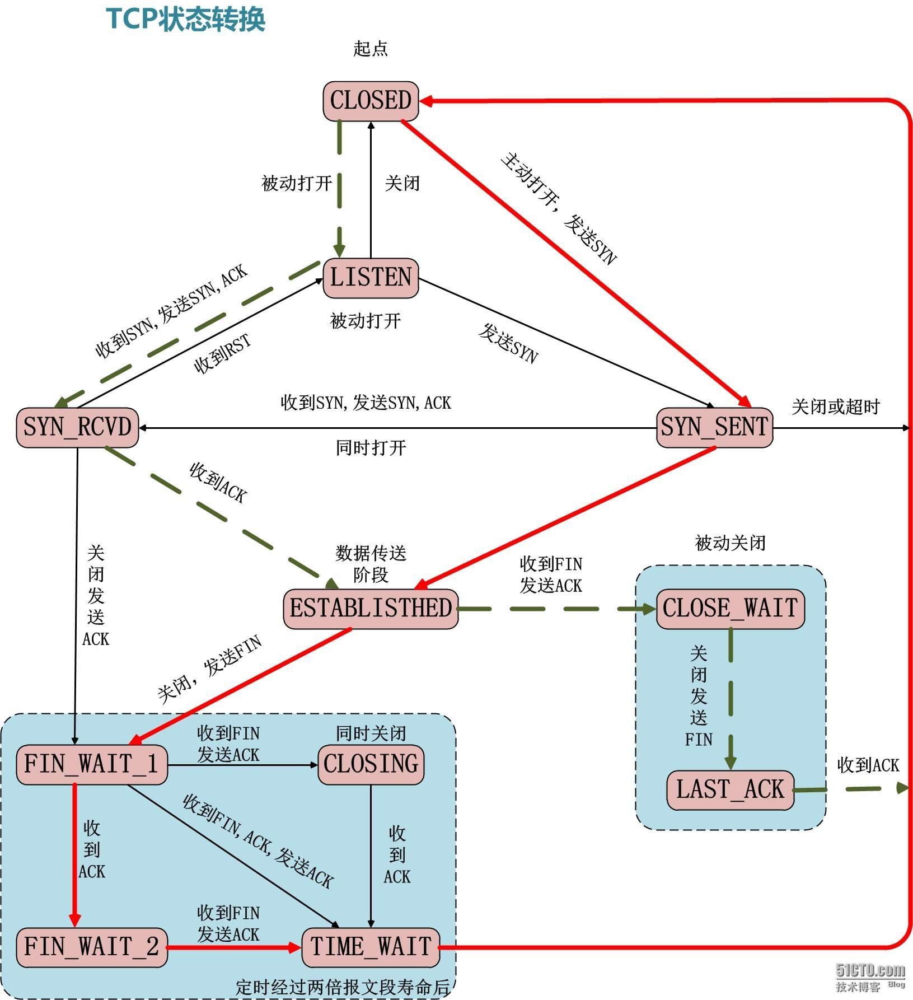

### TCP 超时重传

在发送某一个数据以后就开启一个计时器，在一定时间内如果没有得到发送的数据报的 ACK 报文，那么就重新发送数据，直到发送成功为止。影响超时重传机制协议效率的一个关键参数是重传超时时间（RTO，Retransmission TimeOut）。RTO 的值被设置过大过小都会对协议造成不利影响。RTO 设长了，重发就慢，没有效率，性能差。RTO 设短了，重发的就快，会增加网络拥塞，导致更多的超时，更多的超时导致更多的重发。RTO 的设置和 RTT 有关。连接往返时间（RTT，Round Trip Time），指发送端从发送 TCP 包开始到接收它的立即响应所消耗的时间。

### TCP 滑动窗口

滑动窗口提供 TCP 的可靠性和流控特性。

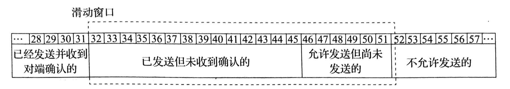

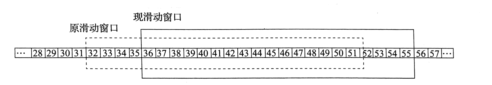

TCP 的滑动窗口的可靠性也是建立在 “确认重传” 基础上的。发送窗口只有收到对端对于本段发送窗口内字节的 ACK 确认，才会移动发送窗口的左边界。接收端可以根据自己的状况通告窗口大小，从而控制发送端的接收，进行流量控制。

发送方窗口的上限值 = Min [rwnd, cwnd]
当 rwnd < cwnd 时，是接收方的接收能力限制发送方窗口的最大值。
当 cwnd < rwnd 时，则是网络的拥塞限制发送方窗口的最大值。

### TCP 拥塞控制

拥塞控制是一个全局性的过程； 流量控制是点对点通信量的控制。TCP 拥塞控制 4 个核心算法：慢开始（slow start）、拥塞避免（Congestion Avoidance）、快速重传（fast retransmit）、快速恢复（fast recovery）。拥塞窗口（cwnd，congestion window），其大小取决于网络的拥塞程度，并且动态地在变化。

慢开始算法的思路就是，不要一开始就发送大量的数据，先探测一下网络的拥塞程度，也就是说由小到大逐渐增加拥塞窗口的大小。为了防止 cwnd 增长过大引起网络拥塞，还需设置一个慢开始门限 ssthresh 状态变量。

>- 当 cwnd < ssthresh 时，使用慢开始算法。
>- 当 cwnd > ssthresh 时，改用拥塞避免算法。
>- 当 cwnd = ssthresh 时，慢开始与拥塞避免算法任意。

拥塞避免算法让拥塞窗口缓慢增长，即每经过一个往返时间 RTT 就把发送发的拥塞窗口 cwnd 加 1，而不是加倍。无论是在慢开始阶段还是在拥塞避免阶段，只要发送方判断网络出现拥塞，就把慢开始门限设置为出现拥塞时的发送窗口大小的一半。然后把拥塞窗口设置为 1，执行慢开始算法。

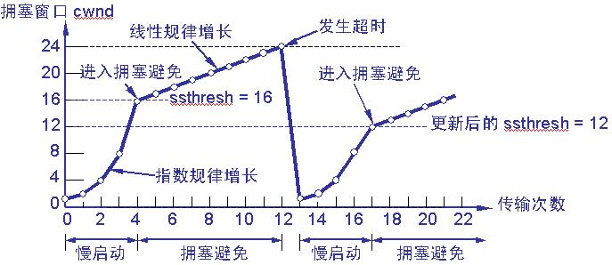

>- TCP 连接初始化，将拥塞窗口设置为 1；
>- 执行慢开始算法，cwnd 按指数规律增长，直到 cwnd=ssthresh 时，开始执行拥塞避免算法，cwnd 按线性规律增长；
>- 当网络发生拥塞，把 ssthresh 值更新为拥塞前 ssthresh 值的一半，cwnd 重新设置为 1，重新开始慢开始算法。

### 快重传和快恢复

快速重传 (Fast retransmit) 要求接收方在收到一个失序的报文段后就立即发出重复确认（为的是使发送方及早知道有报文段没有到达对方），而不要等到自己发送数据时捎带确认。快重传算法规定，发送方只要一连收到 3 个重复确认就应当立即重传对方尚未收到的报文段，而不必继续等待设置的重传计数器时间到期。

在当发送方连续收到三个重复确认，就执行 “乘法减小” 算法，把慢开始门限 ssthresh 减半。这是为了预防网络发生拥塞。快速恢复 (Fast Recovery) 则不执行慢开始算法。由于发送方现在认为网络很可能没有发生拥塞，因此与慢开始不同之处是现在不执行慢开始算法（即拥塞窗口 cwnd 现在不设置为 1），而是把 cwnd 值设置为慢开始门限 ssthresh 减半后的数值，然后开始执行拥塞避免算法（“加法增大”），使拥塞窗口缓慢地线性增大。

### TCP 网络编程 API

网络中的进程之间如何通信？首先解决的问题是如何标识一个进程。网络层的 IP 地址可以标识网络中的主机，传输层的 “协议 + 端口号” 可以唯一标识主机中的应用程序（进程）。这样利用三元组（IP 地址，协议，PORT 端口号）就可以标识网络进程。

Socket 起源于 UNIX。UNIX/Linux 基本哲学之一就是一切皆文件，都可以用 “open-write/read-close” 模式来操作。Socket 就是一种特殊的文件，一些 Socket 函数就是对其进行读写，打开，关闭的操作。

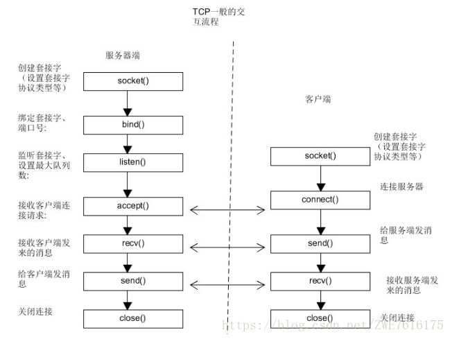

服务器 Socket 接收到客户端 Socket 请求后被动打开，开始接收客户端请求，直到客户端返回连接信息。这时候 Socket 进入阻塞状态，即 accept() 方法一直到客户端返回连接信息后才返回，开始接收下一客户端的连接请求。

#### Socket 函数

```cpp
int socket(int domain, int type, int protocal);
```

domain 指定要创建的套接字的协议簇地址类型：AF_INET（使用 ipv4 地址与端口号作为地址），AF_INET6，AF_LOCAL（又称 AF_UNIX，Unix 的 Socket，使用绝对路径作为地址），AF_ROUTE。
type 指定套接字类型：SOCK_STREAM（提供面向连接的稳定数据传输），SOCK_DGRAM（使用不连续不可靠的数据报连接），SOCK_RAW，SOCK_PACKET，SOCK_SEQPACKET。
protocol 指定协议类型：IPPROTO_TCP，IPPROTO_UDP，IPPROTO_SCTP，IPPROTO_TIPC。通常设置为 0，表示使用默认协议。

当调用 socket 创建一个 Socket 时，返回的 socket 描述符存在于协议族（address family，AF_XXX）空间中，但没有一个具体的地址。如果想要赋予一个地址必须调用 bind() 函数，否则系统在调用 connect()，listen() 会自动随机分配一个端口。

如果函数执行发生异常，将返回值为 INVALID_SOCKET（linux 下返回-1）的错误码，程序需要对这个返回值进行检查以保证程序的正常运行。返回的套接字描述符是一个整型类型的值。每个进程的进程空间里都有一个套接字描述符表，该表中存放着套接字描述符和套接字数据结构的对应关系。该表中有一个字段存放新创建的套接字的描述符，另一个字段存放套接字数据结构的地址。每个进程在自己的进程空间中都有一个套接字描述符表，但是套接字数据结构存放在操作系统的内核缓冲里。

```cpp
int bind(int sockfd, const struct sockaddr* addr, socklen_t addrlen);
```

bind() 函数把一个地址族的特定地址赋给 socket。例如对应的 AF_INET，AF_INET6 就是把一个 ipv4 或者 ipv6 地址和端口号组合赋给 socket。函数执行成功返回 0，否则返回 SOCKET_ERROR。

sockfd 为 socket 描述符，是通过 socket 函数创建来唯一标识一个 Socket 的。bind 函数给这个描述符绑定一个名字。

addr 是一个指针，指向要绑定的 sockfd 的协议地址。这个地址结构根据创建 socket 时的地址协议族的不同而不同。

```cpp
// ipv4
struct sockaddr_in {
    sa_family_t    sin_family; // address family: AF_INET
    in_port_t      sin_port;   // port in network byte order
    struct in_addr sinn_addr;  // internet address
}

struct in_addr {
    uint32_t s_addr;           // address in network byte order
}
```

addrlen 对应的是地址的长度。

服务器启动时一般会绑定一个众所周知的地址，用于提供服务，所以一般会在调用 listen 前调用 bind()；客户端则不用指定，在 connect() 时随机生成一个。

```cpp
int listen(int sockfd, int backlog);
int connect(int sockfd, const struct sockaddr* addr, socklen_t addrlen);
```

listen 函数的第一个参数即为要监听的 socket 描述符，第二个参数为相应的 socket 可以排队的最大连接个数。socket() 函数创建的 Socket 默认是一个主动类型的，listen 函数将其设置为被动类型的。

connect 函数的第一个参数为客户端的 socket 描述符，第二个参数为服务器的 socket 地址，第三个参数为 socket 地址的长度。客户端调用 connect 函数和 TCP 服务器建立连接。

```cpp
int accept(int sockfd, struct sockaddr* addr, socklen_t* addrlen);
```

TCP 服务器监听到请求后会调用 accept 函数接收请求，建立连接后就可以开始网络 I/O 操作。accept 函数的第一个参数为服务器的 socket 描述符，第二个参数是指针，用于返回客户端的协议地址，第三个参数是指针，用于返回协议地址的长度。如果 accept 成功，那么其返回值是内核自动生成的一个全新的描述符，代表于客户端的 TCP 连接。一个服务器通常只创建一个监听 socket 描述符，它在服务器的生命周期一直存在。内核为每个由服务器进程接收的客户端创建一个已连接的 socket 描述符，当服务器完成了对某个客户端的服务，相应的 socket 描述符就被关闭。

```cpp
ssize_t read(int fd, void* buf, size_t count);
```

read 函数负责从 fd 中读取内容，读取成功返回实际所读的字节数，如果返回值是 0 表示已经读到文件结束，小于 0 表示出现了错误。如果错误为 EINTR 说明是由中断引起的，如果是 ECONNREST 表示网络连接除了问题。三个参数分别是 socket 描述符，缓冲区和缓冲区长度。

```cpp
ssize_t write(int fd, const void* buf, size_t count);
```

write 函数负责向 buf 中写入内容。写入成功返回写入的字节数。失败返回-1，并设置 errno 变量。返回值大于 0 表示写了部分或者全部数据，返回值小于 0 表示出现了错误。如果错误为 EINTR 说明是由中断引起的，如果为 EPIPE 表示网络连接出现了问题（对方关闭了连接）。三个参数分别是 socket 描述符，缓冲区和缓冲区长度。

其他的网络 I/O 操作还有以下几组：recv()/send() readv()/writev() recvmsg()/sendmsg() recvfrom()/sendto()。

```cpp
int close(int fd);
```

close 一个 TCP socket 的默认行为是，会把该 socket 标记为已关闭。然后立即返回到回调进程。close 只是使相应的 socket 描述符的引用计数器-1，只有当引用计数为 0 时才会出发 TCP 客服端向服务器发送终止连接的请求。

### TCP 协议选项

TCP 头部的固定长度为 20Byte，选项部分最长为 60Byte（数据偏移 4bit，取最大 1111，偏移量的单位是 32bit，即 4Byte）。TCP 选项部分实际应用有以下几种。

>- SO_REUSEADDR 一般来说一个端口被释放后需要两分钟左右的等待（TIME_WAIT）才能再次使用，使用该选项可以是端口释放后立即被使用。server 程序应该在调用 bind() 之前设置 SO_REUSEADDR 套接字选项。
>- TCP_NODELAY/TCP_CHORK 为了解决糊涂窗口症候群（有效荷载利用率低）的问题提出了 Nagle 算法。如果发送端要多次发送包含少量字符的数据包，则发送端会先将第一个小包发出去，而将后面到达的少量字符数据都缓存起来而不立即发送，直到接收端对前一个数据包报文段的 ACK 确认位置，或者当前字符属于紧急数据，或者积攒到一定数量的数据等多种情况下才将其组成一个较大的数据包发送出去。Nagle 是默认开启的，但是并不适用于所有场景。TCP_NODELAY/TCP_CHORK 都禁用了该算法。TCP_NODELAY 不会讲小包拼接成大包发送而是直接发送小包；在传送大量数据的时候可以设置 TCP_CHORK，这样会尽量在每次发送最大的数据量。设置 TCP_CHORK 后会有 200ms 的阻塞，当阻塞时间过后数据会自动发送。
>- SO_LINGER 默认 close 立即返回，但是当发送缓冲区中还有一部分数据的时候系统会尝试将数据发送给对端。通过设置 SO_LINGER 可以改变 close 的行为，可以采用默认情形；或者 close 不被阻塞立即执行，丢弃 socket 发送缓冲区的数据并向对端发送 RST 报文来强制关闭（这种非正常的四次握手方式结束 TCP 连接，TCP 连接不会进入 TIME_WAIT 状态）；或者 close 调用阻塞进程，直到所有所有数据发送完毕或超时。
>- TCP_DEFFER_ACCEPT 当接收到第一个数据后才创建连接，对于像 HTTP 等非交互式服务器很有意义，可以防御空链接攻击。使用 TCP_DEFER_ACCEPT 可以减少用户程序 hold 的连接数，也可以减少用户调用 epoll_ctl 和 epoll_wait 的次数，从而提高了程序的性能。设置 listen 套接字的 TCP_DEFER_ACCEPT 选项后， 只当一个链接有数据时是才会从 accpet 中返回（而不是三次握手完成)。
>- SO_KEEPALIVE 用于保持连接，检测对方主机是否崩溃，避免永远阻塞于 TCP 连接的输入。
>- SO_SNDTIMEO/SO_RCVTIMEO 分别设置 socket 的发送和接收超时时间。接收超时会影响 read，readv，recv，revcfrom，recvmsg 的状态，发送超时会影响 write，writev，send，sendto，sendmsg 的状态。
>- SO_RECVBUF/SO_SNDBUF 分别设置发送和接收缓冲区的大小。TCP 对发送但未收到确认的数据保留一个副本，直到被确认为止。

### HTTP 协议

#### web 始祖 HTTP

全称：超文本传输协议 (HyperText Transfer Protocol) 伴随着计算机网络和浏览器的诞生，HTTP1.0 也随之而来，处于计算机网络中的应用层，HTTP 是建立在 TCP 协议之上，所以 HTTP 协议的瓶颈及其优化技巧都是基于 TCP 协议本身的特性，例如 tcp 建立连接的 3 次握手和断开连接的 4 次挥手以及每次建立连接带来的 RTT 延迟时间。

HTTP 的请求和回应报文都分为报文头，0 和或者多个请求头，空行和可选的消息体四个部分。HTTP 协议是基于行的协议，每一行都以\r\n 作为分隔符。HTTP/1.1 协议定义了 9 中方法（或者称动作）来表示 Request-URI 指定资源的不同操作方式：OPTIONS，HEAD，GET，POST，PUT，DELETE，TRACE，CONNECT，PATHC。

#### HTTP 的基本优化

影响一个 HTTP 网络请求的因素主要有两个：带宽和延迟。如果说还停留在拨号上网的阶段，带宽可能会成为一个比较严重影响请求的问题，但是现在网络基础建设已经使得带宽得到极大的提升，不再会担心由带宽而影响网速，那么就只剩下延迟了。

>- 浏览器阻塞（HOL blocking）：浏览器会因为一些原因阻塞请求。浏览器对于同一个域名，同时只能有 4 个连接（这个根据浏览器内核不同可能会有所差异），超过浏览器最大连接数限制，后续请求就会被阻塞。
>- DNS 查询（DNS Lookup）：浏览器需要知道目标服务器的 IP 才能建立连接。将域名解析为 IP 的这个系统就是 DNS。这个通常可以利用 DNS 缓存结果来达到减少这个时间的目的。
>- 建立连接（Initial connection）：HTTP 是基于 TCP 协议的，浏览器最快也要在第三次握手时才能捎带 HTTP 请求报文，达到真正的建立连接，但是这些连接无法复用会导致每次请求都经历三次握手和慢启动。三次握手在高延迟的场景下影响较明显，慢启动则对文件类大请求影响较大。

#### HTTP1.0 和 HTTP1.1

HTTP1.0 最早在网页中使用是在 1996 年，那个时候只是使用一些较为简单的网页上和网络请求上，而 HTTP1.1 则在 1999 年才开始广泛应用于现在的各大浏览器网络请求中，同时 HTTP1.1 也是当前使用最为广泛的 HTTP 协议。 主要区别主要体现在：

>- 缓存处理，在 HTTP1.0 中主要使用 header 里的`If-Modified-Since` `Expires`来做为缓存判断的标准，HTTP1.1 则引入了更多的缓存控制策略例如`Entity tag` `If-Unmodified-Since` `If-Match` `If-None-Match`等更多可供选择的缓存头来控制缓存策略。
>- 带宽优化及网络连接的使用，HTTP1.0 中存在一些浪费带宽的现象，例如客户端只是需要某个对象的一部分，而服务器却将整个对象送过来了，并且不支持断点续传功能，HTTP1.1 则在请求头引入了 range 头域，它允许只请求资源的某个部分，即返回码是 206（Partial Content），这样就方便了开发者自由的选择以便于充分利用带宽和连接。
>- 错误通知的管理，在 HTTP1.1 中新增了 24 个错误状态响应码，如 409（Conflict）表示请求的资源与资源的当前状态发生冲突；410（Gone）表示服务器上的某个资源被永久性的删除。
>- Host 头处理，在 HTTP1.0 中认为每台服务器都绑定一个唯一的 IP 地址，因此请求消息中的 URL 并没有传递主机名（hostname）。但随着虚拟主机技术的发展，在一台物理服务器上可以存在多个虚拟主机（Multi-homed Web Servers），并且它们共享一个 IP 地址。HTTP1.1 的请求消息和响应消息都应支持 Host 头域，且请求消息中如果没有 Host 头域会报告一个错误（400 Bad Request）。
>- 长连接，HTTP 1.1 支持长连接（PersistentConnection）和请求的流水线（Pipelining）处理，在一个 TCP 连接上可以传送多个 HTTP 请求和响应，减少了建立和关闭连接的消耗和延迟，在 HTTP1.1 中默认开启 Connection：keep-alive，一定程度上弥补了 HTTP1.0 每次请求都要创建连接的缺点。以下是常见的 HTTP1.0：

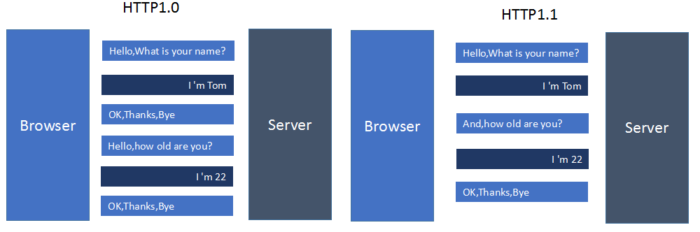

上面提到过的，HTTP1.x 在传输数据时，每次都需要重新建立连接，无疑增加了大量的延迟时间，特别是在移动端更为突出。HTTP1.x 在传输数据时，所有传输的内容都是明文，客户端和服务器端都无法验证对方的身份，这在一定程度上无法保证数据的安全性。HTTP1.x 在使用时，header 里携带的内容过大，在一定程度上增加了传输的成本，并且每次请求 header 基本不怎么变化，尤其在移动端增加用户流量。虽然 HTTP1.x 支持了 keep-alive，来弥补多次创建连接产生的延迟，但是 keep-alive 使用多了同样会给服务端带来大量的性能压力，并且对于单个文件被不断请求的服务 (例如图片存放网站)，keep-alive 可能会极大的影响性能，因为它在文件被请求之后还保持了不必要的连接很长时间。

#### HTTPS - HTTP over SSL/TLS

为了解决安全问题，网景在 1994 年创建了 HTTPS，并应用在网景导航者浏览器中。 最初，HTTPS 是与 SSL 一起使用的；在 SSL 逐渐演变到 TLS 时（其实两个是一个东西，只是名字不同而已），最新的 HTTPS 也由在 2000 年五月公布的 RFC 2818 正式确定下来。HTTPS 是安全版的 HTTP，并且由于当今时代对安全性要求更高，chrome 和 firefox 都大力支持网站使用 HTTPS，Apple 也在 ios 10 系统中强制 app 使用 HTTPS 来传输数据。  

HTTPS 协议需要到 CA 申请证书，一般免费证书很少，需要交费。HTTP 协议运行在 TCP 之上，所有传输的内容都是明文，HTTPS 运行在 SSL/TLS 之上，SSL/TLS 运行在 TCP 之上，所有传输的内容都经过加密的。HTTP 和 HTTPS 使用的是完全不同的连接方式，用的端口也不一样，前者是 80，后者是 443。HTTPS 可以有效的防止运营商劫持，解决了防劫持的一个大问题。

HTTPS 的安全性由 SSL/TLS 来保证。

按照密钥的使用方式，加密可以分为两大类：对称加密（如 AES ChaCha20）和非对称加密（如 RSA ECC）。“对称加密” 很好理解，就是指加密和解密时使用的密钥都是同一个，是 “对称” 的。只要保证了密钥的安全，那整个通信过程就可以说具有了机密性。对称加密看上去好像完美地实现了机密性，但其中有一个很大的问题：如何把密钥安全地传递给对方，术语叫 “密钥交换”。所以，就出现了非对称加密（也叫公钥加密算法）。它有两个密钥，一个叫 “公钥”（public key），一个叫 “私钥”（private key）。两个密钥是不同的，“不对称”，公钥可以公开给任何人使用，而私钥必须严格保密。公钥和私钥有个特别的 “单向” 性，虽然都可以用来加密解密，但公钥加密后只能用私钥解密，反过来，私钥加密后也只能用公钥解密。你或许会说：“把密钥再加密一下发过去就好了”，但传输 “加密密钥的密钥” 又成了新问题。这就像是 “鸡生蛋、蛋生鸡”，可以无限递归下去。只用对称加密算法，是绝对无法解决密钥交换的问题的。非对称加密可以解决 “密钥交换” 的问题。网站秘密保管私钥，在网上任意分发公钥，你想要登录网站只要用公钥加密就行了，密文只能由私钥持有者才能解密。而黑客因为没有私钥，所以就无法破解密文。

对称加密和非对称加密两者结合起来的混合加密，实现了机密性。

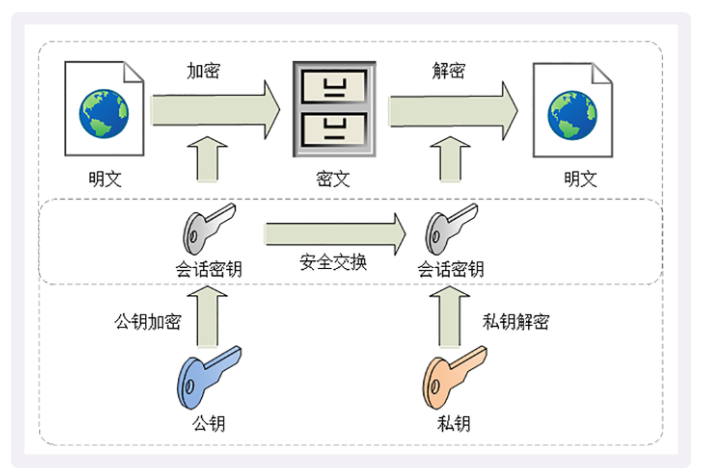

实现完整性的手段主要是摘要算法（Digest Algorithm），也就是常说的散列函数、哈希函数（Hash Function）。

数字签名则实现了身份认证和不可否认。数字签名的原理其实很简单，就是把公钥私钥的用法反过来，之前是公钥加密、私钥解密，现在是私钥加密、公钥解密。但又因为非对称加密效率太低，所以私钥只加密原文的摘要，这样运算量就小的多，而且得到的数字签名也很小，方便保管和传输。签名和公钥一样完全公开，任何人都可以获取。但这个签名只有用私钥对应的公钥才能解开，拿到摘要后，再比对原文验证完整性，就可以像签署文件一样证明消息确实是你发的。

只要你和网站互相交换公钥，就可以用 “签名” 和 “验签” 来确认消息的真实性，因为私钥保密，黑客不能伪造签名，就能够保证通信双方的身份。比如，你用自己的私钥签名一个消息 “我是小明”。网站收到后用你的公钥验签，确认身份没问题，于是也用它的私钥签名消息 “我是某宝”。你收到后再用它的公钥验一下，也没问题，这样你和网站就都知道对方不是假冒的，后面就可以用混合加密进行安全通信了。

到现在，综合使用对称加密、非对称加密和摘要算法，我们已经实现了安全的四大特性，是不是已经完美了呢？不是的，这里还有一个 “公钥的信任” 问题。解决办法：CA 的数字证书。公钥的分发需要使用数字证书，必须由 CA 的信任链来验证，否则就是不可信的。作为信任链的源头 CA 有时也会不可信，解决办法有 CRL、OCSP，还有终止信任。

总结：保密性：靠混合加密解决，非对称加密实现对称加密秘钥传递，对称加密实现内容加密。完整性：靠摘要算法解决。身份认证：靠数字证书解决，数字证书因为 CA 机构的信任变成一个完整信任链条，从而实现通过数字证书证明了对方真实身份，但注意身份真实也可能是挂羊头卖狗肉，是一个坏人，所以，有了 CRL、OCSP，还有终止信任。不可否认：靠数字签名解决，内容摘要算法得到摘要，私钥加密摘要，对方使用对应公钥解密，得到摘要，再和自己得到的服务器提供的原文摘要对比，一致说明这个内容就是原服务器提供的，由证书说明了服务器的身份。

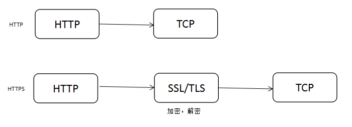

如果一个网站要全站由 HTTP 替换成 HTTPS，可能需要关注以下几点：安装 CA 证书，一般的证书都是需要收费的。在购买证书之后，在证书提供的网站上配置自己的域名，将证书下载下来之后，配置自己的 web 服务器，同时进行代码改造。HTTPS 降低用户访问速度。由于 SSL 握手，HTTPS 对速度会有一定程度的降低，但是只要经过合理优化和部署，HTTPS 对速度的影响完全可以接受。在很多场景下，HTTPS 速度完全不逊于 HTTP，如果使用 SPDY，HTTPS 的速度甚至还要比 HTTP 快。相对于 HTTPS 降低访问速度，其实更需要关心的是服务器端的 CPU 压力，HTTPS 中大量的密钥算法计算，会消耗大量的 CPU 资源，只有足够的优化，HTTPS 的机器成本才不会明显增加。

2012 年 google 提出了 SPDY 的方案，大家才开始从正面看待和解决老版本 HTTP 协议本身的问题，SPDY 可以说是综合了 HTTPS 和 HTTP 两者有点于一体的传输协议，主要解决：

>- 降低延迟，针对 HTTP 高延迟的问题，SPDY 采取了多路复用（multiplexing）。多路复用通过多个请求 stream 共享一个 tcp 连接的方式，解决了 HOL blocking 的问题，降低了延迟同时提高了带宽的利用率。
>- 请求优先级（request prioritization）。多路复用带来一个新的问题是，在连接共享的基础之上有可能会导致关键请求被阻塞。SPDY 允许给每个 request 设置优先级，这样重要的请求就会优先得到响应。比如浏览器加载首页，首页的 html 内容应该优先展示，之后才是各种静态资源文件，脚本文件等加载，这样可以保证用户能第一时间看到网页内容。
>- header 压缩。前面提到 HTTP1.x 的 header 很多时候都是重复多余的。选择合适的压缩算法可以减小包的大小和数量。
>- 基于 HTTPS 的加密协议传输，大大提高了传输数据的可靠性。
>- 服务端推送（server push），采用了 SPDY 的网页，例如网页有一个 sytle.css 的请求，在客户端收到 sytle.css 数据的同时，服务端会将 sytle.js 的文件推送给客户端，当客户端再次尝试获取 sytle.js 时就可以直接从缓存中获取到，不用再发请求了。SPDY 构成图：

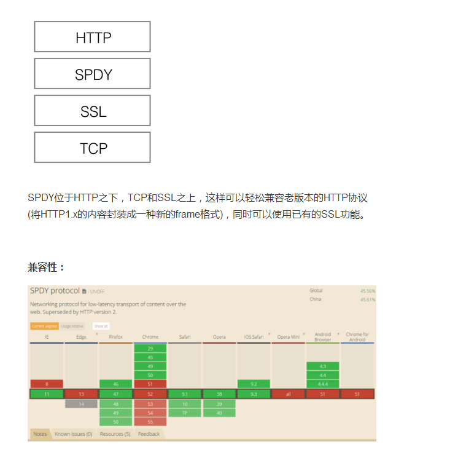

#### HTTP/2 的前世今生

HTTP/2 可以说是 SPDY 的升级版（其实原本也是基于 SPDY 设计的），但是 HTTP/2 跟 SPDY 仍有不同的地方，主要是以下两点：

>- HTTP/2 支持明文 HTTP 传输，而 SPDY 强制使用 HTTPS
>- HTTP/2 消息头的压缩算法采用 HPACK，而非 SPDY 采用的 DEFLATE

#### HTTP/2 的新特性

HTTP/2 把 HTTP 分解成了 “语义” 和 “语法” 两个部分，“语义” 层不做改动，与 HTTP/1 完全一致（即 RFC7231）。比如请求方法、URI、状态码、头字段等概念都保留不变，这样就消除了再学习的成本，基于 HTTP 的上层应用也不需要做任何修改，可以无缝转换到 HTTP/2。特别要说的是，与 HTTPS 不同，HTTP/2 没有在 URI 里引入新的协议名，仍然用 “http” 表示明文协议，用 “https” 表示加密协议。

>- 新的二进制格式（Binary Format），HTTP1.x 的解析是基于文本。基于文本协议的格式解析存在天然缺陷，文本的表现形式有多样性，要做到健壮性考虑的场景必然很多，二进制则不同，只认 0 和 1 的组合。基于这种考虑 HTTP/2 的协议解析决定采用二进制格式，实现方便且健壮。
>- 多路复用（MultiPlexing），即连接共享，即每一个 request 都是是用作连接共享机制的。一个 request 对应一个 id，这样一个连接上可以有多个 request，每个连接的 request 可以随机的混杂在一起，接收方可以根据 request 的 id 将 request 再归属到各自不同的服务端请求里面。它把 TCP 协议的部分特性挪到了应用层，把原来的 “Header+Body” 的消息 “打散” 为数个小片的二进制 “帧”（Frame），用 “HEADERS” 帧存放头数据、“DATA” 帧存放实体数据。

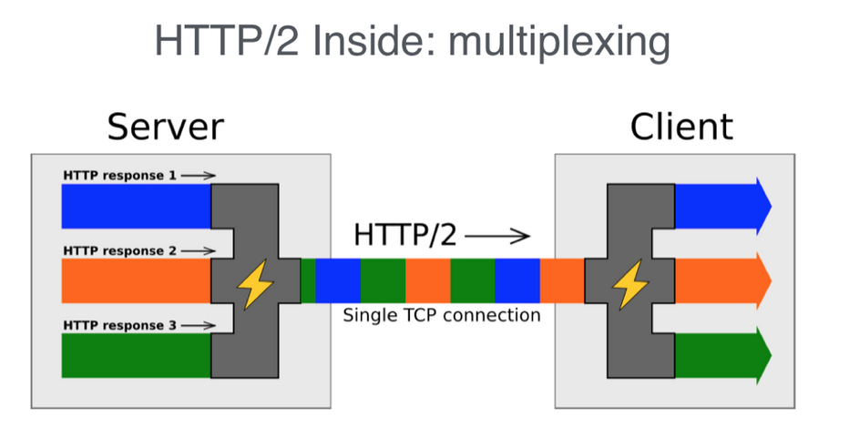

header 压缩，如上文中所言，对前面提到过 HTTP1.x 的 header 带有大量信息，而且每次都要重复发送，HTTP/2 使用 encoder 来减少需要传输的 header 大小，通讯双方各自 cache 一份 header fields 表，既避免了重复 header 的传输，又减小了需要传输的大小。服务端推送（server push），同 SPDY 一样，HTTP/2 也具有 server push 功能。

HTTP/2 定义了一个 “流”（Stream）的概念，它是二进制帧的双向传输序列，同一个消息往返的帧会分配一个唯一的流 ID。你可以想象把它成是一个虚拟的 “数据流”，在里面流动的是一串有先后顺序的数据帧，这些数据帧按照次序组装起来就是 HTTP/1 里的请求报文和响应报文。因为 “流” 是虚拟的，实际上并不存在，所以 HTTP/2 就可以在一个 TCP 连接上用 “流” 同时发送多个 “碎片化” 的消息，这就是常说的 “多路复用”（  Multiplexing）——多个往返通信都复用一个连接来处理。在 “流” 的层面上看，消息是一些有序的 “帧” 序列，而在 “连接” 的层面上看，消息却是乱序收发的 “帧”。多个请求 / 响应之间没有了顺序关系，不需要排队等待，也就不会再出现 “队头阻塞” 问题，降低了延迟，大幅度提高了连接的利用率。

关于 HTTP2 和 HTTP1.x 的区别大致可以看下图：

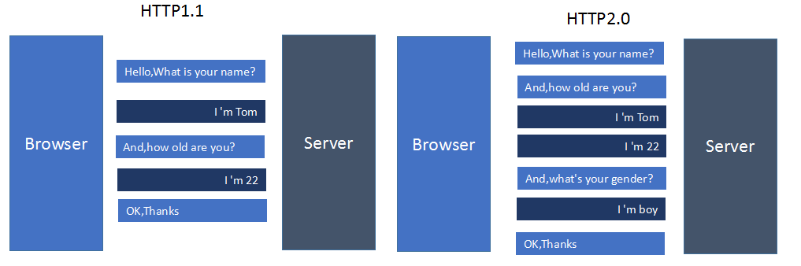


HTTP/2 虽然使用 “帧”“流”“多路复用”，没有了 “队头阻塞”，但这些手段都是在应用层里，而在下层，也就是 TCP 协议里，还是会发生 “队头阻塞”。在 HTTP/2 把多个 “请求- 响应” 分解成流，交给 TCP 后，TCP 会再拆成更小的包依次发送（其实在 TCP 里应该叫 segment，也就是 “段”）。

在网络良好的情况下，包可以很快送达目的地。但如果网络质量比较差，像手机上网的时候，就有可能会丢包。而 TCP 为了保证可靠传输，有个特别的 “丢包重传” 机制，丢失的包必须要等待重新传输确认，其他的包即使已经收到了，也只能放在缓冲区里，上层的应用拿不出来，只能 “干着急”。

Google 在推 SPDY 的时候就已经意识到了这个问题，于是就又发明了一个新的 “QUIC” 协议，让 HTTP 跑在    QUIC 上而不是 TCP 上。而这个 “HTTP over QUIC” 就是 HTTP 协议的下一个大版本，HTTP/3。它在 HTTP/2 的基础上又实现了质的⻜跃，真正 “完美” 地解决了 “队头阻塞” 问题。

 HTTP/3 有一个关键的改变，那就是它把下层的 TCP“抽掉” 了，换成了 UDP。因为 UDP 是无序的，包之间没有依赖关系，所以就从根本上解决了 “队头阻塞”。并且可以用户态定义流量控制、拥塞避免等算法，优化慢启动、弱网、重建连接等问题。

#### HTTP/2 的升级改造

HTTP/2 其实可以支持非 HTTPS 的，但是现在主流的浏览器像 chrome，firefox 表示还是只支持基于 TLS 部署的 HTTP/2 协议，所以要想升级成 HTTP/2 还是先升级 HTTPS 为好。当网站已经升级 HTTPS 之后，那么升级 HTTP/2 就简单很多，如果你使用 NGINX，只要在配置文件中启动相应的协议就可以了，可以参考 NGINX 白皮书。使用了 HTTP/2 那么，原本的 HTTP1.x 怎么办，这个问题其实不用担心，HTTP/2 完全兼容 HTTP1.x 的语义，对于不支持 HTTP/2 的浏览器，NGINX 会自动向下兼容的。

#### HTTP 状态码

>- 1XX 系列：指定客户端应相应的某些动作，代表请求已被接受，需要继续处理。
>- 2XX 系列：成功。代表请求已成功被服务器接收、理解、并接受。
>- 3XX 系列：重定向。代表需要客户端采取进一步的操作才能完成请求，这些状态码用来重定向，后续的请求地址（重定向目标）在本次响应的 Location 域中指明。
>- 4XX 系列：客户端错误。代表了客户端看起来可能发生了错误，妨碍了服务器的处理。
>- 5xx 系列：服务器端错误。服务器在处理请求的过程中有错误或者异常状态发生，也有可能是服务器意识到以当前的软硬件资源无法完成对请求的处理。

#### Websocket

Web 就是 HTTP 的意思，Socket 就是⽹络编程⾥的套接字，也就是 HTTP 协议上的⽹络套接字，可以任意双向通信。HTTP 是基于 TCP 的，通过 TCP 收发的消息⽤HTTP 的应⽤层协议解析。WebSocket 是⾸先通过 HTTP 协议把 TCP 链接建好，然后通过 Upgrade 字段进⾏协议转换，在收到服务器的 101 Switching Protocols 应答之后，后续的 TCP 消息就通过 WebSocket 协议解析。

WebSocket 和 HTTP/2 都是⽤来弥补 HTTP 协议的⼀些缺陷和不⾜，WebSocket 主要解决双向通信、全双⼯问题，HTTP/2 主要解决传输效率的问题，两者在⼆进制帧的格式上也不太⼀样，HTTP/2 有多路复⽤、优先级和流的概念。

#### HTTP 性能优化

性能优化是⼀个复杂的概念，在 HTTP⾥可以分解为服务器性能优化、客户端性能优化和传输链路优化；服务器有三个主要的性能指标：吞吐量、并发数和响应时间，此外还需要考虑资源利⽤率； 客户端的基本性能指标是延迟，影响因素有地理距离、带宽、DNS 查询、TCP 握⼿等；从服务器到客户端的传输链路可以分为三个部分，我们能够优化的是前两个部分，也就是 “第⼀公⾥” 和 “中间⼀公⾥”。

花钱购买硬件、软件或者服务可以直接提升⽹站的服务能⼒，其中最有价值的是 CDN；不花钱也可以优化 HTTP，三个关键词是 “开源”“节流” 和 “缓存”：后端应该选⽤⾼性能的 Web 服务器，开启⻓连接，提升 TCP 的传输效率，前端应该启⽤ gzip、br 压缩，减⼩⽂本、图⽚的体积，尽量少传不必要的头字段，缓存是⽆论何时都不能忘记的性能优化利器，应该总使⽤ Etag 或 Last-modified 字段标记资源；升级到 HTTP/2 能够直接获得许多⽅⾯的性能提升，但要留意⼀些 HTTP/1 的 “反模式”。

### 网络字节序与主机序

不同的 CPU 有不同的字节序类型，字节序类型是指整数在内存中保存的顺序，称为主机序。Little Endian 将低序字节存储在起始位置，Big Endian 将高序字节存储在起始位置。比如数字 0x12345678，采用 Big Endian 为 （低地址）12|34|56|78（高地址），采用 Little Endian 为（低地址）78|56|34|12（高地址）。

C/C++ 语言编写的程序里数据存储顺序是跟编译平台所在的 CPU 相关的，而 JAVA 编写的程序则唯一采用 big endian 方式来存储数据。试想，如果你用 C/C++ 语言在 x86 平台下编写的程序跟别人的 JAVA 程序互通时会产生什么结果？就拿上面的 0x12345678 来说，你的程序传递给别人的一个数据，将指向 0x12345678 的指针传给了 JAVA 程序，由于 JAVA 采取 big endian 方式存储数据，很自然的它会将你的数据翻译为 0x78563412。因此，在你的 C 程序传给 JAVA 程序之前有必要进行字节序的转换工作。

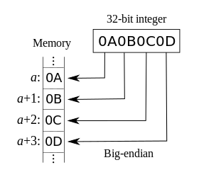


所有网络协议也都是采用 big endian 的方式来传输数据的。所以有时我们也会把 big endian 方式称之为网络字节序。当两台采用不同字节序的主机通信时，在发送数据之前都必须经过字节序的转换成为网络字节序后再进行传输。

大端小端是区别多字节数据的字节序列（uint32_t 占用了 4 个 Byte）。字符串的构成是单个字节的字符直接顺序存储就是了。假设使用的是 ASCII 字符编码，在这种前提下无需考虑字节序问题，因此 pb 序列化的字节流也不用做转序直接发就完事了。

UTF（Unicode Transformation Format），即 UNICODE 的码点（字典里的字到一个序号的映射，即码点）转换为最终的编码的格式。出于不同的目的，有多种 UTF 编码方法：UTF-8、UTF-16、UTF-32。UTF-8 不同于 UTF-16、UTF-32，UTF-8 是一种变长字节的编码方式，无需考虑字节序。UTF-16 和 UTF-32 都存在自字节序的问题。

```c
#include <stdio.h>

int main () {
    unsigned int x = 0x12345678;
    char *c = (char*)&x;
    if (*c == 0x78) {
        printf("Little endian");
    } else {
        printf("Big endian");
    }
    return 0;
}
```
