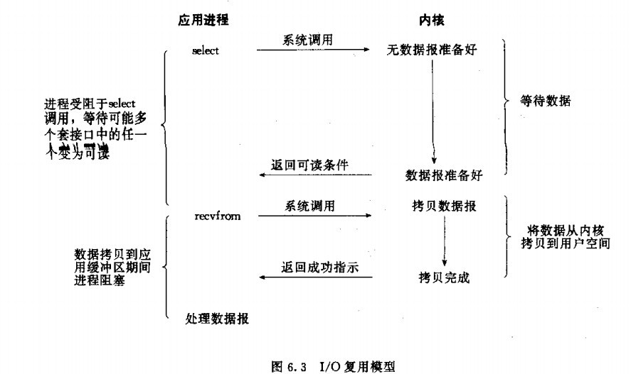
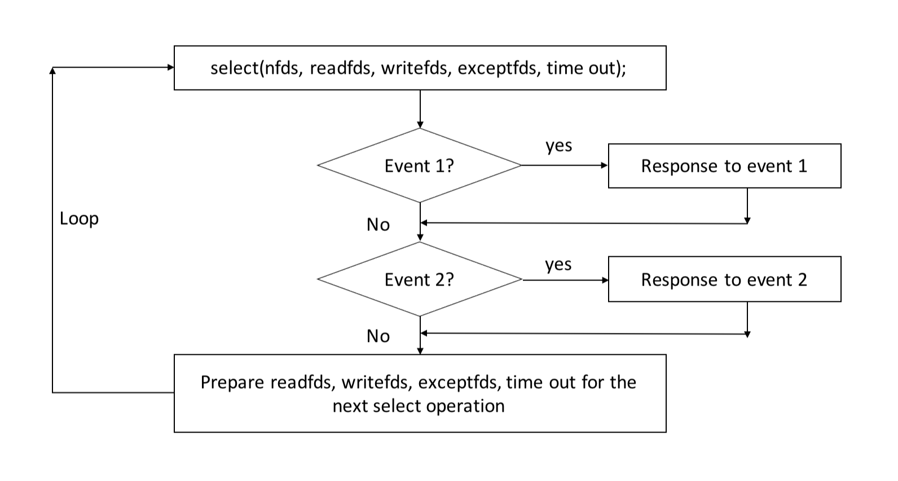

# 后台开发读书笔记

## 第七章 网络IO模型

### 四种网络IO模型

阻塞IO模型 非阻塞IO模型 多路IO复用模型 异步IO模型

一个IO操作其实分成了两个步骤：发起IO请求和实际的IO操作。
阻塞IO和非阻塞IO的区别在于第一步，发起IO请求是否会被阻塞，如果阻塞直到完成那么就是传统的阻塞IO，如果不阻塞，那么就是非阻塞IO。
同步IO和异步IO的区别就在于第二个步骤是否阻塞：如果实际的IO读写阻塞请求进程，那么就是同步IO，因此阻塞IO、非阻塞IO、IO复用、信号驱动IO都是同步IO；如果不阻塞，而是操作系统帮你做完IO操作再将结果返回给你，那么就是异步IO。

同步阻塞I/O：当进程调用某些设计I/O操作的系统调用或库函数时，比如accept()、send()、recv()等，进程便暂停下来，等待I/O操作完成后再继续运行。
同步非阻塞I/O：（轮询）不会等待数据就绪，而是结合反复轮询来尝试数据是否就绪。与同步阻塞I/O相比，同步非阻塞I/O好处是在一个进程中可以同时处理多个I/O操作，而不是阻塞在一个I/O操作上。
多路I/O就绪通知：（I/O复用）允许进程通过一种方法来同时监听所有文件描述符，并可以快速获得所有就绪的文件描述符，然后只针对这些文件描述符进行数据访问。常用的select、poll、epoll等函数使用了I/O复用模型。与同步非阻塞I/O相比，I/O复用模型可以同时等待多个（而不只是一个）套接字描述符就绪。
信号驱动式I/O：需要开启套接字的信号驱动I/O功能，并通过sigaction系统调用安装一个信号处理函数。sigaction函数立即返回，进程继续工作，即进程没有被阻塞。当数据报准备好时，内核会为该进程产生一个SIGIO信号，这样我们可以在信号处理函数中调用recvfrom读取数据报，也可以在主循环中读取数据报。无论如何处理SIGIO信号，这种模型的优势在于等待数据报到达期间不被阻塞。
异步I/O(AIO)：启动某个操作，并让内核在整个操作（包括等待数据和将数据从内核复制到用户空间）完成后通知应用进程。与信号驱动式I/O的区别在于，信号驱动式I/O在数据报准备好时就通知应用进程，应用进程还需要将数据报从内核复制到用户进程缓冲区；而异步I/O模型则是整个操作完成才通知应用进程，应用进程在整个操作期间都不会被阻塞。

#### 阻塞IO模型 进程会一直阻塞，直到数据拷贝完成


应用程序调用一个IO函数，导致应用程序阻塞，等待数据准备好。如果数据没有准备好，一直等待。数据准备好了，从内核拷贝到用户空间，IO函数返回成功指示。当调用recv()函数时，系统首先查是否有准备好的数据。如果数据没有准备好，那么系统就处于等待状态。当数据准备好后，将数据从系统缓冲区复制到用户空间，然后该函数返回。阻塞IO模型的特点就是在IO执行的两个阶段（等待数据和拷贝数据）都被阻塞了。

阻塞和非阻塞的概念描述的是用户线程调用内核IO操作的方式：阻塞是指IO操作需要彻底完成后才能返回到用户控件；非阻塞是指IO操作被调用后立即返回给用户一个状态值，不需要等待IO操作彻底完成。

Linux中默认情况下所有的socket都是阻塞的。除非特别指定，几乎所有的IO接口都是阻塞型的。这给网络编程带来一个很大的问题，如在调用send()的同时，线程处于阻塞状态，在此期间线程将无法执行任何运算或相应网络请求。

一个简单的办法是在服务端使用多线程或者多进程，让每个连接都拥有独立的线程/进程。具体使用多线程还是多进程没有特定的模式。传统意义上，进程的开销药远远大于线程，如果需要同时为较多的客户端服务不推荐多进程；如果单个服务执行体需要消耗较多的CPU资源（如长时间或大规模的数据运算或文件访问）则推荐使用较为安全和健壮的进程。

accept()能够返回一个新的socket，也就是说一个socket可以accept多次。

```cpp
int accept(int fd, struct sockaddr* addr, socklen_t *addrlen);
```

输入参数fd是从socket()，bind()和listen()中沿用下来的scoket句柄，执行完后操作系统开始监听指定端口的连接请求，如果有的话将其加入请求队列。调用accept()从socket fd的请求队列中抽取第一个链接信息创建一个和fd同类的心的socket返回句柄。这个新的句柄是后面read()和recv()的输入参数。如果请求队列为空，accept()进入阻塞状态直到有请求进入队列。

上述多线程的服务器模型能够应付为多个客户端服务的要求，但是同时相应大量的请求，无论是多线程和是多进程都会严重占据系统资源，将低系统对外界响应的效率，线程与进程本身容易进入假死状态。

如果考虑适应线程池或者连接池，或许可以稍微缓解部分压力。线程池通过维持一定数量的线程，使空闲的线程重新承担新的执行任务，避免频繁地创建和销毁线程。连接池是指维持连接的缓存池，尽量充用现有的连接，避免频繁地创建和关闭连接。

多线程模型可以方便高效地解决小规模的服务请求，但面对大规模的服务请求，可以使用非阻塞模型来解决。

#### 非阻塞IO模型 进程反复调用IO函数（多次系统调用，并马上返回），在数据拷贝的过程中，进程是阻塞的


当用户进程发起read操作时，如果内核中的数据没有准备好，那么并不会阻塞用户进程而时立即返回一个错误。用户进程需要不断地主动询问内核数据是否准备好。一旦数据准备好，并且再次收到用户进程的系统调用，那么就可以将数据复制到用户内存，然后返回正确的返回值。

服务端线程可以通过循环调用recv()接口在单线程内实现对虽有连接的数据接收工作。但是该模型绝不推荐，因为循环调用recv将大幅度提高CPU的占用率。此外这个方案中recv更多工作是检测操作是否完成，实际上可以使用更为高效的检测操作是否完成的接口，如select()多路复用模型。

#### 多路IO复用模型 对一个IO端口，两次调用，两次返回，能实现同时对多个IO端口进行监听



多路IO复用模型也被称为事件驱动IO，基本原理是通过一个函数（如select）去不断轮询所有负责的socket
，当某个socket有数据到达了就通知用户进程。

当用户进程调用了select，那么整个进程会被阻塞，内核会监听所有select负责的socket，当有任何一个sockect中的数据准备好了，select就会返回。这时用户进程调用read操作将数据从内核拷贝到用户内存。

这个模型和阻塞IO模型其实没有太大的不同，事实上还更差一些。因为需要两个系统调用（select recvfom），而阻塞IO只调用了一个。但是select可以同时处理多个连接。因此连接数不高的话，使用select/epoll的Web Server不一定比使用多线程的阻塞IO的Web Server性能更好，可能延迟还更大；select/epoll的优势在于能够处理更多的连接。

在多路复用IO模型中，每一个socket一般设置为非阻塞的，但是整个用户的进程其实是一只被阻塞的。只不过进程是被select这个函数阻塞，而不是被socket IO阻塞。因此适应select()效果与非阻塞IO类似。

```cpp
FD_ZERO(int fd, fd_set* fds);
FD_SET(int fd, fd_set* fds);
FD_ISSET(int fd, fd_set* fds);
FD_CLR(int fd, fd_set* fds);
int select(int nfds, fd_set *readfds, fd_set *writefds, fd_set *exceptfds, struct timeval* time out);
```

FD_SET类型可以简单理解为按照bit位标记句柄的队列。readfds，writefds，exceptfds同时作为输入和输出参数。如果输入的readfds标记了16号句柄，select()将检测16号句柄是否可读。在select()返回后可以检查readfds是否标记16号句柄用来拌端可读时间是否发生。writefds和exceptfds标记所有休要检测的可写事件和错误事件的句柄（使用FD_SET()标记）。客户端的一个connect()操作将在服务端激发一个可读时间，所以select()也能检测来自客户端的connect()行为。作为输入参数，readfds，writefds，exceptfds中保存了select()捕捉到的所有事件的句柄值。因此需要检查所有的标记位（使用FD_ISSET()检查），以便确定到底哪些句柄发生了事件。



这种模型特征在于每一个执行周期都会探测一次或一组时间，一个特定时间会出发特定响应，因此归类为事件驱动模型。与其他模型相比，使用select()事件驱动模型只用单线程（进程）进行，占用资源少，能够服务多个客户端。

但是select()并不是实现事件驱动的最好选择。当需要探测的句柄值较大时，该接口本身需要消耗大量时间去轮询各个句柄。很多操作系统提供了更高效的接口，如Linux的epoll，BSD的kqueue，Solaris的/dev/poll等。如果需实现更为高效的服务端程序，推荐使用类似epoll的接口，但是跨平台的话会比较困难。

此外，该模型将事件探测和事件响应夹杂在一起，如果摸个事件响应过于庞大，那么可能导致后续事件迟迟得不到执行，降低事件检测的及时性。

如果将事件响应独立出去，采用异步IO接口可以避免这个问题。

#### 信号驱动IO模型 两次调用，两次返回

允许socket进行信号驱动I/O，并安装一个信号处理函数，进程继续运行并不阻塞。当数据准备好时，进程会收到一个SIGIO信号，可以在信号处理函数中调用I/O操作函数处理数据。


#### 异步IO模型 数据拷贝的时候进程无需阻塞


当一个异步过程调用发出后，调用者不能立刻得到结果。实际处理这个调用的部件在完成后，通过状态、通知和回调来通知调用者的输入输出操作。

同步IO引起进程阻塞，直至IO操作完成。异步IO不会引起进程阻塞。IO复用是先通过select调用阻塞。因此阻塞IO，非阻塞IO，多路IO复用都属于同步IO。


### select、poll、epoll

select、poll和epoll这三组系统调用都能同时监听多个文件描述符，它们将等待由timeout参数指定的超时时间，直到一个或多个文件描述符上有事件发生时返回，返回值是就绪的文件描述符的数量。返回0表示没有事件发生。这三组函数都通过某种结构体变量来告诉内核监听哪些文件描述符上的哪些文件，并使用该结构体类型的参数来获取内核处理的结果。

#### select

select本质上是通过设置或者检查存放fd标志位的数据结构fd_set来进行下一步处理，slelect的参数类型没有将文件描述符和事件绑定，它仅仅是一个文件描述符集合，因此select需要提供三个这种类型的参数来分别传入和输出可读readset，可写writeset及异常exceptset等事件，这一方面使得select不能处理更多类型的事件，另一方面由于内核对fd_set的在线修改，应用程序下次调用select前不得不重置这三个fd_set集合。

缺点

>- 单个进程可监视的fd数量被限制，即能监听端口的大小有限。一般来说这个数目和系统内存关系很大，具体数目可以cat /proc/sys/fs/file-max察看。32位机默认是1024个。64位机默认是2048.
>- 对socket进行扫描时是线性扫描，即采用轮询的方法，效率较低。当套接字比较多的时候，每次select()都要通过遍历FD_SETSIZE个Socket来完成调度，不管哪个Socket是活跃的都遍历一遍。这会浪费很多CPU时间。如果能给套接字注册某个回调函数，当他们活跃时，自动完成相关操作，那就避免了轮询，这正是epoll与kqueue做的。
>- 需要维护一个用来存放大量fd的数据结构，这样会使得用户空间和内核空间在传递该结构时复制开销大

#### poll

poll本质上和select没有区别，它将用户传入的数组拷贝到内核空间，然后查询每个fd对应的设备状态，如果设备就绪则在设备等待队列中加入一项并继续遍历，如果遍历完所有fd后没有发现就绪设备，则挂起当前进程，直到设备就绪或者主动超时，被唤醒后它又要再次遍历fd。

但poll类型的参数pollfd要聪明一些，他把文件描述符和事件都定义其中，任何事件都被统一处理，从而使得编程接口简洁得多。并且内核每次修改的是pollfd结构体的revents参数，而events成员保持不变，因此下次调用poll时应用程序无须重置pollfd类型的事件集参数。

由于select和poll调用都返回整个用户注册的事件集合（包括就绪的和未就绪的），所以应用程序索引就绪文件描述符的时间复杂度为O(n)。它没有最大连接数的限制，原因是它是基于链表来存储的。

缺点

>- 大量的fd的数组被整体复制于用户态和内核地址空间之间，而不管这样的复制是不是有意义。
>- “水平触发”，如果报告了fd后，没有被处理，那么下次poll时会再次报告该fd。

#### epoll

epoll采用了和select及poll完全不同的方式来管理用户注册的事件，它在内核中维护一个事件表，并提供了一个独立的系统调用epoll_ctl来控制往其中添加、删除和修改时间。这样，每次epoll_wait调用都直接从该内核事件中取得用户注册的时间，而无须反复从用户空间读入这些时间，epoll_wait系统调用的events参数仅用来返回就绪的事件，使得应用程序索引就绪文件描述符的时间复杂度达到O(1).

select和poll都只能工作在相对低效的LT模式，而epoll可以工作在ET高效模式。

从实现原理上来说，select和poll都是采用的轮训的方式，即每次调用都要扫描整个注册文件描述符集合，并将其中就绪的文件描述符返回给用户程序，因此他们检测就绪事件的时间复杂度是O(n)，epoll_wait则不同，它采用回调的方式。内核检测到就绪的文件描述符时将触发回调函数，回调函数就将该文件描述符上对应的事件插入内核就绪事件列表。内核最后在适当的时间将就绪事件队列中的内容拷贝到用户空间，因此epoll_wait无需轮询整个文件描述符集合来检测哪些时间已经就绪，其算法复杂度是O(1)。

但当活动链接比较多的时候，epoll_wait的效率未必比select和poll高，因为此时回调函数被触发的过于频繁，所以epoll适用于连接数量多，但活动连接较少的情况。

优点

>- 没有最大并发连接的限制，能打开的FD的上限远大于1024（1G的内存上能监听约10万个端口）。
>- 效率提升，因为没有采用轮询方式，不会随着FD数目的增加效率下降。只有活跃可用的FD才会调用callback函数。即Epoll最大的优点就在于它只管“活跃”的连接，而跟连接总数无关，因此在实际的网络环境中，epoll的效率就会远远高于select和poll。
>- 内存拷贝，利用mmap()文件映射内存加速与内核空间的消息传递，即epoll使用mmap减少复制开销。

#### 总结

支持一个进程所能打开的最大连接数。

select单个进程所能打开的最大连接数有FD_SETSIZE宏定义，其大小是32个整数的大小（在32位的机器上，大小就是32x32，同理64位机器上FD_SETSIZE为32x64），当然我们可以对进行修改，然后重新编译内核，但是性能可能会受到影响，这需要进一步的测试。poll本质上和select没有区别，但是它没有最大连接数的限制，原因是它是基于链表来存储的。epoll虽然连接数有上限，但是很大，1G内存的机器上可以打开10万左右的连接，2G内存的机器可以打开20万左右的连接。

FD剧增后带来的IO效率问题。

select因为每次调用时都会对连接进行线性遍历，所以随着FD的增加会造成遍历速度慢的“线性下降性能问题”。poll同理。epoll内核中实现是根据每个fd上的callback函数来实现的，只有活跃的socket才会主动调用callback，所以在活跃socket较少的情况下，使用epoll没有前面两者的线性下降的性能问题，但是所有socket都很活跃的情况下，可能会有性能问题。

消息传递方式。

select用户通过三个参数readset、writeset和exceptset分别传入感兴趣的可读、可写和异常等事件，并通过对这些参数在线修改来反馈其中的就绪事件，使得用户每次调用select都要重置这3个参数；内核需要将消息传递到用户空间，都需要内核拷贝动作。poll统一处理所有事件类型，因此只需一个事件集参数，用户通过pollfd.events传入感兴趣的事件，内核通过修改pollfd.revents反馈其中就绪的事件。需要内核拷贝动作。epoll内核通过一个事件表直接管理用户感兴趣的所有事件，因此每次调用epoll_wait时无需反复传入如用户感兴趣的时间，epoll_wait系统调用的参数events仅用来反馈就绪事件。epoll通过内核和用户空间共享一块内存来实现的。

综上，在选择select，poll，epoll时要根据具体的使用场合以及这三种方式的自身特点。

>- 表面上看epoll的性能最好，但是在连接数少并且连接都十分活跃的情况下，select和poll的性能可能比epoll好，毕竟epoll的通知机制需要很多函数回调。
>- select低效是因为每次它都需要轮询。但低效也是相对的，视情况而定，也可通过良好的设计改善。

## 第八章 网络分析工具

### ping

PING (Packet Internet Groper)，因特网包探索器，用于测试网络连接量的程序。Ping发送一个ICMP(Internet Control Messages Protocol）即因特网信报控制协议；回声请求消息给目的地并报告是否收到所希望的ICMPecho（ICMP回声应答）。它是用来检查网络是否通畅或者网络连接速度的命令。作为一个生活在网络上的管理员或者黑客来说，ping命令是第一个必须掌握的DOS命令，它所利用的原理是这样的：利用网络上机器IP地址的唯一性，给目标IP地址发送一个数据包，再要求对方返回一个同样大小的数据包来确定两台网络机器是否连接相通，时延是多少。

ping指的是端对端连通，通常用来作为可用性的检查， 但是某些病毒木马会强行大量远程执行ping命令抢占你的网络资源，导致系统变慢，网速变慢。严禁ping入侵作为大多数防火墙的一个基本功能提供给用户进行选择。通常的情况下你如果不用作服务器或者进行网络测试，可以放心的选中它，保护你的电脑。

ping 127.0.0.1 用于检查本地TCP/IP协议有没有设置好。

ping 本机IP地址 用于检查本机IP设置是否有误。

ping 本网网关或者本网IP地址 用于检测硬件设备是否有问题，也可以检测本机与本地网络连接。

ping 本地DNS地址 用于检测本地DNS服务器是否正常工作。

ping 远程IP地址 用于检测本网或者本机与外部的连接是否正常。

### tcpdump

TcpDump可以将网络中传送的数据包完全截获下来提供分析。它支持针对网络层、协议、主机、网络或端口的过滤，并提供and、or、not等逻辑语句来帮助你去掉无用的信息。

tcpdump采用命令行方式，它的命令格式如下。tcp利用过滤条件筛选出符合条件的报文。

```shell
tcpdump [ -adeflnNOpqStvx ] [ -c 数量 ] [ -F 文件名 ]
        [ -i 网络接口 ] [ -r 文件名] [ -s snaplen ]
        [ -T 类型 ] [ -w 文件名 ] [表达式 ]
```

抓包选项：

-c：指定要抓取的包数量。注意，是最终要获取这么多个包。例如，指定"-c 10"将获取10个包，但可能已经处理了100个包，只不过只有10个包是满足条件的包。

-i interface：指定tcpdump需要监听的接口。若未指定该选项，将从系统接口列表中搜寻编号最小的已配置好的接口(不包括loopback接口，要抓取loopback接口使用tcpdump -i lo)，一旦找到第一个符合条件的接口，搜寻马上结束。可以使用'any'关键字表示所有网络接口。

-n：对地址以数字方式显式，否则显式为主机名，也就是说-n选项不做主机名解析。

-nn：除了-n的作用外，还把端口显示为数值，否则显示端口服务名。

-N：不打印出host的域名部分。例如tcpdump将会打印'nic'而不是'nic.ddn.mil'。

-P：指定要抓取的包是流入还是流出的包。可以给定的值为"in"、"out"和"inout"，默认为"inout"。

-s len：设置tcpdump的数据包抓取长度为len，如果不设置默认将会是65535字节。对于要抓取的数据包较大时，长度设置不够可能会产生包截断，若出现包截断，输出行中会出现"[|proto]"的标志(proto实际会显示为协议名)。但是抓取len越长，包的处理时间越长，并且会减少tcpdump可缓存的数据包的数量，从而会导致数据包的丢失，所以在能抓取我们想要的包的前提下，抓取长度越小越好。

输出选项：

-e：输出的每行中都将包括数据链路层头部信息，例如源MAC和目标MAC。

-q：快速打印输出。即打印很少的协议相关信息，从而输出行都比较简短。

-X：输出包的头部数据，会以16进制和ASCII两种方式同时输出。

-XX：输出包的头部数据，会以16进制和ASCII两种方式同时输出，更详细。

-v：当分析和打印的时候，产生详细的输出。

-vv：产生比-v更详细的输出。

-vvv：产生比-vv更详细的输出。

其他功能性选项：

-D：列出可用于抓包的接口。将会列出接口的数值编号和接口名，它们都可以用于"-i"后。

-F：从文件中读取抓包的表达式。若使用该选项，则命令行中给定的其他表达式都将失效。

-w：将抓包数据输出到文件中而不是标准输出。可以同时配合"-G time"选项使得输出文件每time秒就自动切换到另一个文件。可通过"-r"选项载入这些文件以进行分析和打印。

-r：从给定的数据包文件中读取数据。使用"-"表示从标准输入中读取。

### netstat

在Internet RFC标准中，Netstat的定义是： Netstat是在内核中访问网络连接状态及其相关信息的程序，它能提供TCP连接，TCP和UDP监听，进程内存管理的相关报告。

Netstat是控制台命令，是一个监控TCP/IP网络的非常有用的工具，它可以显示路由表、实际的网络连接以及每一个网络接口设备的状态信息。Netstat用于显示与IP、TCP、UDP和ICMP协议相关的统计数据，一般用于检验本机各端口的网络连接情况。

如果你的计算机有时候接收到的数据包导致出错数据或故障，你不必感到奇怪，TCP/IP可以容许这些类型的错误，并能够自动重发数据包。但如果累计的出错情况数目占到所接收的IP数据报相当大的百分比，或者它的数目正迅速增加，那么你就应该使用Netstat查一查为什么会出现这些情况了。

一般用netstat -an 来显示所有连接的端口并用数字表示。netstat命令的功能是显示网络连接、路由表和网络接口信息，可以让用户得知有哪些网络连接正在运作。使用时如果不带参数，netstat显示活动的 TCP 连接。

```shell
netstat [-aACeFghilMnNoprstuvVwx] [-A<网络类型>] [--ip]
```

常用的几个参数有：-a -n -p -l

-a 显示所有socket，包括正在监听的

-l 显示有在 Listen (监听) 的服务状态

-n 以网络IP地址代替名称，显示网络连接情形

-p 显示建立相关连接的程序名和PID

-t 显示TCP协议的连接情况

-u 显示UDP协议的连接情况

-s 显示每个协议的统计

-b 显示在创建每个连接或监听端口时涉及的可执行程序

-c 每个1秒就重新显示一遍，直到用户中断

```shell
# 使用实例
netstat -a      # 列出所有端口
netstat -at     # 列出所有TCP端口
netstat -au     # 列出所有UDP端口
netstat -l      # 只显示监听端口
netstat -lt     # 显示监听TCP端口
netstat -lu     # 显示监听UDP端口
netstat -lx     # 显示监听UNIX端口
netstat -s      # 显示所有端口的统计信息
netstat -st     # 显示所有TCP的统计信息
netstat -su     # 显示所有UDP的统计信息
netstat -r      # 显示核心路由信息
```

### lsof

lsof（list open files）是一个列出当前系统打开文件的工具。在linux环境下，任何事物都以文件的形式存在，通过文件不仅仅可以访问常规数据，还可以访问网络连接和硬件。lsof（list open files）是一个列出当前系统打开文件的工具。在linux环境下，任何事物都以文件的形式存在，通过文件不仅仅可以访问常规数据，还可以访问网络连接和硬件。

```shell
lsof [ options ] filename
```

lsof输出各列信息的意义如下：

COMMAND：进程的名称；PID：进程标识符；PPID：父进程标识符（需要指定-R参数）；USER：进程所有者；PGID：进程所属组；FD：文件描述符，应用程序通过文件描述符识别该文件；TYPE：文件类型，如DIR、REG等；DEVICE：指定磁盘的名称；SIZE：文件的大小；NODE：索引节点（文件在磁盘上的标识）；NAME：打开文件的确切名称。

```shell
# 使用实例
lsof -i:6666    # 查看端口6666运行情况
lsof -a - u root -d txt    # 查看所属root用户进程所打开的文件
lsof /dev/tty1    # 查看设备dev/tty1被哪些进程占用
lsof -c server    # 查看指定程序server打开的文件
lsod -u hans      # 查看指定用户hans打开的文件
```
