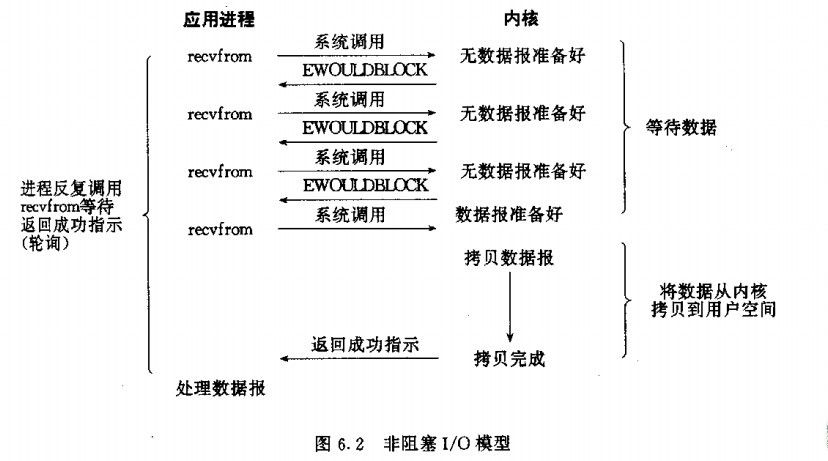
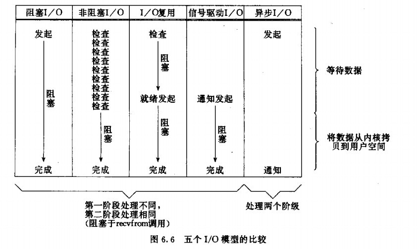

# 后台开发读书笔记

## 第七章 网络IO模型

### 四种网络IO模型

阻塞IO模型 非阻塞IO模型 多路IO复用模型 异步IO模型

一个IO操作其实分成了两个步骤：发起IO请求和实际的IO操作。
阻塞IO和非阻塞IO的区别在于第一步，发起IO请求是否会被阻塞，如果阻塞直到完成那么就是传统的阻塞IO，如果不阻塞，那么就是非阻塞IO。
同步IO和异步IO的区别就在于第二个步骤是否阻塞：如果实际的IO读写阻塞请求进程，那么就是同步IO，因此阻塞IO、非阻塞IO、IO复用、信号驱动IO都是同步IO；如果不阻塞，而是操作系统帮你做完IO操作再将结果返回给你，那么就是异步IO。

同步阻塞I/O：当进程调用某些设计I/O操作的系统调用或库函数时，比如accept()、send()、recv()等，进程便暂停下来，等待I/O操作完成后再继续运行。
同步非阻塞I/O：（轮询）不会等待数据就绪，而是结合反复轮询来尝试数据是否就绪。与同步阻塞I/O相比，同步非阻塞I/O好处是在一个进程中可以同时处理多个I/O操作，而不是阻塞在一个I/O操作上。
多路I/O就绪通知：（I/O复用）允许进程通过一种方法来同时监听所有文件描述符，并可以快速获得所有就绪的文件描述符，然后只针对这些文件描述符进行数据访问。常用的select、poll、epoll等函数使用了I/O复用模型。与同步非阻塞I/O相比，I/O复用模型可以同时等待多个（而不只是一个）套接字描述符就绪。
信号驱动式I/O：需要开启套接字的信号驱动I/O功能，并通过sigaction系统调用安装一个信号处理函数。sigaction函数立即返回，进程继续工作，即进程没有被阻塞。当数据报准备好时，内核会为该进程产生一个SIGIO信号，这样我们可以在信号处理函数中调用recvfrom读取数据报，也可以在主循环中读取数据报。无论如何处理SIGIO信号，这种模型的优势在于等待数据报到达期间不被阻塞。
异步I/O(AIO)：启动某个操作，并让内核在整个操作（包括等待数据和将数据从内核复制到用户空间）完成后通知应用进程。与信号驱动式I/O的区别在于，信号驱动式I/O在数据报准备好时就通知应用进程，应用进程还需要将数据报从内核复制到用户进程缓冲区；而异步I/O模型则是整个操作完成才通知应用进程，应用进程在整个操作期间都不会被阻塞。

#### 阻塞IO模型

进程会一直阻塞，直到数据拷贝完成。


应用程序调用一个IO函数，导致应用程序阻塞，等待数据准备好。如果数据没有准备好，一直等待。数据准备好了，从内核拷贝到用户空间，IO函数返回成功指示。当调用recv()函数时，系统首先查是否有准备好的数据。如果数据没有准备好，那么系统就处于等待状态。当数据准备好后，将数据从系统缓冲区复制到用户空间，然后该函数返回。阻塞IO模型的特点就是在IO执行的两个阶段（等待数据和拷贝数据）都被阻塞了。

阻塞和非阻塞的概念描述的是用户线程调用内核IO操作的方式：阻塞是指IO操作需要彻底完成后才能返回到用户控件；非阻塞是指IO操作被调用后立即返回给用户一个状态值，不需要等待IO操作彻底完成。

Linux中默认情况下所有的socket都是阻塞的。除非特别指定，几乎所有的IO接口都是阻塞型的。这给网络编程带来一个很大的问题，如在调用send()的同时，线程处于阻塞状态，在此期间线程将无法执行任何运算或相应网络请求。

一个简单的办法是在服务端使用多线程或者多进程，让每个连接都拥有独立的线程/进程。具体使用多线程还是多进程没有特定的模式。传统意义上，进程的开销要远远大于线程，如果需要同时为较多的客户端服务不推荐多进程；如果单个服务执行体需要消耗较多的CPU资源（如长时间或大规模的数据运算或文件访问）则推荐使用较为安全和健壮的进程。

accept()能够返回一个新的socket，也就是说一个socket可以accept多次。

```cpp
int accept(int fd, struct sockaddr* addr, socklen_t *addrlen);
```

输入参数fd是从socket()，bind()和listen()中沿用下来的scoket句柄，执行完后操作系统开始监听指定端口的连接请求，如果有的话将其加入请求队列。调用accept()从socket fd的请求队列中抽取第一个链接信息创建一个和fd同类的心的socket返回句柄。这个新的句柄是后面read()和recv()的输入参数。如果请求队列为空，accept()进入阻塞状态直到有请求进入队列。

上述多线程的服务器模型能够应付为多个客户端服务的要求，但是同时相应大量的请求，无论是多线程和是多进程都会严重占据系统资源，将低系统对外界响应的效率，线程与进程本身容易进入假死状态。

如果考虑适应线程池或者连接池，或许可以稍微缓解部分压力。线程池通过维持一定数量的线程，使空闲的线程重新承担新的执行任务，避免频繁地创建和销毁线程。连接池是指维持连接的缓存池，尽量充用现有的连接，避免频繁地创建和关闭连接。

多线程模型可以方便高效地解决小规模的服务请求，但面对大规模的服务请求，可以使用非阻塞模型来解决。

#### 非阻塞IO模型

进程反复调用IO函数（多次系统调用，并马上返回），在数据拷贝的过程中，进程是阻塞的。



当用户进程发起read操作时，如果内核中的数据没有准备好，那么并不会阻塞用户进程而时立即返回一个错误。用户进程需要不断地主动询问内核数据是否准备好。一旦数据准备好，并且再次收到用户进程的系统调用，那么就可以将数据复制到用户内存，然后返回正确的返回值。

服务端线程可以通过循环调用recv()接口在单线程内实现对虽有连接的数据接收工作。但是该模型绝不推荐，因为循环调用recv将大幅度提高CPU的占用率。此外这个方案中recv更多工作是检测操作是否完成，实际上可以使用更为高效的检测操作是否完成的接口，如select()多路复用模型。

#### 多路IO复用模型

对一个IO端口，两次调用，两次返回，能实现同时对多个IO端口进行监听。


多路IO复用模型也被称为事件驱动IO，基本原理是通过一个函数（如select）去不断轮询所有负责的socket，当某个socket有数据到达了就通知用户进程。

当用户进程调用了select，那么整个进程会被阻塞，内核会监听所有select负责的socket，当有任何一个sockect中的数据准备好了，select就会返回。这时用户进程调用read操作将数据从内核拷贝到用户内存。

这个模型和阻塞IO模型其实没有太大的不同，事实上还更差一些。因为需要两个系统调用（select recvfom），而阻塞IO只调用了一个。但是select可以同时处理多个连接。因此连接数不高的话，使用select/epoll的Web Server不一定比使用多线程的阻塞IO的Web Server性能更好，可能延迟还更大；select/epoll的优势在于能够处理更多的连接。

在多路复用IO模型中，每一个socket一般设置为非阻塞的，但是整个用户的进程其实是一直被阻塞的。只不过进程是被select这个函数阻塞，而不是被socket IO阻塞。因此使用select()效果与非阻塞IO类似。

```cpp
FD_ZERO(int fd, fd_set* fds);
FD_SET(int fd, fd_set* fds);
FD_ISSET(int fd, fd_set* fds);
FD_CLR(int fd, fd_set* fds);
int select(int nfds, fd_set *readfds, fd_set *writefds, fd_set *exceptfds, struct timeval* time out);
```

FD_SET类型可以简单理解为按照bit位标记句柄的队列。readfds，writefds，exceptfds同时作为输入和输出参数。如果输入的readfds标记了16号句柄，select()将检测16号句柄是否可读。在select()返回后可以检查readfds是否标记16号句柄用来拌端可读时间是否发生。writefds和exceptfds标记所有休要检测的可写事件和错误事件的句柄（使用FD_SET()标记）。客户端的一个connect()操作将在服务端激发一个可读时间，所以select()也能检测来自客户端的connect()行为。作为输入参数，readfds，writefds，exceptfds中保存了select()捕捉到的所有事件的句柄值。因此需要检查所有的标记位（使用FD_ISSET()检查），以便确定到底哪些句柄发生了事件。


这种模型特征在于每一个执行周期都会探测一次或一组时间，一个特定时间会出发特定响应，因此归类为事件驱动模型。与其他模型相比，使用select()事件驱动模型只用单线程（进程）进行，占用资源少，能够服务多个客户端。

但是select()并不是实现事件驱动的最好选择。当需要探测的句柄值较大时，该接口本身需要消耗大量时间去轮询各个句柄。很多操作系统提供了更高效的接口，如Linux的epoll，BSD的kqueue，Solaris的/dev/poll等。如果需实现更为高效的服务端程序，推荐使用类似epoll的接口，但是跨平台的话会比较困难。

此外，该模型将事件探测和事件响应夹杂在一起，如果摸个事件响应过于庞大，那么可能导致后续事件迟迟得不到执行，降低事件检测的及时性。如果将事件响应独立出去，采用异步IO接口可以避免这个问题。

#### 信号驱动IO模型

两次调用，两次返回。

允许socket进行信号驱动I/O，并安装一个信号处理函数，进程继续运行并不阻塞。当数据准备好时，进程会收到一个SIGIO信号，可以在信号处理函数中调用I/O操作函数处理数据。


#### 异步IO模型

数据拷贝的时候进程无需阻塞。


当一个异步过程调用发出后，调用者不能立刻得到结果。实际处理这个调用的部件在完成后，通过状态、通知和回调来通知调用者的输入输出操作。

同步IO引起进程阻塞，直至IO操作完成。异步IO不会引起进程阻塞。IO复用是先通过select调用阻塞。因此阻塞IO，非阻塞IO，多路IO复用都属于同步IO。



### select、poll和epoll

select、poll和epoll这三组系统调用都能同时监听多个文件描述符，它们将等待由timeout参数指定的超时时间，直到一个或多个文件描述符上有事件发生时返回，返回值是就绪的文件描述符的数量。返回0表示没有事件发生。这三组函数都通过某种结构体变量来告诉内核监听哪些文件描述符上的哪些文件，并使用该结构体类型的参数来获取内核处理的结果。

#### select

select本质上是通过设置或者检查存放fd标志位的数据结构fd_set来进行下一步处理，slelect的参数类型没有将文件描述符和事件绑定，它仅仅是一个文件描述符集合，因此select需要提供三个这种类型的参数来分别传入和输出可读readset，可写writeset及异常exceptset等事件，这一方面使得select不能处理更多类型的事件，另一方面由于内核对fd_set的在线修改，应用程序下次调用select前不得不重置这三个fd_set集合。

缺点

>- 单个进程可监视的fd数量被限制，即能监听端口的大小有限。一般来说这个数目和系统内存关系很大，具体数目可以cat /proc/sys/fs/file-max察看。32位机默认是1024个。64位机默认是2048.
>- 对socket进行扫描时是线性扫描，即采用轮询的方法，效率较低。当套接字比较多的时候，每次select()都要通过遍历FD_SETSIZE个Socket来完成调度，不管哪个Socket是活跃的都遍历一遍。这会浪费很多CPU时间。如果能给套接字注册某个回调函数，当他们活跃时，自动完成相关操作，那就避免了轮询，这正是epoll与kqueue做的。
>- 需要维护一个用来存放大量fd的数据结构，这样会使得用户空间和内核空间在传递该结构时复制开销大。

#### poll

poll本质上和select没有区别，它将用户传入的数组拷贝到内核空间，然后查询每个fd对应的设备状态，如果设备就绪则在设备等待队列中加入一项并继续遍历，如果遍历完所有fd后没有发现就绪设备，则挂起当前进程，直到设备就绪或者主动超时，被唤醒后它又要再次遍历fd。

但poll类型的参数pollfd要聪明一些，他把文件描述符和事件都定义其中，任何事件都被统一处理，从而使得编程接口简洁得多。并且内核每次修改的是pollfd结构体的revents参数，而events成员保持不变，因此下次调用poll时应用程序无须重置pollfd类型的事件集参数。

由于select和poll调用都返回整个用户注册的事件集合（包括就绪的和未就绪的），所以应用程序索引就绪文件描述符的时间复杂度为O(n)。它没有最大连接数的限制，原因是它是基于链表来存储的。

缺点：

>- 大量的fd的数组被整体复制于用户态和内核地址空间之间，而不管这样的复制是不是有意义。
>- “水平触发”，如果报告了fd后，没有被处理，那么下次poll时会再次报告该fd。

#### epoll

epoll采用了和select及poll完全不同的方式来管理用户注册的事件，它在内核中维护一个事件表，并提供了一个独立的系统调用epoll_ctl来控制往其中添加、删除和修改时间。这样，每次epoll_wait调用都直接从该内核事件中取得用户注册的时间，而无须反复从用户空间读入这些时间，epoll_wait系统调用的events参数仅用来返回就绪的事件，使得应用程序索引就绪文件描述符的时间复杂度达到O(1)。

select和poll都只能工作在相对低效的LT模式，而epoll可以工作在ET高效模式。

从实现原理上来说，select和poll都是采用的轮询的方式，即每次调用都要扫描整个注册文件描述符集合，并将其中就绪的文件描述符返回给用户程序，因此它们检测就绪事件的时间复杂度是O(n)，epoll_wait则不同，它采用回调的方式。内核检测到就绪的文件描述符时将触发回调函数，回调函数就将该文件描述符上对应的事件插入内核就绪事件列表。内核最后在适当的时间将就绪事件队列中的内容拷贝到用户空间，因此epoll_wait无需轮询整个文件描述符集合来检测哪些时间已经就绪，其算法复杂度是O(1)。

但当活动链接比较多的时候，epoll_wait的效率未必比select和poll高，因为此时回调函数被触发的过于频繁，所以epoll适用于连接数量多，但活动连接较少的情况。

优点：

>- 没有最大并发连接的限制，能打开的FD的上限远大于1024（1G的内存上能监听约10万个端口）。
>- 效率提升，因为没有采用轮询方式，不会随着FD数目的增加效率下降。只有活跃可用的FD才会调用callback函数。即Epoll最大的优点就在于它只管“活跃”的连接，而跟连接总数无关，因此在实际的网络环境中，epoll的效率就会远远高于select和poll。
>- 内存拷贝，利用mmap()文件映射内存加速与内核空间的消息传递，即epoll使用mmap减少复制开销。

##### epoll接口函数

```c
//  创建epoll句柄
int epfd = epoll_create(int size);
```

创建一个epoll的句柄，size用来告诉内核这个监听的数目一共有多大。这个参数不同于select()中的第一个参数，给出最大监听的fd+1的值。需要注意的是，当创建好epoll句柄后，它就是会占用一个fd值，在linux下如果查看/proc/进程id/fd/，是能够看到这个fd的，所以在使用完epoll后，必须调用close()关闭，否则可能导致fd被耗尽。该函数生成一个epoll专用的文件描述符。它其实是在内核申请一空间，用来存放想关注的socketfd上是否发生以及发生了什么事件。size就是在这个epollfd上能关注的最大socketfd数。

```c
// 将被监听的描述符添加到epoll句柄或从epool句柄中删除或者对监听事件进行修改
int epoll_ctl(int epfd, int op, int fd, struct epoll_event *event)
```

该函数用于控制某个epoll文件描述符上的事件，可以注册事件，修改事件，删除事件。

>- epfd：由epoll_create生成的epoll专用的文件描述符，是epoll_create()的返回值；
>- op：要进行的操作例如注册事件，可能的取值EPOLL_CTL_ADD注册、EPOLL_CTL_MOD修改、EPOLL_CTL_DEL删除
>- fd：关联的文件描述符；
>- event：指向epoll_event的指针，告诉内核需要监听什么事件；

如果调用成功返回0,不成功返回-1。

```c
typedef union epoll_data {
void       *ptr;
int        fd;
__uint32_t u32;
__uint64_t u64;
} epoll_data_t;

struct epoll_event {
__uint32_t   events; /* Epoll events *
epoll_data_t data;   /* User data variable */
};
```

events可以是以下几个宏的集合：

>- EPOLLIN：触发该事件，表示对应的文件描述符上有可读数据。(包括对端SOCKET正常关闭)；
>- EPOLLOUT：触发该事件，表示对应的文件描述符上可以写数据；
>- EPOLLPRI：表示对应的文件描述符有紧急的数据可读（这里应该表示有带外数据到来）；
>- EPOLLERR：表示对应的文件描述符发生错误；
>- EPOLLHUP：表示对应的文件描述符被挂断；
>- EPOLLET：将EPOLL设为边缘触发(Edge Triggered)模式，这是相对于水平触发(Level Triggered)来说的。
>- EPOLLONESHOT：只监听一次事件，当监听完这次事件之后，如果还需要继续监听这个socket的话，需要再次把这个socket加入到EPOLL队列里。

```c
// 举个例子
struct epoll_event ev;
// 设置与要处理的事件相关的文件描述符
ev.data.fd = listenfd;
// 设置要处理的事件类型
ev.events = EPOLLIN|EPOLLET;
// 注册epoll事件
epoll_ctl(epfd, EPOLL_CTL_ADD, listenfd, &ev);
```

```c
// 等待事件触发，当超过timeout还没有事件触发时超时
int epoll_wait(int epfd, struct epoll_event *events, int maxevents, int timeout);
```

等待事件的产生，类似于select()调用。参数events(数组名)用来从内核得到事件的集合，maxevents告之内核这个events有多大(数组成员的个数)，这个maxevents的值不能大于创建epoll_create()时的size，但必须大于0，参数timeout是超时时间，单位毫秒，0会立即返回（即使没有时间发生），-1则表示阻塞模式。该函数返回需要处理的事件数目，如返回0表示已超时。返回的事件集合在events数组中，数组中实际存放的成员个数是函数的返回值。返回0表示已经超时。如果epoll_wait阻塞时，其他线程注册了一个文件描述符并且该文件描述符有关注的事件发生，将会解除epoll_wait的阻塞；如果其他线程删除了所有文件描述符导致epfd关注的列表为空，epoll_wait将会阻塞直到新加入了文件描述符并且就绪。如果有超过maxevents的文件描述符就绪，下次调用epoll_wait将会优先收集上次的未处理的就绪事件避免饥饿问题。

##### epoll为什么高效

仅从调用方式就可以看出epoll比select/poll的一个优势：select/poll每次调用都要传递所要监控的所有fd给select/poll系统调用（这意味着每次调用都要将fd列表从用户态拷贝到内核态，当fd数目很多时，这会造成低效）。而每次调用epoll_wait时（作用相当于调用select/poll），不需要再传递fd列表给内核，因为已经在epoll_ctl中将需要监控的fd告诉了内核（epoll_ctl不需要每次都拷贝所有的fd，只需要进行增量式操作）。所以，在调用epoll_create之后，内核已经在内核态开始准备数据结构存放要监控的fd了。每次epoll_ctl只是对这个数据结构进行简单的维护。

此外，内核使用了slab机制，为epoll提供了快速的数据结构。在内核里，一切皆文件。所以，epoll向内核注册了一个文件系统，用于存储上述的被监控的fd。当调用epoll_create时，就会在这个虚拟的epoll文件系统里创建一个file结点。当然这个file不是普通文件，它只服务于epoll。epoll在被内核初始化时（操作系统启动），同时会开辟出epoll自己的内核高速cache区，用于安置每一个想监控的fd，这些fd会以红黑树的形式保存在内核cache里，以支持快速的查找、插入、删除。这个内核高速cache区，就是建立连续的物理内存页，然后在之上建立slab层，简单的说，就是物理上分配好想要的size的内存对象，每次使用时都是使用空闲的已分配好的对象。

epoll的第三个优势在于：当调用epoll_ctl往里塞入百万个fd时，epoll_wait仍然可以飞快的返回，并有效的将发生事件的fd给我们用户。这是由于在调用epoll_create时，内核除了在epoll文件系统里建了个file结点，在内核cache里建了个红黑树用于存储以后epoll_ctl传来的fd外，还会再建立一个list链表，用于存储准备就绪的事件，当epoll_wait调用时，仅仅观察这个list链表里有没有数据即可。有数据就返回，没有数据就sleep，等到timeout时间到后即使链表没数据也返回。所以，epoll_wait非常高效。而且，通常情况下即使监控百万计的fd，大多一次也只返回很少量的准备就绪fd而已，所以，epoll_wait仅需要从内核态copy少量的fd到用户态而已。那么，这个准备就绪list链表是怎么维护的呢？当执行epoll_ctl时，除了把fd放到epoll文件系统里file对象对应的红黑树上之外，还会给内核中断处理程序注册一个回调函数，告诉内核，如果这个fd的中断到了，就把它放到准备就绪list链表里。所以，当一个fd（例如socket）上有数据到了，内核在把设备（例如网卡）上的数据copy到内核中后就来把fd（socket）插入到准备就绪list链表里了。

如此，一颗红黑树，一张准备就绪fd链表，少量的内核cache，就解决了大并发下的fd（socket）处理问题。

课代表总结：执行epoll_create时，创建了红黑树和就绪list链表。执行epoll_ctl时，如果增加fd（socket），则检查在红黑树中是否存在，存在立即返回，不存在则添加到红黑树上，然后向内核注册回调函数，用于当中断事件来临时向准备就绪list链表中插入数据。执行epoll_wait时立刻返回准备就绪链表里的数据即可。

### 水平触发和边缘触发

EPOLL事件有两种模型

>- Level Triggered(LT) // 缺省工作方式，即默认的工作方式,支持blocksocket和no_blocksocket，错误率比较小。没有对就绪的fd进行IO操作，内核会不断的通知。LT(leveltriggered)是缺省的工作方式，并且同时支持block和no-blocksocket。在这种做法中，内核告诉你一个文件描述符是否就绪了，然后你可以对这个就绪的fd进行IO操作。如果你不作任何操作，内核还是会继续通知你的，所以，这种模式编程出错误可能性要小一点。传统的select/poll都是这种模型的代表。
>- Edge  Triggered(ET) // 高速工作方式，错误率比较大，只支持no_block socket (非阻塞socket)。没有对就绪的fd进行IO操作，内核不会再进行通知。ET(edge-triggered)是高速工作方式，只支持no-blocksocket。在这种模式下，当描述符从未就绪变为就绪时，内核通过epoll告诉你。然后它会假设你知道文件描述符已经就绪，并且不会再为那个文件描述符发送更多的就绪通知，直到你做了某些操作导致那个文件描述符不再为就绪状态了(比如，你在发送，接收或者接收请求，或者发送接收的数据少于一定量时导致了一个EWOULDBLOCK错误）。但是请注意，如果一直不对这个fd作IO操作(从而导致它再次变成未就绪)，内核不会发送更多的通知(only once)。

在epoll的ET模式下, 正确的读写方式为:读: 只要可读, 就一直读, 直到返回0, 或者 errno = EAGAIN；写: 只要可写, 就一直写, 直到数据发送完, 或者 errno = EAGAIN。ET模式只支持非阻塞读写。因为数据就绪只通知一次，必须在通知后一次处理完。也就是说如果使用ET模式，当数据就绪的时候就要一直读，直到数据读完为止。但是如果当前的fd是阻塞的，而读是循环的；那么在读完缓存区的时候，如果对端每一次有数据在写进来，那么该read()函数就会一直阻塞，这不符合逻辑，不能这么使用 。那么就需要将fd设置成非阻塞，当没有数据的时候，read()虽然读取不到任何的数据，但是肯定不会被阻塞住，那么此时说明缓冲区内数据已经读完，read()返回继续后序的逻辑。

在epoll的ET模式下，收到多个chunk的数据的时候仍然会产生多个事件。调用者可以设定EPOLLONESHOT标志，在epoll_wait()收到事件后epoll会与事件关联的文件句柄从epoll描述符中禁止掉，避免多线程模式下，多个线程对同一个socket到达的不同chunk分别操作。因此当EPOLLONESHOT设定后，使用带有EPOLL_CTL_MOD标志的epoll_ctl()处理文件句柄就成为调用者必须作的事情。

```cpp
n = 0;
// 一直读到 (返回 < 0)
// 返回 -1 + !EAGAIN -> error
while ((nread = read(fd, buf + n, BUFSIZ-1)) > 0) {
    n += nread;
}
if (nread == -1 && errno != EAGAIN) {
    perror("read error");
}
```

```cpp
int nwrite, data_size = strlen(buf);  
n = data_size;  
// 一直写到写完，必须循环到写完为止
// 中途 返回 -1 + !EAGAIN -> error
while (n > 0) {  
    nwrite = write(fd, buf + data_size - n, n);  
    if (nwrite < n) {  
        if (nwrite == -1 && errno != EAGAIN) {  
            perror("write error");  
        }
        break;
    }  
    n -= nwrite;  
    // n < 0就写完了
}
```

LT模式下或ET模式下，阻塞的监听socket， accept存在的问题。accept每次都是从已经完成三次握手的tcp队列中取出一个连接，考虑这种情况： TCP 连接被客户端夭折，即在服务器调用accept之前，客户端主动发送RST终止连接，导致刚刚建立的连接从就绪队列中移出，如果套接口被设置成阻塞模式，服务器就会一直阻塞在accept调用上，直到其他某个客户建立一个新的连接为止。但是在此期间，服务器单纯地阻塞在accept调用上，就绪队列中的其他描述符都得不到处理。

解决办法是：把监听套接口设置为非阻塞，当客户在服务器调用accept之前中止某个连接时，accept调用可以立即返回-1， 源自Berkeley的实现会在内核中处理该事件，并不会将该事件通知给epool，而其他实现把errno设置为ECONNABORTED或者EPROTO错误，我们应该忽略这两个错误。

ET模式下accept存在的问题。考虑这种情况：多个连接同时到达，服务器的TCP就绪队列瞬间积累多个就绪连接，由于是边缘触发模式，epoll只会通知一次，accept只处理一个连接，导致TCP就绪队列中剩下的连接都得不到处理。

解决办法是：将监听套接字设置为非阻塞模式，用while循环内调用accept，处理完TCP就绪队列中的所有连接后再退出循环。如何知道是否处理完就绪队列中的所有连接呢？accept返回-1并且errno设置为EAGAIN就表示所有连接都处理完。

使用Linux epoll模型，水平触发模式；当socket可写时，会不停的触发socket可写的事件，如何处理？

最普遍的方式：需要向socket写数据的时候才把socket加入epoll ，等待可写事件。接受到可写事件后，调用write或者send发送数据。当所有数据都写完后，把socket移出epoll。种方式的缺点是，即使发送很少的数据，也要把socket加入epoll，写完后在移出epoll，有一定操作代价。

一种改进的方式：开始不把socket加入epoll，需要向socket写数据的时候，直接调用write或者send发送数据。如果返回EAGAIN，把socket加入epoll，在epoll的驱动下写数据，全部数据发送完毕后，再移出epoll。

```cpp
while ((conn_sock = accept(listenfd,(struct sockaddr *) &remote, (size_t *)&addrlen)) > 0) {
    handle_client(conn_sock);
}
if (conn_sock == -1) {
    if (errno != EAGAIN && errno != ECONNABORTED && errno != EPROTO && errno != EINTR)
        perror("accept");
    // 否则表示正确处理了就绪列表中的所有socket
}
```

select单个进程所能打开的最大连接数有FD_SETSIZE宏定义，其大小是32个整数的大小（在32位的机器上，大小就是32x32，同理64位机器上FD_SETSIZE为32x64），当然我们可以对进行修改，然后重新编译内核，但是性能可能会受到影响，这需要进一步的测试。poll本质上和select没有区别，但是它没有最大连接数的限制，原因是它是基于链表来存储的。epoll虽然连接数有上限，但是很大，1G内存的机器上可以打开10万左右的连接，2G内存的机器可以打开20万左右的连接。

select因为每次调用时都会对连接进行线性遍历，所以随着FD的增加会造成遍历速度慢的“线性下降性能问题”。poll同理。epoll内核中实现是根据每个fd上的callback函数来实现的，只有活跃的socket才会主动调用callback，所以在活跃socket较少的情况下，使用epoll没有前面两者的线性下降的性能问题，但是所有socket都很活跃的情况下，可能会有性能问题。

select用户通过三个参数readset、writeset和exceptset分别传入感兴趣的可读、可写和异常等事件，并通过对这些参数在线修改来反馈其中的就绪事件，使得用户每次调用select都要重置这3个参数；内核需要将消息传递到用户空间，都需要内核拷贝动作。poll统一处理所有事件类型，因此只需一个事件集参数，用户通过pollfd.events传入感兴趣的事件，内核通过修改pollfd.revents反馈其中就绪的事件。需要内核拷贝动作。epoll内核通过一个事件表直接管理用户感兴趣的所有事件，因此每次调用epoll_wait时无需反复传入如用户感兴趣的时间，epoll_wait系统调用的参数events仅用来反馈就绪事件。epoll通过内核和用户空间共享一块内存来实现的。

综上，在选择select，poll，epoll时要根据具体的使用场合以及这三种方式的自身特点。表面上看epoll的性能最好，但是在连接数少并且连接都十分活跃的情况下，select和poll的性能可能比epoll好，毕竟epoll的通知机制需要很多函数回调。select低效是因为每次它都需要轮询。但低效也是相对的，视情况而定，也可通过良好的设计改善。

## 第八章 网络分析工具

### ping

PING (Packet Internet Groper)，因特网包探索器，用于测试网络连接量的程序。Ping发送一个ICMP(Internet Control Messages Protocol）即因特网信报控制协议；回声请求消息给目的地并报告是否收到所希望的ICMPecho（ICMP回声应答）。它是用来检查网络是否通畅或者网络连接速度的命令。作为一个生活在网络上的管理员或者黑客来说，ping命令是第一个必须掌握的DOS命令，它所利用的原理是这样的：利用网络上机器IP地址的唯一性，给目标IP地址发送一个数据包，再要求对方返回一个同样大小的数据包来确定两台网络机器是否连接相通，时延是多少。

ping指的是端对端连通，通常用来作为可用性的检查， 但是某些病毒木马会强行大量远程执行ping命令抢占你的网络资源，导致系统变慢，网速变慢。严禁ping入侵作为大多数防火墙的一个基本功能提供给用户进行选择。通常的情况下你如果不用作服务器或者进行网络测试，可以放心的选中它，保护你的电脑。

ping 127.0.0.1 用于检查本地TCP/IP协议有没有设置好。

ping 本机IP地址 用于检查本机IP设置是否有误。

ping 本网网关或者本网IP地址 用于检测硬件设备是否有问题，也可以检测本机与本地网络连接。

ping 本地DNS地址 用于检测本地DNS服务器是否正常工作。

ping 远程IP地址 用于检测本网或者本机与外部的连接是否正常。

### tcpdump

TcpDump可以将网络中传送的数据包完全截获下来提供分析。它支持针对网络层、协议、主机、网络或端口的过滤，并提供and、or、not等逻辑语句来帮助你去掉无用的信息。

tcpdump采用命令行方式，它的命令格式如下。tcp利用过滤条件筛选出符合条件的报文。

```shell
tcpdump [ -adeflnNOpqStvx ] [ -c 数量 ] [ -F 文件名 ]
        [ -i 网络接口 ] [ -r 文件名] [ -s snaplen ]
        [ -T 类型 ] [ -w 文件名 ] [表达式 ]
```

抓包选项：

-c：指定要抓取的包数量。注意，是最终要获取这么多个包。例如，指定"-c 10"将获取10个包，但可能已经处理了100个包，只不过只有10个包是满足条件的包。

-i interface：指定tcpdump需要监听的接口。若未指定该选项，将从系统接口列表中搜寻编号最小的已配置好的接口(不包括loopback接口，要抓取loopback接口使用tcpdump -i lo)，一旦找到第一个符合条件的接口，搜寻马上结束。可以使用'any'关键字表示所有网络接口。

-n：对地址以数字方式显式，否则显式为主机名，也就是说-n选项不做主机名解析。

-nn：除了-n的作用外，还把端口显示为数值，否则显示端口服务名。

-N：不打印出host的域名部分。例如tcpdump将会打印'nic'而不是'nic.ddn.mil'。

-P：指定要抓取的包是流入还是流出的包。可以给定的值为"in"、"out"和"inout"，默认为"inout"。

-s len：设置tcpdump的数据包抓取长度为len，如果不设置默认将会是65535字节。对于要抓取的数据包较大时，长度设置不够可能会产生包截断，若出现包截断，输出行中会出现"[|proto]"的标志(proto实际会显示为协议名)。但是抓取len越长，包的处理时间越长，并且会减少tcpdump可缓存的数据包的数量，从而会导致数据包的丢失，所以在能抓取我们想要的包的前提下，抓取长度越小越好。

输出选项：

-e：输出的每行中都将包括数据链路层头部信息，例如源MAC和目标MAC。

-q：快速打印输出。即打印很少的协议相关信息，从而输出行都比较简短。

-X：输出包的头部数据，会以16进制和ASCII两种方式同时输出。

-XX：输出包的头部数据，会以16进制和ASCII两种方式同时输出，更详细。

-v：当分析和打印的时候，产生详细的输出。

-vv：产生比-v更详细的输出。

-vvv：产生比-vv更详细的输出。

其他功能性选项：

-D：列出可用于抓包的接口。将会列出接口的数值编号和接口名，它们都可以用于"-i"后。

-F：从文件中读取抓包的表达式。若使用该选项，则命令行中给定的其他表达式都将失效。

-w：将抓包数据输出到文件中而不是标准输出。可以同时配合"-G time"选项使得输出文件每time秒就自动切换到另一个文件。可通过"-r"选项载入这些文件以进行分析和打印。

-r：从给定的数据包文件中读取数据。使用"-"表示从标准输入中读取。

tldr中给出的示例

```shell
# List available network interfaces:
tcpdump -D

1.ens33 [Up, Running]
2.any (Pseudo-device that captures on all interfaces) [Up, Running]
3.lo [Up, Running, Loopback]
4.nflog (Linux netfilter log (NFLOG) interface)
5.nfqueue (Linux netfilter queue (NFQUEUE) interface)
6.usbmon1 (USB bus number 1)
7.usbmon2 (USB bus number 2)

# Capture the traffic of a specific interface:
tcpdump -i en33
tcpdump: verbose output suppressed, use -v or -vv for full protocol decode
listening on ens33, link-type EN10MB (Ethernet), capture size 262144 bytes
19:45:36.914361 ARP, Request who-has _gateway tell 192.168.247.1, length 46
19:45:36.914976 IP vbox.34775 > _gateway.domain: 14824+ [1au] PTR? 2.247.168.192.in-addr.arpa. (55)
19:45:36.916203 IP _gateway.domain > vbox.34775: 14824 NXDomain 0/1/1 (90)
19:45:36.916414 IP vbox.34775 > _gateway.domain: 14824+ PTR? 2.247.168.192.in-addr.arpa. (44)
19:45:36.917453 IP _gateway.domain > vbox.34775: 14824 NXDomain 0/1/0 (79)
19:45:36.918056 IP vbox.44067 > _gateway.domain: 36466+ [1au] PTR? 1.247.168.192.in-addr.arpa. (55)
19:45:36.919326 IP _gateway.domain > vbox.44067: 36466 NXDomain 0/1/1 (90)
19:45:36.922053 IP vbox.57721 > _gateway.domain: 28285+ [1au] PTR? 131.247.168.192.in-addr.arpa. (57)
19:45:37.093176 IP vbox.57822 > 163.177.8.35.https: Flags [.], ack 873684341, win 62780, length 0
19:45:37.093416 IP 163.177.8.35.https > vbox.57822: Flags [.], ack 1, win 64240, length 0
...
# Capture all TCP traffic showing contents (ASCII) in console:
tcpdump -A tcp
tcpdump: verbose output suppressed, use -v or -vv for full protocol decode
listening on ens33, link-type EN10MB (Ethernet), capture size 262144 bytes
19:47:27.685567 IP vbox.59620 > 192.0.73.2.https: Flags [.], ack 1057839055, win 62780, length 0
E..(..@.@.........I.....5i./?.W.P..<.I..
19:47:27.685841 IP 192.0.73.2.https > vbox.59620: Flags [.], ack 1, win 64240, length 0
E..(.Q....KP..I.........?.W.5i.0P...:.........
19:47:29.733581 IP vbox.59082 > tk-in-f188.1e100.net.5228: Flags [.], ack 137127625, win 62780, length 0
E..(..@.@..)....@......l.%...,f.P..<....
19:47:29.733879 IP tk-in-f188.1e100.net.5228 > vbox.59082: Flags [.], ack 1, win 64240, length 0
E..(.V....V.@........l...,f..%..P...C.........
^C
4 packets captured
4 packets received by filter
0 packets dropped by kernel

# Capture the traffic from or to a host:
tcpdump host www.baidu.com
tcpdump: verbose output suppressed, use -v or -vv for full protocol decode
listening on ens33, link-type EN10MB (Ethernet), capture size 262144 bytes
19:49:01.090636 IP vbox.48756 > 183.232.231.172.https: Flags [S], seq 2523689870, win 64240, options [mss 1460,sackOK,TS val 2316073075 ecr 0,nop,wscale 7], length 0
19:49:01.090719 IP vbox.48758 > 183.232.231.172.https: Flags [S], seq 3239215640, win 64240, options [mss 1460,sackOK,TS val 2316073075 ecr 0,nop,wscale 7], length 0
19:49:01.096403 IP 183.232.231.172.https > vbox.48758: Flags [S.], seq 1369586229, ack 3239215641, win 64240, options [mss 1460], length 0
19:49:01.096439 IP vbox.48758 > 183.232.231.172.https: Flags [.], ack 1, win 64240, length 0
19:49:01.096824 IP vbox.48758 > 183.232.231.172.https: Flags [P.], seq 1:518, ack 1, win 64240, length 517
19:49:01.097050 IP 183.232.231.172.https > vbox.48758: Flags [.], ack 518, win 64240, length 0
19:49:01.097406 IP 183.232.231.172.https > vbox.48756: Flags [S.], seq 1907037681, ack 2523689871, win 64240, options [mss 1460], length 0
19:49:01.097443 IP vbox.48756 > 183.232.231.172.https: Flags [.], ack 1, win 64240, length 0
19:49:01.098386 IP vbox.48756 > 183.232.231.172.https: Flags [P.], seq 1:518, ack 1, win 64240, length 517
19:49:01.098653 IP 183.232.231.172.https > vbox.48756: Flags [.], ack 518, win 64240, length 0
19:49:01.102770 IP 183.232.231.172.https > vbox.48758: Flags [P.], seq 1:103, ack 518, win 64240, length 102
19:49:01.102796 IP vbox.48758 > 183.232.231.172.https: Flags [.], ack 103, win 64138, length 0
...

# Capture the traffic from a specific interface, source, destination and destination port:
tcpdump -i eth0 src 192.168.1.1 and dst 192.168.1.2 and dst port 80

# Capture the traffic of a network:
tcpdump net 192.168.1.0/24

# Capture all traffic except traffic over port 22 and save to a dump file:
tcpdump -w dumpfile.pcap not port 22

# Read from a given dump file:
tcpdump -r dumpfile.pcap
```

#### 可用原语

```shell
# dst host [addr]: 指定ip包头的目的地址为addr
tcpdump -i ens33 -vnn -c 1 dst host 192.168.0.106
# src host [addr]: 指定ip包头的源地址为addr
tcpdump -i ens33 -vnn -c 1 src host 192.168.0.106
# host [addr]: 指定ip包头的目的地址或源地址为addr
# 可前置关键字ip、ip6、arp、rarp
tcpdump -i ens33 -vnn -c 1 ip host 192.168.0.106
# ether dst [addr]: 指定信息包的以太网目标地址为addr
tcpdump -i ens33 -vnn -c 1 ether dst 00-0c-29-d2-ca-67
# ether src [addr]: 指定信息包的以太网源地址为addr
tcpdump -i ens33 -vnn -c 1 ether src 00-0c-29-d2-ca-67
# ether host [addr]: 指定信息包的以太网目标地址或源地址为addr
tcpdump -i ens33 -vnn -c 1 ether host 00-0c-29-d2-ca-67
# dst net [cidr]：指定信息包的ip包头目标地址的网络号为cidr
tcpdump -i ens33 -vnn -c 1 dst net 192.168.0.0/24
# dst net [cidr]：指定信息包的ip包头源地址的网络号为cidr
tcpdump -i ens33 -vnn -c 1 src net 192.168.0.0/24
# dst net [cidr]：指定信息包的ip包头目标地址或源地址的网络号为cidr
tcpdump -i ens33 -vnn -c 1 net 192.168.0.0/24
# net [addr] mask [netmask]: 指定信息包的IP包头目标地址或源地址的网络号为addr和子网掩码为netmask
tcpdump -i ens33 -vnn -c 1 net 192.168.0.0 mask 255.255.255.0
# dst port [port]: 指定信息包的使用IP(v6)/TCP或IP(v6)/UDP协议栈且目标端口值为port
# port也可以使用端口名称，不同的协议可能使用相同的端口，不同协议的流量都会显示
# 所以可以通过前置关键字tcp或udp来筛选
tcpdump -i ens33 -vnn -c 1 dst port 22
tcpdump -i ens33 -vnn -c 1 dst port ssh
tcpdump -i ens33 -vnn -c 1 tcp dst port ssh
# dst port [port]: 指定信息包的使用IP(v6)/TCP或IP(v6)/UDP协议栈且源端口值为port
tcpdump -i ens33 -vnn -c 1 src port ssh
# port [port]: 指定信息包的使用IP(v6)/TCP或IP(v6)/UDP协议栈且目标端口或源端口值为port
tcpdump -i ens33 -vnn -c 1 tcp port ssh
# less [length] / greater [length]: 当信息包的长度小于/大于length
tcpdump -i ens33 -vnn -c 1 less 500 and greater 100
# ip proto [protocol-name]: 指定过滤协议类型为protocol-name的ip包
# protocol-name可以是协议序号或协议名称（icmp、icmp6、igmp、igrp、pim、ah、esp、vrrp、udp、tcp）。需要过滤tcp、udp和icmp时需要用反斜杠转义。
tcpdump -i ens33 -vnn -c 1 ip proto 1
tcpdump -i ens33 -vnn -c 1 ip proto '\tcp'
# ether proto [protocol-name]: 指定过滤协议类型为protocol-name的以太网帧
# protocol-name可以是数字或名称：ip、ip6、arp、rarp、atalk、aarp、decnet、sca、lat、mopdl、moprc、iso、stp、ipx或netbeui（需要通过反斜杠转义）
tcpdump -i ens33 -vnn -c 1 ether proto '\ip'
```

原语总结

>- 类型：host、net、port、ip proto、protochain等
>- 传输方向：src、dst、dst or src、dst and src等
>- 协议：ip、arp、rarp、tcp、udp、icmp、http等

单位原语格式

```shell
# 协议 + 传输方向 + 类型 + 具体数值
ip src host 192.168.0.106
src ip proto '\tcp'
```

原语组合方式

>- !或not
>- && 或 and
>- || 或 or

必要时用括号提高某一部分表达式的优先级

```shell
# 抓取源ip是10.10.10.2且端口是22，或源ip是10.10.10.65且目的端口是80的数据包。
tcpdump -i ens33 -vnn \(src host 10.10.10.2 and port 22 \) or \(src ip host 10.10.10.65 and prot 80\)
# 抓取源ip是10.10.10.59且目的端口是22，或者源ip是10.10.10.68且目的端口是80的数据包
tcpdump -i ens33 -vnn '\(src host 10.10.10.59 and dst port 22\) 'or '\(src host 10.10.10.68 and dst prot 80\)'
```

### netstat

在Internet RFC标准中，Netstat的定义是： Netstat是在内核中访问网络连接状态及其相关信息的程序，它能提供TCP连接，TCP和UDP监听，进程内存管理的相关报告。

Netstat是控制台命令，是一个监控TCP/IP网络的非常有用的工具，它可以显示路由表、实际的网络连接以及每一个网络接口设备的状态信息。Netstat用于显示与IP、TCP、UDP和ICMP协议相关的统计数据，一般用于检验本机各端口的网络连接情况。

如果你的计算机有时候接收到的数据包导致出错数据或故障，你不必感到奇怪，TCP/IP可以容许这些类型的错误，并能够自动重发数据包。但如果累计的出错情况数目占到所接收的IP数据报相当大的百分比，或者它的数目正迅速增加，那么你就应该使用Netstat查一查为什么会出现这些情况了。

一般用netstat -an 来显示所有连接的端口并用数字表示。netstat命令的功能是显示网络连接、路由表和网络接口信息，可以让用户得知有哪些网络连接正在运作。使用时如果不带参数，netstat显示活动的 TCP 连接。

```shell
netstat [-aACeFghilMnNoprstuvVwx] [-A<网络类型>] [--ip]
```

常用的几个参数有：-a -n -p -l

-a 显示所有socket，包括正在监听的

-l 显示有在 Listen (监听) 的服务状态

-n 以网络IP地址代替名称，显示网络连接情形

-p 显示建立相关连接的程序名和PID

-t 显示TCP协议的连接情况

-u 显示UDP协议的连接情况

-s 显示每个协议的统计

-b 显示在创建每个连接或监听端口时涉及的可执行程序

-c 每个1秒就重新显示一遍，直到用户中断

```shell
# 使用实例
netstat -a      # 列出所有端口
netstat -at     # 列出所有TCP端口
netstat -au     # 列出所有UDP端口
netstat -l      # 只显示监听端口
netstat -lt     # 显示监听TCP端口
netstat -lu     # 显示监听UDP端口
netstat -lx     # 显示监听UNIX端口
netstat -s      # 显示所有端口的统计信息
netstat -st     # 显示所有TCP的统计信息
netstat -su     # 显示所有UDP的统计信息
netstat -r      # 显示核心路由信息
```

### lsof

lsof（list open files）是一个列出当前系统打开文件的工具。在linux环境下，任何事物都以文件的形式存在，通过文件不仅仅可以访问常规数据，还可以访问网络连接和硬件。lsof（list open files）是一个列出当前系统打开文件的工具。在linux环境下，任何事物都以文件的形式存在，通过文件不仅仅可以访问常规数据，还可以访问网络连接和硬件。

```shell
lsof [ options ] filename
```

lsof输出各列信息的意义如下：

COMMAND：进程的名称；PID：进程标识符；PPID：父进程标识符（需要指定-R参数）；USER：进程所有者；PGID：进程所属组；FD：文件描述符，应用程序通过文件描述符识别该文件；TYPE：文件类型，如DIR、REG等；DEVICE：指定磁盘的名称；SIZE：文件的大小；NODE：索引节点（文件在磁盘上的标识）；NAME：打开文件的确切名称。

```shell
# 使用实例
lsof -i:6666    # 查看端口6666运行情况
lsof -a - u root -d txt    # 查看所属root用户进程所打开的文件
lsof /dev/tty1    # 查看设备dev/tty1被哪些进程占用
lsof -c server    # 查看指定程序server打开的文件
lsod -u hans      # 查看指定用户hans打开的文件
```

### wireshark

Wireshark（前称Ethereal）是一个网络封包分析软件。网络封包分析软件的功能是撷取网络封包，并尽可能显示出最为详细的网络封包资料。Wireshark使用WinPCAP作为接口，直接与网卡进行数据报文交换。

### 过滤源 ip、目的 ip

在 wireshark 的过滤规则框 Filter 中输入过滤条件。如查找目的地址为 192.168.101.8 的包，ip.dst==192.168.101.8；查找源地址为 ip.src==1.1.1.1。

### 端口过滤

如过滤 80 端口，在 Filter 中输入，tcp.port==80，这条规则是把源端口和目的端口为 80 的都过滤出来。使用 tcp.dstport==80 只过滤目的端口为 80 的，tcp.srcport==80 只过滤源端口为 80 的包。

### 协议过滤

在 Filter 框中直接输入协议名即可，如过滤 HTTP 的协议

### http 模式过滤

如过滤 get 包，http.request.method=="GET", 过滤 post 包，http.request.method=="POST"

### 连接符 and 的使用

过滤两种条件时，使用 and 连接，如过滤 ip 为 192.168.101.8 并且为 http 协议的，ip.src==192.168.101.8 and http。
