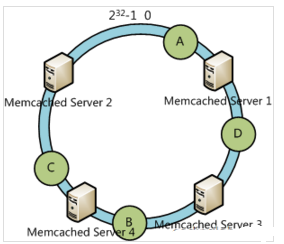
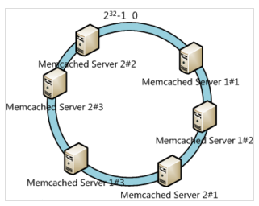
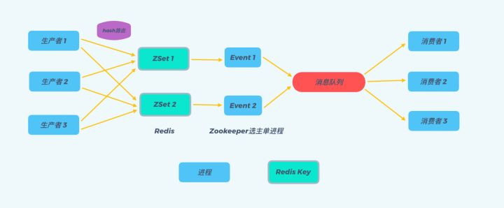

# 后台开发遇到实战项目

## 一致性哈希

原帖见[URL](https://www.cnblogs.com/moonandstar08/p/5405991.html)。

在做服务器负载均衡时候可供选择的负载均衡的算法有很多，包括：轮循算法(RoundRobin)、哈希算法(HASH)、最少连接算法(LeastConnection)、响应速度算法(ResponseTime)、加权法(Weighted)等。其中哈希算法是最为常用的算法.

典型的应用场景是：有N台服务器提供缓存服务，需要对服务器进行负载均衡，将请求平均分发到每台服务器上，每台机器负责1/N的服务。

常用的算法是对hash结果取余数(hash()modN)：对机器编号从0到N-1，按照自定义的hash()算法，对每个请求的hash()值按N取模，得到余数i，然后将请求分发到编号为i的机器。但这样的算法方法存在致命问题，如果某一台机器宕机，那么应该落在该机器的请求就无法得到正确的处理，这时需要将当掉的服务器从算法从去除，此时候会有(N-1)/N的服务器的缓存数据需要重新进行计算；如果新增一台机器，会有N/(N+1)的服务器的缓存数据需要进行重新计算。对于系统而言，这通常是不可接受的颠簸(因为这意味着大量缓存的失效或者数据需要转移)。那么，如何设计一个负载均衡策略，使得受到影响的请求尽可能的少呢?

在Memcached、Key-ValueStore、BittorrentDHT、LVS中都采用了ConsistentHashing算法，可以说ConsistentHashing是分布式系统负载均衡的首选算法。

### 分布式缓存

在大型web应用中，缓存可算是当今的一个标准开发配置了。在大规模的缓存应用中，应运而生了分布式缓存系统。分布式缓存系统的基本原理，大家也有所耳闻。key-value如何均匀的分散到集群中？说到此，最常规的方式莫过于hash取模的方式。比如集群中可用机器适量为N，那么key值为K的的数据请求很简单的应该路由到hash(K)modN对应的机器。的确，这种结构是简单的，也是实用的。但是在一些高速发展的web系统中，这样的解决方案仍有些缺陷。随着系统访问压力的增长，缓存系统不得不通过增加机器节点的方式提高集群的相应速度和数据承载量。增加机器意味着按照hash取模的方式，在增加机器节点的这一时刻，大量的缓存命不中，缓存数据需要重新建立，甚至是进行整体的缓存数据迁移，瞬间会给DB带来极高的系统负载，设置导致DB服务器宕机。那么就没有办法解决hash取模的方式带来的诟病吗？

假设我们有一个网站，最近发现随着流量增加，服务器压力越来越大，之前直接读写数据库的方式不太给力了，于是我们想引入Memcached作为缓存机制。现在我们一共有三台机器可以作为Memcached服务器，如下图所示：


很显然，最简单的策略是将每一次Memcached请求随机发送到一台Memcached服务器，但是这种策略可能会带来两个问题：一是同一份数据可能被存在不同的机器上而造成数据冗余，二是有可能某数据已经被缓存但是访问却没有命中，因为无法保证对相同key的所有访问都被发送到相同的服务器。因此，随机策略无论是时间效率还是空间效率都非常不好。

要解决上述问题只需做到如下一点：保证对相同key的访问会被发送到相同的服务器。很多方法可以实现这一点，最常用的方法是计算哈希。例如对于每次访问，可以按如下算法计算其哈希值：h=Hash(key)%3。其中Hash是一个从字符串到正整数的哈希映射函数。这样，如果我们将MemcachedServer分别编号为0、1、2，那么就可以根据上式和key计算出服务器编号h，然后去访问。

这个方法虽然解决了上面提到的两个问题，但是存在一些其它的问题。如果将上述方法抽象，可以认为通过：h=Hash(key)%N。这个算式计算每个key的请求应该被发送到哪台服务器，其中N为服务器的台数，并且服务器按照0–(N-1)编号。

这个算法的问题在于容错性和扩展性不好。所谓容错性是指当系统中某一个或几个服务器变得不可用时，整个系统是否可以正确高效运行；而扩展性是指当加入新的服务器后，整个系统是否可以正确高效运行。

现假设有一台服务器宕机了，那么为了填补空缺，要将宕机的服务器从编号列表中移除，后面的服务器按顺序前移一位并将其编号值减一，此时每个key就要按h=Hash(key)%(N-1)重新计算；同样，如果新增了一台服务器，虽然原有服务器编号不用改变，但是要按h=Hash(key)%(N+1)重新计算哈希值。因此系统中一旦有服务器变更，大量的key会被重定位到不同的服务器从而造成大量的缓存不命中。而这种情况在分布式系统中是非常糟糕的。

一个设计良好的分布式哈希方案应该具有良好的单调性，即服务节点的增减不会造成大量哈希重定位。一致性哈希算法就是这样一种哈希方案。

Hash算法的一个衡量指标是单调性（Monotonicity），定义如下：单调性是指如果已经有一些内容通过哈希分派到了相应的缓冲中，又有新的缓冲加入到系统中。哈希的结果应能够保证原有已分配的内容可以被映射到新的缓冲中去，而不会被映射到旧的缓冲集合中的其他缓冲区。

容易看到，上面的简单hash算法hash(object)%N难以满足单调性要求。

### 一致性哈希算法

一致性哈希算法(Consistent Hashing Algorithm)是一种分布式算法，常用于负载均衡。Memcachedclient也选择这种算法，解决将key-value均匀分配到众多Memcachedserver上的问题。它可以取代传统的取模操作，解决了取模操作无法应对增删MemcachedServer的问题(增删server会导致同一个key,在get操作时分配不到数据真正存储的server，命中率会急剧下降)。

简单来说，一致性哈希将整个哈希值空间组织成一个虚拟的圆环，如假设某哈希函数H的值空间为0-(2^32)-1（即哈希值是一个32位无符号整形），整个哈希空间环如下：


整个空间按顺时针方向组织。0和(2^32)-1在零点中方向重合。

下一步将各个服务器使用H进行一个哈希，具体可以选择服务器的ip或主机名作为关键字进行哈希，这样每台机器就能确定其在哈希环上的位置，这里假设将上文中三台服务器使用ip地址哈希后在环空间的位置如下：


接下来使用如下算法定位数据访问到相应服务器：将数据key使用相同的函数H计算出哈希值h，通根据h确定此数据在环上的位置，从此位置沿环顺时针“行走”，第一台遇到的服务器就是其应该定位到的服务器。

例如我们有A、B、C、D四个数据对象，经过哈希计算后，在环空间上的位置如下：


根据一致性哈希算法，数据A会被定为到Server1上，D被定为到Server3上，而B、C分别被定为到Server2上。

#### 容错性与可扩展性分析

下面分析一致性哈希算法的容错性和可扩展性。现假设Server3宕机了：


可以看到此时A、C、B不会受到影响，只有D节点被重定位到Server2。一般的，在一致性哈希算法中，如果一台服务器不可用，则受影响的数据仅仅是此服务器到其环空间中前一台服务器（即顺着逆时针方向行走遇到的第一台服务器）之间数据，其它不会受到影响。

下面考虑另外一种情况，如果我们在系统中增加一台服务器MemcachedServer4：



此时A、D、C不受影响，只有B需要重定位到新的Server4。一般的，在一致性哈希算法中，如果增加一台服务器，则受影响的数据仅仅是新服务器到其环空间中前一台服务器（即顺着逆时针方向行走遇到的第一台服务器）之间数据，其它不会受到影响。

综上所述，一致性哈希算法对于节点的增减都只需重定位环空间中的一小部分数据，具有较好的容错性和可扩展性。

#### 虚拟节点

一致性哈希算法在服务节点太少时，容易因为节点分部不均匀而造成数据倾斜问题。例如我们的系统中有两台服务器，其环分布如下：


此时必然造成大量数据集中到Server1上，而只有极少量会定位到Server2上。为了解决这种数据倾斜问题，一致性哈希算法引入了虚拟节点机制，即对每一个服务节点计算多个哈希，每个计算结果位置都放置一个此服务节点，称为虚拟节点。具体做法可以在服务器ip或主机名的后面增加编号来实现。例如上面的情况，我们决定为每台服务器计算三个虚拟节点，于是可以分别计算“MemcachedServer1#1”、“MemcachedServer1#2”、“MemcachedServer1#3”、“MemcachedServer2#1”、“MemcachedServer2#2”、“MemcachedServer2#3”的哈希值，于是形成六个虚拟节点：



ConsistentHashing最大限度地抑制了hash键的重新分布。另外要取得比较好的负载均衡的效果，往往在服务器数量比较少的时候需要增加虚拟节点来保证服务器能均匀的分布在圆环上。因为使用一般的hash方法，服务器的映射地点的分布非常不均匀。使用虚拟节点的思想，为每个物理节点（服务器）在圆上分配100～200个点。这样就能抑制分布不均匀，最大限度地减小服务器增减时的缓存重新分布。用户数据映射在虚拟节点上，就表示用户数据真正存储位置是在该虚拟节点代表的实际物理服务器上。

### 有界负载一致性哈希

当有部分资源是热点资源或者部分用户请求量比较大的时候，会出现部分节点需要处理大量请求（这些请求根据一致性哈希策略都选中了固定的部分节点），出现负载非常不均的情况，因为是一致性哈希所以这些请求没法分摊到其他节点上，导致出现持续的负载不均和热点问题。有限负载一致性哈希（Consistent Hashing with Bounded Loads） 出自论文 Consistent Hashing with Bounded Loads ，主要思路是，根据当前负载情况对所有节点限制一个最大负载，在一致性哈希中对 hash 环进行查找时将跳过达到最大负载限制的节点，通过把过载的请求转移到其他节点上来解决热点和不均衡问题。

>- R: 当前所有节点的总负载（正在处理的总请求数）
>- T: 节点总个数
>- L: 当前所有节点的平均负载
>- L = R / T
>- ε: 一个参数用于表示在平均负载的基础上能够承受的额外负载上限，可以按照实际需求进行设置（根据vimeo分享的经验这个值推荐设置为 0.25~1）
>- M: 节点的最大负载上限
>- M = L x ( 1 + ε ) = R x ( 1 + ε ) / T

一致性哈希中进行节点查找时，增加检查匹配的节点的负载（正在处理的请求数）是否达到负载上限M的操作，如果达到了上限则跳过当前节点继续往后查找。可以发现ConsistentHashing with Bounded Loads结合了最少连接策略和一致性哈希策略各自的优点，即平衡了负载又兼顾了一致性哈希，并且还可以通过调整转化为最少请求策略或一致性哈希策略。当ε的值是0的时候，就实现了最少连接策略的效果；当ε的值是无穷大的时候，就是传统的一致性哈希策略。

上面的方法是没有区分节点权重的，如果要支持节点权重的话，需要做一点改动:

>- R: 当前所有节点的总负载（正在处理的总请求数）
>- T: 所有节点的权重总和
>- L: 当前所有节点的平均负载（基于权重的平均负载）
>- L = R / T
>- W: 当前节点的权重值
>- ε: 一个参数用于表示在平均负载的基础上能够承受的额外负载上限。
>- M: 节点的最大负载上限
>- M = W x L x (1 + ε) = W x R x ( 1 + ε ) / T

一致性哈希中进行节点查找时，增加检查匹配的节点的负载（正在处理的请求数）是否达到负载上限M的操作，如果达到了上限则跳过当前节点继续往后查找。
可以看到主要区别是算平均负载的时候是基于节点的权重和来计算的，算负载上限的时候是按权重比来计算的。

在实现上，需要添加负载统计，每一次请求都要对总负载+1，完成之后还要对总负载-1。每次选择节点时，要检查负载是否超出了上限。当虚拟节点数量较多时，一致性哈希的均匀度基本能够保证负载不会超过上限，只有在突发情况下有界负载算法才会生效，拦截异常的突发流量。

## 高并发流量控制

限流的常用处理手段有：计数器、滑动窗口、漏桶、令牌。

计数器是一种比较简单的限流算法，用途比较广泛，在接口层面，很多地方使用这种方式限流。在一段时间内，进行计数，与阀值进行比较，到了时间临界点，将计数器清0。这种方式限制了单位时间平均流量，但是无法消除突发流量。由于计数器存在临界点缺陷，后来出现了滑动窗口算法来解决。滑动窗口的意思是说把固定时间片，进行划分，并且随着时间的流逝，进行移动，这样就巧妙的避开了计数器的临界点问题。也就是说这些固定数量的可以移动的格子，将会进行计数判断阀值，因此格子的数量影响着滑动窗口算法的精度。

滑动窗口有效避免了时间临界点的问题，但是依然有时间片的概念，而漏桶算法在这方面比滑动窗口而言，更加先进。一个固定的桶，进水的速率是不确定的，但是出水的速率是恒定的，当水满的时候是会溢出的。

```cpp
class leaky_bucket {
public:
    bool grant() {
        // 这段时间流失的水
        auto now = time(nullptr);
        int out = (int)(now - m_ts) * m_rate; // 出水的速率恒定 （可能无故流失掉一些
        // 此刻桶内剩余的水
        m_water = std::max(0, m_water - out);
        m_ts = now;
        // 限制流量
        if (m_water + 1 < m_size) {
            ++m_water;
            return true; // passed
        } else {
            return false; // denied
        }
    }

private:
    time_t m_ts; // last ts
    int m_water; // 漏桶里现有的水
    int m_size;  // 漏桶大小
    int m_rate;  // 出水的速度
};

class token_bucket {
public:
    bool grant() {
        // 这段时间产生的令牌
        auto now = time(nullptr);
        int in = (int)(now - m_ts) * m_token_rate;
        // 此刻桶内可以取得的令牌总数
        m_token_num = std::min(m_size, m_token_num + in);
        m_ts = now;
        // 限制流量
        if (m_token_num > 0) {
            --m_token_num;
            return true; // passed
        } else {
            return false; // denied
        }
    }

private:
    time_t m_ts;
    int m_size;
    int m_token_rate;
    int m_token_num;
};
```

注意到，漏桶的出水速度是恒定的，那么意味着如果瞬时大流量的话，将有大部分请求被丢弃掉（也就是所谓的溢出）。为了解决这个问题，令牌桶进行了算法改进。生成令牌的速度是恒定的，而请求去拿令牌是没有速度限制的。这意味，面对瞬时大流量，该算法可以在短时间内请求拿到大量令牌，而且拿令牌的过程并不是消耗很大的事情。（有一点生产令牌，消费令牌的意味）。不论是对于令牌桶拿不到令牌被拒绝，还是漏桶的水满了溢出，都是为了保证大部分流量的正常使用，而牺牲掉了少部分流量，这是合理的，如果因为极少部分流量需要保证的话，那么就可能导致系统达到极限而挂掉，得不偿失。

两者主要区别在于漏桶算法能够强行限制数据的传输速率，而令牌桶算法在能够限制数据的平均传输速率外，还允许某种程度的突发传输。在令牌桶算法中，只要令牌桶中存在令牌，那么就允许突发地传输数据直到达到用户配置的门限，所以它适合于具有突发特性的流量。

## 延迟队列

原文[你真的知道怎么实现一个延迟队列吗 ？](https://zhuanlan.zhihu.com/p/266156267)

### Redis ZSet

使用 ZSet 的有序特性，将延迟处理时间作为 Score 把任务 Key 加入 ZSet（Ologn）；使用定时进程通过 ZREANGEBYSCORE（Ologn+m）方法查询 ZSet 中 Score 最小的元素，检查是否需要执行任务。



>- 将延迟的消息任务通过 hash 算法路由至不同的 Redis Key 上，这样做有两大处：a. 避免了当一个 KEY 在存储了较多的延时消息后，入队操作以及查询操作速度变的问题（两个操作的时间复杂度均为O(logN)）。b. 系统具有了更好的横向可扩展性，当数据量激增时，我们可以通过增加 RedisKey 的数量来快速的扩展整个系统，来抗住数据量的增长。
>- 每个 Redis Key 都对应建立一个处理进程，称为 Event 进程，通过上述步骤 2 所述的 ZRANGEBYSCORE 方法轮询 Key，查询是否有待处理的延迟消息。
所有的 Event 进程只负责分发消息，具体的业务逻辑通过一个额外的消息队列异步理，这么做的好处也是显而易见的：a. 一方面，Event 进程只负责分发消息，那么其处理消息的速度就会非常快，就不会出现因为业务逻辑复杂而导致消息堆积的情况。b. 另一方面，采用一个额外的消息队列后，消息处理的可扩展性也会更好，我们可通过增加消费者进程数量来扩展整个系统的消息处理能力。
>- Event 进程采用 Zookeeper 选主单进程部署的方式，避免 Event 进程宕机后Redis Key 中消息堆积的情况。一旦 Zookeeper 的 leader 主机宕机，Zookeeper 会自动选择新的 leader 主机来处理 Redis Key 中的消息。

从上述的讨论中我们可以看到，通过 Redis Zset 实现延迟队列是一种理解起来较为直观，可以快速落地的方案。并且我们可以依赖 Redis 自身的持久化来实现持久化，使用 Redis 集群来支持高并发和高可用，是一种不错的延迟队列的实现方案。

### TimeWheel

TimeWheel 时间轮算法，是一种实现延迟队列的巧妙且高效的算法，被应用在 Netty，Zookeeper，Kafka 等各种框架中。。

根据场景需求取舍优化，使用简易时间轮或者多层时间轮，亦可实现延迟队列。如果任务数量少且执行速度快，可以使用简易时间轮，按序轮询执行。如果任务数量多或者耗时较大，可能需要多层时间轮 + 线程池（或者用前一方案中的消息队列，当然这样视野就拔的很高了），保证时间轮运转精度和任务执行效率。
