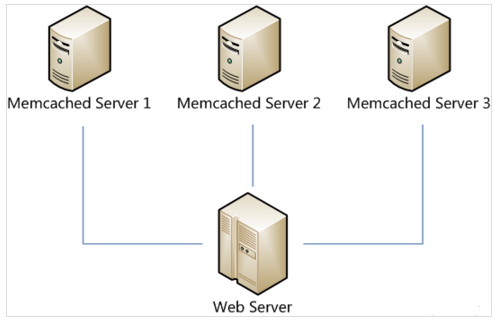
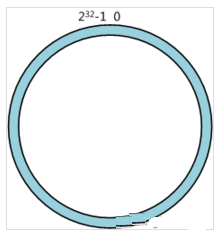
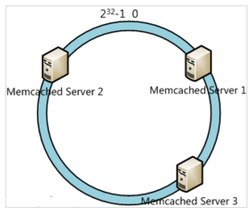
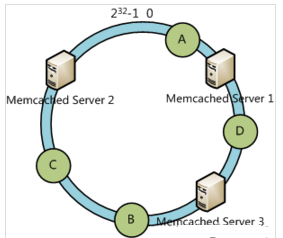
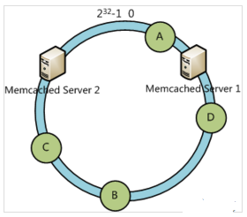
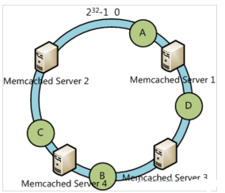
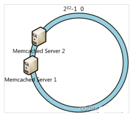
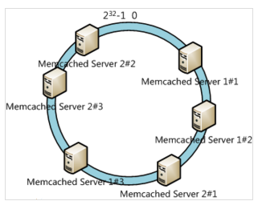

# 后台开发遇到的算法和策略

## 一致性哈希

原帖见[URL](https://www.cnblogs.com/moonandstar08/p/5405991.html)。

在做服务器负载均衡时候可供选择的负载均衡的算法有很多，包括：轮循算法(RoundRobin)、哈希算法(HASH)、最少连接算法(LeastConnection)、响应速度算法(ResponseTime)、加权法(Weighted)等。其中哈希算法是最为常用的算法.

典型的应用场景是：有N台服务器提供缓存服务，需要对服务器进行负载均衡，将请求平均分发到每台服务器上，每台机器负责1/N的服务。

常用的算法是对hash结果取余数(hash()modN)：对机器编号从0到N-1，按照自定义的hash()算法，对每个请求的hash()值按N取模，得到余数i，然后将请求分发到编号为i的机器。但这样的算法方法存在致命问题，如果某一台机器宕机，那么应该落在该机器的请求就无法得到正确的处理，这时需要将当掉的服务器从算法从去除，此时候会有(N-1)/N的服务器的缓存数据需要重新进行计算;如果新增一台机器，会有N/(N+1)的服务器的缓存数据需要进行重新计算。对于系统而言，这通常是不可接受的颠簸(因为这意味着大量缓存的失效或者数据需要转移)。那么，如何设计一个负载均衡策略，使得受到影响的请求尽可能的少呢?

在Memcached、Key-ValueStore、BittorrentDHT、LVS中都采用了ConsistentHashing算法，可以说ConsistentHashing是分布式系统负载均衡的首选算法。

## 分布式缓存问题

在大型web应用中，缓存可算是当今的一个标准开发配置了。在大规模的缓存应用中，应运而生了分布式缓存系统。分布式缓存系统的基本原理，大家也有所耳闻。key-value如何均匀的分散到集群中？说到此，最常规的方式莫过于hash取模的方式。比如集群中可用机器适量为N，那么key值为K的的数据请求很简单的应该路由到hash(K)modN对应的机器。的确，这种结构是简单的，也是实用的。但是在一些高速发展的web系统中，这样的解决方案仍有些缺陷。随着系统访问压力的增长，缓存系统不得不通过增加机器节点的方式提高集群的相应速度和数据承载量。增加机器意味着按照hash取模的方式，在增加机器节点的这一时刻，大量的缓存命不中，缓存数据需要重新建立，甚至是进行整体的缓存数据迁移，瞬间会给DB带来极高的系统负载，设置导致DB服务器宕机。那么就没有办法解决hash取模的方式带来的诟病吗？

假设我们有一个网站，最近发现随着流量增加，服务器压力越来越大，之前直接读写数据库的方式不太给力了，于是我们想引入Memcached作为缓存机制。现在我们一共有三台机器可以作为Memcached服务器，如下图所示：

很显然，最简单的策略是将每一次Memcached请求随机发送到一台Memcached服务器，但是这种策略可能会带来两个问题：一是同一份数据可能被存在不同的机器上而造成数据冗余，二是有可能某数据已经被缓存但是访问却没有命中，因为无法保证对相同key的所有访问都被发送到相同的服务器。因此，随机策略无论是时间效率还是空间效率都非常不好。

要解决上述问题只需做到如下一点：保证对相同key的访问会被发送到相同的服务器。很多方法可以实现这一点，最常用的方法是计算哈希。例如对于每次访问，可以按如下算法计算其哈希值：h=Hash(key)%3。其中Hash是一个从字符串到正整数的哈希映射函数。这样，如果我们将MemcachedServer分别编号为0、1、2，那么就可以根据上式和key计算出服务器编号h，然后去访问。

这个方法虽然解决了上面提到的两个问题，但是存在一些其它的问题。如果将上述方法抽象，可以认为通过：h=Hash(key)%N。这个算式计算每个key的请求应该被发送到哪台服务器，其中N为服务器的台数，并且服务器按照0–(N-1)编号。

这个算法的问题在于容错性和扩展性不好。所谓容错性是指当系统中某一个或几个服务器变得不可用时，整个系统是否可以正确高效运行；而扩展性是指当加入新的服务器后，整个系统是否可以正确高效运行。

现假设有一台服务器宕机了，那么为了填补空缺，要将宕机的服务器从编号列表中移除，后面的服务器按顺序前移一位并将其编号值减一，此时每个key就要按h=Hash(key)%(N-1)重新计算；同样，如果新增了一台服务器，虽然原有服务器编号不用改变，但是要按h=Hash(key)%(N+1)重新计算哈希值。因此系统中一旦有服务器变更，大量的key会被重定位到不同的服务器从而造成大量的缓存不命中。而这种情况在分布式系统中是非常糟糕的。

一个设计良好的分布式哈希方案应该具有良好的单调性，即服务节点的增减不会造成大量哈希重定位。一致性哈希算法就是这样一种哈希方案。

Hash算法的一个衡量指标是单调性（Monotonicity），定义如下：单调性是指如果已经有一些内容通过哈希分派到了相应的缓冲中，又有新的缓冲加入到系统中。哈希的结果应能够保证原有已分配的内容可以被映射到新的缓冲中去，而不会被映射到旧的缓冲集合中的其他缓冲区。

容易看到，上面的简单hash算法hash(object)%N难以满足单调性要求。

## 一致性哈希算法的理解

### 算法简述

一致性哈希算法(Consistent Hashing Algorithm)是一种分布式算法，常用于负载均衡。Memcachedclient也选择这种算法，解决将key-value均匀分配到众多Memcachedserver上的问题。它可以取代传统的取模操作，解决了取模操作无法应对增删MemcachedServer的问题(增删server会导致同一个key,在get操作时分配不到数据真正存储的server，命中率会急剧下降)。

简单来说，一致性哈希将整个哈希值空间组织成一个虚拟的圆环，如假设某哈希函数H的值空间为0-(2^32)-1（即哈希值是一个32位无符号整形），整个哈希空间环如下：

整个空间按顺时针方向组织。0和(2^32)-1在零点中方向重合。

下一步将各个服务器使用H进行一个哈希，具体可以选择服务器的ip或主机名作为关键字进行哈希，这样每台机器就能确定其在哈希环上的位置，这里假设将上文中三台服务器使用ip地址哈希后在环空间的位置如下：

接下来使用如下算法定位数据访问到相应服务器：将数据key使用相同的函数H计算出哈希值h，通根据h确定此数据在环上的位置，从此位置沿环顺时针“行走”，第一台遇到的服务器就是其应该定位到的服务器。

例如我们有A、B、C、D四个数据对象，经过哈希计算后，在环空间上的位置如下：

根据一致性哈希算法，数据A会被定为到Server1上，D被定为到Server3上，而B、C分别被定为到Server2上。

### 容错性与可扩展性分析

下面分析一致性哈希算法的容错性和可扩展性。现假设Server3宕机了：

可以看到此时A、C、B不会受到影响，只有D节点被重定位到Server2。一般的，在一致性哈希算法中，如果一台服务器不可用，则受影响的数据仅仅是此服务器到其环空间中前一台服务器（即顺着逆时针方向行走遇到的第一台服务器）之间数据，其它不会受到影响。

下面考虑另外一种情况，如果我们在系统中增加一台服务器MemcachedServer4：

此时A、D、C不受影响，只有B需要重定位到新的Server4。一般的，在一致性哈希算法中，如果增加一台服务器，则受影响的数据仅仅是新服务器到其环空间中前一台服务器（即顺着逆时针方向行走遇到的第一台服务器）之间数据，其它不会受到影响。

综上所述，一致性哈希算法对于节点的增减都只需重定位环空间中的一小部分数据，具有较好的容错性和可扩展性。

### 虚拟节点

一致性哈希算法在服务节点太少时，容易因为节点分部不均匀而造成数据倾斜问题。例如我们的系统中有两台服务器，其环分布如下：

此时必然造成大量数据集中到Server1上，而只有极少量会定位到Server2上。为了解决这种数据倾斜问题，一致性哈希算法引入了虚拟节点机制，即对每一个服务节点计算多个哈希，每个计算结果位置都放置一个此服务节点，称为虚拟节点。具体做法可以在服务器ip或主机名的后面增加编号来实现。例如上面的情况，我们决定为每台服务器计算三个虚拟节点，于是可以分别计算“MemcachedServer1#1”、“MemcachedServer1#2”、“MemcachedServer1#3”、“MemcachedServer2#1”、“MemcachedServer2#2”、“MemcachedServer2#3”的哈希值，于是形成六个虚拟节点：

ConsistentHashing最大限度地抑制了hash键的重新分布。另外要取得比较好的负载均衡的效果，往往在服务器数量比较少的时候需要增加虚拟节点来保证服务器能均匀的分布在圆环上。因为使用一般的hash方法，服务器的映射地点的分布非常不均匀。使用虚拟节点的思想，为每个物理节点（服务器）在圆上分配100～200个点。这样就能抑制分布不均匀，最大限度地减小服务器增减时的缓存重新分布。用户数据映射在虚拟节点上，就表示用户数据真正存储位置是在该虚拟节点代表的实际物理服务器上。

### 有界负载一致性哈希

当有部分资源是热点资源或者部分用户请求量比较大的时候，会出现部分节点需要处理大量请求（这些请求根据一致性哈希策略都选中了固定的部分节点），出现负载非常不均的情况，因为是一致性哈希所以这些请求没法分摊到其他节点上，导致出现持续的负载不均和热点问题。有限负载一致性哈希（Consistent Hashing with Bounded Loads） 出自论文 Consistent Hashing with Bounded Loads ，主要思路是，根据当前负载情况对所有节点限制一个最大负载，在一致性哈希中对 hash 环进行查找时将跳过达到最大负载限制的节点，通过把过载的请求转移到其他节点上来解决热点和不均衡问题。

>- R: 当前所有节点的总负载（正在处理的总请求数）
>- T: 节点总个数
>- L: 当前所有节点的平均负载
>- L = R / T
>- ε: 一个参数用于表示在平均负载的基础上能够承受的额外负载上限，可以按照实际需求进行设置（根据vimeo分享的经验这个值推荐设置为 0.25~1）
>- M: 节点的最大负载上限
>- M = L x ( 1 + ε ) = R x ( 1 + ε ) / T

一致性哈希中进行节点查找时，增加检查匹配的节点的负载（正在处理的请求数）是否达到负载上限M的操作，如果达到了上限则跳过当前节点继续往后查找。可以发现ConsistentHashing with Bounded Loads结合了最少连接策略和一致性哈希策略各自的优点，即平衡了负载又兼顾了一致性哈希，并且还可以通过调整转化为最少请求策略或一致性哈希策略。当ε的值是0的时候，就实现了最少连接策略的效果；当ε的值是无穷大的时候，就是传统的一致性哈希策略。

上面的方法是没有区分节点权重的，如果要支持节点权重的话，需要做一点改动:

>- R: 当前所有节点的总负载（正在处理的总请求数）
>- T: 所有节点的权重总和
>- L: 当前所有节点的平均负载（基于权重的平均负载）
>- L = R / T
>- W: 当前节点的权重值
>- ε: 一个参数用于表示在平均负载的基础上能够承受的额外负载上限。
>- M: 节点的最大负载上限
>- M = W x L x (1 + ε) = W x R x ( 1 + ε ) / T

一致性哈希中进行节点查找时，增加检查匹配的节点的负载（正在处理的请求数）是否达到负载上限M的操作，如果达到了上限则跳过当前节点继续往后查找。
可以看到主要区别是算平均负载的时候是基于节点的权重和来计算的，算负载上限的时候是按权重比来计算的。

在实现上，需要添加负载统计，每一次请求都要对总负载+1，完成之后还要对总负载-1。每次选择节点时，要检查负载是否超出了上限。当虚拟节点数量较多时，一致性哈希的均匀度基本能够保证负载不会超过上限，只有在突发情况下有界负载算法才会生效，拦截异常的突发流量。
