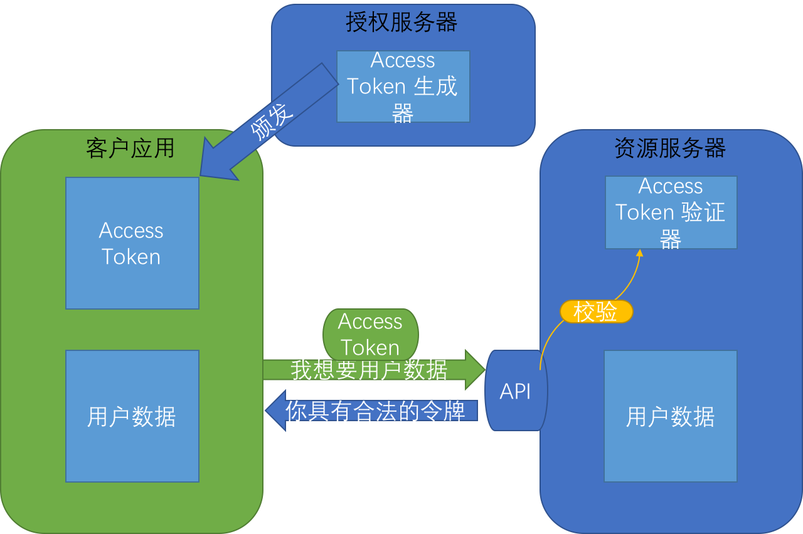
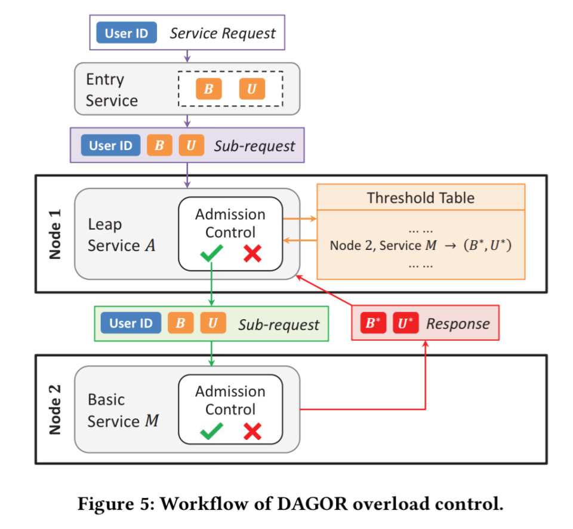

# 后台开发遇到非实战项目

## 事件处理模式：Reactor模式

I/O多路复用是指使用一个线程来检查多个文件描述符(Socket)的就绪状态，比如调用select和poll函数，传入多个文件描述符，如果有一个文件描述符就绪，则返回，否则阻塞直到超时。得到就绪状态后进行真正的操作可以在同一个线程里执行，也可以启动线程执行(比如使用线程池)。

一般情况下，I/O 复用机制需要事件分发器。 事件分发器的作用，将那些读写事件源分发给各读写事件的处理者。
涉及到事件分发器的两种模式称为：Reactor和Proactor。 Reactor模式是基于同步I/O的，而Proactor模式是和异步I/O相关的。以下是一种典型的IO服务器模型。

>- 服务器端的Server是一个线程，线程中执行一个循环来阻塞的监听客户端的连接请求和通信。
>- 当客户端向服务器端发送一个连接请求后，服务器端的Server会接受客户端的请求，ServerSocket.accept()从阻塞中返回，得到一个与客户端连接相对于的Socket。
>- 构建一个handler，将Socket传入该handler。创建一个线程并启动该线程，在线程中执行handler，这样与客户端的所有的通信以及数据处理都在该线程中执行。当该客户端和服务器端完成通信关闭连接后，线程就会被销毁。
>- Server继续执行accept()操作等待新的连接请求。

优点：使用简单，容易编程；在多核系统下，能够充分利用了多核CPU的资源。即当I/O阻塞系统，但CPU空闲的时候，可以利用多线程使用CPU资源。

缺点：该模式的本质问题在于严重依赖线程，但线程Java虚拟机非常宝贵的资源。随着客户端并发访问量的急剧增加，线程数量的不断膨胀将服务器端的性能将急剧下降。

>- 线程生命周期的开销非常高。线程的创建与销毁并不是没有代价的。在Linux这样的操作系统中，线程本质上就是一个进程，创建和销毁都是重量级的系统函数。
>- 资源消耗。内存：大量空闲的线程会占用许多内存，给垃圾回收器带来压力。CPU：如果已经拥有足够多的线程使所有CPU保持忙碌状态，那么再创建更过的线程反而会降低性能。
>- 稳定性。在可创建线程的数量上存在一个限制。这个限制值将随着平台的不同而不同，并且受多个因素制约：a)JVM的启动参数、b)Threa的构造函数中请求的栈大小、c)底层操作系统对线程的限制 等。如果破坏了这些限制，那么很可能抛出OutOfMemoryError异常。
>- 线程的切换成本是很高的。操作系统发生线程切换的时候，需要保留线程的上下文，然后执行系统调用。如果线程数过高，不仅会带来许多无用的上下文切换，还可能导致执行线程切换的时间甚至会大于线程执行的时间，这时候带来的表现往往是系统负载偏高、CPU sy(系统CPU)使用率特别高，导致系统几乎陷入不可用的状态。
>- 容易造成锯齿状的系统负载。一旦线程数量高但外部网络环境不是很稳定，就很容易造成大量请求的结果同时返回，激活大量阻塞线程从而使系统负载压力过大。
>- 若是长连接的情况下并且客户端与服务器端交互并不频繁的，那么客户端和服务器端的连接会一直保留着，对应的线程也就一直存在在，但因为不频繁的通信，导致大量线程在大量时间内都处于空置状态。

适用场景：如果有少量的连接使用非常高的带宽，一次发送大量的数据，也许典型的IO服务器实现可能非常契合。

反应器模式是一种处理一个或多个客户端并发交付服务请求的事件设计模式。当请求抵达后，服务处理程序使用I/O多路复用策略，然后同步地派发这些请求至相关的请求处理程序。

Handle(句柄或描述符，在Windows下称为句柄，在Linux下称为描述符)：本质上表示一种资源(比如说文件描述符，或是针对网络编程中的socket描述符)，是由操作系统提供的；该资源用于表示一个个的事件，事件既可以来自于外部，也可以来自于内部；外部事件比如说客户端的连接请求，客户端发送过来的数据等；内部事件比如说操作系统产生的定时事件等。它本质上就是一个文件描述符，Handle是事件产生的发源地。

Synchronous Event Demultiplexer(同步事件分离器)：它本身是一个系统调用，用于等待事件的发生(事件可能是一个，也可能是多个)。调用方在调用它的时候会被阻塞，一直阻塞到同步事件分离器上有事件产生为止。对于Linux来说，同步事件分离器指的就是常用的I/O多路复用机制，比如说select、poll、epoll等。在Java NIO领域中，同步事件分离器对应的组件就是Selector；对应的阻塞方法就是select方法。

Event Handler(事件处理器)：本身由多个回调方法构成，这些回调方法构成了与应用相关的对于某个事件的反馈机制。在Java NIO领域中并没有提供事件处理器机制让我们调用或去进行回调，是由我们自己编写代码完成的。Netty相比于Java NIO来说，在事件处理器这个角色上进行了一个升级，它为我们开发者提供了大量的回调方法，供我们在特定事件产生时实现相应的回调方法进行业务逻辑的处理，即，ChannelHandler。ChannelHandler中的方法对应的都是一个个事件的回调。
Concrete Event Handler(具体事件处理器)：是事件处理器的实现。它本身实现了事件处理器所提供的各种回调方法，从而实现了特定于业务的逻辑。它本质上就是我们所编写的一个个的处理器实现。

Initiation Dispatcher(初始分发器)：实际上就是Reactor角色。它本身定义了一些规范，这些规范用于控制事件的调度方式，同时又提供了应用进行事件处理器的注册、删除等设施。它本身是整个事件处理器的核心所在，Initiation Dispatcher会通过Synchronous Event Demultiplexer来等待事件的发生。一旦事件发生，Initiation Dispatcher首先会分离出每一个事件，然后调用事件处理器，最后调用相关的回调方法来处理这些事件。Netty中ChannelHandler里的一个个回调方法都是由bossGroup或workGroup中的某个EventLoop来调用的。

>- 初始化Initiation Dispatcher，然后将若干个Concrete Event Handler注册到Initiation Dispatcher中。当应用向Initiation Dispatcher注册Concrete Event Handler时，会在注册的同时指定感兴趣的事件，即应用会标识出该事件处理器希望Initiation Dispatcher在某些事件发生时向其发出通知，事件通过Handle来标识，而Concrete Event Handler又持有该Handle。这样，事件 —> Handle —> Concrete Event Handler就关联起来了。
>- Initiation Dispatcher 会要求每个事件处理器向其传递内部的Handle。该Handle向操作系统标识了事件处理器。
>- 当所有的Concrete Event Handler都注册完毕后，应用会调用handle_events方法来启动Initiation Dispatcher的事件循环。这是，Initiation Dispatcher会将每个注册的Concrete Event Handler的Handle合并起来，并使用Synchronous Event Demultiplexer(同步事件分离器)同步阻塞的等待事件的发生。比如说，TCP协议层会使用select同步事件分离器操作来等待客户端发送的数据到达连接的socket handler上。比如，在Java中通过Selector的select()方法来实现这个同步阻塞等待事件发生的操作。在Linux操作系统下，select()的实现中: a)会将已经注册到Initiation Dispatcher的事件调用epollCtl(epfd, opcode, fd, events)注册到linux系统中，这里fd表示Handle，events表示我们所感兴趣的Handle的事件；b)通过调用epollWait方法同步阻塞的等待已经注册的事件的发生。不同事件源上的事件可能同时发生，一旦有事件被触发了，epollWait方法就会返回；c)最后通过发生的事件找到相关联的SelectorKeyImpl对象，并设置其发生的事件为就绪状态，然后将SelectorKeyImpl放入selectedSet中。这样一来我们就可以通过Selector.selectedKeys()方法得到事件就绪的SelectorKeyImpl集合了。
>- 当与某个事件源对应的Handle变为ready状态时(比如说，TCP socket变为等待读状态时)，Synchronous Event Demultiplexer就会通知Initiation Dispatcher。
>- Initiation Dispatcher会触发事件处理器的回调方法，从而响应这个处于ready状态的Handle。当事件发生时，Initiation Dispatcher会将被事件源激活的Handle作为『key』来寻找并分发恰当的事件处理器回调方法。
>- Initiation Dispatcher会回调事件处理器的handle_event(type)回调方法来执行特定于应用的功能(开发者自己所编写的功能)，从而相应这个事件。所发生的事件类型可以作为该方法参数并被该方法内部使用来执行额外的特定于服务的分离与分发。

### 单线程Reactor实现模式

① 服务器端的Reactor是一个线程对象，该线程会启动事件循环，并使用Selector来实现IO的多路复用。注册一个Acceptor事件处理器到Reactor中，Acceptor事件处理器所关注的事件是ACCEPT事件，这样Reactor会监听客户端向服务器端发起的连接请求事件(ACCEPT事件)。

② 客户端向服务器端发起一个连接请求，Reactor监听到了该ACCEPT事件的发生并将该ACCEPT事件派发给相应的Acceptor处理器来进行处理。Acceptor处理器通过accept()方法得到与这个客户端对应的连接(SocketChannel)，然后将该连接所关注的READ事件以及对应的READ事件处理器注册到Reactor中，这样一来Reactor就会监听该连接的READ事件了。或者当你需要向客户端发送数据时，就向Reactor注册该连接的WRITE事件和其处理器。

③ 当Reactor监听到有读或者写事件发生时，将相关的事件派发给对应的处理器进行处理。比如，读处理器会通过SocketChannel的read()方法读取数据，此时read()操作可以直接读取到数据，而不会堵塞与等待可读的数据到来。

④ 每当处理完所有就绪的感兴趣的I/O事件后，Reactor线程会再次执行select()阻塞等待新的事件就绪并将其分派给对应处理器进行处理。

注意，Reactor的单线程模式的单线程主要是针对于I/O操作而言，也就是所以的I/O的accept()、read()、write()以及connect()操作都在一个线程上完成的。但在目前的单线程Reactor模式中，不仅I/O操作在该Reactor线程上，连非I/O的业务操作也在该线程上进行处理了，这可能会大大延迟I/O请求的响应。所以我们应该将非I/O的业务逻辑操作从Reactor线程上卸载，以此来加速Reactor线程对I/O请求的响应。

### 改进：使用工作者线程池

与单线程Reactor模式不同的是，添加了一个工作者线程池，并将非I/O操作从Reactor线程中移出转交给工作者线程池来执行。这样能够提高Reactor线程的I/O响应，不至于因为一些耗时的业务逻辑而延迟对后面I/O请求的处理。

通过重用现有的线程而不是创建新线程，可以在处理多个请求时分摊在线程创建和销毁过程产生的巨大开销。另一个额外的好处是，当请求到达时，工作线程通常已经存在，因此不会由于等待创建线程而延迟任务的执行，从而提高了响应性。通过适当调整线程池的大小，可以创建足够多的线程以便使处理器保持忙碌状态。同时还可以防止过多线程相互竞争资源而使应用程序耗尽内存或失败。

注意，在上图的改进的版本中，所以的I/O操作依旧由一个Reactor来完成，包括I/O的accept()、read()、write()以及connect()操作。对于一些小容量应用场景，可以使用单线程模型。但是对于高负载、大并发或大数据量的应用场景却不合适，主要原因如下：a)一个NIO线程同时处理成百上千的链路，性能上无法支撑，即便NIO线程的CPU负荷达到100%，也无法满足海量消息的读取和发送；
b)当NIO线程负载过重之后，处理速度将变慢，这会导致大量客户端连接超时，超时之后往往会进行重发，这更加重了NIO线程的负载，最终会导致大量消息积压和处理超时，成为系统的性能瓶颈。

### 多Reactor线程模式

Reactor线程池中的每一Reactor线程都会有自己的Selector、线程和分发的事件循环逻辑。mainReactor可以只有一个，但subReactor一般会有多个。mainReactor线程主要负责接收客户端的连接请求，然后将接收到的SocketChannel传递给subReactor，由subReactor来完成和客户端的通信。

① 注册一个Acceptor事件处理器到mainReactor中，Acceptor事件处理器所关注的事件是ACCEPT事件，这样mainReactor会监听客户端向服务器端发起的连接请求事件(ACCEPT事件)。启动mainReactor的事件循环。

② 客户端向服务器端发起一个连接请求，mainReactor监听到了该ACCEPT事件并将该ACCEPT事件派发给Acceptor处理器来进行处理。Acceptor处理器通过accept()方法得到与这个客户端对应的连接(SocketChannel)，然后将这个SocketChannel传递给subReactor线程池。

③ subReactor线程池分配一个subReactor线程给这个SocketChannel，即，将SocketChannel关注的READ事件以及对应的READ事件处理器注册到subReactor线程中。当然你也注册WRITE事件以及WRITE事件处理器到subReactor线程中以完成I/O写操作。Reactor线程池中的每一Reactor线程都会有自己的Selector、线程和分发的循环逻辑。

④ 当有I/O事件就绪时，相关的subReactor就将事件派发给响应的处理器处理。注意，这里subReactor线程只负责完成I/O的read()操作，在读取到数据后将业务逻辑的处理放入到线程池中完成，若完成业务逻辑后需要返回数据给客户端，则相关的I/O的write操作还是会被提交回subReactor线程来完成。

注意，所以的I/O操作(包括，I/O的accept()、read()、write()以及connect()操作)依旧还是在Reactor线程(mainReactor线程 或 subReactor线程)中完成的。Thread Pool(线程池)仅用来处理非I/O操作的逻辑。

多Reactor线程模式将“接受客户端的连接请求”和“与该客户端的通信”分在了两个Reactor线程来完成。mainReactor完成接收客户端连接请求的操作，它不负责与客户端的通信，而是将建立好的连接转交给subReactor线程来完成与客户端的通信，这样一来就不会因为read()数据量太大而导致后面的客户端连接请求得不到即时处理的情况。并且多Reactor线程模式在海量的客户端并发请求的情况下，还可以通过实现subReactor线程池来将海量的连接分发给多个subReactor线程，在多核的操作系统中这能大大提升应用的负载和吞吐量。

## 事件处理模式：Proactor模式

在Reactor中，事件分离器负责等待文件描述符或socket为读写操作准备就绪，然后将就绪事件传递给对应的处理器，最后由事件处理器负责完成实际的读写工作。而在Proactor模式中，处理器或者兼任处理器的事件分离器，只负责发起异步读写操作。IO操作本身由操作系统来完成。传递给操作系统的参数需要包括用户定义的数据缓冲区地址和数据大小，操作系统才能从中得到写出操作所需数据，或写入从socket读到的数据。事件分离器捕获IO操作完成事件，然后将事件传递给对应处理器。比如，在windows上，处理器发起一个异步IO操作，再由事件分离器等待IOCompletion事件。典型的异步模式实现，都建立在操作系统支持异步API的基础之上，我们将这种实现称为“系统级”异步或“真”异步，因为应用程序完全依赖操作系统执行真正的IO工作。

以读操作为例，在Reactor中实现读：

>- 注册读就绪事件和相应的事件处理器
>- 事件分离器等待事件
>- 事件到来，激活分离器，分离器调用事件对应的处理器。
>- 事件处理器完成实际的读操作，处理读到的数据，注册新的事件，然后返还控制权。

在Proactor中实现读：

>- 处理器发起异步读操作（注意：操作系统必须支持异步IO）。在这种情况下，处理器无视IO就绪事件，它关注的是完成事件。
>- 事件分离器等待操作完成事件
>- 在分离器等待过程中，操作系统利用并行的内核线程执行实际的读操作，并将结果数据存入用户自定义缓冲区，最后通知事件分离器读操作完成。
>- 事件分离器呼唤处理器。
>- 事件处理器处理用户自定义缓冲区中的数据，然后启动一个新的异步操作，并将控制权返回事件分离器。

通过上例可以看出，两个模式的相同点，都是对某个IO事件的事件通知(即告诉某个模块，这个IO操作可以进行或已经完成)。在结构上，两者也有相同点：demultiplexor负责提交IO操作(异步)、查询设备是否可操作(同步)，然后当条件满足时，就回调handler；不同点在于，异步情况下(Proactor)，当回调handler时，表示IO操作已经完成；同步情况下(Reactor)，回调handler时，表示IO设备可以进行某个操作(can read or can write)。

使用Proactor框架和Reactor框架都可以极大的简化网络应用的开发，但它们的重点却不同。Reactor框架中用户定义的操作是在实际操作之前调用的。比如你定义了操作是要向一个SOCKET写数据，那么当该SOCKET可以接收数据的时候，你的操作就会被调用；而Proactor框架中用户定义的操作是在实际操作之后调用的。比如你定义了一个操作要显示从SOCKET中读入的数据，那么当读操作完成以后，你的操作才会被调用。

Proactor和Reactor都是并发编程中的设计模式。在我看来，他们都是用于派发/分离IO操作事件的。这里所谓的IO事件也就是诸如read/write的IO操作。"派发/分离"就是将单独的IO事件通知到上层模块。两个模式不同的地方在于，Proactor用于异步IO，而Reactor用于同步IO。目前应用最广泛的是Reactor模boost::asio，ACE和Windows I/O Completion Ports 实现了Proactor 模式，应用面似乎要窄一些。

## Apache Traffic Server

ApacheTrafficServer（ATS或TS）是一个高性能的、模块化的HTTP代理和缓存服务器。TrafficServer最初是Inktomi公司的商业产品，该公司在2003年被Yahoo收购，之后TrafficServer一直在Yahoo内部使用长达4年，直到2009年8月Yahoo向Apache软件基金会（ASF）贡献了源代码，并于2010年4月成为了ASF的顶级项目（Top-LevelProject）。ApacheTrafficServer现在是一个开源项目，开发语言为C++。

TrafficServer的开发团队曾经由ChuckNeerdaels领导，他也是Harvest项目的早期创始人之一，Harvest项目后来发展为十分流行的Squid项目；LeifHedstrom直接管理着现在的TrafficServer开发团队。目前ChuckNeerdaels和LeifHedstrom都已加盟知名CDN服务提供商Akamai。

HTTP代理服务器是HTTP服务器的一种实现，处于客户端（一般为浏览器）与另一个HTTP服务器之间（通常指源服务器，OriginServer）。HTTP代理通常分为正向代理、反向代理和透明代理，我们主要关注的是反向代理（ReverseProxy）反向代理服务器根据明确配置的映射规则来处理用户请求。反向代理服务器通常会设置一个较大的缓存区，服务器处理请求的同时将请求的内容缓存在服务器本地，当下次用户请求同一个对象时，服务器可直接从缓存区里取出对象，而不用去源服务器去取，起到了加速的效果。另外，配置反向代理的映射规则也能实现负载均衡的功能。除了TrafficServer，常见的开源代理服务器还有Squid，Varnish，Nginx，HAProxy。

ATS既可以用作HTTP代理，也可以用作HTTP缓存，ATS能够缓存任何字节流，虽然它当前只支持HTTP协议传输的字节流，当这样的流缓存时，会带一个HTTP协议头部，会命名为缓存中的一个对象object。每个对象通过一个名为cachekey的全局唯一值识别。

### 正向代理

应用：vpn、科学上网

>-正向代理的典型用途是为在防火墙内的局域网客户端提供访问Internet的途径。
>-正向代理还可以使用缓冲特性(由mod_cache提供)减少网络使用率。
>-代理可以记录用户访问记录（上网行为管理），对外隐藏用户信息。

通过配置代理服务器，可以将客户端的请求代为发送到目标服务器，再由代理服务器将目标服务器的响应转发回本地。从而隐藏了真实的请求客户端，服务端不知道真实的客户端是谁，客户端请求的服务都由代理服务器代替来请求。客户端必须设置正向代理服务器，当然前提是要知道正向代理服务器的IP地址，还有代理程序的端口。举个例子，国内的用户想要访问Google时，会被阻挡。所以这个时候把请求发送到另外一个代理服务器（可以访问Google的服务器）上，由其代为转发请求和接收响应内容。

### 反向代理

应用：安全、负载均衡方面的常用配置

>-保证证内网的安全，可以使用反向代理提供WAF功能，阻止web攻击。大型网站，通常将反向代理作为公网访问地址，Web服务器是内网。
>-负载均衡，通过反向代理服务器来优化网站的负载。

反向代理对外的表现都是透明的，客户不知道自己访问的是代理服务器，客户端也不需要任何配置就可以访问。当配置好代理服务器后，反向代理（ReverseProxy）实际运行方式是指以代理服务器来接受Internet上的连接请求，然后将请求转发给内部网络上的服务器，并将从服务器上得到的结果返回给internet上请求连接的客户端，此时代理服务器对外就表现为一个服务器。

### 区别总结

正向代理中，proxy和client同属一个lan，对server透明。正向代理需要配置在client端；
反向代理中，proxy和server同属一个lan，对client透明。反向代理需要配置在proxy端；
实际上proxy在两种代理中做的事都是代为请求和响应，不过从结构上看正好左右相反，故称为正反向代理。

## 身份认证技术

### 基于session的认证模式

为了解决每次请求敏感资源都要带有用户名密码凭证的问题，web开发者们形成了一套基本的实践模式，就是将用户认证后的身份存储于服务端管理的会话（session）之中，以此来减少使用过程中对凭据的传输。

用户想要请求受保护资源，先要登录，想服务端发送用户名密码。服务端验证用户名密码成功之后将用户的身份验证标识存储在session 中，然后将sessionId存储在cookie 中。之后当客户再去请求受保护资源的时候，只要携带好cookie中的sessionId就可以验证其身份返回敏感数据了。

这种基于session的认证模式简单、方便、好用，所以被广泛使用。但是随着web应用的发展，其也出现了诸多不足：当服务器应用重启时，用户会被强制登出；当站点用负载均衡部署多份时，每个站点实例的session无法共享。当然，可以使用单独的session存储服务来解决这些问题，但这样会增加系统不小的复杂性与维护成本。

### 基于cookie的认证模式

使用session会产生诸多的问题，那我们是不是可以有一种类似的方案来解决这种问题呢？答案肯定是有的，那就是将认证信息直接存储在客户端的cookie中。

但是存在客户端就会面临着一系列的安全问题，例如，我直接在cookie中以用户id存储标识，那是不是用户自己篡改cookie改称别的用户id就可以切换自己的身份了呢？因此这就要涉及到cookie信息加密和解密。

除了加密与解密以外还有现在常用的一种解决方案：就是存储票据（ticket）。在用户登录成功之后，站点生成一个ticket，一方面将用户身份信息存储在服务端缓存中，以ticket为key；另一方面，将ticket存储到用户的cookie中。这样，用户再要访问敏感信息时，只需要每次都带上自己cookie中的ticket就可以了。这种方法其实和使用session很像，但是因为现在基本上缓存服务已经属于必备的基础组建了，所以并不会增加过多额外的成本，而且缓存服务相比session也比较好做长时间的数据存储。

### 多WEB应用的单点登录

基于cookie的认证模式，可以很容易实现一个单点登录系统。一般我们同一个系统的多个站点会在同一个顶级域名下（如，.baidu.com.cn），这样我们就可以让这些站点共享同一个顶级域名的cookie。这样只要一个站点登录了，所有的站点就都可以拿到登录认证信息。但是这种做法有两个缺点：1、不一定能够保障我们所有的子系统都在同一个顶级域名下；2、各个站点要分别实现一套登录认证功能。

在讨论如何解决仅仅基于cookie实现的单点登录系统的缺点之前，我们要先讨论另一个话题，就是鉴权与授权的分离。

我们一般说的登录系统指的是：识别用户身份，然后允许用户访问符合其身份权限的资源。这里边其实有两件事，识别用户身份这一步我们称之为鉴权，允许用户访问符合其身份权限的资源这一步我们称之为授权。在传统的单站点应用中，我们很少会将鉴权与授权分开来讨论，因为当时的登录功能简单。可是当代web站点的鉴权与授权都趋于多样化。比如在鉴权的时候我们可以使用账号密码、手机短信验证码、OAuth、人脸识别等等；同样不同站点对于授权的需求和权限的体系都是各不相同的。由于两者的多样化与不同，为了降低耦合，提高内聚，我们就有必要将鉴权与授权过程分开看待。

一般来讲当各站点需要同一套认证体系的时候，其实他们的鉴权体系是统一的，而授权过程则可能各不相同。

当用户访问我们的一个站点的受保护资源的时候，我们先将用户重定向到统一认证站点；如果用户未登录，则跳到统一认证站点的登录界面进行登录，登录成功之后生成一个用户的身份票据（就像工作证一样），然后将票据信息返回给用户访问的站点；如果用户已登录，则跳过登录步骤，直接将用户的身份票据返回给用户访问的站点；然后不同的站点再根据自己的授权体系，决定用户是否能够访问响应的资源。

这样我们既解决了域名可能不统一的问题，又只需要实现统一分登录认证功能。

### OAuth2

OAuth2.0本质上就是将这里的客户应用向授权服务器请求令牌与授权服务器颁发令牌的过程标准化了，根据这样一套标准与解决方案，我们就可以安全的让第三方应用访问存储在我们服务器上的用户数据。

我们有一个资源服务器，资源服务器中有一系列的用户数据。现在有一个应用想想要获取我们的用户数据。那么最简单的方法就是我们开发一个 API。

可是某天来了个恶意应用，或者是我们不想给它数据的应用，我们就会造成数据的泄漏。所以我们就需要对第三方的应用进行校验。一般业界的解决方案是给予客户应用一个 “出入证”——专业称为访问令牌（Access Token）。如果来访问的客户应用带有合法的访问令牌，则可以给他数据，否则便拒绝。

那么 Access Token 哪里来的呢？我们一般是由一个授权服务器颁发的。每个允许其访问资源的客户应用都现在我们的系统中注册一个 appkey，然后每次用这个 appkey 向我们的授权服务器申请 Access Token。

当我们获取用户数据的时候，虽然我们允许第三方的客户应用获取用户数据，用户本人却不一定允许。比如，用户在我们系统里存储了图片、文档、视频等数据，用户只允许第三方应用获取他的文档，而不允许第三方应用获取他的图片和视频。所以在我们颁发给客户应用相关权限的 Access Token 的时候，需要经过用户的同意。

令牌（token）与密码（password）的作用是一样的，都可以进入系统，但是有三点差异。

>- 令牌是短期的，到期会自动失效，用户自己无法修改。密码一般长期有效，用户不修改，就不会发生变化。
>- 令牌可以被数据所有者撤销，会立即失效。以上例而言，屋主可以随时取消快递员的令牌。密码一般不允许被他人撤销。
>- 令牌有权限范围（scope），比如只能进小区的二号门。对于网络服务来说，只读令牌就比读写令牌更安全。密码一般是完整权限。

上面这些设计，保证了令牌既可以让第三方应用获得权限，同时又随时可控，不会危及系统安全。这就是 OAuth 2.0 的优点。注意，只要知道了令牌，就能进入系统。系统一般不会再次确认身份，所以令牌必须保密，泄漏令牌与泄漏密码的后果是一样的。 这也是为什么令牌的有效期，一般都设置得很短的原因。

OAuth 2.0 的标准是 RFC 6749 文件。该文件先解释了 OAuth 是什么。OAuth 引入了一个授权层，用来分离两种不同的角色：客户端和资源所有者。资源所有者同意以后，资源服务器可以向客户端颁发令牌。客户端通过令牌，去请求数据。

这段话的意思就是，OAuth 的核心就是向第三方应用颁发令牌。然后，RFC 6749 接着写道：（由于互联网有多种场景，）本标准定义了获得令牌的四种授权方式（authorization grant ）。

也就是说，OAuth 2.0 规定了四种获得令牌的流程。你可以选择最适合自己的那一种，向第三方应用颁发令牌。下面就是这四种授权方式。

>- 授权码（authorization-code）
>- 隐藏式（implicit）
>- 密码式（password）：
>- 客户端凭证（client credentials）

注意，不管哪一种授权方式，第三方应用申请令牌之前，都必须先到系统备案，说明自己的身份，然后会拿到两个身份识别码：客户端 ID（client ID）和客户端密钥（client secret）。这是为了防止令牌被滥用，没有备案过的第三方应用，是不会拿到令牌的。

## 过载保护

### Overload Control for Scaling WeChat Microservices

概述：大规模微服务系统的过载控制必须应对后台系统的高复杂性和高动态性。所有的微服务都要纳入监控。虽然后台系统按照服务分类，但是一个业务的调用链一般要调用多项服务，每个服务又有可能调用其他的服务。一个服务过载还将会影响到上游业务，进而影响全局。然后使用集中式的全局控制又十分困难。其次，所有的服务不能完全独立，必须有一致的准入策略。否则，通过上游服务准入策略的调用被下游的准入策略拒绝导致失败，导致资源浪费和成功率降低。调用链越深，这种问题就越严重。第三，过载控制需要适应服务的变化，比如增加/减少部署等等。

DAGOR的工作流程大致如下。当客户端请求到达entry serive时，分配\<B,U\>(业务优先级/用户优先级)，在此后所有的下游调用中将一直起作用。每个微服务维护自己的准入优先级门限，并通过监控系统层的资源（如平均等待时间，BlockingQueue）来监控过载情况。如果监测到过载，则调整准入优先级门限，减少请求流量；同时通知上游服务自身准入优先级的变化，以便在上游服务尽早拒绝部分请求。（note：*此时上游可以制定流量分配策略，将部分请求分流到其他未过载的机器上，而不是直接拒绝，避免成功率降低太多，但又要注意不要使其他机器发生过载。即，机间过载控制协作*。）

DAGOR在Entry Service分配全局有效的BU优先级保证了一致性；依靠自身调控和向直属上游服务通报，将联动控制在两层而不是全局，从而降低复杂度。DAGOR不依赖任何特定于服务的信息来执行过载控制。过载控制机制具有高度的可扩展性，能够支持系统中的大量服务，同时适应服务部署的动态性。过载控制的语义可以与服务的业务逻辑解耦。

微信后台架构可以划分为Entry Leap Services/Shared Leap Services/Basic Leap Services。根据调用关系可以建模为有向图（DAG），Entry（入度为0）指向Shared/Basic，Shared指向Basic（出度为0），Shared之间也可以调用。

#### Overload Detection

DAGOR采用分布式过载控制，因此每台服务器都要监控其负载状态，以及时检测潜在的过载。对于单服务器过载检测的负载监控，可用的性能指标包括吞吐量、延迟、CPU利用率、包速率、挂起请求数、请求处理时间等。DAGOR使用挂起队列中请求的平均等待时间（或简称为排队时间）来分析服务器的负载状态。请求的排队时间由请求到达与其在服务器上启动的处理之间的时差来度量。排队时间能够反映当前机器的工作负载，而响应时间则受到本机/下游处理耗时等影响，容易出现过载误报。另外高CPU也不能够准确表述过载，只要请求能够及时处理，CPU占用率高也是正常的。

DAGOR使用窗口的方式来收集queuing time：每秒或者每2000个请求是一个窗口，计算一次当前负载。论文中给了一个微信5年来根据经验设定的、判定服务是否过载的值：请求平均queuing time超过20毫秒即为过载（默认的请求超时时间是500毫秒）。检测到过载后，就是如何应对过载了。

#### Service Admission Control

基于业务的Admission Control。微信的业务有重要程度高低，比如支付比即时通信重要，而即时通信又比朋友圈重要。微信预先定义好所有业务的优先级，保存在一个Hash Table里。没有定义的业务，默认是最低优先级。业务优先级在各个业务的入口服务（EntryServices）中打到请求元信息里。由于一个请求成功与否依赖其下游服务所有的后续请求，所以下游服务的所有后续请求也会带上相同的业务优先级。当服务过载时，会处理优先级更高的请求，丢弃优先级低的请求。

只用业务优先级决定是否丢弃请求，容易造成系统颠簸。比如支付请求突然上涨导致过载，消息请求被丢弃；丢弃消息请求后，系统负载降低了，又开始处理消息请求；然而处理消息请求又导致服务过载，又会在下一个窗口抛弃消息请求。

基于用户的Admission Control。用户优先级是由条目服务通过一个哈希函数动态生成的，该函数接受用户ID作为参数。每个条目服务每小时都更改其哈希函数。因此，来自同一个用户的请求可能在一小时内被分配给同一个用户优先级，但在不同的时间内分配给不同的用户优先级。上述用户优先级生成策略的合理性是双重的。

这样不仅保证了公平性，同时还在相对长的时间段内为个人用户提供一致的体验。它还有助于解决后续过载问题，因为具有高优先级的用户请求更有可能在整个调用图中得到处理。通过组合业务优先级和用户优先级，可以为每个业务优先级提供128个用户优先级准入级别。由于每个业务优先级的准入级别具有128个用户优先级，因此复合准入级别数量可以达到数万。复合准入级别的调整是按照用户优先级的颗粒进行的。

这里有个有趣的问题，为什么使用会话ID代替用户ID就不起作用：在遇到糟糕的服务时，这样会导致用户登录登出，那么在过载问题之上又会多出来一个用户登录问题！

自适应Admission Control。记基于业务计算的优先级是B，基于用户ID计算的优先级是U，那么请求的优先级就是(B, U)。每个服务根据自己的负载状况也会计算一个优先级(B*, U*)，并且丢弃所有(B, U) > (B*, U*)的请求（B和U都是越小越高，比较方式是，(B1, U1) < (B2, U2) <= (B1 < B2 || B1 == B2 && U1 < U2)，即先比较业务优先级，再比较用户优先级）。

算法的核心思想就是找到下一个窗口期，服务能处理过来的请求数对应的B和U。由于B和U的组合是固定的，我们直接用定长的数组记录所有的请求数（类似“桶”的想法）。在每个窗口期开始时，重置统计值。在每次处理请求时，对请求优先级对应的计数器+1。在窗口期结束时，判断服务是否过载（平均queuing time超过20毫秒）：过载，设置下个窗口能处理的请求数为当前的95%（α=5%），没有过载则为101%（β=1%），并计算对应的优先级。有了(B*, U*)，服务也可以做些优化，不需要简单粗暴的丢弃请求。

协同Admission Control。每个服务都会把自己的(B*, U*)放在请求返回值当中发送给上游服务。上游服务根据每个下游服务的过载状况决定是否实际发送请求。最终整个DAGOR过载控制流程如图。

即使没有完全按描述的那样使用DAGOR，论文作者还是列出了三个值得考虑的宝贵经验：大规模微服务架构下的过载控制必须是去中心化，每个服务必须是自动化；过载控制应该考虑各种反馈机制（例如DAGOR的协同控制），不要依赖于单一的开环启发；过载控制设计应当根据实际负载的处理行为进行。

改进：同一服务必然是由多个节点共同提供的，无论是真实的物理主机还是虚机。上文提及的过载控制感觉是按照服务为单位进行划分，而实际上同一服务内的节点负载能力和实际负载都是有差异的。在多个节点之间分配合理的请求流量，就回到了负载均衡的问题上。当其中若干节点出现过载时，是否能够将部分流量转移到其他节点，或者直接启用过载控制？或者同时启用？亦或者在监测到过载前就开始对请求流量进行调配？ [过载控制 - 负载均衡 - 主动容灾]
