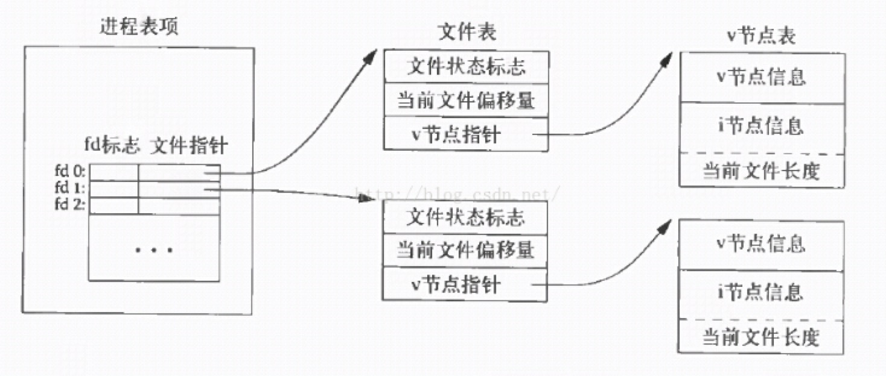
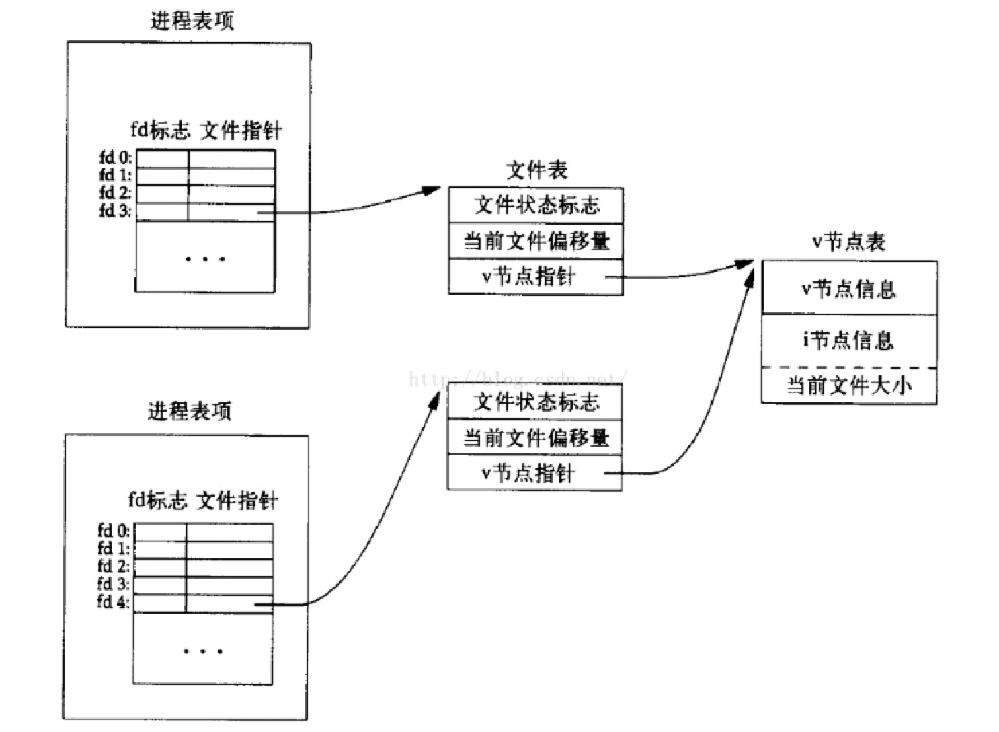
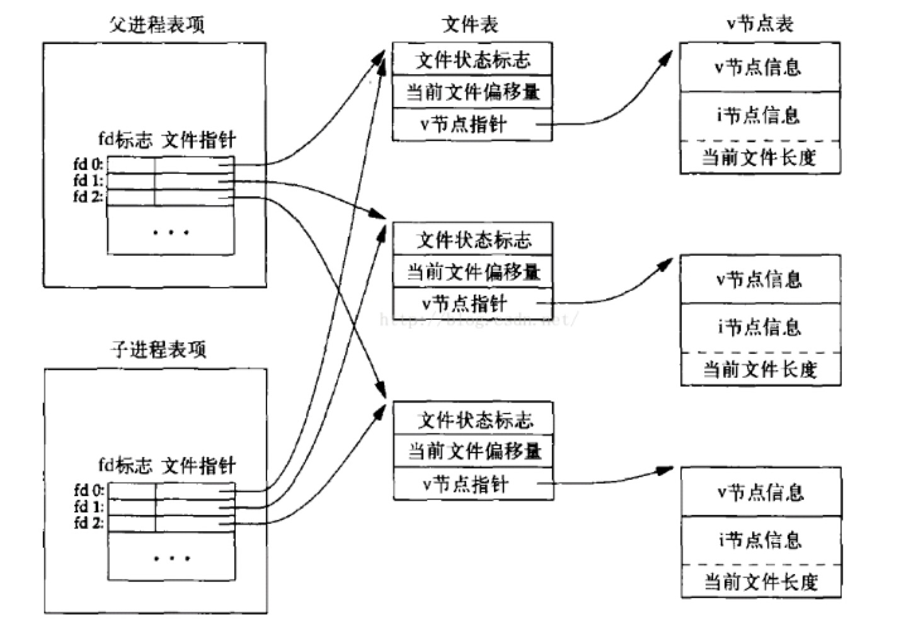

# Linux GLIBC

## open()

open 函数可以打开或创建一个文件。返回值：成功返回新分配的文件描述符名，出错返回-1 并设置 errno。

```cpp
#include <sys/types.h>
#include <sys/stat.h>
#include <fcntl.h>
int open(const char *pathname, int flags);
int open(const char *pathname, int flags, mode_t mode);
```

在 Man Page 中 open 函数有两种形式，一种带两个参数，一种带三个参数。其实在 C 代码中 open 函数是这样声明的：

```cpp
int open(const char *pathname, int flags, ...);
```

最后的可变参数可以是 0 个或 1 个，由 flags 参数中的标志位决定。pathname 参数是要打开或创建的文件名，pathname 既可以是相对路径也可以是绝对路径。flags 参数有一系列常数值可供选择，可以同时选择多个常数用按位或运算符连接起来，所以这些常数的宏定义都以 O_ 开头，表示 or。

必选项：以下三个常数中必须指定一个，且仅允许指定一个。

>- O_RDONLY 只读打开
>- O_WRONLY 只写打开
>- O_RDWR  可读可写打开

可选项：以下可选项可以同时指定 0 个或多个，与必选项按位或作为 flags 参数。

>- O_APPEND 追加。如果文件已有内容，这次打开文件所写的数据附加到文件的末尾而不覆盖原来的内容。
>- O_CREAT 若此文件不存在则创建它。使用此选项时需要提供第三个参数 mode，表示该文件的访问权限。
>- O_EXCL 如果同时指定了 O_CREAT，并且文件已存在则出错返回。
>- O_TRUNC 如果文件已存在，并以只写或可读可写方式打开，则将其长度截断 (Truncate) 为 0 字节。
>- O_NONBLOCK 对于设备文件，以 O_NONBLOCK 方式打开可以做非阻塞 I/O(Nonblock I/O)。

## access()

确定文件或文件夹的访问权限。即检查某个文件的存取方式，比如说是只读方式、只写方式等。如果指定的存取方式有效，则函数返回 0，否则函数返回-1。

```cpp
int access(const char *filenpath, int mode);

int _access(const char *path, int mode);
```

filepath 是文件或文件夹的路径。

注意：当该参数为文件的时候，access 函数能使用 mode 参数所有的值，当该参数为文件夹的时候，access 函数值能判断文件夹是否存在。在 WIN NT 中，所有的文件夹都有读和写权限。

mode 是要判断的模式。

>- R_OK 只判断是否有读权限
>- W_OK 只判断是否有写权限
>- X_OK 判断是否有执行权限
>- F_OK 只判断是否存在

## fotk()

系统建立 IPC 通讯（消息队列、信号量和共享内存）时必须指定一个 ID 值。通常情况下，该 id 值通过 ftok 函数得到。

```cpp
key_t ftok(const char *filename, int proj_id)
```

filename 是指定的文件名，这个文件必须是存在的而且可以访问的。id 是子序号（0-255）。当函数执行成功，则会返回 key_t 键值，否则返回-1。在一般的 UNIX 中，通常是将文件的索引节点取出，然后在前面加上子序号就得到 key_t 的值。proj_id 是可以根据自己的约定，随意设置。

注意：要确保 key 值不变，要么确保 ftok() 的文件不被删除，要么不用 ftok()，指定一个固定的 key 值。

## unlink()

删除一个文件的目录项并减少它的链接数，若成功则返回 0，否则返回-1，错误原因存于 error。如果想通过调用这个函数来成功删除文件，就必须拥有这个文件的所属目录的写和执行权限。

```cpp
int unlink(const char *pathname);
```

unlink 函数删除目录项，并且减少一个链接数。如果链接数达到 0 并且没有任何进程打开该文件，该文件内容才被真正删除。如果在 unlilnk 之前没有 close，那么依旧可以访问文件内容。

## kill()

```c
#include <sys/types.h>
#include <signal.h>

int kill(pid_t pid, int sig);

// Feature Test Macro Requirements for glibc (see feature_test_macros(7)):

kill(): _POSIX_C_SOURCE
```

kill() 系统调用用于向进程 / 进程组发送信号。pid>0 表示信号发送至指定的进程；pid=0 表示信号发送至调用进程坐在进程组中的所有进程（不包括 process 0 和 1）；pid=-1 表示信号发送至调用进程拥有权限访问的所有进程（不包括 process 0 和 1）；pid<-1 表示信号发送至进程组 ID 为-pid 的进程组中所有进程。如果 sig=0 则不发送任何信号，而是检查 existence 和 permission，这通常用于调用进程对于指定进程 / 进程组是否具有权限或者检查进程 / 进程组是否存在。

调用成功返回 0，否则返回 1 并设置 errno。EINVAL 表示 sig 不合法，EPERM 表示调用进程权限不足，ESRCH 表示指定的进程 / 进程组不存在。注意僵尸进程也是存在的进程，只是尚未被 wait()/waitpid() 回收。

## malloc()/calloc()/realloc()

```c
// num_byte 为要申请的空间大小，申请的内存未经过初始化
// eg int *p = (int *)malloc(20 * sizeof(int));
void *malloc(unsigned int num_bytes);

// 比 malloc 函数多一个参数，无需计算空间的大小
// 申请的内存被初始化为 0，因此存在效率问题
// int *p = (int *)calloc(20, sizeof(int));
void *calloc(size_t n, size_t size);

// 用于对动态内存进行扩容
// ptr 为指向原来空间基址的指针， new_size 为接下来需要扩充容量的大小
// 如果可以在原有地址后扩充，则返回原地址；如果不足则会重新申请内存，并拷贝原有内容；扩充失败返回 nullptr，原有内容不变
// 如果扩容后的内存空间较原空间小，则会出现数据丢失，realloc(p, 0) 会释放原有内存并返回 nullptr
void realloc(void *ptr, size_t new_Size);
// 返回值可能与 ptr 的值不同，如果是不同的话，那么 realloc 函数完成后，ptr 指向的旧内存已被 free 掉了。如果返回 NULL 值，则分配不成功，而原来的 ptr 指向的内存还没有被 free 掉，要求程序显式 free。
```

## fork() 与多线程

在多线程执行的情况下调用 fork() 函数，仅会将发起调用的线程复制到子进程中。（子进程中该线程的 ID 与父进程中发起 fork() 调用的线程 ID 是一样的，因此，线程 ID 相同的情况有时我们需要做特殊的处理。）也就是说不能同时创建出于父进程一样多线程的子进程。其他线程均在子进程中立即停止并消失，并且不会为这些线程调用清理函数以及针对线程局部存储变量的析构函数。

虽然只将发起 fork() 调用的线程复制到子进程中，但全局变量的状态以及所有的 pthreads 对象（如互斥量、条件变量等）都会在子进程中得以保留，这就造成一个危险的局面。例如：一个线程在 fork() 被调用前锁定了某个互斥量，且对某个全局变量的更新也做到了一半，此时 fork() 被调用，所有数据及状态被拷贝到子进程中，那么子进程中对该互斥量就无法解锁（因为其并非该互斥量的属主），如果再试图锁定该互斥量就会导致死锁，这是多线程编程中最不愿意看到的情况。同时，全局变量的状态也可能处于不一致的状态，因为对其更新的操作只做到了一半对应的线程就消失了。fork() 函数被调用之后，子进程就相当于处于 signal handler 之中，此时就不能调用线程安全的函数（用锁机制实现安全的函数），除非函数是可重入的，而只能调用异步信号安全（async-signal-safe）的函数。

fork() 之后，子进程不能调用：malloc(3)。因为 malloc() 在访问全局状态时会加锁。任何可能分配或释放内存的函数，包括 new、map::insert()、snprintf()。任何 pthreads 函数。你不能用 pthread_cond_signal() 去通知父进程，只能通过读写 pipe(2) 来同步。printf() 系列函数，因为其他线程可能恰好持有 stdout/stderr 的锁。除了 man 7 signal 中明确列出的 signal 安全函数之外的任何函数。

因为并未执行清理函数和针对线程局部存储数据的析构函数，所以多线程情况下可能会导致子进程的内存泄露。另外，子进程中的线程可能无法访问（父进程中）由其他线程所创建的线程局部存储变量，因为（子进程）没有任何相应的引用指针。

由于这些问题，推荐在多线程程序中调用 fork() 的唯一情况是：其后立即调用 exec() 函数执行另一个程序，彻底隔断子进程与父进程的关系。由新的进程覆盖掉原有的内存，使得子进程中的所有 pthreads 对象消失。

对于那些必须执行 fork()，而其后又无 exec() 紧随其后的程序来说，pthreads API 提供了一种机制：fork() 处理函数。利用函数 pthread_atfork() 来创建 fork() 处理函数。pthread_atfork() 声明如下：

```cpp
#include <pthread.h>
// Upon successful completion, pthread_atfork() shall return a value of zero; otherwise, an error number shall be returned to indicate the error.
// @prepare 新进程产生之前被调用
// @parent  新进程产生之后在父进程被调用
// @child    新进程产生之后，在子进程被调用
int pthread_atfork (void (*prepare) (void), void (*parent) (void), void (*child) (void));
```

该函数的作用就是往进程中注册三个函数，以便在不同的阶段调用，有了这三个参数，我们就可以在对应的函数中加入对应的处理功能。同时需要注意的是，每次调用 pthread_atfork() 函数会将 prepare 添加到一个函数列表中，创建子进程之前会（按与注册次序相反的顺序）自动执行该函数列表中函数。parent 与 child 也会被添加到一个函数列表中，在 fork() 返回前，分别在父子进程中自动执行（按注册的顺序）。

fork() 函数的调用会导致在子进程中除调用线程外的其它线程全都终止执行并消失，因此在多线程的情况下会导致死锁和内存泄露的情况。在进行多线程编程的时候尽量避免 fork() 的调用，同时在程序在进入 main 函数之前应避免创建线程，因为这会影响到全局对象的安全初始化。线程不应该被强行终止，因为这样它就没有机会调用清理函数来做相应的操作，同时也就没有机会来释放已被锁住的锁，如果另一线程对未被解锁的锁进行加锁，那么将会立即发生死锁，从而导致程序无法正常运行。

## 进程 / 线程绑定 CPU

cpu 亲和性（affinity）

CPU 的亲和性， 就是进程要在指定的 CPU 上尽量长时间地运行而不被迁移到其他处理器，也称为 CPU 关联性；再简单的点的描述就将指定的进程或线程绑定到相应的 cpu 上；在多核运行的机器上，每个 CPU 本身自己会有缓存，缓存着进程使用的信息，而进程可能会被 OS 调度到其他 CPU 上，这样的话 CPU cache 命中率就低了，当绑定 CPU 后，程序就会一直在指定的 cpu 跑，不会由操作系统调度到其他 CPU 上，性能有一定的提高。

软亲和性（affinity）就是进程要在指定的 CPU 上尽量长时间地运行而不被迁移到其他处理器，Linux 内核进程调度器天生就具有被称为软 CPU 亲和性（affinity） 的特性，这意味着进程通常不会在处理器之间频繁迁移。这种状态正是我们希望的，因为进程迁移的频率小就意味着产生的负载小。

硬亲和性（affinity）简单来说就是利用 linux 内核提供给用户的 API，强行将进程或者线程绑定到某一个指定的 cpu 核运行。

```c
void CPU_ZERO (cpu_set_t *set)　　
/* 这个宏对 CPU 集 set 进行初始化，将其设置为空集。*/
void CPU_SET (int cpu, cpu_set_t *set)　　
/* 这个宏将 指定的 cpu 加入 CPU 集 set 中 */
void CPU_CLR (int cpu, cpu_set_t *set)　　
/* 这个宏将 指定的 cpu 从 CPU 集 set 中删除。*/
int CPU_ISSET (int cpu, const cpu_set_t *set)　　
/* 如果 cpu 是 CPU 集 set 的一员，这个宏就返回一个非零值（true），否则就返回零（false）。*/
```

```c
#include <sched.h>
/* 该函数设置进程为 pid 的这个进程，让它运行在 mask 所设定的 CPU 上。
如果 pid 的值为 0，则表示指定的是当前进程，使当前进程运行在 mask 所设定的那些 CPU 上。
第二个参数 cpusetsize 是 mask 所指定的数的长度，通常设定为 sizeof(cpu_set_t)。
如果当前 pid 所指定的进程此时没有运行在 mask 所指定的任意一个 CPU 上，
则该指定的进程会从其它 CPU 上迁移到 mask 的指定的一个 CPU 上运行。*/
int sched_setaffinity(pid_t pid, size_t cpusetsize, const cpu_set_t *mask);
/* 该函数获得 pid 所指示的进程的 CPU 位掩码，并将该掩码返回到 mask 所指向的结构中。
即获得指定 pid 当前可以运行在哪些 CPU 上。如果 pid 的值为 0，也表示的是当前进程。 */
int sched_getaffinity(pid_t pid, size_t cpusetsize, const cpu_set_t *mask);

// 示例
#define _GNU_SOURCE
#include <errno.h>
#include <sched.h>
#include <stdio.h>
#include <stdlib.h>
#include <string.h>
#include <unistd.h>

/* sysconf( _SC_NPROCESSORS_CONF ) 查看 cpu 的个数；打印用 %ld 长整。
 * sysconf( _SC_NPROCESSORS_ONLN ) 查看在使用的 cpu 个数；打印用 %ld 长整 */
int main(int argc, char **argv) {
    int cpus = 0;
    int i = 0;
    cpu_set_t mask;
    cpu_set_t get;

    cpus = sysconf(_SC_NPROCESSORS_CONF);
    printf("cpus: %d\n", cpus);

    CPU_ZERO(&mask);   /* 初始化 set 集，将 set 置为空 */
    CPU_SET(0, &mask); /* 依次将 0、1、2、3 号 cpu 加入到集合，前提是你的机器是多核处理器 */
    CPU_SET(1, &mask);
    CPU_SET(2, &mask);
    CPU_SET(3, &mask);

    /* 设置 cpu 亲和性（affinity）*/
    if (sched_setaffinity(0, sizeof(mask), &mask) == -1) {
        printf("Set CPU affinity failue, ERROR:%s\n", strerror(errno));
        return -1;
    }
    usleep(1000); /* 让当前的设置有足够时间生效 */

    /* 查看当前进程的 cpu 亲和性 */
    CPU_ZERO(&get);
    if (sched_getaffinity(0, sizeof(get), &get) == -1) {
        printf("get CPU affinity failue, ERROR:%s\n", strerror(errno));
        return -1;
    }

    /* 查看运行在当前进程的 cpu*/
    for (i = 0; i < c
        if (CPU_ISSET(i, &get)) { /* 查看 cpu i 是否在 get 集合当中 */
            printf("this process %d of running processor: %d\n", getpid(), i);
        }
    }
    sleep(10); // 让程序停在这儿，方便 top 命令查看

    return 0;
}
```

## 获取时间

在 x86-64 的 Linux 上，gettimeofday() 不是系统调用，不会陷入内核。其实这种说法有点小问题，因为 gettimeofday() 确实是个系统调用，但是 linux 的 vdso（virtual dynamic shared object）机制帮我们做到了在调用这些系统调用时不陷入内核，从而提高了性能。

vdso 机制说白了就是在用户空间帮我们实现了一些特定的系统调用，用户进程启动时这些代码会被自动映射到进程地址空间的用户空间中。这样的话，当我们利用 vdso 调用到这些系统调用时，就不会陷入内核了。如何调用到这些代码呢？直接调用这些系统调用对应的 libc 包装函数就可以，因为这些 libc 包装函数默认会使用 vdso。如果你执意通过 syscall 函数 /syscall 指令 /int 0x80 来调用这些系统调用，vdso 是无法生效的，还是会陷入内核。

当然 vdso 也不保证一定不会陷入内核，有些情况下是会 fallback 的，以 clock_gettime() 为例，下面是 linux 4.16 版本中该系统调用在 vdso 中的实现：

```cpp
notrace int __vdso_clock_gettime(clockid_t clock, struct timespec *ts)
{
    switch (clock) {
    case CLOCK_REALTIME:
        if (do_realtime(ts) == VCLOCK_NONE)
            goto fallback;
        break;
    case CLOCK_MONOTONIC:
        if (do_monotonic(ts) == VCLOCK_NONE)
            goto fallback;
        break;
    case CLOCK_REALTIME_COARSE:
        do_realtime_coarse(ts);
        break;
    case CLOCK_MONOTONIC_COARSE:
        do_monotonic_coarse(ts);
        break;
    default:
        goto fallback;
    }

    return 0;
fallback:
    return vdso_fallback_gettime(clock, ts);
}
```

其中 do_realtime 和 do_monotonic 如果返回值为 VCLOCK_NONE 的话，就会调用 vdso_fallback_gettime，而这个函数是会陷入内核的。另外，clock_gettime 的 clock 参数可不止上面代码中 switch 里面的 4 个 case，如果我们传入的是 CLOCK_BOOTTIME/CLOCK_PROCESS_CPUTIME_ID/CLOCK_THREAD_CPUTIME_ID 的话，就会走到 default 分支，还是会调用 vdso_fallback_gettime 陷入内核。而 CLOCK_REALTIME_COARSE/CLOCK_MONOTONIC_COARSE 分支则总不会陷入内核。

综上所诉，gettimeofday 和 clock_gettime 实际上都是系统调用，但是调用得当的话，可以避免陷入内核，从而提高性能。是否陷入了内核，可以利用 strace 来判断。

```txt
benchmark for POSIX clock sources:
    time (s) => 3 cycles
    ftime (ms) => 54 cycles
    gettimeofday (us) => 42 cycles
    clock_gettime (ns) => 9 cycles (CLOCK_MONOTONIC_COARSE) // A faster but less precise version of CLOCK_MONOTONIC.
    clock_gettime (ns) => 9 cycles (CLOCK_REALTIME_COARSE)  // A  faster  but less precise version of CLOCK_REALTIME.
    clock_gettime (ns) => 42 cycles (CLOCK_MONOTONIC)
    clock_gettime (ns) => 42 cycles (CLOCK_REALTIME)
    clock_gettime (ns) => 173 cycles (CLOCK_MONOTONIC_RAW)
    clock_gettime (ns) => 179 cycles (CLOCK_BOOTTIME)
    clock_gettime (ns) => 349 cycles (CLOCK_THREAD_CPUTIME_ID)
    clock_gettime (ns) => 370 cycles (CLOCK_PROCESS_CPUTIME_ID)
    rdtsc (cycles) => 24 cycles

```

gettimeofday() 可以获得当前系统的时间，是一个绝对值，可以精确到微秒（-6），线程安全。

```c
int gettimeofday ( struct timeval * tv , struct timezone * tz);
// timeval
struct timeval {
    time_t      tv_sec;
    suseconds_t tv_usec;
};
```

clock_gettime() 是在 POSIX1003.1 中增加的，可以精确却道纳秒（-9），线程安全。

```c
int clock_gettime(clockid_t clk_id, struct timespec *tp);

struct timespec {
    time_t  tv_sec;
    long    tv_nsec;
}
```

clockid_t 是确定哪个时钟类型。

>- CLOCK_REALTIME System-wide clock that measures real (i.e., wall-clock) time. Setting this clock requires appropriate privileges. This clock is affected by discontinuous jumps in the system time (e.g., if the system administrator manually changes the clock), and by the incremental adjustments performed by adjtime(3) and NTP.
>- CLOCK_MONOTONIC Clock that cannot be set and represents monotonic time since some unspecified starting point. This clock is not affected by discontinuous jumps in the system time (e.g., if the system administrator manually changes the clock), but is affected by the incremental adjustments performed by adjtime(3) and NTP.
>- CLOCK_MONOTONIC_RAW Similar to CLOCK_MONOTONIC, but provides access to a raw hardware-based time that is not subject to NTP adjustments or the incremental adjustments performed by adjtime(3).
>- CLOCK_BOOTTIME Identical to CLOCK_MONOTONIC, except it also includes any time that the system is suspended. This allows applications to get a suspend-aware monotonic clock without having to deal with the complications of CLOCK_REALTIME, which may have discontinuities if the time is changed using settimeofday(2) or similar.
>- CLOCK_PROCESS_CPUTIME_ID Per-process CPU-time clock (measures CPU time consumed by all threads in the process).
>- CLOCK_THREAD_CPUTIME_ID Thread-specific CPU-time clock.

## 文件操作

### 基本概念

内核使用三种数据结构表示打开的文件，它们之间的关系决定了在文件共享方面一个进程对另一个进程可能产生的影响。

1 每个进程在进程表都有一个记录，记录项中包含有一张打开文件描述符表，与文件描述符相关联的是：

>- a) 文件描述符标志
>- b) 指向一个文件表项的指针，父子进程共享一个文件表项

2 内核为所有打开文件维持一张文件表，每个文件表项包括：

>- a) 文件状态标志 (读、写、同步、非阻塞等)
>- b) 当前文件偏移量
>- c) 指向该文件 v 节点表项的指针

3 每个打开文件都有一个 v 节点结构，包含了文件的所有者，文件长度，文件所在设备等信息。当多个进程同时修改一个文件时，通过 v 节点结构影响其他进程的读写。

情况一：一个进程打开两个不同的文件



情况二：两个进程打开相同的一个文件



情况三：父子进程打开三个不同的文件



### 创建文件的原子性

O_RDWR: 读写打开
O_CREAT: 若此文件不存在则创建它
O_EXCL: 如果同时指定了 O_CREAT，而文件已经存在则出错。用此可以测试一个文件是否存在，如果不存在则创建此文件，这使测试和创建两者成为一个原子操作。

```cpp
#include <sys/types.h>
#include <sys/stat.h>
#include <fcntl.h>
#include <stdio.h>

int main() {
    int fd = open("./test.log", O_RDWR | O_CREAT | O_EXCL, 0777);
    if (fd == -1) {
        perror("create file fail");
        fd = open("./test.log", O_RDWR);
    } else {
        printf("create file success.\n");
    }
    printf("open file success, fd is %d\n", fd);
    return 0;
}
```

### read()/write() 函数的原子性

read()/write() 函数是系统调用，属于原子操作，当一个文件被多个进程或者多个线程同时操作时，不会出现内容交错的现象。

举个例子：进程 A 向文件 C 写入 "AAAA", 使用语句 write(fd, "AAAA", 4);进程 B 向文件 C 写入 "BBBB", 使用语句 write(fd, "BBBB", 4);文件 C 的内容肯定不会出现 "AABBBBAA" 这种内容交错情况，最终文件 C 的内容只可能为 "AAAABBBB"、"BBBBAAAA"、"BBBB"、"AAAA" 这四种情况。

### read()/write()/lseek() 的关系

每个文件描述符都有一个与其关联的 " 当前文件偏移量 "，它通常是一个非负整数，用以度量从文件开始处计算的字节数。通常读、写操作都是从当前文件偏移量处开始的，并使偏移量增加所读写的字节数。当 open() 一个文件时，除非指定 O_APPEND 选项，否则该偏移量都被设置为 0。

>- read() 操作在成功返回之前，偏移量将增加实际读到的字节数。
>- write() 操作在成功返回之前，偏移量将增加实际写的字节数。
>- lseek() 可以显式地为一个打开文件设置偏移量。

简单来说，对于每个文件描述符都有一个偏移量，read 与 write 共同影响此偏移量，可通过 lseek 来设置。

### 需要考虑数据冲突的情况

假设有一个被打开的文件 C，考虑下面三种情况：

#### 情况 1：多进程单线程

每个进程只打开一个 fd。这种情况下数据冲突的本质是存在多个 fd，每个 fd 指向不同的文件表项，也就是拥有多个不同的文件偏移量，可能会导致不同进程写入文件的数据的相互覆盖。对于 write() 操作，可以通过 open 文件时指定 O_APPEND 选项，那么每次 write() 操作时，内核会在文件末尾追加，不会产生数据被覆盖的问题。比如要实现多进程共写一个日志文件，那么只需要 open() 文件时指定 O_APPEND 选项，就能轻松实现。

```cpp
#include <sys/types.h>
#include <sys/stat.h>
#include <fcntl.h>
#include <stdio.h>

int main() {
    int fd = open("./test.log", O_WRONLY | O_APPEND);
    if (fd == -1) {
        perror("open file fail");
        return -1;
    }
    printf("open file success, fd is %d\n", fd);
    return 0;
}
```

#### 情况 2：单进程多线程，共享 fd

进程只打开一个 fd，线程间共用 fd。这种情况下，只有一个文件表项，也就是只有一个文件偏移量，如果不调用 lseek() 后再调用 read()/write()，那么并没有数据冲突的危险，lseek() 与 read()/write() 是两步操作，并不能做到原子性，可能调用完 lseek()，准备进行读写时，别的线程恰好也调用了 lseek()，这样偏移量就会产生冲突，可以通过线程锁来解决这个问题，同时系统也提供了两个函数来支持 lseek() 与 read()/write() 操作的原子性。

```cpp
#include <unistd.h>

ssize_t pread(int fd, void *buf, size_t count, off_t offset);

ssize_t pwrite(int fd, const void *buf, size_t count, off_t offset);
```

调用 pread 相当于调用 lseek 后调用 read，但是 pread 又与这种顺序调用有下列终于区别：a) 调用 pread 时，无法中断其定位与读操作；b) 不更新当前文件的偏移量。pwrite 与 pread 类似。

#### 情况 3：单进程多线程，不共享 fd

每个线程各打开一个 fd，线程间不共用 fd。这种情况与情况 1 类似，本质也是存在多个 fd，每个 fd 指向不同的文件表项，也就是拥有多个文件偏移量。

## 文件锁的实现：fcntl+flock

```cpp
int fcntl(int fd, int cmd, struct flock* flockptr);
```

fd 是文件描述符，cmd 可以是 F_GETLK、F_SETLK 或 F_SETLKW，flockptr 是一个文件锁的结构体指针。

>- F_GETLK：查看是否有其它进程锁与 flockptr 所描述的冲突，如果存在冲突，则将其信息写到 flockptr。反之只改写 flockptr.l_type 为 F_UNLCK。
>- F_SETLK：设置或清除 flockptr 描述的锁。若跟已有的锁冲突，则返回-1 并将 errno 设置为 EACCES 或者 EAGAIN。
>- F_SETLKW：作用同上。但若有冲突的锁，则阻塞等待直到与其它锁冲突消失或被信号中断。被信号中断返回时，返回-1 并设置 errno 为 EINTR。

```cpp
struct flock {  
    short int l_type;        // F_RDLCK 共享性读锁定，F_WRLCK 独占性写锁定和 F_UNLCK 释放锁定  
    short int l_whence;      // SEEK_SET 文件头 SEEK_CUR 当前位置  SEEK_END 文件末尾  
    __off_t l_start;         // 偏移量，相对于 l_whence 的偏移量
    __off_t l_len;           // 被加锁区间的长度，0 意味着加锁直到 EOF，当文件追加时，追加部分也被加锁
    __pid_t l_pid;           // 当 cmd 为 F_GETLK 时，l_pid 字段，将用对方的进程 pid 填充
}

// 用例
flock lk;  
lk.l_type = F_WRLCK;  
lk.l_whence = SEEK_SET;  
lk.l_start = 0;  
lk.l_len = 0;  
fcntl(fd, F_SETLK, &lk);  // 对文件描述符指向的文件设置互斥锁
```

l_whence 确定文件内部的位置指针从哪开始，l_star 确定从 l_whence 开始的位置的偏移量，两个变量一起确定了文件内的位置指针先所指的位置，即开始上锁的位置，然后 l_len 的字节数就确定了上锁的区域。当 l_len 的值为 0 时，则表示锁的区域从起点开始直至最大的可能位置，就是从 l_whence 和 l_start 两个变量确定的开始位置开始上锁，将开始以后的所有区域都上锁。为了锁整个文件，一般将 l_whence,l_start,l_len 都设为 0。

当文件无锁的时候，任何进程都能上读锁或写锁。读锁是共享锁，写锁是互斥锁。系统在每个文件 vNode 中又一个记录锁链表，链表中元素由四个字段：锁的 flag、锁的起始偏移量（绝对偏移量）、锁的长度（为 0 则代表到文件最后，跟随文件大小变化）、进程 ID 号。fork() 的子进程和父进程具有不同的进程 ID，因此不能继承文件锁。但是 fork 出来的进程可以继承父进程的文件描述符。

当一个文件描述符被复制时（dup()、dup2()、或一个 fcntl() F_DUPFD 操作），新的文件描述符会引用同一个文件锁。

### 注意事项

1. 建议锁：flock 是建议锁，不具有强制性。强制锁会影响到其它进程的读写操作：open、read、write 等。建议锁只会影响其它进程的上锁操作，而不会限制实际的 I/O。建议锁并不强制限制 I/O，因此当所有进程都自觉使用建议锁，并根据建议锁的情况考虑是否读写，才能发挥建议锁的作用。这样些遵循建议锁的进程称为协同进程。

2. 新锁替换老锁：如果一个进程对文件区间已经加锁，后来该进程又企图在同一文件区域再加一把锁，那么新锁将替换老锁，读写锁互相替换也可以。

3. 锁的隐含继承和释放：当一个进程终止时，该进程所建立的锁全部释放。当一个文件描述符关闭时，该进程通过这个描述符可以引用的文件上的所有锁都被释放，因为这些锁都是当前进程设置的。锁在进程挂掉后会自动释放。两个进程互相阻塞等待对方持有的锁，最严重后果是两进程永远阻塞成死锁。如果 A 和 B 分别试图使用 F_SETLKW 对对方持有的文件加锁，则会发生死锁。

4.F_GETLK 不能获取当前进程的锁状态，所以一个进程不能使用 F_GETLK 函数来测试自己是否在文件的某一部分持有一把锁。F_GETLK 命令定义说明，F_GETLK 返回信息指示是否有现存的锁阻止调用进程设置自己的锁。(也就是说，F_GETLK 会尝试加锁，以判断是否有进程阻止自己在设定的区域加锁，如果有就将 l_type 设置为 F_UNLCK，将 l_pid 设置为加锁进程的 PID)。但是由于对于当前进程，新锁替换老锁，所以调用进程决不会阻塞在自己持有的锁上加锁。所以 F_GETLK 命令决不会报告调用进程自己持有的锁。
