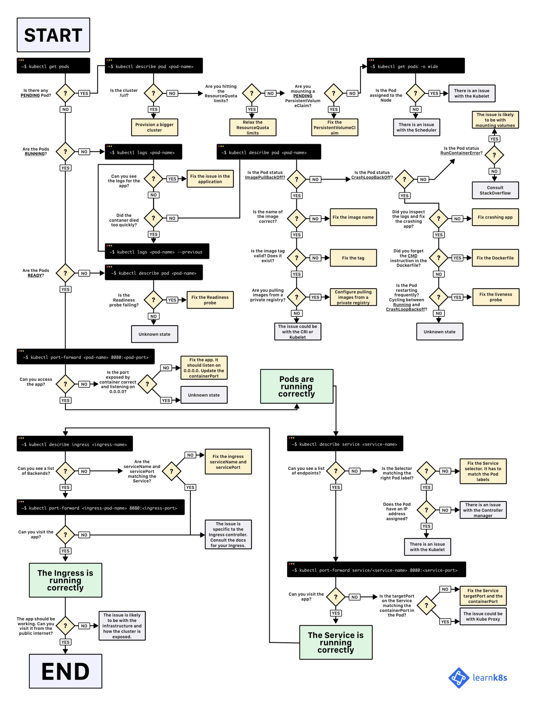

# kubenetes

## 概述

K8S要做的事情：自动化运维管理容器化程序。


K8S: 控制平面（etcd、API Server、Scheduler、Controller） + 工作节点 （Kubelet、kube-proxy、container runtime）+ 附加组件（dns、dashboard、ingress、headpster、etc）。系统组件之间只能通过API Server通信。API Server是与etcd通信的唯一组件，CLI交互也是在与API Server通信。

控制平面的组件可以简单的分布在多台服务器上，还可以有多个实例保证高可用。etcd和API Server可以多个实例同时工作，Scheduler、Controller只能有一个运行。控制平面组件和kube-proxy可以直接部署在系统上或者作为pod运行，Kubelet是唯一一直作为常规系统组件运行的组件，它把其他组件都作为pod运行。为了将控制平面作为pod运行，Kubelet被部署在Master节点。


K8S是属于主从设备模型（Master-Slave架构），Master节点负责核心的调度、管理和运维，Slave节点则在执行用户的程序。K8S中，主节点一般被称为Master Node或者Head Node，从节点则被称为Worker Node或者Node。

Master Node和Worker Node是分别安装了K8S的Master和Woker组件的实体服务器，每个Node都对应了一台实体服务器（Master Node可以和其中一个Worker Node安装在同一台服务器），所有Master Node和Worker Node组成了K8S集群，同一个集群可能存在多个Master Node和Worker Node。

Master Node组件：

>- API Server。K8S的请求入口服务。API Server负责接收K8S所有请求（来自 UI 界面或者 CLI 命令行工具），然后，API Server根据用户的具体请求，去通知其他组件干活。
>- Scheduler。K8S所有Worker Node的调度器。当用户要部署服务时，Scheduler会选择最合适的Worker Node来部署。
>- Controller Manager。K8S所有Worker Node的监控器。Controller Manager有很多具体的 Controller（Node Controller、Service Controller、Volume Controller等）。Controller负责监控和调整在Worker Node上部署的服务的状态，比如用户要求A服务部署2个副本，那么当其中一个服务挂了的时候，相应的Controller会马上调整，让Scheduler再选择一个Worker Node重新部署服务。
>- etcd。K8S的存储服务。etcd存储了K8S的关键配置和用户配置，K8S中仅API Server才具备读写权限，其他组件必须通过API Server的接口才能读写数据。

Worker Node组件：

>- Kubelet。Worker Node的监视器，以及与Master Node的通讯器。Kubelet是Master Node安插在Worker Node上的眼线，它会定期向Worker Node汇报自己Node上运行的服务的状态，并接受来自Master Node的指示采取调整措施。
Kube-Proxy。K8S的网络代理。Kube-Proxy负责Node在K8S的网络通讯、以及对外部网络流量的负载均衡。但是还不够，还需要CNI插件来完善K8S的网络功能。
>- Container Runtime。Worker Node的运行环境。安装了容器化所需的软件环境确保容器化程序能够跑起来，比如 Docker Engine。
>- Logging Layer。K8S的监控状态收集器。Logging Layer负责采集Node上所有服务的CPU、内存、磁盘、网络等监控项信息。
>- Add-On。K8S管理运维Worker Node的插件组件。

总结来看，Master Node具备：请求入口管理（API Server），Worker Node 调度（Scheduler），监控和自动调节（Controller Manager），以及存储功能（etcd）；Worker Node具备：状态和监控收集（Kubelet），网络和负载均衡（Kube-Proxy）、保障容器化运行环境（Container Runtime）、以及定制化功能（Add-Ons）。

## kubectl

Kubectl是一个命令行接口，用于对Kubernetes集群运行命令。Kubectl的配置文件在$HOME/.kube 目录。可以通过设置KUBECONFIG环境变量或设置命令参数--kubeconfig来指定其他位置的kubeconfig文件。基本语法`kubectl [command] [TYPE] [NAME] [flags]`。

>- `command`：指定要对一个或多个资源执行的操作，例如create、get、describe、delete。
>- `TYPE`：指定资源类型。资源类型不区分大小写，可以指定单数、复数或缩写形式。
>- `NAME`：指定资源的名称。名称区分大小写。如果省略名称，则显示所有资源的详细信息。

kubectl是K8S的命令行工具，并不需要kubectl安装在K8S集群的任何Node上，但需要确保安装kubectl的机器和K8S的集群能够进行网络互通。kubectl通过本地的配置文件来连接到K8S集群的，默认保存在`$HOME/.kube`目录下；也可以通过KUBECONFIG环境变量或设置命令参数--kubeconfig来指定其他位置的kubeconfig文件。都没有的话，则会读取`$HOME/.kube/config`文件。但凡某一步找到了有效的cluster，就中断检查，去连接 K8S 集群了。

## 安装运行

### minikube：单节点开发集群

[minikube](https://minikube.sigs.k8s.io/docs/start/)

```shell
# 启动集群
minikube start --cache-images=true --cpus=4 --memory=8192m --image-mirror-country=cn --image-repository=registry.cn-hangzhou.aliyuncs.com/google_containers

# 网页查看
minikube dashboard
```

### kubeadm：高可用集群部署

```shell
# install docker
sudo apt-get update
sudo apt-get -y install apt-transport-https ca-certificates curl software-properties-common
curl -fsSL https://mirrors.aliyun.com/docker-ce/linux/ubuntu/gpg | sudo apt-key add -
sudo add-apt-repository "deb [arch=amd64] https://mirrors.aliyun.com/docker-ce/linux/ubuntu $(lsb_release -cs) stable"

sudo apt-get -y update
sudo apt-get -y install docker-ce

# 安装指定版本的Docker-CE
# Step 1: 查找Docker-CE的版本:
# sudo apt-cache madison docker-ce
# Step 2: 安装指定版本的Docker-CE
# sudo apt-get -y install docker-ce=17.03.1~ce-0~ubuntu-xenial

# /etc/docker/daemon.json配置cgroupdriver
sudo vim etc/docker/daemon.json
# {
#     "exec-opts": [
#         "native.cgroupdriver=systemd"
#     ]
# }

# 安装 kubelet kubeadm kubectl
sudo apt-get update && sudo apt-get install -y apt-transport-https
curl https://mirrors.aliyun.com/kubernetes/apt/doc/apt-key.gpg | sudo apt-key add -

sudo vim /etc/apt/sources.list.d/kubernetes.list 
# deb https://mirrors.aliyun.com/kubernetes/apt/ kubernetes-xenial main

sudo apt-get update && sudo apt-get install -y kubelet=1.18.5-00 kubeadm=1.18.5-00 kubectl=1.18.5-00

# 关闭swap分区
sudo sed -i '/ swap / s/^\(.*\)$/#\1/g' /etc/fstab # 永久 需要重启

# 关闭防火墙
sudo ufw status
sudo ufw disable

# 配置主机名
sudo hostnamectl set-hostname k8s-master
sudo hostnamectl set-hostname k8s-node01
sudo hostnamectl set-hostname k8s-node02
...

# 写入hosts
sudo vim /etc/hosts 
192.168.4.34 k8s-master
192.168.4.35 k8s-node01
192.168.4.36 k8s-node02
...

# 配置网桥 
sudo vim /etc/sysctl.d/k8s.conf
net.bridge.bridge-nf-call-ip6tables = 1
net.bridge.bridge-nf-call-iptables = 1

sudo sysctl --system

# master节点pod-network-cidr不能和主机地址冲突
kubeadm init \
--apiserver-advertise-address=192.168.40.137 \
--image-repository registry.aliyuncs.com/google_containers \
--pod-network-cidr=10.244.0.0/16 --kubernetes-version v1.18.5

# 有Error解决，没有的话按照提示拷贝配置文件和添加节点的命令，在node节点上运行

# 坑爹问题：/etc/resolve.conf中存在 nameserver 127.0.0.53回环地址造成循环引用 手动修改无果，每次重启依旧会覆盖

sudo systemctl stop systemd-resolved
sudo systemctl disable systemd-resolved

sudo vim /etc/resolv.conf
# nameserver 114.114.114.114
# nameserver 8.8.8.8

sudo apt install unbound
sudo vim  /etc/NetworkManager/NetworkManager.conf
# [main]
# dns=unbound

sudo reboot
cat /etc/resolv.conf
```

### 查看集群

```shell
# 集群信息
$ kubectl cluster-info
Kubernetes master is running at https://127.0.0.1:49153
KubeDNS is running at https://127.0.0.1:49153/api/v1/namespaces/kube-system/services/kube-dns:dns/proxy

# 查看集群节点
$ kubectl get nodes
NAME       STATUS   ROLES                  AGE   VERSION
minikube   Ready    control-plane,master   17h   v1.20.0

# 查看集群健康状态
# 如果scheduler和controller不正常，则修改/etc/kubernetes/manifests
# 目录下的kube-controller-manager.yaml与kube-scheduler.yaml
# 注释掉`- --port=0`
$ kubectl get cs
Warning: v1 ComponentStatus is deprecated in v1.19+
NAME                 STATUS    MESSAGE             ERROR
scheduler            Healthy   ok                  
controller-manager   Healthy   ok                  
etcd-0               Healthy   {"health":"true"}   

# 查看资源
$ kubectl api-resources
NAME                              SHORTNAMES   APIVERSION                             NAMESPACED   KIND
bindings                                       v1                                     true         Binding
componentstatuses                 cs           v1                                     false        ComponentStatus
configmaps                        cm           v1                                     true         ConfigMap
endpoints                         ep           v1                                     true         Endpoints
events                            ev           v1                                     true         Event
limitranges                       limits       v1                                     true         LimitRange
namespaces                        ns           v1                                     false        Namespace
nodes                             no           v1                                     false        Node
persistentvolumeclaims            pvc          v1                                     true         PersistentVolumeClaim
persistentvolumes                 pv           v1                                     false        PersistentVolume
pods                              po           v1                                     true         Pod
podtemplat es                                  v1                                     true         PodTemplate
replicationcontrollers            rc           v1                                     true         ReplicationController
resourcequotas                    quota        v1                                     true         ResourceQuota
secrets                                        v1                                     true         Secret
serviceaccounts                   sa           v1                                     true         ServiceAccount
services                          svc          v1                                     true         Service
mutatingwebhookconfigurations                  admissionregistration.k8s.io/v1        false        MutatingWebhookConfiguration
validatingwebhookconfigurations                admissionregistration.k8s.io/v1        false        ValidatingWebhookConfiguration
customresourcedefinitions         crd,crds     apiextensions.k8s.io/v1                false        CustomResourceDefinition
apiservices                                    apiregistration.k8s.io/v1              false        APIService
controllerrevisions                            apps/v1                                true         ControllerRevision
daemonsets                        ds           apps/v1                                true         DaemonSet
deployments                       deploy       apps/v1                                true         Deployment
replicasets                       rs           apps/v1                                true         ReplicaSet
statefulsets                      sts          apps/v1                                true         StatefulSet
tokenreviews                                   authentication.k8s.io/v1               false        TokenReview
localsubjectaccessreviews                      authorization.k8s.io/v1                true         LocalSubjectAccessReview
selfsubjectaccessreviews                       authorization.k8s.io/v1                false        SelfSubjectAccessReview
selfsubjectrulesreviews                        authorization.k8s.io/v1                false        SelfSubjectRulesReview
subjectaccessreviews                           authorization.k8s.io/v1                false        SubjectAccessReview
horizontalpodautoscalers          hpa          autoscaling/v1                         true         HorizontalPodAutoscaler
cronjobs                          cj           batch/v1beta1                          true         CronJob
jobs                                           batch/v1                               true         Job
certificatesigningrequests        csr          certificates.k8s.io/v1                 false        CertificateSigningRequest
leases                                         coordination.k8s.io/v1                 true         Lease
bgpconfigurations                              crd.projectcalico.org/v1               false        BGPConfiguration
bgppeers                                       crd.projectcalico.org/v1               false        BGPPeer
blockaffinities                                crd.projectcalico.org/v1               false        BlockAffinity
clusterinformations                            crd.projectcalico.org/v1               false        ClusterInformation
felixconfigurations                            crd.projectcalico.org/v1               false        FelixConfiguration
globalnetworkpolicies             gnp          crd.projectcalico.org/v1               false        GlobalNetworkPolicy
globalnetworksets                              crd.projectcalico.org/v1               false        GlobalNetworkSet
hostendpoints                                  crd.projectcalico.org/v1               false        HostEndpoint
ipamblocks                                     crd.projectcalico.org/v1               false        IPAMBlock
ipamconfigs                                    crd.projectcalico.org/v1               false        IPAMConfig
ipamhandles                                    crd.projectcalico.org/v1               false        IPAMHandle
ippools                                        crd.projectcalico.org/v1               false        IPPool
kubecontrollersconfigurations                  crd.projectcalico.org/v1               false        KubeControllersConfiguration
networkpolicies                                crd.projectcalico.org/v1               true         NetworkPolicy
networksets                                    crd.projectcalico.org/v1               true         NetworkSet
endpointslices                                 discovery.k8s.io/v1beta1               true         EndpointSlice
events                            ev           events.k8s.io/v1                       true         Event
ingresses                         ing          extensions/v1beta1                     true         Ingress
flowschemas                                    flowcontrol.apiserver.k8s.io/v1beta1   false        FlowSchema
prioritylevelconfigurations                    flowcontrol.apiserver.k8s.io/v1beta1   false        PriorityLevelConfiguration
ingressclasses                                 networking.k8s.io/v1                   false        IngressClass
ingresses                         ing          networking.k8s.io/v1                   true         Ingress
networkpolicies                   netpol       networking.k8s.io/v1                   true         NetworkPolicy
runtimeclasses                                 node.k8s.io/v1                         false        RuntimeClass
poddisruptionbudgets              pdb          policy/v1beta1                         true         PodDisruptionBudget
podsecuritypolicies               psp          policy/v1beta1                         false        PodSecurityPolicy
clusterrolebindings                            rbac.authorization.k8s.io/v1           false        ClusterRoleBinding
clusterroles                                   rbac.authorization.k8s.io/v1           false        ClusterRole
rolebindings                                   rbac.authorization.k8s.io/v1           true         RoleBinding
roles                                          rbac.authorization.k8s.io/v1           true         Role
priorityclasses                   pc           scheduling.k8s.io/v1                   false        PriorityClass
csidrivers                                     storage.k8s.io/v1                      false        CSIDriver
csinodes                                       storage.k8s.io/v1                      false        CSINode
storageclasses                    sc           storage.k8s.io/v1                      false        StorageClass
volumeattachments                              storage.k8s.io/v1                      false        VolumeAttachment
```

添加自动补全。

```shell
# Bash
source <(kubectl completion bash)
kubectl completion bash > ~/.kube/completion.bash.inc
printf "
# Kubectl shell completion
source '$HOME/.kube/completion.bash.inc'
" >> $HOME/.bash_profile
source $HOME/.bash_profile

# Zsh
# vim ~/.zshrc
source <(kubectl completion zsh)
kubectl completion zsh > "${fpath[1]}/_kubectl"
```

## 工作上下文

kubeconfig文件由一组上下文组成。上下文包含以下三个元素：集群(cluster)：集群的API服务器的URL；用户(user)：集群的特定用户的身份验证凭据；命名空间(namespace)：连接到集群时使用的命名空间。在任何给定时间，其中一个上下文被设置为当前上下文（通过kubeconfig文件中的专用字段）。

kubectl会优先检查--kubeconfig，若无则检查KUBECONFIG，若无则最后检查`$HOME/.kube/config`，如果还是没有则报错。但凡某一步找到了有效的cluster，就中断检查，去连接集群了。如果配置文件只有一个cluster是没有任何问题的，但是对于有多个cluster怎么办呢？

```shell
# 列出所有上下文信息
kubectl config get-contexts

# 查看当前的上下文信息
kubectl config current-context

# 更改上下文信息
kubectl config use-context ${CONTEXT_NAME}

# 修改上下文的元素。比如可以修改用户账号、集群信息、连接到K8S后所在的namespace
kubectl config set-context ${CONTEXT_NAME}|--current --${KEY}=${VALUE}
```

config set-context可以修改任何在配置文件中的上下文信息，只需要在命令中指定上下文名称就可以。而--current则指代当前上下文。
上下文信息所包括的内容有：cluster集群（名称）、用户账号（名称）、连接到K8S后所在的namespace，因此有config set-context严格意义上的用法：kubectl config set-context [NAME|--current] [--cluster=cluster_nickname] [--user=user_nickname] [--namespace=namespace] [options]（备注：[options]可以通过 kubectl options 查看）

或者使用[Kubectx](https://github.com/ahmetb/kubectx/#installation)快速切换上下文。

## 查看资源

```shell
# Show details of a specific resource or group of resources
# Print a detailed description of the selected resources, including related resources such as events or controllers. You may select a single object by name, all objects of that type, provide a name prefix, or label selector.
kubectl describe (-f FILENAME | TYPE [NAME_PREFIX | -l label] | TYPE/NAME) [options]

# Describe a node
kubectl describe nodes kubernetes-node-emt8.c.myproject.internal

# Describe a pod
kubectl describe pods/nginx

# Describe a pod identified by type and name in "pod.json"
kubectl describe -f pod.json
# 该文件即为创建 pod 使用的描述文件
kubectl describe -f kubia-manual.yaml 

# Describe all pods
kubectl describe pods

# Describe pods by label name=myLabel
kubectl describe po -l name=myLabel
kubectl describe po -l name=kubia-manual

# Describe all pods managed by the 'frontend' replication controller (rc-created pods
# get the name of the rc as a prefix in the pod the name).
kubectl describe pods frontend

# Display one or many resources
# Prints a table of the most important information about the specified resources. You can filter the list using a label selector and the --selector flag. If the desired resource type is namespaced you will only see results in your current namespace unless you pass --all-namespaces.
kubectl get [(-o|--output=)json|yaml|wide|custom-columns=...|custom-columns-file=...|go-template=...|go-template-file=...|jsonpath=...|jsonpath-file=...] (TYPE[.VERSION][.GROUP] [NAME | -l label] | TYPE[.VERSION][.GROUP]/NAME ...) [flags] [options]

# List all pods in ps output format.
kubectl get pods
kubectl get pods --watch

# List all pods in ps output format with more information (such as node name).
kubectl get pods -o wide

# List a single replication controller with specified NAME in ps output format.
kubectl get replicationcontroller web

# List deployments in JSON output format, in the "v1" version of the "apps" API group:
kubectl get deployments.v1.apps -o json

# List a single pod in JSON output format.
kubectl get -o json pod web-pod-13je7
# yaml 格式也可以
kubectl get -o yaml pod kubia-manual

# List a pod identified by type and name specified in "pod.yaml" in JSON output format.
kubectl get -f pod.yaml -o json

# List resources from a directory with kustomization.yaml - e.g. dir/kustomization.yaml.
kubectl get -k dir/

# Return only the phase value of the specified pod.
kubectl get -o template pod/web-pod-13je7 --template={{.status.phase}}

# List resource information in custom columns.
kubectl get pod test-pod -o custom-columns=CONTAINER:.spec.containers[0].name,IMAGE:.spec.containers[0].image

# List all replication controllers and services together in ps output format.
kubectl get rc,services

# List one or more resources by their type and names.
kubectl get rc/web service/frontend pods/web-pod-13je7
```

## 创建资源

```shell
# Create a resource from a file or from stdin.
kubectl create -f FILENAME [options]

# Create a pod using the data in pod.json.
kubectl create -f ./pod.json

# Create a pod based on the JSON passed into stdin.
cat pod.json | kubectl create -f -

# Edit the data in docker-registry.yaml in JSON then create the resource using the edited data.
kubectl create -f docker-registry.yaml --edit -o json
```

## 删除资源

在删除pod的过程中，k8s向进程发送SIGTERM并等待一定时间（默认30s）等待其正常关闭；否则发送SIGKILL终止该进程。删除namespace会删除下辖的所有pod。删除ReplicationController创建的pod会导致rc重建新的pod，此时要删除rc。

```shell
# Delete resources by filenames, stdin, resources and names, or by resources and label selector.
# JSON and YAML formats are accepted. Only one type of the arguments may be specified: filenames, resources and names, or resources and label selector.
kubectl delete ([-f FILENAME] | [-k DIRECTORY] | TYPE [(NAME | -l label | --all)]) [options]

# Delete a pod using the type and name specified in pod.json.
kubectl delete -f ./pod.json

# Delete resources from a directory containing kustomization.yaml - e.g. dir/kustomization.yaml.
kubectl delete -k dir

# Delete a pod based on the type and name in the JSON passed into stdin.
cat pod.json | kubectl delete -f -

# Delete pods and services with same names "baz" and "foo"
kubectl delete pod,service baz foo

# Delete pods and services with label name=myLabel.
kubectl delete pods,services -l name=myLabel

# Delete a pod with minimal delay
kubectl delete pod foo --now

# Force delete a pod on a dead node
kubectl delete pod foo --force

# Delete all pods
kubectl delete pods --all
```

## 标记资源

标签是键值对。如果想添加更复杂的标记，使用注释。

```shell
# Update the labels on a resource.
kubectl label [--overwrite] (-f FILENAME | TYPE NAME) KEY_1=VAL_1 ... KEY_N=VAL_N [--resource-version=version] [options]

# Update pod 'foo' with the label 'unhealthy' and the value 'true'.
kubectl label pods foo unhealthy=true

# Update pod 'foo' with the label 'status' and the value 'unhealthy', overwriting any existing value.
kubectl label --overwrite pods foo status=unhealthy

# Update all pods in the namespace
kubectl label pods --all status=unhealthy

# Update a pod identified by the type and name in "pod.json"
kubectl label -f pod.json status=unhealthy

# Update pod 'foo' only if the resource is unchanged from version 1.
kubectl label pods foo status=unhealthy --resource-version=1

# Update pod 'foo' by removing a label named 'bar' if it exists.
# Does not require the --overwrite flag.
kubectl label pods foo bar-
```

```shell
# 列出所有 pod 的指定标签 没有的话为空
kubectl get pods -L <label-name>
```

## 查看日志

pod删除后这些日志便不可查看

```shell
# Print the logs for a container in a pod or specified resource. If the pod has only one container, the container name is optional.

# Return snapshot logs from pod nginx with only one container
kubectl logs nginx

# Return snapshot logs from pod nginx with multi containers
kubectl logs nginx --all-containers=true

# Return snapshot logs from all containers in pods defined by label app=nginx
kubectl logs -lapp=nginx --all-containers=true

# Return snapshot of previous terminated ruby container logs from pod web-1
# -c 制定了容器名称 web-1 是 pod 名称 一个 pod 中可能运行多个容器
# -p 上一个停止的容器
kubectl logs -p -c ruby web-1

# Begin streaming the logs of the ruby container in pod web-1
# 类似与 tail -f
kubectl logs -f -c ruby web-1

# Begin streaming the logs from all containers in pods defined by label app=nginx
kubectl logs -f -lapp=nginx --all-containers=true

# Display only the most recent 20 lines of output in pod nginx
kubectl logs --tail=20 nginx

# Show all logs from pod nginx written in the last hour
kubectl logs --since=1h nginx

# Show logs from a kubelet with an expired serving certificate
kubectl logs --insecure-skip-tls-verify-backend nginx

# Return snapshot logs from first container of a job named hello
kubectl logs job/hello

# Return snapshot logs from container nginx-1 of a deployment named nginx
kubectl logs deployment/nginx -c nginx-1
```

```shell
# Requires that the 'tar' binary is present in your container
# image.  If 'tar' is not present, 'kubectl cp' will fail.
kubectl cp <file-spec-src> <file-spec-dest> [options]

# Copy /tmp/foo local file to /tmp/bar in a remote pod in namespace <some-namespace>
tar cf - /tmp/foo | kubectl exec -i -n <some-namespace> <some-pod> -- tar xf - -C /tmp/bar

# Copy /tmp/foo from a remote pod to /tmp/bar locally
kubectl exec -n <some-namespace> <some-pod> -- tar cf - /tmp/foo | tar xf - -C /tmp/bar

# Copy /tmp/foo_dir local directory to /tmp/bar_dir in a remote pod in the default namespace
kubectl cp /tmp/foo_dir <some-pod>:/tmp/bar_dir

# Copy /tmp/foo local file to /tmp/bar in a remote pod in a specific container
kubectl cp /tmp/foo <some-pod>:/tmp/bar -c <specific-container>

# Copy /tmp/foo local file to /tmp/bar in a remote pod in namespace <some-namespace>
kubectl cp /tmp/foo <some-namespace>/<some-pod>:/tmp/bar

# Copy /tmp/foo from a remote pod to /tmp/bar locally
kubectl cp <some-namespace>/<some-pod>:/tmp/foo /tmp/bar
```

## 端口转发

一般用于调试

```shell
# Forward one or more local ports to a pod. This command requires the node to have 'socat' installed.
# Use resource type/name such as deployment/mydeployment to select a pod. Resource type defaults to 'pod' if omitted.
kubectl port-forward TYPE/NAME [options] [LOCAL_PORT:]REMOTE_PORT [...[LOCAL_PORT_N:]REMOTE_PORT_N]

# Listen on ports 5000 and 6000 locally, forwarding data to/from ports 5000 and 6000 in the pod
kubectl port-forward pod/mypod 5000 6000

# Listen on ports 5000 and 6000 locally, forwarding data to/from ports 5000 and 6000 in a pod selected by the deployment
kubectl port-forward deployment/mydeployment 5000 6000

# Listen on ports 5000 and 6000 locally, forwarding data to/from ports 5000 and 6000 in a pod selected by the service
kubectl port-forward service/myservice 5000 6000

# Listen on port 8888 locally, forwarding to 5000 in the pod
kubectl port-forward pod/mypod 8888:5000

# Listen on port 8888 on all addresses, forwarding to 5000 in the pod
kubectl port-forward --address 0.0.0.0 pod/mypod 8888:5000

# Listen on port 8888 on localhost and selected IP, forwarding to 5000 in the pod
kubectl port-forward --address localhost,10.19.21.23 pod/mypod 8888:5000

# Listen on a random port locally, forwarding to 5000 in the pod
kubectl port-forward pod/mypod :5000
```

## 基本资源

### POD：K8S管理调度的基本单位

pod中的所有容器共享同一个网络和Linux命名空间。pod中除了用户定义的容器外有一个**基础容器**，基础容器的生命周期和pod绑定，其他容器使用基础容器的命名空间，以此保证容器在重启后命名空间不变。

使用描述文件创建资源。

```yaml
kind: Pod
apiVersion: v1
metadata:
  name: kubia-manual
  labels:
    name: kubia-manual
    env: testing
spec:
  containers:
  - name: kubia-container
    image: luksa/kubia
    resources:
      limits:
        memory: "128Mi"
        cpu: "500m"
    ports:
      - containerPort: 8080
        protocol: TCP
```

标签 labels:name: kubia-manual env: testing。配合标签选择器使用。

```shell
kubectl get pods -l env=testing

$ kubectl get pods -l env=testing -o wide
NAME           READY   STATUS    RESTARTS   AGE   IP           NODE       NOMINATED NODE   READINESS GATES
kubia-manual   1/1     Running   0          96m   172.17.0.3   minikube   <none>           <none>

# 列出包含env标签的所有pod 反向选择使用 '!env' 单引号不可省略
# 同理可以用 env!=tesing / env in (prod,tesing) / env notin (prod,tesing) 等 多个条件使用逗号隔开
kubectl get pods -l env
```

pod死亡意味着每个容器将被关闭，容器关闭方式为：执行停止前钩子->向容器主进程发送SIGTERM信号->等待容器优雅关闭或者等待终止宽限期超时（默认30s）->没有优雅关闭则发送SIGKILL强制终止进程。**终止宽限期从执行停止前钩子时开始计时**。

```shell
# 终止宽限期设置为5s
kubectl delete pod mypod --grace-period=5
# 立即删除 （危险，可能会出现相同pod的两个实例在同一时间运行）
kubectl delete pod mypod --grace-periid=0 --force
```

#### 存活探针

检查容器是否在运行。三种：HTTP GET探针，对容器的IP地址执行HTTP请求，如果响应正常（2xx/3xx）则探测成功。TCP Socket探针，尝试与容器建立连接。Exec探针，在容器内执行命令，检查命令退出状态为0则探测成功。检测失败则会重启容器（删除并创建新的）。

存活探针应当检查应用程序的内部，并保持轻量，且无需再探针中实现重试循环，K8S会自己重复执行。

```yaml
kind: Pod
apiVersion: v1
metadata:
  name: kubia-liveness
  labels:
    app: kubia
spec:
  containers:
  - name: kubia
    image: luksa/kubia-unhealthy
    livenessProbe:
        httpGet:
          path: /
          port: 8080
        # 务必设置初始时延 否则容器没创建好就探测 通常不会成功
        initialDelaySeconds: 15
        # 失败五次则会终止容器并重新创建
        failureThreshold: 5
    resources:
      limits:
        memory: "128Mi"
        cpu: "500m"
    ports:
      - containerPort: 8080
```

```shell
kubectl describe pod kubia-liveness 
Name:         kubia-liveness
Namespace:    default
Priority:     0
Node:         node2/192.168.17.130
Start Time:   Mon, 08 Feb 2021 16:56:29 +0800
Labels:       app=kubia
Annotations:  <none>
Status:       Running
IP:           10.244.1.3
IPs:
  IP:  10.244.1.3
Containers:
  kubia:
    Container ID:   docker://2fcfd43dfa0db950dd4fec24c3396cd9baa02c1c37132e673de8169153637df0
    Image:          luksa/kubia-unhealthy
    Image ID:       docker-pullable://luksa/kubia-unhealthy@sha256:5c746a42612be61209417d913030d97555cff0b8225092908c57634ad7c235f7
    Port:           8080/TCP
    Host Port:      0/TCP
    State:          Running
      Started:      Mon, 08 Feb 2021 16:59:25 +0800
    Last State:     Terminated
      Reason:       Error
      Exit Code:    137
      Started:      Mon, 08 Feb 2021 16:57:04 +0800
      Finished:     Mon, 08 Feb 2021 16:59:23 +0800
    Ready:          True
    Restart Count:  1
    Limits:
      cpu:     500m
      memory:  128Mi
    Requests:
      cpu:        500m
      memory:     128Mi
    Liveness:     http-get http://:8080/ delay=15s timeout=1s period=10s #success=1 #failure=5
    Environment:  <none>
    Mounts:
      /var/run/secrets/kubernetes.io/serviceaccount from default-token-5mljm (ro)
Conditions:
  Type              Status
  Initialized       True 
  Ready             True 
  ContainersReady   True 
  PodScheduled      True 
Volumes:
  default-token-5mljm:
    Type:        Secret (a volume populated by a Secret)
    SecretName:  default-token-5mljm
    Optional:    false
QoS Class:       Guaranteed
Node-Selectors:  <none>
Tolerations:     node.kubernetes.io/not-ready:NoExecute op=Exists for 300s
                 node.kubernetes.io/unreachable:NoExecute op=Exists for 300s
Events:
  Type     Reason     Age                  From               Message
  ----     ------     ----                 ----               -------
  Normal   Scheduled  3m23s                default-scheduler  Successfully assigned default/kubia-liveness to node2
  Normal   Pulled     2m49s                kubelet            Successfully pulled image "luksa/kubia-unhealthy" in 32.6794855s
  Warning  Unhealthy  60s (x5 over 100s)   kubelet            Liveness probe failed: HTTP probe failed with statuscode: 500
  Normal   Killing    60s                  kubelet            Container kubia failed liveness probe, will be restarted
  Normal   Pulling    29s (x2 over 3m21s)  kubelet            Pulling image "luksa/kubia-unhealthy"
  Normal   Created    27s (x2 over 2m48s)  kubelet            Created container kubia
  Normal   Started    27s (x2 over 2m48s)  kubelet            Started container kubia
  Normal   Pulled     27s                  kubelet            Successfully pulled image "luksa/kubia-unhealthy" in 1.994788046s
```

#### 就绪探针

就绪探针会定期调用（默认10s），确定特定的pod是否就绪，准备好接受请求。同样也有三种。如果pod报告其尚未就绪，则会从服务中删除该pod（比如从Endpoint对象中删除），但是不会将其终止或重启（区别于存活探针）。

应当始终定义一个就绪探针。不要将停止pod的逻辑加入就绪探针。当然容器关闭时，就需要让就绪探针失败，这是理所当然但并非必需的，因为只要删除pod，k8s就会从所有服务中移除pod。

```yaml
kind: ReplicaSet
apiVersion: apps/v1
metadata:
  name: kubia-rs
spec:
  replicas: 3
  selector:
    matchLabels:
      app: kubia
  template:
    metadata:
      name: kubia-pod
      labels:
        app: kubia
    spec:
      containers:
        - name: kubia-container
          image: luksa/kubia
          readinessProbe:
              # 通过检查一个文件是否创建来完成探测
              exec:
                command:
                  - ls
                  - /var/ready
          ports:
            - containerPort: 8080
```

```shell
kubectl get pods
NAME             READY   STATUS              RESTARTS   AGE
kubia-rs-l94c5   0/1     ContainerCreating   0          2m51s
kubia-rs-t5jjb   0/1     ContainerCreating   0          2m51s
kubia-rs-tn8kn   0/1     ContainerCreating   0          2m51s

kubectl describe pods kubia-rs-l94c5
Name:         kubia-rs-l94c5
Namespace:    default
Priority:     0
Node:         minikube/192.168.49.2
Start Time:   Mon, 04 Jan 2021 16:58:00 +0800
Labels:       app=kubia
Annotations:  <none>
Status:       Running
IP:           172.17.0.8
IPs:
  IP:           172.17.0.8
Controlled By:  ReplicaSet/kubia-rs
Containers:
  kubia-container:
    Container ID:   docker://e0ff732c683639051a6527bf7da433089dbd8f0910077565190d79ce8071d607
    Image:          luksa/kubia
    Image ID:       docker-pullable://luksa/kubia@sha256:a923320941524f2bb6a3a40bfdaf0acf5da9b3c91748c8dea56514b7bea53e8a
    Port:           8080/TCP
    Host Port:      0/TCP
    State:          Running
      Started:      Mon, 04 Jan 2021 17:01:05 +0800
    Ready:          False
    Restart Count:  0
    Readiness:      exec [ls /var/ready] delay=0s timeout=1s period=10s #success=1 #failure=3
    Environment:    <none>
    Mounts:
      /var/run/secrets/kubernetes.io/serviceaccount from default-token-pbzvp (ro)
Conditions:
  Type              Status
  Initialized       True 
  Ready             False 
  ContainersReady   False 
  PodScheduled      True 
Volumes:
  default-token-pbzvp:
    Type:        Secret (a volume populated by a Secret)
    SecretName:  default-token-pbzvp
    Optional:    false
QoS Class:       BestEffort
Node-Selectors:  <none>
Tolerations:     node.kubernetes.io/not-ready:NoExecute op=Exists for 300s
                 node.kubernetes.io/unreachable:NoExecute op=Exists for 300s
Events:
  Type     Reason     Age    From               Message
  ----     ------     ----   ----               -------
  Normal   Scheduled  3m13s  default-scheduler  Successfully assigned default/kubia-rs-l94c5 to minikube
  Normal   Pulling    3m8s   kubelet            Pulling image "luksa/kubia"
  Normal   Pulled     8s     kubelet            Successfully pulled image "luksa/kubia" in 2m59.018847561s
  Normal   Created    8s     kubelet            Created container kubia-container
  Normal   Started    8s     kubelet            Started container kubia-container
  Warning  Unhealthy  5s     kubelet            Readiness probe failed: ls: cannot access /var/ready: No such file or directory


kubectl exec kubia-rs-l94c5 -- touch /var/ready

# 创建文件后 该pod就绪
kubectl get pods                               
NAME             READY   STATUS    RESTARTS   AGE
kubia-rs-l94c5   1/1     Running   0          6m7s
kubia-rs-t5jjb   0/1     Running   0          6m7s
kubia-rs-tn8kn   0/1     Running   0          6m7s

kubectl describe po  kubia-rs-l94c5 
Name:         kubia-rs-l94c5
Namespace:    default
Priority:     0
Node:         minikube/192.168.49.2
Start Time:   Mon, 04 Jan 2021 16:58:00 +0800
Labels:       app=kubia
Annotations:  <none>
Status:       Running
IP:           172.17.0.8
IPs:
  IP:           172.17.0.8
Controlled By:  ReplicaSet/kubia-rs
Containers:
  kubia-container:
    Container ID:   docker://e0ff732c683639051a6527bf7da433089dbd8f0910077565190d79ce8071d607
    Image:          luksa/kubia
    Image ID:       docker-pullable://luksa/kubia@sha256:a923320941524f2bb6a3a40bfdaf0acf5da9b3c91748c8dea56514b7bea53e8a
    Port:           8080/TCP
    Host Port:      0/TCP
    State:          Running
      Started:      Mon, 04 Jan 2021 17:01:05 +0800
    Ready:          True
    Restart Count:  0
    Readiness:      exec [ls /var/ready] delay=0s timeout=1s period=10s #success=1 #failure=3
    Environment:    <none>
    Mounts:
      /var/run/secrets/kubernetes.io/serviceaccount from default-token-pbzvp (ro)
Conditions:
  Type              Status
  Initialized       True 
  Ready             True 
  ContainersReady   True 
  PodScheduled      True 
Volumes:
  default-token-pbzvp:
    Type:        Secret (a volume populated by a Secret)
    SecretName:  default-token-pbzvp
    Optional:    false
QoS Class:       BestEffort
Node-Selectors:  <none>
Tolerations:     node.kubernetes.io/not-ready:NoExecute op=Exists for 300s
                 node.kubernetes.io/unreachable:NoExecute op=Exists for 300s
Events:
  Type     Reason     Age                  From               Message
  ----     ------     ----                 ----               -------
  Normal   Scheduled  6m17s                default-scheduler  Successfully assigned default/kubia-rs-l94c5 to minikube
  Normal   Pulling    6m12s                kubelet            Pulling image "luksa/kubia"
  Normal   Pulled     3m12s                kubelet            Successfully pulled image "luksa/kubia" in 2m59.018847561s
  Normal   Created    3m12s                kubelet            Created container kubia-container
  Normal   Started    3m12s                kubelet            Started container kubia-container
  Warning  Unhealthy  89s (x11 over 3m9s)  kubelet            Readiness probe failed: ls: cannot access /var/ready: No such file or directory
```

#### init容器

pod包含多个容器，在启动时顺序是不可控的。init容器则可以用与初始化pod，通常意味着向容器写入数据并将这个存储卷挂在到主容器中。init容器的数量是任意的，所有init容器启动执行完毕后才会启动主容器。

```yaml
kind: Pod
apiVersion: v1
metadata:
  name: fortune-client
spec:
  initContainers:
  - name: init
    image: busybox
    command:
    - sh
    - -c
    - 'while true; do echo "Waiting for fortune service to come up..."; wget http://fortune -q -T 1 -O /dev/null >/dev/null 2>/dev/null && break; sleep 1; done; echo "Service is up! Starting main container."'
  containers:
  - image: busybox
    name: main
    command:
    - sh
    - -c
    - 'echo "Main container started. Reading fortune very 10 seconds."; while true; do echo "-------------"; wget -q -O - http://fortune; sleep 10; done'
```

```shell
NAME             READY   STATUS     RESTARTS   AGE
fortune-client   0/1     Init:0/1   0          14s

kubectl get pods
NAME             READY   STATUS     RESTARTS   AGE
fortune-client   0/1     Init:0/1   0          117s
fortune-server   2/2     Running    0          90s

kubectl get pods
NAME             READY   STATUS    RESTARTS   AGE
fortune-client   1/1     Running   0          2m6s
fortune-server   2/2     Running   0          99s

kubectl logs fortune-client -c init
Waiting for fortune service to come up...
Waiting for fortune service to come up...
Waiting for fortune service to come up...
Waiting for fortune service to come up...
Waiting for fortune service to come up...
Waiting for fortune service to come up...
Waiting for fortune service to come up...
Waiting for fortune service to come up...
Waiting for fortune service to come up...
Waiting for fortune service to come up...
Waiting for fortune service to come up...
Service is up! Starting main container.
```

-c 指定 pod 中的容器。

#### 容器生命周期钩子Hook

init容器应用于整个pod，Post-start hook/Pre-stop hook是在容器启动后/停止前执行的。

启动后钩子在容器主进程启动之后立即执行，和主进程是并行的。在钩子之习惯完毕之前，容器停留在waiting状态，其原因是containercreating。因此pod的状态会是pending而不是running，钩子运行失败或者返回了非零状态码，主容器会被杀死。

```yaml
kind: Pod
apiVersion: v1
metadata:
  name: pod-with-poststart-hook
spec:
  containers:
  - image: luksa/kubia
    name: kubia
    lifecycle:
      postStart:
        exec:
          command: 
          - sh
          - -c
          - "echo 'hook will fail with exit code 15'; sleep 5 ; exit 15"
```

典型情况下，poststart hook也是执行container中的shell或者二进制程序。如果钩子程序启动的进程将日志输出到标准输出/标准错误终端，则无法被记录，导致了调试生命周期钩子程序非常困难。如果启动失败，只会看到FailedPostStartHook的告警信息。如果想记录日志，需要挂在一个卷来保留这些信息。

停止前钩子在容器终止前执行，仅当执行完毕后，才会向进程发送SIGTERM信号（没有优雅结束则会被SIGKILL杀死）。

```yaml
kind: Pod
apiVersion: v1
metadata:
  name: pod-with-prestop-hook
spec:
  containers:
  - image: luksa/kubia
    name: kubia
    ports:
    - containerPort: 8080
      protocol: TCP
    lifecycle:
      preStop:
        # 默认的的host地址是pod的ip
        httpGet:
          port: 8080
          path: shutdown
```

无论钩子执行成功与否，容器都会被终止。执行失败也只会看到FailedPreStopHook告警，但不久后pod被删除了，此时就什么都看不到了。

一个常见错误做法是，容器启动了一个shell，shell启动真正的进程，这样shell会收到kubelet的SIGTERM信号，进程却接收不到，此时配置一个停止前钩子传递SIGTERM信号。合理的做法是让shell进程传递这个信号，更合理的做法是Dockerfile就应当配置ENTRYPOINT直接执行主进程（而不是借助一个shell）。

### NS：命名空间提供隔离

Kubernetes 支持多个虚拟集群，它们底层依赖于同一个物理集群。 这些虚拟集群被称为名字空间。

```yaml
kind: Namespace
apiVersion: v1
metadata:
  name: custom-namespace
```

```shell
$ kubectl create -f custom-namespace.yaml 
namespace/custom-namespace created

$ kubectl get ns
NAME                   STATUS   AGE
custom-namespace       Active   16s
default                Active   18h
kube-node-lease        Active   18h
kube-public            Active   18h
kube-system            Active   18h
kubernetes-dashboard   Active   17h

$ kubectl create -f kubia-manual.yaml -n custom-namespace
pod/kubia-manual created

$ kubectl get pods -n custom-namespace
NAME           READY   STATUS    RESTARTS   AGE
kubia-manual   1/1     Running   0          19s
```

命名空间可以提供隔离。

### RC：副本控制器

```yaml
kind: ReplicationController
apiVersion: v1
metadata:
  name: kubia-rc
spec:
  replicas: 3
  selector:
    app: kubia
  template:
    metadata:
      name: kubia
      labels:
        app: kubia
    spec:
      containers:
        - name: kubia
          image: luksa/kubia
          ports:
            - containerPort: 8080
```

ReplicationController按照描述文件的要求来处理pod。上例中的rc会在集群内维护3个kubia容器，保证满足Selector:app=kubia的容器有三个。

通过更改pod的标签，可以将其从rc的作用域中添加或者删除。

```shell
$ kubectl get rc -n custom-namespace -o wide
NAME       DESIRED   CURRENT   READY   AGE     CONTAINERS   IMAGES                 SELECTOR
kubia-rc   3         3         3       3m31s   kubia        luksa/kubia   app=kubia

$ kubectl describe rc kubia-rc -n custom-namespace
Name:         kubia-rc
Namespace:    custom-namespace
Selector:     app=kubia
Labels:       app=kubia
Annotations:  <none>
Replicas:     3 current / 3 desired
Pods Status:  3 Running / 0 Waiting / 0 Succeeded / 0 Failed
Pod Template:
  Labels:  app=kubia
  Containers:
   kubia:
    Image:        luksa/kubia
    Port:         8080/TCP
    Host Port:    0/TCP
    Environment:  <none>
    Mounts:       <none>
  Volumes:        <none>
Events:
  Type    Reason            Age   From                    Message
  ----    ------            ----  ----                    -------
  Normal  SuccessfulCreate  4m9s  replication-controller  Created pod: kubia-rc-8g4g5
  Normal  SuccessfulCreate  4m9s  replication-controller  Created pod: kubia-rc-qdp5c
  Normal  SuccessfulCreate  4m9s  replication-controller  Created pod: kubia-rc-w5bvv

$ kubectl get po --show-labels
NAME             READY   STATUS    RESTARTS   AGE     LABELS
kubia-manual     1/1     Running   0          3h23m   env=testing,name=kubia-manual
kubia-rc-qdp5c   1/1     Running   0          10m     app=kubia
kubia-rc-rrqd9   1/1     Running   0          4m42s   app=kubia
kubia-rc-w5bvv   1/1     Running   0          10m     app=kubia


$ kubectl label pods kubia-manual app=kubia
pod/kubia-manual labeled


$ kubectl get po --show-labels
NAME             READY   STATUS        RESTARTS   AGE     LABELS
kubia-manual     1/1     Running       0          3h23m   app=kubia,env=testing,name=kubia-manual
kubia-rc-qdp5c   1/1     Running       0          10m     app=kubia
kubia-rc-rrqd9   1/1     Terminating   0          5m24s   app=kubia
kubia-rc-w5bvv   1/1     Running       0          10m     app=kubia
```

如果修改了rc的标签选择器，则不满足的pod会立即脱离rc的管理，直到手动将其删除。

```shell
# 修改 rc 的描述文件
kubectl edit rc kubia-rc
# 水平扩容
kubectl scale rc kubia-rc --replicas=10
```

删除rc时，下辖的pod也会消亡，这可能不是所期望的，为了保持运行可以使用 --cascade=false。

### RS：副本控制器v2

ReplicaSet的标签选择器更强大，可以同时匹配env=prod和env=testing，rc则不可以。删除rs时，下辖的pod也会消亡，rs也支持 --cascade=false。

```yaml
kind: ReplicaSet
apiVersion: apps/v1
metadata:
  name: kubia-rs
spec:
  replicas: 3
  selector:
    matchLabels:
      app: kubia
  template:
    metadata:
      name: kubia-pod
      labels:
        app: kubia
    spec:
      containers:
        - name: kubia-container
          image: luksa/kubia
          ports:
            - containerPort: 8080
```

```shell
$ kubectl get rs
NAME       DESIRED   CURRENT   READY   AGE  
kubia-rs   3         3         3       1m11s

$ kubectl get pods -o wide
NAME             READY   STATUS    RESTARTS   AGE   IP           NODE       NOMINATED NODE   READINESS GATES
kubia-rs-47glr   1/1     Running   0          42s   172.17.0.7   minikube   <none>           <none>
kubia-rs-8gjcr   1/1     Running   0          42s   172.17.0.3   minikube   <none>           <none>
kubia-rs-vcrxn   1/1     Running   0          42s   172.17.0.6   minikube   <none>           <none>
```

### DS：指定节点运行pod

使用DaemonSet在每个节点上运行一个pod。比如希望在每个节点上运行一个日志收集和资源监控器。另一个典型的例子是kube-proxy。使用nodeselector还可以在指定的节点运行一个pod。

DaemonSet管理的pod完全绕过了调度器，即使某些节点被设置为不可调度。DaemonSet的目的是运行系统服务，即使在不可调度的节点，系统服务通常也要运行。

```yaml
kind: DaemonSet
apiVersion: apps/v1
metadata:
  name: ssd-monitor
spec:
  selector:
    matchLabels:
      app: ssd-monitor
  template:
    metadata:
      labels: 
        app: ssd-monitor
    spec:
      nodeSelector:
        disk: ssd
      containers:
      - name: main
        image: luksa/ssd-monitor
```

```shell
$ kubectl get ds
NAME          DESIRED   CURRENT   READY   UP-TO-DATE   AVAILABLE   NODE SELECTOR   AGE
ssd-monitor   0         0         0       0            0           disk=ssd        15s

$ kubectl label nodes minikube disk=ssd
node/minikube labeled

$ kubectl get ds
NAME          DESIRED   CURRENT   READY   UP-TO-DATE   AVAILABLE   NODE SELECTOR   AGE
ssd-monitor   1         1         0       1            0           disk=ssd        75s

$ kubectl get pod
NAME                READY   STATUS    RESTARTS   AGE
ssd-monitor-7c7mc   1/1     Running   0          44s
```

### JOB：运行单个任务

```yaml
kind: Job
apiVersion: batch/v1
metadata:
  name: batch-job
spec:
  template:
    metadata:
      labels:
        app: batch-job
    spec:
      restartPolicy: OnFailure
      containers:
      - name: main
        image: luksa/batch-job

```

```shell
$ kubectl get jobs
NAME        COMPLETIONS   DURATION   AGE
batch-job   0/1           10s        10s

$ kubectl get pods
NAME              READY   STATUS              RESTARTS   AGE
batch-job-4j4lc   0/1     ContainerCreating   0          20s

$ kubectl get pods
NAME              READY   STATUS      RESTARTS   AGE  
batch-job-4j4lc   0/1     Completed   0          8m19s

$ kubectl get jobs
NAME        COMPLETIONS   DURATION   AGE
batch-job   1/1           4m45s      10m
```

使用completions控制运行次数；parallelism控制并发数量。下例会确保5个pod成功完成，最多可以有两个pod一起运行。可以运行时水平伸缩，增减并发数量。

```shell
kubectl sacle job batch-job --replicas 3 
```

```yaml
kind: Job
apiVersion: batch/v1
metadata:
  name: batch-job
spec:
  completions: 5
  parallelism: 2
  template:
    metadata:
      labels:
        app: batch-job
    spec:
      restartPolicy: OnFailure
      containers:
      - name: main
        image: luksa/batch-job
```

任务执行完后，job资源并不会自动删除。

```shell
$ kubectl get pods -o wide --watch
NAME              READY   STATUS      RESTARTS   AGE     IP           NODE    NOMINATED NODE   READINESS GATES
batch-job-cl26x   1/1     Running     0          94s     10.244.2.6   node1   <none>           <none>
batch-job-nv2bg   0/1     Completed   0          3m39s   10.244.1.7   node2   <none>           <none>
batch-job-tswnw   1/1     Running     0          93s     10.244.1.8   node2   <none>           <none>
batch-job-vh2fv   0/1     Completed   0          3m39s   10.244.1.6   node2   <none>           <none>
```

### CJ：定期或定时任务

Job资源在创建时会立即运行pod。在计划的时间内，CronJob资源会创建Job资源，然后Job资源创建pod。**任务应当是幂等的；下个任务应该能够完成上次（错过的）运行完成的任何工作**。

```yaml
kind: CronJob
apiVersion: batch/v1beta1
metadata:
  name: batch-job-every-15-min
spec:
  schedule: "0,15,30,45 * * * *"
  # 因某些原因未能在指定时间后15s内启动则任务不会运行并且显示为Failed
  startingDeadlineSeconds: 15
  jobTemplate:
    spec:
      template:
        metadata:
          labes:
            app: periodic-batch-job
        spec:
          containers:
          - name: main
            image: luksa/batch-job
          restartPolicy: OnFailure
```

```shell
$ kubectl get cj                
NAME                     SCHEDULE             SUSPEND   ACTIVE   LAST SCHEDULE   AGE
batch-job-every-15-min   0,15,30,45 * * * *   False     1        91s             4m15s

$ kubectl get pods -o wide --watch
NAME                                      READY   STATUS      RESTARTS   AGE    IP            NODE    NOMINATED NODE   READINESS GATES
batch-job-every-15-min-1612778400-t8chl   1/1     Running     0          115s   10.244.1.10   node2   <none>           <none>
batch-job-every-15-min-1612778400-t8chl   0/1     Completed   0          2m3s   10.244.1.10   node2   <none>           <none>
```

CJ创建的JOB也会保留，failedJobsHistoryLimit/successfulJobsHistoryLimit字段控制保留的数量，删除CJ时会自动删除其创建的JOB。

schedule字段控制Job运行周期，时间都是基于 kube-controller-manager的时区。

```txt
# ┌───────────── 分钟 (0 - 59)
# │ ┌───────────── 小时 (0 - 23)
# │ │ ┌───────────── 月的某天 (1 - 31)
# │ │ │ ┌───────────── 月份 (1 - 12)
# │ │ │ │ ┌───────────── 周的某天 (0 - 6) （周日到周一；在某些系统上，7 也是星期日）
# │ │ │ │ │                                   
# │ │ │ │ │
# │ │ │ │ │
# * * * * *
```

特殊符号：* 取值范围内的所有数字 ，代表所有。m/n 每过多少个数字 ，代表从m开始算起每隔n时间。- 从X到Z ，代表一段时间范围。，散列数字，代表分割开多个值。 ? 表示没有具体的值，使用 ? 要注意冲突。L 表示last，例如星期中表示7或SAT，月份中表示最后一天31或30，6L表示这个月倒数第6天，FRIL表示这个月的最后一个星期五。W 只能用在月份中，表示最接近指定天的工作日。# 只能用在星期中，表示这个月的第几个周几，例如6#3表示这个月的第3个周五。

```shell
# 每分钟一次
* * * * *
# 每小时的第3和第15分钟执行一次
3,15 * * * *
# 每天的8点到11点的第3和第15分钟执行一次
3,15 8-11 * * *
# 每隔两天的上午8点到11点的第3和第15分钟执行一次
3,15 8-11 */2 * *
# 每周一上午8点到11点的第3和第15分钟执行一次
3,15 8-11 * * 1
# 每晚的21:30执行一次
30 21 * * *
# 每月1、10、22日的4 : 45执行一次
45 4 1,10,22 * *
# 每周六、周日的1 : 10执行一次
10 1 * * 6,0
# 每天晚上23点到第二天7点之间，每隔一小时执行一次
* 23-7/1 * * *
```

## 服务发现

POD的是短暂的，随时启动和关闭；调度到节点上pod启动前k8s才会分配IP地址，无法提前预知；水平伸缩意味着需要负载均衡。

### Service

为一组功能相同的pod提供单一不变的接入点的资源。服务存在时，IP、PORT不会改变。外部与之通信则会被路由到任意pod。

Service是K8S服务的核心，屏蔽了服务细节，统一对外暴露服务接口，真正做到了微服务。一方面外部用户不需要感知因为Pod上服务的意外崩溃、K8S重新拉起Pod而造成的IP变更，外部用户也不需要感知因升级、变更服务带来的Pod替换而造成的IP变化，另一方面，Service还可以做流量负载均衡（四层）。

```yaml
kind: Service
apiVersion: v1
metadata:
  name: kubia-svc
spec:
  selector:
    app: kubia
  ports:
  - name: kubia-port
    port: 80
    targetPort: 8080
```

```shell
kubectl get svc
NAME         TYPE           CLUSTER-IP      EXTERNAL-IP   PORT(S)        AGE
kubernetes   ClusterIP      10.96.0.1       <none>        443/TCP        3d15h
kubia-svc    ClusterIP      10.101.87.239   <none>        80/TCP         13s
```

服务将拥有一个集群内可访问的IP地址，端口80。可以通过运行的容器中远程执行命令测试连通性。下例中使用一个集群中的pod访问服务，其请求被k8s代理服务器拦截，然后按照一定的策略选择一个转发（80 -> 8080），然后返回其响应。

```shell
kubectl exec kubia-pod -- curl -s http://10.101.87.239
you have hit kubia-rs-nl6dd
kubectl exec kubia-pod -- curl -s http://10.101.87.239:80
you have hit kubia-rs-4ppgm

#note!
kubectl exec [POD] [COMMAND] is DEPRECATED and will be removed in a future version. Use kubectl exec [POD] -- [COMMAND] instead
```

双横杠代表kubectl命令结束。后边的内容则是pod内部执行的命令。`sessionAffinity: ClientIP`回话的亲和性，这会使来自同个clientIP的所有请求转发至同一个pod。另一个选项是`None`。k8s工作在传输层，因此无法支持cookie的会话亲和性的选项（Not HTTP）。

暴露多个端口则依次在yaml中添加即可。如果pod的端口定义使用的是名称，则svc的targetport也可以使用名称。这样修改暴露端口号时比较简便。

```yaml
kind: ReplicaSet
apiVersion: apps/v1
metadata:
  name: kubia-rs-namedport
spec:
  replicas: 3
  selector:
    matchLabels:
      app: kubia-namedport
  template:
    metadata:
      name: kubia-pod-namedport
      labels:
        app: kubia-namedport
    spec:
      containers:
        - name: kubia-container-namedport
          image: luksa/kubia
          ports:
            - name: http
              containerPort: 8080
```

```yaml
kind: Service
apiVersion: v1
metadata:
  name: kubia-svc-namedport
spec:
  selector:
    app: kubia-namedport
  ports:
  - name: http
    port: 80
    targetPort: http
```

```shell
kubectl exec kubia-rs-namedport-44dlj -- curl -s http://10.100.47.164
you have hit kubia-rs-namedport-f6g5x

kubectl exec kubia-rs-namedport-44dlj -- curl -s http://10.100.47.164:80
you have hit kubia-rs-namedport-f6g5x
```

服务也不是直接和pod相连，而是借助Endpoint资源。通过手动配置Endpoint资源来代替公开外部服务。另一种方法是通过其完全限定域名访问外部服务。

```shell
kubectl describe svc kubia-svc         
Name:              kubia-svc
Namespace:         default
Labels:            <none>
Annotations:       <none>
Selector:          app=kubia
Type:              ClusterIP
IP Families:       <none>
IP:                10.109.24.62
IPs:               10.109.24.62
Port:              kubia-port  80/TCP
TargetPort:        8080/TCP
Endpoints:         172.17.0.2:8080,172.17.0.3:8080,172.17.0.4:8080
Session Affinity:  None
Events:            <none>
```

### 集群内部服务发现

在集群内部对一个服务的访问，主要有2种方式，环境变量与DNS。当一个pod创建时，集群中属于同个namespace下的所有service对象信息都会被作为环境变量添加到pod中。pod通过{SVCNAME}_SERVICE_HOST/PORT就可以方便的访问到某个服务。这种访问方式简单易用，可以用来快速测试服务。但最大的问题就是，服务必须先于pod创建，后创建的服务是不会添加到现有pod的环境变量中的。

DNS组件是k8s集群的可选组件，它会不停监控k8s API，在有新服务创建时，自动创建相应的DNS记录。在服务创建时，会创建一条`服务名.命名空间.svc.cluster.local`的dns记录指向服务。而且dns记录作用域是整个集群，不局限在namespace。虽然是可选组件，但DNS生产环境可以说是必备的组件了。

```shell
kubectl exec -it kubia-rs-5k5vd -- bash 
root@kubia-rs-5k5vd:/# curl http://kubia-svc.default.svc.cluster.local
you have hit kubia-rs-tf5jb

root@kubia-rs-5k5vd:/# cat /etc/resolv.conf 
nameserver 10.96.0.10
search default.svc.cluster.local svc.cluster.local cluster.local localdomain
options ndots:5

# 不要通过ping服务的IP来检查服务是否可访问，虚拟IP时无法ping通的
root@kubia-rs-5k5vd:/# ping kubia-svc
PING kubia-svc.default.svc.cluster.local (10.109.24.62): 56 data bytes
^C--- kubia-svc.default.svc.cluster.local ping statistics ---
25 packets transmitted, 0 packets received, 100% packet loss
```

kubia-svc.default.svc.cluster.local: 服务名.命名空间.svc.cluster.local。服务和pod位于相同的名字空间，可以直接使用服务名。

### 连接集群外部服务

访问集群外的服务，比如数据库。endpoint资源会由service自动创建，存储提供服务pod地址。如果创建不包含任何pod的资源，则不会创建endpoint，此时手动创建endpoint，并写入外部服务的地址即可。**endpoint名称与service同名**。**编辑svc自动创建的ep是持久的，svc不会自动修复**。

```yaml
kind: Endpoints
apiVersion: v1
metadata:
  name: external-service
subsets:
  - addresses:
    - ip: 1.1.1.1
    - ip: 2.2.2.2
    ports:
    - port: 80
```

另一种方法是通过完全限定域名（FQDN）访问外部服务。下例中服务创建后，通过enternal-service.defualt.svc.cluster.local访问外部服务。（不怎么好使，可以直接测试的实际服务的完全限定域名不好搞）

```yaml
kind: Service
apiVersion: v1
metadata:
  # 不允许出现 .
  name: external-service
spec:
  type: ExternalName
  # 设置IP地址无效
  externalName: "z.cn"
  ports:
  - port:  80
```

ExternalName接受IPv4地址字符串，但作为包含数字的DNS名称，而不是IP地址。 类似于IPv4地址的外部名称不能由CoreDNS或ingress-nginx解析，因为外部名称旨在指定规范的DNS名称。要对IP地址进行硬编码，请考虑使用headless-services。

当查找主机enternal-service.defualt.svc.cluster.local时，群集DNS服务返回CNAME记录，其值为www.baidu.com。 访问enternal-service的方式与其他服务的方式相同，但主要区别在于重定向发生在DNS级别，而不是通过代理或转发。如果以后决定将数据库移到群集中，则可以启动其Pod，添加适当的选择器或端点以及更改服务的类型。

### 暴露给外部客户端

设置服务类型，yaml文件的spec中添加属性type，可以选项包括：LoadBalancer | ClusterIP | NodePort。它们都是将集群外部流量导入到集群内的方式，只是实现方式不同。如果没有设置的话，默认为ClusterIP，这种模式下启用K8S的proxy模式来访问。


如上节中的例子，服务被分配了一个clusterip，通过这个IP来访问服务。该IP是一个虚拟的地址，具体的代理请求时iptables转发实现的。在服务创建时，kube-proxy组件会自动创建同名的endpoint对象，动态的匹配selector的一组pod当前ip及端口，并生成相应的iptables KUBE-SVC-xxxx规则。

NodePort 服务是引导外部流量到你的服务的最原始方式。NodePort，正如这个名字所示，在所有节点（虚拟机）上开放一个特定端口，任何发送到该端口的流量都被转发到对应服务。


```yaml
kind: Service
apiVersion: v1
metadata:
  name: kubia-nodeport
spec:
  selector:
    app: kubia
  type: NodePort
  ports:
  # 通过服务IP:80访问服务 （内部）
  - port: 80
    targetPort: 8080
    # 通过集群节点IP:30123访问服务 （内部和外部）
    nodePort: 30123
```

```shell
kubectl get nodes -n kube-system -o wide
NAME       STATUS   ROLES                  AGE     VERSION   INTERNAL-IP    EXTERNAL-IP   OS-IMAGE             KERNEL-VERSION     CONTAINER-RUNTIME
minikube   Ready    control-plane,master   3d17h   v1.20.0   192.168.49.2   <none>        Ubuntu 20.04.1 LTS   5.4.0-59-generic   docker://20.10.0

# 内部
kubectl exec kubia-rs-5k5vd -- curl -s http://192.168.49.2:30123
you have hit kubia-rs-tf5jb
# 外部
curl -s http://192.168.49.2:30123
you have hit kubia-rs-tf5jb
```

NodePort服务主要有两点区别于普通的ClusterIP服务。第一，它的类型是NodePort。有一个额外的端口，称为nodePort，它指定节点上开放的端口值 。如果你不指定这个端口，系统将选择一个随机端口。大多数时候我们应该让Kubernetes来选择端口，用户自己来选择可用端口代价太大。这种方法有许多缺点：每个端口只能是一种服务；端口范围只能是30000-32767；指定的节点故障时则访问失败。

LoadBalancer服务是暴露服务到internet的标准方式。负载均衡器拥有独特的公开访问地址，并将所有连接重定向到服务。


```yaml
kind: Service
apiVersion: v1
metadata:
  name: kubia-loadbalancer
spec:
  selector:
    app: kubia
  type: LoadBalancer
  ports:
  - port: 80
    targetPort: 8080
```

所有通往你指定的端口的流量都会被转发到对应的服务。它没有过滤条件，没有路由等。这意味着你几乎可以发送任何种类的流量到该服务，像HTTP，TCP，UDP，Websocket，gRPC或其它任意种类。这个方式的最大缺点是每一个用LoadBalancer暴露的服务都会有它自己的IP地址，每个用到的LoadBalancer都需要付费，这将是非常昂贵的。

### Ingress

Service主要负责K8S集群内部的网络拓扑。那么集群外部怎么访问集群内部呢？这个时候就需要Ingress了，官方文档中的解释是：Ingress是对集群中服务的外部访问进行管理的API对象，典型的访问方式是HTTP；Ingress可以提供负载均衡、SSL终结和基于名称的虚拟托管。Ingress事实上不是一种服务类型。相反，它处于多个服务的前端，扮演着智能路由或者集群入口的角色。你可以用Ingress来做许多不同的事情，各种不同类型的Ingress控制器也有不同的能力。

GKE上的默认Ingress控制器是启动一个HTTP(S) Load Balancer。它允许你基于路径或者子域名来路由流量到后端服务。例如，可以将任何发往域名foo.yourdomain.com的流量转到foo服务，将路径yourdomain.com/bar/path的流量转到bar服务。

实际调度过程中，流量是直接通过ingress规则调度到后端的pod，而没有经过svc服务，svc只是提供一个收集pod的作用。


```yaml
kind: Ingress
apiVersion: extensions/v1beta1
metadata:
  name: kubia-ingress
spec:
  rules:
  # 将该域名映射到你的服务
  - host: kubia.example.com
    http: 
      paths:
        - path: /kubia
          backend: n 
            serviceName: kubia
            # 将所有kubia.example.com/kubia请求转发到kubia服务的80端口
            sercicePort: 80
        - path: /foo
            backend: 
            serviceName: bar
            # 将所有kubia.example.com/foo请求转发到bar服务的80端口
            sercicePort: 80
```

使用NodePort暴露Service的端口时Node IP会漂移的问题。同时，若大量使用NodePort暴露主机端口，管理会非常混乱。好的解决方案就是让外界通过域名去访问Service，而无需关心其Node IP及Port。那为什么不直接使用Nginx？这是因为在K8S集群中，如果每加入一个服务，我们都在Nginx中添加一个配置，其实是一个重复性的体力活，只要是重复性的体力活，我们都应该通过技术将它干掉。

Ingress是Kubernetes集群对外暴露服务的一种方式，Ingress作为一个抽象对象，定义了进入集群的流量的导向，可以视为router，真正处理流量，作为ingress和集群中微服务中介的称之为Ingress Controller，有许多种Controller可供选择，有Kubernetes官方维护的Nginx Ingress Controller，比较常用的还有Traefik Ingress Controller、Kong Ingress Controller，这里我们使用的是Nginx Ingress Controller。

Ingress控制器不同于Deployment控制器的是，Ingress控制器不直接运行为kube-controller-manager的一部分，它仅仅是Kubernetes集群的一个附件，类似于CoreDNS，需要在集群上单独部署。

```shell
ku
kubectl create -f kubia-ingress.yaml
Warning: extensions/v1beta1 Ingress is deprecated in v1.14+, unavailable in v1.22+; use networking.k8s.io/v1 Ingress
ingress.extensions/kubia-ingress created

kubectl describe ingress
Name:             kubia-ingress
Namespace:        default
Address:          
Default backend:  default-http-backend:80 (<error: endpoints "default-http-backend" not found>)
Rules:
  Host               Path  Backends
  ----               ----  --------
  kubia.example.com  
                     /kubia   kubia-svc:80 (172.17.0.2:8080,172.17.0.3:8080,172.17.0.4:8080)
Annotations:         <none>
Events:              <none>
```

**minikube使用ingress需要打开支持**。

```shell
minikube addons enable ingress
```

客户端首先对kubia.example.com执行DNS查询，得到控制器的IP；然后向控制器发送HTTP请求，并在HOST头中指定了kubia.example.com。控制器从头部确定客户端访问哪个服务，通过与该服务相关的Endpoint对象查看pod IP，并将请求转发给一个pod。

客户端创建到Ingress控制器的TLS连接时，控制器将终止TLS连接；客户端与控制器的通讯是加密的，后端的pod与控制器则不是。运行在pod上的应用无需支持TLS。

```shell
openssl genrsa -out tls.key 2048
openssl req -new -x509 -key tls.key -out tls.cert -days 360 -subj /CN=kubia.example.com

kubectl create secret tls tls-secret --cert=tls.cert --key=tls.key

# 创建后检查
curl -k -v https://kubia.example.com/kubia
```

私钥和证书存储在secret中，更新Ingress对象，支持HTTPS。

```yaml
kind: Ingress
apiVersion: extensions/v1beta1
metadata:
  name: kubia-ingress
spec:
  tls:
  - hosts:
    - kubia.example.com
    secretName: tls-secret
  rules:
  # 将该域名映射到你的服务
  - host: kubia.example.com
    http: 
      paths:
        - path: /kubia
          backend: n 
            serviceName: kubia
            # 将所有kubia.example.com/kubia请求转发到kubia服务的80端口
            sercicePort: 80
        - path: /foo
            backend: 
            serviceName: bar
            # 将所有kubia.example.com/foo请求转发到bar服务的80端口
            sercicePort: 80
```

### headless service

K8S允许客户端通过DNS查找pod的IP，执行服务的DNS时能够得到集群服务的IP；将服务的spec中clusterIP字段设置为None，DNS服务器将会返回所有的pod的IP。

```yaml
kind: Service
apiVersion: v1
metadata:
  name: kubia-headless
spec:
  clusterIP: None
  ports:
  - port: 80
    targetPort: 8080
  selector:
    app: kubia
```

## 卷

pod的一部分，与pod共享相同的生命周期，启动时创建，删除时销毁。在容器重启期间，卷的内容保持不变；pod包含的多个容器可以共享卷。

类型：emptyDir用于存储临时数据的简单空目录；hostPath用于将目录从工作节点的文件系统挂载到pod中；gitRepo可以检出git仓库；nfs是挂载到pod中的nfs共享卷；configMap/secret/downwardAPI用于将K8S部分资源和集群信息公开给pod的特殊类型卷；等等。

```yaml
kind: Pod
apiVersion: v1
metadata:
  name: fortune
  labels:
    app: fortune
spec:
  containers:
  - name: html-generator
    image: luksa/fortune
    volumeMounts:
      - mountPath: /var/htdocs
        name: html
    resources:
      limits:
        memory: "128Mi"
        cpu: "500m"
  - name: web-server
    image: nginx:alpine
    volumeMounts:
      - mountPath: /usr/share/nginx/html
        name: html
        readOnly: true
    ports:
      - containerPort: 80
        protocol: TCP
    resources:
      limits:
        memory: "128Mi"
        cpu: "500m"
  volumes:
  # 默认是在承载pod的工作节点的实际磁盘创建的
  - name: html
    emptyDir: {}
  # emptyDir:
  # 使用内存创建卷
  #   medium: Memory
```

```shell
# 访问pod的container查看文件
kubectl exec -it fortune -n default -c html-generator -- bash
ls /var/htdocs

# 开启端口转发
kubectl port-forward fortune 8080:80

# 检查pod
curl http://localhost:8080
```

```yaml
kind: Pod
apiVersion: v1
metadata:
  name: gitrepo
  labels:
    app: gitrepo
spec:
  containers:
  - name: web-server
    image: nginx:alpine
    volumeMounts:
      - mountPath: /usr/share/nginx/html
        name: html
        readOnly: true
    ports:
      - containerPort: 80
        protocol: TCP
    resources:
      limits:
        memory: "128Mi"
        cpu: "500m"
  volumes:
    - name: html
      gitRepo:
        repository: https://github.com/luksa/kubia-website-example.git
        revision: master
        directory: .
```

gitRepo卷创建后，它并不会与仓库保持一致。如果删除pod，rc/rs创建新的，则会得到更新。实现此功能，Pod运行的节点都必需要安装git。换句话说，如果你的Pod指定在哪个节点上运行，则此节点必需安装git；如果不指定，则所有的节点必需安装git。

```shell
# 进入minikube的节点容器 安装git
docker exec -it 05271266c23fdc3bf22b053de87ff633d64d155300d25da9f466f809d5401b14 bash
apt-get update && apt-get install git


kubectl get pods                     
NAME      READY   STATUS    RESTARTS   AGE
gitrepo   1/1     Running   0          27m

kubectl port-forward gitrepo  8080:80

curl localhost:8080
```

gitRepo卷不支持克隆私有的repo，应当使用sidecar容器或类似的方法。

某些系统级别的pod，如ds管理的pod，可能需要访问node上的文件。使用hostpath卷可以实现这一需求。hostpath映射的文件系统在节点上，所以是一种持久性存储。

hostpath卷通常用于尝试单节点集群中的持久化存储。当且仅当节点需要访问节点系统文件时才使用，切勿用来持久化跨pod数据。

```yaml
kind: Pod
apiVersion: v1
metadata:
  name: mongodb 
spec:
  containers:
  - image: mongo
    name: mongodb
    volumeMounts:
    - name: mongodb-data
      mountPath: /data/db
    ports:
    - containerPort: 27017
      protocol: TCP
    resources:
      limits:
        memory: "128Mi"
        cpu: "500m"
  volumes:
  - name: mongodb-data
    hostPath:
      path: /tmp/mongodb
```

### 持久卷的静态配置

在K8S集群中为了使应用能够正常请求存储资源，避免处理基础设施细节，引入了持久卷和持久卷声明。用户在pod中创建PersistentVolume声明清单，指定所需的最低容量和访问模式，然后交予K8S API服务器完成匹配和绑定持久卷工作（当然需要管理员实现创建某类网络存储）。持久卷声明可以当作pod的一个卷使用，其他用户不能使用相同的持久卷，除非先通过删除pv声明来释放。

持久卷pv不属于任何命名空间，同节点一样为集群层面的资源。持久卷声明pvc属于命名空间。

```yaml
kind: PersistentVolume
apiVersion: v1
metadata:
  name: mongodb-pv
spec:
  # 大小
  capacity: 
    storage: 1Gi
  # 可用模式
  # 单个客户端挂载为读写模式
  # 多个客户端挂载为只读模式
  accessModes:
    - ReadWriteOnce
    - ReadOnlyMany
  # pvc释放后 pv保留
  persistentVolumeReclaimPolicy: Retain
  hostPath:
    path: /tmp/mongodb
```

```shell
# node: pv status is Available
kubectl get pv
NAME         CAPACITY   ACCESS MODES   RECLAIM POLICY   STATUS      CLAIM   STORAGECLASS   REASON   AGE
mongodb-pv   1Gi        RWO,ROX        Retain           Available                                   41s
```

```yaml
kind: PersistentVolumeClaim
apiVersion: v1
metadata:
  # pvc 名称
  name: mongodb-pvc 
spec:
  resources:
    # 申请空间
    requests:
      storage: 1Gi
  # 申请的使用模式
  accessModes:
  - ReadWriteOnce
  # 指定空的 StorageClass 可以确保 pvc 绑定到已创建的 pv 而不是动态配置新的 pv
  storageClassName: ""
```

```shell
# note: pv status is Bound
kubectl get pv,pvc
NAME                          CAPACITY   ACCESS MODES   RECLAIM POLICY   STATUS   CLAIM                 STORAGECLASS   REASON   AGE
persistentvolume/mongodb-pv   1Gi        RWO,ROX        Retain           Bound    default/mongodb-pvc                           22m

NAME                                STATUS   VOLUME       CAPACITY   ACCESS MODES   STORAGECLASS   AGE
persistentvolumeclaim/mongodb-pvc   Bound    mongodb-pv   1Gi        RWO,ROX                       14s
```

创建pv涉及到底层存储细节，pvc描述了使用需求，创建后会被自动的绑定到合适的pv。

>- ReadWriteOnce（RWO）：是最基本的方式，可读可写，但只支持被单个Pod挂载。
>- ReadOnlyMany（ROX）：可以以只读的方式被多个Pod挂载。
>- ReadWriteMany（RWX）：这种存储可以以读写的方式被多个Pod共享。

不是每一种PV都支持这三种方式，例如ReadWriteMany，目前支持的还比较少。在PVC绑定PV时通常根据两个条件来绑定，一个是存储的大小，另一个就是访问模式。通过pv和pvc使用持久磁盘，pod和pv可以不依赖于基础设施内容。

```shell
kubectl delete pod mongodb
pod "mongodb" deleted

kubectl delete pvc mongodb-pvc
persistentvolumeclaim "mongodb-pvc" deleted

# note: pv status is Released 表示这个pv被使用过
NAME                          CAPACITY   ACCESS MODES   RECLAIM POLICY   STATUS     CLAIM                 STORAGECLASS   REASON   AGE
persistentvolume/mongodb-pv   1Gi        RWO,ROX        Retain           Released   default/mongodb-pvc                           37m
```

PV的回收策略（persistentVolumeReclaimPolicy，即PVC释放卷的时候PV该如何操作）也有三种：

>- Retain，不清理, 保留Volume（需要手动清理）
>- Recycle，删除数据，即rm -rf /thevolume/*（只有 NFS 和 HostPath 支持）
>- Delete，删除存储资源，比如删除AWS EBS卷（只有 AWS EBS, GCE PD, Azure Disk 和 Cinder 支持）

PVC释放卷是指用户删除一个PVC对象时，那么与该PVC对象绑定的PV就会被释放。

### 持久卷的动态配置

上文中我们通过PersistentVolume描述文件创建了一个PV。这样的创建方式我们成为静态创建。这样的创建方式有一个弊端，那就是假如我们创建PV时指定大小为50G，而PVC请求80G的PV，那么此PVC就无法找到合适的PV来绑定。因此产生了了PV的动态创建。

PV的动态创建依赖于StorageClass对象。我们不需要手动创建任何PV，所有的工作都由StorageClass为我们完成。StorageClass也不属于任何命名空间。

在用户创建pvc前，管理员需要创建若干StorageClass对象，然后才能创建pv。

```yaml
kind: StorageClass
apiVersion: storage.k8s.io/v1
metadata:
  name: fast
# 配置pv的插件 置备程序
provisioner: k8s.io/minikube-hostpath
parameters:
  type: pd-ssd
```

```shell
kubectl get sc
NAME                 PROVISIONER                RECLAIMPOLICY   VOLUMEBINDINGMODE   ALLOWVOLUMEEXPANSION   AGE
fast                 k8s.io/minikube-hostpath   Delete          Immediate           false                  4s
standard (default)   k8s.io/minikube-hostpath   Delete          Immediate           false                  17h
```

```yaml
kind: PersistentVolumeClaim
apiVersion: v1
metadata:
  name: mongodb-pvc 
spec:
  # 使用这个sc如果引用的sc不可用 则会看到ProvisioningFailed
  # 没有配置的话 则会使用集群默认的StorageClass: Standard(default)
  storageClassName: fast
  resources:
    requests:
      storage: 100Mi
  accessModes:
    - ReadWriteOnce
```

```shell
kubectl get pv,pvc
NAME                                                        CAPACITY   ACCESS MODES   RECLAIM POLICY   STATUS   CLAIM                 STORAGECLASS   REASON   AGE
persistentvolume/pvc-307d8350-e1e2-4b32-864a-e78863da6bb4   100Mi      RWO            Delete           Bound    default/mongodb-pvc   fast                    92s

NAME                                STATUS   VOLUME                                     CAPACITY   ACCESS MODES   STORAGECLASS   AGE
persistentvolumeclaim/mongodb-pvc   Bound    pvc-307d8350-e1e2-4b32-864a-e78863da6bb4   100Mi      RWO            fast           92s
```

动态配置的持久卷和容量是在pvc中要求的，回收策略是默认的Delete策略，pv则是置备程序自动创建的。

```shell
kubectl get sc                
NAME                 PROVISIONER                RECLAIMPOLICY   VOLUMEBINDINGMODE   ALLOWVOLUMEEXPANSION   AGE
fast                 k8s.io/minikube-hostpath   Delete          Immediate           false                  11m
standard (default)   k8s.io/minikube-hostpath   Delete          Immediate           false                  17h
```

standard (default) 是指不指StorageClass情况下创建pvc则会使用默认的sc。动态持久卷的创建步骤：1. 集群管理员设置持久卷置备程序 2. 管理员创建若干StorageClass并将其标记为默认值 3. 用户创建一个pvc，引用了其中一个StorageClass 4. K8S查找引用的SC和置备程序，要求置备程序按pvc要求创建新的pv 5. pvc绑定到该pv 6. 用户创建pod，通过名称引用 pvc。

### ConfigMap

Dockerfile定义中指定参数。Docker运行命令可以覆盖内部的参数。

```Dockerfile
ENTRYPOINT ["exec"]
CMD ["arg1", "arg2", "arg3"]
```

```shell
docker run <image> <args>
```

K8S中定义容器中指定参数。

```yaml
kind: Pod
spec:
  containers:
  - image: <IMAGE>
    command: ["COMMAND"]
    args: ["ARG1", "ARG2", "ARG3"]

... 较多参数可以采用如下标记，字符串无需引号标记，数值需要。
    args：
    - foo
    - bar
    - "15"
```

```yaml
kind: Pod
apiVersion: v1
metadata:
  name: fortune2s
spec:
  containers:
  - image: luksa/fortune:args
    args: ["2"]
    name: html-generator
    volumeMounts:
    - name: html
      mountPath: /var/htdocs
  - image: nginx:alpine
    name: web-server
    volumeMounts:
    - name: html
      mountPath: /usr/share/nginx/html
      readOnly: true
    ports:
    - containerPort: 80
      protocol: TCP
  volumes:
  - name: html
    emptyDir: {}
```

容器化应用也可使用环境变量作为配置源。容器定义文件中引用环境变量，YAML配置文件中再注入环境变量。注意环境变量只被设置在Pod的容器定义中，并非Pod级别。

```shell
# !/bin/bash
trap "exit" SIGINT
echo Configured to genrate new fortune every $INTERVAL seconds
mkidr -p /var/htdocs
while :
do 
  echo $(date) Writing fortune to /var/htdocs/index.html
  /usr/games/fortune > /var/htdocs/index.html
  sleep $INTERVAL
done
```

```yaml
kind: Pod
spec:
  containers:
  - images: luksa/fortune:env
    env:
    - name: INTERVAL
      value: "30"
    name: html-generator
```

#### ConfigMap定义

用于存储配置资源数据的K8S资源成为ConfigMap。ConfigMap本质上一个键值对映射，值可以是短字面量，也可以是完整的配置文件。

```shell
# 命令行创建 可以从文件、文件夹、字面量创建键值对
# foo.json=<foo.json文件的内容> key为文件名
# bar=<bar.conf文件的内容> 指定了key为bar
# config-opts文件夹下所有的文件都会导入
# some=thing
kubectl create configmap my-config --from-file=foo.json --from-file=bar=bar.conf --from-file=config-opts --from-literal=some=thing
```

使用yaml创建configmap资源。ConfigMap属于命名空间下的资源。

```yaml
kind: ConfigMap
apiVersion: v1
metadata:
  name: fortune-config
data:
  sleep-interval: "25"
```

#### ConfigMap注入

注入方式有两种，一种是将configMap通过env中configMapKeyRef注入到容器中，一种将configMap做为存储卷。创建pod引用不存在的configmap的容器会启动失败，其余容器会正常启动；如果之后创建了这个configmap，失败的容器会自动启动，无需重新创建pod。

```yaml
kind: Pod
apiVersion: v1
metadata:
  name: fortune-env-from-configmap
spec:
  containers:
  - image: luksa/fortune:env
    env:
    # 注入容器的环境变量
    - name: INTERVAL
      valueFrom: 
        configMapKeyRef:
          # 引用的configmap资源名字
          name: fortune-config
          # 引用的key环境变量INTERVAL被设置为sleep-interval的值
          key: sleep-interval
    name: html-generator
    volumeMounts:
    - name: html
      mountPath: /var/htdocs
  - image: nginx:alpine
    name: web-server
    volumeMounts:
    - name: html
      mountPath: /usr/share/nginx/html
      readOnly: true
    ports:
    - containerPort: 80
      protocol: TCP
  volumes:
  - name: html
    emptyDir: {}
```

```yaml
kind: Pod
apiVersion: v1
metadata:
  name: fortune-args-from-configmap
spec:
  containers:
  - image: luksa/fortune:args
    env:
    - name: INTERVAL
      valueFrom: 
        configMapKeyRef:
          name: fortune-config
          key: sleep-interval
    # yaml文件中可以直接引用定义的环境变量
    args: ["$(INTERVAL)"]
    name: html-generator
    volumeMounts:
    - name: html
      mountPath: /var/htdocs
  - image: nginx:alpine
    name: web-server
    volumeMounts:
    - name: html
      mountPath: /usr/share/nginx/html
      readOnly: true
    ports:
    - containerPort: 80
      protocol: TCP
  volumes:
  - name: html
    emptyDir: {}
```

一次性将所有的条目暴露为环境变量。假设configmap包含FOO BAR FOO-BAR两个键，则下面示例将暴露CONFIG_FOO CONFIG_BAR两个环境变量。FOO-BAR因为包含 -，属于不合法的环境变量名称，会被忽略。

```yaml
spec:
  containers:
  - image: <IMAGE>
    envFrom:
    # 所有环境变量添加前缀 CONFIG_
    - prefix: CONFIG_
      # 引用名为 my-config-map 的 configmap
      configMapRef:
        name: my-config-map
```

环境变量或者命令行参数值作为配置值通常适用于变量值较短的场景。ConfigMap可以包含完整的配置文件，此时使用configMap卷来暴露配置文件。configMap卷会将ConfigMap中的每个条目暴露成为一个文件。运行在容器中的进程可以通过读取文件的方式载入配置。

```shell
$ ls configmap-files
my-niginx-config.conf sleep-interval

$ kubectl create configmap fortune-config --from-file=configmap-files

$ kubectl describe configmap fortune-config
Name:         fortune-config
Namespace:    default       
Labels:       <none>        
Annotations:  <none>        

Data
====
sleep-interval:
----
25

my-nginx-config.conf:
----
server {
    listen              80;
    server_name         www.kubia-example.com;

    gzip on;
    gzip_types text/plain application/xml;

    location / {
        root   /usr/share/nginx/html;
        index  index.html index.htm;
    }
}

Events:  <none>
```

```yaml
kind: Pod
apiVersion: v1
metadata:
  name: fortune-configmap-volume
spec:
  containers:
  - image: luksa/fortune:env
    env:
    - name: INTERVAL
      valueFrom:
        configMapKeyRef:
          name: fortune-config
          key: sleep-interval
    name: html-generator
    volumeMounts:
    - name: html
      mountPath: /var/htdocs
  - image: nginx:alpine
    name: web-server
    volumeMounts:
    - name: html
      mountPath: /usr/share/nginx/html
      readOnly: true
    - name: config
      # 挂载 configMap 卷至这个文件夹下
      mountPath: /etc/nginx/conf.d
      readOnly: true
    - name: config
      mountPath: /tmp/whole-fortune-config-volume
      readOnly: true
    ports:
      - containerPort: 80
        name: http
        protocol: TCP
  volumes:
  - name: html
    emptyDir: {}
  - name: config
    # 卷定义引用 fortune-config ConfigMap
    configMap:
      name: fortune-config
```

```shell
$ kubectl port-forward fortune-configmap-volume 8080:80
Forwarding from 127.0.0.1:8080 -> 80
Forwarding from [::1]:8080 -> 80

$ curl -H "Accept-Encoding: gzip" -I localhost:8080
curl: (3) URL using bad/illegal format or missing URL
HTTP/1.1 200 OK
Server: nginx/1.19.6
Date: Thu, 07 Jan 2021 03:18:06 GMT
Content-Type: text/html
Content-Length: 0
Last-Modified: Thu, 07 Jan 2021 03:18:06 GMT
Connection: keep-alive
ETag: "5ff67d6e-0"
Accept-Ranges: bytes

$ kubectl exec -it fortune-configmap-volume -c web-server -- sh
~ # ls /etc/nginx/conf.d/
my-nginx-config.conf  sleep-interval
```

ConfigMap的两个条目均作为文件至于/etc/nginx/config.d文件夹下，但是web-server不需要sleep-interval这个条目。下例可以创建仅包ConfigMap中部分条目的configmap卷，避免产生其他影响。

```yaml
volumes:
- name: config
  configMap:
    name: fortune-config
    # 设置所有文件的权限为 -rw-rw------
    defaultMode: "6600"
    # 选择包含在卷中的条目
    items:
    # 该键对应的条目被包含
    - keys: my-niginx-config.conf
      # 条目的值被存储在该文件中
      path: gzip.conf
```

上述方法的存在一个隐患，**挂载某一文件夹会隐藏该文件夹中已存在的文件**。此时应当使用volumeMount额外的subPath字段。假设拥有一个包含文件myconfig.congf的configMap卷，希望添加为/etc文件夹下的someconfig.conf文件。

```yaml
spec:
  containers:
  - image: <IMAGE>
    volumeMounts:
    - name: myvolume
      # 挂载至某一文件，而不是文件夹
      mountPath: /ect/someconfig.conf
      # 仅挂载指定的条目myconfig.conf并非完整的卷
      subPath: myconfig.conf
```

ConfigMap暴露为卷可以达到热更新的效果，无需重更新创建Pod或者重启容器。ConfigMap更新后引用它的所有文件都会更新（但是需要等待一定时间），进程发现文件改变后也会重载。**如果挂载的是容器中的单个文件而不是完整的卷，则ConfigMap更新之后对应的文件不会更新**。

因此最佳实践仍然是：更新配置则删除所有Pod，重新发一版。

### Secret

Secret和ConfigMap相似，支持环境变量和卷两种注入方式，但是安全性更高，适合存储密钥等。

```shell
$ kubectl create secret generic fortune-https --from-file=fortune-https/https.cert --from-file=fortune-https/https.key 
secret/fortune-https created

$ kubectl describe secret fortune-https
Name:         fortune-https
Namespace:    default
Labels:       <none>
Annotations:  <none>

Type:  Opaque

Data
====
https.cert:  1146 bytes
https.key:   1706 bytes
```

在DockerHub使用私有镜像仓库，需要创建包含Docker镜像仓库证书的Secret；pod定义中的imagePullSecrets字段应用该Secret。

```shell
$ kubectl create secret docker-registry mydockerhubsecret --docker-username=cestlascorpion --docker-password=mypassword --docker-email=cestlascorpion@gmail.com
secret/mydockerhubsecret created

$ kubectl get secret
NAME                  TYPE                                  DATA   AGE
default-token-2kbbs   kubernetes.io/service-account-token   3      4h23m
fortune-https         Opaque                                2      10m
mydockerhubsecret     kubernetes.io/dockerconfigjson        1      31s
```

```yaml
kind: Pod
apiVersion: v1
metadata:
  name: private-pod
spec:
  imagePullSecrets:
  - name: mydockerhubsecret
  containers:
  - image: username/private:tag
    name: main
```

### Downward API

通过环境变量或者挂载configmap卷/secret卷可以向应用传递配置数据，对于一些运行时数据（pod的IP、主机名、pod名称等）则需要通过Downward API解决。Downward API允许我们通过对环境变量或者文件（downward API卷中）传递pod的元数据。

Downward API可以在pod中运行的进程暴露pod的元数据：pod名称/IP/命名空间/标签/注解、pod所在节点名称、pod运行所属的服务账户名称、每个容器请求的CPU/MEM使用量与限制。

```yaml
kind: Pod
apiVersion: v1
metadata:
  name: downward-kubia-pod
  labels:
    name: downward-kubia-pod
spec:
  containers:
  - name: kubia-container
    image: luksa/kubia
    resources:
      limits:
        memory: "128Mi"
        cpu: "500m"
    ports:
      - containerPort: 8080
        protocol: TCP
    env:
    - name: POD_NAME
      valueFrom:
        fieldRef:
          fieldPath: metadata.name
    - name: POD_NAMESPACE
      valueFrom:
        fieldRef:
          fieldPath: metadata.namespace
    - name: POD_IP
      valueFrom:
        fieldRef:
          fieldPath: status.podIP
    - name: NODE_NAME
      valueFrom:
        fieldRef:
          fieldPath: spec.nodeName
    - name: CONTAINER_CPU_LIMIT
      valueFrom:
        resourceFieldRef:
          resource: limits.cpu
          # 以比值方式呈现
          divisor: 1m
```

```shell
$ kubectl describe pod downward-kubia-pod 
Name:         downward-kubia-pod
Namespace:    default
Priority:     0
Node:         node1/192.168.17.128
Start Time:   Tue, 09 Feb 2021 13:06:30 +0800
Labels:       name=downward-kubia-pod
Annotations:  <none>
Status:       Running
IP:           10.244.2.42
IPs:
  IP:  10.244.2.42
Containers:
  kubia-container:
    Container ID:   docker://36df6608755c0fd04a9a4c33f03d135bdabc12df9d48e18053c61a5d0b7f81b4
    Image:          luksa/kubia
    Image ID:       docker-pullable://luksa/kubia@sha256:3f28e304dc0f63dc30f273a4202096f0fa0d08510bd2ee7e1032ce600616de24
    Port:           8080/TCP
    Host Port:      0/TCP
    State:          Running
      Started:      Tue, 09 Feb 2021 13:06:37 +0800
    Ready:          True
    Restart Count:  0
    Limits:
      cpu:     500m
      memory:  128Mi
    Requests:
      cpu:     500m
      memory:  128Mi
    Environment:
      POD_NAME:             downward-kubia-pod (v1:metadata.name)
      POD_NAMESPACE:        default (v1:metadata.namespace)
      POD_IP:                (v1:status.podIP)
      NODE_NAME:             (v1:spec.nodeName)
      CONTAINER_CPU_LIMIT:  500 (limits.cpu)
    Mounts:
      /var/run/secrets/kubernetes.io/serviceaccount from default-token-5mljm (ro)
Conditions:
  Type              Status
  Initialized       True 
  Ready             True 
  ContainersReady   True 
  PodScheduled      True 
Volumes:
  default-token-5mljm:
    Type:        Secret (a volume populated by a Secret)
    SecretName:  default-token-5mljm
    Optional:    false
QoS Class:       Guaranteed
Node-Selectors:  <none>
Tolerations:     node.kubernetes.io/not-ready:NoExecute op=Exists for 300s
                 node.kubernetes.io/unreachable:NoExecute op=Exists for 300s
Events:
  Type    Reason     Age   From               Message
  ----    ------     ----  ----               -------
  Normal  Scheduled  24s   default-scheduler  Successfully assigned default/downward-kubia-pod to node1
  Normal  Pulling    23s   kubelet            Pulling image "luksa/kubia"
  Normal  Pulled     17s   kubelet            Successfully pulled image "luksa/kubia" in 5.594706204s
  Normal  Created    17s   kubelet            Created container kubia-container
  Normal  Started    17s   kubelet            Started container kubia-container

$ kubectl exec downward-kubia-pod -- env

PATH=/usr/local/sbin:/usr/local/bin:/usr/sbin:/usr/bin:/sbin:/bin
HOSTNAME=downward-kubia-pod
POD_NAME=downward-kubia-pod
POD_NAMESPACE=default
POD_IP=10.244.2.42
NODE_NAME=node1
CONTAINER_CPU_LIMIT=500
KUBERNETES_PORT_443_TCP_PROTO=tcp
KUBIA_SVC_SERVICE_PORT=80
KUBIA_SVC_PORT_80_TCP=tcp://10.100.247.135:80
KUBERNETES_PORT_443_TCP=tcp://10.96.0.1:443
KUBERNETES_PORT_443_TCP_PORT=443
KUBIA_SVC_PORT_80_TCP_PROTO=tcp
KUBIA_SVC_PORT_80_TCP_PORT=80
KUBERNETES_SERVICE_HOST=10.96.0.1
KUBERNETES_SERVICE_PORT_HTTPS=443
KUBERNETES_PORT_443_TCP_ADDR=10.96.0.1
KUBIA_SVC_PORT=tcp://10.100.247.135:80
KUBERNETES_SERVICE_PORT=443
KUBERNETES_PORT=tcp://10.96.0.1:443
KUBIA_SVC_SERVICE_HOST=10.100.247.135
KUBIA_SVC_SERVICE_PORT_KUBIA_PORT=80
KUBIA_SVC_PORT_80_TCP_ADDR=10.100.247.135
NPM_CONFIG_LOGLEVEL=info
NODE_VERSION=7.9.0
YARN_VERSION=0.22.0
HOME=/root
```

```yaml
apiVersion: v1
kind: Pod
metadata:
  name: downward-kubia-pod
  labels:
    foo: bar
  annotations:
    key1: value1
    key2: |
      multi
      line
      value
spec:
  containers:
  - name: kubia-container
    image: luksa/kubia
    resources:
      limits:
        memory: "128Mi"
        cpu: "500m"
    ports:
      - containerPort: 8080
        protocol: TCP
    volumeMounts:
    - name: downward
      mountPath: /etc/downward
  volumes:
  - name: downward
    downwardAPI:
      items:
      - path: "podName"
        fieldRef:
          fieldPath: metadata.name
      - path: "podNamespace"
        fieldRef:
          fieldPath: metadata.namespace
      - path: "labels"
        fieldRef:
          fieldPath: metadata.labels
      - path: "annotations"
        fieldRef:
          fieldPath: metadata.annotations
      - path: "cpuLimits"
        resourceFieldRef:
          # 引用容器级别的元数据，必须制定引用资源字段对应的容器名称
          containerName: kubia-container
          resource: limits.cpu
          divisor: "1m"
```

```shell
$ kubectl describe pod downward-kubia-pod
Name:         downward-kubia-pod
Namespace:    default
Priority:     0
Node:         node1/192.168.17.128
Start Time:   Tue, 09 Feb 2021 13:28:14 +0800
Labels:       foo=bar
Annotations:  key1: value1
              key2:
                multi
                line
                value
Status:       Running
IP:           10.244.2.43
IPs:
  IP:  10.244.2.43
Containers:
  kubia-container:
    Container ID:   docker://c0348f3fe66550b10dd6b6bcb6756d2b811a59db82b242fc448f8b7aea0e5ed0
    Image:          luksa/kubia
    Image ID:       docker-pullable://luksa/kubia@sha256:3f28e304dc0f63dc30f273a4202096f0fa0d08510bd2ee7e1032ce600616de24
    Port:           8080/TCP
    Host Port:      0/TCP
    State:          Running
      Started:      Tue, 09 Feb 2021 13:28:17 +0800
    Ready:          True
    Restart Count:  0
    Limits:
      cpu:     500m
      memory:  128Mi
    Requests:
      cpu:        500m
      memory:     128Mi
    Environment:  <none>
    Mounts:
      /etc/downward from downward (rw)
      /var/run/secrets/kubernetes.io/serviceaccount from default-token-5mljm (ro)
Conditions:
  Type              Status
  Initialized       True 
  Ready             True 
  ContainersReady   True 
  PodScheduled      True 
Volumes:
  downward:
    Type:  DownwardAPI (a volume populated by information about the pod)
    Items:
      metadata.name -> podName
      metadata.namespace -> podNamespace
      metadata.labels -> labels
      metadata.annotations -> annotations
      limits.cpu -> cpuLimits
  default-token-5mljm:
    Type:        Secret (a volume populated by a Secret)
    SecretName:  default-token-5mljm
    Optional:    false
QoS Class:       Guaranteed
Node-Selectors:  <none>
Tolerations:     node.kubernetes.io/not-ready:NoExecute op=Exists for 300s
                 node.kubernetes.io/unreachable:NoExecute op=Exists for 300s
Events:
  Type    Reason     Age   From               Message
  ----    ------     ----  ----               -------
  Normal  Scheduled  24s   default-scheduler  Successfully assigned default/downward-kubia-pod to node1
  Normal  Pulling    23s   kubelet            Pulling image "luksa/kubia"
  Normal  Pulled     21s   kubelet            Successfully pulled image "luksa/kubia" in 1.82793244s
  Normal  Created    21s   kubelet            Created container kubia-container
  Normal  Started    21s   kubelet            Started container kubia-container

$ kubectl exec downward-kubia-pod -- ls /etc/downward
annotations
cpuLimits
labels
podName
podNamespace
```

pod运行时可以修改标签和注解，且downward卷中内容也会得到更新；因此暴露标签和注解应当通过vol而不是env的方式。

如果需要获取更多的元数据，可以直接和API Server通信（REST API）。

## Deployment

Deployment是一种更高阶的资源，用于部署应用程序，并以声明式的方法升级应用，而不是通过rs/rc部署。创建一个Deployment时，RS随之创建。Deployment也是由标签选择器、期望副本数、pod模板组成的。

```yaml
kind: Deployment
apiVersion: apps/v1
metadata:
  name: kubia
spec:
  replicas: 3
  template:
    metadata:
      name: kubia
      labels:
        app: kubia
    spec:
      containers:
      - image: luksa/kubia:v1
        name: nodejs
  selector:
    matchLabels:
      app: kubia
```

```shell
# --record 记录升级历史
$ kubectl create -f kubia-deployment-v1.yaml  --record
deployment.apps/kubia created

$ kubectl get deployment
NAME    READY   UP-TO-DATE   AVAILABLE   AGE
kubia   0/3     3            0           17s

$ kubectl describe deployment
Name:                   kubia
Namespace:              default
CreationTimestamp:      Thu, 07 Jan 2021 15:11:14 +0800
Labels:                 <none>
Annotations:            deployment.kubernetes.io/revision: 1
                        kubernetes.io/change-cause: kubectl.exe create --filename=kubia-deployment-v1.yaml --record=true
Selector:               app=kubia
Replicas:               3 desired | 3 updated | 3 total | 0 available | 3 unavailable
StrategyType:           RollingUpdate
MinReadySeconds:        0
RollingUpdateStrategy:  25% max unavailable, 25% max surge
Pod Template:
  Labels:  app=kubia
  Containers:
   nodejs:
    Image:        luksa/kubia:v1
    Port:         <none>
    Host Port:    <none>
    Environment:  <none>
    Mounts:       <none>
  Volumes:        <none>
Conditions:
  Type           Status  Reason
  ----           ------  ------
  Available      False   MinimumReplicasUnavailable
  Progressing    True    ReplicaSetUpdated
OldReplicaSets:  <none>
NewReplicaSet:   kubia-74967b5695 (3/3 replicas created)
Events:
  Type    Reason             Age   From                   Message
  ----    ------             ----  ----                   -------
  Normal  ScalingReplicaSet  25s   deployment-controller  Scaled up replica set kubia-74967b5695 to 3
```

```shell

```

deployment创建rs，rs创建pod；rs的名称是`deployment名字 + pod模板哈希`；pod的名字是`rs 名字 + 随机串`。在升级过程中deployment会创建多个rs， 用于管理一个版本的pod模板。升级deployment则只需要修改deployment资源中定义的pod模板，系统会自动将实际的状态收敛为定义的状态：创建新的rs - 创建新的pod - 滚动升级pod - 删除旧的 s，其中还包括一些列的修改标签和名字等操作，deployment将这些细节全部屏蔽。这是默认的升级策略（RollingUpdate），另一种策略为Recreate，它会一次性删除所有旧版本pod然后创建新的pod，适用于应用程序不支持多个版本共存的情况，升级过程中服务也会短暂不可用。

### 修改方式

方法 | 作用
:----: | :----:
kubectl edit | 使用默认编辑器打开资源配置文件，修改保存并退出编辑器，资源对象会被更新。eg: kubectl edit deployment kubia
kubectl patch | 修改单个资源属性。eg: kubectl patch deployment kubia -p '{"spec":{"template":{"spec":{"containers":[{"name":"nodejs","image":"luksa/kubia:v2"}]}}}}'
kubectl apply | 通过一个完整的 YAML/JSON 文件，应用其中的新值来修改对象；如果对象不存在则创建。该文件要求定义的完整性。eg: kubectl apply -f kubia-deployment-v2.yaml
kubectl replace | 将原有对象替换为YAML/JSON文件定义的新对象。与apple相反，该操作要求执行前对象必须存在。eg: kubectl replace -f kubia-deployment-v2.yaml
kubectl image | 修改Pod、RC、RS、Deployment、DaemonSet、Job内的镜像。 eg: kubectl set image deployment kubia nodejs=luksa/kubia:v2

**Deployment的pod模板引用的ConfigMap/Secret的变动不会触发升级操作**。

升级版本的时候旧版本的rs没有被删除，以便快速回滚。Deployment的revisionHistoryLimit控制revision数量。

```shell
# 取消升级 回滚到上一个版本
kubectl rollout undo deployment kubia

# 回滚到特定版本
kubectl rollout undo deployment kubia --to-revision=1
```

RollingUpdateStrategy:  25% max unavailable, 25% max surge。maxUnavailable（最多允许的不可用pod数量） maxSurge（最多允许超出的pod数量） 控制了滚动升级中一次性会替换多少个pod。

```shell
# 暂停和恢复 恢复之前 undo不能撤销此次升级
kubectl rollout pause deployment kubia
kubectl rollout resume deployment kubia
```

miniReadySeconds属性指定新创建的Pod至少成功运行多久后才被视为可用（配合就绪探针）。

## StatefulSet

RC、Deployment、DaemonSet都是面向无状态的服务，它们所管理的Pod的IP、名字，启停顺序等都是随机的，而StatefulSet是什么？顾名思义，有状态的集合，管理所有有状态的服务，比如MySQL、MongoDB集群等。

与RS创建的pod相比，StatefulSet创建的pod有规范的编号命名，发生故障时重启的pod将会沿用之前pod的名字和主机名。例如StatefulSet A创建：pod A-0 pod A-1 pod A-2，可以使用主机名：a-0.<服务名>.<命名空间>.svc.cluster.local访问，扩容则会增加pod A-3，缩容则会删除索引最高的pod。

statefulset pod的存储是有状态的，需要提供一对一的pv/pvc。扩容时会自动创建一个或多个与之对应的pvc，缩容时不会删除这些pvc，再次扩容时依然会沿用这些pvc。

通过StatefulSet部署应用，需要先创建持久卷（当集群不支持持久卷的动态供应时），然后创建headless service用于在有状态的pod间提供网络标识，最后创建StatefulSet本身。

```yaml
kind: Service
apiVersion: v1
metadata:
  name: kubia
spec:
  # 指定clusterip为none标记了这是一个 headless服务
  # 用于pod之间的互相发现
  clusterIP: None
  selector:
    app: kubia
  ports:
  - name: http
    port: 80
```

```yaml
kind: StatefulSet
apiVersion: apps/v1
metadata:
  name: kubia
spec:
  serviceName: kubia
  replicas: 2
  selector:
    matchLabels:
      app: kubia # has to match .spec.template.metadata.labels
  template:
    metadata:
      labels:
        app: kubia
    spec:
      containers:
      - name: kubia
        image: luksa/kubia-pet
        ports:
        - name: http
          containerPort: 8080
        volumeMounts:
        - name: data
          mountPath: /var/data
  # 如果不支持动态供应，还需要手动创建pv
  # 创建持久卷声明模板 StatefulSet 创建 pod 时会自动将 pvc 添加到 pod 详述中
  volumeClaimTemplates:
  - metadata:
      name: data
    spec:
      resources:
        requests:
          storage: 1Mi
      accessModes:
      - ReadWriteOnce
```

```shell
$ kubectl get pods
NAME                     READY   STATUS    RESTARTS   AGE
kubia-0                  1/1     Running   0          42s
kubia-1                  1/1     Running   0          30s

$ kubectl get pv                    
NAME                                       CAPACITY   ACCESS MODES   RECLAIM POLICY   STATUS   CLAIM                  STORAGECLASS   REASON   AGE
pvc-c7dbf53f-fdd9-4256-b0a4-76eab3af2d38   1Mi        RWO            Delete           Bound    default/data-kubia-1   standard                3m59s
pvc-ea8baea8-a09a-4f5b-b175-94059f3e20a1   1Mi        RWO            Delete           Bound    default/data-kubia-0   standard                4m11s

$ kubectl get pvc
NAME           STATUS   VOLUME                                     CAPACITY   ACCESS MODES   STORAGECLASS   AGE
data-kubia-0   Bound    pvc-ea8baea8-a09a-4f5b-b175-94059f3e20a1   1Mi        RWO            standard       4m13s
data-kubia-1   Bound    pvc-c7dbf53f-fdd9-4256-b0a4-76eab3af2d38   1Mi        RWO            standard       4m1s
```

headless service没有服务ip来访问，而是直接访问pod。一种方式是借助另一个pod访问，另一种则是借助API服务器。

```shell
# 使用localhost:8001来代替实际的API服务地址
$ kubectl proxy
Starting to serve on 127.0.0.1:8001
```

直接访问localhost:8001返回的内容。

```json
{
  "paths": [
    "/.well-known/openid-configuration",
    "/api",

    
    "/api/v1",
    "/apis",
    "/apis/",
    "/apis/admissionregistration.k8s.io",
    "/apis/admissionregistration.k8s.io/v1",
    "/apis/admissionregistration.k8s.io/v1beta1",
    "/apis/apiextensions.k8s.io",
    "/apis/apiextensions.k8s.io/v1",
    "/apis/apiextensions.k8s.io/v1beta1",
    "/apis/apiregistration.k8s.io",
    "/apis/apiregistration.k8s.io/v1",
    "/apis/apiregistration.k8s.io/v1beta1",
    "/apis/apps",
    "/apis/apps/v1",
    "/apis/authentication.k8s.io",
    "/apis/authentication.k8s.io/v1",
    "/apis/authentication.k8s.io/v1beta1",
    "/apis/authorization.k8s.io",
    "/apis/authorization.k8s.io/v1",
    "/apis/authorization.k8s.io/v1beta1",
    "/apis/autoscaling",
    "/apis/autoscaling/v1",
    "/apis/autoscaling/v2beta1",
    "/apis/autoscaling/v2beta2",
    "/apis/batch",
    "/apis/batch/v1",
    "/apis/batch/v1beta1",
    "/apis/certificates.k8s.io",
    "/apis/certificates.k8s.io/v1",
    "/apis/certificates.k8s.io/v1beta1",
    "/apis/coordination.k8s.io",
    "/apis/coordination.k8s.io/v1",
    "/apis/coordination.k8s.io/v1beta1",
    "/apis/discovery.k8s.io",
    "/apis/discovery.k8s.io/v1beta1",
    "/apis/events.k8s.io",
    "/apis/events.k8s.io/v1",
    "/apis/events.k8s.io/v1beta1",
    "/apis/extensions",
    "/apis/extensions/v1beta1",
    "/apis/flowcontrol.apiserver.k8s.io",
    "/apis/flowcontrol.apiserver.k8s.io/v1beta1",
    "/apis/metrics.k8s.io",
    "/apis/metrics.k8s.io/v1beta1",
    "/apis/networking.k8s.io",
    "/apis/networking.k8s.io/v1",
    "/apis/networking.k8s.io/v1beta1",
    "/apis/node.k8s.io",
    "/apis/node.k8s.io/v1",
    "/apis/node.k8s.io/v1beta1",
    "/apis/policy",
    "/apis/policy/v1beta1",
    "/apis/rbac.authorization.k8s.io",
    "/apis/rbac.authorization.k8s.io/v1",
    "/apis/rbac.authorization.k8s.io/v1beta1",
    "/apis/scheduling.k8s.io",
    "/apis/scheduling.k8s.io/v1",
    "/apis/scheduling.k8s.io/v1beta1",
    "/apis/storage.k8s.io",
    "/apis/storage.k8s.io/v1",
    "/apis/storage.k8s.io/v1beta1",
    "/healthz",
    "/healthz/autoregister-completion",
    "/healthz/etcd",
    "/healthz/log",
    "/healthz/ping",
    "/healthz/poststarthook/aggregator-reload-proxy-client-cert",
    "/healthz/poststarthook/apiservice-openapi-controller",
    "/healthz/poststarthook/apiservice-registration-controller",
    "/healthz/poststarthook/apiservice-status-available-controller",
    "/healthz/poststarthook/bootstrap-controller",
    "/healthz/poststarthook/crd-informer-synced",
    "/healthz/poststarthook/generic-apiserver-start-informers",
    "/healthz/poststarthook/kube-apiserver-autoregistration",
    "/healthz/poststarthook/priority-and-fairness-config-consumer",
    "/healthz/poststarthook/priority-and-fairness-config-producer",
    "/healthz/poststarthook/priority-and-fairness-filter",
    "/healthz/poststarthook/rbac/bootstrap-roles",
    "/healthz/poststarthook/scheduling/bootstrap-system-priority-classes",
    "/healthz/poststarthook/start-apiextensions-controllers",
    "/healthz/poststarthook/start-apiextensions-informers",
    "/healthz/poststarthook/start-cluster-authentication-info-controller",
    "/healthz/poststarthook/start-kube-aggregator-informers",
    "/healthz/poststarthook/start-kube-apiserver-admission-initializer",
    "/livez",
    "/livez/autoregister-completion",
    "/livez/etcd",
    "/livez/log",
    "/livez/ping",
    "/livez/poststarthook/aggregator-reload-proxy-client-cert",
    "/livez/poststarthook/apiservice-openapi-controller",
    "/livez/poststarthook/apiservice-registration-controller",
    "/livez/poststarthook/apiservice-status-available-controller",
    "/livez/poststarthook/bootstrap-controller",
    "/livez/poststarthook/crd-informer-synced",
    "/livez/poststarthook/generic-apiserver-start-informers",
    "/livez/poststarthook/kube-apiserver-autoregistration",
    "/livez/poststarthook/priority-and-fairness-config-consumer",
    "/livez/poststarthook/priority-and-fairness-config-producer",
    "/livez/poststarthook/priority-and-fairness-filter",
    "/livez/poststarthook/rbac/bootstrap-roles",
    "/livez/poststarthook/scheduling/bootstrap-system-priority-classes",
    "/livez/poststarthook/start-apiextensions-controllers",
    "/livez/poststarthook/start-apiextensions-informers",
    "/livez/poststarthook/start-cluster-authentication-info-controller",
    "/livez/poststarthook/start-kube-aggregator-informers",
    "/livez/poststarthook/start-kube-apiserver-admission-initializer",
    "/logs",
    "/metrics",
    "/openapi/v2",
    "/openid/v1/jwks",
    "/readyz",
    "/readyz/autoregister-completion",
    "/readyz/etcd",
    "/readyz/informer-sync",
    "/readyz/log",
    "/readyz/ping",
    "/readyz/poststarthook/aggregator-reload-proxy-client-cert",
    "/readyz/poststarthook/apiservice-openapi-controller",
    "/readyz/poststarthook/apiservice-registration-controller",
    "/readyz/poststarthook/apiservice-status-available-controller",
    "/readyz/poststarthook/bootstrap-controller",
    "/readyz/poststarthook/crd-informer-synced",
    "/readyz/poststarthook/generic-apiserver-start-informers",
    "/readyz/poststarthook/kube-apiserver-autoregistration",
    "/readyz/poststarthook/priority-and-fairness-config-consumer",
    "/readyz/poststarthook/priority-and-fairness-config-producer",
    "/readyz/poststarthook/priority-and-fairness-filter",
    "/readyz/poststarthook/rbac/bootstrap-roles",
    "/readyz/poststarthook/scheduling/bootstrap-system-priority-classes",
    "/readyz/poststarthook/start-apiextensions-controllers",
    "/readyz/poststarthook/start-apiextensions-informers",
    "/readyz/poststarthook/start-cluster-authentication-info-controller",
    "/readyz/poststarthook/start-kube-aggregator-informers",
    "/readyz/poststarthook/start-kube-apiserver-admission-initializer",
    "/readyz/shutdown",
    "/version"
  ]
}
```

```shell
$ curl http://localhost:8001/api/v1/namespaces/default/pods/kubia-0/proxy/

You've hit kubia-0
Data stored on this pod: No data posted yet
```

使用代理模式需要经过kubectl proxy - API Server两个代理。

```shell
$ curl -X POST -d "HEY THERE! kubia-0." http://localhost:8001/api/v1/namespaces/default/pods/kubia-0/proxy/
Data stored on pod kubia-0

$ curl localhost:8001/api/v1/namespaces/default/pods/kubia-0/proxy/
You've hit kubia-0
Data stored on this pod: HEY THERE! kubia-0.

$ kubectl delete pod kubia-0
pod "kubia-0" deleted

$ curl localhost:8001/api/v1/namespaces/default/pods/kubia-0/proxy/
You've hit kubia-0
Data stored on this pod: HEY THERE! kubia-0.
```

## 安全防护

Service Account为Pod中的进程和外部用户提供身份信息。所有的kubernetes集群中账户分为两类，Kubernetes管理的serviceaccount（服务账户）和useraccount（用户账户）。

ServiceAccount资源作用于单独的命名空间，一般每个命名空间都包含一个名为default的sa（自动创建），每个pod都使用这个default的sa。注意pod只能使用同一个命名空间下的sa。将不同的sa赋予pod时，可以控制pod访问的资源：当API服务器接收到一个带有认证token的请求时，会用这个token验证发送者关联的sa是否具有相应的权限。API服务通过管理员配置的系统级别认证插件来获取这些信息。

```yaml
apiVersion: v1
kind: Namespace
metadata:
  name: scorpion

---

apiVersion: v1
kind: ServiceAccount
metadata:
  name: scorpio
  namespace: scorpion
```

```shell
$ kubectl describe -n scorpion sa
Name:                default
Namespace:           scorpion
Labels:              <none>
Annotations:         <none>
Image pull secrets:  <none>
Mountable secrets:   default-token-dqzw9
Tokens:              default-token-dqzw9
Events:              <none>


Name:                scorpio
Namespace:           scorpion
Labels:              <none>
Annotations:         <none>
Image pull secrets:  <none>
Mountable secrets:   scorpio-token-s4zzp
Tokens:              scorpio-token-s4zzp
Events:              <none>

$ kubectl get secret -n scorpion
NAME                  TYPE                                  DATA   AGE
default-token-dqzw9   kubernetes.io/service-account-token   3      9m46s
scorpio-token-s4zzp   kubernetes.io/service-account-token   3      9m46s
```

创建sa的同时还创建了secret。

pod配置secret可以拉取私有镜像源的镜像，默认情况下pod可以挂载任何secret。sa添加注解：kubernetes.io/enforce-mountable-secrets="true" 可以使pod只允许挂载sa中列出的secret。

```yaml
apiVersion: v1
kind: ServiceAccount
metadata:
  name: my-sa
imagePullSecrets:
- name: my-dockerhub-secret
```

添加到sa中的镜像拉取secret会自动添加到关联的所有pod中，无需对每个pod单独配置。

```yaml
apiVersion: v1
kind: Pod
metadata:
  name: my-pod
spec:
  # 使用my-sa而非默认的sa
  serviceAccountName: my-sa
  containers:
  - name: main
    image: tutum/curl
    command: ["sleep", "99999"]
  
```

### RBAC

RBAC是基于角色的访问控制（Role-Based Access Control ）在RBAC中，权限与角色相关联，用户通过成为适当角色的成员而得到这些角色的权限。这就极大地简化了权限的管理。这样管理都是层级相互依赖的，权限赋予给角色，而把角色又赋予用户，这样的权限设计很清楚，管理起来很方便。

k8s提供了四种资源，Role、ClusterRole、RoleBinding、ClusterRoleBinding，其中Role/RoleBing属于特定的命名空间。

角色类型 | 绑定类型 | 访问的资源
:----: | :----: | :----:
ClusterRole | ClusterRoleBinding | 非资源型URL（/api /healthz ...）
ClusterRole | ClusterRoleBinding | 集群级别的资源（Nodes PersistVolumes ...）
ClusterRole | ClusterRoleBinding | 任何命名空间中的资源
ClusterRole | RoleBinding | RoleBinding所在ns的资源
Role | RoleBinding | Role/RoleBinding所在ns的资源

```yaml
apiVersion: v1
kind: Namespace
metadata:
  name: foo

kind: Pod
apiVersion: v1
metadata:
  name: test
  namespace: foo
spec:
  containers:
  - image: luksa/kubectl-proxy
---

apiVersion: v1
kind: Namespace
metadata:
  name: bar

kind: Pod
apiVersion: v1
metadata:
  name: test
  namespace: bar
spec:
  containers:
  - image: luksa/kubectl-proxy
```

```shell
$ kubectl exec -it test -n foo -- sh
/ # curl localhost:8001/api/v1/namespaces/foo/services
{
  "kind": "Status",
  "apiVersion": "v1",
  "metadata": {
    
  },
  "status": "Failure",
  "message": "services is forbidden: User \"system:serviceaccount:foo:default\" cannot list resource \"services\" in API group \"\" in the namespace \"foo\"",
  "reason": "Forbidden",
  "details": {
    "kind": "services"
  },
  "code": 403
```

Service Account（system:serviceaccount:foo:default）没有权限列出foo的服务资源。

```yaml
apiVersion: rbac.authorization.k8s.io/v1
kind: Role
metadata:
  name: service-reader
  namespace: foo
rules:
  # service资源是核心apiGroup的资源所以为空
- apiGroups: [""]
  # 允许的动作
  verbs: ["get", "list"]
  # 必须使用复数形式
  resources: ["services"]

---

apiVersion: rbac.authorization.k8s.io/v1
kind: Role
metadata:
  name: service-reader
  namespace: bar
rules:
  # service资源是核心apiGroup的资源所以为空
- apiGroups: [""]
  # 允许的动作
  verbs: ["get", "list"]
  # 必须使用复数形式
  resources: ["services"]

---

apiVersion: rbac.authorization.k8s.io/v1
kind: RoleBinding
metadata:
  name: test
  namespace: foo
roleRef:
  # 引用 service-reader角色
  apiGroup: rbac.authorization.k8s.io
  kind: Role
  name: service-reader
subjects:
  # 将其绑定到foo命名空间下的default sa上
- kind: ServiceAccount
  name: default
  namespace: foo
  # 绑定的sa可以跨namespace
- kind: ServiceAccount
  name: default
  namespace: bar
```

foo下的service-reader可以获取和列出foo的服务，bar下的service-reader可以获取和列出bar的服务。foo下的rolebinding将foo、bar两个命名空间下的default ServiceAccount绑定，使得foo、bar两个命名空间下的pod都可以扮演service-reader角色。

```shell
$ kubectl exec -it test -n foo -- sh
/ # curl localhost:8001/api/v1/namespaces/foo/services
{
  "kind": "ServiceList",
  "apiVersion": "v1",
  "metadata": {
    "resourceVersion": "356482"
  },
  "items": []
```

一些特定资源不在任何命名空间下，API服务器也对面暴露了一些不表示资源的URL路径。常规角色不能对这些内容进行授权，需要ClusterRole。

```yaml
apiVersion: rbac.authorization.k8s.io/v1
kind: ClusterRole
metadata:
  name: pv-reader
rules:
  # persistvolumes资源是核心apiGroup的资源所以为空
- apiGroups: [""]
  # 允许的动作 create update watch等
  verbs: ["get", "list"]
  # 必须使用复数形式
  resources: ["persistvolumes"]

---

apiVersion: rbac.authorization.k8s.io/v1
kind: ClusterRoleBinding
metadata:
  name: pv-test
roleRef:
  # 引用 pv-reader角色
  apiGroup: rbac.authorization.k8s.io
  kind: ClusterRole
  name: pv-reader
subjects:
  # 将其绑定到foo命名空间下的default sa上
- kind: ServiceAccount
  name: default
  namespace: foo
```

```shell
$ kubectl get clusterrole system:discovery -o yaml

apiVersion: rbac.authorization.k8s.io/v1
kind: ClusterRole
metadata:
  annotations:
    rbac.authorization.kubernetes.io/autoupdate: "true"
  creationTimestamp: "2021-01-22T09:44:37Z"
  labels:
    kubernetes.io/bootstrapping: rbac-defaults
  managedFields:
  - apiVersion: rbac.authorization.k8s.io/v1
    fieldsType: FieldsV1
    fieldsV1:
      f:metadata:
        f:annotations:
          .: {}
          f:rbac.authorization.kubernetes.io/autoupdate: {}
        f:labels:
          .: {}
          f:kubernetes.io/bootstrapping: {}
      f:rules: {}
    manager: kube-apiserver
    operation: Update
    time: "2021-01-22T09:44:37Z"
  name: system:discovery
  resourceVersion: "84"
  uid: d8489382-8e49-4a13-bcd0-bc4811c5b3fc
rules:
# 非资源型URL
- nonResourceURLs:
  - /api
  - /api/*
  - /apis
  - /apis/*
  - /healthz
  - /livez
  - /openapi
  - /openapi/*
  - /readyz
  - /version
  - /version/
  verbs:
  # 非资源型URL允许的动作为HTTP方法 get post patch等
  - get


$ kubectl get clusterrolebinding system:discovery -o yaml

apiVersion: rbac.authorization.k8s.io/v1
kind: ClusterRoleBinding
metadata:
  annotations:
    rbac.authorization.kubernetes.io/autoupdate: "true"
  creationTimestamp: "2021-01-22T09:44:37Z"
  labels:
    kubernetes.io/bootstrapping: rbac-defaults
  managedFields:
  - apiVersion: rbac.authorization.k8s.io/v1
    fieldsType: FieldsV1
    fieldsV1:
      f:metadata:
        f:annotations:
          .: {}
          f:rbac.authorization.kubernetes.io/autoupdate: {}
        f:labels:
          .: {}
          f:kubernetes.io/bootstrapping: {}
      f:roleRef:
        f:apiGroup: {}
        f:kind: {}
        f:name: {}
      f:subjects: {}
    manager: kube-apiserver
    operation: Update
    time: "2021-01-22T09:44:37Z"
  name: system:discovery
  resourceVersion: "145"
  uid: f3f81461-9a25-42fe-bd7d-071c1f0218d0
roleRef:
  apiGroup: rbac.authorization.k8s.io
  kind: ClusterRole
  name: system:discovery
subjects:
- apiGroup: rbac.authorization.k8s.io
  kind: Group
  name: system:authenticated

```

k8s提供了一组默认的clusterrole和clusterrolebinding，每次API服务启动时都会更新，防止被篡改。view、edit、cluster-admin是最重要的clusterrole。view只允许读取一个命名空间中的大多数资源，除了role、rolebinding和secret；edit允许修改一个命名空间的资源资源，允许读取修改secret，单不允许查看修改role、rolebinding；admin提供了一个命名空间的完全控制权，除了ResourceQuota和命名空间资源本身；cluster-admin则提供了集群的完全控制权。

## 容器/pod的安全策略

## 计算资源管理

pod创建时可以通过requests/limits指定cpu与内存的申请量和使用上限。k8s调度pod只会考虑requests，只有满足pod的requests小于节点剩余资源（节点总资源减去申请量之和，而不是实际使用量之和）的节点才会被考虑调度pod。所有满足要求的节点会按照更进一步的策略进一步筛选。

k8s按照申请量而不是限制量执行调度策略，则资源超卖是必然存在的。cpu资源是可压缩资源，控制cpu时间即可控制cpu资源的配比；内存是不可压缩资源，内存不足时必然会杀掉一些pod。

pod的Qos等级有三个：best effort、burstable、guaranteed。pod的所有容器均设置了相同的cpu和memory requests和limits，则为guaranteed；pod的所有容器都没有设置任何requests和limits，则为best effort；其余情况则为burstable。资源保证优先级：guaranteed > burstable > best effort，QoS低者将会先被杀掉；相同Qos级别的pod比较OOM分数，实际使用内存/申请内存比值越大（超的越离谱）的先被杀掉。

```yaml
kind: Pod
apiVersion: v1
metadata:
  name: kubia-pod
  labels:
    name: kubia-pod
    env: testing
spec:
  containers:
  - name: kubia-container
    image: luksa/kubia
    resources:
      requests:
        memory: "64Mi"
        cpu: "200m"
      limits:
        memory: "128Mi"
        cpu: "500m"
    ports:
      - containerPort: 8080
        protocol: TCP
```

cpu单位m是指毫核，1 = 1000m，如果cpu = 200m（1/5核），节点有8核，则cpu占用为1/40。memory有两种单位，Mi = 1024x1024byte，M = 1000x1000byte。

### LimitRange

LimitRange资源可以指定能给容器配置的每种资源的最大和最小限制，还支持在没有显式指定资源requests时为容器设置默认值。API服务器接收带有pod描述信息的POST请求，LimitRanger插件对pod spec进行校验，拒绝校验失败的请求。

LimitRange属于特定的命名空间。

```yaml
apiVersion: v1
kind: LimitRange
metadata:
  name: example
  namespace: default
spec:
  limits:
  # pod中所有容器的最小和最大资源限制
  - type: Pod
    min:
      cpu: 50m
      memory: 5Mi
    max:
      cpu: 1
      memory: 1Gi
  - type: Container
    defaultRequest:
      cpu: 100m
      memory: 10Mi
    # default for limits
    default:
      cpu: 200m
      memory: 100Mi
    min:
      cpu: 50m
      memory: 5Mi
    max:
      cpu: 1
      memory: 1Gi
    # 每种资源的requests/limits的最大值
    maxLimitRequestRatio:
      cpu: 4
      memory: 10
  - type: PersistentVolumeClaim
    min: 
      storage: 1Gi
    max:
      storage: 10Gi
```

```shell
$ kubectl describe limitrange example

Name:                  example
Namespace:             default
Type                   Resource  Min  Max   Default Request  Default Limit  Max Limit/Request Ratio
----                   --------  ---  ---   ---------------  -------------  -----------------------
Pod                    memory    5Mi  1Gi   -                -              -
Pod                    cpu       50m  1     -                -              -
Container              cpu       50m  1     100m             200m           4
Container              memory    5Mi  1Gi   10Mi             100Mi          10
PersistentVolumeClaim  storage   1Gi  10Gi  -                -              -
```

LimitRange限制了所在命名空间中单个pod的资源，但不能防止用户创建大量pod吃掉集群资源。

### ResourceQuota

ResourceQuota可以限制命名空间中的可用资源总量。

```yaml
apiVersion: v1
kind: ResourceQuota
metadata:
  name: cpu-and-mem
spec:
  hard:
    requests.cpu: 800m
    requests.memory: 1000Mi
    limits.cpu: 900m
    limits.memory: 1500Mi

```

```shell
$ kubectl describe resourcequota

Name:            cpu-and-mem
Namespace:       default
Resource         Used  Hard
--------         ----  ----
limits.cpu       0     900m
limits.memory    0     1500Mi
requests.cpu     0     800m
requests.memory  0     1000Mi
```

ResourceQuota隶属命名空间，限制了该命名空间下所有pod资源的requests/limits总量。创建ResourceQuota往往伴随着limitrange的创建。否则没有指定配额的pod将不允许创建。

```yaml
apiVersion: v1
kind: ResourceQuota
metadata:
  name: storage
spec:
  hard:
    requests.storage: 500Gi
    ssd.storageclass.storage.k8s.io/requests.storage: 300Gi
    standard.storageclass.storage.k8s.io/requests.storage: 1Ti
```

同理可以限制PV总量，与cpu/mem设置的语法相似。每种资源的数量也可以限制，具体种类和k8s版本相关。

```yaml
apiVersion: v1
kind: ResourceQuota
metadata:
  name: objects
spec:
  hard:
    pods: 10
    replicationcontrollers: 5
    secrets: 10
    configmaps: 10
    persistentvolumeclaims: 5
    services: 5
    services.loadbalancers: 1
    services.nodeports: 2
    ssd.storageclass.storage.k8s.io/persistentvolumeclaims: 2
```

quota scopes可以为特定的pod状态或者Qos等级指定配额。配额的作用范围有四种：BestEffort、NotBestEffort、Terminating、NotTerminating。

前两者用于决定配额是否应用于不同Qos等级的pod，后两者则于pod配置的activeDeadlineSeconds有关。标记为Failed的pod在真正停止之前还可以运行多久由该属性指定，Terminating配额适用于配置了这个属性的pod，NotTerminating配额适用于没有配置的。

```yaml
apiVersion: v1
kind: ResourceQuota
metadata:
  name: besteffort-notterminating-pods
spec:
  scopes:
  - BestEffort
  - NotTerminating
  hard:
    pods: 4
```

上例指定了处于BestEffort的Qos等级并且没有设置有效期的pod数量只允许存在四个。BestEffort只能限制pod个数，其他三个范围还可以限制cpu/mem的requests/limits。

### HPA

横向自动伸缩是指由控制器管理的pod副本数量的自动伸缩，由Horizontal控制器执行。创建HorizontalpodAutoScaler资源来启用和配置该控制器。HPA会自动调整Deployment/RS/RC/StatefulSet的replicas字段。Pod自动扩缩不适用于无法扩缩的对象，比如DaemonSet。

Pod水平自动扩缩特性由Kubernetes API资源和控制器实现。资源决定了控制器的行为。 控制器会周期性的调整副本控制器或Deployment中的副本数量，以使得Pod的平均CPU利用率与用户所设定的目标值匹配。

HPA（Horizontal Pod Autoscaler）Pod自动弹性伸缩，K8S通过对Pod中运行的容器各项指标（CPU占用、内存占用、网络请求量）的检测，实现对Pod实例个数的动态新增和减少。早期的kubernetes版本，只支持CPU指标的检测，因为它是通过kubernetes自带的监控系统heapster实现的。到了kubernetes 1.8版本后，heapster已经弃用，资源指标主要通过metrics api获取，这时能支持检测的指标就变多了（CPU、内存等核心指标和qps等自定义指标）。

```shell
$ kubectl get deployments.apps -o wide
NAME    READY   UP-TO-DATE   AVAILABLE   AGE   CONTAINERS   IMAGES           SELECTOR
kubia   3/3     3            3           70m   nodejs       luksa/kubia:v1   app=kubia

$ kubectl autoscale deployment kubia --cpu-percent=30 --min=1 --max=5
kuhorizontalpodautoscaler.autoscaling/kubia autoscaled

$ kubectl describe hpa
Name:                                                  kubia
Namespace:                                             default
Labels:                                                <none>
Annotations:                                           <none>
CreationTimestamp:                                     Fri, 29 Jan 2021 13:46:15 +0800
Reference:                                             Deployment/kubia
Metrics:                                               ( current / target )
  resource cpu on pods  (as a percentage of request):  <unknown> / 30%
Min replicas:                                          1
Max replicas:                                          5
Deployment pods:                                       3 current / 0 desired
Conditions:
  Type           Status  Reason                   Message
  ----           ------  ------                   -------
  AbleToScale    True    SucceededGetScale        the HPA controller was able to get the target's current scale
  ScalingActive  False   FailedGetResourceMetric  the HPA was unable to compute the replica count: failed to get cpu utilization: unable to get metrics for resource cpu: unable to fetch metrics from resource metrics API: the server could not find the requested resource (get pods.metrics.k8s.io)
Events:
  Type     Reason                        Age               From                       Message
  ----     ------                        ----              ----                       -------
  Warning  FailedGetResourceMetric       7s (x3 over 37s)  horizontal-pod-autoscaler  failed to get cpu utilization: unable to get metrics for resource cpu: unable to fetch metrics from resource metrics API: the server could not find the requested resource (get pods.metrics.k8s.io)
  Warning  FailedComputeMetricsReplicas  7s (x3 over 37s)  horizontal-pod-autoscaler  invalid metrics (1 invalid out of 1), first error is: failed to get cpu utilization: unable to get metrics for resource cpu: unable to fetch metrics from resource metrics API: the server could not find the requested resource (get pods.metrics.k8s.io)
```

Pod水平自动扩缩器的实现是一个控制回路，由控制器管理器的`--horizontal-pod-autoscaler-sync-period`参数指定周期（默认值为15秒）。

每个周期内，控制器管理器根据每个HorizontalPodAutoscaler定义中指定的指标查询资源利用率。控制器管理器可以从资源度量指标API（按 Pod 统计的资源用量）和自定义度量指标API（其他指标）获取度量值。

对于按Pod统计的资源指标（如CPU），控制器从资源指标API中获取每一个HorizontalPodAutoscaler指定的Pod的度量值，如果设置了目标使用率，控制器获取每个Pod中的容器资源使用情况，并计算资源使用率。如果设置了target值，将直接使用原始数据（不再计算百分比）。接下来，控制器根据平均的资源使用率或原始值计算出扩缩的比例，进而计算出目标副本数。需要注意的是如果Pod某些容器不支持资源采集，那么控制器将不会使用该Pod的CPU使用率。如果Pod使用自定义指示，控制器机制与资源指标类似，区别在于自定义指标只使用原始值，而不是使用率。如果Pod使用对象指标和外部指标（每个指标描述一个对象信息）。这个指标将直接根据目标设定值相比较，并生成一个上面提到的扩缩比例。在 autoscaling/v2beta2版本API中，这个指标也可以根据Pod数量平分后再计算。

通常情况下，控制器将从一系列的聚合API（metrics.k8s.io、custom.metrics.k8s.io 和 external.metrics.k8s.io）中获取度量值。 metrics.k8s.io API通常由Metrics服务器（需要额外启动）提供。 可以从metrics-server获取更多信息。 另外，控制器也可以直接从Heapster获取指标。

#### 算法细节

从最基本的角度来看，Pod水平自动扩缩控制器根据当前指标和期望指标来计算扩缩比例。

期望副本数 = ceil[当前副本数 * (当前指标 / 期望指标)]

例如，当前度量值为200m，目标设定值为100m，那么由于200.0/100.0 == 2.0，副本数量将会翻倍。如果当前指标为50m，副本数量将会减半，因为50.0/100.0 == 0.5。如果计算出的扩缩比例接近1.0（根据--horizontal-pod-autoscaler-tolerance参数全局配置的容忍值，默认为0.1），将会放弃本次扩缩。

如果HorizontalPodAutoscaler指定的是targetAverageValue或targetAverageUtilization，那么将会把指定Pod度量值的平均值做为currentMetricValue。然而，在检查容忍度和决定最终扩缩值前，我们仍然会把那些无法获取指标的Pod统计进去。

所有被标记了删除时间戳（Pod 正在关闭过程中）的Pod和失败的Pod都会被忽略。如果某个Pod缺失度量值，它将会被搁置，只在最终确定扩缩数量时再考虑。当使用CPU指标来扩缩时，任何还未就绪（例如还在初始化）状态的Pod或最近的指标度量值采集于就绪状态前的Pod，该Pod也会被搁置。

由于受技术限制，Pod水平扩缩控制器无法准确的知道Pod什么时候就绪，也就无法决定是否暂时搁置该Pod。--horizontal-pod-autoscaler-initial-readiness-delay参数（默认为30s）用于设置Pod准备时间，在此时间内的Pod统统被认为未就绪。--horizontal-pod-autoscaler-cpu-initialization-period参数（默认为5分钟）用于设置Pod的初始化时间，在此时间内的Pod，CPU资源度量值将不会被采纳。

在排除掉被搁置的Pod后，扩缩比例就会根据currentMetricValue/desiredMetricValue计算出来。

如果缺失任何的度量值，我们会更保守地重新计算平均值，在需要缩小时假设这些Pod消耗了目标值的100%，在需要放大时假设这些Pod消耗了0%目标值。这可以在一定程度上抑制扩缩的幅度。

此外，如果存在任何尚未就绪的Pod，我们可以在不考虑遗漏指标或尚未就绪的Pod的情况下进行扩缩，我们保守地假设尚未就绪的Pod消耗了期望指标的0%，从而进一步降低了扩缩的幅度。

在扩缩方向（缩小或放大）确定后，我们会把未就绪的Pod和缺少指标的Pod考虑进来再次计算使用率。如果新的比率与扩缩方向相反，或者在容忍范围内，则跳过扩缩。否则，我们使用新的扩缩比例。

注意，平均利用率的原始值会通过HorizontalPodAutoscaler的状态体现（即使使用了新的使用率，也不考虑未就绪Pod和缺少指标的Pod)。

如果创建HorizontalPodAutoscaler时指定了多个指标，那么会按照每个指标分别计算扩缩副本数，取最大值进行扩缩。如果任何一个指标无法顺利地计算出扩缩副本数（比如，通过API获取指标时出错），并且可获取的指标建议缩容，那么本次扩缩会被跳过。这表示，如果一个或多个指标给出的desiredReplicas值大于当前值，HPA仍然能实现扩容。

最后，在HPA控制器执行扩缩操作之前，会记录扩缩建议信息。控制器会在操作时间窗口中考虑所有的建议信息，并从中选择得分最高的建议。这个值可通过kube-controller-manager服务的启动参数--horizontal-pod-autoscaler-downscale-stabilization进行配置，默认值为5分钟。这个配置可以让系统更为平滑地进行缩容操作，从而消除短时间内指标值快速波动产生的影响。

```shell
$ kubectl autoscale deployment kubia --cpu-percent=30 --min=2 --max=5
horizontalpodautoscaler.autoscaling/kubia autoscaled

$ kubectl describe hpa
Name:                                                  kubia
Namespace:                                             default
Labels:                                                <none>
Annotations:                                           <none>
CreationTimestamp:                                     Fri, 29 Jan 2021 15:12:24 +0800
Reference:                                             Deployment/kubia
Metrics:                                               ( current / target )
  resource cpu on pods  (as a percentage of request):  0% (0) / 30%
Min replicas:                                          2
Max replicas:                                          5
Deployment pods:                                       4 current / 4 desired
Conditions:
  Type            Status  Reason               Message
  ----            ------  ------               -------
  AbleToScale     True    ScaleDownStabilized  recent recommendations were higher than current one, applying the highest recent recommendation
  ScalingActive   True    ValidMetricFound     the HPA was able to successfully calculate a replica count from cpu resource utilization (percentage of request)
  ScalingLimited  False   DesiredWithinRange   the desired count is within the acceptable range
Events:           <none>

$ kubectl get hpa -o yaml
apiVersion: v1
items:
- apiVersion: autoscaling/v1
  kind: HorizontalPodAutoscaler

  ...

  spec:
    maxReplicas: 5
    minReplicas: 2
    scaleTargetRef:
      apiVersion: apps/v1
      kind: Deployment
      name: kubia
    targetCPUUtilizationPercentage: 30
  status:
    currentCPUUtilizationPercentage: 0
    currentReplicas: 4
    desiredReplicas: 4
kind: List
metadata:
  resourceVersion: ""
  selfLink: ""


$ kubectl get hpa                                                    
NAME    REFERENCE          TARGETS   MINPODS   MAXPODS   REPLICAS   AGE
kubia   Deployment/kubia   0%/30%    2         5         4          4m47s

# 一段时间后发生了缩容
$ kubectl get hpa
NAME    REFERENCE          TARGETS   MINPODS   MAXPODS   REPLICAS   AGE
kubia   Deployment/kubia   0%/30%    2         5         2          8m13s

```

cpu使用率是实际的cpu使用时间除以申请的cpu使用时间，这个比值可以超过100%。如果增加副本数量不能导致观测度量的平均值线性下降，那么autoscaler就不能正常工作。

云服务厂商可能提供了cluster autoscaler，可以动态申请和归还节点。

一些服务要求至少保持一定数量的pod持续运行，对于基于quorum的集群应用尤其如此。Kubernetes可以指定下线操作时需要保持的最少pod数量————PodDisruptionBudget。

```shell
$ kubectl create pdb kubia-pdb --selector=app=kubia --min-available=3
poddisruptionbudget.policy/kubia-pdb created

$ kubectl get pdb kubia-pdb                                   
NAME        MIN AVAILABLE   MAX UNAVAILABLE   ALLOWED DISRUPTIONS   AGE
kubia-pdb   3               N/A               0                     17s

$ kubectl describe pdb kubia-pdb 
Name:           kubia-pdb
Namespace:      default
Min available:  3
Selector:       app=kubia
Status:
    Allowed disruptions:  0
    Current:              2
    Desired:              3
    Total:                2
Events:                   <none>

```

## 高级调度

节点选择器和节点亲缘性：前者配置pod规则，决定pod可以调度到哪些节点；后者配置节点信息（污点信息），拒绝pod调度到哪些节点。

```shell
$ kubectl describe node xerus 

Name:               xerus
Roles:              control-plane,master
Labels:             beta.kubernetes.io/arch=amd64
                    beta.kubernetes.io/os=linux
                    kubernetes.io/arch=amd64
                    kubernetes.io/hostname=xerus
                    kubernetes.io/os=linux
                    node-role.kubernetes.io/control-plane=
                    node-role.kubernetes.io/master=
Annotations:        flannel.alpha.coreos.com/backend-data: {"VNI":1,"VtepMAC":"ba:ef:e9:b0:ec:6a"}
                    flannel.alpha.coreos.com/backend-type: vxlan
                    flannel.alpha.coreos.com/kube-subnet-manager: true
                    flannel.alpha.coreos.com/public-ip: 192.168.23.128
                    kubeadm.alpha.kubernetes.io/cri-socket: /var/run/dockershim.sock
                    node.alpha.kubernetes.io/ttl: 0
                    volumes.kubernetes.io/controller-managed-attach-detach: true
CreationTimestamp:  Fri, 29 Jan 2021 10:06:13 +0800
Taints:             node-role.kubernetes.io/master:NoSchedule

$ kubectl describe pod kubia-78984f9567-c7hzg 

...              # 节点状态为not-ready或者unreachable时，最长允许pod运行时间为300s
Tolerations:     node.kubernetes.io/not-ready:NoExecute op=Exists for 300s
                 node.kubernetes.io/unreachable:NoExecute op=Exists for 300s
...
```

master节点包含一个污点信息，node-role.kubernetes.io/master:NoSchedule，格式为 key=value:effect。只有容忍这个污点的pod可以调度至此。

effect有三种效果：NoSchedule 不允许调度 | PerferNoSchedule 尽量阻止调度 | NoExecute 禁止运行，在pod调度后依然有效（前两个只在调度时生效）。

```shell
$ kubectl taint node node1 node-type=production:NoSchedule
node/node1 tainted

# 删除节点污点
# kubectl taint node node1 node-type=:NoSchedule-

$ kubectl describe nodes node1
Name:               node1
Roles:              <none>
...
Taints:             node-type=production:NoSchedule
...
```

```yaml
kind: Deployment
apiVersion: apps/v1
metadata:
  name: prod
  
spec:
  replicas: 5
  template:
    metadata:
      labels:
        app: prod
    spec:
      containers:
      - args:
        - sleep
        - "99999"
        image: busybox
        name: main
      tolerations:
      # 允许发布到生产环境节点
      - key: node-type
        operator: Equal
        value: production
        effect: NoSchedule
  selector:
    matchLabels:
      app: prod
```

节点亲缘性是nodeselector的增强版本，requiredDuringScheduling... 表明调度时节点必须具有的条件，... IgnoredDuringExecution表明不会影响正在运行的pod。后续可能会支持RequiredDuringExecution。节点的亲缘性可以指定调度时指定节点的优先级，这是通过preferredDuringSchedulingIgnoredDuingExecution属性实现的。

```yaml
apiVersion: v1
kind: Pod
metadata:
  name: kubia-gpu
spec:
  nodeSelector:
    gpu: "true"
  containers:
  - image: luksa/kubia
    name: kubia
---
apiVersion: v1
kind: Pod
metadata:
  name: kubia-gpu
spec:
  affinity:
    nodeAffinity:
      requiredDuringSchedulingIgnoredDuringExecution:
        nodeSelectorTerms:
        - matchExpressions:
          - key: gpu
            operator: In
            values:
            - "true"
  containers:
  - image: luksa/kubia
    name: kubia
```

```yaml
kind: Deployment
apiVersion: apps/v1
metadata:
  name: pref
spec:
  replicas: 5
  template:
    metadata:
      labels:
        app: pref
    spec:
      affinity:
        nodeAffinity:
          preferredDuringSchedulingIgnoredDuringExecution:
          # 节点优先调度至满足该条件的节点
          - weight: 80
            preference:
              matchExpressions:
              - key: availability-zone
                operator: In
                values:
                - zone1
          # 20的权重就没 availability-zone 那么优先
          - weight: 20
            preference:
              matchExpressions:
              - key: share-type
                operator: In
                values:
                - dedicated
      containers:
      - args:
        - sleep
        - "99999"
        image: busybox
        name: main
```

节点分为四类，优先级为：（availability-zone=zone1 && share-type=dedicated）>（availability-zone=zone1 && share-type!=dedicated）>（availability-zone!=zone1 && share-type=dedicated）>（availability-zone!=zone1 && share-type!=dedicated）

有了nodeAffinity，还会有podAffinity，允许用户协同调度pod，下例强制要求pod部署到包含backend标签pod所在的节点上。利用pod亲缘性，可以实现在同一可用区域协同部署、在同一地域协同部署、甚至同一机柜，云环境下这几个概念其实都是一样的。同样也有优先级调度，使用preferredDuringSchedulingIgnoredDuringExecution。

```yaml
kind: Deployment
apiVersion: apps/v1
metadata:
  name: frontend
spec:
  replicas: 5
  template:
    metadata:
      labels:
        app: frontend
    spec:
      affinity:
        podAffinity:
          requiredDuringSchedulingIgnoredDuringExecution:
          - topologyKey: kubernetes.io/hostname
            # namespaces: ... 可以实现从其他命名空间选择pod的功能
            labelSelector:
              matchLabels:
                app: backend
      containers:
      - name: main
        image: busybox
        args:
        - sleep
        - "99999"
```

```yaml
kind: Deployment
apiVersion: apps/v1
metadata:
  name: frontend
spec:
  replicas: 5
  template:
    metadata:
      labels:
        app: frontend
    spec:
      affinity:
        podAffinity:
          preferredDuringSchedulingIgnoredDuringExecution:
          - weight: 80
            podAffinityTerm:
              topologyKey: kubernetes.io/hostname
              labelSelector:
                matchLabels:
                  app: backend
      containers:
      - name: main
        image: busybox
        args:
        - sleep
        - "99999"
```

podAffiniy->podAntiAffinity，得到反亲缘性。有了requiredDuringSchedulingIgnoredDuringExecution，同理也有preferredDuringSchedulingIgnoredDuringExecution这种软性要求方案。

```yaml
kind: Deployment
apiVersion: apps/v1
metadata:
  name: frontend
spec:
  replicas: 5
  template:
    metadata:
      labels:
        app: frontend
    spec:
      affinity:
        podAntiAffinity:
          # pod不能调度到由fronted标签的pod所在的节点，即每个节点最多一个fronted pod
          requiredDuringSchedulingIgnoredDuringExecution:
          - topologyKey: kubernetes.io/hostname
            labelSelector:
              matchLabels:
                app: frontend
      containers:
      - name: main
        image: busybox
        args:
        - sleep
        - "99999"
```

## 自定义

我们知道，Kubernetes中一切都可视为资源，它提供了很多默认资源类型，如Pod、Deployment、Service、Volume等一系列资源，能够满足大多数日常系统部署和管理的需求。但是，在一些特殊的需求场景下，这些现有资源类型就满足不了，那么这些就可以抽象为Kubernetes的自定义资源，在Kubernetes1.7之后增加了对CRD自定义资源二次开发能力来扩展Kubernetes API，通过CRD我们可以向Kubernetes API中增加新资源类型，而不需要修改Kubernetes源码或创建自定义的APIserver，该功能大大提高了Kubernetes的扩展能力。它是ThirdPartyResource的替代者，在1.9以上版本TPR将被废弃。

```yaml
apiVersion: apiextensions.k8s.io/v1beta1
kind: CustomResourceDefinition
metadata:
  name: websites.extensions.example.com
spec:
  scope: Namespaced
  group: extensions.example.com
  version: v1
  names:
    kind: Website
    singular: website
    plural: websites

---

# 自定有API组及其版本（v1）
apiVersion: extensions.example.com/v1
kind: Website
metadata:
  name: kubia
spec:
  gitRepo: https://github.com/luksa/kubia-website-example.git
```

```shell
$ kubectl get crd
NAME                                    CREATED AT
websites.extensions.example.com         2021-02-01T01:28:44Z

$ kubectl get Website
NAME    AGE
kubia   29s

$ kubectl get website -o yaml
apiVersion: v1
items:
- apiVersion: extensions.example.com/v1
  kind: Website
  metadata:
    creationTimestamp: "2021-02-01T01:33:04Z"
    generation: 1
    managedFields:
    - apiVersion: extensions.example.com/v1
      fieldsType: FieldsV1
      fieldsV1:
        f:spec:
          .: {}
          f:gitRepo: {}
      manager: kubectl-create
      operation: Update
      time: "2021-02-01T01:33:04Z"
    name: kubia
    namespace: default
    resourceVersion: "88514"
    uid: 466420ba-0b57-4b1d-8088-ce728cc740a2
  spec:
    gitRepo: https://github.com/luksa/kubia-website-example.git
kind: List
metadata:
  resourceVersion: ""
  selfLink: ""
```

创建自定义资源，可以通过API服务器存储检索和删除自定义对象。这些对象还需要相应的控制器来控制它们的运行。上例中创建的website资源，需要创建一个deployment对象来创建管理pod，还需要创建一个service对象来暴露服务，从而完成一个网站服务。部署控制器的方式应当与其他k8s核心组件一样，作为pod在集群内运行。

API服务器聚合允许自定义API服务器与k8s API服务器进行集成。k8s的API服务器被拆分为几个较小的API服务器，客户端甚至无法察觉。举个例子，可以创建一个专门负责处理网站对象资源的API服务器，并使它参照K8S API核心服务器验证对象的方式来验证你的网站。这样就不必创建CRD来表示这些对象，可以直接将网站对象类型实现到你自定义API服务器上，

```yaml
apiVersion: apiregistration.k8s.io/v1beta1
kind: APIService
metadata:
  name: v1alpha1.extensions.example.com
spec:
  # API服务器负责的API组
  group: extensions.example.com
  # 支持的API版本
  version: v1alpha1
  priority: 150
  # 定制API服务器暴露的服务
  service:
    name: website-api
    namespace: default
```

在创建以上API服务器资源后，被发送到主API服务器的包含extensions.example.com API组任何资源的客户端请求，会和v1aplha1版本号一起被转发到通过website-api Service公开的自定义API服务器pod。同样的还可以构建自定义的CLI工具，之后就可以像使用kubectl一样操作这些对象。怎么都是我看不懂的，我困了。

## 问题排查



### 问题定位

使用kubectl describe pod查看异常的pod的状态，在容器列表里看State字段，其中ExitCode即程序退出时的状态码，正常退出时为0。如果不为0，表示异常退出。

退出状态码的区间

>- 必须在0-255之间
>- 0表示正常退出
>- 外界中断将程序退出的时候状态码区间在129-255，(操作系统给程序发送中断信号，比如 kill -9 是 SIGKILL，ctrl+c 是 SIGINT)
>- 一般程序自身原因导致的异常退出状态区间在1-128 (这只是一般约定，程序如果一定要用129-255的状态码也是可以的)

假如写代码指定的退出状态码时不在0-255之间，例如: exit(-1)，这时会自动做一个转换，最终呈现的状态码还是会在0-255之间。我们把状态码记为code。当指定的退出时状态码为负数，那么转换公式如下: 256 - (|code| % 256)；当指定的退出时状态码为正数，那么转换公式如下: code%256

### 常见异常状态码

137：此状态码一般是因为pod中容器内存达到了它的资源限制(resources.limits)，一般是内存溢出(OOM)，CPU达到限制只需要不分时间片给程序就可以。因为限制资源是通过linux 的cgroup实现的，所以cgroup会将此容器强制杀掉，类似于kill -9还可能是宿主机本身资源不够用了(OOM)，内核会选取一些进程杀掉来释放内存。不管是cgroup限制杀掉进程还是因为节点机器本身资源不够导致进程死掉，都可以从系统日志中找到记录。ubuntu的系统日志在 /var/log/syslog，centos的系统日志在/var/log/messages，都可以用journalctl -k来查看系统日志。

1和255：这种可能是一般错误，具体错误原因只能看容器日志，因为很多程序员写异常退出时习惯用 exit(1) 或 exit(-1)，-1会根据转换规则转成255。
