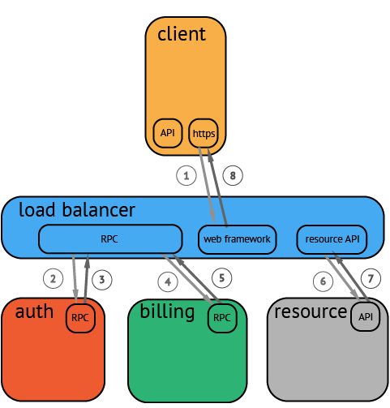

# OpenTracing

## 概述

一个 trace 代表一个潜在的，分布式的，存在并行数据或并行执行轨迹（潜在的分布式、并行）的系统。一个 trace 可以认为是多个 span 的有向无环图（DAG）。

在一个分布式系统中，追踪一个事务或者调用流一般如上图所示。虽然这种图对于看清各组件的组合关系是很有用的，但是，它不能很好显示组件的调用时间，是串行调用还是并行调用，如果展现更复杂的调用关系，会更加复杂，甚至无法画出这样的图。另外，这种图也无法显示调用间的时间间隔以及是否通过定时调用来启动调用。一种更有效的展现一个典型的 trace 过程，如下图所示：

这种展现方式增加显示了执行时间的上下文，相关服务间的层次关系，进程或者任务的串行或并行调用关系。这样的视图有助于发现系统调用的关键路径。通过关注关键路径的执行过程，项目团队可能专注于优化路径中的关键位置，最大幅度的提升系统性能。例如：可以通过追踪一个资源定位的调用情况，明确底层的调用情况，发现哪些操作有阻塞的情况。

OpenTracing API 提供了一个标准的、与供应商无关的框架，这意味着如果开发者想要尝试一种不同的分布式追踪系统，开发者只需要简单地修改 Tracer 配置即可，而不需要替换整个分布式追踪系统

OpenTracing 由 API 规范 (描述了语言无关的数据模型和 Opentracing API 指南)、实现该规范的框架和库以及项目文档组成，OpenTracing 不是一个标准，OpenTracing API 项目正致力于为分布式跟踪创建更加标准化的 API 和工具。

## 数据约定

OpenTracing 通过定义的 API，可实现将监控数据记录到一个可插拔的 tracer 上。总体上来说，OpenTracing 不能保证底层追踪系统的实现方式。

### Span

一个 span 代表系统中具有开始时间和执行时长的逻辑运行单元。span 之间通过嵌套或者顺序排列建立逻辑因果关系。

一个 span 可以和一个或者多个 span 间存在因果关系。OpenTracing 定义了两种关系：ChildOf 和 FollowsFrom。这两种引用类型代表了子节点和父节点间的直接因果关系。未来，OpenTracing 将支持非因果关系的 span 引用关系。（例如：多个 span 被批量处理，span 在同一个队列中，等等）。

每一个 Span 封装以下状态：

>- 操作名称；
>- 起始时间戳；
>- 完成时间戳；
>- 一组零个或多个 key:value 的 Span Tags，keys 必须是字符串，values 可以是 strings，bools，numeric 类型；
>- 一组零个或多个 Span Logs，日志自身是与时间戳匹配的 key:value 对。键必须是字符串，尽管值可以是任何类型。并非所有的 opentracing 实现都必须支持每种值类型；
>- 一个 SpanContext；
>- 通过 SpanContext 引用零个或多个因果相关的 Spans；

Span 可以包含很多的 tags、logs 和 baggage，但是始终需要一个高度概括的 operation name。这些应该是一个简单的字符串，代表 span 中进行的工作类型。这个字符串应该是工作类型的逻辑名称，例如代表一个 RPC 或者一次 HTTP 的调用的端点，亦或对于代表 SQL 的 span，使用 SELECT or INSERT 作为逻辑名，等等。

### log

每个 span 可以进行多次 Logs 操作，每一次 Logs 操作，都需要一个带时间戳的时间名称，以及可选的任意大小的存储结构。

### tag

每个 span 可以有多个键值对（key:value）形式的 Tags，Tags 是没有时间戳的，支持简单的对 span 进行注解和补充。

### spancontext

每个 span 必须提供方法访问 SpanContext。SpanContext 代表跨越进程边界，传递到下级 span 的状态。(例如，包含 <trace_id, span_id, sampled> 元组)，并用于封装 Baggage。SpanContext 在跨越进程边界，和在追踪图中创建边界的时候会使用。

每一个 SpanContext 封装以下状态：

>- 任何 OpenTracing-Implementation-Dependent 状态 (TraceID,SpanID) 需要指定引用的 Span 以区分不同 Span 的进程边界；
>- Baggage Items 跨进程边界的键值对；

SpanContext 它更多的是一个 “概念”，而不是通用 OpenTracing 层的一个有用的功能。大多数 OpenTracing 用户只在启动新的 Span 时，或者在向某个传输协议注入 / 提取跟踪时，通过引用与 SpanContext 交互。

### baggage

Baggage 是存储在 SpanContext 中的一个键值对 (SpanContext) 集合。它会在一条追踪链路上的所有 span 内全局传输，包含这些 span 对应的 SpanContexts。在这种情况下，"Baggage" 会随着 trace 一同传播，他因此得名（Baggage 可理解为随着 trace 运行过程传送的行李）。鉴于全栈 OpenTracing 集成的需要，Baggage 通过透明化的传输任意应用程序的数据，实现强大的功能。例如：可以在最终用户的手机端添加一个 Baggage 元素，并通过分布式追踪系统传递到存储层，然后再通过反向构建调用栈，定位过程中消耗很大的 SQL 查询语句。

Baggage 拥有强大功能，也会有很大的消耗。由于 Baggage 的全局传输，如果包含的数量量太大，或者元素太多，它将降低系统的吞吐量或增加 RPC 的延迟。

### Baggage vs. Span Tags

Baggage 在全局范围内，（伴随业务系统的调用）跨进程传输数据。Span 的 tag 不会进行传输，因为他们不会被子级的 span 继承。

span 的 tag 可以用来记录业务相关的数据，并存储于追踪系统中。实现 OpenTracing 时，可以选择是否存储 Baggage 中的非业务数据，OpenTracing 标准不强制要求实现此特性。

### Inject and Extract

SpanContexts 可以通过 Injected 操作向 Carrier 增加，或者通过 Extracted 从 Carrier 中获取，跨进程通讯数据（例如：HTTP 头）。通过这种方式，SpanContexts 可以跨越进程边界，并提供足够的信息来建立跨进程的 span 间关系（因此可以实现跨进程连续追踪）。

## Tracer

Tracer 用于创建 Span，并理解如何跨进程边界注入 (序列化) 和提取 (反序列化)Span。从形式上将，它具有以下功能：

>- 开始新 Span；返回已启动的新的 Span 实例 (但是没有 Finished)；可能的参数列表有 operation name，references，start timestamp，tags
>- 将 SpanContext 注入载体；从载体中提取 SpanContext；可能的参数列表有 spancontext，format，carrier

## Carriers

追踪过程中的任何一个 SpanContext 可以被 Injected（注入）到一个 Carrier 中。Carrier 可以是一个接口或者一个数据载体，他对于跨进程通讯（IPC）是十分有帮助的。Carrier 负责将追踪状态从一个进程 "carries"（携带，传递）到另一个进程。OpenTracing 标准包含两种必须的 Carrier 格式，尽管，自定义的 Carrier 格式 也是可能的。

同样的，对于一个 Carrier，如果已经被 Injected，那么它也可以被 Extracted（提取），从而得到一个 SpanContext 实例。这个 SpanContext 代表着被 Injected 到 Carrier 的信息。

所有的 Carrier 都有自己的格式。在一些语言的 OpenTracing 实现中，格式必须必须作为一个常量或者字符串来指定； 另一些，则通过 Carrier 的静态类型来指定。

至少，OpenTracing 标准所有平台的实现者支持两种 Carrier 格式：基于 "text map"（基于字符串的 map）的格式和基于 "binary"（二进制）的格式。

>- text map 格式的 Carrier 是一个平台惯用的 map 格式，基于 unicode 编码的字符串对字符串键值对
>- binary 格式的 Carrier 是一个不透明的二进制数组（可能更紧凑和有效）

OpenTracing 的实现者选择如何将数据存储到 Carrier 中，OpenTracing 标准没有正式定义，但是，可以推测的是，他们会通过一种方式编码 “追踪状态”，来传递 SpanContext（例如，Dapper 会包含 trace_id，span_id，以及一位掩码标识这个 trace 的采样状态）和 Baggage 中的其他键值对数据。

## 一个端到端的 injector 和 extractor 示例

为了让描述更具体，考虑如下的流程：

1. 一个客户端进程有一个 SpanContext 实例，它将在一个 HTTP 协议之上生成一个 RPC；

2. 客户端进程调用 Tracer.Inject(...)，传递活动的 SpanContext 实例、Text Map 格式的标识符和 Text Map Carrier 作为参数；

3. Inject 已经在 Carrier 中填充了 Text Map，客户端应用程序在其自制的 http 协议（例如，作为头）中对该映射进行编码；

4. 发起 HTTP 请求，数据跨越进程边界；

5. 在服务器进程中，应用程序代码从自制的 http 协议中解码 Text Map 并使用它初始
化 Text Map Carrier；

6. 服务进程调用 Tracer.Extract(...)，抽取从上面传入所需的操作名、Text Map 的格式标识符和 Carrier；

7. 在没有数据损坏或其他错误的情况下，服务器现在有一个 SpanContext 实例，它与客户机中的实例属于同一个 Trace；

## 改造

总体来说，集成 OpenTracing，你需要做下面两件事：

服务端框架修改需求：

>- 过滤器、拦截器、中间件或其他处理输入请求的组件；
>- span 的存储，存储一个 request context 或者 request 到 span 的映射表；
>- 通过某种方式对 tracer 进行配置；

客户端框架修改需求：

>- 过滤器、拦截器、中间件或其他处理对外调用的请求的组件；
>- 通过某种方式对 tracer 进行配置；
