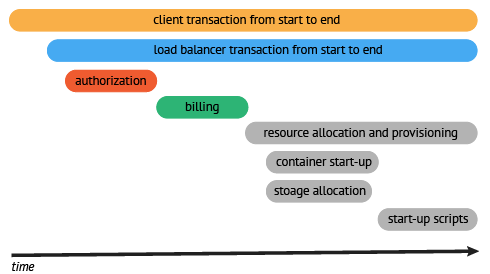

# OpenTracing

## 概述

一个trace代表一个潜在的，分布式的，存在并行数据或并行执行轨迹（潜在的分布式、并行）的系统。一个trace可以认为是多个span的有向无环图（DAG）。

在一个分布式系统中，追踪一个事务或者调用流一般如上图所示。虽然这种图对于看清各组件的组合关系是很有用的，但是，它不能很好显示组件的调用时间，是串行调用还是并行调用，如果展现更复杂的调用关系，会更加复杂，甚至无法画出这样的图。另外，这种图也无法显示调用间的时间间隔以及是否通过定时调用来启动调用。一种更有效的展现一个典型的trace过程，如下图所示：

这种展现方式增加显示了执行时间的上下文，相关服务间的层次关系，进程或者任务的串行或并行调用关系。这样的视图有助于发现系统调用的关键路径。通过关注关键路径的执行过程，项目团队可能专注于优化路径中的关键位置，最大幅度的提升系统性能。例如：可以通过追踪一个资源定位的调用情况，明确底层的调用情况，发现哪些操作有阻塞的情况。

OpenTracing API提供了一个标准的、与供应商无关的框架，这意味着如果开发者想要尝试一种不同的分布式追踪系统，开发者只需要简单地修改Tracer配置即可，而不需要替换整个分布式追踪系统

OpenTracing由API规范(描述了语言无关的数据模型和Opentracing API指南)、实现该规范的框架和库以及项目文档组成，OpenTracing不是一个标准，OpenTracing API项目正致力于为分布式跟踪创建更加标准化的API和工具。

## 数据约定

OpenTracing通过定义的API，可实现将监控数据记录到一个可插拔的tracer上。总体上来说，OpenTracing不能保证底层追踪系统的实现方式。

### Span

一个span代表系统中具有开始时间和执行时长的逻辑运行单元。span之间通过嵌套或者顺序排列建立逻辑因果关系。

一个span可以和一个或者多个span间存在因果关系。OpenTracing定义了两种关系：ChildOf 和 FollowsFrom。这两种引用类型代表了子节点和父节点间的直接因果关系。未来，OpenTracing将支持非因果关系的span引用关系。（例如：多个span被批量处理，span在同一个队列中，等等）。

每一个Span封装以下状态：

>- 操作名称；
>- 起始时间戳；
>- 完成时间戳；
>- 一组零个或多个key:value的Span Tags，keys必须是字符串，values可以是strings，bools，numeric类型；
>- 一组零个或多个Span Logs，日志自身是与时间戳匹配的key:value对。键必须是字符串，尽管值可以是任何类型。并非所有的opentracing实现都必须支持每种值类型；
>- 一个SpanContext；
>- 通过SpanContext引用零个或多个因果相关的Spans；

Span 可以包含很多的tags、logs和baggage，但是始终需要一个高度概括的operation name。这些应该是一个简单的字符串，代表span中进行的工作类型。这个字符串应该是工作类型的逻辑名称，例如代表一个RPC或者一次HTTP的调用的端点，亦或对于代表SQL的span，使用SELECT or INSERT作为逻辑名，等等。

### log

每个span可以进行多次Logs操作，每一次Logs操作，都需要一个带时间戳的时间名称，以及可选的任意大小的存储结构。

### tag

每个span可以有多个键值对（key:value）形式的Tags，Tags是没有时间戳的，支持简单的对span进行注解和补充。

### spancontext

每个span必须提供方法访问SpanContext。SpanContext代表跨越进程边界，传递到下级span的状态。(例如，包含<trace_id, span_id, sampled>元组)，并用于封装Baggage。SpanContext在跨越进程边界，和在追踪图中创建边界的时候会使用。

每一个SpanContext封装以下状态：

>- 任何OpenTracing-Implementation-Dependent状态(TraceID,SpanID)需要指定引用的Span以区分不同Span的进程边界；
>- Baggage Items 跨进程边界的键值对；

SpanContext 它更多的是一个“概念”，而不是通用OpenTracing层的一个有用的功能。大多数OpenTracing用户只在启动新的Span时，或者在向某个传输协议注入/提取跟踪时，通过引用与SpanContext交互。

### baggage

Baggage是存储在SpanContext中的一个键值对(SpanContext)集合。它会在一条追踪链路上的所有span内全局传输，包含这些span对应的SpanContexts。在这种情况下，"Baggage"会随着trace一同传播，他因此得名（Baggage可理解为随着trace运行过程传送的行李）。鉴于全栈OpenTracing集成的需要，Baggage通过透明化的传输任意应用程序的数据，实现强大的功能。例如：可以在最终用户的手机端添加一个Baggage元素，并通过分布式追踪系统传递到存储层，然后再通过反向构建调用栈，定位过程中消耗很大的SQL查询语句。

Baggage拥有强大功能，也会有很大的消耗。由于Baggage的全局传输，如果包含的数量量太大，或者元素太多，它将降低系统的吞吐量或增加RPC的延迟。

### Baggage vs. Span Tags

Baggage在全局范围内，（伴随业务系统的调用）跨进程传输数据。Span的tag不会进行传输，因为他们不会被子级的span继承。

span的tag可以用来记录业务相关的数据，并存储于追踪系统中。实现OpenTracing时，可以选择是否存储Baggage中的非业务数据，OpenTracing标准不强制要求实现此特性。

### Inject and Extract

SpanContexts可以通过Injected操作向Carrier增加，或者通过Extracted从Carrier中获取，跨进程通讯数据（例如：HTTP头）。通过这种方式，SpanContexts可以跨越进程边界，并提供足够的信息来建立跨进程的span间关系（因此可以实现跨进程连续追踪）。

## Tracer

Tracer 用于创建Span，并理解如何跨进程边界注入(序列化)和提取(反序列化)Span。从形式上将，它具有以下功能：

>- 开始新Span；返回已启动的新的Span实例(但是没有Finished)；可能的参数列表有 operation name，references，start timestamp，tags
>- 将SpanContext注入载体；从载体中提取SpanContext；可能的参数列表有 spancontext，format，carrier

## Carriers

追踪过程中的任何一个SpanContext可以被Injected（注入）到一个Carrier中。Carrier可以是一个接口或者一个数据载体，他对于跨进程通讯（IPC）是十分有帮助的。Carrier负责将追踪状态从一个进程"carries"（携带，传递）到另一个进程。OpenTracing标准包含两种必须的 Carrier 格式，尽管，自定义的 Carrier 格式 也是可能的。

同样的，对于一个Carrier，如果已经被Injected，那么它也可以被Extracted（提取），从而得到一个SpanContext实例。这个SpanContext代表着被Injected到Carrier的信息。

所有的Carrier都有自己的格式。在一些语言的OpenTracing实现中，格式必须必须作为一个常量或者字符串来指定； 另一些，则通过Carrier的静态类型来指定。

至少，OpenTracing标准所有平台的实现者支持两种Carrier格式：基于"text map"（基于字符串的map）的格式和基于"binary"（二进制）的格式。

>- text map 格式的 Carrier是一个平台惯用的map格式，基于unicode编码的字符串对字符串键值对
>- binary 格式的 Carrier 是一个不透明的二进制数组（可能更紧凑和有效）

OpenTracing的实现者选择如何将数据存储到Carrier中，OpenTracing标准没有正式定义，但是，可以推测的是，他们会通过一种方式编码“追踪状态”，来传递SpanContext（例如，Dapper会包含trace_id，span_id，以及一位掩码标识这个trace的采样状态）和Baggage中的其他键值对数据。

## 一个端到端的injector和extractor示例

为了让描述更具体，考虑如下的流程：

1. 一个客户端进程有一个SpanContext实例，它将在一个HTTP协议之上生成一个RPC；

2. 客户端进程调用Tracer.Inject(...)，传递活动的SpanContext实例、Text Map格式的标识符和Text Map Carrier作为参数；

3. Inject已经在Carrier中填充了Text Map，客户端应用程序在其自制的http协议（例如，作为头）中对该映射进行编码；

4. 发起HTTP请求，数据跨越进程边界；

5. 在服务器进程中，应用程序代码从自制的http协议中解码Text Map并使用它初始
化Text Map Carrier；

6. 服务进程调用Tracer.Extract(...)，抽取从上面传入所需的操作名、Text Map的格式标识符和Carrier；

7. 在没有数据损坏或其他错误的情况下，服务器现在有一个SpanContext实例，它与客户机中的实例属于同一个Trace；

## 改造

总体来说，集成OpenTracing，你需要做下面两件事：

服务端框架修改需求：

>- 过滤器、拦截器、中间件或其他处理输入请求的组件；
>- span的存储，存储一个request context或者request到span的映射表；
>- 通过某种方式对tracer进行配置；

客户端框架修改需求：

>- 过滤器、拦截器、中间件或其他处理对外调用的请求的组件；
>- 通过某种方式对tracer进行配置；
