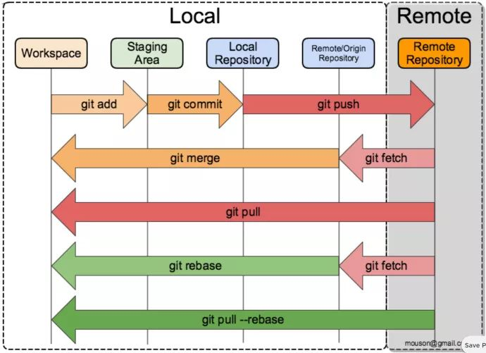

# 简易 Git 使用指南

## 基本原理

图中左侧为工作区，右侧为本地仓库。在本地仓库中标记为 `index` 的区域是暂存区 (stage, index)，标记为 `master` 的是 master 分支所代表的目录树。图中我们可以看出此时 `HEAD` 实际是指向 master 分支的一个游标。所以图示的命令中出现 HEAD 的地方可以用 master 来替换。图中的 objects 标识的区域为 Git 的对象库，实际位于 `.git/objects` 目录下，里面包含了创建的各种对象及内容。当对工作区修改（或新增）的文件执行 `git add` 命令时，暂存区的目录树被更新，同时工作区修改（或新增）的文件内容被写入到对象库中的一个新的对象中，而该对象的 ID 被记录在暂存区的文件索引中。


## 对象模型

所有用来表示项目历史信息的文件，是通过一个 40 个字符的 (40-digit)“对象名” 来索引的，对象名看起来像这样: `6ff87c4664981e4397625791c8ea3bbb5f2279a3`。你会在 Git 里到处看到这种 40 个字符的字符串。每一个对象名都是对对象内容做 SHA1 哈希计算得来的，(SHA1 是一种密码学的哈希算法)。这样就意味着两个不同内容的对象不可能有相同的对象名。这样做会有几个好处:

>- Git 只要比较对象名，就可以很快的判断两个对象是否相同。
>- 因为在每个仓库 (repository) 的对象名的计算方法都完全一样，如果同样的内容存在两个不同的仓库中，就会存在相同的对象名下。
>- Git 还可以通过检查对象内容的 SHA1 的哈希值和对象名是否相同，来判断对象内容是否正确。

Git 与大部分版本控制系统的差别是很大的。Subversion、CVS、Perforce、Mercurial 等使用 “增量文件系统” (Delta Storage systems), 就是说它们存储每次提交 (commit) 之间的差异。Git 正好与之相反，它会把你的每次提交的文件的全部内容 (snapshot) 都会记录下来。

## 基本操作

### 3 个步骤

工作区——暂存区——本地仓库——远程仓库

```shelll
# 把所有文件放入暂存区
git add .
# 把所有文件从暂存区提交进本地仓库
git commit -m "comment"
# 把所有文件从本地仓库推送进远程仓库
git push
```

### 4 个分区

>- 工作区 (Working Area)
>- 暂存区 (Stage)
>- 本地仓库 (Local Repository)
>- 远程仓库 (Remote Repository)

### 5 种状态

以上 4 个区，进入每一个区成功之后会产生一个状态，再加上最初始的一个状态，一共是 5 种状态。以下我们把这 5 种状态分别命名为：

>- 未修改 (Origin)
>- 已修改 (Modified)
>- 已暂存 (Staged)
>- 已提交 (Committed)
>- 已推送 (Pushed)



### 4 种撤销

>- 已修改，未暂存：`git checkout file_name` . 表示所有文件。
>- 已暂存，未提交：`git reset` + `git checkout .` = `git reset --hard` 暂存区和工作区一并撤销。
>- 已提交，未推送：`git reset --hard origin/master` 加入一个参数 origin/master，origin/master 代表远程仓库，既然你已经污染了的本地仓库，那么就从远程仓库把代码取回来。
>- 手速快，已推送：`git reset --hard HEAD^` + `git push -f` 由于本地仓库和远程仓库是等价的，只需要先恢复本地仓库，再强制 push 到远程仓库。

## 常用命令

`git status` 查看本地仓库状态。

`git add file_name` 保存工作区的修改到暂存区。

`git commit -m "what_you_have_done"` 提交暂存区的修改到本地仓库。

`git checkout --file_name` 撤销工作区保存到暂存区的修改，恢复到上一次 commit 的状态。

`git reset HEAD file_name` 撤销保存到暂存区的修改，工作区的修改不变。

`git rm file_name` 从工作区和暂存区删除文件。`git rm -r dir_name` 递归删除，* 代表全部文件。

`git rm --cached file_name` 从暂存区删除文件，工作区不变。

`git mv file_src file_dst` 移动或重命名一个文件、目录、软连接，file_dist 是目录则代表移动，是文件名则是重命名。

`gitk`执行了 gitk 后会有一个很漂亮的图形的显示项目的历史。

### 分支操作

`git branch branch_name` 添加本地分支。

`git checkout branch_name` 切换本地分支。

`git merge branch_name` 合并本地分支至当前所在分支。如有冲突 (同一个文件在远程分支和本地分支里按不同的方式被修改了)，那么命令的执行输出就像下面一样：

```shell
git merge next
100% (4/4) done
Auto-merged file.txt
CONFLICT (content): Merge conflict in file.txt
Automatic merge failed; fix conflicts and then commit the result.
```

在有问题的文件上会有冲突标记，在手动解决完冲突后就可以把此文件添加到暂存区中去，用 commit 命令来提交，就像平时修改了一个文件一样。

`git branch -D branc_name` 删除本地分支。

`git rebase` 改变 base。

基于 origin 分支创建新分支 branch 后，origin 分支上提交了新的修改。当使用 pull 命令吧 origin 分支拉下来和 branch 分支合并时，结果看起来像是一个合并的提交（merge commit）。如果希望 branch 分支历史看起来像没有经过任何合并一样，可以使用 rebase。

```shell
git checkout branch_name
git rebase origin
```

这样会把 branch 分支的每个 commit 取消掉，并保存为临时补丁（patch，存放在 .git/rebase 目录）。然后把 branch 分支更新为最新的 origin 分支，最后再把这些补丁应用到更新后的 branch 分支。最后 branch 分支的 HEAD 会指向新创建的 commit，老的 commit 则被丢弃。如果运行垃圾收集命令，这些被丢弃的提交就会被删除。

在 rebase 的过程中，也许会出现冲突（conflict）。在这种情况，Git 会停止 rebase 并会让你去解决冲突；在解决完冲突后，用`git add`命令去更新这些内容的索引（index），然后无需执行`git commit`，只要执行`git rebase --continue`。这样 git 会继续应用 (apply) 余下的补丁。在任何时候，可以用`git rebase --abort`参数来终止 rebase 的行动，并且 branch 分支会回到 rebase 开始前的状态。

`git cherry-pick` 从其他分支抓取 commit。

假设现在有两个分支：dev_01, dev_02，想把 dev_01 分支上的某几个 commit 合并到 dev_02 分支， 那么需要使用 cherry-pick。cherry-pick 会捡选某些 commit, 即把某些 commit 的更改重新在另一分支上重新提交一遍。

假设需要将 dev_01 上的两个 commit 合并到 dev_02 上：`20c2f506d789bb9f041050dc2c1e954fa3fb6910`和`2633961a16b0dda7b767b9264662223a2874dfa90`。那我们可以这样写：

```shell
git cherry-pick  
20c2f506d789bb9f041050dc2c1e954fa3fb6910
2633961a16b0dda7b767b9264662223a2874dfa9
```

多个 commit-hash 使用空格分割 , commit-hash 最好按提交时间先后排列 , 即最先提交的 commit 放在前面。注意：上面这条 cherry-pick 命令每拣选一个 commit 就会提交一次生成一个新的 commit id。如果我们想让每个 commit 拣选后暂缓提交，等到所有 commit 都拣选完成后，自己手动 commit，应该使用 -n 选项：

```shell
git cherry-pick  -n
20c2f506d789bb9f041050dc2c1e954fa3fb6910
2633961a16b0dda7b767b9264662223a2874dfa9
```

这样，当 cherry-pick 后，这两个 commit 上的更改就被 merge 到本地的 dev_02 分支了，此时这些更改就像是在 dev_02 分支上自己手动添加的一样，注意此时这些更改并没有被提交。执行`git status`会列出这些改动。此时，就可以按正常流程（git commit, git push）来提交改动。

### 查看状态和修改

`git log` 查看历史记录，`-p`: show diff `-2`: view last two commit。如果用--stat 选项使用`git log`，它会显示在每个提交 (commit) 中哪些文件被修改了 , 这些文件分别添加或删除了多少行内容。如果使用 '--graph' 选项来可视化的提交图 (commit graph)。

`git diff` 查看改动。git diff 是一个难以置信的有用的工具，可以找出项目上任意两点间的改动，或是用来查看别人提交进来的新分支。

```shell
# 查看已写入缓存与已修改但尚未写入缓存的改动的区别
git diff (--file_name)
# 查看已缓存的改动，可以通过 git commit 提交
git diff --cached (--file_name)
# 查看工作区和版本库之间的区别，可以通过 git commit -a 提交
git diff HEAD (--file_name)
# 查看摘要而非整个 diff
git diff --stat
显示两个分支间的差异
git diff master..test
如果想找出 ‘master’,‘test’ 的共有父分支和 'test' 分支之间的差异，用 3 个 ‘.' 来取代前面的两个 '.'
git diff master...test
```

### 远程仓库操作

`git init repo_name` 初始化仓库，new_repo_name 为可选项。

`git clone URL local_dir` 克隆远程仓库，local_dir 为可选项。

`git add file_name` 暂存修改，add . 暂存所有修改的文件。

`git commit -m "what_you_have_done"` 提交和添加提交说明。如果不加-m 则会进入 vi 界面来写 commit 信息。建议在写 commit 信息时，第一行简要描述修改，然后空一行做详细描述。使用`git commit -a`会自动把所有内容被修改的文件 (不包括新创建的文件) 都添加到索引中，并且同时把它们提交。在提交（commit）经常会遇到冲突。如果执行 git status 会显示这些文件没有合并 (unmerged)，这些有冲突的文件里面会添加像下面的冲突标识符：

```shell
Hello world
Goodbye
```

所需要的做是就是编辑解决冲突，(接着把冲突标识符删掉)，再执行下面的命令：

```shell
git add file.txt
git commit
```

注意：提交注释里已经有一些关于合并的信息了，通常是用这些默认信息，但是可以添加一些你想要的注释。

`git commit --amend` add 后，将此次修改合并到上次未 push 的 commit 中。

`git pull remote_repo_name remote_branch_name` 拉取远程仓库，后面参数为可选项，默认拉取远程仓库的 master 分支

```shell
# 默认操作是 git pull origin master
git pull origin august
From https://github.com/cestlascorpion/Note-markdown
 * branch            august     -> FETCH_HEAD
Already up to date.
```

`git push remote_repo_name local_branch_name` 推送至远程仓库，将本地 branch 推送到远程仓库，eg: git push origin master

`git remote -v` 查看远程仓库信息

```shell
origin  https://github.com/cestlascorpion/Note-markdown.git (fetch)
origin  https://github.com/cestlascorpion/Note-markdown.git (push)
```

`git remote show remote_repo_name` 查看远程仓库详情

```shell
git remote show origin
* remote origin
  Fetch URL: https://github.com/cestlascorpion/Note-markdown.git
  Push  URL: https://github.com/cestlascorpion/Note-markdown.git
  HEAD branch: master
  Remote branches:
    august tracked
    master tracked
  Local branches configured for 'git pull':
    august merges with remote august
    master merges with remote master
  Local refs configured for 'git push':
    august pushes to august (up to date)
    master pushes to master (up to date)
```

如果使用`clone`命令克隆了一个仓库，命令会自动将其添加为远程仓库并默认以`origin`为简写
所以，`git fetch origin`会抓取克隆（或上一次抓取）后新推送的所有工作
必须注意`git fetch`命令会将数据拉取到你的本地仓库
它并不会自动合并或修改你当前的工作，必须手动将其合并入你的工作

`git branch -a` 查看远程所有分支

```shell
# HEAD 游标在 master 分支上
origin/HEAD -> origin/master
# 一个叫做 august 的分支，在远程仓库 origin 上
origin/august
# 一个叫做 master 的分支，在远程仓库 origin 上，现在是默认的主分支
origin/master
```

`git checkout -b august origin/august` 创建并拉取想要的远端分支代码，创建本地分支。

### 忽略文件

.gitignore 中文件和目录会被 git 忽略，比如将 .idea 等 IDE 配置文件或者 build 目录下的编译后的文件忽略掉。

```shell
# 忽略所有 .a 结尾的文件
*.a
# 但是不包括 lib.a 文件
!lib.a
# 忽略 build 目录下的文件
build/
# 但不忽略 doc 目录下的子目录和非 .txt 文件
doc/*.txt
# 忽略 doc 目录及其所有子目录下的 .pdf 文件
doc/**/*.pdf
```

## 特殊使用实例

### 将几个 commit 合并为一个 commit

使用 git log 查看历史记录，找到待合并的 commit 之前第一个 commit 点；

执行`git rebase -i commitid`开始合并，进入 vi 的 insert 模式；

```shell
pick 12814gs "commit what"
pick kiu3243 "commit does fox say"

# Rebase sfc678...89re123 no tosfc678 (2 commands)
#
# p, pick = use commit
# r, reword = use commit, but edit the commit message
# e, edit = use commit, but stop for amending
# s, squash = use commit, but meld into previous commit
# f, fixup = like 'squash', but discard this commit`s log message
# x, exec = run command (the rest of the line) using shell
# d, drop = remove commit
# ...
```

根据提示信息，将第二个 commit 的 pick 改为 squash 或者 fixup，均可以将第二个 commit 合并到第一个中；

编辑后保存，然后跳转到 commit message 界面，编辑后保存，跳回最初的命令界面。

### 批量修改 commit 信息

```shell
# 将所有 author email 改为 new_author_email
git filter-branch --env-filter 'export GIT_AUTHOR_EMAIL=new_author_email' --
# 将所有 committer email 改为 new_committer_email
git filter-branch --env-filter 'export GIT_COMMITTER_EMAIL=new_committer_email' --
# 将所有 author name 改为 new_author_name
git filter-branch --env-filter 'export GIT_AUTHOR_NAME=new_author_name' --
# 将所有 committer name 改为 new_committer_name
git filter-branch --env-filter 'export GIT_COMMITTER_NAME=new_committer_name' --
```

author 和 committer 分别是写 commit 和提交 commit 的人。执行 filter-branch 后，git 会保存旧的代码库。此时需要删除 .git/refs/original/... 文件夹。

如果向避免出现公司工作和个人项目混杂导致的问题，就要留意 git config。config 配置有 system 级别 /global（用户级别）和 local（当前仓库）三个。设置先从 system > global > local。底层配置会覆盖顶层配置，分别使用--system/global/local 可以定位到配置文件。

```shell
git config --system --list
git config --global  --list
git config --local  --list

git config --local user.name "name"
git config --local user.email "name@email.com"
```
