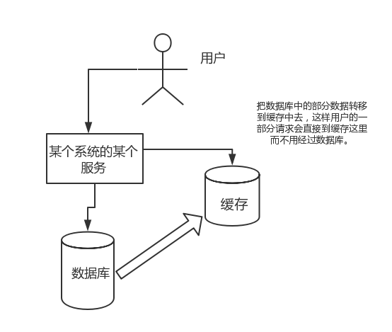
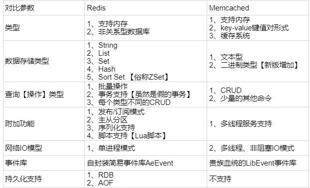

# Redis 数据库

与传统数据库相比，Redis 的数据是存在内存中的，所以存写速度非常快，因此 Redis 被广泛应用于缓存方向。另外，Redis 也经常用来做分布式锁。Redis 提供了多种数据类型来支持不同的业务场景。除此之外，Redis 支持事务、持久化、LUA 脚本、LRU 驱动事件、多种集群方案。

## 为什么要用 Redis/ 为什么要用缓存

### 高性能

假如用户第一次访问数据库中的某些数据。这个过程会比较慢，因为是从硬盘上读取的。将该用户访问的数据存在缓存中，这样下一次再访问这些数据的时候就可以直接从缓存中获取了。操作缓存就是直接操作内存，所以速度相当快。如果数据库中的对应数据改变了之后，同步改变缓存中相应的数据即可。


### 高并发

直接操作缓存能够承受的请求是远远大于直接访问数据库的，可以考虑把数据库中的部分数据转移到缓存中去，这样用户的一部分请求会直接到缓存这里而不用经过数据库。



## 为什么要用 Redis 而不用 map/guava 做缓存

缓存分为本地缓存和分布式缓存。以 Java 为例，使用自带的 map 或者 guava 实现的是本地缓存，最主要的特点是轻量以及快速，生命周期随着 JVM 的销毁而结束。并且在多实例的情况下，每个实例都需要各自保存一份缓存，缓存不具有一致性。使用 Redis 或 Memcached 之类的称为分布式缓存，在多实例的情况下，各实例共用一份缓存数据，缓存具有一致性。缺点是需要保持 Redis 或 Memcached 服务的高可用，整个程序架构上较为复杂。

## Redis 和 Memcached 的区别

>- Redis 支持更丰富的数据类型，支持更复杂的应用场景。Redis 不仅仅支持简单的 K/V 类型的数据，同时还提供 list、set、zset、hash 等数据结构的存储。Memcache 支持简单的数据类型 String。
>- Redis 支持数据的持久化，可以将内存中的数据保持在磁盘中，重启的时候可以再次加载进行使用。Memecache 把数据全部存在内存之中。
>- Redis 目前原生支持 Cluster 模式。Memcached 没有原生的集群模式，需要依靠客户端来实现往集群中分片写入数据。
>- Memcached 是多线程，非阻塞 IO 复用的网络模型。Redis 使用单线程的多路 IO 复用模型。



## Redis 常见数据结构以及使用场景分析

```shell
SET [key] [value]
GET [key]
DUMP [key]   // 序列化给定的 key，返回序列化的值
EXISTS [key]
EXPIRE [key] seconds // 设置过期时间，以秒计
EXPIREAT [key] [timestamp]  // 设置过期时间戳
PERSIST [key] // 移除过期时间，永久保持
TTL [key] // 返回过期时间，以秒计
KEYS [pattern]  // 查找所有符合给定模式 ( pattern) 的 key
RENAME [key] [newkey] // 修改 key 的名称
RENAMENX [key] [newkey] // 修改 key 的名称，仅当 newkey 不存在时
```

String。常用命令：set、get、decr、incr、mget 等。String 数据结构是简单的 Key-Value 类型，Value 其实不仅可以是 String，也可以是数字。string 类型是二进制安全的。意思是 Redis 的 String 可以包含任何数据。比如 jpg 图片或者序列化的对象。String 类型是 Redis 最基本的数据类型，String 类型的值最大能存储 512MB。常规 Key-Value 缓存应用；常规计数：微博数，粉丝数等。

```shell
MGET [key1] [key2] [key3]
SETNX [key] [value]  // 只有在 key 不存在时设置 key 的值
INCR [key]  //  将 key 中储存的数字值增一
INCR [key] [inc] //  将 key 中储存的数字值增加指定的值
INCRBYFLOAT [key] [inc] // 增量为浮点值
DECR [key]  //  将 key 中储存的数字值增一
DECR [key] [inc] //  将 key 中储存的数字值增加指定的值
APPEND [key] [value] // 字符串的 value 追加内容
```

Hash。常用命令：hget、hset、hgetall 等。Hash 是一个 String 类型的 Field 和 Value 的映射表，Hash 特别适合用于存储对象。每个 hash 可以存储 2^32-1 键值对（40 多亿）后续操作时可以直接仅仅修改这个对象中的某个字段的值。比如可以 Hash 数据结构来存储用户信息，商品信息等等。在做单点登录的时候，就是用这种数据结构存储用户信息，以 cookieId 作为 key，设置 30 分钟为缓存过期时间，能很好的模拟出类似 session 的效果。

```shell
HMSET [hash_name-key] [field1] [value] [field2] [value] [field3] [value]
HGET [hash_name-key] [field]
HDEL [hash_name-key] [field1] [field2]
HGETALL [hash_name-key] // 获取在哈希表的所有字段和值
HINCRBY [hash_name-key] [field] [incr]
HINCRBYFLOAT [hash_name-key] [field] [incr]
HLEN [key] // field 的数量
```

List。常用命令：lpush、rpush、lpop、rpop、lrange 等。List 就是链表，可以添加一个元素到列表的头部（左边）或者尾部（右边）。Redis List 的应用场景非常多，也是 Redis 最重要的数据结构之一。比如微博的关注列表，粉丝列表，消息列表等功能都可以用 Redis 的 List 结构来实现。RedisList 的实现为一个双向链表，即可以支持反向查找和遍历，更方便操作，不过带来了部分额外的内存开销。另外可以通过 lrange 命令，就是从某个元素开始读取多少个元素，可以基于 List 实现分页查询。这是很棒的一个功能，基于 Redis 实现简单的高性能分页，可以做类似微博那种下拉不断分页的东西（一页一页的往下走）。

```shell
LPUSH [list_name-key] [value]
RPOP [list_name-key]
LRANGE [list_name-key] [begin_idx] [end_idx]
BLPOP [list_name-key1] [list_name-key2] [timeout] // 移出并获取列表第一个元素，没有会阻塞或者等到超时
BRPOP [list_name-key1] [list_name-key2] [timeout] // 移出并获取列表最后一个元素，没有会阻塞或者等到超时
LINDEX [list_name-key] [index] // 通过索引获得 value
LINSERT [list_name-key] [BEFORE|AFTER] [pivot] [value] 在列表的元素前或者后插入元素
```

Set。无序集合，集合是通过哈希表实现的，所以添加，删除，查找的复杂度都是 O(1)。。常用命令：sadd、spop、smembers、sunion 等。Set 对外提供的功能与 List 类似是一个列表的功能，特殊之处在于 Set 是可以自动去重的。当需要存储一个列表数据，又不希望出现重复数据时，Set 是一个很好的选择。并且 Set 提供了判断某个成员是否在一个 Set 集合内的重要接口，这个也是 List 所不能提供的。可以基于 Set 轻易实现交集、并集、差集的操作。比如：在微博应用中，可以将一个用户所有的关注人存在一个集合中，将其所有粉丝存在一个集合。Redis 可以非常方便的实现如共同关注、共同粉丝、共同喜好等功能。为什么不用 JVM 自带的 Set 进行去重？因为系统一般都是集群部署，使用 JVM 自带的 Set，比较麻烦，难道为了一个做一个全局去重，再起一个公共服务？

```shell
SADD [set_name-key] [member]
SMEMBERS [set_name-key]
SCARD [set_name-key]  //  成员数
SISMEMBER [set_name-key] [member]  // 判断 member 元素是否是集合成员
SPOP [set_name-key]  // 移除并返回集合中的一个随机元素
SREM [set_name-key] [member1] [member2]   //  移除集合中一个或多个成员
SSCAN [set_name-key] [cursor] [MATCH pattern] [COUNT count] // 迭代集合中的元素
```

SortedSet。 zset 和 set 一样也是 string 类型元素的集合，且不允许重复的成员。
不同的是每个元素都会关联一个 double 类型的分数。redis 正是通过分数来为集合中的成员进行从小到大的排序。常用命令：zadd、zrange、zrem、zcard 等。和 Set 相比，SortedSet 增加了一个权重参数 Score，使得集合中的元素能够按 Score 进行有序排列。可以做排行榜应用，取 TOPN 操作。sortedset 可以用来做延时任务。最后一个应用就是可以做范围查找。举例：在直播系统中，实时排行信息包含直播间在线用户列表，各种礼物排行榜，弹幕消息（可以理解为按消息维度的消息排行榜）等信息，适合使用 Redis 中的 SortedSet 结构进行存储。

```shell
ZADD [zset_name-key] [score] [member]
ZRANGE [zset_name-key] [begin_idx] [end_idx] [WITHSCORES]  //  通过索引区间返回有序集合指定区间内的成员
ZRANGEBYLEX [zset_name-key] [min] [max] [LIMIT offset count] // 通过字典区间返回有序集合的成员
ZRANGEBYSCORE [zset_name-key] [min] [max] [WITHSCORES] [LIMIT]  // 通过分数返回有序集合指定区间内的成员
ZCARD [zset_name-key]  //  获取有序集合的成员数
ZCOUNT [zset_name-key] [min] [max]   // 计算在有序集合中指定区间分数的成员数
ZRANK [zset_name-key] [member]  //  返回有序集合中指定成员的索引
ZREVRANK [zset_name-key] [member]  //  返回有序集合中指定成员的排名（逆序，从大到小）
ZREM [zset_name-key] [member1] [member2]   // 移除有序集合中的一个或多个成员
ZINCRBY [zset_name-key] [inc] [member]  //  有序集合中对指定成员的分数加上增量
ZSCORE [zset_name-key] [member]  // 返回有序集中，成员的分数值
```

## Redis 设置过期时间

Redis 中有个设置过期时间的功能，即对存储在 Redis 数据库中的值可以设置一个过期时间。作为一个缓存数据库，这是非常实用的。比如一般项目中的 Token 或者一些登录信息，尤其是短信验证码都是有时间限制的，按照传统的数据库处理方式，一般都是自己判断过期，这样无疑会严重影响项目性能。在 SetKey 的时候，都可以给一个 ExpireTime，即过期时间，通过过期时间我们可以指定这个 Key 可以存活的时间。如果设置了一批 Key 只能存活 1 个小时，那么接下来 1 小时后，Redis 是怎么对这批 Key 进行删除的？答案是：定期删除 + 惰性删除。

>- 定期删除：Redis 默认是每隔 100ms 就随机抽取一些设置了过期时间的 Key，检查其是否过期，如果过期就删除。为什么要随机呢？假如 Redis 存了几十万个 Key，每隔 100ms 就遍历所有的设置过期时间的 Key 的话，就会给 CPU 带来很大的负载。
>- 惰性删除：定期删除可能会导致很多过期 Key 到了时间并没有被删除掉。所以就有了惰性删除。假如过期 Key，靠定期删除没有被删除掉，还停留在内存里。当系统去查一下那个 Key，发现 key 过期才会删掉。

但是仅仅通过设置过期时间还是有问题的。如果定期删除漏掉了很多过期 Key，惰性删除也漏掉了这些 key，那么有可能大量过期 Key 堆积在内存里导致 Redis 内存块耗尽。怎么解决这个问题呢？内存淘汰机制。

## Redis 内存淘汰机制

Redis 提供 6 种数据淘汰策略：

>- volatile-lru：从已设置过期时间的数据集（server.db[i].expires）中挑选最近最少使用的数据淘汰。
>- volatile-ttl：从已设置过期时间的数据集（server.db[i].expires）中挑选将要过期的数据淘汰。
>- volatile-random：从已设置过期时间的数据集（server.db[i].expires）中任意选择数据淘汰。
>- allkeys-lru：当内存不足以容纳新写入数据时，在键空间中，移除最近最少使用的 key（这个是最常用的）。
>- allkeys-random：从数据集（server.db[i].dict）中任意选择数据淘汰。
>- no-enviction：禁止驱逐数据，也就是说当内存不足以容纳新写入数据时，新写入操作会报错。这个应该没人使用吧！

## Redis 持久化机制

怎么保证 Redis 挂掉之后再重启数据可以进行恢复？很多时候需要持久化数据也，就是将内存中的数据写入到硬盘里面。大部分原因是为了之后重用数据（比如重启机器、机器故障之后恢复数据），或者是为了防止系统故障而将数据备份到一个远程位置。Redis 不同于 Memcached 的很重要一点就是，Redis 支持持久化，而且支持两种不同的持久化操作。Redis 的一种持久化方式叫快照（snapshotting，RDB），另一种方式是只追加文件（append-onlyfile，AOF）。

### 快照（snapshotting）持久化（RDB）

Redis 可以通过创建快照来获得存储在内存里面的数据在某个时间点上的副本。Redis 创建快照之后，可以对快照进行备份，可以将快照复制到其他服务器从而创建具有相同数据的服务器副本（Redis 主从结构，主要用来提高 Redis 性能），还可以将快照留在原地以便重启服务器的时候使用。快照持久化是 Redis 默认采用的持久化方式，在 Redis.conf 配置文件中默认有此下配置：

```shell
 # 在 900 秒 (15 分钟) 之后，如果至少有 1 个 key 发生变化，Redis 就会自动触发 BGSAVE 命令创建快照。
save 900 1
# 在 300 秒 (5 分钟) 之后，如果至少有 10 个 key 发生变化，Redis 就会自动触发 BGSAVE 命令创建快照。
save 300 10
```

### AOF（append-only file）持久化

与快照持久化相比，AOF 持久化的实时性更好，已成为主流的持久化方案。默认情况下 Redis 没有开启 AOF（append only file）方式的持久化，可以通过 appendonly 参数开启：

```shell
appendonly yes
```

开启 AOF 持久化后每执行一条会更改 Redis 中的数据的命令，Redis 就会将该命令写入硬盘中的 AOF 文件。AOF 文件的保存位置和 RDB 文件的位置相同，都是通过 dir 参数设置的，默认的文件名是 appendonly.aof。在 Redis 的配置文件中存在三种不同的 AOF 持久化方式，它们分别是：

>- appendfsync always。每次有数据修改发生时都会写入 AOF 文件，这样会严重降低 Redis 的速度。
>- appendfsync everysec。每秒钟同步一次，显示地将多个写命令同步到硬盘。
>- appendfsync no。让操作系统决定何时进行同步。

为了兼顾数据和写入性能，用户可以考虑 appendfsynceverysec 选项，让 Redis 每秒同步一次 AOF 文件，Redis 性能几乎没受到任何影响。而且这样即使出现系统崩溃，用户最多只会丢失一秒之内产生的数据。当硬盘忙于执行写入操作的时候，Redis 还会优雅的放慢自己的速度以便适应硬盘的最大写入速度。

### Redis4.0 对于持久化机制的优化

Redis4.0 开始支持 RDB 和 AOF 的混合持久化（默认关闭，可以通过配置项 aof-use-rdb-preamble 开启）。如果把混合持久化打开，AOF 重写的时候就直接把 RDB 的内容写到 AOF 文件开头。这样做的好处是可以结合 RDB 和 AOF 的优点 , 快速加载同时避免丢失过多的数据。当然缺点也是有的，AOF 里面的 RDB 部分是压缩格式不再是 AOF 格式，可读性较差。

### 补充内容：AOF 重写

AOF 重写可以产生一个新的 AOF 文件，这个新的 AOF 文件和原有的 AOF 文件所保存的数据库状态一样，但体积更小。AOF 重写是一个有歧义的名字，该功能是通过读取数据库中的键值对来实现的，程序无须对现有 AOF 文件进行任伺读入、分析或者写入操作。在执行 BGREWRITEAOF 命令时，Redis 服务器会维护一个 AOF 重写缓冲区，该缓冲区会在子进程创建新 AOF 文件期间，记录服务器执行的所有写命令。当子进程完成创建新 AOF 文件的工作之后，服务器会将重写缓冲区中的所有内容追加到新 AOF 文件的末尾，使得新旧两个 AOF 文件所保存的数据库状态一致。最后，服务器用新的 AOF 文件替换旧的 AOF 文件，以此来完成 AOF 文件重写操作。

### Redis 事务

Redis 通过 MULTI、EXEC、WATCH 等命令来实现事务 (transaction) 功能。事务提供了一种将多个命令请求打包，然后一次性、按顺序地执行多个命令的机制。并且在事务执行期间，服务器不会中断事务而改去执行其他客户端的命令请求，它会将事务中的所有命令都执行完毕，然后才去处理其他客户端的命令请求。在传统的关系式数据库中，常常用 ACID 性质来检验事务功能的可靠性和安全性。在 Redis 中，事务总是具有原子性（Atomicity)、一致性 (Consistency) 和隔离性（Isolation），并且当 Redis 运行在某种特定的持久化模式下时，事务也具有持久性（Durability）。

Redis 事务可以一次执行多个命令， 并且带有以下三个重要的保证：

>- 批量操作在发送 EXEC 命令前被放入队列缓存。
>- 收到 EXEC 命令后进入事务执行，事务中任意命令执行失败，其余的命令依然被执行。
>- 在事务执行过程，其他客户端提交的命令请求不会插入到事务执行命令序列中。

单个 Redis 命令的执行是原子性的，但 Redis 没有在事务上增加任何维持原子性的机制，所以 Redis 事务的执行并不是原子性的。事务可以理解为一个打包的批量执行脚本，但批量指令并非原子化的操作，中间某条指令的失败不会导致前面已做指令的回滚，也不会造成后续的指令不做。所以挺垃圾的。

## 缓存雪崩和缓存穿透问题解决方案

### 缓存雪崩

缓存同一时间大面积的失效，所以后面的请求都会落到数据库上，造成数据库短时间内承受大量请求而崩掉。

>- 使用互斥锁，但是该方案吞吐量明显下降了。
>- 给缓存的失效时间，加上一个随机值，避免集体失效。
>- 双缓存。比如有两个缓存，A 和 B。缓存 A 的失效时间为 20 分钟，缓存 B 不设失效时间。自己做缓存预热操作。从缓存 A 读数据库，有则直接返回。A 没有数据，直接从 B 读数据，直接返回，并且异步启动一个更新线程。更新线程同时更新缓存 A 和缓存 B。

### 缓存穿透

一般是黑客故意去请求缓存中不存在的数据，导致所有的请求都落到数据库上，造成数据库短时间内承受大量请求而崩掉。

>- 利用互斥锁，缓存失效的时候，先去获得锁，得到锁了，再去请求数据库。没得到锁，则休眠一段时间重试。
>- 采用异步更新策略，无论 key 是否取到值，都直接返回。value 值中维护一个缓存失效时间，缓存如果过期，异步起一个线程去读数据库，更新缓存。需要做缓存预热 (项目启动前，先加载缓存) 操作。
>- 提供一个能迅速判断请求是否有效的拦截机制，比如利用布隆过滤器，内部维护一系列合法有效的 key。迅速判断出请求所携带的 Key 是否合法有效。如果不合法则直接返回。

## 如何解决 Redis 的并发竞争 Key 问题

所谓 Redis 的并发竞争 Key 的问题也就是多个系统同时对一个 Key 进行操作，但是最后执行的顺序和我们期望的顺序不同，这样也就导致了结果的不同。

推荐一种方案：分布式锁（ZooKeeper 和 Redis 都可以实现分布式锁）。如果不存在 Redis 的并发竞争 Key 问题，不要使用分布式锁，这样会影响性能。基于 ZooKeeper 临时有序节点可以实现的分布式锁。

每个客户端对某个方法加锁时，在 ZooKeeper 上的与该方法对应的指定节点的目录下，生成一个唯一的瞬时有序节点。判断是否获取锁的方式很简单，只需要判断有序节点中序号最小的一个。当释放锁的时候，只需将这个瞬时节点删除即可。同时可以避免服务宕机导致的锁无法释放，而产生的死锁问题。完成业务流程后，删除对应的子节点释放锁。在实践中，当然是以可靠性为主，所以首推 ZooKeeper。

```txt
Redis 的 SETNX 指令
  * 使用 SETNX（set if not exist）指令插入一个键值对，如果 Key 已经存在，那么会返回 False，否则插入成功并返回 True。
  * SETNX 指令和数据库的唯一索引类似，保证了只存在一个 Key 的键值对，那么可以用一个 Key 的键值对是否存在来判断是否存于锁定状态。
  * EXPIRE 指令可以为一个键值对设置一个过期时间，从而避免了数据库唯一索引实现方式中释放锁失败的问题。

Redis 的 RedLock 算法
  * 使用了多个 Redis 实例来实现分布式锁，这是为了保证在发生单点故障时仍然可用。
  * ——>尝试从 N 个互相独立 Redis 实例获取锁；
    ——>计算获取锁消耗的时间，只有时间小于锁的过期时间，并且从大多数（N / 2 + 1）实例上获取了锁，才认为获取锁成功；
    ——>如果获取锁失败，就到每个实例上释放锁。

Zookeeper 的有序节点
  * 客户端为一个节点注册监听器，在节点状态发生改变时，会给客户端发送消息。创建一个锁目录 /lock。
  * ——>当一个客户端需要获取锁时，在 /lock 下创建临时的且有序的子节点；
    ——>客户端获取 /lock 下的子节点列表，判断自己创建的子节点是否为当前子节点列表中序号最小的子节点，如果是则认为获得锁；否则监听自己的前一个子节点，获得子节点的变更通知后重复此步骤直至获得锁；
    ——>执行业务代码，完成后，删除对应的子节点。
  * 如果一个已经获得锁的会话超时了，因为创建的是临时节点，所以该会话对应的临时节点会被删除，其它会话就可以获得锁了。可以看到，这种实现方式不会出现数据库的唯一索引实现方式释放锁失败的问题。
  * 一个节点未获得锁，只需要监听自己的前一个子节点，这是因为如果监听所有的子节点，那么任意一个子节点状态改变，其它所有子节点都会收到通知（羊群效应，一只羊动起来，其它羊也会一哄而上），而我们只希望它的后一个子节点收到通知。

数据库的唯一索引
  * 获得锁时向表中插入一条记录，释放锁时删除这条记录。唯一索引可以保证该记录只被插入一次，那么就可以用这个记录是否存在来判断是否处于锁定状态。
  * 存在以下几个问题：
    1. 锁没有失效时间，解锁失败的话其它进程无法再获得该锁；
    2. 只能是非阻塞锁，插入失败直接就报错了，无法重试；
    3. 不可重入，已经获得锁的进程也必须重新获取锁。
```

## Redis 和数据库双写一致性问题

一致性问题是分布式常见问题，还可以再分为最终一致性和强一致性。数据库和缓存双写，就必然会存在不一致的问题。如果对数据有强一致性要求，就不能放缓存。我们所做的一切，只能保证最终一致性。另外，我们所做的方案其实从根本上来说，只能说降低不一致发生的概率，无法完全避免。因此，有强一致性要求的数据，不能放缓存。

首先，采取正确更新策略，先更新数据库，再删缓存。其次，因为可能存在删除缓存失败的问题，提供一个补偿措施即可，例如利用消息队列。

## 分布式锁的实现

Redis 锁主要利用 Redis 的 setnx 命令。

>- 加锁命令：SETNX key value，当键不存在时，对键进行设置操作并返回成功，否则返回失败。KEY 是锁的唯一标识，一般按业务来决定命名。
>- 解锁命令：DEL key，通过删除键值对释放锁，以便其他线程可以通过 SETNX 命令来获取锁。
>- 锁超时：EXPIRE key timeout, 设置 key 的超时时间，以保证即使锁没有被显式释放，锁也可以在一定时间后自动释放，避免资源被永远锁住。

```java
if (setnx(key, 1) == 1){
    expire(key, 30)
    try {
        //TODO 业务逻辑
    } finally {
        del(key)
    }
}
```

上述锁实现方式存在一些问题：

### SETNX 和 EXPIRE 非原子性

如果 SETNX 成功，在设置锁超时时间后，服务器挂掉、重启或网络问题等，导致 EXPIRE 命令没有执行，锁没有设置超时时间变成死锁。有很多开源代码来解决这个问题，比如使用 lua 脚本。

```lua
if (redis.call('setnx', KEYS[1], ARGV[1]) < 1)
then return 0;
end;
redis.call('expire', KEYS[1], tonumber(ARGV[2]));
return 1;

// 使用实例
EVAL "if (redis.call('setnx',KEYS[1],ARGV[1]) < 1) then return 0; end; redis.call('expire',KEYS[1],tonumber(ARGV[2])); return 1;" 1 key value 100
```

从 Redis 2.6.12 版本开始， SET 命令的行为可以通过一系列参数来修改：

>- EX second ：设置键的过期时间为 second 秒。 SET key value EX second 效果等同于 SETEX key second value 。
>- PX millisecond ：设置键的过期时间为 millisecond 毫秒。 SET key value PX millisecond 效果等同于 PSETEX key millisecond value 。
>- NX ：只在键不存在时，才对键进行设置操作。 SET key value NX 效果等同于 SETNX key value 。
>- XX ：只在键已经存在时，才对键进行设置操作。

因为 SET 命令可以通过参数来实现和 SETNX 、 SETEX 和 PSETEX 三个命令的效果，所以将来的 Redis 版本可能会废弃并最终移除 SETNX 、 SETEX 和 PSETEX 这三个命令。

### 锁误解除

如果线程 A 成功获取到了锁，并且设置了过期时间 30 秒，但线程 A 执行时间超过了 30 秒，锁过期自动释放，此时线程 B 获取到了锁；随后 A 执行完成，线程 A 使用 DEL 命令来释放锁，但此时线程 B 加的锁还没有执行完成，线程 A 实际释放的线程 B 加的锁。

通过在 value 中设置当前线程加锁的标识，在删除之前验证 key 对应的 value 判断锁是否是当前线程持有。可生成一个 UUID 标识当前线程，使用 lua 脚本做验证标识和解锁操作。

```lua
// 加锁
String uuid = UUID.randomUUID().toString().replaceAll("-","");
SET key uuid NX EX 30
// 解锁
if (redis.call('get', KEYS[1]) == ARGV[1])
    then return redis.call('del', KEYS[1])
else return 0
end
```

### 超时解锁导致并发

如果线程 A 成功获取锁并设置过期时间 30 秒，但线程 A 执行时间超过了 30 秒，锁过期自动释放，此时线程 B 获取到了锁，线程 A 和线程 B 并发执行。

A、B 两个线程发生并发显然是不被允许的，一般有两种方式解决该问题：a. 将过期时间设置足够长，确保代码逻辑在锁释放之前能够执行完成。b. 为获取锁的线程增加守护线程，为将要过期但未释放的锁增加有效时间。

### 不可重入

当线程在持有锁的情况下再次请求加锁，如果一个锁支持一个线程多次加锁，那么这个锁就是可重入的。如果一个不可重入锁被再次加锁，由于该锁已经被持有，再次加锁会失败。Redis 可通过对锁进行重入计数，加锁时加 1，解锁时减 1，当计数归 0 时释放锁。

```java
private static ThreadLocal<Map<String, Integer>> LOCKERS = ThreadLocal.withInitial(HashMap::new);
// 加锁
public boolean lock(String key) {
  Map<String, Integer> lockers = LOCKERS.get();
  if (lockers.containsKey(key)) {
    lockers.put(key, lockers.get(key) + 1);
    return true;
  } else {
    if (SET key uuid NX EX 30) {
      lockers.put(key, 1);
      return true;
    }
  }
  return false;
}
// 解锁
public void unlock(String key) {
  Map<String, Integer> lockers = LOCKERS.get();
  if (lockers.getOrDefault(key, 0) <= 1) {
    lockers.remove(key);
    DEL key
  } else {
    lockers.put(key, lockers.get(key) - 1);
  }
```

本地记录重入次数虽然高效，但如果考虑到过期时间和本地、Redis 一致性的问题，就会增加代码的复杂性。另一种方式是 Redis Map 数据结构来实现分布式锁，既存锁的标识也对重入次数进行计数。

### 无法等待锁释放

上述命令执行都是立即返回的，如果客户端可以等待锁释放就无法使用。

可以通过客户端轮询的方式解决该问题，当未获取到锁时，等待一段时间重新获取锁，直到成功获取锁或等待超时。这种方式比较消耗服务器资源，当并发量比较大时，会影响服务器的效率。
另一种方式是使用 Redis 的发布订阅功能，当获取锁失败时，订阅锁释放消息，获取锁成功后释放时，发送锁释放消息。

### Redis 集群主备切换 & 集群脑裂

为了保证 Redis 的可用性，一般采用主从方式部署。主从数据同步有异步和同步两种方式，Redis 将指令记录在本地内存 buffer 中，然后异步将 buffer 中的指令同步到从节点，从节点一边执行同步的指令流来达到和主节点一致的状态，一边向主节点反馈同步情况。

在包含主从模式的集群部署方式中，当主节点挂掉时，从节点会取而代之，但客户端无明显感知。当客户端 A 成功加锁，指令还未同步，此时主节点挂掉，从节点提升为主节点，新的主节点没有锁的数据，当客户端 B 加锁时就会成功。

集群脑裂指因为网络问题，导致 Redis master 节点跟 slave 节点和 sentinel 集群处于不同的网络分区，因为 sentinel 集群无法感知到 master 的存在，所以将 slave 节点提升为 master 节点，此时存在两个不同的 master 节点。Redis Cluster 集群部署方式同理。

当不同的客户端连接不同的 master 节点时，两个客户端可以同时拥有同一把锁。

Redis 并不是强一致性的，如果使用了 Redis 集群，则不建议使用 Redis 做分布式锁。

## Redis 数据结构

### dict

在 Redis 中，dict 是一个基于哈希表的算法。和传统的哈希算法类似，它采用某个哈希函数从 key 计算得到在哈希表中的位置，采用拉链法解决冲突，并在装载因子（load factor）超过预定值时自动扩展内存，引发重哈希（rehashing）。

Redis 的 dict 实现最显著的一个特点，就在于它的重哈希。它采用了一种称为增量式重哈希（incremental rehashing）的方法，在需要扩展内存时避免一次性对所有 key 进行重哈希，而是将重哈希操作分散到对于 dict 的各个增删改查的操作中去。这种方法能做到每次只对一小部分 key 进行重哈希，而每次重哈希之间不影响 dict 的操作。dict 之所以这样设计，是为了避免重哈希期间单个请求的响应时间剧烈增加，这与前面提到的 “快速响应时间” 的设计原则是相符的。

在重哈希的过程中，有两个哈希桶有效，查找需要先后在两个表中查找；所有操作都会将一部分 key 从就表转移到新表，直到重哈希过程结束，旧的哈希表失效，只使用新的哈希表。

### sds

sds 正是在 Redis 中被广泛使用的字符串结构，它的全称是 Simple Dynamic String。与其它语言环境中出现的字符串相比，它具有如下显著的特点：可动态扩展内存。sds 表示的字符串其内容可以修改，也可以追加。在很多语言中字符串会分为 mutable 和 immutable 两种，显然 sds 属于 mutable 类型的。二进制安全（Binary Safe）。sds 能存储任意二进制数据，而不仅仅是可打印字符。与传统的 C 语言字符串类型兼容。

sds 是 Binary Safe 的，它可以存储任意二进制数据，不能像 C 语言字符串那样以字符 ‘\0‘来标识字符串的结束，因此它必然有个长度字段。但这个长度字段在哪里呢？实际上 sds 还包含一个 header 结构。sds 一共有 5 种类型的 header。之所以有 5 种，是为了能让不同长度的字符串可以使用不同大小的 header。这样，短字符串就能使用较小的 header，从而节省内存。

一个 sds 字符串的完整结构，由在内存地址上前后相邻的两部分组成：一个 header。通常包含字符串的长度 (len)、最大容量 (alloc) 和 flags。sdshdr5 有所不同。一个字符数组。这个字符数组的长度等于最大容量 +1。真正有效的字符串数据，其长度通常小于最大容量。在真正的字符串数据之后，是空余未用的字节（一般以字节 0 填充），允许在不重新分配内存的前提下让字符串数据向后做有限的扩展。在真正的字符串数据之后，还有一个 NULL 结束符，即 ASCII 码为 0 的’\0’ 字符。这是为了和传统 C 字符串兼容。之所以字符数组的长度比最大容量多 1 个字节，就是为了在字符串长度达到最大容量时仍然有 1 个字节存放 NULL 结束符。

```c
struct __attribute__ ((__packed__)) sdshdr5 {
    unsigned char flags; /* 3 lsb of type, and 5 msb of string length */
    char buf[];
};
struct __attribute__ ((__packed__)) sdshdr8 {
    uint8_t len; /* used */
    uint8_t alloc; /* excluding the header and null terminator */
    unsigned char flags; /* 3 lsb of type, 5 unused bits */
    char buf[];
};
struct __attribute__ ((__packed__)) sdshdr16 {
    uint16_t len; /* used */
    uint16_t alloc; /* excluding the header and null terminator */
    unsigned char flags; /* 3 lsb of type, 5 unused bits */
    char buf[];
};
struct __attribute__ ((__packed__)) sdshdr32 {
    uint32_t len; /* used */
    uint32_t alloc; /* excluding the header and null terminator */
    unsigned char flags; /* 3 lsb of type, 5 unused bits */
    char buf[];
};
struct __attribute__ ((__packed__)) sdshdr64 {
    uint64_t len; /* used */
    uint64_t alloc; /* excluding the header and null terminator */
    unsigned char flags; /* 3 lsb of type, 5 unused bits */
    char buf[];
};
```

在各个 header 的定义中使用了 __attribute__ ((packed))，是为了让编译器以紧凑模式来分配内存。如果没有这个属性，编译器可能会为 struct 的字段做优化对齐，在其中填充空字节。那样的话，就不能保证 header 和 sds 的数据部分紧紧前后相邻，也不能按照固定向低地址方向偏移 1 个字节的方式来获取 flags 字段了。

在各个 header 的定义中最后有一个 char buf[]。我们注意到这是一个没有指明长度的字符数组，这是 C 语言中定义字符数组的一种特殊写法，称为柔性数组（flexible array member），只能定义在一个结构体的最后一个字段上。它在这里只是起到一个标记的作用，表示在 flags 字段后面就是一个字符数组，或者说，它指明了紧跟在 flags 字段后面的这个字符数组在结构体中的偏移位置。而程序在为 header 分配的内存的时候，它并不占用内存空间。如果计算 sizeof(struct sdshdr16) 的值，那么结果是 5 个字节，其中没有 buf 字段。

sdshdr5 与其它几个 header 结构不同，它不包含 alloc 字段，而长度使用 flags 的高 5 位来存储。因此，它不能为字符串分配空余空间。如果字符串需要动态增长，那么它就必然要重新分配内存才行。所以说，这种类型的 sds 字符串更适合存储静态的短字符串（长度小于 32）。

sds 字符串的 header，其实隐藏在真正的字符串数据的前面（低地址方向）。这样的一个定义，有如下几个好处：header 和数据相邻，而不用分成两块内存空间来单独分配。这有利于减少内存碎片，提高存储效率（memory efficiency）。虽然 header 有多个类型，但 sds 可以用统一的 char * 来表达。且它与传统的 C 语言字符串保持类型兼容。如果一个 sds 里面存储的是可打印字符串，那么我们可以直接把它传给 C 函数，比如使用 strcmp 比较字符串大小，或者使用 printf 进行打印。

### robj

从 Redis 的使用者的角度来看，一个 Redis 节点包含多个 database（非 cluster 模式下默认是 16 个，cluster 模式下只能是 1 个），而一个 database 维护了从 key space 到 object space 的映射关系。这个映射关系的 key 是 string 类型，而 value 可以是多种数据类型，比如：string, list, hash 等。我们可以看到，key 的类型固定是 string，而 value 可能的类型是多个。

而从 Redis 内部实现的角度来看，在前面第一篇文章中，我们已经提到过，一个 database 内的这个映射关系是用一个 dict 来维护的。dict 的 key 固定用一种数据结构来表达就够了，这就是动态字符串 sds。而 value 则比较复杂，为了在同一个 dict 内能够存储不同类型的 value，这就需要一个通用的数据结构，这个通用的数据结构就是 robj（全名是 redisObject）。举个例子：如果 value 是一个 list，那么它的内部存储结构是一个 quicklist（quicklist 的具体实现我们放在后面的文章讨论）；如果 value 是一个 string，那么它的内部存储结构一般情况下是一个 sds。当然实际情况更复杂一点，比如一个 string 类型的 value，如果它的值是一个数字，那么 Redis 内部还会把它转成 long 型来存储，从而减小内存使用。而一个 robj 既能表示一个 sds，也能表示一个 quicklist，甚至还能表示一个 long 型。

```c
#define LRU_BITS 24
typedef struct redisObject {
    unsigned type:4;
    unsigned encoding:4;
    unsigned lru:LRU_BITS; /* lru time (relative to server.lruclock) */
    int refcount;
    void *ptr;
} robj;
```

robj 所表示的就是 Redis 对外暴露的第一层面的数据结构：string, list, hash, set, sorted set，而每一种数据结构的底层实现所对应的是哪个（或哪些）第二层面的数据结构（dict, sds, ziplist, quicklist, skiplist, 等），则通过不同的 encoding 来区分。可以说，robj 是联结两个层面的数据结构的桥梁。

### ziplist

ziplist 是一个经过特殊编码的双向链表，它的设计目标就是为了提高存储效率。ziplist 可以用于存储字符串或整数，其中整数是按真正的二进制表示进行编码的，而不是编码成字符串序列。它能以 O(1) 的时间复杂度在表的两端提供 push 和 pop 操作。

实际上，ziplist 充分体现了 Redis 对于存储效率的追求。一个普通的双向链表，链表中每一项都占用独立的一块内存，各项之间用地址指针（或引用）连接起来。这种方式会带来大量的内存碎片，而且地址指针也会占用额外的内存。而 ziplist 却是将表中每一项存放在前后连续的地址空间内，一个 ziplist 整体占用一大块内存。它是一个表（list），但其实不是一个链表（linked list）。

另外，ziplist 为了在细节上节省内存，对于值的存储采用了变长的编码方式，大概意思是说，对于大的整数，就多用一些字节来存储，而对于小的整数，就少用一些字节来存储。

ziplist 的数据类型，没有用自定义的 struct 之类的来表达，而就是简单的 unsigned char *。这是因为 ziplist 本质上就是一块连续内存，内部组成结构又是一个高度动态的设计（变长编码），也没法用一个固定的数据结构来表达。

```txt
// 从宏观上看，ziplist 的内存结构如下：
<zlbytes><zltail><zllen><entry>...<entry><zlend>
// 每一个数据项 <entry> 的构成：
<prevrawlen><len><data>
```

hash 是 Redis 中可以用来存储一个对象结构的比较理想的数据类型。一个对象的各个属性，正好对应一个 hash 结构的各个 field。如果把对象的多个属性存储到多个 key 上（各个属性值存成 string），当然占的内存要多。但如果采用一些序列化方法，比如 Protocol Buffers，或者 Apache Thrift，先把对象序列化为字节数组，然后再存入到 Redis 的 string 中，那么跟 hash 相比，哪一种更省内存，就不一定了。

hash 比序列化后再存入 string 的方式，在支持的操作命令上，还是有优势的：它既支持多个 field 同时存取（hmset/hmget），也支持按照某个特定的 field 单独存取（hset/hget）。

实际上，hash 随着数据的增大，其底层数据结构的实现是会发生变化的，当然存储效率也就不同。在 field 比较少，各个 value 值也比较小的时候，hash 采用 ziplist 来实现；而随着 field 增多和 value 值增大，hash 可能会变成 dict 来实现。当 hash 底层变成 dict 来实现的时候，它的存储效率就没法跟那些序列化方式相比了。

### quicklist

Redis 对外暴露的上层 list 数据类型，经常被用作队列使用。当然，list 也支持在任意中间位置的存取操作，比如 lindex 和 linsert，但它们都需要对 list 进行遍历，所以时间复杂度较高，为 O(N)。

概况起来，list 具有这样的一些特点：它是一个能维持数据项先后顺序的列表（各个数据项的先后顺序由插入位置决定），便于在表的两端追加和删除数据，而对于中间位置的存取具有 O(N) 的时间复杂度。这不正是一个双向链表所具有的特点吗？

list 的内部实现 quicklist 正是一个双向链表，而且是一个 ziplist 的双向链表。ziplist 本身也是一个能维持数据项先后顺序的列表（按插入位置），而且是一个内存紧缩的列表（各个数据项在内存上前后相邻）。比如，一个包含 3 个节点的 quicklist，如果每个节点的 ziplist 又包含 4 个数据项，那么对外表现上，这个 list 就总共包含 12 个数据项。

双向链表便于在表的两端进行 push 和 pop 操作，但是它的内存开销比较大。首先，它在每个节点上除了要保存数据之外，还要额外保存两个指针；其次，双向链表的各个节点是单独的内存块，地址不连续，节点多了容易产生内存碎片。ziplist 由于是一整块连续内存，所以存储效率很高。但是，它不利于修改操作，每次数据变动都会引发一次内存的 realloc。特别是当 ziplist 长度很长的时候，一次 realloc 可能会导致大批量的数据拷贝，进一步降低性能。

于是，结合了双向链表和 ziplist 的优点，quicklist 就应运而生了。不过，这也带来了一个新问题：到底一个 quicklist 节点包含多长的 ziplist 合适呢？这又是一个需要找平衡点的难题。这可能取决于具体应用场景。实际上，Redis 提供了一个配置参数 list-max-ziplist-size，就是为了让使用者可以来根据自己的情况进行调整。

### skiplist

Redis 里面使用 skiplist 是为了实现 sorted set 这种对外的数据结构。sorted set 提供的操作非常丰富，可以满足非常多的应用场景。这也意味着，sorted set 相对来说实现比较复杂。skiplist 本质上也是一种查找结构，用于解决算法中的查找问题（Searching），即根据给定的 key，快速查到它所在的位置（或者对应的 value）。

一般查找问题的解法分为两个大类：一个是基于各种平衡树，一个是基于哈希表。但 skiplist 却比较特殊，它没法归属到这两大类里面。skiplist，顾名思义，首先它是一个 list。实际上，它是在有序链表的基础上发展起来的。在单一链表上查找只能顺序查找，效率是 O（n）。如果在第一层上再加入一个链表，取出相隔的节点构成一个二层链表，这样所有新增加的指针连成了一个新的链表，但它包含的节点个数只有原来的一半。现在当想查找数据的时候，可以先沿着这个新链表进行查找。当碰到比待查数据大的节点时，再回到原来的链表中进行查找，这样查找的速度增加了一倍。以此类推可以继续增加新的链表。可以想象，当链表足够长的时候，这种多层链表的查找方式能让我们跳过很多下层节点，大大加快查找的速度。

skiplist 正是受这种多层链表的想法的启发而设计出来的。实际上，按照上面生成链表的方式，上面每一层链表的节点个数，是下面一层的节点个数的一半，这样查找过程就非常类似于一个二分查找，使得查找的时间复杂度可以降低到 O(log n)。但是，这种方法在插入数据的时候有很大的问题。新插入一个节点之后，就会打乱上下相邻两层链表上节点个数严格的 2:1 的对应关系。如果要维持这种对应关系，就必须把新插入的节点后面的所有节点（也包括新插入的节点）重新进行调整，这会让时间复杂度重新蜕化成 O(n)。删除数据也有同样的问题。

skiplist 为了避免这一问题，它不要求上下相邻两层链表之间的节点个数有严格的对应关系，而是为每个节点随机出一个层数 (level)。比如，一个节点随机出的层数是 3，那么就把它链入到第 1 层到第 3 层这三层链表中。

每一个节点的层数（level）是随机出来的，而且新插入一个节点不会影响其它节点的层数。因此，插入操作只需要修改插入节点前后的指针，而不需要对很多节点都进行调整。这就降低了插入操作的复杂度。实际上，这是 skiplist 的一个很重要的特性，这让它在插入性能上明显优于平衡树的方案。

#### skiplist 与平衡树、哈希表的比较

skiplist 和各种平衡树（如 AVL、红黑树等）的元素是有序排列的，而哈希表不是有序的。因此，在哈希表上只能做单个 key 的查找，不适宜做范围查找。所谓范围查找，指的是查找那些大小在指定的两个值之间的所有节点。

在做范围查找的时候，平衡树比 skiplist 操作要复杂。在平衡树上，我们找到指定范围的小值之后，还需要以中序遍历的顺序继续寻找其它不超过大值的节点。如果不对平衡树进行一定的改造，这里的中序遍历并不容易实现。而在 skiplist 上进行范围查找就非常简单，只需要在找到小值之后，对第 1 层链表进行若干步的遍历就可以实现。

平衡树的插入和删除操作可能引发子树的调整，逻辑复杂，而 skiplist 的插入和删除只需要修改相邻节点的指针，操作简单又快速。

从内存占用上来说，skiplist 比平衡树更灵活一些。一般来说，平衡树每个节点包含 2 个指针（分别指向左右子树），而 skiplist 每个节点包含的指针数目平均为 1/(1-p)，具体取决于参数 p 的大小。如果像 Redis 里的实现一样，取 p=1/4，那么平均每个节点包含 1.33 个指针，比平衡树更有优势。

查找单个 key，skiplist 和平衡树的时间复杂度都为 O(log n)，大体相当；而哈希表在保持较低的哈希值冲突概率的前提下，查找时间复杂度接近 O(1)，性能更高一些。所以我们平常使用的各种 Map 或 dictionary 结构，大都是基于哈希表实现的。

从算法实现难度上来比较，skiplist 比平衡树要简单得多。

#### Redis 中 skiplist 实现的特殊性

简单分析一下 ZSet 的几个查询命令：

>- zrevrank 由数据查询它对应的排名，这在前面介绍的 skiplist 中并不支持。
>- zscore 由数据查询它对应的分数，这也不是 skiplist 所支持的。
>- zrevrange 根据一个排名范围，查询排名在这个范围内的数据。这在前面介绍的 skiplist 中也不支持。
>- zrevrangebyscore 根据分数区间查询数据集合，是一个 skiplist 所支持的典型的范围查找（score 相当于 key）。

实际上，Redis 中 sorted set 的实现是这样的：当数据较少时，sorted set 是由一个 ziplist 来实现的。当数据多的时候，sorted set 是由一个 dict + 一个 skiplist 来实现的。简单来讲，dict 用来查询数据到分数的对应关系，而 skiplist 用来根据分数查询数据（可能是范围查找）。

zscore 的查询，不是由 skiplist 来提供的，而是由那个 dict 来提供的。为了支持排名 (rank)，Redis 里对 skiplist 做了扩展，使得根据排名能够快速查到数据，或者根据分数查到数据之后，也同时很容易获得排名。而且，根据排名的查找，时间复杂度也为 O(log n)。zrevrange 的查询，是根据排名查数据，由扩展后的 skiplist 来提供。zrevrank 是先在 dict 中由数据查到分数，再拿分数到 skiplist 中去查找，查到后也同时获得了排名。

前述的查询过程，也暗示了各个操作的时间复杂度：zscore 只用查询一个 dict，所以时间复杂度为 O(1)；zrevrank, zrevrange, zrevrangebyscore 由于要查询 skiplist，所以 zrevrank 的时间复杂度为 O(log n)，而 zrevrange, zrevrangebyscore 的时间复杂度为 O(log(n)+M)，其中 M 是当前查询返回的元素个数。

总结起来，Redis 中的 skiplist 跟前面介绍的经典的 skiplist 相比，有如下不同：分数 (score) 允许重复，即 skiplist 的 key 允许重复。这在最开始介绍的经典 skiplist 中是不允许的。在比较时，不仅比较分数（相当于 skiplist 的 key），还比较数据本身。在 Redis 的 skiplist 实现中，数据本身的内容唯一标识这份数据，而不是由 key 来唯一标识。另外，当多个元素分数相同的时候，还需要根据数据内容来进字典排序。第 1 层链表不是一个单向链表，而是一个双向链表。这是为了方便以倒序方式获取一个范围内的元素。在 skiplist 中可以很方便地计算出每个元素的排名 (rank)。

### intset

Redis 里面使用 intset 是为了实现集合 (set) 这种对外的数据结构。set 结构类似于数学上的集合的概念，它包含的元素无序，且不能重复。Redis 里的 set 结构还实现了基础的集合并、交、差的操作。与 Redis 对外暴露的其它数据结构类似，set 的底层实现，随着元素类型是否是整型以及添加的元素的数目多少，而有所变化。概括来讲，当 set 中添加的元素都是整型且元素数目较少时，set 使用 intset 作为底层数据结构，否则，set 使用 dict 作为底层数据结构。

intset 顾名思义，是由整数组成的集合。实际上，intset 是一个由整数组成的有序集合，从而便于在上面进行二分查找，用于快速地判断一个元素是否属于这个集合。它在内存分配上与 ziplist 有些类似，是连续的一整块内存空间，而且对于大整数和小整数（按绝对值）采取了不同的编码，尽量对内存的使用进行了优化。

intset 与 ziplist 相比：ziplist 可以存储任意二进制串，而 intset 只能存储整数。ziplist 是无序的，而 intset 是从小到大有序的。因此，在 ziplist 上查找只能遍历，而在 intset 上可以进行二分查找，性能更高。ziplist 可以对每个数据项进行不同的变长编码（每个数据项前面都有数据长度字段 len），而 intset 只能整体使用一个统一的编码（encoding）。

### HyperLogLog

HyperLogLog 是 Redis 的高级数据结构，它在做基数统计的时候非常有用，每个 HyperLogLog 的键可以计算接近 264 不同元素的基数，而大小只需要 12KB。HyperLogLog 实际上不会存储每个元素的值，它使用的是概率算法，通过存储元素的 hash 值的第一个 1 的位置，来计算元素数量。HyperLogLog 的存储结构分为密集存储结构和稀疏存储结构两种，默认为稀疏存储结构，而我们常说的占用 12K 内存的则是密集存储结构。

HyperLogLog 目前只支持 3 个命令，PFADD、PFCOUNT、PFMERGE。

## Tips

### 空聚合类型删除问题

所有聚合类型：lists，sets, Sorted Sets 和 Hashes，当为空时，都会被自动删除！(Automatic creation and removal of keys)

### SLOWLOG 慢查询

Slow log 是 Redis 用来记录查询执行时间的日志系统。查询执行时间指的是不包括像客户端响应 (talking)、发送回复等 IO 操作，而单单是执行一个查询命令所耗费的时间。另外，slow log 保存在内存里面，读写速度非常快，因此你可以放心地使用它，不必担心因为开启 slow log 而损害 Redis 的速度。

slowlog-log-slower-than 决定要对执行时间大于多少微秒 (microsecond，1 秒 = 1，000，000 微秒) 的查询进行记录。默认 10，000。=0 表示记录所有命令；<0 表示不记录任何命令。

slowlog-max-len 决定 slow log 最多能保存多少条日志，默认 128。

```bash
Copy 127.0.0.1:6379> config get slowlog-log-slower-than
1) "slowlog-log-slower-than"
2) "10000"
127.0.0.1:6379> config get slowlog-max-len
1) "slowlog-max-len"
2) "128"
```

查看 slow log ，可以使用 SLOWLOG GET 或者 SLOWLOG GET number 命令，前者打印所有 slow log ，最大长度取决于 slowlog-max-len 选项的值，而 SLOWLOG GET number 则只打印指定数量的日志。最新的日志会最先被打印。

```bash
Copy 127.0.0.1:6379> slowlog get
1) 1) (integer) 1             #唯一性 (unique) 的日志标识符 , 只有在 Redis 服务器重启的时候才会重置 , 可以避免对日志的重复处理 (比如邮件通知)
   2) (integer) 1559237232    #被记录命令的执行时间点 , 以 Unix 时间戳格式表示
   3) (integer) 13            #被查询的时间 , 以微秒为单位
   4) 1) "set"                #执行的命令 , 以数组的形式排列
      2) "yhq"
      3) "qhh"
2) 1) (integer) 0
   2) (integer) 1559237222
   3) (integer) 34
   4) 1) "config"
      2) "get"
      3) "slowlog-log-slower-than"
```

使用命令 SLOWLOG LEN 可以查看当前日志的数量。SLOWLOG RESET 清空所有日志。

慢查询只记录命令的执行时间 , 并不包括命令排队和网络传输时间 . 因此客户端执行命令的时间会大于命令的实际执行时间 . 因为命令执行排队机制 , 慢查询会导致其他命令级联阻塞 , 因此客户端出现请求超时时 , 需要检查该时间点是否有对应的慢查询 , 从而分析是否为慢查询导致的命令级联阻塞。

由于慢查询日志是一个先进先出的队列 , 也就是说如果慢查询比较多的情况下 , 可能会丢失部分慢查询命令 , 为了防止这种情况发生 , 可以定期执行 slowlog get 命令将慢查询日志持久化到其他存储中 (例如:MySQL、ElasticSearch 等), 然后可以通过可视化工具进行查询。
