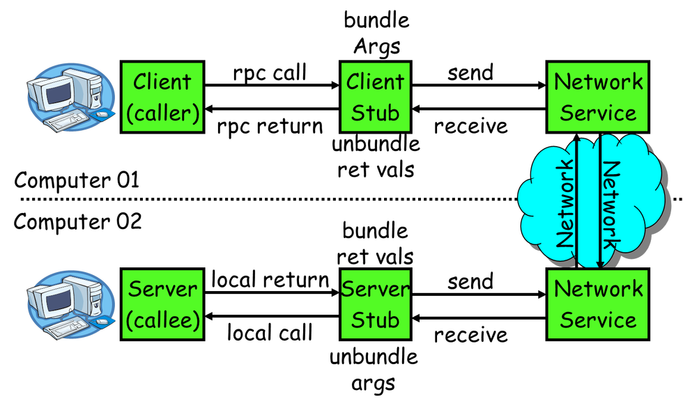

# RPC

RPC(Remote Procedure Call) 即远程过程调用，允许一台计算机调用另一台计算机上的程序得到结果，而代码中不需要做额外的编程，就像在本地调用一样。现在互联网应用的量级越来越大，单台计算机的能力有限，需要借助可扩展的计算机集群来完成，分布式的应用可以借助 RPC 来完成机器之间的调用。

在 RPC 框架中主要有三个角色：Provider、Consumer 和 Registry。Server: 暴露服务的服务提供方。Client: 调用远程服务的服务消费方。Registry: 服务注册与发现的注册中心。服务提供者启动后主动向注册中心注册机器 ip、port 以及提供的服务列表；服务消费者启动时向注册中心获取服务提供方地址列表，可实现软负载均衡和 Failover。

一个完整的 RPC 架构里面包含了四个核心的组件，分别是 Client，Client Stub，Server 以及 Server Stub，这个 Stub 可以理解为存根。

>- 客户端 (Client)，服务的调用方。
>- 客户端存根 (Client Stub)，存放服务端的地址消息，再将客户端的请求参数打包成网络消息，然后通过网络远程发送给服务方。
>- 服务端 (Server)，真正的服务提供者。
>- 服务端存根 (Server Stub)，接收客户端发送过来的消息，将消息解包，并调用本地的方法。

一次完整的调用过程如下：

>- 客户端（client）以本地调用方式（即以接口的方式）调用服务；
>- 客户端存根（client stub）接收到调用后，负责将方法、参数等组装成能够进行网络传输的消息体（将消息体对象序列化为二进制）；
>- 客户端通过 sockets 将消息发送到服务端；
>- 服务端存根 ( server stub）收到消息后进行解码（将消息对象反序列化）；
>- 服务端存根 ( server stub）根据解码结果调用本地的服务；
>- 本地服务执行并将结果返回给服务端存根 ( server stub）；
>- 服务端存根 ( server stub）将返回结果打包成消息（将结果消息对象序列化）；
>- 服务端（server）通过 sockets 将消息发送到客户端；
>- 客户端存根（client stub）接收到结果消息，并进行解码（将结果消息发序列化）；
>- 客户端（client）得到最终结果。

互联网上的机器大都通过 TCP/IP 协议相互访问，但 TCP/IP 只是往远端发送了一段二进制数据，为了建立服务还有很多问题需要抽象：

>- 数据以什么格式传输？不同机器间，网络间可能是不同的字节序，直接传输内存数据显然是不合适的；随着业务变化，数据字段往往要增加或删减，怎么兼容前后不同版本的格式？
>- 一个 TCP 连接可以被多个请求复用以减少开销么？多个请求可以同时发往一个 TCP 连接么 ?
>- 如何管理和访问很多机器？
>- 连接断开时应该干什么？
>- 万一 server 不发送回复怎么办？

我们来看看上面的一些问题是如何解决的：

>- 数据需要序列化，protobuf 在这方面做的不错。用户填写 protobuf::Message 类型的 request，RPC 结束后，从同为 protobuf::Message 类型的 response 中取出结果。protobuf 有较好的前后兼容性，方便业务调整字段。http 广泛使用 json 作为序列化方法。
>- 用户无需关心连接如何建立，但可以选择不同的连接方式：短连接，连接池，单连接。
>- 大量机器一般通过命名服务被发现，可基于 DNS, ZooKeeper, etcd 等实现。在百度内，我们使用 BNS (Baidu Naming Service)。brpc 也提供 "list://" 和 "file://"。用户可以指定负载均衡算法，让 RPC 每次选出一台机器发送请求，包括: round-robin, randomized, consistent-hashing(murmurhash3 or md5) 和 locality-aware。
>- 连接断开时可以重试。
>- 如果 server 没有在给定时间内回复，client 会返回超时错误。
