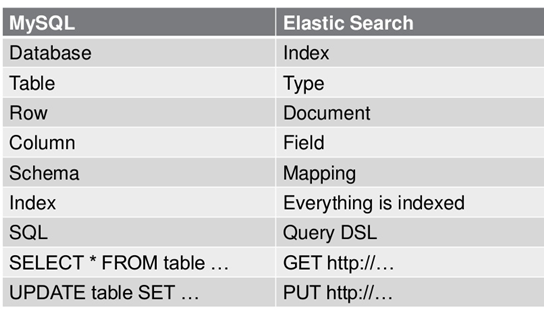

# Elasticsearch

## 补充

### 倒排索引

倒排索引又叫反向索引（右下图）以字或词为文档中出现的位置情况。


在实际的运用中，我们可以对数据库中原始的数据结构（左图），在业务空闲时事先根据左图内容，创建新的倒排索引结构的数据区域（右图）。用户有查询需求时，先访问倒排索引数据区域（右图），得出文档id后，通过文档id即可快速，准确的通过左图找到具体的文档内容。

### Lucene

Lucene是一套用于全文检索和搜寻的开源程序库，由Apache软件基金会支持和提供。Lucene提供了一个简单却强大的应用程序接口（API），能够做全文索引和搜寻，在Java开发环境里Lucene是一个成熟的免费开放源代码工具。另外，它的分布式设计让它天生就适合用于云计算中，并能够达到准实时搜索，而且安装使用方便，还拥有稳定，可靠，快速等特性。Lucene并不是现成的搜索引擎产品，但可以用来制作搜索引擎产品。

全文检索即对文档中全部内容进行分词，然后对所有单词建立倒排索引的过程。

Lucene：底层的API，工具包；Solr：基于Lucene开发的企业级的搜索引擎产品；Elasticsearch：基于Lucene开发的企业级的搜索引擎产品。

Lucene只是一个库。想要使用它，你必须使用Java来作为开发语言并将其直接集成到你的应用中，更糟糕的是，Lucene非常复杂，你需要深入了解检索的相关知识来理解它是如何工作的。Elasticsearch也使用Java开发并使用Lucene作为其核心来实现所有索引和搜索的功能，但是它的目的是通过简单的RESTful API来隐藏Lucene的复杂性，从而让全文搜索变得简单。

## 概述

Elasticsearch是一个开源的高扩展的分布式全文检索引擎，它可以近乎实时的存储、检索数据；本身扩展性很好，可以扩展到上百台服务器，处理PB级别的数据。

Elasticsearch也使用Java开发并使用Lucene作为其核心来实现所有索引和搜索的功能，但是它的目的是通过简单的RESTful API来隐藏Lucene的复杂性，从而让全文搜索变得简单。

## 基本概念

Cluster：集群。ES可以作为一个独立的单个搜索服务器。不过为了处理大型数据集，实现容错和高可用性，ES可以运行在许多互相合作的服务器上。这些服务器的集合称为集群。

Node：节点。形成集群的每个服务器称为节点。

Shard：分片。当有大量的文档时，由于内存的限制、磁盘处理能力不足、无法足够快的响应客户端的请求等，一个节点可能不够。这种情况下，数据可以分为较小的分片。每个分片放到不同的服务器上。 当查询的索引分布在多个分片上时，ES会把查询发送给每个相关的分片，并将结果组合在一起，而应用程序并不知道分片的存在。即该过程对用户来说是透明的。

Replia：副本。为提高查询吞吐量或实现高可用性，可以使用分片副本。 副本是一个分片的精确复制，每个分片可以有零个或多个副本。ES中可以有许多相同的分片，其中之一被选择更改索引操作，这种特殊的分片称为主分片。 当主分片丢失时，如：该分片所在的数据不可用时，集群将副本提升为新的主分片。

## 对比关系型数据库



>- 关系型数据库中的数据库（DataBase），等价于ES中的索引（Index）。
>- 一个数据库下面有N张表（Table），等价于1个索引Index下面有N多类型（Type）。
>- 一个数据库表（Table）下的数据由多行（ROW）多列（column，属性）组成，等价于1个Type由多个文档（Document）和多Field组成。
>- 在一个关系型数据库里面，schema定义了表、每个表的字段，还有表和字段之间的关系。 与之对应的，在ES中：Mapping定义索引下的Type的字段处理规则，即索引如何建立、索引类型、是否保存原始索引JSON文档、是否压缩原始JSON文档、是否需要分词处理、如何进行分词处理等。
>- 在数据库中的增insert、删delete、改update、查search操作等价于ES中的增PUT/POST、删Delete、改_update、查GET。

## ELK

ELK=elasticsearch+Logstash+kibana

elasticsearch：后台分布式存储以及全文检索；logstash: 日志加工、搬运工；kibana：数据可视化展示。

ELK架构为数据分布式存储、可视化查询和日志解析创建了一个功能强大的管理链。 三者相互配合，取长补短，共同完成分布式大数据处理工作。

## 特点和优势

>- 分布式实时文件存储，可将每一个字段存入索引，使其可以被检索到。
>- 实时分析的分布式搜索引擎。
>- 索引分拆成多个分片，每个分片可有零个或多个副本。集群中的每个数据节点都可承载一个或多个分片，并且协调和处理各种操作；负载再平衡和路由在大多数情况下自动完成。
>- 可以扩展到上百台服务器，处理PB级别的结构化或非结构化数据。也可以运行在单台PC上（已测试）。
>- 支持插件机制，分词插件、同步插件、Hadoop插件、可视化插件等。

## 对比(Sphinx+Mysql)

导入MySQL数据生成索引。Elastic Search：RESTful接口；Sphinx：原生支持基于MySQL的表建索引。Elastic Search官方文档上，数据都是使用RESTful接口一条一条插入的，也就是增量更新。有个bulk接口，可以批量导入、大幅加快速度。在数据量非常大的时候，遍历全表重建一次索引会比较消耗时间。在导入MySQL数据生成索引时，从易用性、可靠性、速度上来看，Sphinx优于Elastic Search。Sphinx真的很快。

增量更新支持。Elastic Search优于Sphinx。Elastic Search把增量更新作为首选CURD方式；而Sphinx使用辅助表的方案不但不优雅，还会让你的其他系统变得复杂起来，在你频繁更改单条数据的时候很容易出错。

可视化与辅助工具。Elastic Search优于Sphinx。Kibana，Elastic Search提供的数据可视化界面。Beats，一套收集日志的框架。Logstash，一套日志处理框架。Sphinx Tools，还停留在性能监控的阶段。

搜索算法支持。ElasthcSearch的搜索底层功能基于Lucene，Sphinx也该有的都有。然而Elastic Search的Query DSL支持更复杂的查询逻辑，这一点是超越Sphinx的。在自定义Ranker方面，Elastic Search的Function Score Query比Sphinx的expression-ranker强大许多。总的来说，Elastic Search稍微优于Sphinx。

横向扩展与高可用。Elastic Search是天生为了集群化而设计的，还支持动态加机器，还可以轻松的和Nginx等各类中间件实现负载均衡。Sphinx可以实现分布式，但是比较复杂。

资源占用。Sphinx优于Elastic Search。无论是CPU还是内存占用，Sphinx都比Elastic Search优秀。一些高并发的简单需求会选择Sphinx。

搜索速度。搜索速度主要看怎么配置Cluster，越多搜起来就越快。

如果有定制Ranker的需求，Elastic Search的Functional Score Query可以满足；Elastic Search有更强的横向扩展能力和高可用性；Kibana整出好看的报表。Elastic Search发力非常猛，版本迭代如火箭一般，社区也很活跃。

通常可以使用ES来实现自己的站内搜索引擎，但还是推荐使用MySQL来做原始数据的存储，然后基于MySQL在上层部署ES中间件来实现所需的搜索引擎。MySQL虽然在数据全文检索方面显得有些力不从心，但是因为它的事务功能特性，可以保证不会出现脏数据。而ES对事务方面并无建树，所以不是很适合存储原始数据。当然也可以运用双写的策略，一方面利用MySQL保证原始数据的安全性，另一方面，利用ES的搜索力量。

## 实战

```shell
# 健康状况
# green表示正常
# red表示不是所有主分片都可用
# yellow表示所有主分片可用，但不是所有副本分片都可用，常见于单节点的集群
curl -XGET 'localhost:9200/_cat/health?v'
# 索引状况 closed表示被关闭但未删除
curl -XGET 'localhost:9200/_cat/indices?v'
# 删除索引
curl -XDELETE 'localhost:9200/new-index?pretty'
# 添加索引
curl -XPUT 'localhost:9200/new-index?pretty'
# 添加文档 ID不能重复 否则会覆盖
# 如果不指定ID 系统会生成一个，比如  "_id" : "sA5-9nABEPdMcnXNNwus",
curl -H "Content-Type:application/json" -XPOST 'localhost:9200/man/young/5?pretty' -d '{"name":"Leo","age":"26"}'
# 修改内容 POST修改某个属性；PUT必须带上所有字段
curl -H "Content-Type:application/json" -XPOST 'localhost:9200/man/young/5?pretty' -d '{"age":"21"}'
curl -H "Content-Type:application/json" -XPUT 'localhost:9200/man/young/5?pretty' -d '{"name":"Leo","age":"26"}'
# 搜素所有
curl -XGET 'localhost:9200/man/young/_search?pretty'
curl -H "Content-Type:application/json" -XPOST 'localhost:9200/man/young/_search?pretty' -d '{
  "query":{
    "match_all":{}
  }
}'
# 添加搜索的关键词
curl -XGET 'localhost:9200/man/young/_search?pretty&q=ian'
curl -H "Content-Type:application/json" -XPOST 'localhost:9200/man/young/_search?pretty' -d '{
  "query":{
    "match":{
      "age":"26"
    }
  }
}'
# 分页 es取所有分片的前from+size个结果，汇总后取size个展示
# 因此越取后面的内容，耗时越长，排名也越不靠谱
curl -H "Content-Type:application/json" -XPOST 'localhost:9200/man/young/_search?pretty' -d '{
  "query":{
    "match_all":{}
  },
  "from":0,
  "size":1
}'
# 过滤结果的字段 _source
curl -H "Content-Type:application/json" -XPOST 'localhost:9200/man/young/_search?pretty' -d '{
  "query":{
    "match_all":{}},
    "_source":[
      "name"
    ],
  "from":2,
  "size":2
}'
# 添加条件 必须年龄为26，名字的字典序大于"ian"
# must 必须匹配 shoud 可选匹配 must_not 必须不匹配
curl -H "Content-Type:application/json" -XPOST 'localhost:9200/man/young/_search?pretty' -d '{
  "query":{
    "bool":{
      "must":{
        "match":{
          "age":"26"
        }
      },
      "filter":{
        "range":{
          "name":{
            "gt":"ian"
          }
        }
      }
    }
  }
}'
# match 全文检索 match_phrase 匹配短语
curl -H "Content-Type:application/json" -XPOST 'localhost:9200/man/young/_search?pretty' -d '{
  "query":{
    "match_phrase":{
      "about":"fan of Lady gaga"
    }
  }
}'
# 高亮关键字 <em>lady</em> <em>gaga</em>
curl -H "Content-Type:application/json" -XPOST 'localhost:9200/man/young/_search?pretty' -d '{
  "query":{
    "match":{
      "about":"Lady gaga"
    }
  },
  "highlight":{
    "fields":{
      "about":{}
    }
  }
}'
```

## 练习

```shell
curl -H "Content-Type: application/json" -XPOST 'localhost:9200/_analyze?pretty' -d '{"analyzer":"ik_smart","text":"王者农药"}'

# curl是一个命令行工具，通过HTTP协议传输数据
# -H参数添加HTTP请求的表头，上例指定了content-type
# -X参数指定方法（GET，PUT和POST等），一般省略X与参数之间的空格，默认GET
# 在URI中跳过协议的指定，默认为HTTP
# 在URI周围添加单引号，URI可以包含多个参数，必须使用&符号分割不同的参数
# 用于HTTP请求的URL通常包含pretty或pretty=true，否则默认应答在一行中显示
# -d参数用于发送POST请求的数据体
```

```shell
curl -H "Content-Type: application/json" -XPUT 'localhost:9200/get-together/group/1?pretty' -d '{"name":"Elasticsearch Denver","orgainizer":"Lee"}'

{
  "_index" : "get-together",
  "_type" : "group",
  "_id" : "1",
  "_version" : 1,
  "result" : "created",
  "_shards" : {
    "total" : 2,
    "successful" : 1,
    "failed" : 0
  },
  "_seq_no" : 0,
  "_primary_term" : 1
}
# Es自动创建了一个叫做get-together的索引，并为group类型创建了一个新的映射
````

```shell
curl -XPUT 'localhost:9200/new-index'

{"acknowledged":true,"shards_acknowledged":true,"index":"new-index"}
# 创建新索引
```

```shell
curl "localhost:9200/get-together/group,event/_search?q=elasticsearch&pretty"
# get-together指定在哪个索引下搜索，多个索引使用逗号隔开
# group和event指定在哪个类型下搜索，多个类型使用逗号隔开
# 如果在所有索引内搜索，可以使用_all作为占位符
# q=elasticsearch 指定了查询内容为elasticsearch
{
  "took" : 1,
  "timed_out" : false,
  "_shards" : {
    "total" : 5,
    "successful" : 5,
    "skipped" : 0,
    "failed" : 0
  },
  "hits" : {
    "total" : 2,
    "max_score" : 0.87138504,
    "hits" : [
      {
        "_index" : "get-together",
        "_type" : "group",
        "_id" : "2",
        "_score" : 0.87138504,
        "_source" : {
          "name" : "Elasticsearch Denver",
          "organizer" : "Lee",
          "description" : "Get together to learn more about using Elasticsearch, the applications and neat things you can do with ES!",
          "created_on" : "2013-03-15",
          "tags" : [
            "denver",
            "elasticsearch",
            "big data",
            "lucene",
            "solr"
          ],
          "members" : [
            "Lee",
            "Mike"
          ],
          "location_group" : "Denver, Colorado, USA"
        }
      },
      {
        "_index" : "get-together",
        "_type" : "group",
        "_id" : "3",
        "_score" : 0.2876821,
        "_source" : {
          "name" : "Elasticsearch San Francisco",
          "organizer" : "Mik",
          "description" : "Elasticsearch group for ES users of all knowledge levels",
          "created_on" : "2012-08-07",
          "tags" : [
            "elasticsearch",
            "big data",
            "lucene",
            "open source"
          ],
          "members" : [
            "Lee",
            "Igor"
          ],
          "location_group" : "San Francisco, California, USA"
        }
      }
    ]
  }
}
# took 耗时，单位毫秒； timed_out 搜索是否超时，可以在请求中添加 &timeout=3s 指定超时时间
# _shards 分片信息，在一个拥有5分片的索引中进行搜索，5个分片成功返回
# hits 返回匹配的文档数组，total和max_score是基本统计项

curl -H "Content-Type: application/json" "localhost:9200/get-together/group,event/_search?pretty" -d '{
  "query":{
    "query_string":{
      "query":"elasticsearch"
    }
  }
}'
# 运行一个类型为query_string的查询，字符串内容为elasticsearch
{
  "took" : 2,
  "timed_out" : false,
  "_shards" : {
    "total" : 5,
    "successful" : 5,
    "skipped" : 0,
    "failed" : 0
  },
  "hits" : {
    "total" : 2,
    "max_score" : 0.87138504,
    "hits" : [
      {
        "_index" : "get-together",
        "_type" : "group",
        "_id" : "2",
        "_score" : 0.87138504,
        "_source" : {
          "name" : "Elasticsearch Denver",
          "organizer" : "Lee",
          "description" : "Get together to learn more about using Elasticsearch, the applications and neat things you can do with ES!",
          "created_on" : "2013-03-15",
          "tags" : [
            "denver",
            "elasticsearch",
            "big data",
            "lucene",
            "solr"
          ],
          "members" : [
            "Lee",
            "Mike"
          ],
          "location_group" : "Denver, Colorado, USA"
        }
      },
      {
        "_index" : "get-together",
        "_type" : "group",
        "_id" : "3",
        "_score" : 0.2876821,
        "_source" : {
          "name" : "Elasticsearch San Francisco",
          "organizer" : "Mik",
          "description" : "Elasticsearch group for ES users of all knowledge levels",
          "created_on" : "2012-08-07",
          "tags" : [
            "elasticsearch",
            "big data",
            "lucene",
            "open source"
          ],
          "members" : [
            "Lee",
            "Igor"
          ],
          "location_group" : "San Francisco, California, USA"
        }
      }
    ]
  }
}

curl -H "Content-Type: application/json" "localhost:9200/get-together/group,event/_search?pretty" -d '{
  "query":{
    "query_string":{
      "query":"elasticsearch San Francisco",
      "default_field":"name",
      "default_operator":"AND"
    }
  }
}'
# default_name 指定查找的域; default_operator 默认为OR，返回匹配了任意指定关键词的文档，AND则为全匹配
{
  "took" : 8,
  "timed_out" : false,
  "_shards" : {
    "total" : 5,
    "successful" : 5,
    "skipped" : 0,
    "failed" : 0
  },
  "hits" : {
    "total" : 1,
    "max_score" : 0.8630463,
    "hits" : [
      {
        "_index" : "get-together",
        "_type" : "group",
        "_id" : "3",
        "_score" : 0.8630463,
        "_source" : {
          "name" : "Elasticsearch San Francisco",
          "organizer" : "Mik",
          "description" : "Elasticsearch group for ES users of all knowledge levels",
          "created_on" : "2012-08-07",
          "tags" : [
            "elasticsearch",
            "big data",
            "lucene",
            "open source"
          ],
          "members" : [
            "Lee",
            "Igor"
          ],
          "location_group" : "San Francisco, California, USA"
        }
      }
    ]
  }
}

curl -H "Content-Type: application/json" "localhost:9200/get-together/group/_search?pretty" -d '{
  "query":{
    "term":{
      "name":"elasticsearch"
    }
  }
}'
# term 查询更直接和快速
{
  "took" : 1,
  "timed_out" : false,
  "_shards" : {
    "total" : 5,
    "successful" : 5,
    "skipped" : 0,
    "failed" : 0
  },
  "hits" : {
    "total" : 2,
    "max_score" : 0.87138504,
    "hits" : [
      {
        "_index" : "get-together",
        "_type" : "group",
        "_id" : "2",
        "_score" : 0.87138504,
        "_source" : {
          "name" : "Elasticsearch Denver",
          "organizer" : "Lee",
          "description" : "Get together to learn more about using Elasticsearch, the applications and neat things you can do with ES!",
          "created_on" : "2013-03-15",
          "tags" : [
            "denver",
            "elasticsearch",
            "big data",
            "lucene",
            "solr"
          ],
          "members" : [
            "Lee",
            "Mike"
          ],
          "location_group" : "Denver, Colorado, USA"
        }
      },
      {
        "_index" : "get-together",
        "_type" : "group",
        "_id" : "3",
        "_score" : 0.2876821,
        "_source" : {
          "name" : "Elasticsearch San Francisco",
          "organizer" : "Mik",
          "description" : "Elasticsearch group for ES users of all knowledge levels",
          "created_on" : "2012-08-07",
          "tags" : [
            "elasticsearch",
            "big data",
            "lucene",
            "open source"
          ],
          "members" : [
            "Lee",
            "Igor"
          ],
          "location_group" : "San Francisco, California, USA"
        }
      }
    ]
  }
}

curl "localhost:9200/get-together/group/1?pretty"
# 查询指定ID的文档，同时需指定索引和类型
```
