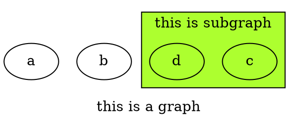
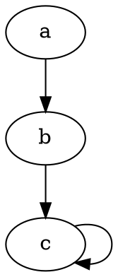
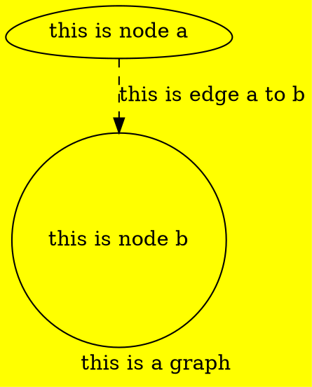

# 简易 Graphviz 使用指南

Dot 是开源工具包 Graphviz 上用来画图的一门脚本语言。通过布局引擎解析脚本得到图像，然后可以将图像导出为各种格式以满足需求。有了它可以很方便地通过编写脚本来画各种结构示意图和流程图。可以通过`dot -Tpng example.dot -o example.png`命令行方式生成图像，或者使用 Graphviz 提供的工具 gvedit 来编辑和运行脚本。

## 图的声明

使用`digraph graph_name`声明一张图，图的具体实现由一对花括号包含起来。
使用`subgraph cluster_subgraph_name`声明一张子图，其中子图名称必须以`cluster`开头。

## 节点和边的声明

键入结点名字`node_name`即可声明一个结点，同时，结点默认的显示内容就是结点名字。当结点内容里面有空格时，我们可以将结点名字用一对双引号包含起来，解析引擎会直接取双引号里面的内容创建结点。使用`->`可以声明一条边。`a->b`就代表一条由结点`a`连接到结点`b`的边。结点可以连接到结点自身。

## 图/节点/边的属性

图的属性设置可以写在graph{}里，或者直接写在外面。

>- `bgcolor`：设置图的背景颜色，可以使用`red`、`blue`、`green`等形式，或者使用 "#rrggbb" 形式。
>- `label`：设置图的描述。`label`会继承到子图，子图里如果不想重复显示必须手动设置
>- `rankdir`：设置图的方向，包括：TB（top to bottom）、BT（bottom to top）、LR（left to right）、RL（right to left）。
>- `rotate`：设置图的旋转。如：rotate = 90便是逆时针旋转90度。
>- `ratio`：设置图的长宽比，可以是一个浮点数，也可以是：`fill`、`compress`或者`auto`。

结点和边的属性设置需要在结点或者边的声明后面加上方括号，然后在方括号里填写属性键值对即可。键值对之间使用逗号进行分割。

结点的常用属性：

>- `shape`：设置结点形状。包括：`Mrecord`（圆角矩形）、`record`（矩形）、`circle`（圆形）、`box`（矩形，和`record`略有区别）、`egg`（蛋形）、`doublecircle`（双圆形）、`plaintext`（纯文本）、 `ellipse`（椭圆，默认）。
>- `label`：设置结点的显示内容，内容用双引号包含，可以使用转义字符。当结点内容 != 结点名时使用
>- `style`：设置结点的样式。包括：`filled`(填充)、`dotted`（点状边框）、`solid`（普通边框）、`dashed`（虚线边框）、`bold`（边框加粗）、`invis`（隐形）。
>- `color`：设置边框颜色。可以使用单词形式或者 "#rrggbb" 形式。
>- `fillcolor`：设置填充颜色，仅`style = filled`时有效。
>- `width`：设置结点宽度。
>- `height`：设置结点高度。
>- `peripheries`：设置结点边框个数。
>- `fontcolor`：设置结点内容颜色。可以使用单词形式或者 "#rrggbb" 形式。

需要重点强调的是：如果设置了`style = filled`，此时设置的`color`是代表整体颜色。但是如果设置了`fillcolor`再设置`color`的话，`color`代表边框颜色。

边的常用属性：

>- `style`：设置边的形状。包括：`solid`（实线）、`dashed`（虚线）、`dotted`（点线）、`bold`（加粗）、`invis`（隐形）。
>- `label`：设置边标签。内容用双引号包含，可以使用转义字符。
>- `color`：设置边颜色。可以使用单词形式或者" #rrggbb" 形式。
>- `arrowhead`：设置结点箭头样式。包括：`none`、`empty`、`odiamond`等。