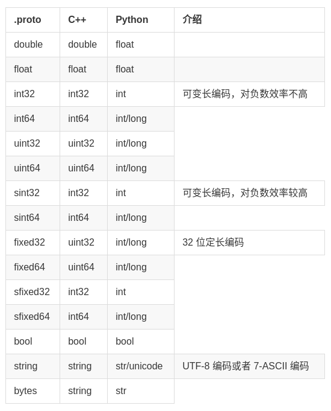
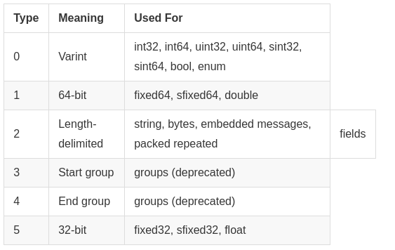

# protobuf

原文链接[url](https://www.jianshu.com/p/419efe983cb2)

protobuf是google团队开发的用于高效存储和读取结构化数据的工具。什么是结构化数据呢，正如字面上表达的，就是带有一定结构的数据。比如电话簿上有很多记录数据，每条记录包含姓名、ID、邮件、电话等，这种结构重复出现。xml、json也可以用来存储此类结构化数据，但是使用protobuf表示的数据能更加高效，并且将数据压缩得更小，大约是json格式的1/10，xml格式的1/20。

下面介绍的内容基于protobuf2.6版本。

## 定义message结构

protobuf将一种结构称为一个message类型，我们以电话簿中的数据为例。

```cpp
messagePerson {
    required string name = 1;
    required int32 id = 2; [default = 0]
    optional string email = 3;
    repeated int32 samples = 4 [packed = true];
}
```

其中Person是message这种结构的名称，name、id、email是其中的Field，每个Field保存着一种数据类型，后面的1、2、3是Filed对应的数字id。id在1-15之间编码只需要占一个字节，包括Filed数据类型和Filed对应数字id，在162047之间编码需要占两个字节，所以最常用的数据对应id要尽量小一些。

Field最前面的required,optional,repeated是这个Filed的规则，分别表示该数据结构中这个Filed有且只有1个，可以是0个或1个，可以是0个或任意个。optional后面可以加default默认值，如果不加，数据类型的默认为0，字符串类型的默认为空串。repeated后面加[packed=true]会使用新的更高效的编码方式。注意：使用required规则的时候要谨慎，因为以后结构若发生更改，这个Filed若被删除的话将可能导致兼容性的问题。

### 保留Filed和保留Filednumber

每个Filed对应唯一的数字id，但是如果该结构在之后的版本中某个Filed删除了，为了保持向前兼容性，需要将一些id或名称设置为保留的，即不能被用来定义新的Field。

messagePerson {
    reserved 2, 15, 9 to 11;
    reserved "samples", "email";
}

### 枚举类型

比如电话号码，只有移动电话、家庭电话、工作电话三种，因此枚举作为选项，如果没设置的话枚举类型的默认值为第一项。在上面的例子中在个人message中加入电话号码这个Filed。如果枚举类型中有不同的名字对应相同的数字id，需要加入optionallow_alias = true这一项，否则会报错。枚举类型中也有reserverdFiled和number，定义和message中一样。

```cpp
message Person {
    required string name = 1;
    required int32 id = 2;
    optional string email = 3;

enum PhoneType {
    // allow_alias = true;
    MOBILE = 0;
    HOME = 1;
    WORK = 2;
}

message PhoneNumber {
    required string number = 1;
    optional PhoneType type = 2 [default = HOME];
}

repeated PhoneNumber phones = 4;
}
```

### 引用其它message类

在同一个文件中，可以直接引用定义过的message类型。在同一个项目中，可以用import来导入其它message类型。

```cpp
import "myproject/other_protos.proto";
```

或者在一个message类型中嵌套定义其它的message类型。

### message扩展

```cpp
message Person {
    //...
    extensions 100 to 199;
}
```

在另一个文件中，import这个proto之后，可以对Person这个message进行扩展。

```cpp
extend Person{
    optional int32 bar = 126;
}
```

## 数据类型对应关系

在使用规则创建proto类型的数据结构文件之后，会将其转化成对应编程语言中的头文件或者类定义。



## 编码规则

protobuf 有一套高效的数据编码规则。

### 可变长整数编码

每个字节有8bits，其中第一个bit是most significant bit(msb)，0表示结束，1表示还要读接下来的字节。对message中每个Filed来说，需要编码它的数据类型、对应id以及具体数据。数据类型有以下6种，可以用3个bits表示。每个整数编码用最后3个bits表示数据类型。所以，对应id在1~15之间的Filed，可以用1个字节编码数据类型、对应id。



### 有符号整数编码

如果用int32来保存一个负数，结果总是有10个字节长度，被看做是一个非常大的无符号整数。使用有符号类型会更高效。它使用一种ZigZag的方式进行编码。即-1编码成1，1编码成2，-2编码成3这种形式。也就是说，对于int32来说，n编码成 (n << 1) ^ (n >> 31)，注意到第二个移位是算法移位。

### 定长编码

定长编码是比较简单的情况。

## 总结

一种轻便高效的数据格式，平台无关、语言无关、可扩展，可用于通讯协议和数据存储等领域。

>- 平台无关，语言无关，可扩展；
>- 提供了友好的动态库，使用简单；
>- 解析速度快，比对应的XML快约20-100倍；
>- 序列化数据非常简洁、紧凑，与XML相比，其序列化之后的数据量约为1/3到1/10。
