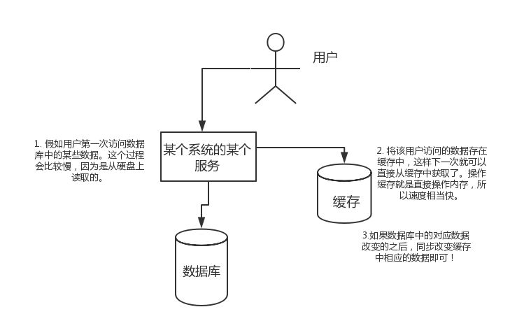
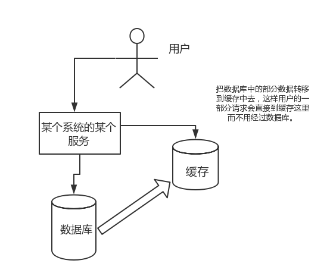

# Redis 数据库

与传统数据库相比，Redis的数据是存在内存中的，所以存写速度非常快，因此Redis被广泛应用于缓存方向。另外，Redis也经常用来做分布式锁。Redis提供了多种数据类型来支持不同的业务场景。除此之外，Redis支持事务、持久化、LUA脚本、LRU驱动事件、多种集群方案。

## 为什么要用Redis/为什么要用缓存

### 高性能

假如用户第一次访问数据库中的某些数据。这个过程会比较慢，因为是从硬盘上读取的。将该用户访问的数据存在缓存中，这样下一次再访问这些数据的时候就可以直接从缓存中获取了。操作缓存就是直接操作内存，所以速度相当快。如果数据库中的对应数据改变了之后，同步改变缓存中相应的数据即可。



### 高并发

直接操作缓存能够承受的请求是远远大于直接访问数据库的，可以考虑把数据库中的部分数据转移到缓存中去，这样用户的一部分请求会直接到缓存这里而不用经过数据库。



## 为什么要用Redis而不用map/guava做缓存

缓存分为本地缓存和分布式缓存。以Java为例，使用自带的map或者guava实现的是本地缓存，最主要的特点是轻量以及快速，生命周期随着JVM的销毁而结束。并且在多实例的情况下，每个实例都需要各自保存一份缓存，缓存不具有一致性。使用Redis或Memcached之类的称为分布式缓存，在多实例的情况下，各实例共用一份缓存数据，缓存具有一致性。缺点是需要保持Redis或Memcached服务的高可用，整个程序架构上较为复杂。

## Redis和Memcached的区别

>- Redis支持更丰富的数据类型，支持更复杂的应用场景。Redis不仅仅支持简单的K/V类型的数据，同时还提供list、set、zset、hash等数据结构的存储。Memcache支持简单的数据类型String。
>- Redis支持数据的持久化，可以将内存中的数据保持在磁盘中，重启的时候可以再次加载进行使用。Memecache把数据全部存在内存之中。
>- Redis目前原生支持Cluster模式。Memcached没有原生的集群模式，需要依靠客户端来实现往集群中分片写入数据。
>- Memcached是多线程，非阻塞IO复用的网络模型。Redis使用单线程的多路IO复用模型。


## Redis常见数据结构以及使用场景分析

```shell
SET [key] [value]
GET [key]
DUMP [key]   // 序列化给定的key，返回序列化的值
EXISTS [key]
EXPIRE [key] seconds // 设置过期时间，以秒计
EXPIREAT [key] [timestamp]  // 设置过期时间戳
PERSIST [key] // 移除过期时间，永久保持
TTL [key] // 返回过期时间，以秒计
KEYS [pattern]  // 查找所有符合给定模式( pattern)的 key
RENAME [key] [newkey] // 修改key的名称
RENAMENX [key] [newkey] // 修改key的名称，仅当newkey不存在时
```

String。常用命令：set、get、decr、incr、mget等。String数据结构是简单的Key-Value类型，Value其实不仅可以是String，也可以是数字。string 类型是二进制安全的。意思是Redis的String可以包含任何数据。比如jpg图片或者序列化的对象。String类型是Redis最基本的数据类型，String类型的值最大能存储512MB。常规Key-Value缓存应用；常规计数：微博数，粉丝数等。

```shell
MGET [key1] [key2] [key3]
SETNX [key] [value]  // 只有在key不存在时设置key的值
INCR [key]  //  将key中储存的数字值增一
INCR [key] [inc] //  将key中储存的数字值增加指定的值
INCRBYFLOAT [key] [inc] // 增量为浮点值
DECR [key]  //  将key中储存的数字值增一
DECR [key] [inc] //  将key中储存的数字值增加指定的值
APPEND [key] [value] // 字符串的value追加内容
```

Hash。常用命令：hget、hset、hgetall等。Hash是一个String类型的Field和Value的映射表，Hash特别适合用于存储对象。每个hash可以存储2^32-1键值对（40多亿）后续操作时可以直接仅仅修改这个对象中的某个字段的值。比如可以Hash数据结构来存储用户信息，商品信息等等。在做单点登录的时候，就是用这种数据结构存储用户信息，以cookieId作为key，设置30分钟为缓存过期时间，能很好的模拟出类似session的效果。

```shell
HMSET [hash_name-key] [field1] [value] [field2] [value] [field3] [value]
HGET [hash_name-key] [field]
HDEL [hash_name-key] [field1] [field2]
HGETALL [hash_name-key] // 获取在哈希表的所有字段和值
HINCRBY [hash_name-key] [field] [incr]
HINCRBYFLOAT [hash_name-key] [field] [incr]
HLEN [key] // field的数量
```

List。常用命令：lpush、rpush、lpop、rpop、lrange等。List就是链表，可以添加一个元素到列表的头部（左边）或者尾部（右边）。Redis List的应用场景非常多，也是Redis最重要的数据结构之一。比如微博的关注列表，粉丝列表，消息列表等功能都可以用Redis的List结构来实现。RedisList的实现为一个双向链表，即可以支持反向查找和遍历，更方便操作，不过带来了部分额外的内存开销。另外可以通过lrange命令，就是从某个元素开始读取多少个元素，可以基于List实现分页查询。这是很棒的一个功能，基于Redis实现简单的高性能分页，可以做类似微博那种下拉不断分页的东西（一页一页的往下走）。

```shell
LPUSH [list_name-key] [value]
RPOP [list_name-key]
LRANGE [list_name-key] [begin_idx] [end_idx]
BLPOP [list_name-key1] [list_name-key2] [timeout] // 移出并获取列表第一个元素，没有会阻塞或者等到超时
BRPOP [list_name-key1] [list_name-key2] [timeout] // 移出并获取列表最后一个元素，没有会阻塞或者等到超时
LINDEX [list_name-key] [index] // 通过索引获得value
LINSERT [list_name-key] [BEFORE|AFTER] [pivot] [value] 在列表的元素前或者后插入元素
```

Set。无序集合，集合是通过哈希表实现的，所以添加，删除，查找的复杂度都是 O(1)。。常用命令：sadd、spop、smembers、sunion等。Set对外提供的功能与List类似是一个列表的功能，特殊之处在于Set是可以自动去重的。当需要存储一个列表数据，又不希望出现重复数据时，Set是一个很好的选择。并且Set提供了判断某个成员是否在一个Set集合内的重要接口，这个也是List所不能提供的。可以基于Set轻易实现交集、并集、差集的操作。比如：在微博应用中，可以将一个用户所有的关注人存在一个集合中，将其所有粉丝存在一个集合。Redis可以非常方便的实现如共同关注、共同粉丝、共同喜好等功能。为什么不用JVM自带的Set进行去重？因为系统一般都是集群部署，使用JVM自带的Set，比较麻烦，难道为了一个做一个全局去重，再起一个公共服务？

```shell
SADD [set_name-key] [member]
SMEMBERS [set_name-key]
SCARD [set_name-key]  //  成员数
SISMEMBER [set_name-key] [member]  // 判断member元素是否是集合成员
SPOP [set_name-key]  // 移除并返回集合中的一个随机元素
SREM [set_name-key] [member1] [member2]   //  移除集合中一个或多个成员
SSCAN [set_name-key] [cursor] [MATCH pattern] [COUNT count] // 迭代集合中的元素
```

SortedSet。 zset和set一样也是string类型元素的集合，且不允许重复的成员。
不同的是每个元素都会关联一个double类型的分数。redis正是通过分数来为集合中的成员进行从小到大的排序。常用命令：zadd、zrange、zrem、zcard等。和Set相比，SortedSet增加了一个权重参数Score，使得集合中的元素能够按Score进行有序排列。可以做排行榜应用，取TOPN操作。sortedset可以用来做延时任务。最后一个应用就是可以做范围查找。举例：在直播系统中，实时排行信息包含直播间在线用户列表，各种礼物排行榜，弹幕消息（可以理解为按消息维度的消息排行榜）等信息，适合使用Redis中的SortedSet结构进行存储。

```shell
ZADD [zset_name-key] [score] [member]
ZRANGE [zset_name-key] [begin_idx] [end_idx] [WITHSCORES]  //  通过索引区间返回有序集合指定区间内的成员
ZRANGEBYLEX [zset_name-key] [min] [max] [LIMIT offset count] // 通过字典区间返回有序集合的成员
ZRANGEBYSCORE [zset_name-key] [min] [max] [WITHSCORES] [LIMIT]  // 通过分数返回有序集合指定区间内的成员
ZCARD [zset_name-key]  //  获取有序集合的成员数
ZCOUNT [zset_name-key] [min] [max]   // 计算在有序集合中指定区间分数的成员数
ZRANK [zset_name-key] [member]  //  返回有序集合中指定成员的索引
ZREVRANK [zset_name-key] [member]  //  返回有序集合中指定成员的排名（逆序，从大到小）
ZREM [zset_name-key] [member1] [member2]   // 移除有序集合中的一个或多个成员
ZINCRBY [zset_name-key] [inc] [member]  //  有序集合中对指定成员的分数加上增量
ZSCORE [zset_name-key] [member]  // 返回有序集中，成员的分数值
```

## Redis设置过期时间

Redis中有个设置过期时间的功能，即对存储在Redis数据库中的值可以设置一个过期时间。作为一个缓存数据库，这是非常实用的。比如一般项目中的Token或者一些登录信息，尤其是短信验证码都是有时间限制的，按照传统的数据库处理方式，一般都是自己判断过期，这样无疑会严重影响项目性能。在SetKey的时候，都可以给一个ExpireTime，即过期时间，通过过期时间我们可以指定这个Key可以存活的时间。如果设置了一批Key只能存活1个小时，那么接下来1小时后，Redis是怎么对这批Key进行删除的？答案是：定期删除+惰性删除。

>- 定期删除：Redis默认是每隔100ms就随机抽取一些设置了过期时间的Key，检查其是否过期，如果过期就删除。为什么要随机呢？假如Redis存了几十万个Key，每隔100ms就遍历所有的设置过期时间的Key的话，就会给CPU带来很大的负载。
>- 惰性删除：定期删除可能会导致很多过期Key到了时间并没有被删除掉。所以就有了惰性删除。假如过期Key，靠定期删除没有被删除掉，还停留在内存里。当系统去查一下那个Key，发现key过期才会删掉。

但是仅仅通过设置过期时间还是有问题的。如果定期删除漏掉了很多过期Key，惰性删除也漏掉了这些key，那么有可能大量过期Key堆积在内存里导致Redis内存块耗尽。怎么解决这个问题呢？内存淘汰机制。

## Redis内存淘汰机制

Redis提供6种数据淘汰策略：

>- volatile-lru：从已设置过期时间的数据集（server.db[i].expires）中挑选最近最少使用的数据淘汰。
>- volatile-ttl：从已设置过期时间的数据集（server.db[i].expires）中挑选将要过期的数据淘汰。
>- volatile-random：从已设置过期时间的数据集（server.db[i].expires）中任意选择数据淘汰。
>- allkeys-lru：当内存不足以容纳新写入数据时，在键空间中，移除最近最少使用的key（这个是最常用的）。
>- allkeys-random：从数据集（server.db[i].dict）中任意选择数据淘汰。
>- no-enviction：禁止驱逐数据，也就是说当内存不足以容纳新写入数据时，新写入操作会报错。这个应该没人使用吧！

## Redis持久化机制

怎么保证Redis挂掉之后再重启数据可以进行恢复？很多时候需要持久化数据也，就是将内存中的数据写入到硬盘里面。大部分原因是为了之后重用数据（比如重启机器、机器故障之后恢复数据），或者是为了防止系统故障而将数据备份到一个远程位置。Redis不同于Memcached的很重要一点就是，Redis支持持久化，而且支持两种不同的持久化操作。Redis的一种持久化方式叫快照（snapshotting，RDB），另一种方式是只追加文件（append-onlyfile，AOF）。

### 快照（snapshotting）持久化（RDB）

Redis可以通过创建快照来获得存储在内存里面的数据在某个时间点上的副本。Redis创建快照之后，可以对快照进行备份，可以将快照复制到其他服务器从而创建具有相同数据的服务器副本（Redis主从结构，主要用来提高Redis性能），还可以将快照留在原地以便重启服务器的时候使用。快照持久化是Redis默认采用的持久化方式，在Redis.conf配置文件中默认有此下配置：

```shell
 # 在900秒(15分钟)之后，如果至少有1个key发生变化，Redis就会自动触发BGSAVE命令创建快照。
save 900 1
# 在300秒(5分钟)之后，如果至少有10个key发生变化，Redis就会自动触发BGSAVE命令创建快照。
save 300 10
```

### AOF（append-only file）持久化

与快照持久化相比，AOF持久化的实时性更好，已成为主流的持久化方案。默认情况下Redis没有开启AOF（append only file）方式的持久化，可以通过appendonly参数开启：

```shell
appendonly yes
```

开启AOF持久化后每执行一条会更改Redis中的数据的命令，Redis就会将该命令写入硬盘中的AOF文件。AOF文件的保存位置和RDB文件的位置相同，都是通过dir参数设置的，默认的文件名是appendonly.aof。在Redis的配置文件中存在三种不同的AOF持久化方式，它们分别是：

>- appendfsync always。每次有数据修改发生时都会写入AOF文件，这样会严重降低Redis的速度。
>- appendfsync everysec。每秒钟同步一次，显示地将多个写命令同步到硬盘。
>- appendfsync no。让操作系统决定何时进行同步。

为了兼顾数据和写入性能，用户可以考虑appendfsynceverysec选项，让Redis每秒同步一次AOF文件，Redis性能几乎没受到任何影响。而且这样即使出现系统崩溃，用户最多只会丢失一秒之内产生的数据。当硬盘忙于执行写入操作的时候，Redis还会优雅的放慢自己的速度以便适应硬盘的最大写入速度。

### Redis4.0对于持久化机制的优化

Redis4.0开始支持RDB和AOF的混合持久化（默认关闭，可以通过配置项aof-use-rdb-preamble开启）。如果把混合持久化打开，AOF重写的时候就直接把RDB的内容写到AOF文件开头。这样做的好处是可以结合RDB和AOF的优点,快速加载同时避免丢失过多的数据。当然缺点也是有的，AOF里面的RDB部分是压缩格式不再是AOF格式，可读性较差。

### 补充内容：AOF重写

AOF重写可以产生一个新的AOF文件，这个新的AOF文件和原有的AOF文件所保存的数据库状态一样，但体积更小。AOF重写是一个有歧义的名字，该功能是*通过读取数据库中的键值对来实现的，程序无须对现有AOF文件进行任伺读入、分析或者写入操作*。在执行BGREWRITEAOF命令时，Redis服务器会维护一个AOF重写缓冲区，该缓冲区会在子进程创建新AOF文件期间，记录服务器执行的所有写命令。当子进程完成创建新AOF文件的工作之后，服务器会将重写缓冲区中的所有内容追加到新AOF文件的末尾，使得新旧两个AOF文件所保存的数据库状态一致。最后，服务器用新的AOF文件替换旧的AOF文件，以此来完成AOF文件重写操作。

### Redis事务

Redis通过MULTI、EXEC、WATCH等命令来实现事务(transaction)功能。事务提供了一种将多个命令请求打包，然后一次性、按顺序地执行多个命令的机制。并且在事务执行期间，服务器不会中断事务而改去执行其他客户端的命令请求，它会将事务中的所有命令都执行完毕，然后才去处理其他客户端的命令请求。在传统的关系式数据库中，常常用ACID性质来检验事务功能的可靠性和安全性。在Redis中，事务总是具有原子性（Atomicity)、一致性(Consistency)和隔离性（Isolation），并且当Redis运行在某种特定的持久化模式下时，事务也具有持久性（Durability）。

Redis 事务可以一次执行多个命令， 并且带有以下三个重要的保证：

>- 批量操作在发送 EXEC 命令前被放入队列缓存。
>- 收到 EXEC 命令后进入事务执行，事务中任意命令执行失败，其余的命令依然被执行。
>- 在事务执行过程，其他客户端提交的命令请求不会插入到事务执行命令序列中。

单个 Redis 命令的执行是原子性的，但 Redis 没有在事务上增加任何维持原子性的机制，所以 Redis 事务的执行并不是原子性的。事务可以理解为一个打包的批量执行脚本，但批量指令并非原子化的操作，中间某条指令的失败不会导致前面已做指令的回滚，也不会造成后续的指令不做。所以挺垃圾的。

## 缓存雪崩和缓存穿透问题解决方案

### 缓存雪崩

缓存同一时间大面积的失效，所以后面的请求都会落到数据库上，造成数据库短时间内承受大量请求而崩掉。

>- 使用互斥锁，但是该方案吞吐量明显下降了。
>- 给缓存的失效时间，加上一个随机值，避免集体失效。
>- 双缓存。比如有两个缓存，A和B。缓存A的失效时间为20分钟，缓存B不设失效时间。自己做缓存预热操作。从缓存A读数据库，有则直接返回。A没有数据，直接从B读数据，直接返回，并且异步启动一个更新线程。更新线程同时更新缓存A和缓存B。

### 缓存穿透

一般是黑客故意去请求缓存中不存在的数据，导致所有的请求都落到数据库上，造成数据库短时间内承受大量请求而崩掉。

>- 利用互斥锁，缓存失效的时候，先去获得锁，得到锁了，再去请求数据库。没得到锁，则休眠一段时间重试。
>- 采用异步更新策略，无论key是否取到值，都直接返回。value值中维护一个缓存失效时间，缓存如果过期，异步起一个线程去读数据库，更新缓存。需要做缓存预热(项目启动前，先加载缓存)操作。
>- 提供一个能迅速判断请求是否有效的拦截机制，比如利用布隆过滤器，内部维护一系列合法有效的key。迅速判断出请求所携带的Key是否合法有效。如果不合法则直接返回。

## 如何解决Redis的并发竞争Key问题

所谓Redis的并发竞争Key的问题也就是多个系统同时对一个Key进行操作，但是最后执行的顺序和我们期望的顺序不同，这样也就导致了结果的不同。

推荐一种方案：分布式锁（ZooKeeper和Redis都可以实现分布式锁）。如果不存在Redis的并发竞争Key问题，不要使用分布式锁，这样会影响性能。基于ZooKeeper临时有序节点可以实现的分布式锁。

每个客户端对某个方法加锁时，在ZooKeeper上的与该方法对应的指定节点的目录下，生成一个唯一的瞬时有序节点。判断是否获取锁的方式很简单，只需要判断有序节点中序号最小的一个。当释放锁的时候，只需将这个瞬时节点删除即可。同时可以避免服务宕机导致的锁无法释放，而产生的死锁问题。完成业务流程后，删除对应的子节点释放锁。在实践中，当然是以可靠性为主，所以首推ZooKeeper。

## Redis和数据库双写一致性问题

一致性问题是分布式常见问题，还可以再分为最终一致性和强一致性。数据库和缓存双写，就必然会存在不一致的问题。如果对数据有强一致性要求，就不能放缓存。我们所做的一切，只能保证最终一致性。另外，我们所做的方案其实从根本上来说，只能说降低不一致发生的概率，无法完全避免。因此，有强一致性要求的数据，不能放缓存。

首先，采取正确更新策略，先更新数据库，再删缓存。其次，因为可能存在删除缓存失败的问题，提供一个补偿措施即可，例如利用消息队列。

## Redis 数据结构

### dict

在Redis中，dict是一个基于哈希表的算法。和传统的哈希算法类似，它采用某个哈希函数从key计算得到在哈希表中的位置，采用拉链法解决冲突，并在装载因子（load factor）超过预定值时自动扩展内存，引发重哈希（rehashing）。

Redis的dict实现最显著的一个特点，就在于它的重哈希。它采用了一种称为增量式重哈希（incremental rehashing）的方法，在需要扩展内存时避免一次性对所有key进行重哈希，而是将重哈希操作分散到对于dict的各个增删改查的操作中去。这种方法能做到每次只对一小部分key进行重哈希，而每次重哈希之间不影响dict的操作。dict之所以这样设计，是为了避免重哈希期间单个请求的响应时间剧烈增加，这与前面提到的“快速响应时间”的设计原则是相符的。

在重哈希的过程中，有两个哈希桶有效，查找需要先后在两个表中查找；所有操作都会将一部分key从就表转移到新表，直到重哈希过程结束，旧的哈希表失效，只使用新的哈希表。

### sds

sds正是在Redis中被广泛使用的字符串结构，它的全称是Simple Dynamic String。与其它语言环境中出现的字符串相比，它具有如下显著的特点：可动态扩展内存。sds表示的字符串其内容可以修改，也可以追加。在很多语言中字符串会分为mutable和immutable两种，显然sds属于mutable类型的。二进制安全（Binary Safe）。sds能存储任意二进制数据，而不仅仅是可打印字符。与传统的C语言字符串类型兼容。

sds是Binary Safe的，它可以存储任意二进制数据，不能像C语言字符串那样以字符‘\0‘来标识字符串的结束，因此它必然有个长度字段。但这个长度字段在哪里呢？实际上sds还包含一个header结构。sds一共有5种类型的header。之所以有5种，是为了能让不同长度的字符串可以使用不同大小的header。这样，短字符串就能使用较小的header，从而节省内存。

一个sds字符串的完整结构，由在内存地址上前后相邻的两部分组成：一个header。通常包含字符串的长度(len)、最大容量(alloc)和flags。sdshdr5有所不同。一个字符数组。这个字符数组的长度等于最大容量+1。真正有效的字符串数据，其长度通常小于最大容量。在真正的字符串数据之后，是空余未用的字节（一般以字节0填充），允许在不重新分配内存的前提下让字符串数据向后做有限的扩展。在真正的字符串数据之后，还有一个NULL结束符，即ASCII码为0的’\0’字符。这是为了和传统C字符串兼容。之所以字符数组的长度比最大容量多1个字节，就是为了在字符串长度达到最大容量时仍然有1个字节存放NULL结束符。

```c
struct __attribute__ ((__packed__)) sdshdr5 {
    unsigned char flags; /* 3 lsb of type, and 5 msb of string length */
    char buf[];
};
struct __attribute__ ((__packed__)) sdshdr8 {
    uint8_t len; /* used */
    uint8_t alloc; /* excluding the header and null terminator */
    unsigned char flags; /* 3 lsb of type, 5 unused bits */
    char buf[];
};
struct __attribute__ ((__packed__)) sdshdr16 {
    uint16_t len; /* used */
    uint16_t alloc; /* excluding the header and null terminator */
    unsigned char flags; /* 3 lsb of type, 5 unused bits */
    char buf[];
};
struct __attribute__ ((__packed__)) sdshdr32 {
    uint32_t len; /* used */
    uint32_t alloc; /* excluding the header and null terminator */
    unsigned char flags; /* 3 lsb of type, 5 unused bits */
    char buf[];
};
struct __attribute__ ((__packed__)) sdshdr64 {
    uint64_t len; /* used */
    uint64_t alloc; /* excluding the header and null terminator */
    unsigned char flags; /* 3 lsb of type, 5 unused bits */
    char buf[];
};
```

在各个header的定义中使用了__attribute__ ((packed))，是为了让编译器以紧凑模式来分配内存。如果没有这个属性，编译器可能会为struct的字段做优化对齐，在其中填充空字节。那样的话，就不能保证header和sds的数据部分紧紧前后相邻，也不能按照固定向低地址方向偏移1个字节的方式来获取flags字段了。

在各个header的定义中最后有一个char buf[]。我们注意到这是一个没有指明长度的字符数组，这是C语言中定义字符数组的一种特殊写法，称为柔性数组（flexible array member），只能定义在一个结构体的最后一个字段上。它在这里只是起到一个标记的作用，表示在flags字段后面就是一个字符数组，或者说，它指明了紧跟在flags字段后面的这个字符数组在结构体中的偏移位置。而程序在为header分配的内存的时候，它并不占用内存空间。如果计算sizeof(struct sdshdr16)的值，那么结果是5个字节，其中没有buf字段。

sdshdr5与其它几个header结构不同，它不包含alloc字段，而长度使用flags的高5位来存储。因此，它不能为字符串分配空余空间。如果字符串需要动态增长，那么它就必然要重新分配内存才行。所以说，这种类型的sds字符串更适合存储静态的短字符串（长度小于32）。

sds字符串的header，其实隐藏在真正的字符串数据的前面（低地址方向）。这样的一个定义，有如下几个好处：header和数据相邻，而不用分成两块内存空间来单独分配。这有利于减少内存碎片，提高存储效率（memory efficiency）。虽然header有多个类型，但sds可以用统一的char *来表达。且它与传统的C语言字符串保持类型兼容。如果一个sds里面存储的是可打印字符串，那么我们可以直接把它传给C函数，比如使用strcmp比较字符串大小，或者使用printf进行打印。

### robj

从Redis的使用者的角度来看，一个Redis节点包含多个database（非cluster模式下默认是16个，cluster模式下只能是1个），而一个database维护了从key space到object space的映射关系。这个映射关系的key是string类型，而value可以是多种数据类型，比如：string, list, hash等。我们可以看到，key的类型固定是string，而value可能的类型是多个。

而从Redis内部实现的角度来看，在前面第一篇文章中，我们已经提到过，一个database内的这个映射关系是用一个dict来维护的。dict的key固定用一种数据结构来表达就够了，这就是动态字符串sds。而value则比较复杂，为了在同一个dict内能够存储不同类型的value，这就需要一个通用的数据结构，这个通用的数据结构就是robj（全名是redisObject）。举个例子：如果value是一个list，那么它的内部存储结构是一个quicklist（quicklist的具体实现我们放在后面的文章讨论）；如果value是一个string，那么它的内部存储结构一般情况下是一个sds。当然实际情况更复杂一点，比如一个string类型的value，如果它的值是一个数字，那么Redis内部还会把它转成long型来存储，从而减小内存使用。而一个robj既能表示一个sds，也能表示一个quicklist，甚至还能表示一个long型。

```c
#define LRU_BITS 24
typedef struct redisObject {
    unsigned type:4;
    unsigned encoding:4;
    unsigned lru:LRU_BITS; /* lru time (relative to server.lruclock) */
    int refcount;
    void *ptr;
} robj;
```

robj所表示的就是Redis对外暴露的第一层面的数据结构：string, list, hash, set, sorted set，而每一种数据结构的底层实现所对应的是哪个（或哪些）第二层面的数据结构（dict, sds, ziplist, quicklist, skiplist, 等），则通过不同的encoding来区分。可以说，robj是联结两个层面的数据结构的桥梁。

### ziplist

ziplist是一个经过特殊编码的双向链表，它的设计目标就是为了提高存储效率。ziplist可以用于存储字符串或整数，其中整数是按真正的二进制表示进行编码的，而不是编码成字符串序列。它能以O(1)的时间复杂度在表的两端提供push和pop操作。

实际上，ziplist充分体现了Redis对于存储效率的追求。一个普通的双向链表，链表中每一项都占用独立的一块内存，各项之间用地址指针（或引用）连接起来。这种方式会带来大量的内存碎片，而且地址指针也会占用额外的内存。而ziplist却是将表中每一项存放在前后连续的地址空间内，一个ziplist整体占用一大块内存。它是一个表（list），但其实不是一个链表（linked list）。

另外，ziplist为了在细节上节省内存，对于值的存储采用了变长的编码方式，大概意思是说，对于大的整数，就多用一些字节来存储，而对于小的整数，就少用一些字节来存储。

ziplist的数据类型，没有用自定义的struct之类的来表达，而就是简单的unsigned char *。这是因为ziplist本质上就是一块连续内存，内部组成结构又是一个高度动态的设计（变长编码），也没法用一个固定的数据结构来表达。

```txt
// 从宏观上看，ziplist的内存结构如下：
<zlbytes><zltail><zllen><entry>...<entry><zlend>
// 每一个数据项<entry>的构成：
<prevrawlen><len><data>
```

hash是Redis中可以用来存储一个对象结构的比较理想的数据类型。一个对象的各个属性，正好对应一个hash结构的各个field。如果把对象的多个属性存储到多个key上（各个属性值存成string），当然占的内存要多。但如果采用一些序列化方法，比如Protocol Buffers，或者Apache Thrift，先把对象序列化为字节数组，然后再存入到Redis的string中，那么跟hash相比，哪一种更省内存，就不一定了。

hash比序列化后再存入string的方式，在支持的操作命令上，还是有优势的：它既支持多个field同时存取（hmset/hmget），也支持按照某个特定的field单独存取（hset/hget）。

实际上，hash随着数据的增大，其底层数据结构的实现是会发生变化的，当然存储效率也就不同。在field比较少，各个value值也比较小的时候，hash采用ziplist来实现；而随着field增多和value值增大，hash可能会变成dict来实现。当hash底层变成dict来实现的时候，它的存储效率就没法跟那些序列化方式相比了。

### quicklist

Redis对外暴露的上层list数据类型，经常被用作队列使用。当然，list也支持在任意中间位置的存取操作，比如lindex和linsert，但它们都需要对list进行遍历，所以时间复杂度较高，为O(N)。

概况起来，list具有这样的一些特点：它是一个能维持数据项先后顺序的列表（各个数据项的先后顺序由插入位置决定），便于在表的两端追加和删除数据，而对于中间位置的存取具有O(N)的时间复杂度。这不正是一个双向链表所具有的特点吗？

list的内部实现quicklist正是一个双向链表，而且是一个ziplist的双向链表。ziplist本身也是一个能维持数据项先后顺序的列表（按插入位置），而且是一个内存紧缩的列表（各个数据项在内存上前后相邻）。比如，一个包含3个节点的quicklist，如果每个节点的ziplist又包含4个数据项，那么对外表现上，这个list就总共包含12个数据项。

双向链表便于在表的两端进行push和pop操作，但是它的内存开销比较大。首先，它在每个节点上除了要保存数据之外，还要额外保存两个指针；其次，双向链表的各个节点是单独的内存块，地址不连续，节点多了容易产生内存碎片。ziplist由于是一整块连续内存，所以存储效率很高。但是，它不利于修改操作，每次数据变动都会引发一次内存的realloc。特别是当ziplist长度很长的时候，一次realloc可能会导致大批量的数据拷贝，进一步降低性能。

于是，结合了双向链表和ziplist的优点，quicklist就应运而生了。不过，这也带来了一个新问题：到底一个quicklist节点包含多长的ziplist合适呢？这又是一个需要找平衡点的难题。这可能取决于具体应用场景。实际上，Redis提供了一个配置参数list-max-ziplist-size，就是为了让使用者可以来根据自己的情况进行调整。

### skiplist

Redis里面使用skiplist是为了实现sorted set这种对外的数据结构。sorted set提供的操作非常丰富，可以满足非常多的应用场景。这也意味着，sorted set相对来说实现比较复杂。skiplist本质上也是一种查找结构，用于解决算法中的查找问题（Searching），即根据给定的key，快速查到它所在的位置（或者对应的value）。

一般查找问题的解法分为两个大类：一个是基于各种平衡树，一个是基于哈希表。但skiplist却比较特殊，它没法归属到这两大类里面。skiplist，顾名思义，首先它是一个list。实际上，它是在有序链表的基础上发展起来的。在单一链表上查找只能顺序查找，效率是O（n）。如果在第一层上再加入一个链表，取出相隔的节点构成一个二层链表，这样所有新增加的指针连成了一个新的链表，但它包含的节点个数只有原来的一半。现在当想查找数据的时候，可以先沿着这个新链表进行查找。当碰到比待查数据大的节点时，再回到原来的链表中进行查找，这样查找的速度增加了一倍。以此类推可以继续增加新的链表。可以想象，当链表足够长的时候，这种多层链表的查找方式能让我们跳过很多下层节点，大大加快查找的速度。

skiplist正是受这种多层链表的想法的启发而设计出来的。实际上，按照上面生成链表的方式，上面每一层链表的节点个数，是下面一层的节点个数的一半，这样查找过程就非常类似于一个二分查找，使得查找的时间复杂度可以降低到O(log n)。但是，这种方法在插入数据的时候有很大的问题。新插入一个节点之后，就会打乱上下相邻两层链表上节点个数严格的2:1的对应关系。如果要维持这种对应关系，就必须把新插入的节点后面的所有节点（也包括新插入的节点）重新进行调整，这会让时间复杂度重新蜕化成O(n)。删除数据也有同样的问题。

skiplist为了避免这一问题，它不要求上下相邻两层链表之间的节点个数有严格的对应关系，而是为每个节点随机出一个层数(level)。比如，一个节点随机出的层数是3，那么就把它链入到第1层到第3层这三层链表中。

每一个节点的层数（level）是随机出来的，而且新插入一个节点不会影响其它节点的层数。因此，插入操作只需要修改插入节点前后的指针，而不需要对很多节点都进行调整。这就降低了插入操作的复杂度。实际上，这是skiplist的一个很重要的特性，这让它在插入性能上明显优于平衡树的方案。

#### skiplist与平衡树、哈希表的比较

skiplist和各种平衡树（如AVL、红黑树等）的元素是有序排列的，而哈希表不是有序的。因此，在哈希表上只能做单个key的查找，不适宜做范围查找。所谓范围查找，指的是查找那些大小在指定的两个值之间的所有节点。

在做范围查找的时候，平衡树比skiplist操作要复杂。在平衡树上，我们找到指定范围的小值之后，还需要以中序遍历的顺序继续寻找其它不超过大值的节点。如果不对平衡树进行一定的改造，这里的中序遍历并不容易实现。而在skiplist上进行范围查找就非常简单，只需要在找到小值之后，对第1层链表进行若干步的遍历就可以实现。

平衡树的插入和删除操作可能引发子树的调整，逻辑复杂，而skiplist的插入和删除只需要修改相邻节点的指针，操作简单又快速。

从内存占用上来说，skiplist比平衡树更灵活一些。一般来说，平衡树每个节点包含2个指针（分别指向左右子树），而skiplist每个节点包含的指针数目平均为1/(1-p)，具体取决于参数p的大小。如果像Redis里的实现一样，取p=1/4，那么平均每个节点包含1.33个指针，比平衡树更有优势。

查找单个key，skiplist和平衡树的时间复杂度都为O(log n)，大体相当；而哈希表在保持较低的哈希值冲突概率的前提下，查找时间复杂度接近O(1)，性能更高一些。所以我们平常使用的各种Map或dictionary结构，大都是基于哈希表实现的。

从算法实现难度上来比较，skiplist比平衡树要简单得多。

#### Redis中skiplist实现的特殊性

简单分析一下ZSet的几个查询命令：

>- zrevrank由数据查询它对应的排名，这在前面介绍的skiplist中并不支持。
>- zscore由数据查询它对应的分数，这也不是skiplist所支持的。
>- zrevrange根据一个排名范围，查询排名在这个范围内的数据。这在前面介绍的skiplist中也不支持。
>- zrevrangebyscore根据分数区间查询数据集合，是一个skiplist所支持的典型的范围查找（score相当于key）。

实际上，Redis中sorted set的实现是这样的：当数据较少时，sorted set是由一个ziplist来实现的。当数据多的时候，sorted set是由一个dict + 一个skiplist来实现的。简单来讲，dict用来查询数据到分数的对应关系，而skiplist用来根据分数查询数据（可能是范围查找）。

zscore的查询，不是由skiplist来提供的，而是由那个dict来提供的。为了支持排名(rank)，Redis里对skiplist做了扩展，使得根据排名能够快速查到数据，或者根据分数查到数据之后，也同时很容易获得排名。而且，根据排名的查找，时间复杂度也为O(log n)。zrevrange的查询，是根据排名查数据，由扩展后的skiplist来提供。zrevrank是先在dict中由数据查到分数，再拿分数到skiplist中去查找，查到后也同时获得了排名。

前述的查询过程，也暗示了各个操作的时间复杂度：zscore只用查询一个dict，所以时间复杂度为O(1)；zrevrank, zrevrange, zrevrangebyscore由于要查询skiplist，所以zrevrank的时间复杂度为O(log n)，而zrevrange, zrevrangebyscore的时间复杂度为O(log(n)+M)，其中M是当前查询返回的元素个数。

总结起来，Redis中的skiplist跟前面介绍的经典的skiplist相比，有如下不同：分数(score)允许重复，即skiplist的key允许重复。这在最开始介绍的经典skiplist中是不允许的。在比较时，不仅比较分数（相当于skiplist的key），还比较数据本身。在Redis的skiplist实现中，数据本身的内容唯一标识这份数据，而不是由key来唯一标识。另外，当多个元素分数相同的时候，还需要根据数据内容来进字典排序。第1层链表不是一个单向链表，而是一个双向链表。这是为了方便以倒序方式获取一个范围内的元素。在skiplist中可以很方便地计算出每个元素的排名(rank)。

### intset

Redis里面使用intset是为了实现集合(set)这种对外的数据结构。set结构类似于数学上的集合的概念，它包含的元素无序，且不能重复。Redis里的set结构还实现了基础的集合并、交、差的操作。与Redis对外暴露的其它数据结构类似，set的底层实现，随着元素类型是否是整型以及添加的元素的数目多少，而有所变化。概括来讲，当set中添加的元素都是整型且元素数目较少时，set使用intset作为底层数据结构，否则，set使用dict作为底层数据结构。

intset顾名思义，是由整数组成的集合。实际上，intset是一个由整数组成的有序集合，从而便于在上面进行二分查找，用于快速地判断一个元素是否属于这个集合。它在内存分配上与ziplist有些类似，是连续的一整块内存空间，而且对于大整数和小整数（按绝对值）采取了不同的编码，尽量对内存的使用进行了优化。

intset与ziplist相比：ziplist可以存储任意二进制串，而intset只能存储整数。ziplist是无序的，而intset是从小到大有序的。因此，在ziplist上查找只能遍历，而在intset上可以进行二分查找，性能更高。ziplist可以对每个数据项进行不同的变长编码（每个数据项前面都有数据长度字段len），而intset只能整体使用一个统一的编码（encoding）。
