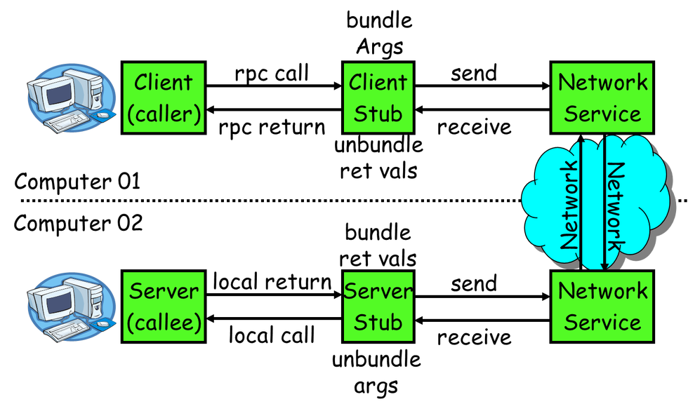

# RPC

RPC(Remote Procedure Call)即远程过程调用，允许一台计算机调用另一台计算机上的程序得到结果，而代码中不需要做额外的编程，就像在本地调用一样。现在互联网应用的量级越来越大，单台计算机的能力有限，需要借助可扩展的计算机集群来完成，分布式的应用可以借助RPC来完成机器之间的调用。

在RPC框架中主要有三个角色：Provider、Consumer和Registry。Server: 暴露服务的服务提供方。Client: 调用远程服务的服务消费方。Registry: 服务注册与发现的注册中心。服务提供者启动后主动向注册中心注册机器ip、port以及提供的服务列表；服务消费者启动时向注册中心获取服务提供方地址列表，可实现软负载均衡和Failover。

## Brpc

互联网上的机器大都通过TCP/IP协议相互访问，但TCP/IP只是往远端发送了一段二进制数据，为了建立服务还有很多问题需要抽象：

>- 数据以什么格式传输？不同机器间，网络间可能是不同的字节序，直接传输内存数据显然是不合适的；随着业务变化，数据字段往往要增加或删减，怎么兼容前后不同版本的格式？
>- 一个TCP连接可以被多个请求复用以减少开销么？多个请求可以同时发往一个TCP连接么?
>- 如何管理和访问很多机器？
>- 连接断开时应该干什么？
>- 万一server不发送回复怎么办？

我们来看看上面的一些问题是如何解决的：

>- 数据需要序列化，protobuf在这方面做的不错。用户填写protobuf::Message类型的request，RPC结束后，从同为protobuf::Message类型的response中取出结果。protobuf有较好的前后兼容性，方便业务调整字段。http广泛使用json作为序列化方法。
>- 用户无需关心连接如何建立，但可以选择不同的连接方式：短连接，连接池，单连接。
>- 大量机器一般通过命名服务被发现，可基于DNS, ZooKeeper, etcd等实现。在百度内，我们使用BNS (Baidu Naming Service)。brpc也提供"list://"和"file://"。用户可以指定负载均衡算法，让RPC每次选出一台机器发送请求，包括: round-robin, randomized, consistent-hashing(murmurhash3 or md5)和 locality-aware。
>- 连接断开时可以重试。
>- 如果server没有在给定时间内回复，client会返回超时错误。
