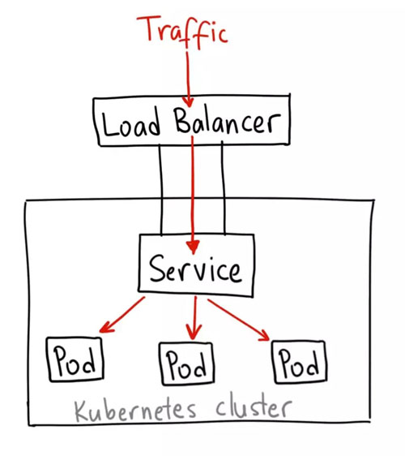

# docker and k8s

## docker

### 安装

```shell
# install
curl -fsSL https://get.docker.com | bash -s docker --mirror Aliyun

# or
curl -sSL https://get.daocloud.io/docker | sh

# 如果要使用 Docker 作为非 root 用户，则应考虑使用类似以下方式将用户添加到 docker 组
sudo usermod -aG docker <your-user>
```

### 配置

```shell
# /etc/docker/daemon.json 添加
{
"registry-mirrors": [
"https://registry.docker-cn.com",
"http://hub-mirror.c.163.com",
"https://docker.mirrors.ustc.edu.cn"
]
}
# 重启
sudo systemctl daemon-reload
sudo systemctl restart docker
# 查看结果
docker info
```

### 使用

```shell
# 构建容器镜像 目录中需要包含 Dockerfile
docker build -t <image-name>[:tag] <dir>

# 添加标签
docker tag <source-image>[:tag] <target-image>[:tag]

# 列出本地存储的镜像 IMAGE ID 相同即为同一个容器
docker images

$ docker images
REPOSITORY TAG IMAGE ID CREATED SIZE
cestlascorpion/kubia latest790521cb05c2 17 hours ago660MB
kubialatest790521cb05c2 17 hours ago660MB
kicbase/stable v0.0.15-snapshot4 06db6ca72446 3 weeks ago 941MB
cestlascorpion/hello-world latestbf756fb1ae65 12 months ago 13.3kB

# 运行已有的镜像 tag 默认为 latest
docker run <image>:<tag>

# 运行容器镜像 -d 为后台运行本机端口会被映射到容器端口
docker run --name <container-name> -p <host-port>:<container-port> -d <image-name> [command] [args...]

# 列出运行中的容器
docker ps

$ docker ps
CONTAINER ID IMAGECOMMANDCREATEDSTATUS PORTSNAMES
3a5ad6b742f2 kubia"node app.js"10 seconds ago Up 5 seconds 0.0.0.0:8880->8080/tcp kubia-docker-run
...
0efc7db7f6d4 kicbase/stable:v0.0.15-snapshot4 "/usr/local/bin/entr…" 17 hours ago Up 17 hours127.0.0.1:49156->22/tcp, 127.0.0.1:49155->2376/tcp, 127.0.0.1:49154->5000/tcp, 127.0.0.1:49153->8443/tcp minikube

# 开始运行
docker start <container-name> [container-name...]

# 停止运行
docker stop <container-name> [container-name...]

# 删除容器 -f 强制删除运行中的容器 SIGKILL
docker rm <container-name> [container-name...]

# 运行容器命令 -d 后台运行 
docker exec <container-name> command [args...]

# 在已有容器内部运行shell -i 以保证标准输入流开放（交互模式） 需要在shell中输入命令 -t 分配一个伪终端（TTY）
docker exec -it <container-name> bash

# 推送镜像
docker push <image-name>[:tag]
```

## kubenetes

资源管理和调度系统。pod代表了基本部署单元。

### 安装运行

[minikube](https://minikube.sigs.k8s.io/docs/start/)

```shell
# 启动集群
minikube start
# 网页查看
minikube dashboard

# 集群信息
$ kubectl cluster-info
Kubernetes master is running at https://127.0.0.1:49153
KubeDNS is running at https://127.0.0.1:49153/api/v1/namespaces/kube-system/services/kube-dns:dns/proxy

# 查看集群节点
$ kubectl get nodes
NAME       STATUS   ROLES                  AGE   VERSION
minikube   Ready    control-plane,master   17h   v1.20.0
```

### 工作上下文

kubeconfig文件由一组上下文组成。上下文包含以下三个元素：集群(cluster)：集群的API服务器的URL；用户(user)：集群的特定用户的身份验证凭据；命名空间(namespace)：连接到集群时使用的命名空间。在任何给定时间，其中一个上下文被设置为当前上下文（通过kubeconfig文件中的专用字段）。

使用[Kubectx](https://github.com/ahmetb/kubectx/#installation)快速切换上下文。

### 查看资源

```shell
# Show details of a specific resource or group of resources
#  Print a detailed description of the selected resources, including related resources such as events or controllers. You may select a single object by name, all objects of that type, provide a name prefix, or label selector.
kubectl describe (-f FILENAME | TYPE [NAME_PREFIX | -l label] | TYPE/NAME) [options]

# Describe a node
kubectl describe nodes kubernetes-node-emt8.c.myproject.internal

# Describe a pod
kubectl describe pods/nginx

# Describe a pod identified by type and name in "pod.json"
kubectl describe -f pod.json
# 该文件即为创建 pod 使用的描述文件
kubectl describe -f kubia-manual.yaml 

# Describe all pods
kubectl describe pods

# Describe pods by label name=myLabel
kubectl describe po -l name=myLabel
kubectl describe po -l name=kubia-manual

# Describe all pods managed by the 'frontend' replication controller (rc-created pods
# get the name of the rc as a prefix in the pod the name).
kubectl describe pods frontend

# Display one or many resources
# Prints a table of the most important information about the specified resources. You can filter the list using a label selector and the --selector flag. If the desired resource type is namespaced you will only see results in your current namespace unless you pass --all-namespaces.
kubectl get [(-o|--output=)json|yaml|wide|custom-columns=...|custom-columns-file=...|go-template=...|go-template-file=...|jsonpath=...|jsonpath-file=...] (TYPE[.VERSION][.GROUP] [NAME | -l label] | TYPE[.VERSION][.GROUP]/NAME ...) [flags] [options]

# List all pods in ps output format.
kubectl get pods

# List all pods in ps output format with more information (such as node name).
kubectl get pods -o wide

# List a single replication controller with specified NAME in ps output format.
kubectl get replicationcontroller web

# List deployments in JSON output format, in the "v1" version of the "apps" API group:
kubectl get deployments.v1.apps -o json

# List a single pod in JSON output format.
kubectl get -o json pod web-pod-13je7
# yaml 格式也可以
kubectl get -o yaml pod kubia-manual

# List a pod identified by type and name specified in "pod.yaml" in JSON output format.
kubectl get -f pod.yaml -o json

# List resources from a directory with kustomization.yaml - e.g. dir/kustomization.yaml.
kubectl get -k dir/

# Return only the phase value of the specified pod.
kubectl get -o template pod/web-pod-13je7 --template={{.status.phase}}

# List resource information in custom columns.
kubectl get pod test-pod -o custom-columns=CONTAINER:.spec.containers[0].name,IMAGE:.spec.containers[0].image

# List all replication controllers and services together in ps output format.
kubectl get rc,services

# List one or more resources by their type and names.
kubectl get rc/web service/frontend pods/web-pod-13je7
```

### 创建资源

```shell
# Create a resource from a file or from stdin.
kubectl create -f FILENAME [options]

# Create a pod using the data in pod.json.
kubectl create -f ./pod.json

# Create a pod based on the JSON passed into stdin.
cat pod.json | kubectl create -f -

# Edit the data in docker-registry.yaml in JSON then create the resource using the edited data.
kubectl create -f docker-registry.yaml --edit -o json
```

### 删除资源

在删除pod的过程中，k8s向进程发送SIGTERM并等待一定时间（默认30s）等待其正常关闭；否则发送SIGKILL终止该进程。删除namespace会删除下辖的所有pod。删除ReplicationController创建的pod会导致rc重建新的pod，此时要删除rc。

```shell
# Delete resources by filenames, stdin, resources and names, or by resources and label selector.
# JSON and YAML formats are accepted. Only one type of the arguments may be specified: filenames, resources and names, or resources and label selector.
kubectl delete ([-f FILENAME] | [-k DIRECTORY] | TYPE [(NAME | -l label | --all)]) [options]

# Delete a pod using the type and name specified in pod.json.
kubectl delete -f ./pod.json

# Delete resources from a directory containing kustomization.yaml - e.g. dir/kustomization.yaml.
kubectl delete -k dir

# Delete a pod based on the type and name in the JSON passed into stdin.
cat pod.json | kubectl delete -f -

# Delete pods and services with same names "baz" and "foo"
kubectl delete pod,service baz foo

# Delete pods and services with label name=myLabel.
kubectl delete pods,services -l name=myLabel

# Delete a pod with minimal delay
kubectl delete pod foo --now

# Force delete a pod on a dead node
kubectl delete pod foo --force

# Delete all pods
kubectl delete pods --all
```

### 标记资源

标签是键值对。如果想添加更复杂的标记，使用注释。

```shell
# Update the labels on a resource.
kubectl label [--overwrite] (-f FILENAME | TYPE NAME) KEY_1=VAL_1 ... KEY_N=VAL_N [--resource-version=version] [options]

# Update pod 'foo' with the label 'unhealthy' and the value 'true'.
kubectl label pods foo unhealthy=true

# Update pod 'foo' with the label 'status' and the value 'unhealthy', overwriting any existing value.
kubectl label --overwrite pods foo status=unhealthy

# Update all pods in the namespace
kubectl label pods --all status=unhealthy

# Update a pod identified by the type and name in "pod.json"
kubectl label -f pod.json status=unhealthy

# Update pod 'foo' only if the resource is unchanged from version 1.
kubectl label pods foo status=unhealthy --resource-version=1

# Update pod 'foo' by removing a label named 'bar' if it exists.
# Does not require the --overwrite flag.
kubectl label pods foo bar-
```

```shell
# 列出所有 pod 的指定标签 没有的话为空
kubectl get pods -L <label-name>
```

### 查看日志

pod删除后这些日志便不可查看

```shell
# Print the logs for a container in a pod or specified resource. If the pod has only one container, the container name is optional.

# Return snapshot logs from pod nginx with only one container
kubectl logs nginx

# Return snapshot logs from pod nginx with multi containers
kubectl logs nginx --all-containers=true

# Return snapshot logs from all containers in pods defined by label app=nginx
kubectl logs -lapp=nginx --all-containers=true

# Return snapshot of previous terminated ruby container logs from pod web-1
# -c 制定了容器名称 web-1 是 pod 名称 一个 pod 中可能运行多个容器
# -p 上一个停止的容器
kubectl logs -p -c ruby web-1

# Begin streaming the logs of the ruby container in pod web-1
# 类似与 tail -f
kubectl logs -f -c ruby web-1

# Begin streaming the logs from all containers in pods defined by label app=nginx
kubectl logs -f -lapp=nginx --all-containers=true

# Display only the most recent 20 lines of output in pod nginx
kubectl logs --tail=20 nginx

# Show all logs from pod nginx written in the last hour
kubectl logs --since=1h nginx

# Show logs from a kubelet with an expired serving certificate
kubectl logs --insecure-skip-tls-verify-backend nginx

# Return snapshot logs from first container of a job named hello
kubectl logs job/hello

# Return snapshot logs from container nginx-1 of a deployment named nginx
kubectl logs deployment/nginx -c nginx-1
```

### 端口转发

一般用于调试

```shell
# Forward one or more local ports to a pod. This command requires the node to have 'socat' installed.
# Use resource type/name such as deployment/mydeployment to select a pod. Resource type defaults to 'pod' if omitted.
kubectl port-forward TYPE/NAME [options] [LOCAL_PORT:]REMOTE_PORT [...[LOCAL_PORT_N:]REMOTE_PORT_N]

# Listen on ports 5000 and 6000 locally, forwarding data to/from ports 5000 and 6000 in the pod
kubectl port-forward pod/mypod 5000 6000

# Listen on ports 5000 and 6000 locally, forwarding data to/from ports 5000 and 6000 in a pod selected by the deployment
kubectl port-forward deployment/mydeployment 5000 6000

# Listen on ports 5000 and 6000 locally, forwarding data to/from ports 5000 and 6000 in a pod selected by the service
kubectl port-forward service/myservice 5000 6000

# Listen on port 8888 locally, forwarding to 5000 in the pod
kubectl port-forward pod/mypod 8888:5000

# Listen on port 8888 on all addresses, forwarding to 5000 in the pod
kubectl port-forward --address 0.0.0.0 pod/mypod 8888:5000

# Listen on port 8888 on localhost and selected IP, forwarding to 5000 in the pod
kubectl port-forward --address localhost,10.19.21.23 pod/mypod 8888:5000

# Listen on a random port locally, forwarding to 5000 in the pod
kubectl port-forward pod/mypod :5000
```

### 资源

#### PO K8S管理调度的基本单位

使用描述文件创建资源

```yaml
kind: Pod
apiVersion: v1
metadata:
  name: kubia-manual
  labels:
    name: kubia-manual
    env: testing
spec:
  containers:
  - name: kubia-container
    image: cestlascorpion/kubia
    resources:
      limits:
        memory: "128Mi"
        cpu: "500m"
    ports:
      - containerPort: 8080
        protocol: TCP
```

标签 labels:name: kubia-manual env: testing。配合标签选择器使用。

```shell
kubectl get pods -l env=testing

$ kubectl get pods -l env=testing -o wide
NAME           READY   STATUS    RESTARTS   AGE   IP           NODE       NOMINATED NODE   READINESS GATES
kubia-manual   1/1     Running   0          96m   172.17.0.3   minikube   <none>           <none>

# 列出包含env标签的所有pod 反向选择使用 '!env' 单引号不可省略
# 同理可以用 env!=tesing / env in (prod,tesing) / env notin (prod,tesing) 等 多个条件使用逗号隔开
kubectl get pods -l env
```

##### 存活探针

检查容器是否在运行。三种：HTTP GET探针，对容器的IP地址执行HTTP请求，如果响应正常（2xx/3xx）则探测成功。TCP Socket探针，尝试与容器建立连接。Exec探针，在容器内执行命令，检查命令退出状态为0则探测成功。检测失败则会重启pod（删除并创建新的）。

存活探针应当检查应用程序的内部，并保持轻量。

```yaml
kind: Pod
apiVersion: v1
metadata:
  name: kubia-liveness
  labels:
    app: kubia
spec:
  containers:
  - name: kubia
    image: luksa/kubia-unhealthy
    livenessProbe:
        httpGet:
          path: /
          port: 8080
        # 务必设置初始时延 否则容器没创建好就探测 通常不会成功
        initialDelaySeconds: 15
        failureThreshold: 5
    resources:
      limits:
        memory: "128Mi"
        cpu: "500m"
    ports:
      - containerPort: 8080
```

##### 就绪探针

就绪探针会定期调用（默认10s），确定特定的pod是否就绪，准备好接受请求。同样也有三种。如果pod报告其尚未就绪，则会从服务中删除该pod（比如从Endpoint对象中删除），但是不会将其终止或重启。

应当始终定义一个就绪探针。不要将停止pod的逻辑加入就绪探针。当然容器关闭时，就需要让就绪探针失败，这是理所当然但并非必需的，因为只要删除pod，k8s就会从所有服务中移除pod。

```yaml
kind: ReplicaSet
apiVersion: apps/v1
metadata:
  name: kubia-rs
spec:
  replicas: 3
  selector:
    matchLabels:
      app: kubia
  template:
    metadata:
      name: kubia-pod
      labels:
        app: kubia
    spec:
      containers:
        - name: kubia-container
          image: cestlascorpion/kubia
          readinessProbe:
              # 通过检查一个文件是否创建来完成探测
              exec:
                command:
                  - ls
                  - /var/ready
          ports:
            - containerPort: 8080
```

```shell
kubectl get pods
NAME             READY   STATUS              RESTARTS   AGE
kubia-rs-l94c5   0/1     ContainerCreating   0          2m51s
kubia-rs-t5jjb   0/1     ContainerCreating   0          2m51s
kubia-rs-tn8kn   0/1     ContainerCreating   0          2m51s

kubectl describe pods kubia-rs-l94c5
Name:         kubia-rs-l94c5
Namespace:    default
Priority:     0
Node:         minikube/192.168.49.2
Start Time:   Mon, 04 Jan 2021 16:58:00 +0800
Labels:       app=kubia
Annotations:  <none>
Status:       Running
IP:           172.17.0.8
IPs:
  IP:           172.17.0.8
Controlled By:  ReplicaSet/kubia-rs
Containers:
  kubia-container:
    Container ID:   docker://e0ff732c683639051a6527bf7da433089dbd8f0910077565190d79ce8071d607
    Image:          cestlascorpion/kubia
    Image ID:       docker-pullable://cestlascorpion/kubia@sha256:a923320941524f2bb6a3a40bfdaf0acf5da9b3c91748c8dea56514b7bea53e8a
    Port:           8080/TCP
    Host Port:      0/TCP
    State:          Running
      Started:      Mon, 04 Jan 2021 17:01:05 +0800
    Ready:          False
    Restart Count:  0
    Readiness:      exec [ls /var/ready] delay=0s timeout=1s period=10s #success=1 #failure=3
    Environment:    <none>
    Mounts:
      /var/run/secrets/kubernetes.io/serviceaccount from default-token-pbzvp (ro)
Conditions:
  Type              Status
  Initialized       True 
  Ready             False 
  ContainersReady   False 
  PodScheduled      True 
Volumes:
  default-token-pbzvp:
    Type:        Secret (a volume populated by a Secret)
    SecretName:  default-token-pbzvp
    Optional:    false
QoS Class:       BestEffort
Node-Selectors:  <none>
Tolerations:     node.kubernetes.io/not-ready:NoExecute op=Exists for 300s
                 node.kubernetes.io/unreachable:NoExecute op=Exists for 300s
Events:
  Type     Reason     Age    From               Message
  ----     ------     ----   ----               -------
  Normal   Scheduled  3m13s  default-scheduler  Successfully assigned default/kubia-rs-l94c5 to minikube
  Normal   Pulling    3m8s   kubelet            Pulling image "cestlascorpion/kubia"
  Normal   Pulled     8s     kubelet            Successfully pulled image "cestlascorpion/kubia" in 2m59.018847561s
  Normal   Created    8s     kubelet            Created container kubia-container
  Normal   Started    8s     kubelet            Started container kubia-container
  Warning  Unhealthy  5s     kubelet            Readiness probe failed: ls: cannot access /var/ready: No such file or directory


kubectl exec kubia-rs-l94c5 -- touch /var/ready

# 创建文件后 该pod就绪
kubectl get pods                               
NAME             READY   STATUS    RESTARTS   AGE
kubia-rs-l94c5   1/1     Running   0          6m7s
kubia-rs-t5jjb   0/1     Running   0          6m7s
kubia-rs-tn8kn   0/1     Running   0          6m7s

kubectl describe po  kubia-rs-l94c5 
Name:         kubia-rs-l94c5
Namespace:    default
Priority:     0
Node:         minikube/192.168.49.2
Start Time:   Mon, 04 Jan 2021 16:58:00 +0800
Labels:       app=kubia
Annotations:  <none>
Status:       Running
IP:           172.17.0.8
IPs:
  IP:           172.17.0.8
Controlled By:  ReplicaSet/kubia-rs
Containers:
  kubia-container:
    Container ID:   docker://e0ff732c683639051a6527bf7da433089dbd8f0910077565190d79ce8071d607
    Image:          cestlascorpion/kubia
    Image ID:       docker-pullable://cestlascorpion/kubia@sha256:a923320941524f2bb6a3a40bfdaf0acf5da9b3c91748c8dea56514b7bea53e8a
    Port:           8080/TCP
    Host Port:      0/TCP
    State:          Running
      Started:      Mon, 04 Jan 2021 17:01:05 +0800
    Ready:          True
    Restart Count:  0
    Readiness:      exec [ls /var/ready] delay=0s timeout=1s period=10s #success=1 #failure=3
    Environment:    <none>
    Mounts:
      /var/run/secrets/kubernetes.io/serviceaccount from default-token-pbzvp (ro)
Conditions:
  Type              Status
  Initialized       True 
  Ready             True 
  ContainersReady   True 
  PodScheduled      True 
Volumes:
  default-token-pbzvp:
    Type:        Secret (a volume populated by a Secret)
    SecretName:  default-token-pbzvp
    Optional:    false
QoS Class:       BestEffort
Node-Selectors:  <none>
Tolerations:     node.kubernetes.io/not-ready:NoExecute op=Exists for 300s
                 node.kubernetes.io/unreachable:NoExecute op=Exists for 300s
Events:
  Type     Reason     Age                  From               Message
  ----     ------     ----                 ----               -------
  Normal   Scheduled  6m17s                default-scheduler  Successfully assigned default/kubia-rs-l94c5 to minikube
  Normal   Pulling    6m12s                kubelet            Pulling image "cestlascorpion/kubia"
  Normal   Pulled     3m12s                kubelet            Successfully pulled image "cestlascorpion/kubia" in 2m59.018847561s
  Normal   Created    3m12s                kubelet            Created container kubia-container
  Normal   Started    3m12s                kubelet            Started container kubia-container
  Warning  Unhealthy  89s (x11 over 3m9s)  kubelet            Readiness probe failed: ls: cannot access /var/ready: No such file or directory
```

#### NS 命名空间提供隔离

```yaml
kind: Namespace
apiVersion: v1
metadata:
  name: custom-namespace
```

```shell
$ kubectl create -f custom-namespace.yaml 
namespace/custom-namespace created

$ kubectl get ns
NAME                   STATUS   AGE
custom-namespace       Active   16s
default                Active   18h
kube-node-lease        Active   18h
kube-public            Active   18h
kube-system            Active   18h
kubernetes-dashboard   Active   17h

$ kubectl create -f kubia-manual.yaml -n custom-namespace
pod/kubia-manual created

$ kubectl get pods -n custom-namespace
NAME           READY   STATUS    RESTARTS   AGE
kubia-manual   1/1     Running   0          19s
```

命名空间可以提供隔离。

#### RC 副本控制器

```yaml
kind: ReplicationController
apiVersion: v1
metadata:
  name: kubia-rc
spec:
  replicas: 3
  selector:
    app: kubia
  template:
    metadata:
      name: kubia
      labels:
        app: kubia
    spec:
      containers:
        - name: kubia
          image: cestlascorpion/kubia
          ports:
            - containerPort: 8080
```

ReplicationController按照描述文件的要求来处理pod。上例中的rc会在集群内维护3个kubia容器，保证满足Selector:app=kubia的容器有三个。

通过更改pod的标签，可以将其从rc的作用域中添加或者删除。

```shell
$ kubectl get rc -n custom-namespace -o wide
NAME       DESIRED   CURRENT   READY   AGE     CONTAINERS   IMAGES                 SELECTOR
kubia-rc   3         3         3       3m31s   kubia        cestlascorpion/kubia   app=kubia

$ kubectl describe rc kubia-rc -n custom-namespace
Name:         kubia-rc
Namespace:    custom-namespace
Selector:     app=kubia
Labels:       app=kubia
Annotations:  <none>
Replicas:     3 current / 3 desired
Pods Status:  3 Running / 0 Waiting / 0 Succeeded / 0 Failed
Pod Template:
  Labels:  app=kubia
  Containers:
   kubia:
    Image:        cestlascorpion/kubia
    Port:         8080/TCP
    Host Port:    0/TCP
    Environment:  <none>
    Mounts:       <none>
  Volumes:        <none>
Events:
  Type    Reason            Age   From                    Message
  ----    ------            ----  ----                    -------
  Normal  SuccessfulCreate  4m9s  replication-controller  Created pod: kubia-rc-8g4g5
  Normal  SuccessfulCreate  4m9s  replication-controller  Created pod: kubia-rc-qdp5c
  Normal  SuccessfulCreate  4m9s  replication-controller  Created pod: kubia-rc-w5bvv

$ kubectl get po --show-labels
NAME             READY   STATUS    RESTARTS   AGE     LABELS
kubia-manual     1/1     Running   0          3h23m   env=testing,name=kubia-manual
kubia-rc-qdp5c   1/1     Running   0          10m     app=kubia
kubia-rc-rrqd9   1/1     Running   0          4m42s   app=kubia
kubia-rc-w5bvv   1/1     Running   0          10m     app=kubia


$ kubectl label pods kubia-manual app=kubia
pod/kubia-manual labeled


$ kubectl get po --show-labels
NAME             READY   STATUS        RESTARTS   AGE     LABELS
kubia-manual     1/1     Running       0          3h23m   app=kubia,env=testing,name=kubia-manual
kubia-rc-qdp5c   1/1     Running       0          10m     app=kubia
kubia-rc-rrqd9   1/1     Terminating   0          5m24s   app=kubia
kubia-rc-w5bvv   1/1     Running       0          10m     app=kubia
```

如果修改了rc的标签选择器，则不满足的pod会立即脱离rc的管理，直到手动将其删除。

```shell
# 修改 rc 的描述文件
kubectl edit rc kubia-rc
# 水平扩容
kubectl scale rc kubia-rc --replicas=10
```

删除rc时，下辖的pod也会消亡，这可能不是所期望的，为了保持运行可以使用 --cascade=false。

#### RS 副本控制器v2

ReplicaSet的标签选择器更强大，可以同时匹配env=prod和env=testing，rc则不可以。删除rs时，下辖的pod也会消亡，rs也支持 --cascade=false。

```yaml
kind: ReplicaSet
apiVersion: apps/v1
metadata:
  name: kubia-rs
spec:
  replicas: 3
  selector:
    matchLabels:
      app: kubia
  template:
    metadata:
      name: kubia-pod
      labels:
        app: kubia
    spec:
      containers:
        - name: kubia-container
          image: cestlascorpion/kubia
          ports:
            - containerPort: 8080
```

```shell
$ kubectl get rs
NAME       DESIRED   CURRENT   READY   AGE  
kubia-rs   3         3         3       1m11s

$ kubectl get pods -o wide
NAME             READY   STATUS    RESTARTS   AGE   IP           NODE       NOMINATED NODE   READINESS GATES
kubia-rs-47glr   1/1     Running   0          42s   172.17.0.7   minikube   <none>           <none>
kubia-rs-8gjcr   1/1     Running   0          42s   172.17.0.3   minikube   <none>           <none>
kubia-rs-vcrxn   1/1     Running   0          42s   172.17.0.6   minikube   <none>           <none>
```

#### DS 指定节点运行pod

使用DaemonSet在每个节点上运行一个pod。比如希望在每个节点上运行一个日志收集和资源监控器。另一个典型的例子是kube-proxy。使用nodeselector还可以在指定的节点运行一个pod。

DaemonSet管理的pod完全绕过了调度器，即使某些节点被设置为不可调度。DaemonSet的目的是运行系统服务，即使在不可调度的节点，系统服务通常也要运行。

```yaml
kind: DaemonSet
apiVersion: apps/v1
metadata:
  name: ssd-monitor
spec:
  selector:
    matchLabels:
      app: ssd-monitor
  template:
    metadata:
      labels: 
        app: ssd-monitor
    spec:
      nodeSelector:
        disk: ssd
      containers:
      - name: main
        image: luksa/ssd-monitor
```

```shell
$ kubectl get ds
NAME          DESIRED   CURRENT   READY   UP-TO-DATE   AVAILABLE   NODE SELECTOR   AGE
ssd-monitor   0         0         0       0            0           disk=ssd        15s

$ kubectl label nodes minikube disk=ssd
node/minikube labeled

$ kubectl get ds
NAME          DESIRED   CURRENT   READY   UP-TO-DATE   AVAILABLE   NODE SELECTOR   AGE
ssd-monitor   1         1         0       1            0           disk=ssd        75s

$ kubectl get pod
NAME                READY   STATUS    RESTARTS   AGE
ssd-monitor-7c7mc   1/1     Running   0          44s
```

#### JOB 运行单个任务

```yaml
kind: Job
apiVersion: batch/v1
metadata:
  name: batch-job
spec:
  template:
    metadata:
      labels:
        app: batch-job
    spec:
      restartPolicy: OnFailure
      containers:
      - name: main
        image: luksa/batch-job

```

```shell
$ kubectl get jobs
NAME        COMPLETIONS   DURATION   AGE
batch-job   0/1           10s        10s

$ kubectl get pods
NAME              READY   STATUS              RESTARTS   AGE
batch-job-4j4lc   0/1     ContainerCreating   0          20s

$ kubectl get pods
NAME              READY   STATUS      RESTARTS   AGE  
batch-job-4j4lc   0/1     Completed   0          8m19s

$ kubectl get jobs
NAME        COMPLETIONS   DURATION   AGE
batch-job   1/1           4m45s      10m
```

使用completions控制运行次数；parallelism控制并发数量。下例会确保5个pod成功完成，最多可以有两个pod一起运行。可以运行时水平伸缩，增减并发数量。

```shell
kubectl sacle job batch-job --replicas 3 
```

```yaml
kind: Job
apiVersion: batch/v1
metadata:
  name: batch-job
spec:
  completions: 5
  parallelism: 2
  template:
    metadata:
      labels:
        app: batch-job
    spec:
      restartPolicy: OnFailure
      containers:
      - name: main
        image: luksa/batch-job
```

任务执行完后，job资源并不会自动删除。

#### CronJob 定期或定时任务

在计划的时间内，CronJob资源会创建Job资源，然后Job资源创建pod。

### 服务发现

POD的是短暂的，随时启动和关闭；调度到节点上pod启动前k8s才会分配IP地址，无法提前预知；水平伸缩意味着需要负载均衡。

#### Service

为一组功能相同的pod提供单一不变的接入点的资源。服务存在时，IP、PORT不会改变。外部与之通信则会被路由到任意pod。

```yaml
kind: Service
apiVersion: v1
metadata:
  name: kubia-svc
spec:
  selector:
    app: kubia
  ports:
  - name: kubia-port
    port: 80
    targetPort: 8080
```

```shell
kubectl get svc
NAME         TYPE           CLUSTER-IP      EXTERNAL-IP   PORT(S)        AGE
kubernetes   ClusterIP      10.96.0.1       <none>        443/TCP        3d15h
kubia-svc    ClusterIP      10.101.87.239   <none>        80/TCP         13s
```

服务将拥有一个集群内可访问的IP地址，端口80。可以通过运行的容器中远程执行命令测试连通性。下例中使用一个集群中的pod访问服务，其请求被k8s代理服务器拦截，然后按照一定的策略选择一个转发（80 -> 8080），然后返回其响应。

```shell
kubectl exec kubia-pod -- curl -s http://10.101.87.239
you have hit kubia-rs-nl6dd
kubectl exec kubia-pod -- curl -s http://10.101.87.239:80
you have hit kubia-rs-4ppgm

#note!
kubectl exec [POD] [COMMAND] is DEPRECATED and will be removed in a future version. Use kubectl exec [POD] -- [COMMAND] instead
```

双横杠代表kubectl命令结束。后边的内容则是pod内部执行的命令。`sessionAffinity: ClientIP`回话的亲和性，这会使来自同个clientIP的所有请求转发至同一个pod。另一个选项是`None`。k8s工作在传输层，因此无法支持cookie的会话亲和性的选项（Not HTTP）。

暴露多个端口则依次在yaml中添加即可。如果pod的端口定义使用的是名称，则svc的targetport也可以使用名称。这样修改暴露端口号时比较简便。

```yaml
kind: ReplicaSet
apiVersion: apps/v1
metadata:
  name: kubia-rs-namedport
spec:
  replicas: 3
  selector:
    matchLabels:
      app: kubia-namedport
  template:
    metadata:
      name: kubia-pod-namedport
      labels:
        app: kubia-namedport
    spec:
      containers:
        - name: kubia-container-namedport
          image: cestlascorpion/kubia
          ports:
            - name: http
              containerPort: 8080
```

```yaml
kind: Service
apiVersion: v1
metadata:
  name: kubia-svc-namedport
spec:
  selector:
    app: kubia-namedport
  ports:
  - name: http
    port: 80
    targetPort: http
```

```shell
kubectl exec kubia-rs-namedport-44dlj -- curl -s http://10.100.47.164
you have hit kubia-rs-namedport-f6g5x

kubectl exec kubia-rs-namedport-44dlj -- curl -s http://10.100.47.164:80
you have hit kubia-rs-namedport-f6g5x
```

服务也不是直接和pod相连，而是借助Endpoint资源。通过手动配置Endpoint资源来代替公开外部服务。另一种方法是通过其完全限定域名访问外部服务。

```shell
kubectl describe svc kubia-svc         
Name:              kubia-svc
Namespace:         default
Labels:            <none>
Annotations:       <none>
Selector:          app=kubia
Type:              ClusterIP
IP Families:       <none>
IP:                10.109.24.62
IPs:               10.109.24.62
Port:              kubia-port  80/TCP
TargetPort:        8080/TCP
Endpoints:         172.17.0.2:8080,172.17.0.3:8080,172.17.0.4:8080
Session Affinity:  None
Events:            <none>
```

#### 集群内部服务发现

在集群内部对一个服务的访问，主要有2种方式，环境变量与DNS。当一个pod创建时，集群中属于同个namespace下的所有service对象信息都会被作为环境变量添加到pod中。pod通过{SVCNAME}_SERVICE_HOST/PORT就可以方便的访问到某个服务。这种访问方式简单易用，可以用来快速测试服务。但最大的问题就是，服务必须先于pod创建，后创建的服务是不会添加到现有pod的环境变量中的。

DNS组件是k8s集群的可选组件，它会不停监控k8s API，在有新服务创建时，自动创建相应的DNS记录。在服务创建时，会创建一条`服务名.命名空间.svc.cluster.local`的dns记录指向服务。而且dns记录作用域是整个集群，不局限在namespace。虽然是可选组件，但DNS生产环境可以说是必备的组件了。

```shell
kubectl exec -it kubia-rs-5k5vd -- bash 
root@kubia-rs-5k5vd:/# curl http://kubia-svc.default.svc.cluster.local
you have hit kubia-rs-tf5jb

root@kubia-rs-5k5vd:/# cat /etc/resolv.conf 
nameserver 10.96.0.10
search default.svc.cluster.local svc.cluster.local cluster.local localdomain
options ndots:5

root@kubia-rs-5k5vd:/# ping kubia-svc
PING kubia-svc.default.svc.cluster.local (10.109.24.62): 56 data bytes
^C--- kubia-svc.default.svc.cluster.local ping statistics ---
25 packets transmitted, 0 packets received, 100% packet loss
```

kubia-svc.default.svc.cluster.local: 服务名.命名空间.svc.cluster.local。服务和pod位于相同的名字空间，可以直接使用服务名。

#### 暴露给外部客户端

设置服务类型，yaml文件的spec中添加属性type，可以选项包括：LoadBalancer | ClusterIP | NodePort。它们都是将集群外部流量导入到集群内的方式，只是实现方式不同。如果没有设置的话，默认为ClusterIP，这种模式下启用K8S的proxy模式来访问。


如上节中的例子，服务被分配了一个clusterip，通过这个IP来访问服务。该IP是一个虚拟的地址，具体的代理请求时iptables转发实现的。在服务创建时，kube-proxy组件会自动创建同名的endpoint对象，动态的匹配selector的一组pod当前ip及端口，并生成相应的iptables KUBE-SVC-xxxx规则。

NodePort 服务是引导外部流量到你的服务的最原始方式。NodePort，正如这个名字所示，在所有节点（虚拟机）上开放一个特定端口，任何发送到该端口的流量都被转发到对应服务。


```yaml
kind: Service
apiVersion: v1
metadata:
  name: kubia-nodeport
spec:
  selector:
    app: kubia
  type: NodePort
  ports:
  # 通过服务IP:80访问服务 （内部）
  - port: 80
    targetPort: 8080
    # 通过集群节点IP:30123访问服务 （内部和外部）
    nodePort: 30123
```

```shell
kubectl get nodes -n kube-system -o wide
NAME       STATUS   ROLES                  AGE     VERSION   INTERNAL-IP    EXTERNAL-IP   OS-IMAGE             KERNEL-VERSION     CONTAINER-RUNTIME
minikube   Ready    control-plane,master   3d17h   v1.20.0   192.168.49.2   <none>        Ubuntu 20.04.1 LTS   5.4.0-59-generic   docker://20.10.0

# 内部
kubectl exec kubia-rs-5k5vd -- curl -s http://192.168.49.2:30123
you have hit kubia-rs-tf5jb
# 外部
curl -s http://192.168.49.2:30123
you have hit kubia-rs-tf5jb
```

NodePort 服务主要有两点区别于普通的 ClusterIP 服务。第一，它的类型是 NodePort。有一个额外的端口，称为 nodePort，它指定节点上开放的端口值 。如果你不指定这个端口，系统将选择一个随机端口。大多数时候我们应该让 Kubernetes 来选择端口，因为如评论中 thockin 所说，用户自己来选择可用端口代价太大。这种方法有许多缺点：每个端口只能是一种服务；端口范围只能是 30000-32767；指定的节点故障时则访问失败。

LoadBalancer 服务是暴露服务到 internet 的标准方式。负载均衡器拥有独特的公开访问地址，并将所有连接重定向到服务。



```yaml
kind: Service
apiVersion: v1
metadata:
  name: kubia-loadbalancer
spec:
  selector:
    app: kubia
  type: LoadBalancer
  ports:
  - port: 80
    targetPort: 8080
```

所有通往你指定的端口的流量都会被转发到对应的服务。它没有过滤条件，没有路由等。这意味着你几乎可以发送任何种类的流量到该服务，像 HTTP，TCP，UDP，Websocket，gRPC 或其它任意种类。这个方式的最大缺点是每一个用 LoadBalancer 暴露的服务都会有它自己的 IP 地址，每个用到的 LoadBalancer 都需要付费，这将是非常昂贵的。

#### Ingress

有别于以上所有例子，Ingress 事实上不是一种服务类型。相反，它处于多个服务的前端，扮演着智能路由或者集群入口的角色。你可以用 Ingress 来做许多不同的事情，各种不同类型的 Ingress 控制器也有不同的能力。

GKE 上的默认 ingress 控制器是启动一个 HTTP(S) Load Balancer。它允许你基于路径或者子域名来路由流量到后端服务。例如，你可以将任何发往域名 foo.yourdomain.com 的流量转到 foo 服务，将路径 yourdomain.com/bar/path 的流量转到 bar 服务。


```yaml
kind: Ingress
apiVersion: extensions/v1beta1
metadata:
  name: kubia-ingress
spec:
  rules:
  # 将该域名映射到你的服务
  - host: kubia.example.com
    http: 
      paths:
        - path: /kubia
          backend: 
            serviceName: kubia
            # 将所有kubia.example.com/kubia请求转发到kubia服务的80端口
            sercicePort: 80
        - path: /foo
            backend: 
            serviceName: bar
            # 将所有kubia.example.com/foo请求转发到bar服务的80端口
            sercicePort: 80
```

使用NodePort暴露Service的端口时Node IP会漂移的问题。同时，若大量使用NodePort暴露主机端口，管理会非常混乱。好的解决方案就是让外界通过域名去访问Service，而无需关心其Node IP及Port。那为什么不直接使用Nginx？这是因为在K8S集群中，如果每加入一个服务，我们都在Nginx中添加一个配置，其实是一个重复性的体力活，只要是重复性的体力活，我们都应该通过技术将它干掉。

Ingress是Kubernetes集群对外暴露服务的一种方式，Ingress作为一个抽象对象，定义了进入集群的流量的导向，可以视为router，真正处理流量，作为ingress和集群中微服务中介的称之为Ingress Controller，有许多种Controller可供选择，有Kubernetes官方维护的Nginx Ingress Controller，比较常用的还有Traefik Ingress Controller、Kong Ingress Controller，这里我们使用的是Nginx Ingress Controller。

```shell
ku
kubectl create -f kubia-ingress.yaml
Warning: extensions/v1beta1 Ingress is deprecated in v1.14+, unavailable in v1.22+; use networking.k8s.io/v1 Ingress
ingress.extensions/kubia-ingress created

kubectl describe ingress
Name:             kubia-ingress
Namespace:        default
Address:          
Default backend:  default-http-backend:80 (<error: endpoints "default-http-backend" not found>)
Rules:
  Host               Path  Backends
  ----               ----  --------
  kubia.example.com  
                     /kubia   kubia-svc:80 (172.17.0.2:8080,172.17.0.3:8080,172.17.0.4:8080)
Annotations:         <none>
Events:              <none>

```

客户端首先对kubia.example.com执行DNS查询，得到控制器的IP；然后向控制器发送HTTP请求，并在HOST头中指定了kubia.example.com。控制器从头部确定客户端访问哪个服务，通过与该服务相关的Endpoint对象查看pod IP，并将请求转发给一个pod。
