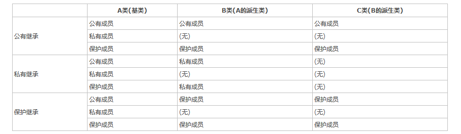
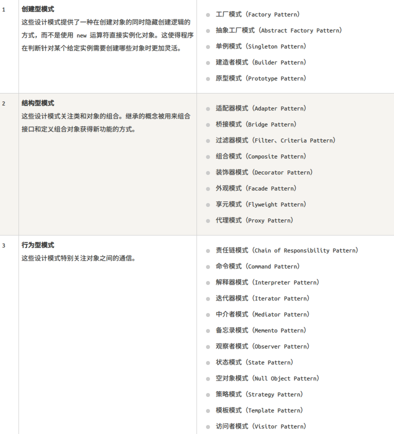

# C++ 指南

## modern cpp

### auto 和 decltype

auto 类型说明符用于类型自动推导。auto 实际上是一个类型占位符，编译阶段会替换为实际的变量类型。auto 的自动类型推断发生在编译期，所以使用 auto 并不会造成程序运行时效率的降低。

```cpp
auto i = 1;    // 编译器自动推断 i 为 int 类型
```

这个功能在各种标准模板库容器中使用，作用更突出。

```cpp
vector<int> vec(6,10);
vector<int>::iterator iter = vec.iterator();
auto iter = vec.iterator(); // 相比较上一句方便很多
```

decltype 类型说明符生成指定表达式的类型。在此过程中，编译器分析表达式并得到它的类型，却不实际计算表达式的值。类似于 sizeof 操作符，decltype 也不需对其操作数求值。粗略来说，decltype(e) 返回类型前，进行了如下推导：

>- 若表达式 e 指向一个局部变量、命名空间作用域变量、静态成员变量或函数参数，那么返回类型即为该变量（或参数）的 “声明类型”；
>- 若 e 是一个左值（lvalue，即 “可寻址值”），则 decltype(e) 将返回 T&，其中 T 为 e 的类型；
>- 若 e 是一个 x 值（xvalue），则返回值为 T&&；
>- 若 e 是一个纯右值（prvalue），则返回值为 T。

#### decltype 和 auto 的区别

处理顶层 const 和引用的方式：如果 decltype 使用的表达式是一个变量，则 decltype 返回该变量的类型（包括顶层 const 和引用在内。

```cpp
const int ci = 0, &cj = ci;
decltype(ci) x = 0;
decltype(cj) y = x;
decltype(cj) z; // 报错，因为 cj 是一个引用，因此作为引用的 z 必须要进行初始化
```

引用从来都是作为其所指对象的同义词出现，也就是根据其所指的对象决定，只有在 decltype 处是个例外。

decltype 的结果类型与表达式形式密切相关：对于 decltype 所用的引用来说，如果变量名加上了一对括号，则得到的类型与不加括号时会有所不同。如果 decltype 使用的是一个不加括号的变量，则得到的结果就是该变量的类型；如果给变量加上了一层或多层括号，编译器就会把它当成是一个表达式。

```cpp
int i = 0;
decltype((i)) a; // 报错，因为 a 类型为 int&，必须进行初始化
decltype(i) b;   // 正确
```

需要注意的是，decltype((variable)) 的结果永远是引用，而 decltype(variable) 结果只有当 variable 本身就是一个引用时才是引用，其实就是根据它的类型决定。

模板函数的返回类型：在 C++11 中，可以结合使用尾随返回类型上的 decltype 类型说明符和 auto 关键字来声明其返回类型依赖于其模板参数类型的模板函数。在 C++14 中，可以使用不带尾随返回类型的 decltype(auto) 来声明其返回类型取决于其模板参数类型的模板函数。

### 后置返回类型

```cpp
template Ret adding_func(const Lhs &lhs, const Rhs &rhs) {return lhs + rhs;}
```

这不是合法的 C++，因为 lhs 和 rhs 还没定义；解析器解析完函数原型的剩余部分之前，它们还不是有效的标识符。为此，C++11 引入了一种新的函数声明语法，叫做后置返回类型 (trailing-return-type)。

```cpp
template auto adding_func(const Lhs &lhs, const Rhs &rhs) -> decltype(lhs+rhs) {return lhs + rhs;}
```

这种语法可以用到更普通的函数声明和定义上:

```cpp
struct SomeStruct {
    auto func_name(int x, int y) -> int;
};

auto SomeStruct::func_name(int x, int y) -> int {
    return x + y;
}
```

关键字 auto 的这种用法与在自动类型推导中有所不同。但是本质作用相同，都是充当一个类型占位符。

```cpp
// 泛型编程中经常遇到的写一个加法函数
template <typename R, typename T, typename U>
R add(T t, U u) {
    return (t + u);
}

int a = 10;
float b = 20.0;
auto c = add<decltype(a + b)>(a, b);

// 将 decltype 和 auto 结果起来完成返回值类型的推导
template <typename T, typename U>
auto add(T t, U u) -> decltype(t + u) {
    return t + u;
}
```

上述例子将 auto 作为一个返回值类型的占位符，实际返回值类型通过 decltype(t + u) 来推导。可能有一个疑问就是会不会 (t + u) 会运算两次，影响性能。丝毫不会，原因是 decltype 推到表达式类型是在编译期完成的，并且不会真正计算表达式的值，类型 sizeof 推导表达式类型大小一样。

虚函数不能使用返回类型推导。派生类中定义虚函数必须与基类中的虚函数同名外，还必须同参数表，同返回类型。否则被认为是重载，而不是虚函数。如基类中返回基类指针，派生类中返回派生类指针是允许的，这是一个例外，引用同理。

### 强类型枚举

在传统 C++ 中，枚举类型并非类型安全，枚举类型会被视作整数，则会让两种完全不同的枚举类型可以进行直接的比较（虽然编译器给出了检查，但并非所有），甚至同一个命名空间中的不同枚举类型的枚举值名字不能相同，这通常不是我们希望看到的结果。

C++11 引入了枚举类（enumeration class），并使用 enum class 的语法进行声明：

```cpp
enum class new_enum : unsigned int {
    value1,
    value2,
    value3 = 100,
    value4 = 100
};
```

这样定义的枚举实现了类型安全，首先不能够被隐式的转换为整数，同时也不能够将其与整数数字进行比较， 更不可能对不同的枚举类型的枚举值进行比较。但相同枚举值之间如果指定的值相同，那么可以进行比较：

```cpp
if (new_enum::value3 == new_enum::value4) {
    std::cout << "new_enum::value3 == new_enum::value4" << std::endl;
}
```

在这个语法中，枚举类型后面使用了冒号及类型关键字来指定枚举中枚举值的类型，这使得我们能够为枚举赋值（未指定时将默认使用 int）。

### 基于范围的 for 循环

```cpp
int nArr[5] = {1, 2, 3, 4, 5};
for(const int& x : nArr)      // for(auto& x: nArr)，如果不需要拷贝可以使用 const auto& x
{
    x *= 2;                   // 数组中每个元素倍乘
}
```

配合 auto 使用更加方便。

### 匿名函数 Lambda

如果代码里面存在大量的小函数，而这些函数一般只被一两处调用，那么不妨将它们重构成 Lambda 表达式，也就是匿名函数（当需要一个函数，但是又不想费神去命名）。C++ 中 Lambda 表达式格式如下：

```cpp
[capture](params)->ret{body}; // [捕获列表](参数类型 参数名)-> 返回类型{函数体}
```

[capture] 指定在可见域范围内 lambda 表达式代码内可见的参数。[a, &b]，前文定义的 a 以值方式被表达式捕获，b 则是以引用的方式；[this] 以值的方式捕获 this 指针。[&] 以引用的方式捕获所有的外部自动变量。[=] 以值的方式捕获所有的外部自动变量。[] 不捕获外部的任何变量。const 类型的 lambda 表达式，该类型的表达式不能改捕获 (“capture”) 列表中的值。(params) 指定 lambda 表达式内部变量定义。->ret 是返回类型，如果代码块中包含了 return 语句，则该 lambda 表达式的返回类型由 return 语句的返回类型确定。如果没有 return 语句，则类似 void f(…) 函数。{body}是 Lambda 表达式主题结构。

```cpp
auto func = [](int i) -> int { return i + 4; };
cout << func(10) << endl;
vector<int> v = {3, 1, 4, 2, 5, 8, 6};
sort(v.begin(), v.end(), [](int a, int b) -> bool { return a < b; });
```

如果需要闭包运行时对变量求值，则引用捕获变量，正常调用函数即可；若需要闭包构建时对变量求值，应当将求值结果作为参数使用。

lambda 默认情况下是一个 “const” 函数，如果调用了非 const 成员函数会报错，此时需要加上 mutable。

上面提到的值捕获、引用捕获都是已经在外层作用域声明的变量，因此这些捕获方式捕获的均为左值，而不能捕获右值。

若以引用隐式或显式捕获非引用实体，且在实体的生存期结束后调用闭包的函数调用运算符，则未定义行为发生。C++ 闭包不通过被捕获的引用延长生存期。

C++14 给与了我们方便，允许捕获的成员用任意的表达式进行初始化，这就允许了右值的捕获， 被声明的捕获变量类型会根据表达式进行判断，判断方式与使用 auto 本质上是相同的：

```cpp
#include <iostream>
#include <utility>

int main() {
    auto important = std::make_unique<int>(1);
    auto add = [v1 = 1, v2 = std::move(important)](int x, int y) -> int {
        return x+y+v1+(*v2);
    };
    std::cout << add(3,4) << std::endl;
    return 0;
}
```

在上面的代码中，important 是一个独占指针，是不能够被捕获到的，这时候我们需要将其转移为右值，在表达式中初始化。

auto 关键字不能够用在参数表里，这是因为这样的写法会与模板的功能产生冲突。 但是 Lambda 表达式并不是普通函数，所以 Lambda 表达式并不能够模板化。 这就为我们造成了一定程度上的麻烦：参数表不能够泛化，必须明确参数表类型。幸运的是，这种麻烦只存在于 C++11 中，从 C++14 开始， Lambda 函数的形式参数可以使用 auto 关键字来产生意义上的泛型：

```cpp
auto add = [](auto x, auto y) {
    return x+y;
};

add(1, 2);
add(1.1, 2.2);
```

### override 和 final

在 C++03 中，很容易在重写基类某个函数的时候却意外地创建了另一个虚函数。

```cpp
struct Base {
    virtual void some_func(float);
};

struct Derived : public Base {
    virtual void some_func(int);
};
```

本来 Derived::some_func 函数是想替代 Base 中那个函数的。但是因它的接口不同，又创建了一个虚函数。这是个常见的问题，特别是当用户想要修改基类的时候。 C++11 引入了新的语法来解决这个问题：

```cpp
struct Base {
    virtual void some_func(float);
};

struct Derived : Base {
    virtual void some_func(int) override; // 无法通过编译，不会重写基类的方法
};
```

override 这个特殊的标识符意味编译器将去检查基类中有没有一个具有相同签名的虚函数，如果没有编译器就会报错！C++11 还增加了防止基类被继承和防止子类重写函数的能力。这是由特殊的标识符 final 来完成的，例如：

```cpp
struct Base1 final { };

struct Derived1 : Base1 { }; // 无法通过编译，因为类 Base1 被标记为 final 了

struct Base2 {
    virtual void f() final;
};

struct Derived2 : Base2 {
    void f();               // 无法通过编译，因为虚函数 Base2::f 被标记为 final 了 .
};
```

在这个例子中， virtual void f() final；语句声明了一个虚函数却也阻止了子类重写这个函数。它还有一个作用，就是防止了子类将那个特殊的函数名与新的参数组合在一起。需要注意的是，override 和 final 都不是 C++ 语言的关键字。它们是技术上的标识符，只有在它们被用在上面这些特定的上下文在才有特殊意义。用在其它地方他们仍然是有效标识符。

### default 和 delete

如果实现了默认的构造函数，编译器则不会自动生成默认版本；可以通过使用关键字 default 来控制默认构造函数的生成，显示的指示编译器生成该函数的默认版本。标注 delete 的函数应当是 public（正大光明的删除咯）。

```cpp
class MyClass {
public:
    MyClass() = default;  // 同时提供默认版本和带参版本
    MyClass(int i) : data(i) {}

private:
    int data;
};
```

想要禁止使用默认的构造函数，则使用关键字 delete；

```cpp
class MyClass {
public:
    MyClass() = default;

    MyClass(const MyClass &) = delete;
};

int main() {
    MyClass my;
    MyClass my2(my); // 报错
    return 0;
}
```

但需要注意的是，析构函数是不允许使用 delete。

### 引用限定符

```cpp
string s1 = "abc", s2 = "efg";
auto pos = (s1 + s2).find('a'); // 对右值调用成员函数
s1 + s2 = "what";               // 对右值赋值

class A
{
public:
    // 引用限定符是上下文关键字，如果有 const 限定符，则放在 const 之后
    A& operator=(const& A&) &;  // 只能对左值赋值
}
```

在旧的标准中无法组织这种使用方法，C++11 仍然允许对右值调用成员函数和向右值赋值，但是提供了一种阻止方式：引用限定符，指定成员函数的 this 指针指向的左值还是右值。

### 对齐描述符 alignas

alignas 关键字用来设置内存中对齐方式，最小是 8 字节对齐，可以是 16，32，64，128 等。计算方法就是对齐数的整数倍，比如 32 位对齐，实际数据大小不到 32 字节，但内存还是占用 32 字节。实际数据大于 32 字节小于 64 字节，内存占用 64 字节。这种明确规定占用字节大小后，编写代码将更具有跨平台性。

### 对齐操作符 alignof

alignas 可以接受常量表达式和类型作为参数，可以修饰变量、类的数据成员等，不能修饰位域和用 register 申明的变量。一般往大对齐。返回由类型标识所指示的类型的任何实例所要求的对齐字节数，该类型可以为完整类型、数组类型或者引用类型。若类型为引用类型，则运算符返回被引用类型的对齐；若类型为数组类型，则返回元素类型的对齐要求。

### aligned_storage

```cpp
template< std::size_t Len, std::size_t Align = /*default-alignment*/ >
struct aligned_storage;
```

提供嵌套类型 type ，其为平凡的标准布局类型，适于作为任何大小至多为 Len 且对齐要求为 Align 的因数的对象的未初始化存储。Align 的默认值是任何大小至多为 Len 的对象的最强（最大）对齐要求。若不使用默认值，则 Align 对于某类型 T 必须为 alignof(T) 的值，否则行为未定义。

std::aligned_storage<>::type 所定义的类型能用于创建适合保有给定类型对象的未初始化内存块，可选地对齐严格于其自然对齐要求，例如在缓存或页边界上。同任何其他未初始化存储，通过使用布置 new 创建对象，并以显式的析构函数调用销毁。

```cpp
#include <iostream>
#include <type_traits>
#include <string>

template<class T, std::size_t N>
class static_vector {
    // N 个 T 的正确对齐的未初始化存储
    typename std::aligned_storage<sizeof(T), alignof(T)>::type data[N];
    std::size_t m_size = 0;

public:
    // 于对齐存储创建对象
    template<typename ...Args> void emplace_back(Args&&... args) {
        if( m_size >= N ) // 可行的错误处理
            throw std::bad_alloc{};
        new(data+m_size) T(std::forward<Args>(args)...);
        ++m_size;
    }

    // 访问对齐存储中的对象
    const T& operator[](std::size_t pos) const {
        // 注意： C++17 起需要 std::launder
        return *reinterpret_cast<const T*>(data+pos);
    }

    // 从对齐存储删除对象
    ~static_vector() {
        for(std::size_t pos = 0; pos < m_size; ++pos) {
            // 注意： C++17 起需要 std::launder
            reinterpret_cast<T*>(data+pos)->~T();
        }
    }
};

int main() {
    static_vector<std::string, 10> v1;
    v1.emplace_back(5, '*');
    v1.emplace_back(10, '*');
    std::cout << v1[0] << '\n' << v1[1] << '\n';
}
```

### 空指针常量 nullptr

NULL 通常在 C 语言中预处理宏定义为 (void*)0 或者 0，这样 0 就有 int 型常量和空指针的双重身份。但是 C++03 中只允许 0 宏定义为空指针常量，这就会造成如下的错误：

```cpp
void foo(int n);
void foo(char* cArr);
```

上面声明了两个重载函数，当调用 foo(NULL)，编译器将会调用 foo(int) 函数，而实际上是想调用 foo(char*) 函数的。为了避免个歧义，C++11 重新定义了一个新关键字 nullptr，充当单独空指针常量。

throw 表达式 throw NULL; 不为捕捉指针的 catch 子句所匹配，因为异常对象的类型是 int ，但 throw nullptr; 为任何指针或指向成员指针 catch 子句所匹配。

### constexpr 变量

将变量声明为 constexpr 类型以便由编译器来验证变量的值是否是一个常量表达式；声明为 constexpr 的变量一定是一个常量，而且必须用常量表达式来初始化，比如说下面的情况则是不正确的：

```cpp
int t = 10;
constexpr int q = t + 20; // 需要将 t 声明为 const 才是正确的；
cout << "q" << q << endl;
```

一般来说，如果认定变量是一个常量表达式，那就把它声明为 constexpr 类型。

constexpr 指定符声明可以在编译时求得函数或变量的值。然后这些变量和函数（若给定了合适的函数参数）可用于仅允许编译时常量表达式之处。用于对象的 constexpr 指定符隐含 const 。用于函数的 constexpr 指定符或 static 成员变量 (C++17 起) 隐含 inline 。

### long long int 类型

C++03 中，最大的整数类型是 long int。它保证使用的位数至少与 int 一样。 这导致 long int 在一些实现是 64 位的，而在另一些实现上却是 32 位的。C++11 增加了一个新的整数类型 long long int 来弥补这个缺陷。它保证至少与 long int 一样大，并且不少于 64 位。这个类型早在 C99 就引入到了标准 C 中， 而且大多数 C++ 编译器都以扩展的形式支持这种类型了。

### 模板的别名

在进入这个主题前，先弄清楚 “模板” 和 “类型” 的区别。类型，是具体的数据类型，可以直接用来定义变量。 模板，是类型的模板，根据这个模板可以产生具体的类型；模板是不能直接定义变量的；当指定了所有的模板参数后，就产生了一个具体的类型，就可以用来定义变量了。在 C++03 中，只能为类型（包括完全特化的模板，也是一种类型）定义别名，而不能为模板定义别名：

```cpp
template <typename First, typename Second, int Third>
class SomeType;
template <typename Second>
typedef SomeType<OtherType, Second, 5> TypedefName; // 在 C++03 中 , 这是非法的 .
```

C++11 增加为模板定义别名的能力，用下面这样的语法：

```cpp
template <typename First, typename Second, int Third>
class SomeType;
template <typename Second>
using TypedefName = SomeType<OtherType, Second, 5>;
// 这种 using 语法也可以用来定义类型的别名:　　
typedef void (*FunctionType)(double);  // 老式语法
using FunctionType = void (*)(double); // 新式语法
```

命名空间的别名不使用 using 语句。

```cpp
namespace alias_name = nested_name::ns_name;
```

### 允许 sizeof 运算符可以在类型数据成员上使用，无需明确对象

```cpp
struct p {
    otherClass member;
};
sizeof(p::member);
```

### 多线程支持

为支持线程同步，标准库增加了互斥体 (std::mutex, std::recursive_mutex 等) 和条件变量 (std::condition_variable 和 std::condition_variable_any)。这些都是通过 RAII 锁和加锁算法就可以简单使用的。 有时为了高性能或底层工作，要求线程间的通信没有开销巨大的互斥锁。原子操作可以达到这个目的，这可以随意地为一个操作指定最小的内存可见度。显式的内存屏障也可以用于这个目的。

C++11 线程库还包含了 futures 和 promises，用于在线程间传递异步结果。并且提供了 std::packaged_task 来封装可以产生这种异步结果的函数调用。更高级的线程支持，如线程池，已经决定留待在未来的 Technical Report 加入此类支持。更高级的线程支持不会是 C++11 的一部份，但是其最终实现将建立在目前已有的线程支持之上。std::async 提供了一个简便方法来运行线程，并将线程绑定在 std::future 上。用户可以选择一个工作是要在多个线程上异步的运行，还是在一个线程上运行并等待其所需要的数据。默认的情况，实现可以根据底层硬件选择前面两个选项的其中之一。另外在较简单的使用场景下，实现也可以利用线程池提供支持。

使用多进程并发是将一个应用程序划分为多个独立的进程（每个进程只有一个线程），这些独立的进程间可以互相通信，共同完成任务。由于操作系统对进程提供了大量的保护机制，以避免一个进程修改了另一个进程的数据，使用多进程比多线程更容易写出安全的代码。但这也造就了多进程并发的两个缺点：在进程件的通信，无论是使用信号、套接字，还是文件、管道等方式，其使用要么比较复杂，要么就是速度较慢或者两者兼而有之。运行多个线程的开销很大，操作系统要分配很多的资源来对这些进程进行管理。

由于多个进程并发完成同一个任务时，不可避免的是操作同一个数据和进程间的相互通信，上述的两个缺点也就决定了多进程的并发不是一个好的选择。

多线程并发指的是在同一个进程中执行多个线程。线程是轻量级的进程，每个线程可以独立的运行不同的指令序列，但是线程不独立的拥有资源，依赖于创建它的进程而存在。也就是说，同一进程中的多个线程共享相同的地址空间，可以访问进程中的大部分数据，指针和引用可以在线程间进行传递。这样同一进程内的多个线程能够很方便的进行数据共享以及通信，也就比进程更适用于并发操作。由于缺少操作系统提供的保护机制，在多线程共享数据及通信时，就需要程序员做更多的工作以保证对共享数据段的操作是以预想的操作顺序进行的，并且要极力的避免死锁 (deadlock)。

C++11 虽然从语言上提供了支持线程的内存模型，但主要的支持还是来自标准库。新的标准库提供了一个线程类 (std::thread) 来运行一个新线程，它带有一个函数对象参数和一系列可选的传递给函数对象的参数。使用时需要 thread 头文件，该头文件主要包含了对线程的管理类 std::thread 以及其他管理线程相关的类。

每个应用程序至少有一个进程，而每个进程至少有一个主线程，除了主线程外，在一个进程中还可以创建多个线程。每个线程都需要一个入口函数，入口函数返回退出，该线程也会退出，主线程就是以 main 函数作为入口函数的线程。在 C++11 的线程库中，将线程的管理在了类 std::thread 中，使用 std::thread 可以创建、启动一个线程，并可以将线程挂起、结束等操作。通过 std::thread::join() 支持的线程连接操作可以让一个线程直到另一个线程执行完毕才停止。std:thread::native_handle() 成员函数提供了对底层本地线程对象的可能且合理的平台相关的操作。

#### 启动一个线程

C++11 的线程库启动一个线程是非常简单的，只需要创建一个 std::thread 对象，就会启动一个线程，并使用该 std::thread 对象来管理该线程。

```cpp
do_task();
std::thread(do_task);
```

这里创建 std::thread 传入的函数，实际上其构造函数需要的是可调用（callable）类型，只要是有函数调用类型的实例都是可以的。所有除了传递函数外，还可以使用:

lambda 表达式

```cpp
// 使用 lambda 表达式启动线程输出数字
for (int i = 0; i < 4; i++)
{
    thread t([](int i){cout << i << endl;}, i);
    t.detach();
}
```

重载了 () 运算符的类的实例

```cpp
// 使用重载了 () 运算符的类实现多线程数字输出
class Task {
public:
    void operator()(int i) {
        cout << i << endl;
    }
};

int main() {
    for (uint8_t i = 0; i < 4; i++) {
        Task task;
        thread t(task, i);
        t.detach();
    }
}
```

当线程启动后，一定要在和线程相关联的 thread 销毁前，确定以何种方式等待线程执行结束。C++11 有两种方式来等待线程结束:

>- detach 方式，启动的线程自主在后台运行，当前的代码继续往下执行，不等待新线程结束。前面代码所使用的就是这种方式。
>- join 方式，等待启动的线程完成，才会继续往下执行。假如前面的代码使用这种方式，其输出就会 0,1,2,3，因为每次都是前一个线程输出完成了才会进行下一个循环，启动下一个新线程。

无论在何种情形，一定要在 thread 销毁前，调用 t.join 或者 t.detach，来决定线程以何种方式运行。当使用 join 方式时，会阻塞当前代码，等待线程完成退出后，才会继续向下执行；而使用 detach 方式则不会对当前代码造成影响，当前代码继续向下执行，创建的新线程同时并发执行，这时候需要特别注意：创建的新线程对当前作用域的变量的使用，创建新线程的作用域结束后，有可能线程仍然在执行，这时局部变量随着作用域的完成都已销毁，如果线程继续使用局部变量的引用或者指针，会出现意想不到的错误，并且这种错误很难排查。

在以 detach 的方式执行线程时，要将线程访问的局部数据复制到线程的空间（使用值传递），一定要确保线程没有使用局部变量的引用或者指针，除非能肯定该线程会在局部作用域结束前执行结束。当然，使用 join 方式的话就不会出现这种问题，它会在作用域结束前完成退出。当决定以 detach 方式让线程在后台运行时，可以在创建 thread 的实例后立即调用 detach，这样线程就会后 thread 的实例分离，即使出现了异常 thread 的实例被销毁，仍然能保证线程在后台运行。但线程以 join 方式运行时，需要在主线程的合适位置调用 join 方法，如果调用 join 前出现了异常，thread 被销毁，线程就会被异常所终结。为了避免异常将线程终结，或者由于某些原因，例如线程访问了局部变量，就要保证线程一定要在函数退出前完成，就要保证要在函数退出前调用 join。

#### 向线程传递参数

向线程调用的函数传递参数也是很简单的，只需要在构造 thread 的实例时，依次传入即可。例如：

```cpp
void func(int *a,int n){}

int buffer[10];
thread t(func, buffer, 10);
t.join();
```

需要注意的是，默认的会将传递的参数以拷贝的方式复制到线程空间，即使参数的类型是引用。

### 元组类型

元组（tuple）由预先确定数量的多种对象组成，元组可以看作是 struct 数据成员的泛化，在 Python 中是一个基本数据结构。TR1 tuple 类型的 C++11 版本获益于像可变参数模板这样的 C++11 语言特性。TR1 版本的元组需要一个由实现定义的包含的类型的最大数目，而且需要大量的宏技巧来实现。相比之下，C++11 版本的不需要显式的实现定义的最大类型数目。尽管编译器有一个内部的模板实例化的最大递归深度，但 C++11 版的元组不会把它暴露给用户。用可变参数模板，元组类的定义看上去像下面这样：

```cpp
template <class ...Types> class tuple;
// 下面是定义和使用元组的一个例子:
typedef std::tuple <int, double, long &, const char *> test_tuple;
long lengthy = 12;
test_tuple proof (18, 6.5, lengthy, "Ciao!");
lengthy = std::get<0>(proof);  // 把 'lengthy' 赋值为 18.
std::get<3>(proof) = " Beautiful!";  // 修改元组的第四个元素
```

### 右值引用

右值引用就是必须绑定到右值的引用，通过 && 来获得右值引用。

>- 左值：在赋值号左边，可以被赋值的值，可以取地址；
>- 右值：在赋值号右边，取出值赋给其他变量的值；
>- 左值引用：type & 引用名 = 左值表达式；
>- 右值引用：type && 引用名 = 右值表达式。

```cpp
int a = 0; // 2
int b = a; // 1
```

一个对象被用作右值时，使用的是它的内容（值），比如 1 中的 a，被当作左值时，使用的是它的地址，比如 2 中的 a，常规左值。

```cpp
int main() {
    int i    = 1;          // i 为常规左值
    int &r   = i;          // 正确：r 绑定到 i 上，r 是一个引用
    int &&rr = i;          // 错误：不能将一个右值引用绑定到左值 i 上
    int &r2  = i * 1;      // 错误：等号右边是一个右值，但左值引用只能绑定到左值上
    int &&rr2 = i * 1;     // 正确：右值引用绑定到右值上
    const int &r3 = i * 1; // 正确：可以将一个 const 的左值引用绑定到右值上
    return 0;
}
```

返回左值引用的函数、赋值、下标、解引用和前置递增 / 递减运算符，都是返回左值的表达式的例子，我们可以将一个左值引用绑定到这类表达式的结果上。返回非引用类型的函数，连同算术、关系、位以及后置递增 / 递减运算符，都生成右值；我们不能将左值引用绑定到这类表达式上，但是我们可以将一个 const 的左值引用或者一个右值引用绑定到这类表达式之上。

左值和右值是独立于它们的类型的，右值引用类型可能是左值也可能是右值。编译器会将已命名的右值引用视为左值，而将未命名的右值引用视为右值。

### 万能引用 / 通用引用

universal references 是一种未定的引用类型，它必须被初始化，它是左值还是右值取决于初始化。只有当发生自动类型推导时（如函数模板的类型自动推导 T&&，或 auto&&），&& 才是一个 universal references。T&& 作为模板参数时，被左值 X 初始化则 T 的类型为 X&（引用折叠），被右值初始化则 T 的类型为 X。任何附加的条件都会使之失效，变成一个普通的右值引用类型（比如 const T&&）。

由于 T&& 被左值和右值赋值时表现不同，这种情况被称为引用折叠。只有右值引用叠加右值引用得到的是右值引用，其他引用类型叠加都会变成左值引用。

### 容器的 emplace 成员

当调用 push 或 insert 成员函数时，我们将元素类型的对象传递给它们，这些对象被拷贝到容器里面，但当我们调用一个 emplace 成员函数时，则是将函数传递给元素类型的构造函数，会使用这些参数在容器管理的内存中直接构造元素；包括三个函数：emplace_front，emplace，emplace_back，分别对应着 push_front，insert，push_back 为头部，指定位置，尾部；

```cpp
class MyClass
{a  
public:
    MyClass(int d) : data(d){}

    inline int getData() {return data;}
private:
    int data;
};

int main() {
    vector<MyClass> mys;
    mys.emplace_back(10);
    mys.push_back(MyClass(20));

    for (auto itr = mys.begin(); itr != mys.end(); itr++) {
        cout << (*itr).getData() << endl;
    }

    return 0;
}
```

容器提供的 push/insert 和 emplace 相比，即便重载了右值版本，依然会出现`构造 + 移动构造 + 析构`过程，与直接在内存的相应位置`构造`过程依然性能低下。

### 标准库 move 和 forward 函数

通过这些函数（还有 emplace）可以避免不必要的拷贝，提高程序性能。move 是将对象的状态或者所有权从一个对象转移到另一个对象，只是转移，没有内存的搬迁或者内存拷贝。

移动语义是很有用的，比如一个对象中有一些指针资源或者动态数组，在对象的赋值或者拷贝时就不需要拷贝这些资源了。在 c++11 之前我们的拷贝构造函数和赋值函数可能要这样定义：

假设一个 A 对象内部有一个资源 m_ptr;

```cpp
A& A::operator = (const A& rhs) {
    // 销毁 m_ptr 指向的资源
    // 复制 rhs.m_ptr 所指的资源，并使 m_ptr 指向它
}
```

同样 A 的拷贝构造函数也是这样。

现在假设我们这样来用 A：

```cpp
A foo(); // foo 是一个返回值为 A 的函数
A a;
a = foo();
```

最后一行有如下的操作：销毁 a 所持有的资源；复制 foo 返回的临时对象所拥有的资源；销毁临时对象，释放其资源。上述过程是可行的，但是更有效率的办法是直接交换 a 和临时对象中的资源指针，然后让临时对象的析构函数去销毁 a 原来拥有的资源。换句话说，当赋值操作符的右边是右值的时候，我们希望赋值操作符被定义成下面这样：

```cppp
A& A::operator=(const A&& rhs) {
    // 仅仅转移资源的所有者，将资源的拥有者改为被赋值者
}
```

这就是所谓的 move 语义。

假设一个临时容器很大，赋值给另一个容器。

```cpp
std::list< std::string > tokens;
// 省略初始化 ...
std::list< std::string > t = tokens;

std::list< std::string > tokens;
// 省略初始化 ...
// tokens 此时不含任何元素
std::list< std::string > t = std::move(tokens);
```

如果不用 std::move，拷贝的代价很大，性能较低。使用 move 几乎没有任何代价，只是转换了资源的所有权。如果一个对象内部有较大的对内存或者动态数组时，很有必要写 move 语义的拷贝构造函数和赋值函数，避免无谓的深拷贝，以提高性能。

前面提到的右值引用类型是独立于值的，一个右值引用参数作为函数的形参，在函数内部再转发该参数的时候它已经变成一个左值了，并不是它原来的类型了。因此，需要一种方法能按照参数原来的类型转发到另一个函数，这种转发被称为完美转发。所谓完美转发（perfect forwarding），是指在函数模板中，完全依照模板的参数的类型，将参数传递给函数模板中调用的另外一个函数。c++11 中提供了这样的一个函数 std::forward，它是为转发而生的，它会按照参数本来的类型来转发出去，不管参数类型是 T&& 这种未定的引用类型还是明确的左值引用或者右值引用。

```cpp
template<typename T>
void PrintT(T& t) {
    cout << "lvalue" << endl;
}

template<typename T>
void PrintT(T && t) {
    cout << "rvalue" << endl;
}

template<typename T>
void TestForward(T&& v) {
    PrintT(v);
    PrintT(std::forward<T>(v));
    PrintT(std::move(v));
}

void Test() {
    TestForward(1);
    int x = 1;
    TestForward(x);
}
```

测试结果：

```cpp
lvalue
rvalue
rvalue

lvalue
lvalue
rvalue
```

TestForward(1);

由于 1 是右值，所以未定的引用类型 T&& v 被一个右值初始化后变成了一个右值引用。在 TestForward 函数体内部，调用 PrintT(v) 时，v 又变成了一个左值，因为它这里已经变成了一个具名的变量，因此第一个 PrintT 被调用，打印出 "lvalue"。

std::forward 会按参数原来的类型转发，因此它还是一个右值（这里已经发生了类型推导，所以这里的 T&& 不是一个未定的引用类型，所以会调用 void PrintT(T &&t) 函数。

PrintT(std::move(v)) 则是 std::move(v) 是将 v 变成一个右值引用（虽然它本来也是右值引用），因此它上面的输出结果是一样的。

TestForward(x);

未定的引用类型 T&& v 被一个左值初始化后变成了一个左值引用，std::forward 按照左值，转发到 void PrintT(T& t)。

### 智能指针

C++11 之前的智能指针是 auto_ptr，一开始它的出现是为了解决指针没有释放导致的内存泄漏。比如忘了释放或者在释放之前，程序 throw 出错误，导致没有释放。所以 auto_ptr 在这个对象声明周期结束之后，自动调用其析构函数释放掉内存。所以千万不要用一块非 new 分配的动态内存去初始化一个智能指针。

auto_ptr 被弃用的原因：

>- 避免潜在的内存崩溃：智能指针 auto_ptr 在被赋值操作的时候，被赋值的取得其所有权，去赋值的丢失其所有权。
>- auto_ptr 不够方便，没有移动语义：auto_ptr 不能够作为函数的返回值和函数的参数，也不能在容器中保存 autp_ptr。而 unique_ptr 可以。C++11 之后有了移动语义，这里调用的是移动构造函数。因为移动语义它可以接管原来对象的资源，同时让原来对象的资源置为空。

C++11 之后智能指针分为了三种：

>- shared_ptr
>- unique_ptr
>- weak_ptr

而 weak_ptr 相当于 shared_ptr 的一个辅助指针 , 所以正式的智能指针只有 shared_ptr 和 unique_ptr。

shared_ptr：引用计数的智能指针，用于共享对象的所有权。是为多个拥有者管理内存中对象的生命周期而设计的。在初始化一个 shared_ptr 后，可以复制它，把函数参数的值递给它，并把它分配给其它 shared_ptr 实例。所有实例指向同一个对象，并共享访问一个 “控制块”，即每当一个新的 shared_ptr 被添加时，递增和递减引用计数。当引用计数到达零时，控制块删除内存资源和自身。

unique_ptr：不共享它的指针。它无法复制到其他 unique_ptr，无法通过值传递到函数，也无法用于需要副本的任何标准模板库 (STL) 算法。只能移动 unique_ptr。这意味着内存资源所有权将转移到另一 unique_ptr，并且原始 unique_ptr 不再拥有此资源。我们建议将对象限制为由一个所有者所有，因为多个所有权会使程序逻辑变得复杂。因此，当需要智能指针用于纯 C++ 对象时，可使用 unique_ptr，而当构造 unique_ptr 时，可使用 make_unique() 函数。

weak_ptr: weak_ptr 是为了配合 shared_ptr 而引入的一种智能指针，它更像是 shared_ptr 的一个助手而不是智能指针，因为它不具有普通指针的行为，没有重载 operator* 和 ->，但可以使用 lock 获得一个可用的 shared_ptr 对象，它的最大作用在于协助 shared_ptr 工作，像旁观者那样观测资源的使用情况 .

C++11 之后的智能指针的构造函数都有 explict 关键词修饰，表明它不能被隐式的类型转换。

```cpp
/* shared_ptr 和 unique_ptr 的共性 */
// 以下操作是以上两个智能指针都支持的操作

// 声明：可以用一个指针显示的初始化，或者声明成一个空指针，可以指向一个类型为 T 的对象
shared_ptr<T> sp;
unique_ptr<T> up;

// 赋值：返回相对应类型的智能指针，指向一个动态分配的 T 类型对象，并且用 args 来初始化这个对象
make_shared<T>(args);
// 注意 make_unique 是 C++14 之后才有的
make_unique<T>(args);

unique_ptr<int> p1 = make_unique<int>(3);
unique_ptr<int> p2(new int(4));
// make 的相当于一个 new 了 , 一定不要用指针去初始化，而是用正常的值去初始化

// 条件判断：如果其指向一个对象，则返回 true 否则返回 false
p;

// 解引用
*p;

// 获得其保存的指针（一般不要用）
p.get();

// 交换指针
swap(p,q);
p.swap(q);
```

删除器（一个函数）

```cpp
// 比如网络资源断开连接
// 对于 shared_ptr
shared_ptr<connect> p (&c, end_connect);

// 对于 unique_ptr，需要额外定义一个删除器的类型
unique_ptr<objT,delT> p(new objT, fcn);
// 举个例子
unique_ptr<connect, decltype(end_connect)*> p(&c, end_connect)；
```

shared_ptr 特性用法

```cpp
// 复制构造函数函数
shared_ptr<T>p (q);  // 会让 q 的计数器 +1
p = q;               // 会让 q 的计数器 +1，同时 p 原来的计数器-1，如果减为 0 则自动释放

// 引用计数的判断
p.unique();          // 一个 bool 函数，如果只有一个引用计数则返回 true，否则返回 false
p.use_count();       // 返回与 p 共享对象的智能指针数量，这个操作可能会比较慢，一般调试的时候用

// 重新赋值
p.reset(new int(1024));  // 将 p 更新为新的指针，同时原来的引用计数-1
```

unique_ptr 特性用法

```cpp
// release() 和 reset() 用法区别

//release() 返回原来智能指针指向的指针，只负责转移控制权，不负责释放内存
unique_ptr<int> q(p.release());   // 此时 p 失去了原来的的控制权交由 q，同时 p 指向 nullptr
// 如果单独用 p.release()，则会导致 p 丢了控制权的同时，原来的内存得不到释放

//reset() 释放 p 原来的对象，并将其置为 nullptr
p.reset();
p = nullptr;   // 等同于上面一步
p.reset(q);    // 注意此处 q 为一个内置指针 , 令 p 释放原来的内存，p 新指向这个对象
```

release() 只转移控制权，并不释放内存，而 reset() 和 =nullptr 操作会释放原来的内存。

智能指针需要注意的问题：

尽量用 make_shared/make_unique，少用 new。一方面是因为更加快速，std::shared_ptr 在实现的时候使用的 refcount 技术，因此内部会有一个计数器（控制块，用来管理数据）和一个指针指向数据。因此在执行

```cpp
std::shared_ptr<A> p2(new A);
```

的时候，首先会申请数据的内存，然后申请内控制块，因此是两次内存申请，而 std::make_shared 则是只执行一次内存申请，将数据和控制块的申请放到一起。另一方面是避免内存泄漏。比如一个函数传进去一个智能指针，如果采用如下形式：

```cpp
fun(shared_ptr<T>(new T), compute());
```

这个就和编译器有关了，因为函数的参数必须在函数被调用前被估值，所以在调用 fun 时，会先 new。所以先执行`new T`。然后 shared_ptr 的构造函数必须被执行。最后计算 compute()。但是不一定会按照上面的顺序来执行，可能先执行 1 步，再执行 3 步，最后执行 2 步。但是如果 2 步此时出现了错误，就会导致第一步分配的 T 泄露了，永远不会被删除。

而采用 make_shared 就能避免这种情况：

```cpp
fun(make_shared<T>(), compute());
```

不论上面两个参数哪个先执行，都不会导致内存泄漏。make_unique 同理。

### 新增标准程序库

正则化表达式库 regex；字符串类 string 新增与其他类型互换的方法，如 to_string()，stoi()，stol 等；STL 标准模板库新增 unordered_map 以及 unordered_set，基于 hash 表的关联容器等等。

#### std::array

与 std::vector 不同，std::array 对象的大小是固定的，如果容器大小是固定的，那么可以优先考虑使用 std::array 容器。 另外由于 std::vector 是自动扩容的，当存入大量的数据后，并且对容器进行了删除操作， 容器并不会自动归还被删除元素相应的内存，这时候就需要手动运行 shrink_to_fit() 释放这部分内存。

使用 std::array 能够让代码变得更加 “现代化”，而且封装了一些操作函数，比如获取数组大小以及检查是否非空，同时还能够友好的使用标准库中的容器算法，比如 std::sort。

当我们开始用上了 std::array 时，难免会遇到要将其兼容 C 风格的接口，这里有三种做法：

```cpp
void foo(int *p, int len) {
    return;
}

std::array<int, 4> arr = {1,2,3,4};

// C 风格接口传参
// foo(arr, arr.size()); // 非法 , 无法隐式转换
foo(&arr[0], arr.size());
foo(arr.data(), arr.size());

// 使用 `std::sort`
std::sort(arr.begin(), arr.end());
```

#### std::forward_list

std::forward_list 是一个列表容器，使用方法和 std::list 基本类似，因此我们就不花费篇幅进行介绍了。

需要知道的是，和 std::list 的双向链表的实现不同，std::forward_list 使用单向链表进行实现， 提供了 O(1) 复杂度的元素插入，不支持快速随机访问（这也是链表的特点）， 也是标准库容器中唯一一个不提供 size() 方法的容器。当不需要双向迭代时，具有比 std::list 更高的空间利用率。

#### 无序容器

我们已经熟知了传统 C++ 中的有序容器 std::map/std::set，这些元素内部通过红黑树进行实现， 插入和搜索的平均复杂度均为 O(log(size))。在插入元素时候，会根据 < 操作符比较元素大小并判断元素是否相同， 并选择合适的位置插入到容器中。当对这个容器中的元素进行遍历时，输出结果会按照 < 操作符的顺序来逐个遍历。

而无序容器中的元素是不进行排序的，内部通过 Hash 表实现，插入和搜索元素的平均复杂度为 O(constant)， 在不关心容器内部元素顺序时，能够获得显著的性能提升。

C++11 引入了两组无序容器：std::unordered_map/std::unordered_multimap 和 std::unordered_set/std::unordered_multiset。

#### std::tuple

了解过 Python 的程序员应该知道元组的概念，纵观传统 C++ 中的容器，除了 std::pair 外， 似乎没有现成的结构能够用来存放不同类型的数据（通常我们会自己定义结构）。 但 std::pair 的缺陷是显而易见的，只能保存两个元素。关于元组的使用有三个核心的函数：

>- std::make_tuple: 构造元组
>- std::get: 获得元组某个位置的值
>- std::tie: 元组拆包

```cpp
#include <tuple>
#include <iostream>

auto get_student(int id)
{
    // 返回类型被推断为 std::tuple<double, char, std::string>

    if (id == 0)
        return std::make_tuple(3.8, 'A', " 张三 ");
    if (id == 1)
        return std::make_tuple(2.9, 'C', " 李四 ");
    if (id == 2)
        return std::make_tuple(1.7, 'D', " 王五 ");
    return std::make_tuple(0.0, 'D', "null");
    // 如果只写 0 会出现推断错误 , 编译失败
}

int main()
{
    auto student = get_student(0);
    std::cout << "ID: 0, "
    << "GPA: " << std::get<0>(student) << ", "
    << " 成绩: " << std::get<1>(student) << ", "
    << " 姓名: " << std::get<2>(student) << '\n';

    double gpa;
    char grade;
    std::string name;

    // 元组进行拆包
    std::tie(gpa, grade, name) = get_student(1);
    std::cout << "ID: 1, "
    << "GPA: " << gpa << ", "
    << " 成绩: " << grade << ", "
    << " 姓名: " << name << '\n';
}
```

std::get 除了使用常量获取元组对象外，C++14 增加了使用类型来获取元组中的对象：

```cpp
std::tuple<std::string, double, double, int> t("123", 4.5, 6.7, 8);
std::cout << std::get<std::string>(t) << std::endl;
std::cout << std::get<double>(t) << std::endl; // 非法 , 引发编译期错误
std::cout << std::get<3>(t) << std::endl;
```

如果你仔细思考一下可能就会发现上面代码的问题，std::get<> 依赖一个编译期的常量，所以下面的方式是不合法的：

```cpp
int index = 1;
std::get<index>(t);
```

那么要怎么处理？答案是，使用 std::variant<>（C++ 17 引入），提供给 variant<> 的类型模板参数 可以让一个 variant<> 从而容纳提供的几种类型的变量（在其他语言，例如 Python/JavaScript 等，表现为动态类型）：

```cpp
#include <variant>

template <size_t n, typename... T>
constexpr std::variant<T...> _tuple_index(const std::tuple<T...>& tpl, size_t i) {
    if constexpr (n >= sizeof...(T))
        throw std::out_of_range(" 越界 .");
    if (i == n)
        return std::variant<T...>{ std::in_place_index<n>, std::get<n>(tpl) };
    return _tuple_index<(n < sizeof...(T)-1 ? n+1 : 0)>(tpl, i);
}
template <typename... T>
constexpr std::variant<T...> tuple_index(const std::tuple<T...>& tpl, size_t i) {
    return _tuple_index<0>(tpl, i);
}
template <typename T0, typename ... Ts>
std::ostream & operator<< (std::ostream & s, std::variant<T0, Ts...> const & v) { 
    std::visit([&](auto && x){ s << x;}, v); 
    return s;
}
```

这样我们就能：

```cpp
int i = 1;
std::cout << tuple_index(t, i) << std::endl;
```

还有一个常见的需求就是合并两个元组，这可以通过 std::tuple_cat 来实现：

```cpp
auto new_tuple = std::tuple_cat(get_student(1), std::move(t));
```

马上就能够发现，应该如何快速遍历一个元组？但是我们刚才介绍了如何在运行期通过非常数索引一个 tuple 那么遍历就变得简单了，首先我们需要知道一个元组的长度，可以：

```cpp
template <typename T>
auto tuple_len(T &tpl) {
    return std::tuple_size<T>::value;
}
```

这样就能够对元组进行迭代了：

```cpp
// 迭代
for(int i = 0; i != tuple_len(new_tuple); ++i)
    // 运行期索引
    std::cout << tuple_index(i, new_tuple) << std::endl;
```

std::tuple 虽然有效，但是标准库提供的功能有限，没办法满足运行期索引和迭代的需求，好在我们还有其他的方法可以自行实现。

### 新增的 STL 算法

```cpp
bool all_of(iter, iter, predicate);
bool any_of(iter, iter, predicate);
bool none_of(iter, iter, predicate);

iter find_if(iter, iter, predicate);
iter find_if_not(iter, iter, predicate);

iter copy_if(iter, iter, predicate);

pair<> minmax_element(iter, iter); // 同时返回最大最小值

iter is_sort_until(iter, iter); // 返回第一个非排序的迭代器
bool is_sort(iter, iter);
```

### 其他特性

委托构造函数：在同一个类中的一个构造函数调用另外一个构造函数，简化代码。写法类似于初始化列表：class_name(params) {}。使用委托构造函数的同时，在初始化列表中初始化其他类成员，只能在函数体中通过赋值完成初始化。

继承构造函数：派生类隐藏基类的同名函数，可以通过 using base::func 来表示声明使用基类的同名函数，使用 using base::base 来声明使用基类的构造函数。注意使用继承构造函数，不会初始化派生类新定义的数据成员。

原始的字面量：无需使用转义字符。原始字符串字面量的定义是 R"xxx(content)xxx"，括号里面的是字符串，xxx 必须同时出现，但是没有任何意义。

```cpp
string path = "D:\\A\\B\\test.txt";
string path = R"(D:\A\B\test.txt)";
```

## C++ 常见问题

### 访问控制权限

一个类成员可以是 public、protected 或者 private 的：

>- 如果是公共成员，可被任何函数所使用。
>- 如果是私有成员，仅可被所属类的成员函数和友元函数访问 / 调用。
>- 如果是保护成员，仅可被所属类的成员函数和友元函数，派生类的成员函数和友元函数访问 / 调用。

静态成员变量和静态成员函数可以被继承。如果在子类重新定义一个静态成员函数，所有在基类的其他重载函数会被隐藏。改变基类中一个函数的特征，所有使用该函数名的基类版本都会被隐藏。

公有继承能够使基类的指针或者引用实际指向某个派生类的对象，并且无需修改代码，也不会破坏正确性。不要通过公有继承重用基类中已有的代码，公有继承是为了被已经多态地使用了基类对象的已有代码重用。

多重继承和访问控制权限：



### virtual 析构函数

类的构造函数和析构函数用来构造和销毁对象，通常会包含资源的申请和释放。类具有指针成员或者引用成员，通常需要手动实现析构函数和拷贝复制与拷贝构造函数。

一般情况下一个类有虚函数，那么它也需要一个虚析构函数。目的是在使用基类对象指向派生类对象，为了使每个对象都能调用到自己的析构函数，要把析构函数声明为 virtual；这样最底层派生类在销毁时会先调用自己的析构函数，然后逐层向上调用基类的析构函数。否则派生类对象的析构函数无法被调用，容易引起资源泄漏。

### protected 析构函数

对于堆中的对象，通常用`new/delete`来创建 / 销毁。当调用`new`时，它会自动去调用相应类的构造函数。同样，当调用`delete`时，它会自动去调用相应类的析构函数。当我们在栈中产生对象时，前面说的过程是自动完成的。不需要显式调用`new/delete`。这里有个前提：类的构造 / 析构都是 public 的。

将构造函数设置为 private，则不能在简单的通过声明式或者`new`方法在堆、栈中创建对象。此时可以通过类的某些静态方法创建对象（如单例模式）。将析构函数设置为 private，这样限制了栈对象的创建，但是限制了继承（private 成员不能被继承，只能被本类访问）。如果将析构函数设置为 protected，则限制了栈对象的创建，而且可以被继承。

如果把操作符`new`重载为 protected/private，则限制了堆对象的创建。

### const 用途

>- 定义只读变量，即常量；
>- 修饰函数的参数和函数的返回值；
>- 修饰类成员函数，表示不修改成员变量的值。

配合 mutable，可以在 const 成员函数中修改 mutable 修饰的成员变量。

```cppa
int& x = 3;    // 错误
const& x = 3;  // 正确

void f(const int& v) {
    // do something here
}
void g(int& v) {
    // do something here
}
int x = 3;
const int y = 3;
f(3); // ok. 参数名 v 被绑定到临时变量所对应的那块内存
f(x); // ok. 参数名 v 被绑定到变量 x 所对应的那块内存
f(y); // ok. 参数名 v 被绑定到常量 y 所对应的那块内存

g(3); // ko. 非 const 引用不能引用字面常量
g(x); // ok. 参数名 v 被绑定到变量 x 所对应的那块内存
g(y); // ko. 非 const 引用不能引用常量
```

尽管形参上的顶层 cv 限定符在函数声明中被忽略，它们亦会修饰形参类型，这在函数体中可见：

```cpp
void f(const int n) // 声明 void(int) 类型的函数
{
    // 但在函数体内， n 的类型是 const int
}
```

### static 用途

>- 函数体内 static 变量的作用范围为该函数体，该变量的内存只被分配一次，因此其值在下次调用时仍维持上次的值；
>- 模块内的 static 全局变量可以被模块内所有函数访问，但不能被模块外其他函数访问；
>- 模块内的 static 函数只可被这一模块内的其他函数调用，这个函数的使用范围被限制在声明它的模块内；
>- 类的 static 成员变量属于整个类所拥有，对类的所以对象只有一份拷贝；
>- 类的 static 成员函数属于整个类所拥有，这个函数不接收 this 指针，只能访问类的 static 成员变量。

介绍它最重要的一条：隐藏。（static 函数，static 变量均可）同时编译多个文件时，所有未加 static 前缀的全局变量和函数都具有全局可见性。同时编译两个源文件，一个是 a.c，另一个是 main.c。

谨慎的将具有外部链接的实体放入头文件：内联函数声明和实现、函数模版声明和实现、类模板的静态数据成员的定义。

```cpp
// a.c
char a = 'A';               // global variable
void msg() {
    printf("Hello\n");
}

// main.c
int main() {
    extern char a;       // extern variable must be declared before use
    printf("%c ", a);
    (void)msg();
    return 0;
}
```

程序的运行结果是：A Hello。为什么在 a.c 中定义的全局变量 a 和函数 msg 能在 main.c 中使用？所有未加 static 前缀的全局变量和函数都具有全局可见性，其它的源文件也能访问。此例中，a 是全局变量，msg 是函数，并且都没有加 static 前缀，因此对于另外的源文件 main.c 是可见的。如果加了 static，就会对其它源文件隐藏。例如在 a 和 msg 的定义前加上 static，main.c 就看不到它们了。利用这一特性可以在不同的文件中定义同名函数和同名变量，而不必担心命名冲突。static 可以用作函数和变量的前缀，对于函数来讲，static 的作用仅限于隐藏。

### c 语法中 static 和 inline 联合使用

inline 函数是不能像传统的函数那样放在 .c 中然后在 .h 中给出接口在其余文件中调用的，因为 inline 函数其实是跟宏定义类似，不存在所谓的函数入口。如果 inline 函数在两个不同的文件中出现，也就是说一个 .h 被两个不同的文件包含，则会出现重名导致链接失败。所以 static inline 的用法就能很好的解决这个问题，使用 static 修饰符，函数仅在文件内部可见，不会污染命名空间。可以理解为一个 inline 在不同的 .c 里面生成了不同的实例，而且名字是完全相同的。

### 指针和引用的区别

>- 引用是变量的一个别名，内部实现是只读指针；
>- 引用不能为 NULL，指针可以为 NULL；
>- 引用只能在初始化时被赋值，其他时候值不能被改变，指针的值可以在任何时候被改变；
>- 引用变量内存单元保存的是被引用变量的地址；
>- “sizeof 引用 " = 指向变量的大小 ， “sizeof 指针” = 指针本身的大小；
>- 引用取地址获得被引用变量的地址，指针取地址操作获得指针变量的地址；
>- 引用使用在源代码级相当于普通的变量一样使用，做函数参数时，内部传递的实际是变量地址。

### c/c++ 内存分配

一个由 c/c++ 编译的程序占用的内存分为以下几个部分:

>- 栈区（stack）：由编译器自动分配释放 ，存放函数的参数值，局部变量的值等。
>- 堆区（heap）：一般由程序员分配释放， 若程序员不释放，程序结束时可能由 OS 回收。
>- 全局区（静态区）（static）：全局变量和静态变量的存储是放在一块的，初始化的全局变量和静态变量在一块区域，未初始化的全局变量和未初始化的静态变量在相邻的另一块区域。程序结束后有系统释放。
>- 文字常量区：常量字符串就是放在这里的。程序结束后由系统释放。
>- 程序代码区：存放函数体的二进制代码。

### malloc/free new/delete

malloc 与 free 是 C++/C 语言的标准库函数，new/delete 是 C++ 的运算符。它们都可用于申请动态内存和释放内存。对于非内部数据类型的对象而言，光用 maloc/free 无法满足动态对象的要求。对象在创建的同时要自动执行构造函数，对象在消亡之前要自动执行析构函数。由于 malloc/free 是库函数而不是运算符，不在编译器控制权限之内，不能够把执行构造函数和析构函数的任务强加于 malloc/free。因此 C++ 语言需要一个能完成动态内存分配和初始化工作的运算符 new，以一个能完成清理与释放内存工作的运算符 delete。注意 new/delete 不是库函数。

### new/operator new

operator new 是可以显式调用的函数，一个操作符，可以被重载；new operator 指的是 new 关键词。new 操作会先调用 operator new（没有重载则调用全局版本），然后调用构造函数初始化（分配内存，构造对象，返回指针）。

```cpp
// throwing(1)
void* operator new (std::size_t size) throw (std::bad_alloc);
// nothrow (2)
void* operator new (std::size_t size, const std::nothrow_t& nothrow_value) throw();
// placement (3)
void* operator new (std::size_t size, void* ptr) throw()
```

operator new 的三种形式：前两种分配固定大小的连续内存，是可以被重载的；第三种是 placement new，定义在\<new\> 中，它接收一个指针参数，但是只是简单地返回该指针。这样可以实现在 ptr 所指地址上构建一个对象 (通过调用其构造函数)，这在内存池技术上有广泛应用（不需也尽量不要对它进行改写，因为它一般是搭配 new(p) A(); 工作的，它的职责只需简单返回指针）。

```cpp
// 调用第一种
A* p1 = new A;
// 调用第二种
A* p2 = new (std::nothrow) A;

// 调用第三种
new (p3) A();
new (p3) A(Args...);

A *p3 = (A *) ::operator new(sizeof(A)); // 分配
new(p3) A(); // 构造
p3->~A();    // 析构
::operator delete(p3); // 释放
```

placement new 本身只是返回指针 p，new(p) A() 调用 placement new 之后，还会在 p 上调用 A:A()，这里的 p 可以是动态分配的内存，也可以是栈中缓冲，如 char buf[100]; new(buf) A();

delete 的使用基本和 new 一致，包括 operator delete 的重载方式这些都相似，只不过它的参数是 void*，返回值为 void。但是有一点需要注意，operator delete 的自定义参数重载并不能手动调用。自定义参数 operator delete 只在一种情况下被调用：当 new 关键字抛出异常时。

### 多态的实现

多态实现的关键技术是动态绑定。

>- 动态绑定：程序在运行期间寻找函数地址。
>- 静态绑定：代码在编译时已经确定了函数地址（重载和覆盖）。

多态的实现表象是指针 + 虚函数，本质是虚表 + 虚指针。

静态成员函数不能被声明为 virtual 函数。static 成员不属于任何类对象或类实例，所以即使给此函数加上 virutal 也是没有任何意义的。静态与非静态成员函数之间有一个主要的区别是静态成员函数没有 this 指针。

虚函数依靠 vptr 和 vtable 来处理。vptr 是一个指针，在类的构造函数中创建生成，并且只能用 this 指针来访问它，因为它是类的一个成员，并且 vptr 指向保存虚函数地址的 vtable。对于静态成员函数，它没有 this 指针，所以无法访问 vptr。这就是为何 static 函数不能为 virtual.

虚函数的调用关系：this -> vptr -> vtable ->  virtual function

#### 虚表

声明了虚函数的类会隐式创建一个虚指针指向虚表，而虚表保存了虚函数的地址 (虚表中只有虚函数，非虚函数在另一个表中)，当我们调用虚函数时，实际上是通过虚指针去查找虚表中对应虚函数的地址。

#### 虚指针

虚指针指向类的虚表，属于类的成员变量，可以继承，当子类继承父类的虚指针时，子类的虚指针指向子类的虚表。虚表也可以继承，也可以理解为继承了虚函数，然后创建了自己的虚表，所以如果没有重定义父类虚函数，那么子类虚表和父类虚表完全相同；重定义的虚函数在子类虚表中的地址会改变。

虚指针在构造函数中进行初始化，指向类的虚表。如果类 B 继承了类 A，那么我们知道生成 B 的实例对象时，会先调用 A 的构造函数，此时虚指针指向 A 的虚表，然后调用 B 的构造函数，此时虚指针指向 B 的虚表，所以当 B 的实例构造完成后，虚指针指向 B 的虚表。

#### 多态

用下面的例子讲解，当我们声明一个父类 A 的指针 p 指向子类 B 的对象时，在编译阶段是不分配内存的 (不构造对象的)。也就是说编译器并不知道指针 p 指向的是 B 类的对象，只知道这是一个 A 类的指针，那么在编译 p->func() 时，会直接查找 A 中 func 的地址并替换 (可以简单理解为这样)，也就是静态绑定，那么在运行时自然调用的就是 A 的 func。

注意：父类引用绑定子类对象也可以实现多态。

```cpp
 class A
{
public:
    A(){};
    void func()
    {
        cout << "A func called!";
    }
};

class B:public A
{
public:
    B(){};
    void func()
    {
        cout << "B func called!";
    }

};

int main()
{
    A*p = new B();
    p->func();
    return 0;
}
```

但是如果将 func 声明为虚函数，那么在编译时编译器一看 func 是虚函数，会直接跳过，那么在运行时，B 的对象已经被构造出来了，那么 p 所指向的 B 对象的虚指针已经指向了 B 的虚表，此时调用 p->func() 时，操作系统会在 p 的虚表中去寻找 func 这个函数，也就是动态绑定，然后调用，这时候调用的自然就是 B 的 func 了，可以说虚指针和虚表就是为了多态而生的。

```cpp
class A
{
public:
    A(){};
    virtual  void func()
    {
        cout << "A func called!";
    }
};

class B:public A
{
public:
    B(){};
    void func()
    {
        cout << "B func called!";
    }
};

int main()
{
    A*p = new B();
    p->func();
    return 0;
}
```

### explicit

explicit 关键字只需用于类内的单参数构造函数前面。由于无参数的构造函数和多参数的构造函数总是显示调用，这种情况在构造函数前加 explicit 无意义。

c 风格的强制类型转化可以写作（type)var 或者 type(var)，后者可能被认为是将 var 强制转换为 type 类型。explicit 禁止编译器执行非预期（往往也不被期望）的类型转换。

### extern

extern 可以置于变量或者函数前，以表示变量或者函数的定义在别的文件中，提示编译器遇到此变量和函数时在其他模块中寻找其定义。此外 extern 也可用来进行链接指定。

extern "C" 实现条件编译：C++ 语言支持函数重载，C 语言不支持函数重载，函数被 C++ 编译器编译后在库中的名字与 C 语言的不同，假设某个函数原型为：void foo(int x, inty)；该函数被 C 编译器编译后在库中的名字为 _foo。

而 C++ 编译器则会产生像 _foo_int_int 之类的名字。为了解决此类名字匹配的问题，C++ 提供了 C 链接交换指定符号 extern "C"。

当 extern 不与 "C" 在一起修饰变量或函数时，如在头文件中: extern int g_Int  它的作用就是声明函数或全局变量的作用范围的关键字，其声明的函数和变量可以在本模块或其他模块中使用，记住它是一个声明不是定义。也就是说 B 模块 (编译单元) 要是引用模块 (编译单元)A 中定义的全局变量或函数时，它只要包含 A 模块的头文件即可。在编译阶段，模块 B 虽然找不到该函数或变量，但它不会报错，它会在连接时从模块 A 生成的目标代码中找到此函数。

extern 和 static

>- extern 表明该变量在别的地方已经定义过，在这里要使用那个变量。
>- static 表示静态的变量，分配内存的时候 , 存储在静态区，不存储在栈上面。

## 资源释放

1. 按照定义顺序初始化全局和静态对象 - main() 函数开始 - main() 函数结束 - 按定义顺序倒序释放全局和静态对象。

2. thread_local 修饰的全局和静态对象在线程函数启动后按照定义顺序初始化，在线程函数结束后按照定义顺序倒序释放。

3. 主线程的全局和静态对象被 thread_local 修饰后也会在 main() 函数启动后按照定义顺序在初次使用时初始化，在 main() 函数结束后按照定义顺序倒序释放。

4. 2+3 感觉 thread_local 有点 local-static 那点意思，延迟初始化。thread_local 关键词仅允许搭配声明于命名空间作用域的对象、声明于块作用域的对象及静态数据成员。它指示对象具有线程存储期。它能与 static 或 extern 结合，以分别指定内部或外部连接（但静态数据成员始终拥有外部链接），但额外的 static 不影响存储期。这类对象的存储在线程开始时分配，并在线程结束时解分配。

5. 如果线程 detach，无法追溯到这些对象的释放轨迹，即使使用 breakpoint。因此不要轻易 detach 一个持有非完全私有资源的线程。

6. local-static 对象在首次使用时初始化，在 main() 函数结束后，全局和静态对象释放前释放。释放顺序和初始化顺序相反。

7. thread_local 对象定义在 main() 函数中无法被子线程内正常使用。

## 设计模式



单例模式，保证一个类仅有一个实例，并提供一个访问它的全局访问点。适用于：当类只能有一个实例而且客户可以从一个众所周知的访问点访问它时；当这个唯一实例应该是通过子类化可扩展的，并且客户应该无需更改代码就能使用一个扩展的实例时。

工厂模式，定义一个用于创建对象的接口，让子类决定实例化哪一个类。Factory Method 使一个类的实例化延迟到其子类。适用于：当一个类不知道它所必须创建的对象的类的时候；当一个类希望由它的子类来指定它所创建的对象的时候。

在策略模式中，一个类的行为或其算法可以在运行时更改。这种类型的设计模式属于行为型模式。在策略模式中，我们创建表示各种策略的对象和一个行为随着策略对象改变而改变的 context 对象。策略对象改变 context 对象的执行算法。主要解决在有多种算法相似的情况下，使用 if...else 所带来的复杂和难以维护。将这些算法封装成一个一个的类，实现同一个接口，实现算法可以自由切换，避免使用多重条件判断，提高扩展性。缺点是策略类会增多，并且所有策略类都需要对外暴露。

## 看书看到的

### 收缩 / 清空 vector/string

```cpp
vector<T> vec;
string str;

// 收缩到合适的大小
vector<T>(vec).swap(vec);
// 等价于
vec.shrink_to_fit();

string(str).swap(str);
// 等价于
str.shink_to_fit();
// shink_to_fit() 请求移除未使用的容量。它是减少 capacity() 到 size() 非强制性请求。请求是否达成依赖于实现。若发生重分配，则所有迭代器，包含尾后迭代器，和所有到元素的引用都被非法化。若不发生重分配，则没有迭代器或引用被非法化。

// 清空
// 构建临时对象然后交换，这样原有对象持有的资源就被临时对象交换走了
vector<T>().swap(vec);
string().swap(s);
```

### 不要使用 vector\<bool\>

vector\<bool\> 是一个伪 vector，它的行为与常见的 vector\<T\> 可能大相径庭。vector\<bool\> 是 vector\<T\> 的特化版。这个特化版本要解决的问题就是存储容量的问题。所以，它一般来说是以位的方式来存储 bool 的值。提升空间效率的结果则是事件效率的大幅下降。

使用 vector\<bool\> 可能会出现性能问题，它并不是个真正的容器，因此在模板代码上的使用可能会出现问题。所以请使用 bitset、deque\<bool\>、vector\<int\> 或者 vector\<char\> 来代替。

### 相等与等价

stl 的 find 算法对相同的定义是基于 operator==，关联容器中对于相同的定义是基于 operator\<（即默认的排序函数 less\<\>），分别体现了相等和等价的概念，两个值如果在指定的排序函数下，!comp(x,y)&&!comp(y,x)->true，那么他们是等价的。关联容器保持有序，所以它关注的的是比较函数而非等于函数。因此，有时标准关联容器成员函数和非成员函数返回不同的结果。

关联容器的自定义排序函数的返回值表明，在此函数定义的排序方式下，一个值是否大于另一个值。相等的值绝对不该大于另一个，所以比较函数总应该对象等的值返回 false。所以默认的排序函数是 less/greater，而不是 less_and_equal/greater_and_equal/not_less/not_greater。从技术上说，用于排序关联容器的比较函数必须在它们所比较的对象上定义一个 “严格的弱序化 (strict weak ordering)”。（传给 sort 等算法（参见条款 31）的比较函数也有同样的限制）。

当然这一点并不适用于 unordered_set/unordered_map 和它们的 multi 版本。使用 unordered_set/map 时，如果 key 不是基本类型，则需要为其实现比较方法和哈希函数。(实际测试的时候发现比较方法不一定是必需的)

比较函数：因为哈希函数不能保证不同的 Key 的哈希总是不同的，所以需要提供一个方法比较两个 Key 是不是相等。可以通过重载 operator==()，特化 std::equal 或者在构造时传入一个可调用对象。

哈希函数：一个在构造时传入的可调用对象，可以是仿函数、lambda 表达时等。另一个直接的方式是为你的 Key 提供特化 std::hash 模板。

```cpp
struct Key {
    uint32_t ip;
    uint16_t port;
    bool operator==(const Key &k) {
        return ip == k.ip && port == k.port;
    }
};

// 必须在 std 命名空间
namespace std {
template <> struct hash<Key> {
    size_t operator()(const Key &k) const {
        return (hash<uint32_t>()(k.port)) ^ (hash<uint16_t>()(k.port));
    }
};

// 或者 lambda
auto comp = [](const Key &lhs, const Key &rhs) -> bool {
    return lhs.ip == rhs.ip && lhs.port == rhs.port;
};
auto hash = [](const Key &key) -> size_t {
    return key.ip ^ key.port;
};
unordered_map<Key, string, decltype(hash), decltype(comp)> map(10, hash, comp);
// 在创建 unordered_map 对象时，指定了两个参数；第一参数是 “桶” 的数量，第二个就是 hash 实例引用。
} // namespace std
```

### std::function/std::bind/std::result_of

std::function 是一种通用的多态函数包装器 。std::function 的实例可以存储、复制和调用任何可调用的目标——函数、lambda 表达式、绑定表达式或其他函数对象，以及指向成员函数的指针和指向数据成员的指针（统称为 “可调用对象”）。 存储的可调用对象 称为 std::function 的目标。如果一个 std::function 不包含目标，它就被称为空。调用空 std::function 的目标会导致 std::bad_function_call 异常被抛出。

对于每一个可调用的对象，它都有自己的类型；很多时候，多个不同类型的可调用对象却拥有着相同的调用形式。在 C++98 中，通用方法是定义一个指向该 “类型” 的函数指针，以存放其函数的地址，并放在一个函数表中，在需要调用的地方，直接通过指针来进行使用。然而，此方法是有局限的，因为它要求 “可调用对象” 的类型相同才可。 正如前面所述， 拥有相同调用形式的多个可调用对象，其类型不相同，因此无法用一个函数指针来指向这些 。而 std::function 的出现解决了此棘手问题。因为 std::function 是一个模板，实现了泛型化操作，所以即使可调用对象的类型不同也是可以的，只要保证其调用形式一样，即 “函数返回类型、函数参数类型与函数参数个数相同” 即可。

```cpp
int add(int a, int b) {
    return a+b;
}

struct sub {
    int operator()(int a, int b) {
        return a-b;
    }
};

class Div{
public:
    static int div(int a, int b) {
        return a/b;
    }

    int div2(int a, int b){
        return a/b;
    }
};

auto mul = [](int a, int b)->int{return a*b;};

std::function<int(int, int)> f1 = add; // 函数
std::function<int(int, int)> f2 = sub(); // 重载 operator() 的函数对象
std::function<int(int, int)> f3 = Div::div; // 类静态成员函数
std::function<int(Div&, int, int)> f33 = &Div::div2; // 类普通成员函数
std::function<int(int, int)> f4 = mul; // lambda
```

std::bind 函数定义在头文件 functional 中，是一个函数模板，它就像一个函数适配器，接受一个可调用对象（callable object），生成一个新的可调用对象来 “适应” 原对象的参数列表。一般而言，我们用它可以把一个原本接收 N 个参数的函数 fn，通过绑定一些参数，返回一个接收 M 个（M 可以大于 N，但这么做没什么意义）参数的新函数。同时，使用 std::bind 函数还可以实现参数顺序调整等操作。

```cpp

template< class F, class... Args >
/*unspecified*/ bind( F&& f, Args&&... args);

template< class R, class F, class... Args >
/*unspecified*/ bind( F&& f, Args&&... args);
```

f：一个可调用对象（可以是函数对象、函数指针、函数引用、成员函数指针、数据成员指针），它的参数将被绑定到 args 上。
args：绑定参数列表，参数会被值或占位符替换，其长度必须与 f 接收的参数个数一致。

std::bind 返回一个基于 f 的函数对象，其参数被绑定到 args 上。
f 的参数要么被绑定到值，要么被绑定到 placeholders（占位符，如 _1,_2,...,_n）。

调用 std::bind 的一般形式为：
auto newCallable = std::bind(callable, arg_list);

其中，newCallable 本身是一个可调用对象，arg_list 是一个逗号分隔的参数列表，对应给定的 callable 的参数。当调用 newCallable 时，newCallable 会调用 callable，并传递给它 arg_list 中的参数。

```cpp
void fn(int n1, int n2, int n3) {
    std::cout << n1 << " " << n2 << " " << n3 << std::endl;
}

int fn2() {
    std::cout << "fn2 has called.\n";
    return -1;
}

void test() {
    auto bind_test1 = std::bind(fn, 1, 2, 3);
    auto bind_test2 = std::bind(fn, std::placeholders::_1, std::placeholders::_2, std::placeholders::_3);
    auto bind_test3 = std::bind(fn, 0, std::placeholders::_1, std::placeholders::_2);
    auto bind_test4 = std::bind(fn, std::placeholders::_2, 0, std::placeholders::_1);

    bind_test1(); // 输出 1 2 3
    bind_test2(3, 8, 24); // 输出 3 8 24
    bind_test2(1, 2, 3, 4, 5);// 输出 1 2 3，4 和 5 会被丢弃
    bind_test3(10, 24);// 输出 0 10 24
    bind_test3(10, fn2());// 输出 0 10 -1
    bind_test3(10, 24, fn2());// 输出 0 10 24，fn2 会被调用，但其返回值会被丢弃
    bind_test4(10, 24);// 输出 24 0 10
}
```

std::result_of<> 用于在编译的时候推导出一个可调用对象 (函数、std::funciton 或者重载了 operator() 操作的对象等) 的返回值类型。主要用于模板编写中。

```cpp
struct Person {
    string name;
    int age;
    string city;
};

vector<Person> vt = {
    {"aa", 20, "shanghai"},
    {"bb", 25, "beijing"},
    {"cc", 20, "nanjing"},
    {"dd", 25, "nanjing"},
};

template <typename Fn>
multimap<typename result_of<Fn(Person)>::type, Person> GroupBy(const vector<Person> &vec, const Fn &keySelect) {
    typedef typename result_of<Fn(Person)>::type key_type;
    multimap<key_type, Person> res{};
    for_each(vec.begin(), vec.end(), [&](const Person &p) { res.insert(make_pair(keySelect(p), p)); });
    return res;
}

void func() {
    // 按年龄分组
    auto res = GroupBy(vt, [](const Person &p) { return p.age; });
    // 按城市分组
    auto res1 = GroupBy(vt, [](const Person &p) { return p.city; });
    // 打印结果
    cout << "----------group by age:---------------" << endl;
    for_each(res.begin(), res.end(), [](decltype(res)::value_type &p) {
        cout << p.second.name << " " << p.second.city << "  " << p.second.age << endl;
    });
    cout << "----------group by city:---------------" << endl;
    for_each(res1.begin(), res1.end(), [](decltype(res1)::value_type &p) {
        cout << p.second.name << " " << p.second.city << "  " << p.second.age << endl;
    });
}
```

## 对象模型

### default constructor

带有 default constructor 的 member class object：没有提供构造函数的类含有一个具有默认构造函数的成员对象，那么这个类隐式生成的默认构造函数是 nontrival 的，编译器会在必要的时候为这个类生成默认构造函数。

带有 default constructor 的 base class：没有提供构造函数的类继承了一个带有默认构造函数的基类，那么这个类隐式生成的默认构造函数是 nontrival 的，编译器会在必要的时候为这个类生成默认构造函数，它将调用上一层基类的默认构造函数。不过这个隐式生成的默认构造函数和显示声明的没什么区别。

带有一个 virtual function 的 class：因为需要为基类和派生类对象设定 vptr 的值，放置适当的 virtual table 地址，编译器会为这些类生成默认构造函数完成这一工作。

带有一个 virtual base class 的 class：为了搞定虚继承这套东西，对于类所定义的所有构造函数，编译器会安插一些允许每一个虚基类的执行期存取操作的代码。如果没有声明任何构造函数，编译器必须为它生成一个。

这些情况下隐式生成的构造函数成为 implicit nontrival default constructor。在合成的构造函数中只有基类对象成员，类对象成员会被初始化，所有其他的非静态成员都不会被初始化。default constructor 并不会将类内每一个数据成员设置 default 值。

### noexcept move constructor

容器通常保证异常安全性，如果元素类型没有提供一个保证不抛出异常的移动构造函数，在发生内存重新分配时容器通常会调用拷贝构造函数。因此对于拷贝性能比较高的自定义元素类型，应当定义移动构造函数，并标其为 noexcept。

只在 move ctor 和 swap 上加 noexcept。不建议业务代码使用 noexcept。noexcept 与优化相关，不影响代码正确性；判断复杂，容易出错；影响接口灵活性，比如虚函数设置为 noexcept，派生类覆写不一定能保证；C++17 后，noexcept 还影响了函数的签名，进一步影响了代码的复杂性和兼容性。

```cpp
#include <iostream>
#include <vector>

using namespace std;

class A {
public:
    A() {
        cout << "A" << endl;
    }
    ~A() {
        cout << "~A" << endl;
    }
    A(const A &) {
        cout << "A(const A &)" << endl;
    }
    A(A &&) {
        cout << "A(A &&)" << endl;
    }
};

class B {
public:
    B() {
        cout << "B" << endl;
    }
    ~B() {
        cout << "~B" << endl;
    }
    B(const B &) {
        cout << "B(const B &)" << endl;
    }
    B(B &&) noexcept {
        cout << "B(B &&)" << endl;
    }
};

int main() {
    vector<A> v1;
    v1.reserve(2);
    v1.emplace_back();
    v1.emplace_back();
    v1.emplace_back();

    vector<B> v2;
    v2.reserve(2);
    v2.emplace_back();
    v2.emplace_back();
    v2.emplace_back();
    return 0;
}

/*
A
A
A
A(const A &)
A(const A &)
~A
~A
B
B
B
B(B &&)
B(B &&)
~B
~B
~B
~B
~B
~A
~A
~A
*/
```
