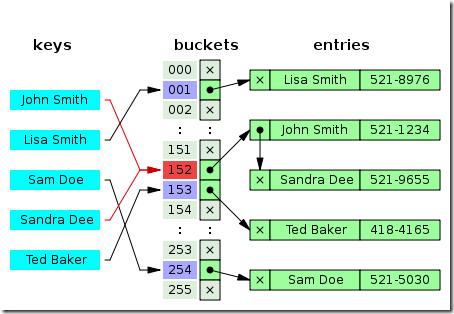

# 数据结构和算法

## 哈希表

哈希表就是一种以 键-值(key-indexed) 存储数据的结构，只要输入待查找的值即key，即可查找到其对应的值。

哈希的思路很简单，如果所有的键都是整数，那么就可以使用一个简单的无序数组来实现：将键作为索引，值即为其对应的值，这样就可以快速访问任意键的值。

使用哈希查找有两个步骤：使用哈希函数将被查找的键转换为数组的索引。在理想的情况下，不同的键会被转换为不同的索引值，但是在有些情况下需要处理多个键被哈希到同一个索引值的情况。所以哈希查找的第二个步骤就是处理冲突。

哈希表是一个在时间和空间上做出权衡的经典例子。如果没有内存限制，那么可以直接将键作为数组的索引。那么所有的查找时间复杂度为O(1)；如果没有时间限制，那么可以使用无序数组并进行顺序查找，这样只需要很少的内存。哈希表使用了适度的时间和空间来在这两个极端之间找到了平衡。只需要调整哈希函数算法即可在时间和空间上做出取舍。

### 哈希函数

哈希查找第一步就是使用哈希函数将键映射成索引。这种映射函数就是哈希函数。如果我们有一个保存0-M数组，那么就需要一个能够将任意键转换为该数组范围内的索引（0~M-1）的哈希函数。哈希函数需要易于计算并且能够均匀分布所有键。

1.正整数。获取正整数哈希值最常用的方法是使用除留余数法。即对于大小为素数M的数组，对于任意正整数k，计算k除以M的余数。M一般取素数。

2.字符串。将字符串作为键的时候，也可以将他作为一个大的整数，采用保留除余法。可以将组成字符串的每一个字符取值然后进行哈希。如果对每个字符去哈希值可能会比较耗时，所以可以通过间隔取N个字符来获取哈西值来节省时间。

### 解决哈希冲突

1.拉链法(Separate chaining with linked lists)。

通过哈希函数，可以将键转换为数组的索引(0-M-1)，但是对于两个或者多个键具有相同索引值的情况，需要有一种方法来处理这种冲突。一种比较直接的办法就是，将大小为M的数组的每一个元素指向一个条链表，链表中的每一个节点都存储散列值为该索引的键值对，这就是拉链法。

图中，”John Smith”和”Sandra Dee” 通过哈希函数都指向了152这个索引，该索引又指向了一个链表， 在链表中依次存储了这两个字符串。

该方法的基本思想就是选择足够大的M，使得所有的链表都尽可能的短小，以保证查找的效率。对采用拉链法的哈希实现的查找分为两步，首先是根据散列值找到等一应的链表，然后沿着链表顺序找到相应的键。

实现基于拉链表的散列表，目标是选择适当的数组大小M，使得既不会因为空链表而浪费内存空间，也不会因为链表太而在查找上浪费太多时间。拉链表的优点在于数组大小M的选择不是关键性的，如果存入的键多于预期，那么查找的时间只会比选择更大的数组稍长，另外，我们也可以使用更高效的结构来代替链表存储，比如二叉搜索树。

2.线性探测法（Linear Probing）。

线性探测法是开放寻址法解决哈希冲突的一种方法，基本原理为使用大小为M的数组来保存N个键值对，其中M>N，需要使用数组中的空位解决碰撞冲突。

在该图中，”Ted Baker” 是有唯一的哈希值153的，但是由于153被”Sandra Dee”占用了。而原先”Snadra Dee”和”John Smith”的哈希值都是152的，但是在对”Sandra Dee”进行哈希的时候发现152已经被占用了，所以往下找发现153没有被占用，所以存放在153上，然后”Ted Baker”哈希到153上，发现已经被占用了，所以往下找，发现154没有被占用，所以值存到了154上。

开放寻址法中最简单的是线性探测法：当碰撞发生时即一个键的散列值被另外一个键占用时，直接检查散列表中的下一个位置即将索引值加1，这样的线性探测会出现三种结果：

>- 命中，该位置的键和被查找的键相同
>- 未命中，键为空
>- 继续查找，该位置和键被查找的键不同。

实现线性探测法也很简单，需要两个大小相同的数组分别记录key和value。线性探查（Linear Probing）方式虽然简单，但是有一些问题，它会导致同类哈希的聚集。在存入的时候存在冲突，在查找的时候冲突依然存在。

### 性能分析

对于拉链法，查找的效率在于链表的长度，一般应该保证长度在M/8~M/2之间，如果链表的长度大于M/2，可以扩充链表长度。如果长度在0~M/8时，我们可以缩小链表。

对于线性探测法，也是如此，但是动态调整数组的大小需要对所有的值从新进行重新散列并插入新的表中。

不管是拉链法还是散列法，这种动态调整链表或者数组的大小以提高查询效率的同时，还应该考虑动态改变链表或者数组大小的成本。散列表长度加倍的插入需要进行大量的探测， 这种均摊成本在很多时候需要考虑。