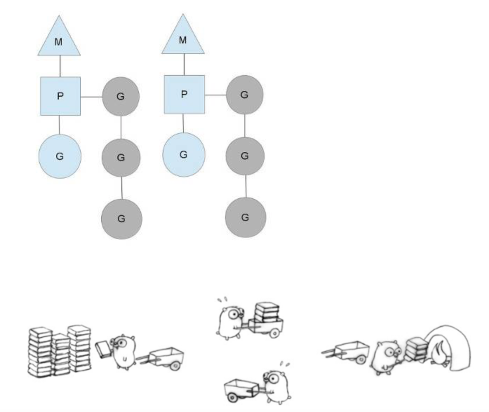

# Golang

## 3个环境变量

>- GOROOT：Go 语⾔安装根⽬录的路径，也就是 GO 语⾔的安装路径。
>- GOPATH：若⼲⼯作区⽬录的路径。是我们⾃⼰定义的⼯作空间。
>- GOBIN：GO 程序⽣成的可执⾏⽂件（executable file）的路径。

GOPATH 可以简单理解成 Go 语⾔的⼯作⽬录，它的值是⼀个⽬录的路径，也可以是多个⽬录路径，每个⽬录都代表 Go 语⾔的⼀个⼯作区（workspace）。

与许多编程语⾔⼀样，Go 语⾔的源码也是以代码包为基本组织单位的。在⽂件系统中，这些代码包其实是与⽬录⼀⼀对应的。由于⽬录可以有⼦⽬录，所以代码包也可以有⼦包。
⼀个代码包中可以包含任意个以.go 为扩展名的源码⽂件，这些源码⽂件都需要被声明属于同⼀个代码包。代码包的名称⼀般会与源码⽂件所在的⽬录同名。如果不同名，那么在构建、安装的过程中会以代码包名称为准。

每个代码包都会有导⼊路径。代码包的导⼊路径是其他代码在使⽤该包中的程序实体时，需
要引⼊的路径。在实际使⽤程序实体之前，我们必须先导⼊其所在的代码包。具体的⽅式就
是import该代码包的导⼊路径。

在⼯作区中，⼀个代码包的导⼊路径实际上就是从 src ⼦⽬录，到该包的实际存储位置的
相对路径。所以说，Go 语⾔源码的组织⽅式就是以环境变量 GOPATH、⼯作区、src ⽬录和代码包为主线的。⼀般情况下，Go 语⾔的源码⽂件都需要被存放在环境变量 GOPATH 包含的某个
⼯作区（⽬录）中的 src ⽬录下的某个代码包（⽬录）中。

## HelloWorld

如果⼀个源码⽂件声明属于main包，并且包含⼀个⽆参数声明且⽆结果声明的main函数，
那么它就是命令源码⽂件。当需要模块化编程时，我们往往会将代码拆分到多个⽂件，甚⾄拆分到不同的代码包中。但⽆论怎样，对于⼀个独⽴的程序来说，命令源码⽂件永远只会也只能有⼀个。如果有与命令源码⽂件同包的源码⽂件，那么它们也应该声明属于main包。

```go
package main

import "fmt"

func main() {
    fmt.Println("Hello, 世界")
}
```

## 语言基础

### 变量和常量

整型: int 4/8字节 uint 4/8字节 int8/uint8 1字节 int16/uint16 2字节 int32/uint32 4字节 int64/uint64 8字节

浮点型: float32/float64

复数型: complex64/complex128 complex64类型的值会由两个float32类型的值分别表示复数的实数部分和虚数部分。而complex128类型的值会由两个float64类型的值表示复数的实数部分和虚数部分。负数类型的值一般由浮点数表示的实数部分、加号"+"、浮点数表示的虚数部分以及小写字母"i"组成，比如3.9E+1 + 9.99E-2i。

字符串类型: string 字符串的表示法有两种，即：原生表示法和解释型表示法。原生表示法，需用用反引号"`"把字符序列包起来，如果用解释型表示法，则需要用双引号"""包裹字符序列。二者的区别是，前者表示的是所见即所得的(除了回车符)。后者所表示的值中转义符会起作用。字符串值是不可变的，如果我们创建了一个此类型的值，就不可能再对它本身做任何修改。

别名类型: byte rune byte与rune都属于别名类型。byte是uint8的别名类型，而rune是int32的别名类型。一个rune的类型值即可表示一个Unicode字符。一个Unicode代码点通常由"U+"和一个以十六进制表示法表示的整数表示，例如英文字母'A'的Unicode代码点为"U+0041”。rune类型的值需要由单引号"'"包裹。

```go
var num int = 1
var num1, num2 int = 1, 2
var (
    num int    = 1
    name string = "name"
)
var num8 int = 032 // 八进制
var num16 int = 0x32  // 十六进制 

var numf1 float32 = 2E-2  // 0.02 
var numf2 float32 = 2E+2  // 200

var str1 string = "str"
var str2 string = `str`
```

数组类型: [长度]类型 eg: [3]int 一个数组是可以容纳若干相同类型的元素的容器。数组的长度是固定的。使用下标读写任意元素，len获取长度。如果一个数组没有赋值，，则它的默认值[length]type{0, 0, 0 …}，总之不是nil。

切片类型: []类型 eg: []int 切片(slice)与数组一样也是可以若干相同类型元素的容器。与数组不同的是切片类型的长度不确定。每个切片值都会将数组作为其底层数据结构。

操作数组值的方法同样适用于切片值。还有一种操作数组的方式叫做“切片”，实施切片操作的方式就是切片表达式。除了长度切片值以及数组值还有另外一个属性：容量。数组的容量总是等于其长度，而切片值的容量往往与其长度不同，而是等于底层数组的长度。可以使用cap()内建函数获取数组、切片、通道类型的值的容量。

append会对切片值进行扩展并返回一个新的切片值。一旦扩展操作超出了被操作的切片值的容量，那么该切片的底层数组就会被替换 最后一种操作切片的方式是“复制”。该操作的实施方法是调用copy函数。该函数接收两个类型相同的切片值作为参数，并把第二个参数值中的元素复制到第一个参数值中的相应位置(索引值相同)上。

这种复制遵循最小复制原则，即：被复制的元素的个数总是等于长度较短的那个参值的长度。与append函数不同，copy函数会直接对其第一个参数值进行修改。

切片属于引用类型，零值为nil。

```go
var array1 = [3]int{1,2,3}
var array2 = [...]int{1,2,3}

var slice1 = []int{1,2,3}

var array2 = [5]int{1,2,3,4,5}
var slice2 = array2[1:4] // 使用索引[1,4)构建 此切片的容量为4

var array3 = [5]int{1,2,3,4,5}
var slice1 = array3[1:4:4] // 第三个整数为索引的上界 此切片的容量为3
```

字典类型 map[key类型]value类型 eg: map[string]int 字典的键类型必须是可比较的，否则会引起错误，即键不能是切片、字典、函数类型。字典值的字面量表示法实际上与数组的切片的字面量表示法很相似。最左边仍然是类型字面量，右边紧挨着由花括号包裹且有英文逗号分隔的键值对。每个键值对的键和值之间由冒号分隔。

对于字典值来说，如果指定键没有对应的值则默认为该类型的空值。 从字典中删除键值对的方法非常简单，仅仅是调用内建函数delete，即delete(m, key)。

字典类型属于引用类型，它的零值即为nil

```go
mm := map[int]string{1:"a",2:"b"m,3:"c"}
e, ok := mm[5] // ok = false
```

通道类型 chan 类型 通道(Channel)是Go语言中一种非常独特的数据结构。它可用于在不同Goroutine之间传递类型化的数据。并且是并发安全的。相比之下，之前几种数据类型都不是并发安全的。
Goroutine可以被看作是承载可被并发执行的代码块的载体。它们由Go语言的运行时系统调度，并依托操作系统线程(又称内核线程)来并发地执行其中的代码块。

与其他的数据类型不同，我们无法表示一个通道类型的值，因此，我们无法用字面量来为通道类型的变量赋值。只能通过调用内建函数make来达到目的。make参数可接受两个参数，第一个参数是代表了将被初始化的值的类型的字面量，第二个参数则是值的长度。make函数也可以被用来初始化切片类型或字典类型的值。可以通过函数close来关闭通道。

在通道值有效的前提下，针对它的发送操作会在通道值已满(其中缓存的数据的个数已等于它的长度)时被阻塞。而向一个已被关闭的通道值发送数据会引发运行时异常。针对有效通道值的接收操作会在它已经为空时被阻塞。

通道类型属于引用类型，它的零值为nil。

```go
ch := make(chan int, 5)
slice := make([]int, 5)
mm := make(map[string]int)

fmt.Println(ch, slice, mm)
// 0xc00007e000 [0 0 0 0 0] map[]

ch <- 1 // 发送数据
c, ok := <- ch // 接受数据
```

这里的ok的值是bool类型的。它代表了通道值的状态，true代表通道值有效，而false则代表通道值已无效(或称已关闭)，更深层次的原因是，如果在接受操作进行之前或过程中通道值被关闭了，则接收操作会立即结束并返回一个该通道值的元素类型的零值。

### 流程控制

```go
func what() int {
    return 1;
}

if a := what(); a <= 1 {
    fmt.Println("OK")
} else {
    fmt.Println("Err")
}

switch what() {
case 0:
    fmt.Printf("0")
case 1:
    fmt.Printf("1")
case 2:
    fallthrough // 默认每个case会break 继续执行需要fallthrough
case 3:
    fmt.Printf("2 or 3")
case 4, 5, 6:
    fmt.Printf("4, 5, 6")
default:
    fmt.Printf("Default")
}

sum := 0
for i := 0; i < 10; i++ {
    sum += i
}

func jumpFunc() {
    i := 0
HERE:
    fmt.Println(i)
    i++
    if i < 10 {
        goto HERE
    }
}

```

### 函数

func ＋ 函数名 ＋ 参数 ＋ 返回值（可选）＋ 函数体

在golang中有两个特殊的函数，main函数和init函数，main函数不用介绍在所有语言中都一样，它作为一个程序的入口，只能有一个。init函数在每个package是可选的，可有可无，甚至可以有多个(但是强烈建议一个package中一个init函数)，init函数在你导入该package时程序会自动调用init函数，另外它只会被调用一次，因为当一个package被多次引用时，它只会被导入一次。

```go
func init()
{
    mt.Println("Hello go")
}

func main()
{
    mt.Println("Hello go")
}
```

使用普通变量作为函数参数的时候，在传递参数时只是对变量值得拷贝，即将实参的值复制给变参，当函数对变参进行处理时，并不会影响原来实参的值。

函数的变量不仅可以使用普通变量，还可以使用指针变量，使用指针变量作为函数的参数时，在进行参数传递时将是一个地址拷贝，即将实参的内存地址复制给变参，这时对变参的修改也将会影响到实参的值。

和其他语言不同的是，go语言在将数组名作为函数参数的时候，参数传递即是对数组的复制。在形参中对数组元素的修改都不会影响到数组元素原来的值。**数组是值语义**

在使用slice, map, chan 作为函数参数时，进行参数传递将是一个地址拷贝，即将底层数组的内存地址复制给参数slice, map, chan 。这时，对slice, map, chan 元素的操作就是对底层数组元素的操作。**因为他们是引用类型**

在go语言中，函数也作为一种数据类型，所以函数也可以作为函数的参数来使用。

**go语言可以返回局部变量的指针**，因为go语言的回收机制是当销毁栈上的临时数据且发现有被外部引用的栈上变量时，会自动转移到堆上。常见的用法有New函数返回一个新建对象的地址。

```go
type Person struct {
    Name string
    Age  uint32
}

// new struct Person pointer with given name and age
func NewPerson(name string, age uint32) *Person {
    return &Person{name, age}
}
```

Go语言中的闭包 闭包的体现形式，能常就是用函数返回另一个函数。

```go
package main

import (
    "fmt"
)

func adder() func(int) int {
    sum := 0
    return func(x int) int {
        sum += x
        return sum
    }
}

func main() {
    pos, neg := adder(), adder()
    for i := 0; i < 10; i++ {
        fmt.Println(
            pos(i),
            neg(-2*i),
        )
    }
}
```

闭包的概念：是可以包含自由（未绑定到特定对象）变量的代码块，这些变量不在这个代码块内或者任何全局上下文中定义，而是在定义代码块的环境中定义。要执行的代码块（由于自由变量包含在代码块中，所以这些自由变量以及它们引用的对象没有被释放）为自由变量提供绑定的计算环境（作用域）。

闭包的价值 : 闭包的价值在于可以作为函数对象或者匿名函数，对于类型系统而言，这意味着不仅要表示数据还要表示代码。支持闭包的多数语言都将函数作为第一级对象，就是说这些函数可以存储到变量中作为参数传递给其他函数，最重要的是能够被函数动态创建和返回。

```go
package main

import "fmt"

func main() {
    var funcList []func()
    for i := 0; i < 3; i++ {
        funcList = append(funcList, func() {
            fmt.Println(i)
        })
    }

    // 通过for循环的案例分析闭包对引用环境中变量的调用问题
    // 解决方案：使用传参
    for _, f := range funcList {
        f() // 全部输出3
    }
}
```

Go语言中的闭包同样也会引用到函数外的变量。闭包的实现确保只要闭包还被使用，那么被闭包引用的变量会一直存在。闭包可能会导致变量逃逸到堆上来延长变量的生命周期，给 GC 带来压力。闭包会使得函数中的变量都被保存在内存中，内存消耗很大，所以不能滥用闭包。

当闭包所在函数重新调用时，其闭包是新的，其context引用的变量也是重新在heap定义过的。

```go
package main

import "fmt"

func closure() func(int) int {
    var x int
    return func(a int) int {
        x++
        return a + x
    }
}

func main() {
    f := closure()

    fmt.Println("x:", f(1))
    fmt.Println("x:", f(2))
}

// go build -gcflags "-N -l -m"
// .\main.go:6:6: moved to heap: x
// .\main.go:7:9: func literal escapes to heap
// .\main.go:16:13: ... argument does not escape
// .\main.go:16:14: "x:" escapes to heap
// .\main.go:16:21: f(1) escapes to heap
// .\main.go:17:13: ... argument does not escape
// .\main.go:17:14: "x:" escapes to heap
// .\main.go:17:21: f(2) escapes to heap
```

defer调用会在当前函数执行结束前才被执行，这些调用被称为延迟调用 。defer中使用匿名函数依然是一个闭包。

```go
package main

import "fmt"

func main() {
    x, y := 1, 2

    defer func(a int) {
        fmt.Printf("x:%d, y:%d\n", a, y) // y 为闭包引用
    }(x) // 复制 x 的值

    x += 100
    y += 100
    fmt.Println(x, y)
}
// 101 102
// x:1, y:102
```

### 类

```go
type Poem struct {
    Title  string
    Author string
    intro  string
}

poem := &Poem{} // 指针
poem.Author = "Heine"

poem2 := &Poem{Author: "Heine"}

poem3 := new(Poem) // 指针
poem3.Author = "Heine"

poem4 := Poem{}
poem4.Author = "Heine"

poem5 := Poem{Author: "Heine"}

func (poem *Poem) publish() {
    fmt.Println("poem publish")
}

func (poem Poem) publish() {
    fmt.Println("poem publish")
}
```

这样就声明了一个类，其中没有public、protected、private的的声明。golang用另外一种做法来实现属性的访问权限：属性的开头字母是大写的则在其它包中可以被访问，否则只能在本包中访问。类的声明和方法亦是如此。**Amazing**

实例化的时候可以初始化属性值，如果没有指明则默认为系统默认值。

类的成员函数叫做方法。和其它语言不一样，golang声明方法和普通方法一致，只是在func后增加了poem Poem这样的声明。加和没有加*的区别在于一个是传递指针对象，一个是传递值对象。

golang中不存在继承，但可以使用组合的方式达到类似的效果。ProsePoem属性中声明了Poem，表示组合了Poem的属性和方法(属性和方法都会被继承)。如果其中属性有冲突，则以外围的为主，也就是说会被覆盖。同样类方法出现冲突时也会“覆盖”（你需要一串更长的代码去访问被覆盖的属性），并不会支持重载。

```go
func (e *Poem) ShowTitle() {
    fmt.Printf(e.Title)
}

type Poem struct {
    Title  string
    Author string
    intro  string
}

type ProsePoem struct {
    Poem
    Author string
}

prosePoem := &ProsePoem{
        Poem: Poem{
            Title:  "Jack",
            Author: "slow",
            intro:  "simple",
        },
        Author: "test",
    }
```

### 接口

在面向对象编程中，可以这么说：“接口定义了对象的行为”， 那么具体的实现行为就取决于对象了。接口是一组方法签名(声明的是一组方法的集合)。当一个类型为接口中的所有方法提供定义时，它被称为实现该接口。它与oop非常相似。接口指定类型应具有的方法，类型决定如何实现这些方法。

将Struct向Interface变量赋值，实际作用是Interface获取了Struct中方法的实现集合。

```go
package main

import "fmt"

// 定义 Animal 为任何具有 Speak 方法的类型。Speak 方法没有参数，返回一个字符串。
// 所有定义了该方法的类型我们称它实现了 Animal 接口。
type Animal interface {
    Speak() string
}

type Cat struct{}

// Go 中没有 implements 关键字，判断一个类型是否实现了一个接口是完全是自动地。
func (c Cat) Speak() string {
    return "cat"
}

type Dog struct{}

// 也就意味是非入侵的。
func (d Dog) Speak() string {
    return "dog"
}

// 空接口类型
func Test(params interface{}) {
    fmt.Println(params)
}

func main() {
    animals := []Animal{Cat{}, Dog{}}
    for _, animal := range animals {
        fmt.Println(animal.Speak())
    }

    Test("string")
    Test(123)
    Test(true)
}

```

interface{} 类型，空接口，是导致很多混淆的根源。interface{} 类型是没有方法的接口。由于没有 implements 关键字，所以所有类型都至少实现了 0 个方法，所以 所有类型都实现了空接口。这意味着，如果您编写一个函数以 interface{} 值作为参数，那么您可以为该函数提供任何值。

在 Test() params **不是任意类型**，而是 **interface{} 类型**。Go 运行时将执行类型转换(如果需要)，并将值转换为 interface{} 类型的值。所有值在运行时只有一个类型，而 v 的一个静态类型是 interface{} 。

一个接口值由两个字（32 位机器一个字是 32 bits，64 位机器一个字是 64 bits）组成；一个字用于指向该值底层类型的方法表，另一个字用于指向实际数据。

**我可以将 []T 转换为 []interface{}吗？** 运行这段代码你会得到如下错误：cannot use names (type []string) as type []interface {} in argument to PrintAll。如果想使其正常工作，必须将 []string 转为 []interface{}。

```go
package main
 
import (
    "fmt"
)
 
func PrintAll(vals []interface{}) {
    for _, val := range vals {
        fmt.Println(val)
    }
}
 
func main() {
    names := []string{"stanley", "david", "oscar"}
    PrintAll(names)

    // vals := make([]interface{}, len(names))
    // for i, v := range names {
    //     vals[i] = v
    // }
    // PrintAll(vals)
}
```

很丑陋，但是生活就是这样，没有完美的事情。（事实上，这种情况不会经常发生，因为 []interface{} 并没有像你想象的那样有用）

接口的另一个微妙之处是接口定义没有规定一个实现者是否应该使用一个指针接收器或一个值接收器来实现接口。当给定一个接口值时，不能保证底层类型是否为指针。将 Cat 的 Speak() 方法改为指针接收器，那么只有 \*Cat 实现了 Animal 要求的接口。相反的可以使用 \*Dog 指针初始化 animal 而无需改变 Dog 的 Speak() 方法。

这种方式可以正常工作，因为一个指针类型可以通过其相关的值类型来访问值类型的方法，但是反过来不行。即一个 \*Dog 类型的值可以使用定义在 Dog 类型上的 Speak() 方法，而 Cat 类型的值不能访问定义在 \*Cat 类型上的方法。

**Go 中的所有东西都是按值传递的。每次调用函数时，传入的数据都会被复制。对于具有值接收者的方法，在调用该方法时将复制该值。** 因为所有的参数都是通过值传递的，这就可以解释为什么 \*Cat 的方法不能被 Cat 类型的值调用了。任何一个 Cat 类型的值可能会有很多 \*Cat 类型的指针指向它，如果我们尝试通过 Cat 类型的值来调用 \*Cat 的方法，根本就不知道对应的是哪个指针。相反，如果 Dog 类型上有一个方法，通过 \*Dog来调用这个方法可以确切的找到该指针对应的 Gog 类型的值，从而调用上面的方法。运行时，Go 会自动帮我们做这些，所以我们不需要像 C语言中那样使用类似如下的语句 d->Speak() 。

```go
func (c *Cat) Speak() string {
    return "Meow!"
}
// or new(Cat)
animals := []Animal{&Cat{}, Dog{}}
```

### 断言和反射

断言是预判确认变量的类型。

```go
func main() {
    v := "hello world"
    fmt.Println(typeof(v))
}
func typeof(v interface{}) string {
    switch t := v.(type) {
    case int:
        return "int"
    case float64:
        return "float64"
    //... etc
    default:
        _ = t
        return "unknown"
    }
}
```

反射则是因为interface中实际记录的有存储对象的类型，可以提取出变量的类型。

```go
import (
    "fmt"
    "reflect"
)

func main() {
    s := "hello world"
    fmt.Println(typeof(s))

    b := []byte("hello world")
    fmt.Println(typeof(b))
}

func typeof(v interface{}) string {
    return reflect.TypeOf(v).String()
}
```

### 回收处理

在golang当中，defer代码块会在函数调用链表中增加一个函数调用。这个函数调用不是普通的函数调用，而是会在函数正常返回，也就是return之后添加一个函数调用。因此，defer通常用来释放函数内部变量。

通过defer，我们可以在代码中优雅的关闭/清理代码中所使用的变量。defer作为golang清理变量的特性，有其独有且明确的行为。以下是defer三条使用规则。

>- 当defer被声明时，其参数就会被实时解析。即defer的参数的变量值，在代码中defer使用后的位置改变并不会对改变defer用到的值。
>- defer执行顺序为先进后出。在函数中，先定义的defer将会后执行。
>- defer可以读取有名返回值。defer代码块的作用域仍然在函数之内，因此defer仍然可以读取函数内的变量。

### make和new的区别

new 的作用是初始化一个指向类型的指针(*T)，make 的作用是为 slice，map 或 chan 初始化并返回引用(T)。

### 异常处理

对于异常处理，golang提供了recover和panic。

```go
package main

import (
    "fmt"
)

func main() {
    defer func() {
        fmt.Println("defer")
    }()

    defer func() {
        if err := recover(); err != nil {
            fmt.Println(err)
        }
    }()

    panic("fault")
    fmt.Println("out of reach")
}
```

程序首先运行panic，出现故障，此时跳转到包含recover()的defer函数执行，recover捕获panic，此时panic就不继续传递．但是recover之后，程序并不会返回到panic那个点继续执行以后的动作，而是在recover这个点继续执行以后的动作，即执行上面的defer函数，输出defer。

利用recover处理panic指令，必须利用defer在panic之前声明，否则当panic时，recover无法捕获到panic，无法防止panic扩散。

## 并发编程

### 协程

Go调度的几个概念：M：内核线程；G：go routine，并发的最小逻辑单元，由程序员创建；P：处理器，执行G的上下文环境，每个P会维护一个本地的go routine队列；



除了每个P拥有一个本地的go routine队列外，还存在一个全局的go routine队列。

具体调度原理：P的数量在初始化由GOMAXPROCS决定；我们要做的就是添加G；G的数量超出了M的处理能力，且还有空余P的话，runtime就会自动创建新的M；M拿到P后才能干活，取G的顺序：本地队列>全局队列>其他P的队列，如果所有队列都没有可用的G，M会归还P并进入休眠；

一个G如果发生阻塞等事件会进行阻塞，阻塞的M让出P，由其他M接管其任务队列；当执行的阻塞调用返回后，再将G扔到全局队列，自己则进入睡眠（没有P了无法干活）；

## 包管理

写 Go 代码的时经常用到 import 这个命令用来导入包。import 还支持如下两种方式来加载自己写的模块。

```go
// 相对路径
import "./model" // 当前文件同一目录的 model 目录，但是不建议这种方式 import

// 绝对路径
import "shorturl/model" // 加载 GOPATH/src/shorturl/model 模块

// 省略包名 类似于using namespace fmt
import( 
    . "fmt" 
) 

// 包名别名 类似于using f=fmt（当然C++的命名空间不能这么写）
import( 
    f "fmt" 
) 

// 并不想引用该包中的方法等，只是希望导入包时自动执行其中的Init()函数来做需要的初始化工作。
import ( 
    _ “github.com/xiyanxiyan10/misakago" 
)
```
