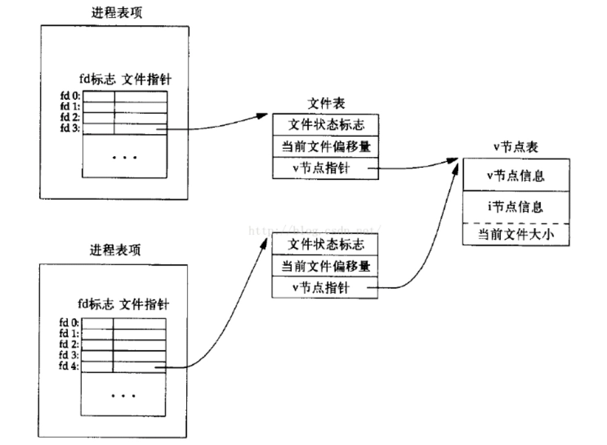

# 多进程/多线程的文件操作

## 基本概念

内核使用三种数据结构表示打开的文件，它们之间的关系决定了在文件共享方面一个进程对另一个进程可能产生的影响。

1.每个进程在进程表都有一个记录，记录项中包含有一张打开文件描述符表，与文件描述符相关联的是：

>- a) 文件描述符标志
>- b) 指向一个文件表项的指针，父子进程共享一个文件表项

2.内核为所有打开文件维持一张文件表，每个文件表项包括：

>- a) 文件状态标志 (读、写、同步、非阻塞等)
>- b) 当前文件偏移量
>- c) 指向该文件 v 节点表项的指针

3.每个打开文件都有一个v节点结构，包含了文件的所有者，文件长度，文件所在设备等信息。当多个进程同时修改一个文件时，通过v节点结构影响其他进程的读写。

情况一：一个进程打开两个不同的文件


情况二：两个进程打开相同的一个文件



情况三：父子进程打开三个不同的文件


## 创建文件的原子性

O_RDWR: 读写打开
O_CREAT: 若此文件不存在则创建它
O_EXCL: 如果同时指定了O_CREAT，而文件已经存在则出错。用此可以测试一个文件是否存在，如果不存在则创建此文件，这使测试和创建两者成为一个原子操作。

```cpp
#include <sys/types.h>
#include <sys/stat.h>
#include <fcntl.h>
#include <stdio.h>

int main() {
    int fd = open("./test.log", O_RDWR | O_CREAT | O_EXCL, 0777);
    if (fd == -1) {
        perror("create file fail");
        fd = open("./test.log", O_RDWR);
    } else {
        printf("create file success.\n");
    }
    printf("open file success, fd is %d\n", fd);
    return 0;
}
```

## read()/write() 函数的原子性

read()/write() 函数是系统调用，属于原子操作，当一个文件被多个进程或者多个线程同时操作时，不会出现内容交错的现象。

举个例子：进程 A 向文件 C 写入 "AAAA", 使用语句 write(fd, "AAAA", 4);进程 B 向文件 C 写入 "BBBB", 使用语句 write(fd, "BBBB", 4);文件 C 的内容肯定不会出现 "AABBBBAA" 这种内容交错情况，最终文件 C 的内容只可能为 "AAAABBBB"、"BBBBAAAA"、"BBBB"、"AAAA" 这四种情况。

## read()/write()/lseek() 的关系

每个文件描述符都有一个与其关联的 "当前文件偏移量"，它通常是一个非负整数，用以度量从文件开始处计算的字节数。通常读、写操作都是从当前文件偏移量处开始的，并使偏移量增加所读写的字节数。当 open() 一个文件时，除非指定O_APPEND选项，否则该偏移量都被设置为0。

>- read() 操作在成功返回之前，偏移量将增加实际读到的字节数。
>- write() 操作在成功返回之前，偏移量将增加实际写的字节数。
>- lseek() 可以显式地为一个打开文件设置偏移量。

简单来说，对于每个文件描述符都有一个偏移量，read与write共同影响此偏移量，可通过lseek来设置。

## 需要考虑数据冲突的情况

假设有一个被打开的文件 C，考虑下面三种情况：

### 情况1：多进程单线程

每个进程只打开一个 fd。这种情况下数据冲突的本质是存在多个fd，每个fd指向不同的文件表项，也就是拥有多个不同的文件偏移量，可能会导致不同进程写入文件的数据的相互覆盖。对于 write() 操作，可以通过open文件时指定O_APPEND选项，那么每次 write() 操作时，内核会在文件末尾追加，不会产生数据被覆盖的问题。比如要实现多进程共写一个日志文件，那么只需要open()文件时指定O_APPEND选项，就能轻松实现。

```cpp
#include <sys/types.h>
#include <sys/stat.h>
#include <fcntl.h>
#include <stdio.h>

int main() {
    int fd = open("./test.log", O_WRONLY | O_APPEND);
    if (fd == -1) {
        perror("open file fail");
        return -1;
    }
    printf("open file success, fd is %d\n", fd);
    return 0;
}
```

### 情况2：单进程多线程

进程只打开一个 fd，线程间共用fd。这种情况下，只有一个文件表项，也就是只有一个文件偏移量，如果不调用lseek()后再调用read()/write()，那么并没有数据冲突的危险，lseek()与read()/write()是两步操作，并不能做到原子性，可能调用完lseek()，准备进行读写时，别的线程恰好也调用了lseek()，这样偏移量就会产生冲突，可以通过线程锁来解决这个问题，同时系统也提供了两个函数来支持lseek()与read()/write()操作的原子性。

```cpp
#include <unistd.h>

ssize_t pread(int fd, void *buf, size_t count, off_t offset);

ssize_t pwrite(int fd, const void *buf, size_t count, off_t offset);
```

调用pread相当于调用lseek后调用read，但是pread又与这种顺序调用有下列终于区别：a) 调用 pread 时，无法中断其定位与读操作；b) 不更新当前文件的偏移量。pwrite与pread类似。

### 情况 3：单进程多线程

每个线程各打开一个fd，线程间不共用fd。这种情况与情况1类似，本质也是存在多个fd，每个fd指向不同的文件表项，也就是拥有多个文件偏移量。
