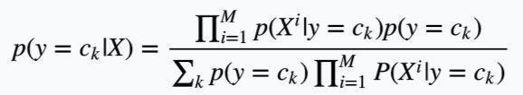
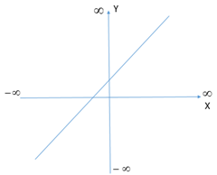
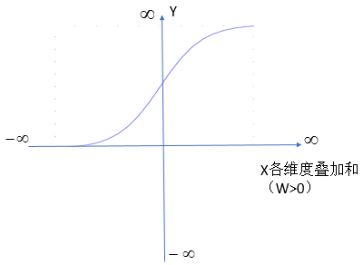
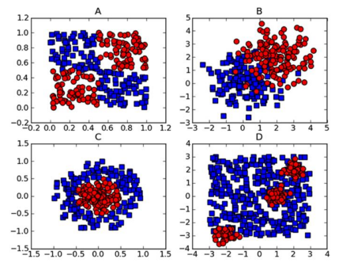
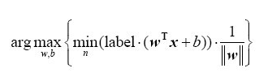
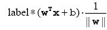
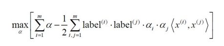
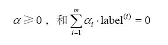
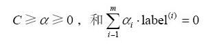

# 机器学习读书笔记

## 基本概念

>- 特征（属性）
>- 训练集 与 训练样本
>- 训练数据 与 测试数据
>- 数值类型 与 标称类型
>- 监督学习 与 无监督学习， 目标变量
>- 分类 与 回归
>- 聚类 与 密度估计

## 工具

Python, NumPy, SciPy, Pylabn, Matplotlib

## 步骤

收集数据 -> 准备数据 -> 分析数据 -> 训练算法 -> 测试算法 -> 使用算法

## K近邻

一种用于分类和回归的无母数统计方法。在这两种情况下，输入包含特征空间中的 k 个最接近的训练样本。在`k-NN`分类中，输出是一个分类族群。一个对象的分类是由其邻居的“多数表决”确定的，k（正整数，通常较小）个最近邻居中最常见的分类决定了赋予该对象的类别。若 k = 1，则该对象的类别直接由最近的一个节点赋予。在`k-NN`回归中，输出是该对象的属性值。该值是其 k 个最近邻居的值的平均值。最近邻居法采用向量空间模型来分类，概念为相同类别的案例，彼此的相似度高，而可以藉由计算与已知类别案例之相似度，来评价未知类别案例可能的分类。

`k-NN`是一种基于实例的学习，或者是局部近似和将所有计算推迟到分类之后的惰性学习。`k-NN`是所有的机器学习算法中最简单的之一。无论是分类还是回归，衡量邻居的权重都非常有用，使较近邻居的权重比较远邻居的权重大。例如，一种常见的加权方案是给每个邻居权重赋值为 1/d，其中 d 是到邻居的距离。邻居都取自一组已经正确分类（在回归的情况下，指属性值正确）的对象。虽然没要求明确的训练步骤，但这也可以当作是此算法的一个训练样本集。`k-NN`的缺点是对数据的局部结构非常敏感。

## 决策树

决策树是在已知各种情况发生概率的基础上，通过构成决策树来求取净现值的期望值大于等于零的概率，评价项目风险，判断其可行性的决策分析方法，是直观运用概率分析的一种图解法。由于决策分支画成图形很像一棵树的枝干，故称决策树。在机器学习中，决策树是一个预测模型，代表的是对象属性与对象值之间的一种映射关系。Entropy = 系统的凌乱程度，使用算法 ID3, C4.5, C5.0 生成树算法使用熵。这一度量是基于信息学理论中熵的概念。决策树是一种树形结构，其中每个内部节点表示一个属性上的测试，每个分支代表一个测试输出，每个叶节点代表一种类别。决策树是一种十分常用的分类方法。他是一种监管学习，所谓监管学习就是给定一堆样本，每个样本都有一组属性和一个类别，这些类别是事先确定的，那么通过学习得到一个分类器，这个分类器能够对新出现的对象给出正确的分类。

## 朴素贝叶斯

朴素贝叶斯法是基于贝叶斯定理与特征条件独立假设的分类方法。和决策树模型相比，朴素贝叶斯分类器发源于古典数学理论，有着坚实的数学基础，以及稳定的分类效率。同时，模型所需估计的参数很少，对缺失数据不太敏感，算法也比较简单。朴素贝叶斯分类器基于一个简单的假定：给定目标值时属性之间相互条件独立。理论上，NBC 模型与其他分类方法相比具有最小的误差率，但是实际上并非总是如此。因为 NBC 模型假设属性之间相互独立，而这个假设在实际应用中往往是不成立的。通过贝叶斯定理和朴素的假定：

P(Category|Document) = P (Document|Category) * P(Category) / P(Document)

对一个分类问题，给定样本特征`X`，样本属于类别`y`的概率是：

p(y|X) = p(X|y) * p(y) / p(X)

这里`X`是对应的特征项，将特征维度设为`M`，因为特征两两之间独立同分布，根据全概率公式展开，上述公式变为：

通过上述公式，只要计算出每一个特征`Xi`在每一类的条件概率就行了，每一类的先验概率可以在训练集中计算可得，同样可以计算得出每一类上的条件独立的特征对应的条件概率总和。

## 逻辑斯蒂回归

逻辑斯蒂回归虽然这个算法从名字上来看是回归算法，但其实际上是一个分类算法。假设现在有一些数据点，我们用一条直线对这些点进行拟合（该线称为最佳拟合直线），这个拟合过程就称作回归。利用逻辑斯蒂回归进行分类的主要思想是：根据现有数据对分类边界线建立回归公式，以此进行分类。训练分类器时的做法就是寻找最佳拟合参数，使用的是最优化算法。

### 逻辑斯蒂回归和线性回归的区别

最佳回归系数是定值——线性回归：最佳回归系数和`Xi`相关，采用`sigmoid`函数描述这种关系——逻辑斯蒂回归。线性回归是根据样本`X`各个维度的`Xi`的线性叠加（线性叠加的权重系数`wi`就是模型的参数）来得到预测值的`Y`，然后最小化所有的样本预测值`Y`与真实值`y'`的误差来求得模型参数。我们看到这里的模型的值`Y`是样本`X`各个维度的`Xi`的线性叠加，是线性的。`Y = WX` (假设 `W` > 0)，`Y`的大小是随着`X`各个维度的叠加和的大小线性增加的，如图（`x`为了方便取1维）

然后再来看看逻辑斯蒂回归模型，假设 `W` > 0，`Y`与`X`各维度叠加和（这里都是线性叠加`W`）的图形关系，如图（`x`为了方便取1维）

可以看到`Y`的值大小不是随`X`叠加和的大小线性的变化了，而是一种平滑的变化。这种变化在`X`的叠加和为0附近的时候变化的很快，而在很大很大或很小很小的时候，`X`叠加和再大或再小，`Y`值的变化几乎就已经很小了。当`X`各维度叠加和取无穷大的时候，`Y`趋近于1，当`X`各维度叠加和取无穷小的时候，`Y`趋近于0。这种变量与因变量的变化形式就叫做`logistic`变化。在逻辑斯蒂回归中，`X`各维度叠加和（或`X`各维度）与`Y`不是线性关系，而是`logistic`关系。而在线性回归中，`X`各维度叠加和就是`Y`，也就是`Y`与`X`就是线性的了。

为什么变量与因变量要选用`logistic`关系？一方面需要`Y`代表的是概率即Y ∈（0，1）。其次希望`X`各维度叠加和在 0 附近变化幅度比较大，并且是非线性的变化。而在很大或很小的时候几乎不变化，这是基于概率的一种认识与需要。此外这个关系的公式要在之后形成的 cost function 是凸函数。

逻辑斯蒂回归是在线性回归模型的基础上，使用`sigmoid`函数，将线性模型的结果压缩到 [0，1] 之间，使其拥有概率意义。 其本质仍然是一个线性模型，实现相对简单。在广告计算和推荐系统中使用频率极高，是 CTR 预估模型的基本算法。同时，逻辑斯蒂回归模型也是深度学习的基本组成单元。逻辑斯蒂回归属于概率性判别式模型，之所以是概率性模型，是因为逻辑斯蒂回归模型是有概率意义的；之所以是判别式模型，是因为逻辑斯蒂回归回归并没有对数据的分布进行建模。逻辑斯蒂回归模型并不知道数据的具体分布，而是直接将判别函数，或者说是分类超平面求解了出来。

### 基于最优化方法的最佳回归系数确定

常见的最优化算法有梯度上升法（要找到某函数的最大值，最爱好的方法是沿着该函数的梯度方向寻找），梯度下降法（上升法求解函数的最大值，下降法反之）及其改进算法。

## 支持向量机

考虑下图方框A中的两组数据，它们之间已经分隔得足够开，因此很容易就可以在图中画出一条直线将两组数据点分开。在这种情况下，这组数据被称为线性可分（ linearly separable） 数据。

将上述数据集分割开的直线成为分隔超平面（separating hyperplane）。上述数据点都在二维平面上，所以分隔超平面是一条直线，如果数据集是三维的，用来分隔数据的就是一个平面。如果数据集是 N 维的，用来分隔数据的就是一个 N-1 维的超平面，也就是分类的决策边界。

我们希望找到离分割平面最近的点，然后确保他们离分隔面的距离尽可能远。这里点到分隔面的距离被称为间隔（margin）。支持向量就是离分隔超平面最近的那些点。最后试着最大化支持向量到分割面的距离，需要找到此问题的优化求解方法。

分隔超平面的形式可以写成`wT+b`。要计算点 A 到分隔超平面的距离，就必须给出点到分隔面的法线或垂线的长度，该值为`|wTA+b|/|w|`。这里的常数 b 类似于逻辑斯蒂回归中的截距。

输入数据给分类器会输出一个类别标签，这相当于一个类似于 Sigmoid 的函数在作用。如单位阶跃函数f，则`f(wT+b)`的输出+1/-1。而逻辑斯蒂回归中类别标签是0或者1。当计算数据点到分隔面的距离并确定分隔面的放置位置时，间隔是通`label*(wTx+b)`来计算，这时就能体现出-1和+1分类的好处。

为了找到分类器中定义的w和b必须找到具有最小间隔的数据点，也就是支持向量。一旦找到这些点，对该间隔作最大化，即：

被称为点分割面的几何间隔。如果令所有支持向量的`label*(wTx+b)`都为1，那么可以通过求`1/|w|`的最大值来得到最终解。但并非所有数据点的`label*(wTx+b)`都等于1，只有那些离分隔超平面最近的点得到的值才为1。而离超平面越远的数据点，其`label*(wTx+b)`的值也就越大。解决这个带有约束条件`label*(wTx+b)>=1.0`的优化问题可以使用拉格朗日乘数法，将超平面写成数据点的形式，优化目标函数最后变为：

如果数据100%线性可分，上述公式十分完美。但实际上所有的数据都不可能那么干净，这时候可以引入松弛变量允许有些数据点可以处于分隔面错误的一侧。此时新的约束条件则变为

常数 c 用于控制“最大化间隔”和“保证大部分点的函数间隔小于1.0”这两个目标的权重。一旦求出了所有的 α，那么分隔超平面就可以用这些 α 来表达。上述优化过程包含一个个最小化的目标函数和约束条件，可以使用二次规划求解工具来求解。1996年，John Platt发布了SMO（序列最小化）算法来训练 SVM。

对于线性不可分的数据，可以使用核函数（kernel）将数据转换为易于分类器理解的形式，如径向基函数（radial basis function）。利用核函数将数据映射到高维空间，在高维空间中解决线性问题。

## AdaBoost算法

Boosting, 也称为增强学习或提升法，是一种重要的集成学习技术， 能够将预测精度仅比随机猜度略高的弱学习器增强为预测精度高的强学习器，这在直接构造强学习器非常困难的情况下，为学习算法的设计提供了一种有效的新思路和新方法。其中最为成功应用的是，Yoav Freund 和 Robert Schapire 在1995年提出的 AdaBoost 算法。

AdaBoost是英文“Adaptive Boosting”（自适应增强）的缩写，它的自适应在于：前一个基本分类器被错误分类的样本的权值会增大，而正确分类的样本的权值会减小，并再次用来训练下一个基本分类器。同时，在每一轮迭代中，加入一个新的弱分类器，直到达到某个预定的足够小的错误率或达到预先指定的最大迭代次数才确定最终的强分类器。

Adaboost 算法可以简述为三个步骤。首先，是初始化训练数据的权值分布D1。假设有N个训练样本数据，则每一个训练样本最开始时，都被赋予相同的权值：w1 = 1/N。然后，训练弱分类器hi。具体训练过程中是：如果某个训练样本点，被弱分类器hi准确地分类，那么在构造下一个训练集中，它对应的权值要减小；相反，如果某个训练样本点被错误分类，那么它的权值就应该增大。权值更新过的样本集被用于训练下一个分类器，整个训练过程如此迭代地进行下去。最后，将各个训练得到的弱分类器组合成一个强分类器。各个弱分类器的训练过程结束后，加大分类误差率小的弱分类器的权重，使其在最终的分类函数中起着较大的决定作用，而降低分类误差率大的弱分类器的权重，使其在最终的分类函数中起着较小的决定作用。

换而言之，误差率低的弱分类器在最终分类器中占的权重较大，否则较小。

Adaboost 提供一种框架，在框架内可以使用各种方法构建子分类器。可以使用简单的弱分类器，不用对特征进行筛选，也不存在过拟合的现象。Adaboost 算法不需要弱分类器的先验知识，最后得到的强分类器的分类精度依赖于所有弱分类器。无论是应用于人造数据还是真实数据，Adaboost 都能显著的提高学习精度。Adaboost 算法不需要预先知道弱分类器的错误率上限，且最后得到的强分类器的分类精度依赖于所有弱分类器的分类精度，可以深挖分类器的能力。Adaboost 可以根据弱分类器的反馈，自适应地调整假定的错误率，执行的效率高。Adaboost 对同一个训练样本集训练不同的弱分类器，按照一定的方法把这些弱分类器集合起来，构造一个分类能力很强的强分类器，即“三个臭皮匠赛过一个诸葛亮”。

在Adaboost训练过程中，Adaboost会使得难于分类样本的权值呈指数增长，训练将会过于偏向这类困难的样本，导致Adaboost算法易受噪声干扰。此外，Adaboost依赖于弱分类器，而弱分类器的训练时间往往很长。