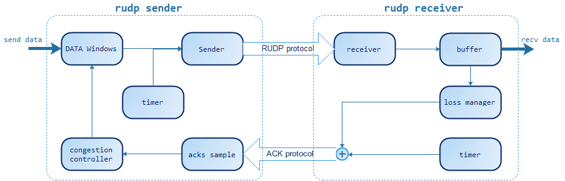
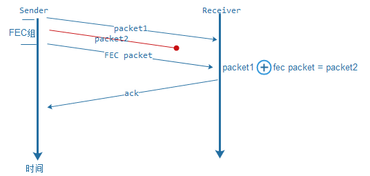
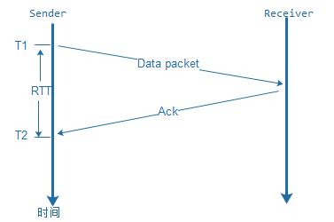
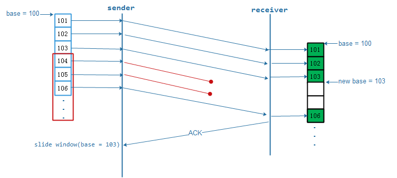
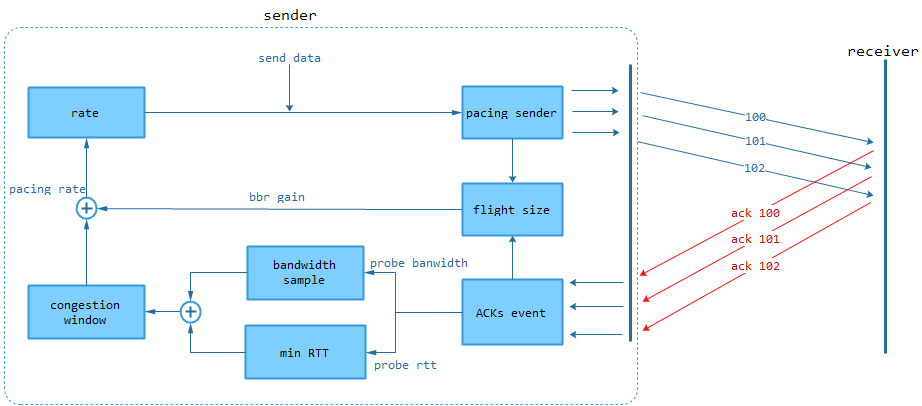
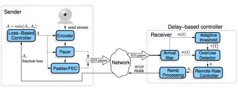
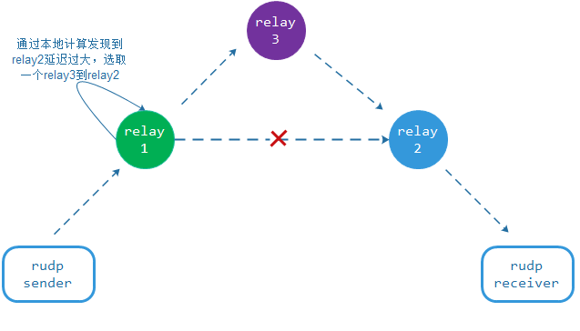
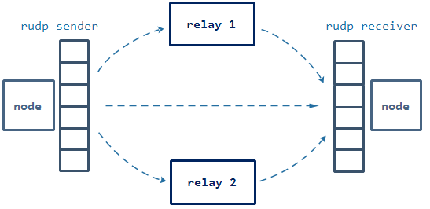

# RUDP - Reliable UDP

RUDP 在很多著名的项目上都有使用，例如 google 的 QUIC 和 webRTC。在 UDP 之上做一层可靠，可以解决实时领域里大部分问题。比如在教育公司来说，哪些场景使用了 RUDP:

>- 全局 250 毫秒延迟的实时 1V1 答疑，采用的是 RUDP + 多点 relay 智能路由方案；
>- 500 毫秒 1080P 视频连麦互动系统，采用的是 RUDP + PROXY 调度传输方案；
>- 6 方实时同步书写系统，采用的是 RUDP+redolog 的可靠传输技术；
>- 弱网 WIFI 下 Pad 的 720P 同屏传输系统，采用的是 RUDP +GCC 实时流控技术；
>- 大型直播的 P2P 分发系统，通过 RUDP + 多点并联 relay 技术节省了 75% 以上的分发带宽。

涉及到实时传输我们都会先考虑 RUDP，在实时通信领域存在一个三角平衡关系：成本，质量，时延。*TCP 属于是通过增大延迟和传输成本来保证质量的通信方式，UDP 是通过牺牲质量来保证时延和成本的通信方式，所以在一些特定场景下 RUDP 更容易找到这样的平衡点。*RUDP 是怎么去找这个平衡点的，就要先从 RUDP 的可靠概念和使用场景来分析。

## 可靠的概念

在实时通信过程中，不同的需求场景对可靠的需求是不一样的，在这里总体归纳为三类定义：

>- 尽力可靠：通信的接收方要求发送方的数据尽量完整到达，但业务本身的数据是可以允许缺失的。例如：音视频数据、幂等性状态数据。
>- 无序可靠：通信的接收方要求发送方的数据必须完整到达，但可以不管到达先后顺序。例如：文件传输、白板书写、图形实时绘制数据、日志型追加数据等。
>- 有序可靠：通信接收方要求发送方的数据必须按顺序完整到达。

## 为什么要可靠

TCP 是个基于公平性的可靠通信协议，在一些苛刻的网络条件下 TCP 要么不能提供正常的通信质量保证，要么成本过高。为什么要在 UDP 之上做可靠保证，究其原因就是在保证通信的时延和质量的条件下尽量降低成本，RUDP 主要解决以下相关问题：

>- 端对端连通性问题：一般终端直接和终端通信都会涉及到 NAT 穿越，TCP 在 NAT 穿越实现非常困难，相对来说 UDP 穿越 NAT 却简单很多，如果是端到端的可靠通信一般用 RUDP 方式来解决，场景有：端到端的文件传输、音视频传输、交互指令传输等等。
>- 弱网环境传输问题：在一些 WIFI 或者 3G/4G 移动网下，需要做低延迟可靠通信，如果用 TCP 通信延迟可能会非常大，这会影响用户体验。例如：实时的操作类网游通信、语音对话、多方白板书写等，这些场景可以采用特殊的 RUDP 方式来解决这类问题。
>- 带宽竞争问题：有时候客户端数据上传需要突破本身 TCP 公平性的限制来达到高速低延时和稳定，也就是说要用特殊的流控算法来压榨客户端上传带宽，例如：直播音视频推流，这类场景用 RUDP 来实现不仅能压榨带宽，也能更好的增加通信的稳定性，避免类似 TCP 的频繁断开重连。
>- 传输路径优化问题：在一些对延时要求很高的场景下，会用应用层 relay 的方式来做传输路由优化，也就是动态智能选路，这时双方采用 RUDP 方式来传输，中间的延迟进行 relay 选路优化延时。还有一类基于传输吞吐量的场景，例如：服务与服务之间数据分发、数据备份等，这类场景一般会采用多点并联 relay 来提高传输的速度，也是要建立在 RUDP 上的（这两点在后面着重来描述）。
>- 资源优化问题：某些场景为了避免 TCP 的三次握手和四次挥手的过程，会采用 RUDP 来优化资源的占用率和响应时间，提高系统的并发能，例如：QUIC。

不管哪类场景，都是要保证可靠性，也就是质量，那么在 UDP 之上怎么实现可靠呢？答案就是重传。

## 重传模式

IP 协议在设计的时候就不是为了数据可靠到达而设计的，所以 UDP 要保证可靠，就依赖于重传，这也就是我们通常意义上的 RUDP 行为，在描述 RUDP 重传之前先来了解下 RUDP 基本框架，如图

RUDP 在分为发送端和接收端，每一种 RUDP 在设计的时候会做不一样的选择和精简，概括起来就是图中的单元。RUDP 的重传是发送端通过接收端 ACK 的丢包信息反馈来进行数据重传，发送端会根据场景来设计自己的重传方式，重传方式分为三类：定时重传，请求重传和 FEC 选择重传。

### 定时重传

定时重传很好理解，就是发送端如果在发出数据包（T1）时刻一个 RTO 之后还未收到这个数据包的 ACK 消息，那么发送就重传这个数据包。这种方式依赖于接收端的 ACK 和 RTO，容易产生误判，主要有两种情况：

>- 对方收到了数据包，但是 ACK 发送途中丢失。
>- ACK 在途中，但是发送端的时间已经超过了一个 RTO。

所以超时重传的方式主要集中在 RTO 的计算上，如果你的场景是一个对延迟敏感但对流量成本要求不高的场景，就可以将 RTO 的计算设计比较小，这样能尽最大可能保证你的延时足够小。例如：实时操作类网游、教育领域的书写同步，是典型的用 expense 换 latency 和 Quality 的场景，适合用于小带宽低延迟传输。如果是大带宽实时传输，定时重传对带宽的消耗是很大的，极端情况会用 20% 的重复重传率，所以在大带宽模式下一般会采用请求重传模式。

### 请求重传

请求重传就是接收端在发送 ACK 的时候携带自己丢失报文的信息反馈，发送端接收到 ACK 信息时根据丢包反馈进行报文重传。如图

这个反馈过程最关键的步骤就是回送 ACK 的时候应该携带哪些丢失报文的信息，因为 UDP 在网络传输过程中会乱序会抖动，接收端在通信的过程中要评估网络的 jitter time，也就是 rtt_var（RTT 方差值），当发现丢包的时候记录一个时刻 t1, 当 t1 + rtt_var < curr_t(当前时刻)，我们就认为它丢失了，这个时候后续的 ACK 就需要携带这个丢包信息并更新丢包时刻 t2, 后续持续扫描丢包队列，如果他 t2 + RTO

### FEC 选择重传

除了定时重传和请求重传模式以外，还有一种方式就是以 FEC 分组方式选择重传，FEC（Forward Error Correction）是一种前向纠错技术，一般是通过 XOR 类似的算法来实现，也有多层的 EC 算法和 raptor 涌泉码技术，其实是一个解方程的过程。应用到 RUDP 上示意图如下：

在发送方发送报文的时候，会根据 FEC 方式把几个报文进行 FEC 分组，通过 XOR 的方式得到若干个冗余包，然后一起发往接收端，如果接收端发现丢包但能通过 FEC 分组算法还原，就不向发送端请求重传，如果分组内包是不能进行 FEC 恢复的，就请求想发送端请求原始的数据包。FEC 分组方式适合解决要求延时敏感且随机丢包的传输场景，在一个带宽不是很充裕的传输条件下，FEC 会增加多余的冗余包，可能会使得网络更加不好。FEC 方式不仅可以配合请求重传模式，也可以配合定时重传模式。

## RTT 与 RTO 的计算

在上面介绍重传模式时多次提到 RTT、RTO 等时间度量阐述，RTT（Round Trip Time）即网络环路延时，环路延迟是通过发送的数据包和接收到的 ACK 包计算了，示意图如下：

这个计算方式只是计算了某一个报文时刻的 RTT，但网络是会波动的，这难免会有噪声现象，所以在计算的过程中引入了加权平均收敛的方法（具体可以参考 RFC793）

SRTT = (α * SRTT) + (1-α)RTT

这样可以求得新逼近的 SRTT，在公式总一般α=0.8, 确定了 SRTT, 下一步就是计算 RTT_VAR(方差)，我们设 RTT_VAR = |SRTT – RTT| 那么

SRTT_VAR =(α * SRTT_VAR) + (1-α) RTT_VAR

这样可以得到 RTT_VAR 的值，但最终我们是需要去顶 RTO, 因为涉及到报文重传，RTO 就是一个报文的重传周期，从网络的通信流程我们很容易知道，重传一个包以后，如果一个 RTT+RTT_VAR 之后的时间还没收到确定，那我们就可以再次重传，则可知：

RTO = SRTT + SRTT_VAR

但一般网络在严重抖动的情况下还是会有较大的重复率问题，所以

RTO = β*(SRTT + RTT_VAR)

1.2 <β<2.0，可以根据不同的传输场景来选择β的值。

RUDP 是通过重传来保证可靠的，重传在三角平衡关系中其实是用 Expense 和 latency 来换取 Quality 的行为，所以重传会引来两个问题，一个是延时，一个是重传的带宽，尤其是后者，如果控制不好会引来网络风暴，所以在发送端会设计一个窗口拥塞机制了避免并发带宽占用过高的问题。

## 窗口与拥塞控制

RUDP 需要一个收发的滑动窗口系统来配合对应的拥塞算法来做流量控制，有些 RUDP 需要严格的发送端和接收端的窗口对应，有些 RUDP 是不要收发窗口严格对应。如果涉及到可靠有序的 RUDP，接收端就要做窗口就要做排序和缓冲，如果是无序可靠或者尽力可靠的场景，接收端一般就不做窗口缓冲，只做位置滑动。先来看收发窗口关系图：

上图描述的是发送端从发送窗口中发了 6 个数据报文给接收端，接收端收到 101,102,103,106 时会先判断报文的连续性并滑动窗口开始位置到 103，, 然后每个包都回应 ACK, 发送端在接收到 ACK 的时候，会确认报文的连续性，并滑动窗口到 103，发送端会再判断窗口的空余，然后填补新的发送数据，这就是整个窗口滑动的流程。这里值的一提的是在接收端收到 106 时的处理，如果是有序可靠，那么 106 不会通知上层业务进行处理，而是等待 104,105。如果是尽力可靠和无序可靠场景，会将 106 通知给上层业务先进行处理。在收到 ACK 后，发送端的窗口要滑动多少是由自己的拥塞机制定的，也就是说窗口的滑动速度受拥塞机制控制，拥塞控制实现要么基于丢包率来实现，要么基于双方的通信时延来实现，下面来看几种典型的拥塞控制。

### 经典拥塞算法

TCP 经典拥塞算法分为四个部分：慢启动、拥塞避免、拥塞处理和快速恢复，这四个部分都是为了决定发送窗和发送速度而设计的，其实就是为了在当前网络条件下通过网络丢包来判断网络拥塞状态，从而确定比较适合的发送传输窗口。经典算法是建立在定时重传的基础上的，如果 RUDP 采用这种算法来做拥塞控制，一般的场景是为了保证有序可靠传输的同时又兼顾网络传输的公平性原则。

经典拥塞控制是基于丢包检测和定时重传模式来设计的，在三角平衡关系中是一个典型的以 Latency 换取 Quality 的案例，但由于其公平性设计避免了过高的 Expense, 也就会让这种传输方式很难压榨网络带宽，很难保证网络的大吞吐量和小时延。

### BRR 拥塞算法

对于经典拥塞算法的延迟和带宽压榨问题 google 设计了基于发送端延迟和带宽评估的 BBR 拥塞控制算法。这种拥塞算法致力于解决两个问题：1. 一定丢包率网络传输链路上充分利用带宽 2. 降低网络传输中的 buffer 延迟。BBR 的主要策略是就是周期性通过 ACK 和 NACK 返回来评估链路的 min_rtt 和 max_bandwidth。最大吞吐量（cwnd）的大小就是:

cwnd = max_bandwidth / min_rtt

传输模型如下：

BBR 整个拥塞控制是一个探测带宽和 Pacing rate 的状态, 有是个状态：

>- Startup：启动状态（相当于慢启动）, 增益参数为 max_gain = 2.85
>- DRAIN：满负荷传输状态
>- PROBE_BW：带宽评估状态，通过一个较小的 BBR 增益参数来递增（1.25）或者递减 (0.75)
>- PROBE_RTT：延迟评估状态，通过维持一个最小发送窗口（4 个 MSS）进行的 RTT 采样。

那么这几种状态是怎么且来回切换的呢？以下是 QUIC 中 BBR 大致的步骤如下：

>- 初始化连接时会将设置一个初始的 cwnd = 8， 并将状态设置 Startup
>- 在 Startup 下发送数据，根据 ACK 数据的采样周期性判断是否可以增加带宽，如果可以，将 cwnd = cwnd * max_gain。如果时间周期数超过了预设的启动周期时间或者发生了丢包，进行 DRAIN 状态
>- 在 DRAIN 状态下，如果 flight_size(发送出去但还未确认的数据大小) >cwnd, 继续保证 DRAIN 状态，如果 flight_size＜cwd, 进入 PROBE_BW 状态
>- 在 PROBE_BW 状态下，如果未发生丢包且 flight_size ＜ cwnd x 1.25, 将维持原来的 cwnd, 并进入 StartUp，如果发生丢包或者 flight_size > cwnd, 将 cwnd = cwnd x 1.25； 如果发生丢包，cwnd = cwnd x 0.75
>- 在 Startup/DRAIN/PROBE_BW 三个状态中，如果持续 10 秒钟的通信中没有出现 RTT <= min_rtt, 就会进入到 PROBE_RTT 状态，并将 cwnd = 4 * MSS
>- 在 PROBE_RTT 状态，会在收到 ACK 返回的时候持续判断 flight_size >= cwnd 并且无丢包，将本次统计的最小 RTT 作为 min_rtt, 进入 Startup 状态。

BBR 是通过以上几个步骤来周期性计算 cwnd，也就是网络最大吞吐量和最小延迟，然后通过 pacing rate 来确定这一时刻发送端的码率，最终达到拥塞控制的目的。BBR 适合在随机丢包且网络稳定的情况下做拥塞，如果在网络信号极不稳定的 WIFI 或者 4G 上，容易出现网络泛洪和预测不准的问题，BBR 在多连接公平性上也存在小 RTT 的连接比大 RTT 的连接更吃带宽的情况，容易造成大 RTT 的连接速度过慢的情况。BBR 拥塞算法在三角平衡关系中是采用 Expense 换取 latency 和 Quality 的案例。

### webRTC gcc

说到音视频传输就必然会想到 webRTC 系统，在 webRTC 中对于视频传输也实现了一个拥塞控制算法 (gcc)，webRTC 的 gcc 是一个基于发送端丢包率和接收端延迟带宽统计的拥塞控制，而且是一个尽力可靠的传输算法，在传输的过程中如果一个报文重发太多次后会直接丢弃，这符合视频传输的场景，借用 weizhenwei 同学一张图来看个究竟：

gcc 的发送端会根据丢包率和一个对照表来 pacing rate，当 loss <2% 时，会加大传输带宽，当 loss>=2% &&loss <10%, 会保持当前码率，当 loss >=10%，会认为传输过载，进行调小传输带宽。gcc 的接收端是根据数据到达的延迟方差和大小进行 KalmanFilter 进行带宽逼近收敛，具体的细节不介绍了，请查看这里值得一说的是 gcc 引入接收端对带宽进行 KalmanFilter 评估是一个非常新颖的拥塞控制思路，如果实现一个尽力可靠的 RUDP 传输系统不失为是一个很好的参考。但这种算法也有个缺陷，就是在网络间歇性丢包情况下，gcc 可能收敛的速度比较慢，在一定程度上有可能会造成 REMB 很难反馈给发送端，容易出现发送端流控失效。gcc 在三角平衡关系算一个以 Quality 和 Expense 换取 latency 的案例。

### 弱窗口拥塞机制

其实在很多场景是不用拥塞控制或者只要很弱的拥塞控制即可，例如：师生双方书写同步、实时游戏，因为本身的传输的数据量不大，只要保证足够小的延时和可靠性就行，一般会采用固定窗口大小来进行流控，我们在系统中一般采用一个 cwnd = 32 这样的窗口来做流控，ACK 确认也是通过整个接收窗口数据状态反馈给发送方，简单直接，也很容易适应弱网环境。

## 传输路径

RUDP 除了优化连接、压榨带宽、适应弱网环境等以外，它也继承了 UDP 天然的动态性，可以在中间应用层链路上做传输优化，一般分为多点串联优化和多点并联优化。我们具体来说一说。

### 多点串联 relay

在实时通信中一些对业务场景对延迟非常敏感，例如：实时语音、同步书写、实时互动、直播连麦等，如果单纯的服务中转或者 P2P 通信，很难无法满足其需求，尤其是在物理距离很大的情况下。在解决这个问题上 SKYPE 率先提出全球 RTN（实时多点传输网络），其实就是在通信双方之间通过几个 relay 节点来动态智能选路，这种传输方式很适合 RUDP，我们只要在通信双方构建一个 RUDP 通道，中间链路只是一个无状态的 relay cache 集合，relay 与 relay 之间进行路由探测和选路，以此来做到链路的高可用和实时性。如下图：

通过多点 relay 来保证 rudp 进行传输优化，这类场景在三角平衡关系里是典型的用 expense 来换取 latency 的案例。

### 多点并联 relay

在服务与服务进行媒体数据传输或者分发过程中，需要保证传输路径高可用和提高带宽并发，这类使用场景也会使用传输双方构建一个 RUDP 通道，中间通过多 relay 节点的并联来解决，如下图所示：

这种模型需要在发送端设计一个多点路由表探测机制，以此来判断各个路径同时发送数据的比例和可以用性，这个模型除了链路备份和增大传输并发带宽外，还有个辅助的功能，如果是流媒体分发系统，我们一般会用 BGP 来做中转，如果节点与节点之间可以直连，这样还可以减少对 BGP 带宽的占用，以此来减少成本问题。