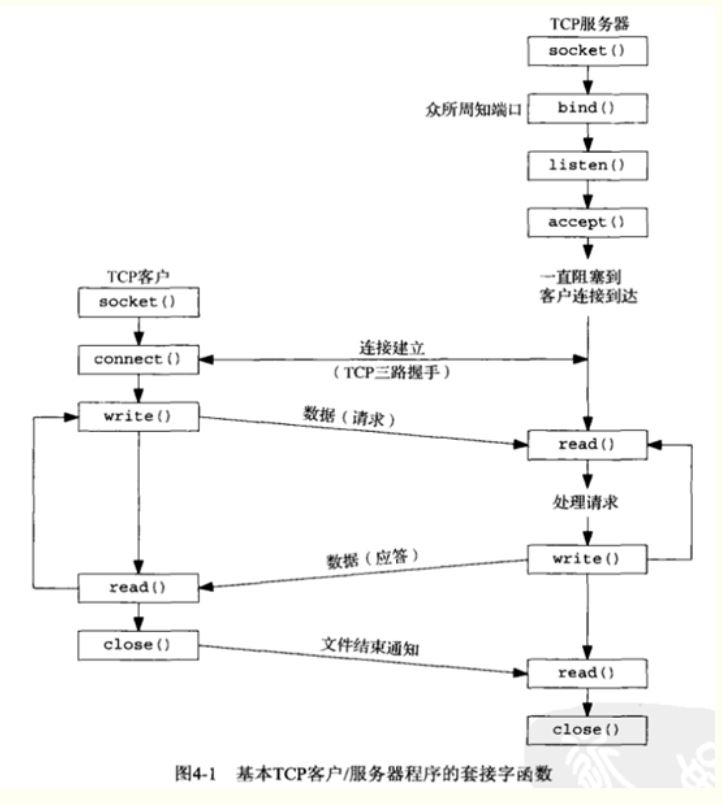
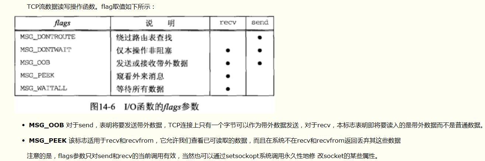
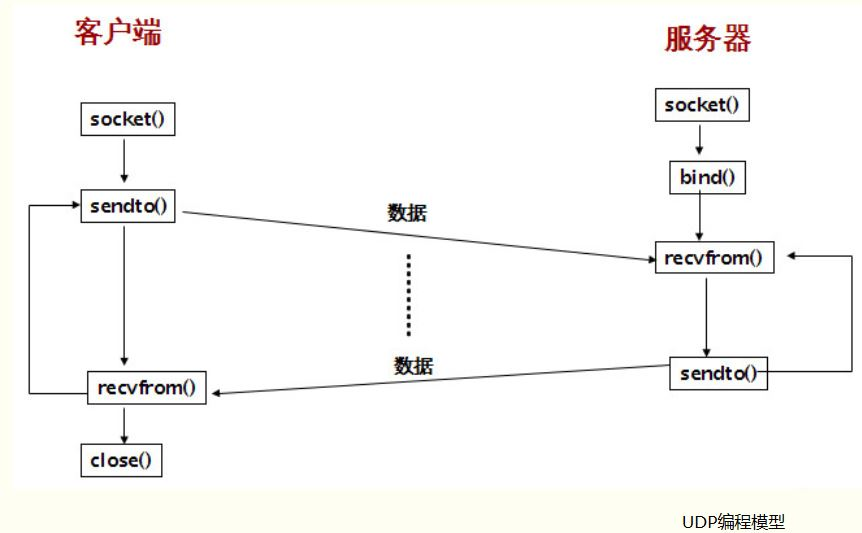

# 初识Socket套接字API

## 什么是Socket套接字

*socket是一种操作系统提供的进程间通信机制。*
操作系统中，通常会为应用程序提供一组应用程序接口（API），称为套接字接口（socket API）。应用程序可以通过套接字接口，来使用网络套接字，以进行数据交换。
Socket是应用层与TCP/IP协议族通信的中间软件抽象层，它是一组接口。在设计模式中，Socket其实就是一个门面模式，它把复杂的TCP/IP协议族隐藏在Socket接口后面，对用户来说，一组简单的接口就是全部，让Socket去组织数据，以符合指定的协议。而接口的具体实现都是内核来完成。

客户与服务器进程的作用是非对称的，因此代码不同。服务器进程一般是先启动的。只要系统运行，该服务进程一直存在，直到正常或强迫终止。


## TCP套接字编程API

### TCP交互流程

服务器

> 创建socket；
> 绑定socket和端口号；
> 监听端口号；
> 接收来自客户端的连接请求；
> 从socket中读取字符；
> 关闭socket。

客户端

> 创建socket；
> 连接指定计算机的端口；
> 向socket中写入信息；
> 关闭socket。



#### 创建套接字

```cpp
int  socket(int domain, int type, int protocol); // 返回sockfd
```

socket函数对应于普通文件的打开操作。普通文件的打开操作返回一个文件描述字，而socket()用于创建一个socket描述符（socket descriptor），它唯一标识一个socket。这个socket描述字跟文件描述字一样，后续的操作都有用到它，把它作为参数，通过它来进行一些读写操作。

domain：用于指定创建套接字所使用的协议族，协议族决定了socket的地址类型，在通信中必须采用对应的地址。常用的协议族有，AF_INET、AF_INET6、AF_LOCAL（或称AF_UNIX，Unix域socket）、AF_ROUTE等等。协议族决定了socket的地址类型，在通信中必须采用对应的地址，如AF_INET决定了要用ipv4地址（32位的）与端口号（16位的）的组合、AF_UNIX决定了要用一个绝对路径名作为地址。

domain参数

>- AF_INET  IPv4协议
>- AF_INET6  Ipv6协议
>- AF_LOCAL  Unix协议域/只在本机内通信的套接字
>- AF_ROUTE  路由套接字
>- AF_KEY  密钥套接字

type: 常用的socket类型有，SOCK_STREAM、SOCK_DGRAM、SOCK_RAW、SOCK_PACKET、SOCK_SEQPACKET等。

>- SOCK_STREAM  字节流套接字
>- SOCK_DGRAM  数据报套接字
>- SOCK_SEQPACKET  有序分组套接字
>- SOCK_RAW  原始套接字

protocol参数：通常设为0，通过参数domain指定的协议族和参数type指定套接字类型来确定参数。常用的协议有，IPPROTO_TCP、IPPTOTO_UDP、IPPROTO_SCTP、IPPROTO_TIPC等，它们分别对应TCP传输协议、UDP传输协议、STCP传输协议、TIPC传输协议。

```cpp
// 创建TCP套接字
// AF_INET：网络连接，ipv4
// SOCK_STREAM：TCP连接
int fd = socket(AF_INET, SOCK_STREAM, 0);
if (fd < 0) {
    std::cout<<"create socket error!"<<std::endl;
    return 0;
}
std::cout<<"create socket: "<<fd<<std::endl;
```

```cpp
// ipv4
struct sockaddr_in {
    sa_family_t    sin_family; /* address family: AF_INET */
    in_port_t      sin_port;   /* port in network byte order */
    struct in_addr sin_addr;   /* internet address */
};

/* Internet address. */
struct in_addr {
    uint32_t       s_addr;     /* address in network byte order */
};

// ipv6
struct sockaddr_in6 {
    sa_family_t     sin6_family;   /* AF_INET6 */
    in_port_t       sin6_port;     /* port number */
    uint32_t        sin6_flowinfo; /* IPv6 flow information */
    struct in6_addr sin6_addr;     /* IPv6 address */
    uint32_t        sin6_scope_id; /* Scope ID (new in 2.4) */
};

struct in6_addr {
    unsigned char   s6_addr[16];   /* IPv6 address */
};
```

#### 绑定套接字

```cpp
int bind(int sockfd, const struct sockaddr *addr, socklen_t addrlen); // 返回：成功为0，出错-1
```

sockfd：socket描述字，它是通过socket()函数的唯一标识的socket。

addr：一个const struct sockaddr *指针，指向要绑定给sockfd的协议地址。

addrlen：对应的是地址的长度。

通常服务器在启动的时候都会绑定一个众所周知的地址（如ip地址+端口号），用于提供服务，客户就可以通过它来接连服务器；而客户端就不用指定，有系统自动分配一个端口号和自身的ip地址组合。这就是为什么通常服务器端在listen之前会调用bind()，而客户端就不会调用，而是在connect()时由系统随机生成一个。
bind函数绑定特定的IP地址必须属于其所在主机的网络接口之一，服务器在启动时绑定它们众所周知的端口，如果一个TCP客户端或服务端未曾调用bind绑定一个端口，当调用connect或listen时，内核就要为响应的套接字选择一个临时端口。让内核选择临时端口对于TCP客户端来说是正常的额，然后对于TCP服务端来说确实罕见的，因为服务端通过他们众所周知的端口被大家认识的。

```cpp
// 命名套接字
struct sockaddr_in myaddr;
memset((void *)&myaddr, 0, sizeof(myaddr));
myaddr.sin_family = AF_INET;
myaddr.sin_addr.s_addr = htonl(INADDR_ANY);
myaddr.sin_port = htons(6666);
if (bind(fd, (struct sockaddr*)&myaddr, sizeof(myaddr)) < 0) {
        std::cout<<"name socket error!"<<std::endl;
    return 0;
}
std::cout<<"name socket"<<std::endl;
```

#### 建立连接

```cpp
int connect(int sockfd, const struct sockaddr *addr, socklen_t addrlen); // 返回：成功为0，出错-1
```

sockfd：socket描述字，它是通过socket()函数的唯一标识的socket。

addr：一个const struct sockaddr *指针，指向要绑定给sockfd的协议地址。

addrlen：对应的是地址的长度。

如果connect失败后，就必须close当前的套接字描述符并重新调用socket。客户端在调用connect前不必非得调用bind函数(比如UDP客户端编程中一般就不用调用bind)，内核会确定源IP地址，并选择一个临时端口作为源端口。如果是TCP套接字，调用connect函数将激发TCP的三次握手过程，而且仅在连接建立成功或出错时才返回。注意：connect是在接收到服务端响应的SYN+ACK时的返回的，也就是三次握手的第二次动作之后。UDP是可以调用connect函数的，但是UDP的connect函数和TCP的connect函数调用确是大相径庭的，这里没有三次握手过程。内核只是检查是否存在立即可知的错误(比如目的地址不可达)，记录对端的IP和端口号，然后立即返回调用进程。使用了connect的UDP编程就可不必使用sendto函数了，直接使用write/read即可。

#### 接受连接

```cpp
int accept(int sockfd, struct sockaddr *addr, socklen_t *addrlen); //  返回：成功返回已连接描述符(非负)，出错-1
```

如果accpet成功，那么其返回值是由内核自动生成的一个全新的描述字，代表与返回客户的TCP连接。accept的第一个参数为服务器的socket描述字，是服务器开始调用socket()函数生成的，称为监听socket描述字；而accept函数返回的是已连接的socket描述字。一个服务器通常通常仅仅只创建一个监听socket描述字，它在该服务器的生命周期内一直存在。内核为每个由服务器进程接受的客户连接创建了一个已连接socket描述字，当服务器完成了对某个客户的服务，相应的已连接socket描述字就被关闭。

sockfd：socket描述字，它是通过socket()函数的唯一标识的socket。

addr：一个const struct sockaddr *指针，用于返回客户端的协议地址。

addrlen：对应的是地址的长度。

```cpp
// 等待并接受连接
const int MAXBUF = 4096;
char buff[MAXBUF];
struct sockaddr_in client_addr;
int client_addr_len = sizeof(client_addr);
int client_fd;
while (1) {
    client_fd = accept(fd, (struct sockaddr*)&client_addr, &client_addr_len);
    if (client_fd < 0) {
        std::cout<<"connect error"<<std::endl;
        continue;
    }

    // 接收数据
    // 关闭套接字
}
```

accept函数会返回一个新的socket描述子，这个新的描述子代表了服务端和客户端的连接。后面可以用于读取数据以及关闭连接。

accept函数有TCP服务器调用，用于从已完成队列中列头返回下一个已完成连接，如果已完成队列为空，则进程被投入睡眠（如果该套接字为阻塞方式的话）。如果accept成功，那么其返回值是由内核自动生成的一个全新套接字，代表与返回客户的TCP连接，函数的第一个参数为监听套接字，返回值为已连接套接字。

accept默认会阻塞进程，直到有一个客户连接建立后返回，它返回的是一个新可用的套接字，这个套接字是连接套接字

#### 端口监听

```cpp
int listen(int sockfd, int backlog); // 返回：成功返回0，出错-1
```

sockfd：socket描述字，它是通过socket()函数的唯一标识的socket。

backlog：队列的大小，即socket可以排队的最大连接个数。socket()函数创建的socket默认是一个主动类型的，listen函数将socket变为被动类型的，等待客户的连接请求。

作为一个服务器，在调用socket()和bind()之后就会调用listen()来监听这个socket。为了能够在套接字上接受进入的连接，服务器程序必须创建一个队列来保存未处理的请求。调用listen函数将导致套接字从CLOSEE状态转换到LISTEN状态。第二个参数规定了内核应为相应套接字排队的最大连接个数。

```cpp
// 创建监听队列
    if (listen(fd, 5) < 0) {
        std::cout<<"listen failed"<<std::endl;
        return 0;
    }
```

#### 关闭套接字

```cpp
int close(int sockfd); // 若成功返回0，出错-1
```

close一个TCP套接字的默认行为是把该套接字标记为已关闭，然后立即返回到调用进程。注意，close实质把该套接字引用值减1，如果该引用值大于0，则对应的套接字不会被真正关掉。关闭一个套接字描述符，该描述字不能再由调用进程使用，也就是说不能再作为read或write的第一个参数。

```cpp
int shutdown(int s,int how);
```

close类似，但是功能更强大，可以对套接字的关闭进行一些更细致的控制，它允许对套接字进行单向关闭或者全部禁止。

SHUT_RD:读通道关闭，进程将不能再接收任何数据，接受缓冲区还未被读取的数据也将被丢弃，但仍然可以在该套接字上发送数据。

SHUT_WR:写通道关闭，进程将不能再发送任何数据，发送缓冲区还未被发送的数据也将被丢弃，但仍然可以在该套接字上接收数据。

SHUT_RDWR:读、写通道都被关闭

#### TCP套接字的数据传输

```cpp
// 返回：成功为读入或写入的字节数，出错为-1
ssize_t send(int s , const void *msg , size_t len , int flags);
```

函数send只能对处于连接状态的套接字使用。

s：为已建立好连接的套接字描述符，即accept的返回值。  

msg：指向存放待发送数据的缓冲区，  

len：为待发送数据的长度。  

flags： 为控制选项，一般设为0或取以下值。  



发送的数据太长而不能发送时，将出现错误，errno为EMSGSIZE。如果该套接字为阻塞方式，发送的数据长度大于该套接字的缓冲区剩余空间大小时，send一般会被阻塞。如果该套接字为非阻塞方式，发送的数据长度大于该套接字的缓冲区剩余空间大小时则此时立即返回-1并将errno设为EAGAIN。执行成功返回实际发送数据的字节数，出错则返回-1。  

执行成功只是说明数据写入套接字的缓冲区中，并不表示数据已经通过网络发送到目的地。

```cpp
ssize_t recv(int s , void *buf , size_t len , int flags);
```

函数recv只能对处于连接状态的套接字使用。

s：为已建立好连接的套接字描述符，即accept的返回值。

buf：所指定的缓冲区，  

len：为缓冲区的长度。  

flags：为控制选项，一般设置为0。

如果一个数据包太长以至于缓冲区无法放下时，剩余部分的数据有可能被丢弃(根据套接字的类型)。如果该套接字为阻塞方式,在指定的套接字上无数据到达时，recv被阻塞。如果该套接字为非阻塞方式，在指定的套接字上无数据到达时，则立即返回-1并将errno设置为EAGAIN。recv接受到数据就返回，不会等到接受到参数len指定的长度才返回。执行成功返回实际接收数据的字节数，出错则返回-1

### UDP套接字编程API

DP交互流程

接收方

> 创建socket；
> 绑定socket和端口号；
> 监听端口号；
> 从socket中读取字符；
> 关闭socket。

发送方

> 创建socket；
> 向socket中写入信息；
> 关闭socket。



UDP与TCP使用的是相同的API函数，这里不在重复叙述，唯一区别是相关的API参数不同，UDP不需要建立连接。

#### UDP套接字的数据传输

```cpp
// 返回：成功为读入或写入的字节数，出错为-1
ssize_t sendto(int s, const void *msg, size_t len, int flags, const struct sockaddr *to,socklen_t tolen);
```

sendto不需要套接字处于连接状态，常用来发送UDP数据。要指定数据目的地址和目的地址的长度。

```cpp
ssize_t recvfrom(int s, void *buf, size_t len,int flags,struct sockaddr *from, socklen_t *fromlen);
```

recvfrom用来接收UDP数据，需要指定源地址和源地址长度。

recvfrom和snedto的前3个参数和read/write的前3个参数一样。flags表示设置的标志值，简单的UDP程序可以直接设置为0，最后两个参数表示服务端地址(对于sendto来说)或者是对端地址(对于recvfrom来说)。如果不关心对端的地址，则设置为NULL，此时addrlen也可以设置为NULL了。

注意：recvfrom和sendto也可以应用于TCP编程，不过一般不这样用。UDP编程会有数据包的丢失问题，因为UDP是不可靠的，如果一个客户的数据包丢失，客户端将永远阻塞在recvfrom函数调用；类似的，如果客户数据到达了服务端，然后响应数据包丢失了，则客户永远阻塞在recvfrom调用。为了防止这样的问题出现，一般可以给recvfrom设置一个超时时间。  

### 字节序API

#### 主机字节序

主机字节序：不同的CPU有不同的字节序类型，整数在内存中保存的顺序称为主机字节序。

a) Little-Endian就是低位字节排放在内存的低地址端，高位字节排放在内存的高地址端。
b) Big-Endian就是高位字节排放在内存的低地址端，低位字节排放在内存的高地址端。

#### 网络字节序

4个字节的32 bit值以下面的次序传输：首先是0～7bit，其次8～15bit，然后16～23bit，最后是24~31bit。这种传输次序称作大端字节序。由于TCP/IP首部中所有的二进制整数在网络中传输时都要求以这种次序，因此它又称作网络字节序。字节序，顾名思义字节的顺序，就是大于一个字节类型的数据在内存中的存放顺序，一个字节的数据没有顺序的问题了。所以在将一个地址绑定到socket的时候，请先将主机字节序转换成为网络字节序，而不要假定主机字节序跟网络字节序一样使用的是Big-Endian。所以务必将其转化为网络字节序再赋给socket。

#### 点分10进制格式  

这是我们最常见的表示格式，比如某机的IP地址可能为“202.101.105.66”。事实上，对于Ipv4（IP版本）来说，IP地址是由一个32位的二进制数所构成，但这样一串数字序列无疑是十分冗长并且难以阅读和记忆的。为了方便人们的记忆和使用，就将这串数字序列分成4组，每组8位，并改为用10进制数进行表示，最后用小原点隔开，于是就演变成了“点分10进制表示格式”。

```cpp
#include <arpa/inet.h>
/*主机字节顺序 --> 网络字节顺序*/
uint32_t htonl(uint32_t hostlong);
uint16_t htons(uint16_t hostshort);
/*网络字节顺序 --> 主机字节顺序*/
uint32_t ntohl(uint32_t netlong);
uint16_t ntohs(uint16_t netshort);
```

```cpp
// 主机字符串 - 网络字节序：ip地址， p:presentation n：numeric

// 成功返回1，输入的不是有效的表达式则为0，出错返回-1
int inet_pton(int family, const char* strptr, void* addrptr);
// 成功返回指向结果的指针，出错返回NULL
const char* inet ntop(int family, const void* addrptr, char* strptr, size_t len);
```

family：协议簇，可以是AF_INET也可以是AF_INET6，如果是不支持的地址协议族则返回一个错误，并errno置为EAFNOSUPPORT

第一个函数尝试转换由strptr指向的字符串，并通过addrptr指针存放二进制结果。第二个函数则恰好相反，len参数是目标存储单元的大小，strptr参数不可以是空指针，调用者必须为目标存储单元分配内存并制定大小。

```cpp
// 源主机字符串转网络字节序
// 将cp所指向的字符串形式的IP地址转换为二进制的网络字节序的IP地址，执行成功返回非零值，参数无效返回
int inet_aton(const char *cp, struct in_addr *inp);

//与inet_aton类似，执行成功将结果返回，参数无效返回INADDR_NONE，一般为-1，可能使“255.255.255.255”成为无效地址
unsigned long inet_addr(const char FAR * cp);

// 源主机字符转主机字节序
// 将字符串形式的网络地址转换为主机字节顺序形式的二进制IP地址，成功返回转换后的结果，参数无效返回-1
in_addr_t inet_network(const char *cp);

// 网络字节序转点分10进制
// 将值为in的网络字节顺序形式的二进制IP地址转换成以”.”分隔的字符串形式，执行成功返回结果字符串指针，参数无效返回NULL
char *inet_ntoa(struct in_addr in);

// 地址提取
// 从参数in提取出主机地址，执行成功返回主机字节顺序形式的主机地址
in_addr_t inet_lnaof(struct in_addr in);

//从参数in提取出网络地址，执行成功返回主机字节顺序形式的网络地址
in_addr_t inet_netof(struct in_addr in);
```

#### 字节操纵函数

```cpp
// 将目标字符串指定数目的字节置为0
void bzero(void* dest, size_t nbytes);
// 将指定长度的字节从源字符串拷贝到目标字符串
void bcopy(const void* src, void* dest, size_t nbytes);
// 比较两个字符串（前nbytes个），相同返回0，否则返回非0
int bcmp(const void* ptr1, const void* ptr2, size_t nbytes);
```

```cpp
// 将目标字符串指定数目的字节置为c
void* memset(void* dest, int c, size_t len);
// 将指定长度的字节从源字符串拷贝到目标字符串，
// 参数与bcopy顺序相反，与赋值语句的顺序相同 dest = src
// src和dest重叠则结果不可知，bcopy可以正确处理
void* memcpy(void* dest, const void* src, size_t nbytes);
// 比较两个字符串（前nbytes个），相同返回0
// 否则取决于第一个不同的字符的大小顺序，大于则返回大于0，否则小于0
int memcmp(const void* ptr1, const void* ptr2, size_t nbytes);
```

#### 网络IO函数原型

```cpp
#include <unistd.h>

ssize_t read(int fd, void *buf, size_t count);
ssize_t write(int fd, const void *buf, size_t count);

#include <sys/types.h>
#include <sys/socket.h>

ssize_t send(int sockfd, const void *buf, size_t len, int flags);
ssize_t recv(int sockfd, void *buf, size_t len, int flags);

ssize_t sendto(int sockfd, const void *buf, size_t len, int flags,
            const struct sockaddr *dest_addr, socklen_t addrlen);
ssize_t recvfrom(int sockfd, void *buf, size_t len, int flags,
                struct sockaddr *src_addr, socklen_t *addrlen);

ssize_t sendmsg(int sockfd, const struct msghdr *msg, int flags);
ssize_t recvmsg(int sockfd, struct msghdr *msg, int flags);
```

read()函数是负责从fd中读取内容。当读成功时，read返回实际所读的字节数，如果返回的值是0表示已经读到文件的结束了，小于0表示出现了错误。如果错误为EINTR说明读是由中断引起的，如果是ECONNREST表示网络连接出了问题。

write()函数将buf中的nbytes字节内容写入文件描述符fd。成功时返回写的字节数。失败时返回-1，并设置errno变量。 在网络程序中，当我们向套接字文件描述符写时有两种可能。1)write的返回值大于0，表示写了部分或者是全部的数据。2)返回的值小于0，此时出现了错误。我们要根据错误类型来处理。如果错误为EINTR表示在写的时候出现了中断错误。如果为EPIPE表示网络连接出现了问题(对方已经关闭了连接)。

友情提示：read()/write()函数不仅可以用于socket编程，还可以读取文件。注意这个读写位置和使用C标准I/O库时的读写位置有可能不同，这个读写位置是记在内核中的，而使用C标准I/O库时的读写位置是用户空间I/O缓冲区中的位置。比如用fgetc读一个字节，fgetc有可能从内核中预读1024个字节到I/O缓冲区中，再返回第一个字节，这时该文件在内核中记录的读写位置是1024，而在FILE结构体中记录的读写位置是1。返回值类型是ssize_t，表示有符号的size_t，这样既可以返回正的字节数：0（表示到达文件末尾）；也可以返回负值-1（表示出错）。

在网络编程中对于一个网络句柄会遇到阻塞IO和非阻塞IO的概念, 阻塞 IO:socket 的阻塞模式意味着必须要做完 IO 操作（包括错误）才会返回。非阻塞 IO:非阻塞模式下无论操作是否完成都会立刻返回，需要通过其他方式来判断具体操作是否成功。

##### IO模式设置

对于一个socket 是阻塞模式还是非阻塞模式有两种方式来处理:

>- 方法1、fcntl 设置：用F_GETFL获取flags，用F_SETFL设置flags|O_NONBLOCK;
>- 方法2、recv，send系列的参数。(读取/发送时，临时将sockfd或filefd设置为非阻塞)

```cpp
// 方法一的实现
// fcntl函数可以将一个socket句柄设置成非阻塞模式:

flags = fcntl(sockfd, F_GETFL, 0); // 获取文件的flags值
fcntl(sockfd, F_SETFL, flags | O_NONBLOCK); // 设置成非阻塞模式

flags = fcntl(sockfd,F_GETFL,0);
fcntl(sockfd, F_SETFL, flags&~O_NONBLOCK); // 设置成阻塞模式；
// 设置之后每次的对于sockfd的操作都是非阻塞/阻塞的。

// 方法二的实现
//recv, send函数的最后有一个flag参数可以设置成MSG_DONTWAIT
// 临时将sockfd设置为非阻塞模式，而无论原有是阻塞还是非阻塞。
recv(sockfd, buff, buff_size,MSG_DONTWAIT); // 非阻塞模式的消息发送
send(scokfd, buff, buff_size, MSG_DONTWAIT); // 非阻塞模式的消息接受
```

对于阻塞的socket，当socket的接收缓冲区中没有数据时，read调用会一直阻塞住，直到有数据到来才返回。当socket缓冲区中的数据量小于期望读取的数据量时，返回实际读取的字节数。当sockt的接收缓冲区中的数据大于期望读取的字节数时，读取期望读取的字节数，返回实际读取的长度。

对于非阻塞socket而言，socket的接收缓冲区中有没有数据，read调用都会立刻返回。接收缓冲区中有数据时，与阻塞socket有数据的情况是一样的。如果接收缓冲区中没有数据，则返回错误号为EWOULDBLOCK，表示该操作本来应该阻塞的，但是由于本socket为非阻塞的socket，因此立刻返回，遇到这样的情况，可以在下次接着去尝试读取。如果返回值是其它负值，则表明读取错误。

```cpp
// 非阻塞的read调用一般这样写:
if ((nread = read(sock_fd, buffer, len)) < 0) {
   if (errno == EWOULDBLOCK)
       return 0; // 表示没有读到数据
    elseFrea
        return -1; // 表示读取失败
} else {
    return nread; // 读到数据长度
}
```

而对于阻塞Socket而言，如果发送缓冲区没有空间或者空间不足的话，write操作会直接阻塞住，如果有足够空间，则拷贝所有数据到发送缓冲区，然后返回。

对于写操作write，原理是类似的，非阻塞socket在发送缓冲区没有空间时会直接返回错误号EWOULDBLOCK，表示没有空间可写数据，如果错误号是别的值，则表明发送失败。如果发送缓冲区中有足够空间或者是不足以拷贝所有待发送数据的空间的话，则拷贝前面N个能够容纳的数据，返回实际拷贝的字节数。

```cpp
// 非阻塞的write操作一般写法是:
int write_pos = 0;
int nLeft = nLen;

while (nLeft > 0) {
    int nWrite = 0;
    if ((nWrite = write(sock_fd, data + write_pos, nLeft)) <= 0) {
        if (errno == EWOULDBLOCK) {
            nWrite = 0;
        } else {
            return -1; // 表示写失败
        }
    }
    nLeft -= nWrite;
    write_pos += nWrite;
}
return nLen;
```

### getpeername()和getsockname()

```c
// getpeername()函数用于获取与某个套接字关联的外地协议地址
int getpeername(int sockfd, struct sockaddr* peeraddr, socklen_t *addrlen);
// getsockname()函数用于获取与某个套接字关联的本地协议地址
int getsockname(int sockfd, struct sockaddr* localaddr, socklen_t *addrlen);
```

getpeername()只有在连接建立以后才调用，否则不能正确获得对方地址和端口，所以它的参数描述字一般是已连接描述字而非监听套接口描述字。没有连接的UDP不能调用getpeername()，但是可以调用getsockname()。它的地址和端口不是在调用socket就指定了，而是在第一次调用sendto函数以后。已经连接的UDP，在调用connect()以后，这两个函数都是可以用的。但意义不大，因为已经连接（connect）的UDP已经知道对方的地址。

需要这两个函数的理由如下：

>- 在一个没有调用bind()的TCP客户上，connect()成功返回后，getsockname()用于返回由内核赋予该连接的本地IP地址和本地端口号。
>- 在以端口号为0调用bind()（告知内核去选择本地临时端口号）后，getsockname()用于返回由内核赋予的本地端口号。
>- 在一个以通配IP地址调用bind()的TCP服务器上，与某个客户的连接一旦建立（accept()成功返回），getsockname()就可以用于返回由内核赋予该连接的本地IP地址。在这样的调用中，套接字描述符参数必须是已连接套接字的描述符，而不是监听套接字的描述符。
>- 当一个服务器的是由调用过accept()的某个进程通过调用exec执行程序时，它能够获取客户身份的唯一途径便是调用getpeername()。
